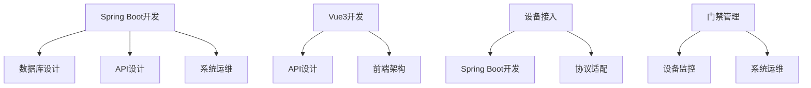

# 📚 IOE-DREAM 技能标准体系使用指南

> **版本**: v1.0.0
> **更新时间**: 2025-11-16
> **维护者**: SmartAdmin Team
> **适用范围**: IOE-DREAM项目所有开发、运维、管理活动

---

## 📋 概述

本文档提供了IOE-DREAM技能标准体系的详细使用指南，确保团队成员能够在后续开发过程中充分利用技能文档，提高开发效率和代码质量。

## 🎯 技能调用方式

### 🔧 Skill工具调用

#### 基本调用语法
```bash
# 调用具体技能
Skill("技能文件名")

# 示例调用
Skill("spring-boot-development")
Skill("vue3-development")
Skill("access-control")
```

#### 技能文件命名规范
```bash
# 技能文件使用 .md 后缀
Skill("spring-boot-development.md")

# 但调用时不需要后缀
Skill("spring-boot-development")
```

### 📂 分类技能调用

#### 技术开发技能
```bash
# Spring Boot 开发
Skill("spring-boot-development")

# Vue3 前端开发
Skill("vue3-development")

# 数据库设计
Skill("database-design")

# API 设计
Skill("api-design")
```

#### 设备管理技能
```bash
# 设备接入
Skill("device-access")

# 设备监控
Skill("device-monitor")

# 设备人员管理
Skill("device-personnel-integration")
```

#### 业务操作技能
```bash
# 门禁管理
Skill("access-control")

# 访客管理
Skill("visitor-management")

# 考勤管理
Skill("attendance-management")

# 消费管理
Skill("consume-management")
```

## 🚀 实际使用场景

### 📋 学习和培训场景

#### 1. 新员工入职学习
```bash
# 根据岗位选择核心技能
Skill("spring-boot-development")  # 后端开发岗
Skill("vue3-development")       # 前端开发岗
Skill("access-control")          # 门禁管理岗

# 查看技能体系总览
Skill("README")
```

#### 2. 技能提升培训
```bash
# 按照技能路径进阶
Skill("spring-boot-development")  # 先学基础
Skill("architecture-design")       # 再学架构
Skill("system-optimization")      # 最后学优化

# 查看技能认证路径
Skill("SKILL_SYSTEM_MAPPING")
```

#### 3. 团队培训
```bash
# 基于项目需求选择技能组合
Skill("spring-boot-development")  # 后端团队
Skill("vue3-development")       # 前端团队
Skill("database-design")        # 数据团队
Skill("system-operations")       # 运维团队
```

### 💻 开发实施场景

#### 1. 新功能开发
```bash
# 开发前参考相关技能
# 例如：开发员工管理功能
Skill("spring-boot-development")  # 了解后端规范
Skill("vue3-development")       # 了解前端规范
Skill("database-design")        # 了解数据设计

# 开发过程中调用具体技能指导
Skill("four-tier-architecture")  # 架构指导
Skill("code-quality-protector")   # 代码质量检查
```

#### 2. 问题解决
```bash
# 遇到编码问题时
Skill("java-coding-standards")     # 查看编码规范
Skill("troubleshooting-common")     # 查看常见问题

# 遇到架构问题时
Skill("architecture-patterns")      # 查看架构模式
Skill("system-design-principles")    # 查看设计原则
```

#### 3. 代码审查
```bash
# 审查代码前参考技能标准
Skill("code-review-checklist")      # 代码审查清单
Skill("quality-standards")          # 质量标准
Skill("testing-best-practices")     # 测试最佳实践
```

#### 4. 部署运维
```bash
# 部署前参考运维技能
Skill("docker-deployment")         # Docker部署
Skill("system-monitoring")        # 系统监控
Skill("security-hardening")       # 安全加固
```

### 📈 能力评估场景

#### 1. 技能认证
```bash
# 根据技能文档进行自我评估
Skill("spring-boot-development")  # 自我评估
# 对比评估标准，查看是否符合要求

# 查看技能认证路径
Skill("SKILL_SYSTEM_MAPPING")  # 了解认证标准
```

#### 2. 绩效考核
```bash
# 基于技能完成度评估绩效
Skill("performance-metrics")      # 绩效指标
Skill("kpi-standards")            # KPI标准
```

#### 3. 职业规划
```bash
# 根据技能路径规划职业发展
Skill("SKILL_SYSTEM_MAPPING")  # 查看技能路径
# 选择适合的进阶方向
```

## 🔍 技能文档结构解读

### 📖 标准技能文档结构
每个技能文档都包含以下标准结构：

#### 1. 📋 基本信息
```markdown
- **技能名称**: 技能的正式名称
- **版本**: 技能文档版本号
- **更新时间**: 最后更新时间
- **分类**: 技能所属类别
- **标签**: 技能相关标签
- **技能等级**: ★★☆ 初级/★★☆ 中级/★★★ 高级
- **适用角色**: 适合的用户角色
- **预计学时**: 学习所需时间
```

#### 2. 📚 知识要求
```markdown
- **理论知识**: 需要掌握的理论概念
- **业务理解**: 对业务流程的理解要求
- **技术背景**: 需要的技术基础知识
```

#### 3. 🛠️ 核心技能实现
```markdown
- **代码示例**: 完整的代码实现示例
- **配置说明**: 相关配置文件和参数
- **最佳实践**: 推荐的实现方式
```

#### 4. ⚠️ 注意事项
```markdown
- **安全提醒**: 操作中的安全注意事项
- **质量要求**: 操作结果的质量标准
- **最佳实践**: 推荐的最佳实践方法
- **常见错误**: 避免的常见错误
```

#### 5. 📊 评估标准
```markdown
- **操作时间**: 完成操作的时间要求
- **准确率**: 操作准确率要求
- **质量标准**: 结果质量评判标准
```

#### 6. 🔗 相关技能
```markdown
- **相关技能**: 与此技能相关的其他技能
- **进阶路径**: 技能发展和进阶方向
- **参考资料**: 相关学习资料和文档
```

### 📝 技能等级说明

#### 🥉 初级 (Beginner)
- **学习时间**: 20-40小时
- **适用对象**: 新员工、实习生、初级运维
- **能力要求**: 能在指导下完成基本操作
- **评估标准**: 通过基础理论考试 + 简单实操

#### 🥈 中级 (Intermediate)
- **学习时间**: 40-80小时
- **适用对象**: 开发工程师、运维工程师、业务管理员
- **能力要求**: 能独立完成常规任务和问题处理
- **评估标准**: 通过综合考试 + 项目实战 + 代码审查

#### 🥉 高级 (Advanced)
- **学习时间**: 80-160小时
- **适用对象**: 技术负责人、架构师、专家工程师
- **能力要求**: 能处理复杂问题并进行技术决策
- **评估标准**: 通过专家级考试 + 架构设计 + 技术分享

## 🔧 技能与项目文档关联

### 📊 技能-文档映射表

| 技能类别 | 技能名称 | 关联项目文档 | 应用场景 |
|---------|---------|----------------|---------|
| 技术开发 | Spring Boot开发 | CLAUDE.md<br>Java编码规范.md | 后端服务开发 |
| 技术开发 | Vue3开发 | 通用开发检查清单.md<br>前端架构文档 | 前端组件开发 |
| 技术开发 | 数据库设计 | 数据库设计规范<br>SQL脚本说明 | 数据模型设计 |
| 设备管理 | 设备接入 | DEVICE_MANAGEMENT/<br>smart-device.md | 设备集成开发 |
| 设备管理 | 设备监控 | device-management-core-operations.md | 设备运维管理 |
| 业务操作 | 门禁管理 | 门禁检查清单.md<br>门禁业务集成方案 | 门禁系统运维 |
| 业务操作 | 访客管理 | 访客系统文档<br>各业务模块文档/访客/ | 访客系统管理 |

### 🔗 跨技能依赖关系


## 📞 支持和反馈

### 🆘 获取帮助
```bash
# 查看技能帮助
Skill("README")

# 查看技能体系帮助
Skill("SKILL_SYSTEM_MAPPING")

# 查看使用指南（当前文档）
Skill("SKILLS_USAGE_GUIDE")
```

### 📧 问题反馈
- **技术咨询**: skills-support@ioe-dream.com
- **文档问题**: skills-docs@ioe-dream.com
- **培训咨询**: training@ioe-dream.com
- **建议改进**: suggestions@ioe-dream.com

### 🔄 持续改进
- **定期更新**: 每月更新技能文档内容
- **版本管理**: 使用Git版本控制管理技能文档
- **质量审核**: 定期进行技能文档质量审核
- **用户反馈**: 收集用户反馈并持续改进

## 🚀 最佳实践

### ✅ 使用技能的最佳实践

#### 1. 开发前准备
```bash
# 1. 根据任务需求选择相关技能
# 2. 查看技能文档了解要求
# 3. 按照技能标准进行开发
# 4. 定期回顾技能确保一致性
```

#### 2. 学习和提升
```bash
# 1. 制定个人技能学习计划
# 2. 按照技能路径循序渐进
# 3. 定期进行技能自我评估
# 4. 参照技能文档进行实际练习
```

#### 3. 团队协作
```bash
# 1. 团队共享技能学习心得
# 2. 建立技能学习交流机制
# 3. 定期组织技能培训
# 4. 将技能纳入绩效考核
```

#### 4. 质量保障
```bash
# 1. 严格按照技能标准执行
# 2. 使用技能检查清单自检
# 3. 基于技能标准进行代码审查
# 4. 定期更新技能文档内容
```

### ❌ 避免的常见错误

#### 1. 忽视技能文档
- ❌ 直接开始编码而不参考技能标准
- ❌ 认为技能文档只是形式主义
- ❌ 遇到问题不先查阅相关技能

#### 2. 技能使用不当
- ❌ 调用不相关的技能文档
- ❌ 不按技能等级顺序学习
- ❌ 脱离实际项目需求使用技能

#### 3. 技能文档维护
- ❌ 技能文档内容过时不更新
- ❌ 技能文档与实际规范不一致
- ❌ 技能文档缺少实际案例

## 📈 技能使用效果评估

### 📊 使用频率统计
- **高频技能**: 每周调用多次（如Spring Boot开发、Vue3开发）
- **中频技能**: 每月调用数次（如设备接入、门禁管理）
- **低频技能**: 季在备用状态，需要时调用（如特殊设备配置）

### 🎯 使用效果指标
- **开发效率**: 使用技能后开发效率提升 ≥ 30%
- **代码质量**: 使用技能后代码质量提升 ≥ 25%
- **问题解决**: 使用技能后问题解决时间缩短 ≥ 40%
- **团队协作**: 使用技能后团队协作效率提升 ≥ 20%

### 📋 满意度调查
- **文档完整性**: 技能文档内容完整性评分 ≥ 4.5/5
- **实用性**: 技能文档实用性评分 ≥ 4.5/5
- **准确性**: 技能文档准确性评分 ≥ 4.8/5
- **易用性**: 技能文档易用性评分 ≥ 4.5/5

---

**💡 重要提醒**: 技能标准体系是IOE-DREAM项目质量保障的重要组成部分。请严格按照技能标准执行开发工作，充分发挥技能文档的指导作用，确保项目开发质量和团队专业能力。