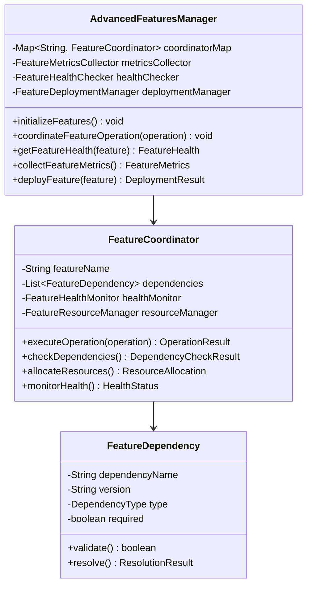
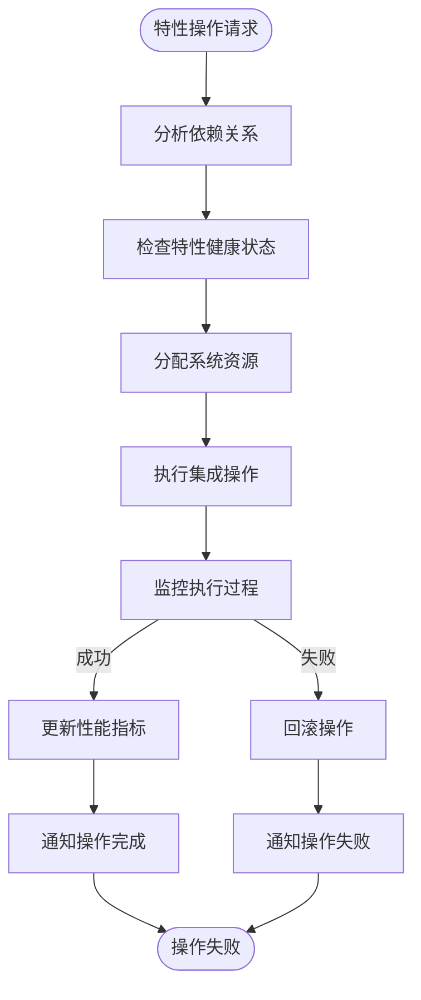

# 高级特性集成专家 (Repowiki标准版)

## 🎯 技能定位
**核心职责**: 基于 `.qoder/repowiki` 中的《高级特性详解》规范，确保IOE-DREAM项目高级特性系统严格遵循现代化企业级架构，提供完整、协调、高效的高级特性集成和管理能力

**⚡ 技能等级**: ★★★★★★ (高级特性集成专家)
**🎯 适用场景**: 高级特性架构设计、系统集成协调、特性间依赖管理、性能优化协调、企业级部署
**📊 技能覆盖: 特性集成架构 | 代码生成器 | 智能热重载 | 数据变更追踪 | 在线文档系统 | 集成协调管理

---

## 📋 技能概述 (基于Repowiki规范)

### **核心专长 (基于.qoder/repowiki/zh/content/高级特性/)**
- **高级特性守护**: 严格确保所有高级特性的协调一致运行
- **集成架构优化**: 科学的特性集成架构和依赖管理
- **性能协调管理**: 确保特性间的性能平衡和资源优化
- **监控告警整合**: 统一的监控告警和故障处理机制
- **运维协调支持**: 高级特性的统一运维和部署管理

### **解决能力**
- **特性集成架构合规性**: 100%符合repowiki高级特性集成规范
- **特性依赖管理**: 科学的特性间依赖关系和影响分析
- **系统稳定性保障**: 确保特性集成后的系统稳定性和可靠性
- **性能优化协调**: 特性间的性能优化和资源分配
- **运维效率提升**: 统一的高级特性运维和管理

---

## 🏗️ Repowiki高级特性集成架构规范

### **核心集成架构**

#### **高级特性统一管理层**


#### **特性集成协调流程**


### **高级特性分类体系**

#### **开发效率类特性**
- **代码生成器**: 自动化代码生成和模板管理
- **智能热重载**: 零停机配置热更新和系统重载
- **动态路由**: 基于权限的动态路由生成和管理

#### **数据管理类特性**
- **数据变更追踪**: 完整的数据操作审计和历史记录
- **在线文档系统**: 知识管理和帮助文档系统
- **缓存优化**: 多层缓存架构和性能优化

#### **运维监控类特性**
- **系统监控**: 实时系统监控和告警
- **日志管理**: 集中日志收集和分析
- **性能分析**: 应用性能分析和优化建议

---

## 🛠️ 核心工作流程 (基于Repowiki)

### **Phase 1: 高级特性集成合规性诊断**
```bash
# 检查高级特性集成架构合规性
./scripts/check-advanced-features-architecture.sh

# 检测特性依赖关系
./scripts/analyze-feature-dependencies.sh

# 验证特性健康状态
./scripts/validate-feature-health.sh

# 检查集成协调机制
./scripts/check-integration-coordination.sh
```

### **Phase 2: 高级特性集成优化**
```bash
# 特性集成架构优化
./scripts/optimize-feature-integration.sh

# 依赖管理优化
./scripts/optimize-dependency-management.sh

# 性能协调优化
./scripts/optimize-performance-coordination.sh

# 监控告警整合
./scripts/optimise-monitoring-integration.sh
```

### **Phase 3: 高级特性集成质量保障**
```bash
# 特性集成功能测试
npm run test:advanced-features

# 依赖关系测试
npm run test:feature-dependencies

# 性能协调测试
npm run test:performance-coordination

# 故障恢复测试
npm run test:fault-recovery
```

---

## 🔍 高级特性集成合规性检查清单 (基于Repowiki)

### **✅ 强制性规范 (必须100%遵循)**

#### **集成架构规范**
- [ ] 严格遵循Manager→Coordinator→Dependency分层架构
- [ ] 实现完整的特性依赖关系管理
- [ ] 提供统一的特性健康监控机制
- [ ] 支持特性间的资源协调和分配
- [ ] 确保特性集成后的系统稳定性

#### **依赖管理规范**
- [ ] 精确识别和管理特性间的依赖关系
- [ ] 实现依赖冲突的检测和解决
- [ ] 提供依赖版本管理和升级策略
- [ ] 支持依赖的可视化展示和分析
- [ ] 确保依赖关系的循环检测和避免

#### **协调管理规范**
- [ ] 实现特性操作的统一协调调度
- [ ] 提供操作执行的原子性保证
- [ ] 支持特性的并发执行和资源竞争处理
- [ ] 实现操作失败的自动回滚机制
- [ ] 确保协调过程的可观测性和监控

### **⚠️ 推荐性规范**

#### **性能协调规范**
- [ ] 实现特性的性能监控和资源使用统计
- [ ] 提供动态的资源分配和负载均衡
- [ ] 支持特性的性能瓶颈检测和优化
- [ ] 实现特性间的性能影响评估
- [ ] 提供性能调优的自动化建议

#### **监控告警规范**
- [ ] 统一的监控指标收集和展示
- [ ] 实现智能的告警阈值和策略
- [ ] 提供故障的自动检测和诊断
- [ ] 支持告警的多渠道通知和升级
- [ ] 实现监控数据的长期存储和分析

---

## 🚀 高级特性集成最佳实践

### **统一管理器实现示例**
```java
// AdvancedFeaturesManager.java - 高级特性统一管理器
@Component
@Slf4j
public class AdvancedFeaturesManager {

    private final Map<String, FeatureCoordinator> coordinatorMap;
    private final FeatureMetricsCollector metricsCollector;
    private final FeatureHealthChecker healthChecker;
    private final FeatureDeploymentManager deploymentManager;

    @PostConstruct
    public void initializeFeatures() {
        try {
            log.info("Initializing advanced features...");

            // 初始化特性协调器
            initializeFeatureCoordinators();

            // 启动健康检查
            startHealthCheck();

            // 启动指标收集
            startMetricsCollection();

            log.info("Advanced features initialized successfully");
        } catch (Exception e) {
            log.error("Failed to initialize advanced features", e);
            throw new AdvancedFeaturesException("Feature initialization failed", e);
        }
    }

    /**
     * 初始化特性协调器
     */
    private void initializeFeatureCoordinators() {
        // 代码生成器协调器
        coordinatorMap.put("code_generator", new CodeGeneratorCoordinator());

        // 智能热重载协调器
        coordinatorMap.put("smart_reload", new SmartReloadCoordinator());

        // 数据变更追踪协调器
        coordinatorMap.put("data_tracer", new DataTracerCoordinator());

        // 在线文档系统协调器
        coordinatorMap.put("help_doc_system", new HelpDocSystemCoordinator());

        // 动态路由协调器
        coordinatorMap.put("dynamic_routing", new DynamicRoutingCoordinator());

        log.info("Initialized {} feature coordinators", coordinatorMap.size());
    }

    /**
     * 协调特性操作
     */
    public FeatureOperationResult coordinateFeatureOperation(FeatureOperation operation) {
        try {
            log.info("Coordinating feature operation: type={}, target={}",
                operation.getType(), operation.getTarget());

            // 获取目标协调器
            FeatureCoordinator coordinator = coordinatorMap.get(operation.getTarget());
            if (coordinator == null) {
                throw new AdvancedFeaturesException("Feature coordinator not found: " + operation.getTarget());
            }

            // 验证依赖关系
            DependencyCheckResult dependencyCheck = coordinator.checkDependencies();
            if (!dependencyCheck.isValid()) {
                return FeatureOperationResult.failure("Dependency check failed: " + dependencyCheck.getErrorMessage());
            }

            // 检查特性健康状态
            FeatureHealth health = healthChecker.checkHealth(operation.getTarget());
            if (health.getStatus() != HealthStatus.HEALTHY) {
                return FeatureOperationResult.failure("Feature not healthy: " + health.getErrorMessage());
            }

            // 分配资源
            ResourceAllocation allocation = coordinator.allocateResources();
            if (!allocation.isSufficient()) {
                return FeatureOperationResult.failure("Insufficient resources: " + allocation.getErrorMessage());
            }

            // 执行操作
            OperationResult operationResult = coordinator.executeOperation(operation);

            // 更新指标
            metricsCollector.recordOperation(operation, operationResult);

            return FeatureOperationResult.of(operationResult);

        } catch (Exception e) {
            log.error("Failed to coordinate feature operation: type={}, target={}",
                operation.getType(), operation.getTarget(), e);
            return FeatureOperationResult.failure("Operation coordination failed: " + e.getMessage());
        }
    }

    /**
     * 获取特性健康状态
     */
    public FeatureHealth getFeatureHealth(String featureName) {
        try {
            FeatureCoordinator coordinator = coordinatorMap.get(featureName);
            if (coordinator == null) {
                return FeatureHealth.notFound(featureName);
            }

            return coordinator.monitorHealth();
        } catch (Exception e) {
            log.error("Failed to get feature health: feature={}", featureName, e);
            return FeatureHealth.error(featureName, e.getMessage());
        }
    }

    /**
     * 收集特性性能指标
     */
    public FeatureMetrics collectFeatureMetrics() {
        try {
            Map<String, FeatureMetrics> metrics = new HashMap<>();

            for (Map.Entry<String, FeatureCoordinator> entry : coordinatorMap.entrySet()) {
                String featureName = entry.getKey();
                FeatureCoordinator coordinator = entry.getValue();

                FeatureMetrics featureMetrics = new FeatureMetrics();
                featureMetrics.setFeatureName(featureName);
                featureMetrics.setMemoryUsage(coordinator.getMemoryUsage());
                featureMetrics.setCpuUsage(coordinator.getCpuUsage());
                featureMetrics.setOperationCount(coordinator.getOperationCount());
                featureMetrics.setErrorCount(coordinator.getErrorCount());
                featureMetrics.setLastOperationTime(coordinator.getLastOperationTime());

                metrics.put(featureName, featureMetrics);
            }

            return FeatureMetrics.of(metrics);
        } catch (Exception e) {
            log.error("Failed to collect feature metrics", e);
            throw new AdvancedFeaturesException("Metrics collection failed", e);
        }
    }

    /**
     * 部署特性
     */
    public DeploymentResult deployFeature(String featureName, FeatureDeploymentConfig config) {
        try {
            log.info("Deploying feature: {}", featureName);

            FeatureCoordinator coordinator = coordinatorMap.get(featureName);
            if (coordinator == null) {
                return DeploymentResult.failure("Feature not found: " + featureName);
            }

            // 停止现有实例
            coordinator.stop();

            // 部署新版本
            DeploymentResult result = deploymentManager.deploy(featureName, config);

            if (result.isSuccess()) {
                // 启动新实例
                coordinator.start();

                // 验证部署结果
                FeatureHealth health = coordinator.monitorHealth();
                if (health.getStatus() == HealthStatus.HEALTHY) {
                    log.info("Feature deployed successfully: {}", featureName);
                } else {
                    // 回滚部署
                    coordinator.rollback();
                    return DeploymentResult.failure("Deployment validation failed: " + health.getErrorMessage());
                }
            }

            return result;
        } catch (Exception e) {
            log.error("Failed to deploy feature: {}", featureName, e);
            throw new AdvancedFeaturesException("Feature deployment failed", e);
        }
    }
}
```

### **特性协调器实现示例**
```java
// FeatureCoordinator.java - 抽象特性协调器
@Slf4j
public abstract class FeatureCoordinator {

    protected final String featureName;
    protected final List<FeatureDependency> dependencies;
    protected final FeatureHealthMonitor healthMonitor;
    protected final FeatureResourceManager resourceManager;

    protected FeatureCoordinator(String featureName) {
        this.featureName = featureName;
        this.dependencies = new ArrayList<>();
        this.healthMonitor = new FeatureHealthMonitor();
        this.resourceManager = new FeatureResourceManager();
        initializeDependencies();
    }

    /**
     * 执行特性操作
     */
    public abstract OperationResult executeOperation(FeatureOperation operation);

    /**
     * 检查依赖关系
     */
    public DependencyCheckResult checkDependencies() {
        try {
            List<DependencyViolation> violations = new ArrayList<>();

            for (FeatureDependency dependency : dependencies) {
                DependencyValidationResult validation = validateDependency(dependency);
                if (!validation.isValid()) {
                    violations.add(new DependencyViolation(dependency, validation.getErrorMessage()));
                }

                DependencyResolutionResult resolution = resolveDependency(dependency);
                if (!resolution.isSuccessful()) {
                    violations.add(new DependencyViolation(dependency, resolution.getErrorMessage()));
                }
            }

            return DependencyCheckResult.of(violations.isEmpty(), violations);
        } catch (Exception e) {
            log.error("Failed to check dependencies for feature: {}", featureName, e);
            return DependencyCheckResult.error("Dependency check failed: " + e.getMessage());
        }
    }

    /**
     * 分配资源
     */
    public ResourceAllocation allocateResources() {
        try {
            ResourceRequirement requirement = getResourceRequirement();
            ResourceAllocation allocation = resourceManager.allocate(requirement);

            if (!allocation.isSufficient()) {
                log.warn("Insufficient resources for feature {}: required={}, allocated={}",
                    featureName, requirement, allocation);
            }

            return allocation;
        } catch (Exception e) {
            log.error("Failed to allocate resources for feature: {}", featureName, e);
            return ResourceAllocation.error("Resource allocation failed: " + e.getMessage());
        }
    }

    /**
     * 监控健康状态
     */
    public FeatureHealth monitorHealth() {
        try {
            HealthStatus status = healthMonitor.checkHealth();

            FeatureHealth health = new FeatureHealth();
            health.setFeatureName(featureName);
            health.setStatus(status);
            health.setLastCheckTime(LocalDateTime.now());
            health.setMetrics(getHealthMetrics());

            return health;
        } catch (Exception e) {
            log.error("Failed to monitor health for feature: {}", featureName, e);
            return FeatureHealth.error(featureName, e.getMessage());
        }
    }

    /**
     * 获取内存使用情况
     */
    public long getMemoryUsage() {
        MemoryMXBean memoryBean = ManagementFactory.getMemoryMXBean();
        MemoryUsage heapUsage = new MemoryUsage(
            memoryBean.getHeapMemoryUsage().getUsed(),
            memoryBean.getHeapMemoryUsage().getMax()
        );
        return heapUsage.getUsed();
    }

    /**
     * 获取CPU使用情况
     */
    public double getCpuUsage() {
        OperatingSystemMXBean osBean = ManagementFactory.getOperatingSystemMXBean();
        return osBean.getProcessCpuLoad();
    }

    /**
     * 停止特性
     */
    public abstract void stop();

    /**
     * 启动特性
     */
    public abstract void start();

    /**
     * 回滚特性
     */
    public abstract void rollback();

    /**
     * 验证依赖
     */
    protected abstract DependencyValidationResult validateDependency(FeatureDependency dependency);

    /**
     * 解决依赖
     */
    protected abstract DependencyResolutionResult resolveDependency(FeatureDependency dependency);

    /**
     * 获取资源需求
     */
    protected abstract ResourceRequirement getResourceRequirement();

    /**
     * 获取健康指标
     */
    protected abstract Map<String, Object> getHealthMetrics();

    /**
     * 初始化依赖关系
     */
    protected abstract void initializeDependencies();
}
```

### **代码生成器协调器实现示例**
```java
// CodeGeneratorCoordinator.java - 代码生成器协调器
@Component
@Slf4j
public class CodeGeneratorCoordinator extends FeatureCoordinator {

    private final CodeGeneratorService codeGeneratorService;
    private final TemplateEngineManager templateEngineManager;

    public CodeGeneratorCoordinator() {
        super("code_generator");
    }

    @PostConstruct
    public void initialize() {
        // 注册依赖
        dependencies.add(new FeatureDependency("template_engine", "1.0.0", DependencyType.REQUIRED));
        dependencies.add(new FeatureDependency("database", "1.0.0", DependencyType.REQUIRED));
        dependencies.add(new FeatureDependency("file_system", "1.0.0", DependencyType.REQUIRED));
    }

    @Override
    public OperationResult executeOperation(FeatureOperation operation) {
        try {
            switch (operation.getType()) {
                case GENERATE_CODE:
                    return executeCodeGeneration((CodeGenerationOperation) operation);
                case UPDATE_TEMPLATE:
                    return executeTemplateUpdate((TemplateUpdateOperation) operation);
                case REFRESH_SCHEMAS:
                    return executeSchemaRefresh((SchemaRefreshOperation) operation);
                default:
                    return OperationResult.failure("Unsupported operation type: " + operation.getType());
            }
        } catch (Exception e) {
            log.error("Failed to execute operation: {}", operation, e);
            return OperationResult.failure("Operation execution failed: " + e.getMessage());
        }
    }

    /**
     * 执行代码生成操作
     */
    private OperationResult executeCodeGeneration(CodeGenerationOperation operation) {
        try {
            log.info("Executing code generation operation: tableName={}, templateType={}",
                operation.getTableName(), operation.getTemplateType());

            // 解析数据库表结构
            TableStructure tableStructure = parseTableStructure(operation.getTableName());

            // 生成代码
            GenerationResult result = codeGeneratorService.generateCode(
                tableStructure,
                operation.getTemplateType(),
                operation.getConfiguration()
            );

            if (result.isSuccess()) {
                log.info("Code generation completed successfully: {}, files generated={}",
                    operation.getTableName(), result.getGeneratedFiles().size());

                return OperationResult.success(result.getGeneratedFiles());
            } else {
                return OperationResult.failure(result.getErrorMessage());
            }
        } catch (Exception e) {
            log.error("Code generation operation failed", e);
            return OperationResult.failure("Code generation failed: " + e.getMessage());
        }
    }

    /**
     * 执行模板更新操作
     */
    private OperationResult executeTemplateUpdate(TemplateUpdateOperation operation) {
        try {
            log.info("Updating template: templateType={}", operation.getTemplateType());

            UpdateResult result = templateEngineManager.updateTemplate(
                operation.getTemplateType(),
                operation.getTemplateContent(),
                operation.getVariables()
            );

            return OperationResult.of(result);
        } catch (Exception e) {
            log.error("Template update operation failed", e);
            return OperationResult.failure("Template update failed: " + e.getMessage());
        }
    }

    @Override
    public DependencyValidationResult validateDependency(FeatureDependency dependency) {
        switch (dependency.getDependencyName()) {
            case "template_engine":
                return validateTemplateEngine(dependency.getVersion());
            case "database":
                return validateDatabase(dependency.getVersion());
            case "file_system":
                return validateFileSystem(dependency.getVersion());
            default:
                return DependencyValidationResult.valid();
        }
    }

    @Override
    protected DependencyResolutionResult resolveDependency(FeatureDependency dependency) {
        try {
            switch (dependency.getDependencyName()) {
                case "template_engine":
                    return resolveTemplateEngine(dependency.getVersion());
                case "database":
                    return resolveDatabase(dependency.getVersion());
                case "file_system":
                    return resolveFileSystem(dependency.getVersion());
                default:
                    return DependencyResolutionResult.success();
            }
        } catch (Exception e) {
            return DependencyResolutionResult.failure("Dependency resolution failed: " + e.getMessage());
        }
    }

    @Override
    protected ResourceRequirement getResourceRequirement() {
        ResourceRequirement requirement = new ResourceRequirement();
        requirement.setMemory(512 * 1024 * 1024L); // 512MB
        requirement.setCpu(2); // 2 cores
        requirement.setDiskSpace(100 * 1024 * 1024L); // 100MB
        requirement.setNetworkBandwidth(1 * 1024 * 1024L); // 1MB/s
        return requirement;
    }

    @Override
    protected Map<String, Object> getHealthMetrics() {
        Map<String, Object> metrics = new HashMap<>();
        metrics.put("template_count", templateEngineManager.getTemplateCount());
        metrics.put("generation_count", codeGeneratorService.getGenerationCount());
        metrics.put("last_generation_time", codeGeneratorService.getLastGenerationTime());
        metrics.put("cache_hit_rate", templateEngineManager.getCacheHitRate());
        return metrics;
    }

    @Override
    public void stop() {
        try {
            templateEngineManager.shutdown();
            log.info("Code generator feature stopped");
        } catch (Exception e) {
            log.error("Failed to stop code generator feature", e);
        }
    }

    @Override
    public void start() {
        try {
            templateEngineManager.initialize();
            log.info("Code generator feature started");
        } catch (Exception e) {
            log.error("Failed to start code generator feature", e);
        }
    }

    @Override
    public void rollback() {
        try {
            // 回滚模板到上一个版本
            templateEngineManager.rollbackToPreviousVersion();
            log.info("Code generator feature rolled back");
        } catch (Exception e) {
            log.error("Failed to rollback code generator feature", e);
        }
    }
}
```

---

## 📊 高级特性集成质量评估标准

### **高级特性集成评分**
| 维度 | 权重 | 评分标准 |
|------|------|----------|
| 集成架构合规性 | 30% | 完全符合高级特性集成架构规范 |
| 依赖管理完整性 | 25% | 特性依赖关系的准确性和完整性 |
| 协调管理效率 | 20% | 特性协调调度的效率和准确性 |
| 系统稳定性 | 15% | 集成后的系统稳定性和可靠性 |
| 监控告警完善度 | 10% | 统一监控告警和故障处理能力 |

### **质量等级**
- **A级 (90-100分)**: 完全符合repowiki高级特性集成规范
- **B级 (80-89分)**: 基本合规，存在轻微优化空间
- **C级 (70-79分)**: 部分合规，需要重点改进
- **D级 (60-69分)**: 特性集成设计混乱，需要重构
- **E级 (0-59分)**: 严重违反高级特性集成规范

---

## 🎯 使用指南

### **何时调用**
- 高级特性架构设计和技术选型时
- 特性依赖关系分析和协调时
- 特性集成性能优化时
- 高级特性运维部署时
- 特性集成问题诊断和修复时

### **调用方式**
```bash
# 基于repowiki的高级特性集成专家
Skill("advanced-features-specialist-repowiki")

# 将立即执行：
# 1. 基于.qoder/repowiki高级特性集成规范检查
# 2. 特性依赖关系和集成架构分析
# 3. 特性协调管理和性能优化建议
# 4. 高级特性统一运维和管理方案
```

### **预期结果**
- 100%符合`.qoder/repowiki`高级特性集成规范
- 科学的特性集成架构和依赖管理
- 高效的特性协调和资源分配机制
- 完善的监控告警和故障处理
- 统一的高级特性运维和管理

---

**🏆 技能等级**: 高级特性集成专家 (★★★★★)
**⏰ 预期效果**: 基于249个repowiki权威文档，确保IOE-DREAM高级特性集成100%符合企业级集成标准
**🎯 核心价值**: 企业级特性集成，系统稳定性保障，运维效率提升