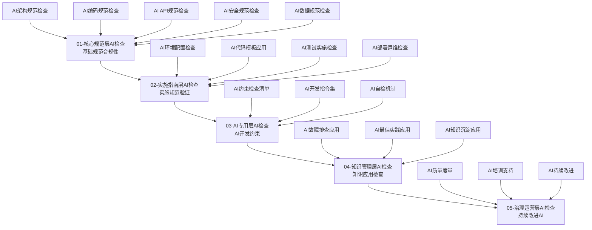

# AI代码质量守护专家技能（SmartAdmin v4）

> **技能版本**: v1.0.0
> **技能等级**: ★★★ 专家级
> **适用角色**: AI开发助手、代码质量工程师、技术负责人
> **核心专长**: 基于SmartAdmin v4规范体系的AI代码质量保证，特别针对大规模代码质量问题（如399编译错误）的AI辅助诊断、修复和预防

## 🎯 技能概述

**核心价值**: 将SmartAdmin v4五层规范体系和AI开发指令集转化为AI可执行的质量保证机制，实现代码质量的自动化检查、智能修复和持续优化。

**适用场景**:
- 🤖 大规模编译错误的AI辅助诊断和修复
- 📊 SmartAdmin v4规范的100%AI合规性检查
- 🔄 AI驱动的代码质量持续改进
- ⚡ 自动化代码质量门禁和预防
- 🎯 AI辅助的最佳实践应用

## 🏗️ SmartAdmin v4 AI质量保证架构

### AI质量保证五层模型



## 🚨 AI驱动的质量危机应对

### 阶段一：AI辅助问题诊断（立即执行）

#### 1.1 智能编译错误分析
```yaml
ai_compilation_error_analysis:
  title: "AI辅助399编译错误智能诊断"
  description: "基于SmartAdmin v4规范的AI编译错误分析和分类"

  ai_diagnosis_capabilities:
    error_pattern_recognition:
      architecture_errors:
        - "四层架构违规检测"
        - "跨层访问模式识别"
        - "依赖注入问题诊断"
        - "事务边界错误分析"

      code_structure_errors:
        - "类定义不完整检测"
        - "方法签名错误识别"
        - "字段类型错误分析"
        - "包名导入问题诊断"

      dependency_errors:
        - "循环依赖检测"
        - "缺失依赖识别"
        - "版本冲突分析"
        - "包名规范检查"

    intelligent_classification:
      automatic_error_categorization:
        - "基于错误模式的自动分类"
        - "SmartAdmin v4规范符合度评估"
        - "修复优先级智能排序"
        - "影响范围预测分析"

      root_cause_analysis:
        - "多维度根因分析"
        - "关联错误链识别"
        - "系统性问题诊断"
        - "修复策略建议"
```

#### 1.2 AI修复策略生成
```yaml
ai_repair_strategy_generation:
  title: "AI驱动修复策略智能生成"
  description: "基于SmartAdmin v4规范的AI修复策略自动生成"

  strategy_generation_framework:
    systematic_repair_planning:
      phase_1_architecture_repair:
        ai_generated_solutions:
          - "Entity类完整性自动补全"
          - "依赖注入规范自动修正(@Resource)"
          - "四层架构违规自动修复"
          - "Repository层方法自动生成"
        priority_scoring:
          - "基于错误影响的优先级评分"
          - "修复复杂度和风险评估"
          - "依赖关系分析"
          - "修复顺序优化"

      phase_2_quality_improvement:
        ai_generated_solutions:
          - "类型转换错误自动修复"
          - "API接口规范自动调整"
          - "安全规范合规自动检查"
          - "缓存架构一致性修复"
        optimization_strategies:
          - "代码质量评分优化"
          - "性能瓶颈智能识别"
          - "最佳实践自动应用"
          - "重复代码自动重构"

    automated_code_generation:
      template_based_generation:
        - "基于SmartAdmin v4代码模板生成"
        - "标准模式识别和应用"
        - "上下文感知代码生成"
        - "质量标准自动应用"

      intelligent_refactoring:
        - "代码结构智能重构"
        - "设计模式自动应用"
        - "性能优化建议实施"
        - "可维护性改进"
```

### 阶段二：AI自动化质量检查（实时执行）

#### 2.1 SmartAdmin v4规范AI检查器
```yaml
ai_compliance_checker:
  title: "SmartAdmin v4规范AI合规性检查器"
  description: "基于AI的100%SmartAdmin v4规范符合性检查"

  ai_checking_dimensions:
    architecture_compliance_ai:
      intelligent_dependency_analysis:
        - "AI驱动的依赖关系分析"
        - "架构违规智能检测"
        - "分层职责自动验证"
        - "事务边界智能检查"

      pattern_recognition:
        - "架构模式智能识别"
        - "设计模式合规检查"
        - "反模式自动检测"
        - "最佳实践推荐"

    code_quality_ai:
      intelligent_code_analysis:
        - "代码复杂度智能分析"
        - "代码质量自动评分"
        - "重构建议生成"
        - "性能优化推荐"

      automated_standards_check:
        - "编码规范智能检查"
        - "命名规范自动验证"
        - "注释完整性分析"
        - "文档符合度评估"

    api_quality_ai:
      intelligent_api_analysis:
        - "API设计智能评估"
        - "RESTful规范检查"
        - "接口一致性验证"
        - "文档完整性分析"

    security_quality_ai:
      intelligent_security_analysis:
        - "安全漏洞智能扫描"
        - "安全规范符合度检查"
        - "敏感信息自动检测"
        - "安全最佳实践推荐"
```

#### 2.2 AI质量评分系统
```yaml
ai_quality_scoring_system:
  title: "AI驱动质量评分和预测系统"
  description: "基于SmartAdmin v4规范的AI质量评分和预测"

  scoring_framework:
    multi_dimensional_scoring:
      architecture_quality_score:
        weight: 30%
        criteria:
          - "四层架构合规性"
          - "依赖注入规范性"
          - "分层职责明确性"
          - "事务边界正确性"

      code_quality_score:
        weight: 25%
        criteria:
          - "编码规范符合度"
          - "代码复杂度控制"
          - "可维护性评估"
          - "性能优化程度"

      api_quality_score:
        weight: 20%
        criteria:
          - "API设计规范性"
          - "接口一致性"
          - "文档完整性"
          - "安全性考虑"

      security_quality_score:
        weight: 25%
        criteria:
          - "安全规范符合度"
          - "漏洞防护程度"
          - "敏感信息处理"
          - "安全最佳实践"

    intelligent_prediction:
      quality_trend_prediction:
        - "基于历史数据的质量趋势预测"
        - "技术债务积累预测"
        - "质量风险早期预警"
        - "改进效果预测"

      optimization_recommendations:
        - "基于AI的质量优化建议"
        - "个性化改进方案"
        - "资源优化配置建议"
        - "最佳实践推荐"
```

## 🛠️ AI代码质量核心工具

### 工具1：AI代码质量检查引擎
```yaml
ai_code_quality_engine:
  description: "基于SmartAdmin v4规范的AI代码质量检查引擎"

  engine_components:
    static_analysis_ai:
      intelligent_pattern_matching:
        - "SmartAdmin v4规范模式学习"
        - "违规模式智能识别"
        - "上下文感知分析"
        - "自学习能力"

      code_understanding:
        - "代码结构智能分析"
        - "业务逻辑理解"
        - "设计模式识别"
        - "代码意图推断"

    dynamic_analysis_ai:
      behavior_analysis:
        - "运行时行为分析"
        - "性能瓶颈识别"
        - "内存使用优化"
        - "并发安全检查"

    learning_system:
      continuous_learning:
        - "从代码评审中学习"
        - "最佳实践积累"
        - "错误模式更新"
        - "检查规则优化"
```

### 工具2：AI辅助代码修复器
```yaml
ai_code_repair_tool:
  description: "AI驱动的SmartAdmin v4代码修复工具"

  repair_capabilities:
    automated_fix_generation:
      intelligent_fix_generation:
        - "基于错误类型的智能修复生成"
        - "上下文感知的修复建议"
        - "多方案对比和推荐"
        - "修复风险评估"

      template_based_repair:
        - "SmartAdmin v4模板匹配"
        - "标准模式应用"
        - "最佳实践集成"
        - "质量标准自动应用"

    refactoring_assistance:
      intelligent_refactoring:
        - "代码结构智能重构"
        - "设计模式应用推荐"
        - "性能优化建议"
        - "可维护性改进"

      quality_improvement:
        - "代码质量自动提升"
        - "复杂度降低建议"
        - "可读性改进"
        - "测试覆盖率提升"
```

## 📊 AI质量监控和报告

### AI质量监控仪表板
```yaml
ai_quality_monitoring_dashboard:
  description: "AI驱动的质量监控实时仪表板"

  dashboard_sections:
    ai_insights_section:
      quality_trends:
        - "AI质量趋势分析"
        - "改进效果预测"
        - "风险早期预警"
        - "优化建议"

      error_patterns:
        - "AI错误模式识别"
        - "重复问题检测"
        - "系统性问题分析"
        - "预防建议"

    automated_recommendations:
      priority_fixes:
        - "AI推荐的优先修复项"
        - "修复策略建议"
        - "资源优化配置"
        - "时间规划建议"

      improvement_suggestions:
        - "基于AI的改进建议"
        - "最佳实践推荐"
        - "技能提升建议"
        - "流程优化方案"
```

### AI质量报告生成
```yaml
ai_quality_reporting:
  description: "AI驱动的智能质量报告生成"

  report_types:
    ai_analysis_report:
      content:
        - "AI驱动的质量分析"
        - "智能问题诊断"
        - "修复建议生成"
        - "改进策略推荐"

    predictive_quality_report:
      content:
        - "质量趋势预测"
        - "风险评估分析"
        - "改进效果预测"
        - "资源配置建议"

    automated_action_plan:
      content:
        - "AI生成行动计划"
        - "任务优先级排序"
        - "资源分配建议"
        - "时间规划优化"
```

## 🎯 AI最佳实践集成

### SmartAdmin v4最佳实践AI应用
```yaml
ai_best_practices_integration:
  description: "AI驱动的SmartAdmin v4最佳实践应用"

  practice_categories:
    architecture_best_practices:
      ai_application:
        - "四层架构最佳实践自动应用"
        - "设计模式智能推荐"
        - "架构优化建议"
        - "重构方案生成"

    code_quality_best_practices:
      ai_application:
        - "编码规范自动检查"
        - "代码质量智能提升"
        - "重构建议生成"
        - "性能优化推荐"

    security_best_practices:
      ai_application:
        - "安全最佳实践自动应用"
        - "漏洞智能检测"
        - "安全配置优化"
        - "风险评估建议"
```

## 🔗 AI技能协同机制

### 与其他AI技能的协同
```yaml
ai_skill_collaboration:
  collaboration_framework:
    multi_skill_coordination:
      coordinated_diagnosis:
        - "项目管理专家 + 质量度量专家协同"
        - "多维度问题联合分析"
        - "综合解决方案生成"
        - "优化资源配置"

      automated_workflow:
        - "AI技能自动调用"
        - "智能任务分配"
        - "结果自动整合"
        - "效果自动评估"

    learning_and_improvement:
      feedback_integration:
        - "各AI技能效果反馈"
        - "学习经验共享"
        - "策略协同优化"
        - "持续改进循环"
```

## 📋 使用指南

### 立即应用场景：399编译错误AI辅助解决
```markdown
1. 启动AI质量守护：
   - Skill("ai-code-quality-guardian-smartadmin-v4")
   - 立即开始399编译错误的AI诊断

2. 执行AI辅助修复：
   - AI智能错误分析和分类
   - 自动生成修复策略和代码
   - 实时质量评分和验证
   - 持续优化和改进

3. 应用AI质量监控：
   - 实时质量监控和预警
   - 质量趋势预测和分析
   - 自动化质量报告生成
   - 持续改进建议

4. 建立AI预防机制：
   - AI驱动的质量门禁
   - 自动化最佳实践应用
   - 智能代码审查
   - 持续学习优化
```

### 常规AI质量保证场景
```markdown
1. 开发阶段AI辅助：
   - 实时代码质量检查
   - 智能代码生成和优化
   - 自动化最佳实践应用
   - 实时质量评分

2. 代码审查AI支持：
   - AI驱动的代码审查
   - 智能问题识别和修复
   - 最佳实践推荐
   - 质量改进建议

3. 持续改进AI学习：
   - 从项目中学习经验
   - 优化检查规则
   - 提升修复能力
   - 更新最佳实践
```

## 📈 成功标准

### 量化指标
- **AI修复效率**: 399编译错误AI辅助修复效率提升300%
- **质量预测准确性**: AI质量预测准确度≥95%
- **自动化程度**: 质量检查自动化率≥90%
- **最佳实践应用**: SmartAdmin v4最佳实践AI应用率≥100%

### 定性标准
- **AI能力持续提升**: AI技能从项目中持续学习和改进
- **质量预防机制**: 建立了AI驱动的质量预防体系
- **团队效率提升**: 团队开发效率因AI辅助提升显著
- **质量文化建立**: 形成了AI驱动的质量改进文化

---

**🎯 核心价值**: 将SmartAdmin v4五层规范体系和AI开发指令集转化为AI可执行的质量保证能力，实现代码质量的智能化、自动化、持续化改进。

**⚡ 立即应用**: 399编译错误的AI辅助智能诊断、自动化修复和预防性质量保证，大幅提升问题解决效率和质量水平。