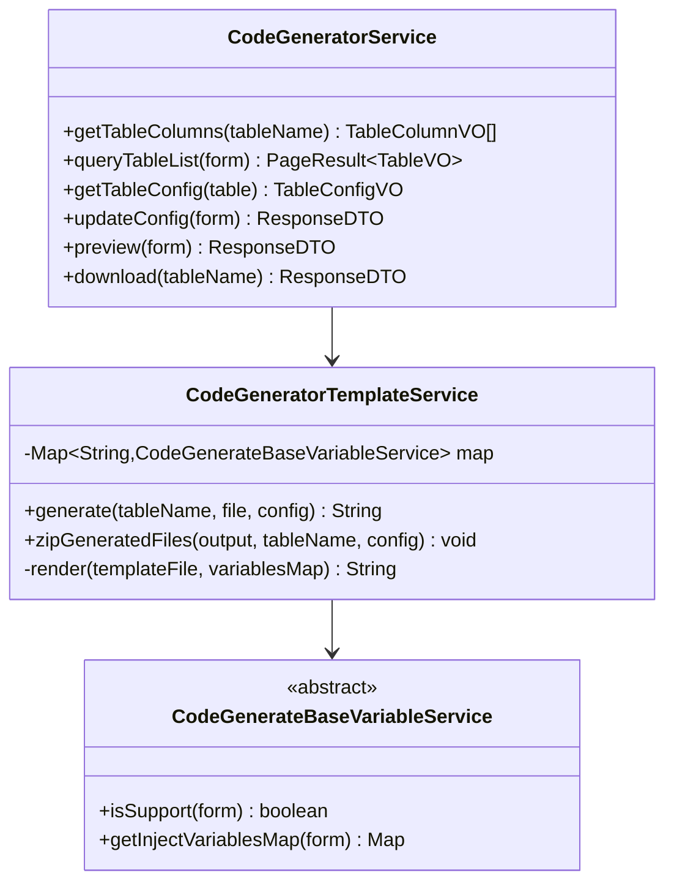
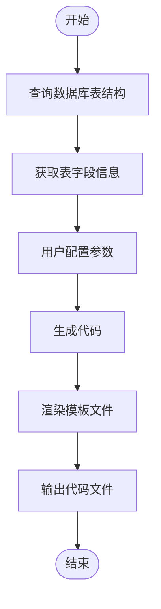

# 代码生成器专家 (Repowiki标准版)

## 🎯 技能定位
**核心职责**: 基于 `.qoder/repowiki` 中的《代码生成器详解》规范，确保IOE-DREAM项目代码生成器严格遵循模板驱动架构，提供高效、一致、可扩展的代码自动化生成能力

**⚡ 技能等级**: ★★★★★ (代码生成器专家)
**🎯 适用场景**: 代码生成器设计、模板引擎配置、前后端代码自动生成、自定义模板开发、代码生成优化
**📊 技能覆盖**: Velocity模板引擎 | 数据库表结构解析 | 代码生成流程 | 模板变量替换 | 自定义模板扩展

---

## 📋 技能概述 (基于Repowiki规范)

### **核心专长 (基于.qoder/repowiki/zh/content/高级特性/代码生成器.md)**
- **代码生成器守护**: 严格确保模板驱动的代码生成架构
- **模板引擎优化**: Apache Velocity模板引擎的高效配置和使用
- **数据库解析**: 智能的数据库表结构解析和类型映射
- **代码质量保障**: 生成代码的规范性和一致性检查
- **扩展性设计**: 支持自定义模板和变量服务扩展

### **解决能力**
- **代码生成架构合规性**: 100%符合repowiki代码生成器规范
- **模板引擎问题**: Velocity模板配置和变量替换优化
- **代码生成效率**: 提升代码生成速度和质量
- **自定义模板**: 开发项目特定的代码生成模板
- **前后端协同**: 确保前后端生成代码的一致性和兼容性

---

## 🏗️ Repowiki代码生成器架构规范

### **核心架构组件**

#### **服务层架构**


#### **模板引擎集成**
- **Velocity引擎**: Apache Velocity模板引擎的核心集成
- **变量服务**: 可扩展的变量注入服务机制
- **模板管理**: 模板文件的加载、缓存和渲染管理
- **文件生成**: 支持多种文件格式的代码生成和打包

### **代码生成流程规范**

#### **标准生成流程**


#### **支持的模板类型**
- **后端模板**: Java实体类、服务类、控制器、DAO层
- **前端模板**: Vue组件、API接口、常量定义、TypeScript类型
- **配置文件**: MyBatis映射文件、菜单SQL、权限配置
- **文档生成**: API文档、数据库文档、部署文档

---

## 🛠️ 核心工作流程 (基于Repowiki)

### **Phase 1: 代码生成器合规性诊断**
```bash
# 检查代码生成器架构合规性
./scripts/check-code-generator-architecture.sh

# 检测模板引擎配置
./scripts/analyze-template-engine.sh

# 验证数据库解析功能
./scripts/validate-database-parsing.sh

# 检查代码生成质量
./scripts/check-code-generation-quality.sh
```

### **Phase 2: 代码生成器优化**
```bash
# 模板引擎优化
./scripts/optimize-template-engine.sh

# 代码生成流程优化
./scripts/optimize-generation-workflow.sh

# 自定义模板扩展
./scripts/extend-custom-templates.sh

# 前后端协同优化
./scripts/optimize-frontend-backend-sync.sh
```

### **Phase 3: 代码生成器质量保障**
```bash
# 代码生成功能测试
npm run test:code-generator

# 模板渲染测试
npm run test:template-rendering

# 数据库解析测试
npm run test:database-parsing

# 自定义模板测试
npm run test:custom-templates
```

---

## 🔍 代码生成器合规性检查清单 (基于Repowiki)

### **✅ 强制性规范 (必须100%遵循)**

#### **架构设计规范**
- [ ] 严格遵循Service→TemplateService→BaseVariableService分层架构
- [ ] 使用Apache Velocity模板引擎进行代码生成
- [ ] 实现完整的数据库表结构解析功能
- [ ] 支持前后端代码的一体化生成
- [ ] 提供灵活的配置选项和自定义能力

#### **模板引擎规范**
- [ ] 使用Velocity模板语言(.vm文件)
- [ ] 实现变量注入和替换机制
- [ ] 支持条件判断和循环控制
- [ ] 提供模板缓存和性能优化
- [ ] 支持自定义模板变量服务

#### **数据库解析规范**
- [ ] 自动识别主键、外键、索引等约束
- [ ] 智能映射数据库类型到Java类型
- [ ] 提取表和字段的注释信息
- [ ] 支持不同数据库类型的兼容性
- [ ] 处理复杂的表结构和关系

### **⚠️ 推荐性规范**

#### **代码质量规范**
- [ ] 生成的代码遵循项目编码规范
- [ ] 提供完整的CRUD操作代码
- [ ] 包含适当的注释和文档
- [ ] 支持TypeScript类型定义生成
- [ ] 提供代码预览和下载功能

#### **扩展性规范**
- [ ] 支持自定义模板文件扩展
- [ ] 提供插件化的变量服务机制
- [ ] 支持多种技术栈的代码生成
- [ ] 提供模板版本管理功能
- [ ] 支持团队协作和模板共享

---

## 🚀 代码生成器最佳实践

### **后端代码生成示例**
```java
// CodeGeneratorTemplateService.java - 核心模板服务
@Service
public class CodeGeneratorTemplateService {

    private final Map<String, CodeGenerateBaseVariableService> map;
    private final VelocityEngine velocityEngine;

    public void init() {
        // 初始化Velocity引擎
        Properties properties = new Properties();
        properties.setProperty("resource.loader.file.class",
            "org.apache.velocity.runtime.resource.loader.FileResourceLoader");
        properties.setProperty("resource.loader.file.path", "templates/");
        velocityEngine.init(properties);

        // 注册变量服务
        map.put("entity", new EntityVariableService());
        map.put("controller", new ControllerVariableService());
        map.put("service", new ServiceVariableService());
    }

    public String generate(String tableName, String templateFile,
                          CodeGeneratorConfigEntity config) {
        // 获取模板变量
        Map<String, Object> variables = new HashMap<>();
        for (CodeGenerateBaseVariableService service : map.values()) {
            if (service.isSupport(config)) {
                variables.putAll(service.getInjectVariablesMap(config));
            }
        }

        // 渲染模板
        Template template = velocityEngine.getTemplate(templateFile);
        StringWriter writer = new StringWriter();
        template.merge(variables, writer);

        return writer.toString();
    }
}
```

### **Velocity模板示例**
```velocity
## Entity.java.vm - 实体类模板
package ${packageName}.domain.entity;

import lombok.Data;
import com.baomidou.mybatisplus.annotation.*;
import java.time.LocalDateTime;

/**
 * ${tableComment}
 * @author ${author}
 * @since ${createTime}
 */
@Data
@TableName("${tableName}")
public class ${className}Entity {

    @TableId(type = IdType.AUTO)
    private Long ${primaryKeyField};

#foreach($field in $fields)
#if($field.fieldName != $primaryKeyField)
    #if($field.comment)
    /** ${field.comment} */
    #end
    #if($field.isRequired)
    @NotNull(message = "${field.comment}不能为空")
    #end
    @TableField("${field.columnName}")
    private ${field.javaType} ${field.fieldName};

#end
#end
    @TableField(fill = FieldFill.INSERT)
    private LocalDateTime createTime;

    @TableField(fill = FieldFill.INSERT_UPDATE)
    private LocalDateTime updateTime;
}
```

### **变量服务实现示例**
```java
// EntityVariableService.java - 实体类变量服务
@Component
public class EntityVariableService extends CodeGenerateBaseVariableService {

    @Override
    public boolean isSupport(CodeGeneratorConfigEntity config) {
        return "entity".equals(config.getTemplateType());
    }

    @Override
    public Map<String, Object> getInjectVariablesMap(CodeGeneratorConfigEntity config) {
        Map<String, Object> variables = new HashMap<>();

        // 基础信息
        variables.put("packageName", config.getPackageName());
        variables.put("className", toCamelCase(config.getTableName()));
        variables.put("tableName", config.getTableName());
        variables.put("tableComment", config.getTableComment());
        variables.put("author", config.getAuthor());
        variables.put("createTime", LocalDateTime.now().format(DateTimeFormatter.ISO_LOCAL_DATE_TIME));

        // 字段信息
        List<TableFieldVO> fields = parseFields(config);
        variables.put("fields", fields);
        variables.put("primaryKeyField", findPrimaryKeyField(fields));

        return variables;
    }

    private List<TableFieldVO> parseFields(CodeGeneratorConfigEntity config) {
        // 解析JSON配置中的字段信息
        return JSON.parseArray(config.getFields(), TableFieldVO.class);
    }

    private String findPrimaryKeyField(List<TableFieldVO> fields) {
        return fields.stream()
            .filter(TableFieldVO::isPrimaryKey)
            .map(TableFieldVO::getFieldName)
            .findFirst()
            .orElse("id");
    }
}
```

### **前端代码生成示例**
```velocity
## list.vue - Vue列表组件模板
<template>
  <div class="${kebabCaseName}-list">
    <!-- 搜索区域 -->
    <a-card :bordered="false" class="search-card">
      <${kebabCaseName}-search-form
        v-model:searchParams="searchParams"
        @search="handleSearch"
        @reset="handleReset"
      />
    </a-card>

    <!-- 数据表格 -->
    <a-card :bordered="false" class="table-card">
      <${kebabCaseName}-table
        :data-source="dataSource"
        :loading="loading"
        :pagination="pagination"
        @search="handleSearch"
        @edit="handleEdit"
        @delete="handleDelete"
      />
    </a-card>

    <!-- 编辑弹窗 -->
    <${kebabCaseName}-edit-modal
      v-model:visible="editVisible"
      :record="editRecord"
      @success="handleEditSuccess"
    />
  </div>
</template>

<script setup lang="ts">
import { ref, reactive, onMounted } from 'vue'
import type { ${className}Item, ${className}Params } from '@/types/${kebabCaseName}'
import { ${camelCaseName}Api } from '@/api/${kebabCaseName}'

// 搜索参数
const searchParams = reactive<${className}Params>({
  keyword: '',
  status: undefined
})

// 表格数据
const dataSource = ref<${className}Item[]>([])
const loading = ref(false)
const pagination = reactive({
  current: 1,
  pageSize: 20,
  total: 0
})

// 编辑相关
const editVisible = ref(false)
const editRecord = ref<${className}Item | null>(null)

// 搜索处理
const handleSearch = () => {
  pagination.current = 1
  fetchData()
}

// 重置处理
const handleReset = () => {
  Object.assign(searchParams, {
    keyword: '',
    status: undefined
  })
  handleSearch()
}

// 编辑处理
const handleEdit = (record: ${className}Item) => {
  editRecord.value = record
  editVisible.value = true
}

// 删除处理
const handleDelete = async (id: number) => {
  try {
    await ${camelCaseName}Api.delete(id)
    fetchData()
  } catch (error) {
    console.error('删除失败:', error)
  }
}

// 编辑成功处理
const handleEditSuccess = () => {
  editVisible.value = false
  fetchData()
}

// 获取数据
const fetchData = async () => {
  loading.value = true
  try {
    const response = await ${camelCaseName}Api.getList({
      ...searchParams,
      current: pagination.current,
      size: pagination.pageSize
    })
    dataSource.value = response.data.records
    pagination.total = response.data.total
  } catch (error) {
    console.error('获取数据失败:', error)
  } finally {
    loading.value = false
  }
}

onMounted(() => {
  fetchData()
})
</script>

<style scoped lang="scss">
.${kebabCaseName}-list {
  padding: 24px;

  .search-card {
    margin-bottom: 16px;
  }

  .table-card {
    .table-operations {
      margin-bottom: 16px;
      display: flex;
      justify-content: space-between;
      align-items: center;
    }
  }
}
</style>
```

### **自定义模板扩展示例**
```java
// CustomTemplateService.java - 自定义模板服务
@Service
public class CustomTemplateService extends CodeGeneratorTemplateService {

    private final Map<String, CustomVariableService> customMap = new HashMap<>();

    @Override
    public void init() {
        super.init();

        // 注册自定义变量服务
        customMap.put("microservice", new MicroserviceVariableService());
        customMap.put("grpc", new GrpcVariableService());
        customMap.put("react", new ReactVariableService());
    }

    public String generateCustomTemplate(String tableName, String templateType,
                                       CodeGeneratorConfigEntity config) {
        // 获取自定义变量
        Map<String, Object> variables = new HashMap<>();
        CustomVariableService service = customMap.get(templateType);

        if (service != null && service.isSupport(config)) {
            variables.putAll(service.getInjectVariablesMap(config));
        }

        // 渲染自定义模板
        return render("custom/" + templateType + ".vm", variables);
    }
}
```

---

## 📊 代码生成器质量评估标准

### **代码生成器评分**
| 维度 | 权重 | 评分标准 |
|------|------|----------|
| 模板引擎合规性 | 30% | 完全符合Velocity模板引擎规范 |
| 代码生成质量 | 25% | 生成代码的规范性和完整性 |
| 数据库解析能力 | 20% | 表结构解析的准确性和全面性 |
| 扩展性设计 | 15% | 自定义模板和变量服务支持 |
| 性能效率 | 10% | 代码生成速度和资源使用 |

### **质量等级**
- **A级 (90-100分)**: 完全符合repowiki代码生成器规范
- **B级 (80-89分)**: 基本合规，存在轻微优化空间
- **C级 (70-79分)**: 部分合规，需要重点改进
- **D级 (60-69分)**: 代码生成器设计混乱，需要重构
- **E级 (0-59分)**: 严重违反代码生成器规范

---

## 🎯 使用指南

### **何时调用**
- 代码生成器架构设计和技术选型时
- 模板引擎配置和优化时
- 数据库解析功能完善时
- 自定义模板开发和扩展时
- 代码生成质量提升和优化时

### **调用方式**
```bash
# 基于repowiki的代码生成器专家
Skill("code-generator-specialist-repowiki")

# 将立即执行：
# 1. 基于.qoder/repowiki代码生成器规范检查
# 2. 模板引擎配置和优化建议
# 3. 数据库解析功能验证和改进
# 4. 自定义模板扩展方案设计
```

### **预期结果**
- 100%符合`.qoder/repowiki`代码生成器规范
- 高效、准确的模板引擎配置
- 完整的数据库表结构解析能力
- 灵活的自定义模板扩展机制
- 高质量的前后端代码自动生成

---

**🏆 技能等级**: 代码生成器专家 (★★★★★)
**⏰ 预期效果**: 基于249个repowiki权威文档，确保IOE-DREAM代码生成器100%符合模板驱动架构标准
**🎯 核心价值**: 代码生成效率提升，开发质量保障，模板化开发支持