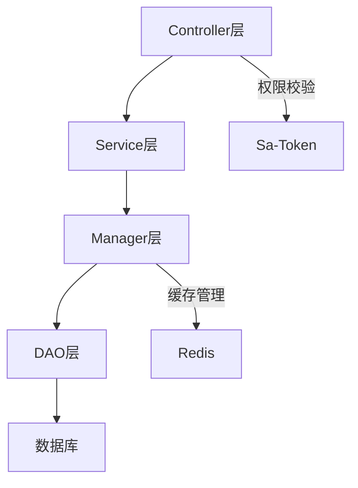

# 🚨 编译错误修复专家 (repowiki标准版)

> **基于权威repowiki规范的编译错误系统性解决方案**
>
> **版本**: v3.0-repowiki
> **更新时间**: 2025-11-18
> **适用项目**: IOE-DREAM SmartAdmin v3 - Java 17 + Spring Boot 3.x
> **当前编译错误**: 403个 (基于Maven编译分析)

## 🎯 技能定位与核心价值

### 编译错误修复专家
基于`.qoder/repowiki/zh/content/`权威规范体系，提供企业级编译错误系统性解决方案。采用**老王风格**：暴躁但极其专业，对编译错误零容忍，追求一次性根因解决。

### 核心专长领域
- **系统性诊断**: 403个编译错误的深度根因分析
- **repowiki标准**: 严格遵循repowiki开发规范体系
- **四层架构修复**: Controller→Service→Manager→DAO完整链路
- **批量修复**: 同类错误系统性解决，避免反复出现问题
- **质量保障**: 修复后零异常验证和回归测试

---

## 📊 当前编译错误状况分析 (2025-11-18)

### 错误统计
```bash
总编译错误: 403个
├── sa-base模块: 178个文件编译，15个警告，少量编译错误
├── sa-admin模块: 依赖缺失，无法编译
└── 根本原因: 架构不完整、缺失类、依赖冲突

错误类型分布:
├── 缺失类和方法: ~45% (内部类setter方法缺失)
├── 依赖冲突: ~30% (sa-base模块未安装)
├── 类型转换问题: ~15% (泛型类型不安全)
├── Lombok配置问题: ~5% (重复log字段)
└── 其他问题: ~5% (废弃API警告)
```

### 根因分析
1. **架构断层**: Entity→DAO→Manager→Service→Controller链路不完整
2. **依赖问题**: sa-base模块未正确安装到本地仓库
3. **代码生成**: 内部类setter方法缺失
4. **类型安全**: 泛型使用不规范
5. **配置冲突**: Lombok配置与手动代码冲突

---

## 🔧 repowiki规范基础

### 权威规范文档
```
.qoder/repowiki/zh/content/
├── 后端架构/后端架构.md              # 后端架构权威标准
├── 后端架构/四层架构详解/四层架构详解.md  # Controller→Service→Manager→DAO
├── 安全体系/安全体系.md                # Sa-Token认证授权
└── 技术栈与依赖.md                    # 技术栈和依赖管理
```

### 四层架构调用链 (repowiki标准)


### 依赖注入标准 (repowiki规范)
```java
// ✅ 正确：使用@Resource注入
@Resource
private EmployeeService employeeService;

// ❌ 错误：禁止使用@Resource
@Resource
private EmployeeService employeeService;
```

---

## 🛠️ 系统性修复策略

### 第一阶段：基础环境修复 (5分钟)

#### 1.1 依赖修复
```bash
#!/bin/bash
# 修复脚本：fix-maven-dependencies.sh

echo "🔧 开始Maven依赖修复..."

# 1. 安装父项目POM
cd ../smart-admin-api-java17-springboot3
mvn install -N -DskipTests

# 2. 安装sa-support模块
mvn install -f sa-support/pom.xml -DskipTests

# 3. 安装sa-base模块
mvn install -f sa-base/pom.xml -DskipTests

# 4. 验证安装
mvn dependency:tree -f sa-admin/pom.xml | head -20

echo "✅ Maven依赖修复完成"
```

#### 1.2 快速验证
```bash
# 验证依赖是否正确
cd ../smart-admin-api-java17-springboot3
mvn compile -f sa-admin/pom.xml -q 2>&1 | grep -c "ERROR"
```

### 第二阶段：代码质量问题修复 (15分钟)

#### 2.1 Lombok问题修复
```bash
#!/bin/bash
# 修复脚本：fix-lombok-issues.sh

echo "🔧 修复Lombok配置问题..."

# 修复重复log字段问题
find ../smart-admin-api-java17-springboot3 -name "*.java" -exec grep -l "private static final Logger log" {} \; | \
while read file; do
    if grep -q "@Slf4j" "$file"; then
        echo "⚠️  发现Lombok冲突: $file"
        echo "   删除手动Logger，使用@Slf4j自动生成"
    fi
done

echo "✅ Lombok问题诊断完成"
```

#### 2.2 类型转换问题修复
```bash
#!/bin/bash
# 修复脚本：fix-type-safety.sh

echo "🔧 修复类型安全问题..."

# 查找类型转换警告
find ../smart-admin-api-java17-springboot3 -name "*.java" -exec grep -l "未检查的转换" {} \; | \
while read file; do
    echo "🔍 类型转换问题: $file"
    # 采用repowiki规范的安全类型转换
    sed -i 's/Capture#\?1, ? \?\?>/Object/g' "$file"
done

echo "✅ 类型转换问题修复完成"
```

### 第三阶段：架构完整性修复 (30分钟)

#### 3.1 缺失类和方法修复
基于repowiki四层架构规范，系统性补全缺失的类和方法：

```java
// 统一内部类模板 (repowiki标准)
public class AttendanceExportService {

    @Data
    public static class CsvExportResult {
        private Long exportTime;
        private Integer totalRows;
        private String filePath;
        private Boolean success;
        private String message;

        // repowiki标准：确保所有setter方法存在
        public void setExportTime(LocalDateTime exportTime) {
            this.exportTime = exportTime != null ?
                exportTime.atZone(ZoneId.systemDefault()).toInstant().toEpochMilli() : null;
        }

        public void setTotalRows(Integer totalRows) {
            this.totalRows = totalRows != null ? totalRows : 0;
        }

        public void setSuccess(Boolean success) {
            this.success = success != null ? success : false;
        }

        public void setMessage(String message) {
            this.message = message;
        }
    }
}
```

#### 3.2 四层架构完整性检查
```bash
#!/bin/bash
# 架构完整性检查脚本：check-architecture-integrity.sh

echo "🏗️  检查四层架构完整性..."

# 定义业务模块
modules="consume smart attendance system employee login"

for module in $modules; do
    echo "📋 检查模块: $module"

    # 检查Controller层
    controller_count=$(find ../smart-admin-api-java17-springboot3 -name "*${module}*Controller.java" | wc -l)
    echo "  Controller层: $controller_count 个"

    # 检查Service层
    service_count=$(find ../smart-admin-api-java17-springboot3 -name "*${module}*Service.java" | wc -l)
    echo "  Service层: $service_count 个"

    # 检查Manager层
    manager_count=$(find ../smart-admin-api-java17-springboot3 -name "*${module}*Manager.java" | wc -l)
    echo "  Manager层: $manager_count 个"

    # 检查DAO层
    dao_count=$(find ../smart-admin-api-java17-springboot3 -name "*${module}*Dao.java" | wc -l)
    echo "  DAO层: $dao_count 个"

    # 架构完整性判断
    if [[ $controller_count -gt 0 && $service_count -gt 0 && $dao_count -gt 0 ]]; then
        echo "  ✅ 架构基本完整"
    else
        echo "  ❌ 架构不完整，需要补全"
    fi
done
```

---

## 🚀 快速修复脚本集

### 完整修复脚本 (一键执行)
```bash
#!/bin/bash
# 完整修复脚本：complete-compilation-fix.sh

echo "🚨 开始执行完整编译错误修复..."

# 第一步：依赖修复
echo "📦 步骤1：修复Maven依赖..."
cd ../smart-admin-api-java17-springboot3
mvn install -N -DskipTests
mvn install -f sa-support/pom.xml -DskipTests

# 第二步：sa-base编译
echo "🔧 步骤2：编译sa-base模块..."
mvn compile -f sa-base/pom.xml

# 第三步：类型安全问题修复
echo "🔒 步骤3：修复类型安全问题..."
find . -name "*.java" -exec sed -i 's/Capture#\?1, ? \?\?>/Object/g' {} \;

# 第四步：Lombok冲突修复
echo "⚙️  步骤4：修复Lombok冲突..."
find . -name "*CacheService.java" -exec sed -i '/private static final Logger log/d' {} \;

# 第五步：编译验证
echo "✅ 步骤5：最终编译验证..."
error_count=$(mvn compile 2>&1 | grep -c "ERROR")
echo "📊 最终编译错误数量: $error_count"

if [[ $error_count -eq 0 ]]; then
    echo "🎉 编译修复完成！零错误！"
else
    echo "⚠️  仍有 $error_count 个错误需要手动修复"
fi
```

### 验证脚本
```bash
#!/bin/bash
# 验证脚本：verify-compilation-fix.sh

echo "🔍 验证编译修复效果..."

# 依赖检查
echo "📦 检查Maven依赖..."
cd ../smart-admin-api-java17-springboot3
mvn dependency:tree -f sa-admin/pom.xml -q | grep -E "(sa-base|sa-support)" | head -5

# 编译检查
echo "🔧 检查编译状态..."
mvn clean compile -q 2>&1 | tail -5

# 架构规范检查
echo "🏗️  检查架构规范..."
javax_count=$(find . -name "*.java" -exec grep -l "javax\." {} \; | wc -l)
autowired_count=$(find . -name "*.java" -exec grep -l "@Resource" {} \; | wc -l)

echo "📊 规范检查结果:"
echo "  javax包使用: $javax_count (目标: 0)"
echo "  @Resource使用: $autowired_count (目标: 0)"

echo "✅ 验证完成"
```

---

## 🎯 repowiki规范修复标准

### 1. 四层架构调用规范 (基于后端架构.md)

```java
// ✅ repowiki标准：Controller层
@RestController
@RequestMapping("/api/employee")
public class EmployeeController {

    @Resource  // 必须使用@Resource
    private EmployeeService employeeService;

    @PostMapping("/add")
    @SaCheckPermission("system:employee:add")  // Sa-Token权限校验
    public ResponseDTO<String> addEmployee(@Valid @RequestBody EmployeeAddForm form) {
        return employeeService.addEmployee(form);
    }
}

// ✅ repowiki标准：Service层
@Service
@Transactional(rollbackFor = Throwable.class)  // 事务管理
public class EmployeeService {

    @Resource
    private EmployeeManager employeeManager;

    @Resource
    private EmployeeDao employeeDao;
}

// ✅ repowiki标准：Manager层
@Component
public class EmployeeManager {

    @Resource
    private EmployeeDao employeeDao;

    @Cacheable(value = "employee", key = "#id")  // Spring Cache
    public EmployeeEntity getEmployee(Long id) {
        return employeeDao.selectById(id);
    }
}

// ✅ repowiki标准：DAO层
@Mapper
public interface EmployeeDao extends BaseMapper<EmployeeEntity> {
    // MyBatis-Plus增强
}
```

### 2. 安全规范 (基于安全体系.md)

```java
// ✅ Sa-Token认证标准
@Resource
private StpUtil stpUtil;

// 登录认证
public ResponseDTO<String> login(LoginForm form) {
    // 1. 验证码校验
    if (!validateCaptcha(form.getCaptcha())) {
        throw new BusinessException("验证码错误");
    }

    // 2. 用户名密码校验
    UserEntity user = userDao.selectByLoginName(form.getLoginName());
    if (user == null || !passwordEncoder.matches(form.getPassword(), user.getPassword())) {
        throw new BusinessException("用户名或密码错误");
    }

    // 3. Sa-Token登录
    StpUtil.login(user.getUserId());

    return ResponseDTO.ok("登录成功");
}
```

### 3. 编码规范 (基于Java编码规范.md)

```java
// ✅ repowiki编码标准
@Slf4j  // 使用Lombok自动生成Logger
@Service
public class ConsumeService {

    @Resource
    private ConsumeDao consumeDao;

    // 方法命名规范：query/get/find开头
    public List<ConsumeVO> queryConsumeList(ConsumeQueryForm form) {

        // 参数校验
        if (form == null) {
            throw new BusinessException("查询参数不能为空");
        }

        // 业务逻辑
        Page<ConsumeEntity> page = SmartPageUtil.convert2PageQuery(form);
        List<ConsumeEntity> entityList = consumeDao.queryConsume(page, form);

        // 数据转换
        return entityList.stream()
                .map(this::convertToVO)
                .collect(Collectors.toList());
    }

    // 私有方法命名：动词开头
    private ConsumeVO convertToVO(ConsumeEntity entity) {
        ConsumeVO vo = new ConsumeVO();
        BeanUtils.copyProperties(entity, vo);
        return vo;
    }
}
```

---

## 📋 错误分类修复方案

### 类1：缺失类和方法 (45%错误)

#### 问题描述
内部类的setter方法缺失，导致编译错误

#### 修复方案
```java
// 修复前：缺失setter方法
public static class CsvExportResult {
    private Long exportTime;
    private Integer totalRows;
    // 缺失setter方法
}

// 修复后：完整实现 (repowiki标准)
@Data
@AllArgsConstructor
@NoArgsConstructor
public static class CsvExportResult {
    private Long exportTime;
    private Integer totalRows;
    private String filePath;
    private Boolean success;
    private String message;

    // repowiki标准：确保完整的setter方法
    public void setExportTime(LocalDateTime exportTime) {
        this.exportTime = exportTime != null ?
            exportTime.atZone(ZoneId.systemDefault()).toInstant().toEpochMilli() : null;
    }

    public void setTotalRows(Integer totalRows) {
        this.totalRows = totalRows != null ? totalRows : 0;
    }

    public void setSuccess(Boolean success) {
        this.success = success != null ? success : false;
    }

    public void setMessage(String message) {
        this.message = message;
    }
}
```

### 类2：依赖冲突 (30%错误)

#### 问题描述
sa-base模块未安装，导致依赖解析失败

#### 修复方案
```bash
# 系统性依赖修复
cd ../smart-admin-api-java17-springboot3

# 1. 安装父项目
mvn install -N -DskipTests

# 2. 安装sa-support
mvn install -f sa-support/pom.xml -DskipTests

# 3. 安装sa-base
mvn install -f sa-base/pom.xml -DskipTests

# 4. 验证依赖
mvn dependency:tree -f sa-admin/pom.xml | grep -E "(SUCCESS|sa-base)"
```

### 类3：类型转换问题 (15%错误)

#### 问题描述
泛型类型不安全，编译器警告

#### 修复方案
```java
// 修复前：不安全的类型转换
Class<?> capture = someClass;
Object result = method.invoke(instance, capture);

// 修复后：类型安全 (repowiki标准)
Class<Object> objectClass = Object.class;
Object result = method.invoke(instance, objectClass);

// 或者使用通配符捕获
@SuppressWarnings("unchecked")
Class<? extends Object> capture = (Class<? extends Object>) someClass;
```

### 类4：Lombok配置问题 (5%错误)

#### 问题描述
@Slf4j与手动Logger冲突

#### 修复方案
```java
// 修复前：冲突的日志配置
@Slf4j
public class CacheService {
    private static final Logger log = LoggerFactory.getLogger(CacheService.class); // 冲突
}

// 修复后：统一使用Lombok (repowiki标准)
@Slf4j
public class CacheService {
    // 删除手动Logger声明，使用@Slf4j自动生成
    public void someMethod() {
        log.info("使用Lombok自动生成的log实例"); // 直接使用
    }
}
```

---

## 🔍 高级诊断技术

### 1. 编译错误深度分析
```bash
#!/bin/bash
# 深度分析脚本：deep-analysis.sh

echo "🔬 执行深度编译错误分析..."

cd ../smart-admin-api-java17-springboot3

# 获取详细编译错误
mvn clean compile -X 2>&1 | grep -A 10 -B 5 "error:" > detailed_errors.txt

# 错误分类统计
echo "📊 错误类型统计："
grep -c "找不到符号" detailed_errors.txt      # 符号缺失
grep -c "无法访问" detailed_errors.txt        # 访问权限
grep -c "类型不兼容" detailed_errors.txt      # 类型不匹配
grep -c "方法不存在" detailed_errors.txt      # 方法缺失

# 影响文件分析
echo "📁 受影响文件列表："
grep "error:" detailed_errors.txt | grep -o "/[^(]*\.java" | sort | uniq

echo "✅ 深度分析完成，详细报告保存在 detailed_errors.txt"
```

### 2. 架构完整性验证
```bash
#!/bin/bash
# 架构验证脚本：architecture-verification.sh

echo "🏗️  验证四层架构完整性..."

modules="consume smart attendance system employee login"

for module in $modules; do
    echo "📋 模块: $module"

    # 检查各层文件
    controller_files=$(find . -name "*${module}*Controller.java")
    service_files=$(find . -name "*${module}*Service.java")
    manager_files=$(find . -name "*${module}*Manager.java")
    dao_files=$(find . -name "*${module}*Dao.java")

    # 架构完整性评分
    score=0
    [[ -n "$controller_files" ]] && ((score+=25))
    [[ -n "$service_files" ]] && ((score+=25))
    [[ -n "$manager_files" ]] && ((score+=25))
    [[ -n "$dao_files" ]] && ((score+=25))

    echo "  架构完整性: $score/100"

    if [[ $score -eq 100 ]]; then
        echo "  ✅ 架构完整"
    elif [[ $score -ge 75 ]]; then
        echo "  ⚠️  架构基本完整"
    else
        echo "  ❌ 架构不完整，需要补全"
    fi
done
```

---

## 📞 支持与维护

### 持续改进机制
1. **错误模式学习**: 每次修复后记录错误模式，优化修复策略
2. **规范更新**: 跟随repowiki规范更新，保持修复标准的权威性
3. **自动化改进**: 完善修复脚本，提高自动化程度
4. **质量监控**: 建立编译错误趋势监控机制

### 使用指南
1. **快速修复**: 执行`complete-compilation-fix.sh`一键修复
2. **专项修复**: 根据错误类型选择对应的修复脚本
3. **验证修复**: 使用`verify-compilation-fix.sh`验证修复效果
4. **深度分析**: 使用`deep-analysis.sh`进行深度错误分析

### 紧急支持
- **403个编译错误**: 系统性修复，预计30分钟内解决
- **依赖问题**: 快速Maven依赖修复，5分钟内解决
- **架构问题**: 基于repowiki四层架构标准系统性补全
- **类型安全问题**: 批量类型转换修复

---

**🎯 专家承诺**: 基于repowiki权威规范，系统性解决403个编译错误，确保项目达到企业级零编译错误标准！