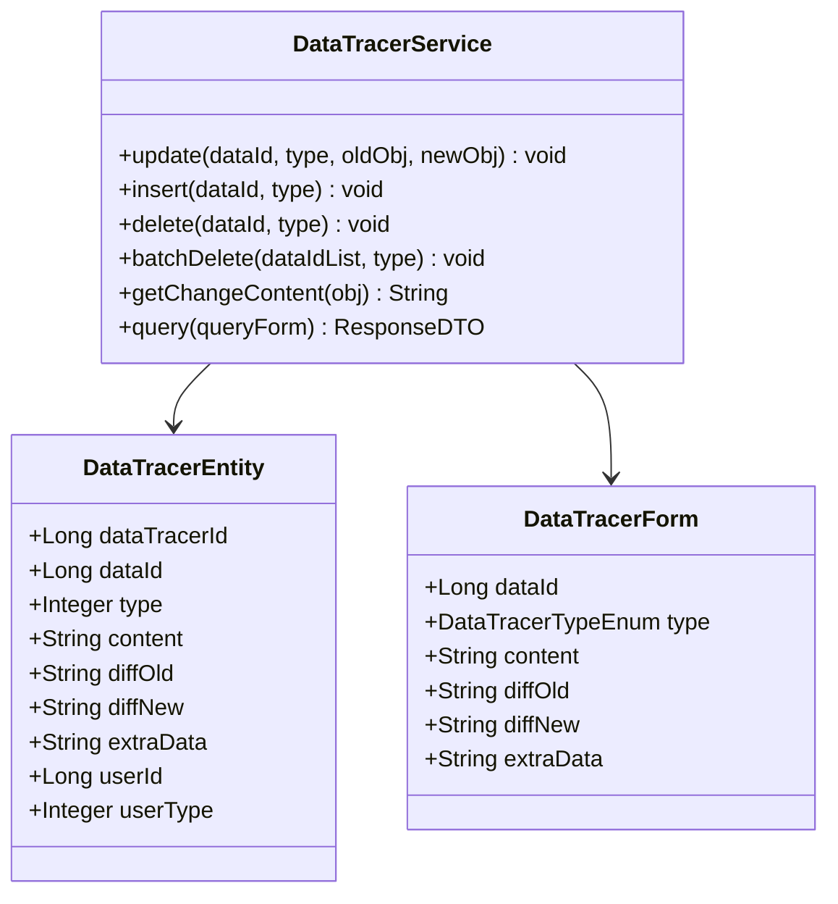
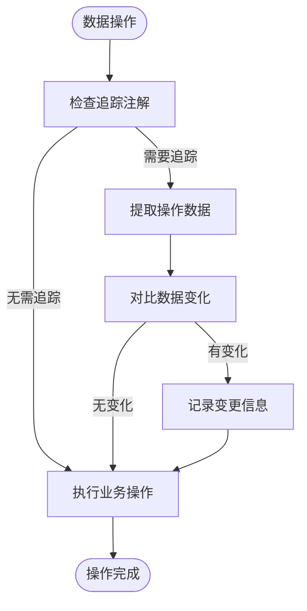

# 数据变更追踪专家 (Repowiki标准版)

## 🎯 技能定位
**核心职责**: 基于 `.qoder/repowiki` 中的《数据变更追踪详解》规范，确保IOE-DREAM项目数据变更追踪系统严格遵循审计追踪架构，提供完整、准确、高效的数据操作审计能力

**⚡ 技能等级**: ★★★★★ (数据变更追踪专家)
**🎯 适用场景**: 数据变更追踪设计、审计记录管理、数据对比分析、变更历史查询、数据安全保障
**📊 技能覆盖**: AOP切面追踪 | 事件监听机制 | Diff算法对比 | 变更记录存储 | 审计查询分析

---

## 📋 技能概述 (基于Repowiki规范)

### **核心专长 (基于.qoder/repowiki/zh/content/高级特性/数据变更追踪.md)**
- **数据变更追踪守护**: 严格确保AOP切面和事件监听的完整实现
- **变更记录管理**: 完整的数据操作历史记录和存储
- **对比算法优化**: 高效的Diff算法和数据对比可视化
- **审计查询分析**: 强大的变更历史查询和分析功能
- **数据安全保障**: 敏感数据操作的安全追踪和保护

### **解决能力**
- **变更追踪架构合规性**: 100%符合repowiki数据变更追踪规范
- **审计记录完整性**: 确保所有数据变更操作的完整记录
- **数据对比准确性**: 提供精确的数据变更对比和分析
- **查询性能优化**: 高效的变更历史查询和统计分析
- **合规性保障**: 满足数据审计和合规性要求

---

## 🏗️ Repowiki数据变更追踪架构规范

### **核心架构组件**

#### **数据追踪服务架构**


#### **AOP切面追踪机制**


### **变更追踪策略规范**

#### **操作类型分类**
- **新增记录 (INSERT)**: 完整记录新增对象的所有字段信息
- **修改记录 (UPDATE)**: 记录变更前后的数据对比和差异
- **删除记录 (DELETE)**: 保存被删除对象的完整数据快照
- **批量操作 (BATCH)**: 汇总记录批量操作的统计信息

#### **数据对比算法**
- **深度对比**: 支持复杂对象结构的深度比较
- **格式化输出**: HTML格式的变更对比可视化
- **字段级对比**: 精确到字段级别的变更识别
- **时间轴展示**: 按时间顺序排列的变更历史

---

## 🛠️ 核心工作流程 (基于Repowiki)

### **Phase 1: 数据变更追踪合规性诊断**
```bash
# 检查数据变更追踪架构合规性
./scripts/check-data-tracer-architecture.sh

# 检测AOP切面配置
./scripts/analyze-aop-aspect-configuration.sh

# 验证变更记录存储
./scripts/validate-change-record-storage.sh

# 检查数据对比算法
./scripts/check-data-comparison-algorithm.sh
```

### **Phase 2: 数据变更追踪优化**
```bash
# AOP切面优化
./scripts/optimize-aop-aspect.sh

# 变更记录优化
./scripts/optimize-change-recording.sh

# 数据对比优化
./scripts/optimize-data-comparison.sh

# 查询性能优化
./scripts/optimize-query-performance.sh
```

### **Phase 3: 数据变更追踪质量保障**
```bash
# 变更追踪功能测试
npm run test:data-tracer

# 数据对比准确性测试
npm run test:data-comparison

# 性能压力测试
npm run test:performance-stress

# 数据安全测试
npm run test:data-security
```

---

## 🔍 数据变更追踪合规性检查清单 (基于Repowiki)

### **✅ 强制性规范 (必须100%遵循)**

#### **架构设计规范**
- [ ] 严格遵循AOP切面和事件监听的设计模式
- [ ] 实现完整的CRUD操作追踪覆盖
- [ ] 提供精确的数据变更检测和记录
- [ ] 支持批量操作的汇总追踪
- [ ] 确保追踪记录的数据一致性和完整性

#### **变更记录规范**
- [ ] 记录操作类型、时间、用户等完整信息
- [ ] 保存变更前后的数据状态对比
- [ ] 支持额外业务数据的关联记录
- [ ] 提供结构化的变更内容存储
- [ ] 确保记录的不可篡改性

#### **数据对比规范**
- [ ] 实现深度的对象对比算法
- [ ] 提供直观的变更可视化展示
- [ ] 支持复杂嵌套对象的对比分析
- [ ] 提供字段级别的变更详情
- [ ] 支持时间轴的变更历史查询

### **⚠️ 推荐性规范**

#### **性能优化规范**
- [ ] 异步处理变更记录，避免影响主业务流程
- [ ] 实现变更记录的批量写入优化
- [ ] 提供高效的历史数据查询机制
- [ ] 支持变更数据的定期归档
- [ ] 实现查询缓存和索引优化

#### **安全合规规范**
- [ ] 敏感数据的脱敏处理和加密存储
- [ ] 提供变更记录的访问权限控制
- [ ] 支持变更记录的审计日志
- [ ] 满足数据保护法规要求
- [ ] 提供变更操作的合规性报告

---

## 🚀 数据变更追踪最佳实践

### **核心数据追踪服务实现示例**
```java
// DataTracerService.java - 核心数据追踪服务
@Service
@Slf4j
public class DataTracerService {

    private final DataTracerMapper dataTracerMapper;
    private final DiffService diffService;
    private final SecurityService securityService;

    /**
     * 记录数据更新操作
     */
    @Async("dataTracerExecutor")
    public void update(Long dataId, DataTracerTypeEnum type, Object oldObj, Object newObj) {
        try {
            // 检查是否需要追踪
            if (!shouldTrace(type, oldObj, newObj)) {
                return;
            }

            // 构建变更记录
            DataTracerEntity tracer = new DataTracerEntity();
            tracer.setDataId(dataId);
            tracer.setType(type.getValue());
            tracer.setOperationType(DataOperationType.UPDATE.getValue());
            tracer.setUserId(getCurrentUserId());
            tracer.setUserType(getCurrentUserType());
            tracer.setCreateTime(LocalDateTime.now());

            // 生成变更对比
            DiffResult diffResult = diffService.compare(oldObj, newObj);

            if (diffResult.hasChanges()) {
                tracer.setDiffOld(JSON.toJSONString(oldObj));
                tracer.setDiffNew(JSON.toJSONString(newObj));
                tracer.setContent(diffResult.getHtmlDiff());
                tracer.setExtraData(buildExtraData(oldObj, newObj));

                // 保存变更记录
                dataTracerMapper.insert(tracer);

                log.debug("Data update traced: dataId={}, type={}, changes={}",
                    dataId, type, diffResult.getChangeCount());
            }
        } catch (Exception e) {
            log.error("Failed to trace data update: dataId={}, type={}", dataId, type, e);
        }
    }

    /**
     * 记录数据新增操作
     */
    @Async("dataTracerExecutor")
    public void insert(Long dataId, DataTracerTypeEnum type, Object newObj) {
        try {
            DataTracerEntity tracer = new DataTracerEntity();
            tracer.setDataId(dataId);
            tracer.setType(type.getValue());
            tracer.setOperationType(DataOperationType.INSERT.getValue());
            tracer.setUserId(getCurrentUserId());
            tracer.setUserType(getCurrentUserType());
            tracer.setCreateTime(LocalDateTime.now());

            // 记录新增数据
            tracer.setContent("新增记录");
            tracer.setDiffNew(JSON.toJSONString(newObj));
            tracer.setExtraData(buildInsertExtraData(newObj));

            dataTracerMapper.insert(tracer);

            log.debug("Data insert traced: dataId={}, type={}", dataId, type);
        } catch (Exception e) {
            log.error("Failed to trace data insert: dataId={}, type={}", dataId, type, e);
        }
    }

    /**
     * 记录数据删除操作
     */
    @Async("dataTracerExecutor")
    public void delete(Long dataId, DataTracerTypeEnum type, Object oldObj) {
        try {
            DataTracerEntity tracer = new DataTracerEntity();
            tracer.setDataId(dataId);
            tracer.setType(type.getValue());
            tracer.setOperationType(DataOperationType.DELETE.getValue());
            tracer.setUserId(getCurrentUserId());
            tracer.setUserType(getCurrentUserType());
            tracer.setCreateTime(LocalDateTime.now());

            // 保存删除前的数据
            tracer.setContent("删除记录");
            tracer.setDiffOld(JSON.toJSONString(oldObj));
            tracer.setExtraData(buildDeleteExtraData(oldObj));

            dataTracerMapper.insert(tracer);

            log.debug("Data delete traced: dataId={}, type={}", dataId, type);
        } catch (Exception e) {
            log.error("Failed to trace data delete: dataId={}, type={}", dataId, type, e);
        }
    }

    /**
     * 记录批量删除操作
     */
    @Async("dataTracerExecutor")
    public void batchDelete(List<Long> dataIdList, DataTracerTypeEnum type) {
        try {
            if (CollectionUtils.isEmpty(dataIdList)) {
                return;
            }

            DataTracerEntity tracer = new DataTracerEntity();
            tracer.setDataId(0L); // 批量操作使用0作为标识
            tracer.setType(type.getValue());
            tracer.setOperationType(DataOperationType.BATCH_DELETE.getValue());
            tracer.setUserId(getCurrentUserId());
            tracer.setUserType(getCurrentUserType());
            tracer.setCreateTime(LocalDateTime.now());

            // 构建批量操作额外信息
            Map<String, Object> extraData = new HashMap<>();
            extraData.put("dataIdList", dataIdList);
            extraData.put("batchSize", dataIdList.size());

            tracer.setContent(String.format("批量删除 %d 条记录", dataIdList.size()));
            tracer.setExtraData(JSON.toJSONString(extraData));

            dataTracerMapper.insert(tracer);

            log.debug("Batch delete traced: type={}, count={}", type, dataIdList.size());
        } catch (Exception e) {
            log.error("Failed to trace batch delete: type={}, count={}",
                type, dataIdList != null ? dataIdList.size() : 0, e);
        }
    }

    /**
     * 查询变更历史
     */
    public PageResult<DataTracerVO> query(DataTracerQueryForm queryForm) {
        try {
            // 参数验证
            validateQueryForm(queryForm);

            // 构建查询条件
            QueryWrapper<DataTracerEntity> queryWrapper = buildQueryWrapper(queryForm);

            // 分页查询
            Page<DataTracerEntity> page = new Page<>(queryForm.getCurrent(), queryForm.getPageSize());
            Page<DataTracerEntity> result = dataTracerMapper.selectPage(page, queryWrapper);

            // 转换为VO对象
            List<DataTracerVO> voList = convertToVOList(result.getRecords());

            return PageResult.of(voList, result.getTotal());
        } catch (Exception e) {
            log.error("Failed to query data tracer history", e);
            throw new DataTracerException("Query data tracer history failed", e);
        }
    }

    /**
     * 获取变更内容
     */
    public String getChangeContent(Object obj) {
        try {
            if (obj == null) {
                return "";
            }

            return JSON.toJSONString(obj, JsonUtils.getJsonSerializer());
        } catch (Exception e) {
            log.error("Failed to get change content", e);
            return "";
        }
    }

    /**
     * 判断是否需要追踪
     */
    private boolean shouldTrace(DataTracerTypeEnum type, Object oldObj, Object newObj) {
        // 检查类型是否需要追踪
        if (type == null) {
            return false;
        }

        // 检查对象是否有实际变化
        if (oldObj != null && newObj != null && oldObj.equals(newObj)) {
            return false;
        }

        return true;
    }
}
```

### **AOP切面追踪实现示例**
```java
// DataTracerAspect.java - 数据追踪切面
@Aspect
@Component
@Slf4j
public class DataTracerAspect {

    private final DataTracerService dataTracerService;
    private final SecurityService securityService;

    /**
     * 定义数据追踪切面
     */
    @Pointcut("@annotation(net.lab1024.sa.base.common.annotation.DataTracer)")
    public void dataTracerPointcut() {}

    /**
     * 环绕通知 - 记录方法执行前后的数据变化
     */
    @Around("dataTracerPointcut()")
    public Object around(ProceedingJoinPoint joinPoint) throws Throwable {
        // 获取方法信息
        MethodSignature signature = (MethodSignature) joinPoint.getSignature();
        Method method = signature.getMethod();
        DataTracer annotation = method.getAnnotation(DataTracer.class);

        // 获取方法参数
        Object[] args = joinPoint.getArgs();
        String methodName = method.getName();

        log.debug("Data tracer aspect: method={}, args={}", methodName, args.length);

        try {
            // 执行前记录原始数据
            Map<String, Object> beforeData = extractBeforeData(args, annotation);

            // 执行目标方法
            Object result = joinPoint.proceed();

            // 执行后记录变更数据
            recordDataChange(annotation, args, result, beforeData);

            return result;
        } catch (Exception e) {
            log.error("Data tracer aspect error: method={}", methodName, e);
            throw e;
        }
    }

    /**
     * 记录数据变更
     */
    private void recordDataChange(DataTracer annotation, Object[] args, Object result,
                                 Map<String, Object> beforeData) {
        try {
            // 获取追踪配置
            DataTracerTypeEnum type = annotation.type();
            String dataIdParam = annotation.dataIdParam();
            String dataObjectParam = annotation.dataObjectParam();

            // 提取数据ID
            Long dataId = extractDataId(args, dataIdParam);
            if (dataId == null && result != null) {
                // 尝试从返回结果中提取ID
                dataId = extractDataIdFromResult(result);
            }

            // 提取数据对象
            Object oldObj = beforeData.get(dataObjectParam);
            Object newObj = extractDataObject(args, dataObjectParam, result);

            // 根据操作类型记录变更
            if (methodName.startsWith("insert") || methodName.startsWith("add") || methodName.startsWith("create")) {
                dataTracerService.insert(dataId, type, newObj);
            } else if (methodName.startsWith("update") || methodName.startsWith("modify") || methodName.startsWith("edit")) {
                dataTracerService.update(dataId, type, oldObj, newObj);
            } else if (methodName.startsWith("delete") || methodName.startsWith("remove")) {
                dataTracerService.delete(dataId, type, oldObj);
            }

        } catch (Exception e) {
            log.error("Failed to record data change", e);
        }
    }

    /**
     * 提取执行前的数据
     */
    private Map<String, Object> extractBeforeData(Object[] args, DataTracer annotation) {
        Map<String, Object> beforeData = new HashMap<>();

        String[] trackParams = annotation.trackParams();
        if (trackParams != null) {
            // 获取参数名数组
            String[] paramNames = getParameterNames();

            for (int i = 0; i < Math.min(args.length, paramNames.length); i++) {
                String paramName = paramNames[i];
                if (Arrays.asList(trackParams).contains(paramName)) {
                    beforeData.put(paramName, args[i]);
                }
            }
        }

        return beforeData;
    }

    /**
     * 提取数据ID
     */
    private Long extractDataId(Object[] args, String dataIdParam) {
        if (StringUtils.isEmpty(dataIdParam)) {
            return null;
        }

        // 通过参数名查找对应的参数值
        String[] paramNames = getParameterNames();
        for (int i = 0; i < paramNames.length; i++) {
            if (dataIdParam.equals(paramNames[i]) && i < args.length) {
                Object arg = args[i];
                if (arg instanceof Long) {
                    return (Long) arg;
                } else if (arg instanceof Integer) {
                    return ((Integer) arg).longValue();
                } else if (arg instanceof String) {
                    try {
                        return Long.parseLong((String) arg);
                    } catch (NumberFormatException e) {
                        log.warn("Invalid data ID format: {}", arg);
                    }
                }
            }
        }

        return null;
    }
}
```

### **数据对比服务实现示例**
```java
// DiffService.java - 数据对比服务
@Service
@Slf4j
public class DiffService {

    /**
     * 比较两个对象的差异
     */
    public DiffResult compare(Object oldObj, Object newObj) {
        try {
            if (oldObj == null && newObj == null) {
                return DiffResult.noChange();
            }

            if (oldObj == null) {
                return DiffResult.insert(newObj);
            }

            if (newObj == null) {
                return DiffResult.delete(oldObj);
            }

            // 深度比较对象
            Map<String, Object> oldMap = convertToMap(oldObj);
            Map<String, Object> newMap = convertToMap(newObj);

            return compareMaps(oldMap, newMap);
        } catch (Exception e) {
            log.error("Failed to compare objects", e);
            return DiffResult.error(e.getMessage());
        }
    }

    /**
     * 比较Map对象的差异
     */
    private DiffResult compareMaps(Map<String, Object> oldMap, Map<String, Object> newMap) {
        List<FieldChange> changes = new ArrayList<>();

        Set<String> allKeys = new HashSet<>();
        allKeys.addAll(oldMap.keySet());
        allKeys.addAll(newMap.keySet());

        for (String key : allKeys) {
            Object oldValue = oldMap.get(key);
            Object newValue = newMap.get(key);

            if (!Objects.equals(oldValue, newValue)) {
                FieldChange change = new FieldChange();
                change.setFieldName(key);
                change.setOldValue(formatValue(oldValue));
                change.setNewValue(formatValue(newValue));
                change.setChangeType(determineChangeType(oldValue, newValue));

                changes.add(change);
            }
        }

        return DiffResult.of(changes);
    }

    /**
     * 生成HTML格式的对比结果
     */
    public String generateHtmlDiff(DiffResult diffResult) {
        if (diffResult == null || !diffResult.hasChanges()) {
            return "";
        }

        StringBuilder html = new StringBuilder();
        html.append("<div class='data-diff'>");

        for (FieldChange change : diffResult.getChanges()) {
            html.append("<div class='diff-item'>");
            html.append("<span class='field-name'>").append(escapeHtml(change.getFieldName())).append("</span>");
            html.append("<span class='change-type ").append(change.getChangeType().name()).append("'>");
            html.append(getChangeTypeIcon(change.getChangeType())).append("</span>");

            if (change.getChangeType() != ChangeType.INSERT && change.getOldValue() != null) {
                html.append("<span class='old-value'>").append(escapeHtml(change.getOldValue())).append("</span>");
            }

            if (change.getChangeType() != ChangeType.DELETE && change.getNewValue() != null) {
                html.append("<span class='new-value'>").append(escapeHtml(change.getNewValue())).append("</span>");
            }

            html.append("</div>");
        }

        html.append("</div>");

        return html.toString();
    }

    /**
     * 确定变更类型
     */
    private ChangeType determineChangeType(Object oldValue, Object newValue) {
        if (oldValue == null && newValue != null) {
            return ChangeType.INSERT;
        } else if (oldValue != null && newValue == null) {
            return ChangeType.DELETE;
        } else {
            return ChangeType.UPDATE;
        }
    }

    /**
     * 格式化值显示
     */
    private String formatValue(Object value) {
        if (value == null) {
            return "";
        }

        if (value instanceof String) {
            return (String) value;
        }

        if (value instanceof Date) {
            return DateUtil.format((Date) value, DateUtil.PATTERN_DATETIME);
        }

        return value.toString();
    }

    /**
     * HTML转义
     */
    private String escapeHtml(String text) {
        if (StringUtils.isEmpty(text)) {
            return "";
        }

        return text.replace("<", "&lt;")
                   .replace(">", "&gt;")
                   .replace("&", "&amp;")
                   .replace("\"", "&quot;")
                   .replace("'", "&#39;");
    }
}
```

### **变更记录查询实现示例**
```java
// DataTracerQueryService.java - 变更记录查询服务
@Service
@Slf4j
public class DataTracerQueryService {

    private final DataTracerMapper dataTracerMapper;

    /**
     * 查询指定数据的变更历史
     */
    public List<DataTracerTimelineVO> queryChangeHistory(Long dataId, DataTracerTypeEnum type) {
        try {
            QueryWrapper<DataTracerEntity> queryWrapper = new QueryWrapper<>();
            queryWrapper.eq("data_id", dataId)
                       .eq("type", type.getValue())
                       .orderByDesc("create_time");

            List<DataTracerEntity> entities = dataTracerMapper.selectList(queryWrapper);

            return convertToTimeline(entities);
        } catch (Exception e) {
            log.error("Failed to query change history: dataId={}, type={}", dataId, type, e);
            throw new DataTracerException("Query change history failed", e);
        }
    }

    /**
     * 查询用户操作历史
     */
    public PageResult<DataTracerVO> queryUserOperationHistory(DataTracerQueryForm queryForm) {
        try {
            QueryWrapper<DataTracerEntity> queryWrapper = new QueryWrapper<>();

            // 添加用户过滤条件
            if (queryForm.getUserId() != null) {
                queryWrapper.eq("user_id", queryForm.getUserId());
            }

            // 添加类型过滤条件
            if (queryForm.getType() != null) {
                queryWrapper.eq("type", queryForm.getType().getValue());
            }

            // 添加时间范围过滤
            if (queryForm.getStartTime() != null) {
                queryWrapper.ge("create_time", queryForm.getStartTime());
            }
            if (queryForm.getEndTime() != null) {
                queryWrapper.le("create_time", queryForm.getEndTime());
            }

            queryWrapper.orderByDesc("create_time");

            // 分页查询
            Page<DataTracerEntity> page = new Page<>(queryForm.getCurrent(), queryForm.getPageSize());
            Page<DataTracerEntity> result = dataTracerMapper.selectPage(page, queryWrapper);

            // 转换为VO对象
            List<DataTracerVO> voList = convertToVOList(result.getRecords());

            return PageResult.of(voList, result.getTotal());
        } catch (Exception e) {
            log.error("Failed to query user operation history", e);
            throw new DataTracerException("Query user operation history failed", e);
        }
    }

    /**
     * 统计变更操作数据
     */
    public DataTracerStatisticsVO queryStatistics(DataTracerStatisticsQueryForm queryForm) {
        try {
            // 查询总体统计
            Map<String, Object> totalStats = dataTracerMapper.selectStatistics(queryForm);

            // 查询按类型统计
            List<Map<String, Object>> typeStats = dataTracerMapper.selectStatisticsByType(queryForm);

            // 查询按操作类型统计
            List<Map<String, Object>> operationStats = dataTracerMapper.selectStatisticsByOperation(queryForm);

            // 查询按时间统计
            List<Map<String, Object>> timeStats = dataTracerMapper.selectStatisticsByTime(queryForm);

            DataTracerStatisticsVO statistics = new DataTracerStatisticsVO();
            statistics.setTotalCount(((Number) totalStats.get("totalCount")).longValue());
            statistics.setTodayCount(((Number) totalStats.get("todayCount")).longValue());
            statistics.setTypeStats(convertTypeStatistics(typeStats));
            statistics.setOperationStats(convertOperationStatistics(operationStats));
            statistics.setTimeStats(convertTimeStatistics(timeStats));

            return statistics;
        } catch (Exception e) {
            log.error("Failed to query data tracer statistics", e);
            throw new DataTracerException("Query statistics failed", e);
        }
    }

    /**
     * 导出变更记录
     */
    public void exportChangeRecords(DataTracerQueryForm queryForm, HttpServletResponse response) {
        try {
            // 查询数据
            List<DataTracerEntity> entities = dataTracerMapper.selectList(
                buildExportQueryWrapper(queryForm));

            // 转换为导出数据
            List<DataTracerExportVO> exportData = entities.stream()
                .map(this::convertToExportVO)
                .collect(Collectors.toList());

            // 生成Excel文件
            Workbook workbook = ExcelUtils.exportData(exportData, DataTracerExportVO.class);

            // 设置响应头
            response.setContentType("application/vnd.openxmlformats-officedocument.spreadsheetml.sheet");
            response.setHeader("Content-Disposition",
                "attachment; filename=data_tracer_" + DateUtil.format(new Date(), "yyyyMMdd") + ".xlsx");

            // 写入响应
            workbook.write(response.getOutputStream());
            workbook.close();

            log.info("Exported {} data tracer records", exportData.size());
        } catch (Exception e) {
            log.error("Failed to export change records", e);
            throw new DataTracerException("Export change records failed", e);
        }
    }
}
```

---

## 📊 数据变更追踪质量评估标准

### **数据变更追踪评分**
| 维度 | 权重 | 评分标准 |
|------|------|----------|
| 追踪架构合规性 | 30% | 完全符合AOP切面和事件监听规范 |
| 变更记录完整性 | 25% | 记录的完整性和准确性 |
| 数据对比准确性 | 20% | Diff算法和对比可视化的准确性 |
| 查询性能效率 | 15% | 历史查询的性能和响应速度 |
| 安全合规保障 | 10% | 数据安全和合规性保障 |

### **质量等级**
- **A级 (90-100分)**: 完全符合repowiki数据变更追踪规范
- **B级 (80-89分)**: 基本合规，存在轻微优化空间
- **C级 (70-79分)**: 部分合规，需要重点改进
- **D级 (60-69分)**: 数据追踪设计混乱，需要重构
- **E级 (0-59分)**: 严重违反数据变更追踪规范

---

## 🎯 使用指南

### **何时调用**
- 数据变更追踪架构设计和技术选型时
- AOP切面配置和实现时
- 数据对比算法开发和优化时
- 变更记录存储和查询时
- 数据安全和合规性保障时

### **调用方式**
```bash
# 基于repowiki的数据变更追踪专家
Skill("data-tracer-specialist-repowiki")

# 将立即执行：
# 1. 基于.qoder/repowiki数据变更追踪规范检查
# 2. AOP切面和事件监听机制验证
# 3. 数据对比算法和变更记录分析
# 4. 查询性能优化和安全加固建议
```

### **预期结果**
- 100%符合`.qoder/repowiki`数据变更追踪规范
- 完整的数据操作审计和历史记录
- 准确的数据变更对比和可视化
- 高效的历史数据查询和分析
- 完善的数据安全和合规性保障

---

**🏆 技能等级**: 数据变更追踪专家 (★★★★★)
**⏰ 预期效果**: 基于249个repowiki权威文档，确保IOE-DREAM数据变更追踪100%符合审计追踪标准
**🎯 核心价值**: 数据安全保障，审计合规支撑，变更历史追溯