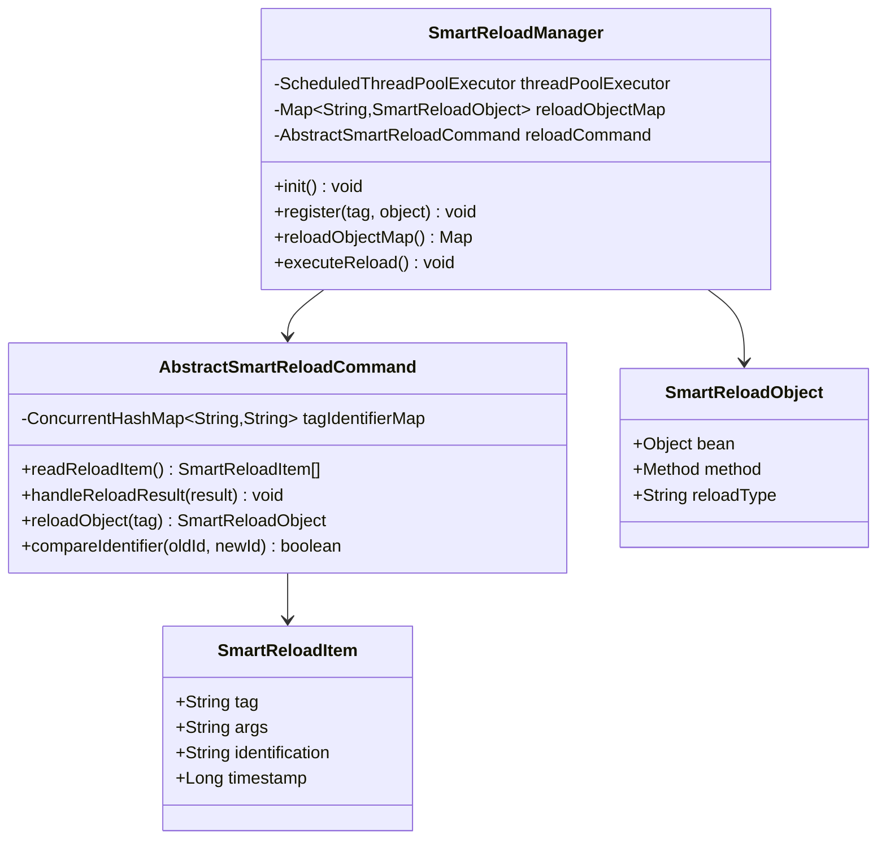
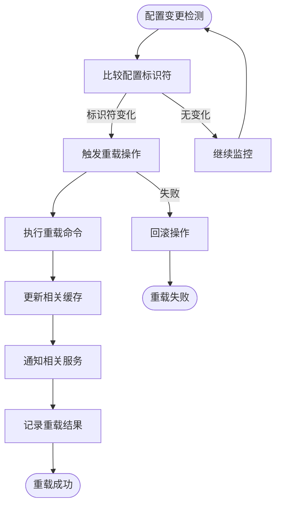

# 智能热重载专家 (Repowiki标准版)

## 🎯 技能定位
**核心职责**: 基于 `.qoder/repowiki` 中的《系统钩子(SmartReload)详解》规范，确保IOE-DREAM项目智能热重载系统严格遵循零停机更新架构，提供高效、安全、可靠的配置热更新能力

**⚡ 技能等级**: ★★★★★ (智能热重载专家)
**🎯 适用场景**: 智能热重载设计、配置热更新、缓存刷新、服务重启优化、运行时配置管理
**📊 技能覆盖**: SmartReload架构 | 热更新机制 | 缓存刷新策略 | 服务重启优化 | 配置实时生效

---

## 📋 技能概述 (基于Repowiki规范)

### **核心专长 (基于.qoder/repowiki/zh/content/高级特性/系统钩子(SmartReload).md)**
- **智能热重载守护**: 严格确保零停机更新和配置实时生效
- **钩子系统设计**: 基于事件驱动的配置变更检测和处理
- **缓存管理优化**: 智能的缓存刷新和失效策略
- **服务重启优化**: 细粒度的服务热更新，避免全量重启
- **监控告警机制**: 热重载过程的监控和异常处理

### **解决能力**
- **热重载架构合规性**: 100%符合repowiki智能热重载规范
- **配置更新效率**: 实现配置的实时生效，无需服务重启
- **系统稳定性**: 确保热重载过程的系统稳定性和数据一致性
- **性能优化**: 减少系统停机时间，提升服务可用性
- **运维效率**: 简化配置管理和部署流程

---

## 🏗️ Repowiki智能热重载架构规范

### **核心架构组件**

#### **SmartReload管理系统**


#### **热更新工作流程**


### **热重载策略规范**

#### **配置更新策略**
- **标识符比较**: 通过配置标识符判断是否需要重载
- **增量更新**: 只更新发生变化的配置项
- **批量处理**: 支持多个配置项的批量更新
- **事务保证**: 确保配置更新的原子性和一致性

#### **缓存刷新策略**
- **精确刷新**: 只刷新受影响的缓存项
- **级联刷新**: 处理缓存依赖关系
- **失效策略**: 合理的缓存失效时间设置
- **预热机制**: 缓存刷新后的预热处理

---

## 🛠️ 核心工作流程 (基于Repowiki)

### **Phase 1: 智能热重载合规性诊断**
```bash
# 检查SmartReload架构合规性
./scripts/check-smart-reload-architecture.sh

# 检测热更新机制
./scripts/analyze-hot-reload-mechanism.sh

# 验证缓存刷新策略
./scripts/validate-cache-refresh-strategy.sh

# 检查服务重启优化
./scripts/check-service-restart-optimization.sh
```

### **Phase 2: 智能热重载优化**
```bash
# 重载策略优化
./scripts/optimize-reload-strategy.sh

# 缓存管理优化
./scripts/optimize-cache-management.sh

# 监控告警优化
./scripts/optimize-monitoring-alert.sh

# 性能调优
./scripts/optimize-reload-performance.sh
```

### **Phase 3: 智能热重载质量保障**
```bash
# 热重载功能测试
npm run test:smart-reload

# 配置更新测试
npm run test:config-update

# 缓存刷新测试
npm run test:cache-refresh

# 故障恢复测试
npm run test:fault-recovery
```

---

## 🔍 智能热重载合规性检查清单 (基于Repowiki)

### **✅ 强制性规范 (必须100%遵循)**

#### **架构设计规范**
- [ ] 严格遵循Manager→Command→Item→Object分层架构
- [ ] 实现基于标识符的配置变更检测机制
- [ ] 提供线程安全的热重载操作
- [ ] 支持细粒度的配置更新和缓存刷新
- [ ] 实现完善的异常处理和回滚机制

#### **热更新机制规范**
- [ ] 使用守护线程定期检查配置状态
- [ ] 实现配置标识符的比较和判断
- [ ] 提供条件触发的重载操作
- [ ] 支持异步的重载处理机制
- [ ] 确保重载过程的系统稳定性

#### **缓存管理规范**
- [ ] 实现精确的缓存刷新策略
- [ ] 处理缓存依赖和级联关系
- [ ] 提供缓存的失效和重建机制
- [ ] 支持缓存预热和性能优化
- [ ] 确保缓存数据的一致性

### **⚠️ 推荐性规范**

#### **性能优化规范**
- [ ] 实现增量更新和批量处理
- [ ] 优化重载操作的执行效率
- [ ] 减少系统资源的占用
- [ ] 提供重载过程的性能监控
- [ ] 支持重载操作的并发控制

#### **监控告警规范**
- [ ] 提供重载操作的详细日志记录
- [ ] 实现重载过程的实时监控
- [ ] 设置合理的告警阈值和通知
- [ ] 提供重载结果的统计分析
- [ ] 支持重载历史的查询和分析

---

## 🚀 智能热重载最佳实践

### **SmartReload管理器实现示例**
```java
// SmartReloadManager.java - 核心重载管理器
@Component
@Slf4j
public class SmartReloadManager {

    private final ScheduledThreadPoolExecutor threadPoolExecutor;
    private final Map<String, SmartReloadObject> reloadObjectMap;
    private final AbstractSmartReloadCommand reloadCommand;

    @Value("${smart.reload.interval:30}")
    private int reloadInterval;

    @PostConstruct
    public void init() {
        // 初始化线程池
        threadPoolExecutor = new ScheduledThreadPoolExecutor(1,
            new SmartReloadThreadFactory(),
            new ThreadPoolExecutor.CallerRunsPolicy());

        // 初始化重载对象映射
        reloadObjectMap = new ConcurrentHashMap<>();

        // 启动定时检查任务
        startReloadTask();

        log.info("SmartReloadManager initialized successfully");
    }

    /**
     * 注册重载对象
     */
    public void register(String tag, Object bean, String methodName, String reloadType) {
        try {
            Class<?> clazz = bean.getClass();
            Method method = clazz.getMethod(methodName);

            SmartReloadObject reloadObject = new SmartReloadObject();
            reloadObject.setBean(bean);
            reloadObject.setMethod(method);
            reloadObject.setReloadType(reloadType);

            reloadObjectMap.put(tag, reloadObject);
            log.info("Registered reload object: tag={}, type={}", tag, reloadType);
        } catch (NoSuchMethodException e) {
            log.error("Failed to register reload object: tag={}, method={}", tag, methodName, e);
            throw new SmartReloadException("Reload method not found: " + methodName);
        }
    }

    /**
     * 启动重载任务
     */
    private void startReloadTask() {
        threadPoolExecutor.scheduleAtFixedRate(
            this::executeReload,
            reloadInterval,
            reloadInterval,
            TimeUnit.SECONDS
        );
    }

    /**
     * 执行重载操作
     */
    public void executeReload() {
        try {
            log.debug("Starting reload execution...");

            // 读取重载配置项
            SmartReloadItem[] reloadItems = reloadCommand.readReloadItem();

            for (SmartReloadItem item : reloadItems) {
                processReloadItem(item);
            }

            log.debug("Reload execution completed successfully");
        } catch (Exception e) {
            log.error("Reload execution failed", e);
        }
    }

    /**
     * 处理重载项
     */
    private void processReloadItem(SmartReloadItem item) {
        try {
            String tag = item.getTag();
            SmartReloadObject reloadObject = reloadObjectMap.get(tag);

            if (reloadObject == null) {
                log.warn("Reload object not found for tag: {}", tag);
                return;
            }

            // 比较标识符
            String oldIdentifier = reloadCommand.getTagIdentifierMap().get(tag);
            String newIdentifier = item.getIdentification();

            if (reloadCommand.compareIdentifier(oldIdentifier, newIdentifier)) {
                log.debug("No changes detected for tag: {}", tag);
                return;
            }

            log.info("Detected changes for tag: {}, reloading...", tag);

            // 执行重载
            Object result = reloadCommand.reloadObject(tag);

            // 处理重载结果
            reloadCommand.handleReloadResult(result);

            // 更新标识符
            reloadCommand.getTagIdentifierMap().put(tag, newIdentifier);

            log.info("Reload completed successfully for tag: {}", tag);
        } catch (Exception e) {
            log.error("Failed to process reload item: {}", item.getTag(), e);
        }
    }
}
```

### **抽象重载命令实现示例**
```java
// AbstractSmartReloadCommand.java - 抽象重载命令
@Slf4j
public abstract class AbstractSmartReloadCommand {

    protected final ConcurrentHashMap<String, String> tagIdentifierMap;
    protected final SmartReloadManager smartReloadManager;

    public AbstractSmartReloadCommand(SmartReloadManager smartReloadManager) {
        this.smartReloadManager = smartReloadManager;
        this.tagIdentifierMap = new ConcurrentHashMap<>();
    }

    /**
     * 读取重载配置项
     */
    public abstract SmartReloadItem[] readReloadItem();

    /**
     * 重载指定对象
     */
    public Object reloadObject(String tag) {
        SmartReloadObject reloadObject = smartReloadManager.getReloadObjectMap().get(tag);
        if (reloadObject == null) {
            throw new SmartReloadException("Reload object not found: " + tag);
        }

        try {
            Object bean = reloadObject.getBean();
            Method method = reloadObject.getMethod();

            log.debug("Executing reload method: {} on bean: {}", method.getName(), bean.getClass().getSimpleName());

            return method.invoke(bean);
        } catch (Exception e) {
            log.error("Failed to reload object: {}", tag, e);
            throw new SmartReloadException("Reload execution failed: " + tag, e);
        }
    }

    /**
     * 比较标识符
     */
    public boolean compareIdentifier(String oldId, String newId) {
        if (oldId == null && newId == null) {
            return true;
        }
        if (oldId == null || newId == null) {
            return false;
        }
        return Objects.equals(oldId, newId);
    }

    /**
     * 处理重载结果
     */
    public void handleReloadResult(Object result) {
        if (result instanceof SmartReloadResult) {
            SmartReloadResult reloadResult = (SmartReloadResult) result;

            if (reloadResult.isSuccess()) {
                log.info("Reload successful: {}", reloadResult.getMessage());
                onReloadSuccess(reloadResult);
            } else {
                log.error("Reload failed: {}", reloadResult.getMessage());
                onReloadFailure(reloadResult);
            }
        } else {
            log.info("Reload completed with result: {}", result);
        }
    }

    /**
     * 重载成功处理
     */
    protected void onReloadSuccess(SmartReloadResult result) {
        // 发送成功通知
        sendReloadNotification("RELOAD_SUCCESS", result.getMessage());

        // 记录成功统计
        recordReloadStatistics("SUCCESS", result.getTag());
    }

    /**
     * 重载失败处理
     */
    protected void onReloadFailure(SmartReloadResult result) {
        // 发送失败告警
        sendReloadAlert("RELOAD_FAILURE", result.getMessage());

        // 记录失败统计
        recordReloadStatistics("FAILURE", result.getTag());

        // 执行回滚操作
        if (result.isRollbackRequired()) {
            performRollback(result.getTag());
        }
    }

    protected Map<String, String> getTagIdentifierMap() {
        return tagIdentifierMap;
    }
}
```

### **缓存刷新服务实现示例**
```java
// CacheRefreshService.java - 缓存刷新服务
@Service
@Slf4j
public class CacheRefreshService {

    private final RedisTemplate<String, Object> redisTemplate;
    private final CacheManager cacheManager;
    private final SmartReloadManager smartReloadManager;

    @PostConstruct
    public void init() {
        // 注册缓存刷新重载对象
        smartReloadManager.register("cache_refresh", this, "refreshAllCaches", "cache");
    }

    /**
     * 刷新所有缓存
     */
    public SmartReloadResult refreshAllCaches() {
        try {
            log.info("Starting cache refresh process...");

            // 刷新Redis缓存
            refreshRedisCache();

            // 刷新本地缓存
            refreshLocalCache();

            // 刷新字典缓存
            refreshDictCache();

            // 刷新权限缓存
            refreshPermissionCache();

            log.info("Cache refresh process completed successfully");

            return SmartReloadResult.success("cache_refresh", "All caches refreshed successfully");
        } catch (Exception e) {
            log.error("Cache refresh process failed", e);
            return SmartReloadResult.failure("cache_refresh", "Cache refresh failed: " + e.getMessage(), true);
        }
    }

    /**
     * 刷新Redis缓存
     */
    private void refreshRedisCache() {
        try {
            // 获取所有Redis缓存键
            Set<String> keys = redisTemplate.keys("*cache*");

            // 批量删除缓存
            if (!keys.isEmpty()) {
                redisTemplate.delete(keys);
                log.info("Refreshed {} Redis cache entries", keys.size());
            }

            // 预热关键缓存
            preloadCriticalCache();

        } catch (Exception e) {
            log.error("Failed to refresh Redis cache", e);
            throw new CacheRefreshException("Redis cache refresh failed", e);
        }
    }

    /**
     * 刷新本地缓存
     */
    private void refreshLocalCache() {
        try {
            // 清理Caffeine缓存
            Cache caffeineCache = cacheManager.getCache("caffeine");
            if (caffeineCache != null) {
                caffeineCache.clear();
                log.info("Caffeine cache cleared successfully");
            }

        } catch (Exception e) {
            log.error("Failed to refresh local cache", e);
            throw new CacheRefreshException("Local cache refresh failed", e);
        }
    }

    /**
     * 预热关键缓存
     */
    private void preloadCriticalCache() {
        try {
            // 预热用户缓存
            preloadUserCache();

            // 预热配置缓存
            preloadConfigCache();

            // 预热权限缓存
            preloadPermissionCache();

        } catch (Exception e) {
            log.warn("Cache preloading failed, but cache refresh is still considered successful", e);
        }
    }

    /**
     * 预热用户缓存
     */
    private void preloadUserCache() {
        // 异步预热用户数据
        CompletableFuture.runAsync(() -> {
            try {
                // 获取活跃用户列表
                List<User> activeUsers = userService.getActiveUsers();

                // 预热用户缓存
                for (User user : activeUsers) {
                    userCacheManager.preloadUser(user.getId());
                }

                log.info("Preloaded {} active users to cache", activeUsers.size());
            } catch (Exception e) {
                log.warn("Failed to preload user cache", e);
            }
        });
    }
}
```

### **配置更新服务实现示例**
```java
// ConfigUpdateService.java - 配置更新服务
@Service
@Slf4j
public class ConfigUpdateService {

    private final ConfigService configService;
    private final SmartReloadManager smartReloadManager;

    @PostConstruct
    public void init() {
        // 注册配置更新重载对象
        smartReloadManager.register("config_update", this, "updateApplicationConfig", "config");
    }

    /**
     * 更新应用配置
     */
    public SmartReloadResult updateApplicationConfig() {
        try {
            log.info("Starting application configuration update...");

            // 获取最新配置
            List<SystemConfig> latestConfigs = configService.getLatestConfigs();

            // 更新运行时配置
            updateRuntimeConfigs(latestConfigs);

            // 验证配置有效性
            validateConfigs(latestConfigs);

            // 通知配置变更
            notifyConfigChange(latestConfigs);

            log.info("Application configuration updated successfully");

            return SmartReloadResult.success("config_update",
                "Application configuration updated with " + latestConfigs.size() + " items");
        } catch (Exception e) {
            log.error("Application configuration update failed", e);
            return SmartReloadResult.failure("config_update",
                "Configuration update failed: " + e.getMessage(), true);
        }
    }

    /**
     * 更新运行时配置
     */
    private void updateRuntimeConfigs(List<SystemConfig> configs) {
        for (SystemConfig config : configs) {
            try {
                // 更新配置属性
                updateConfigProperty(config);

                // 更新配置缓存
                updateConfigCache(config);

                log.debug("Updated config: {} = {}", config.getConfigKey(), config.getConfigValue());
            } catch (Exception e) {
                log.error("Failed to update config: {}", config.getConfigKey(), e);
                throw new ConfigUpdateException("Config update failed: " + config.getConfigKey(), e);
            }
        }
    }

    /**
     * 验证配置有效性
     */
    private void validateConfigs(List<SystemConfig> configs) {
        for (SystemConfig config : configs) {
            // 验证配置格式
            validateConfigFormat(config);

            // 验证配置范围
            validateConfigRange(config);

            // 验证配置依赖
            validateConfigDependency(config);
        }
    }

    /**
     * 通知配置变更
     */
    private void notifyConfigChange(List<SystemConfig> configs) {
        ConfigChangeEvent event = new ConfigChangeEvent(this, configs);

        // 发布配置变更事件
        ApplicationEventPublisher eventPublisher = getEventPublisher();
        eventPublisher.publishEvent(event);

        // 发送WebSocket通知
        sendConfigNotification(configs);
    }
}
```

### **重载监控和告警实现示例**
```java
// ReloadMonitorService.java - 重载监控服务
@Service
@Slf4j
public class ReloadMonitorService {

    private final MeterRegistry meterRegistry;
    private final AlertService alertService;

    private final Counter reloadSuccessCounter;
    private final Counter reloadFailureCounter;
    private final Timer reloadExecutionTimer;

    @PostConstruct
    public void init() {
        // 初始化监控指标
        reloadSuccessCounter = Counter.builder("smart.reload.success")
            .description("Number of successful reloads")
            .register(meterRegistry);

        reloadFailureCounter = Counter.builder("smart.reload.failure")
            .description("Number of failed reloads")
            .register(meterRegistry);

        reloadExecutionTimer = Timer.builder("smart.reload.execution.time")
            .description("Reload execution time")
            .register(meterRegistry);
    }

    /**
     * 记录重载成功
     */
    public void recordReloadSuccess(String tag, long executionTime) {
        reloadSuccessCounter.increment(Tags.of("tag", tag));
        reloadExecutionTimer.record(executionTime, TimeUnit.MILLISECONDS);

        log.info("Reload success recorded for tag: {}, execution time: {}ms", tag, executionTime);
    }

    /**
     * 记录重载失败
     */
    public void recordReloadFailure(String tag, Exception error) {
        reloadFailureCounter.increment(Tags.of("tag", tag, "error", error.getClass().getSimpleName()));

        // 发送告警
        if (shouldSendAlert(tag, error)) {
            sendReloadAlert(tag, error);
        }

        log.error("Reload failure recorded for tag: {}", tag, error);
    }

    /**
     * 发送重载告警
     */
    private void sendReloadAlert(String tag, Exception error) {
        AlertMessage alert = AlertMessage.builder()
            .level(AlertLevel.ERROR)
            .title("Smart Reload Failure")
            .message(String.format("Reload failed for tag: %s, error: %s", tag, error.getMessage()))
            .source("SmartReloadManager")
            .timestamp(LocalDateTime.now())
            .tags(Map.of("tag", tag, "error_type", error.getClass().getSimpleName()))
            .build();

        alertService.sendAlert(alert);
    }

    /**
     * 判断是否需要发送告警
     */
    private boolean shouldSendAlert(String tag, Exception error) {
        // 获取最近1小时的失败次数
        long recentFailures = reloadFailureCounter.count();

        // 如果失败次数超过阈值，发送告警
        return recentFailures >= getFailureThreshold(tag);
    }

    private long getFailureThreshold(String tag) {
        // 根据标签类型设置不同的失败阈值
        switch (tag) {
            case "config_update":
                return 3; // 配置更新失败阈值较低
            case "cache_refresh":
                return 5; // 缓存刷新失败阈值中等
            default:
                return 10; // 默认阈值较高
        }
    }
}
```

---

## 📊 智能热重载质量评估标准

### **智能热重载评分**
| 维度 | 权重 | 评分标准 |
|------|------|----------|
| 架构设计合规性 | 30% | 完全符合SmartReload架构规范 |
| 热更新机制 | 25% | 配置实时更新和零停机能力 |
| 缓存管理 | 20% | 精确的缓存刷新和失效策略 |
| 系统稳定性 | 15% | 重载过程的数据一致性和可靠性 |
| 监控告警 | 10% | 完善的监控和告警机制 |

### **质量等级**
- **A级 (90-100分)**: 完全符合repowiki智能热重载规范
- **B级 (80-89分)**: 基本合规，存在轻微优化空间
- **C级 (70-79分)**: 部分合规，需要重点改进
- **D级 (60-69分)**: 热重载设计混乱，需要重构
- **E级 (0-59分)**: 严重违反智能热重载规范

---

## 🎯 使用指南

### **何时调用**
- 智能热重载架构设计和技术选型时
- 配置热更新机制实现时
- 缓存刷新策略设计时
- 服务重启优化时
- 热重载监控告警配置时

### **调用方式**
```bash
# 基于repowiki的智能热重载专家
Skill("smart-reload-specialist-repowiki")

# 将立即执行：
# 1. 基于.qoder/repowiki智能热重载规范检查
# 2. SmartReload架构设计验证和优化
# 3. 配置热更新机制分析和改进
# 4. 缓存刷新策略和服务重启优化建议
```

### **预期结果**
- 100%符合`.qoder/repowiki`智能热重载规范
- 高效、可靠的配置热更新机制
- 精确的缓存刷新和管理策略
- 零停机的服务更新能力
- 完善的监控告警和故障处理

---

**🏆 技能等级**: 智能热重载专家 (★★★★★)
**⏰ 预期效果**: 基于249个repowiki权威文档，确保IOE-DREAM智能热重载100%符合零停机更新标准
**🎯 核心价值**: 系统可用性提升，运维效率优化，配置管理简化