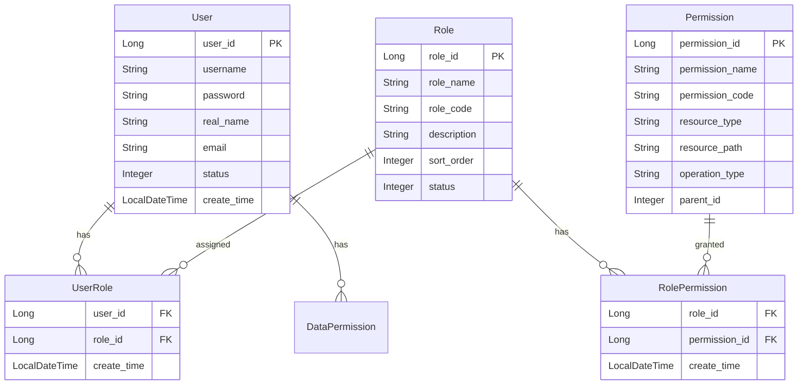

# 🔐 RBAC权限系统设计与实现

> **版本**: v1.0.0
> **更新时间**: 2025-11-16
> **分类**: 业务操作技能
> **标签**: 权限管理、RBAC、安全认证、访问控制
> **技能等级**: ★★☆ 中级
> **适用角色**: 后端开发工程师、系统架构师、安全工程师
> **预计学时**: 60-80小时

---

## 📚 知识要求

### 理论知识
- **RBAC模型**: Role-Based Access Control（基于角色的访问控制）
- **权限模型**: 用户-角色-权限（User-Role-Permission）关系
- **安全认证**: JWT、OAuth2、Session管理
- **访问控制**: 资源权限、操作权限、数据权限

### 业务理解
- **企业权限管理**: 组织架构、岗位权限、数据隔离
- **权限继承**: 角色继承、权限传递、权限冲突解决
- **动态权限**: 实时权限更新、权限缓存、权限验证

### 技术背景
- **Spring Security**: 安全框架、过滤器链、认证授权
- **Sa-Token**: 轻量级Java权限认证框架
- **数据库设计**: 权限表设计、索引优化、关联查询
- **缓存策略**: 权限缓存、权限失效、权限预热

---

## 🛠️ 核心技能实现

### 1. RBAC权限模型设计

#### 核心实体关系


#### 数据库表设计
```sql
-- 用户表
CREATE TABLE t_user (
    user_id BIGINT PRIMARY KEY AUTO_INCREMENT COMMENT '用户ID',
    username VARCHAR(50) NOT NULL UNIQUE COMMENT '用户名',
    password VARCHAR(128) NOT NULL COMMENT '密码',
    real_name VARCHAR(50) COMMENT '真实姓名',
    email VARCHAR(100) COMMENT '邮箱',
    phone VARCHAR(20) COMMENT '手机号',
    status TINYINT DEFAULT 1 COMMENT '状态(1:正常 0:禁用)',
    create_time DATETIME DEFAULT CURRENT_TIMESTAMP,
    update_time DATETIME DEFAULT CURRENT_TIMESTAMP ON UPDATE CURRENT_TIMESTAMP,
    deleted_flag TINYINT DEFAULT 0,
    INDEX idx_username (username),
    INDEX idx_status (status)
) ENGINE=InnoDB DEFAULT CHARSET=utf8mb4 COMMENT='用户表';

-- 角色表
CREATE TABLE t_role (
    role_id BIGINT PRIMARY KEY AUTO_INCREMENT COMMENT '角色ID',
    role_name VARCHAR(50) NOT NULL COMMENT '角色名称',
    role_code VARCHAR(50) NOT NULL UNIQUE COMMENT '角色编码',
    description VARCHAR(200) COMMENT '角色描述',
    sort_order INT DEFAULT 0 COMMENT '排序',
    status TINYINT DEFAULT 1 COMMENT '状态(1:正常 0:禁用)',
    create_time DATETIME DEFAULT CURRENT_TIMESTAMP,
    update_time DATETIME DEFAULT CURRENT_TIMESTAMP ON UPDATE CURRENT_TIMESTAMP,
    deleted_flag TINYINT DEFAULT 0,
    INDEX idx_role_code (role_code),
    INDEX idx_status (status)
) ENGINE=InnoDB DEFAULT CHARSET=utf8mb4 COMMENT='角色表';

-- 权限表
CREATE TABLE t_permission (
    permission_id BIGINT PRIMARY KEY AUTO_INCREMENT COMMENT '权限ID',
    permission_name VARCHAR(100) NOT NULL COMMENT '权限名称',
    permission_code VARCHAR(100) NOT NULL UNIQUE COMMENT '权限编码',
    resource_type TINYINT NOT NULL COMMENT '资源类型(1:菜单 2:按钮 3:接口)',
    resource_path VARCHAR(200) COMMENT '资源路径',
    operation_type VARCHAR(20) COMMENT '操作类型(ADD/EDIT/DELETE/QUERY)',
    parent_id BIGINT DEFAULT 0 COMMENT '父权限ID',
    sort_order INT DEFAULT 0 COMMENT '排序',
    status TINYINT DEFAULT 1 COMMENT '状态(1:正常 0:禁用)',
    create_time DATETIME DEFAULT CURRENT_TIMESTAMP,
    update_time DATETIME DEFAULT CURRENT_TIMESTAMP ON UPDATE CURRENT_TIMESTAMP,
    deleted_flag TINYINT DEFAULT 0,
    INDEX idx_permission_code (permission_code),
    INDEX idx_parent_id (parent_id),
    INDEX idx_resource_type (resource_type)
) ENGINE=InnoDB DEFAULT CHARSET=utf8mb4 COMMENT='权限表';

-- 用户角色关联表
CREATE TABLE t_user_role (
    id BIGINT PRIMARY KEY AUTO_INCREMENT,
    user_id BIGINT NOT NULL COMMENT '用户ID',
    role_id BIGINT NOT NULL COMMENT '角色ID',
    create_time DATETIME DEFAULT CURRENT_TIMESTAMP,
    UNIQUE KEY uk_user_role (user_id, role_id),
    INDEX idx_user_id (user_id),
    INDEX idx_role_id (role_id),
    FOREIGN KEY (user_id) REFERENCES t_user(user_id),
    FOREIGN KEY (role_id) REFERENCES t_role(role_id)
) ENGINE=InnoDB DEFAULT CHARSET=utf8mb4 COMMENT='用户角色关联表';

-- 角色权限关联表
CREATE TABLE t_role_permission (
    id BIGINT PRIMARY KEY AUTO_INCREMENT,
    role_id BIGINT NOT NULL COMMENT '角色ID',
    permission_id BIGINT NOT NULL COMMENT '权限ID',
    create_time DATETIME DEFAULT CURRENT_TIMESTAMP,
    UNIQUE KEY uk_role_permission (role_id, permission_id),
    INDEX idx_role_id (role_id),
    INDEX idx_permission_id (permission_id),
    FOREIGN KEY (role_id) REFERENCES t_role(role_id),
    FOREIGN KEY (permission_id) REFERENCES t_permission(permission_id)
) ENGINE=InnoDB DEFAULT CHARSET=utf8mb4 COMMENT='角色权限关联表';
```

### 2. 权限认证核心实现

#### Sa-Token权限配置
```java
/**
 * Sa-Token 权限配置
 */
@Configuration
public class SaTokenConfig {

    /**
     * 配置Sa-Token
     */
    @Bean
    public SaTokenConfig saTokenConfig() {
        return new SaTokenConfig()
                // token名称
                .setTokenName("satoken")
                // token有效期（单位：秒）
                .setActiveTimeout(2592000)
                // token临时有效期（指定时间内无操作就视为token过期）
                .setActiveTimeout(1800)
                // 是否允许同一账号并发登录
                .setIsConcurrent(true)
                // 在多人登录同一账号时，是否共用一个token
                .setIsShare(true)
                // token风格
                .setTokenStyle("uuid")
                // 是否输出操作日志
                .setIsLog(true);
    }
}
```

#### 权限验证服务
```java
/**
 * 权限验证服务
 */
@Slf4j
@Service
@RequiredArgsConstructor
public class PermissionService {

    @Resource
    private UserRoleDao userRoleDao;

    @Resource
    private RolePermissionDao rolePermissionDao;

    @Resource
    private RedisTemplate<String, Object> redisTemplate;

    private static final String USER_PERMISSION_KEY = "user:permission:";
    private static final long PERMISSION_CACHE_EXPIRE = 1800; // 30分钟

    /**
     * 检查用户是否有指定权限
     */
    public boolean hasPermission(Long userId, String permissionCode) {
        try {
            // 1. 获取用户权限列表（带缓存）
            Set<String> userPermissions = getUserPermissions(userId);

            // 2. 检查权限是否存在
            boolean hasPermission = userPermissions.contains(permissionCode);

            log.debug("权限检查: userId={}, permissionCode={}, result={}",
                userId, permissionCode, hasPermission);

            return hasPermission;
        } catch (Exception e) {
            log.error("权限检查异常: userId={}, permissionCode={}", userId, permissionCode, e);
            return false;
        }
    }

    /**
     * 获取用户权限列表（缓存优化）
     */
    @SuppressWarnings("unchecked")
    public Set<String> getUserPermissions(Long userId) {
        String cacheKey = USER_PERMISSION_KEY + userId;

        try {
            // 先从缓存获取
            Set<String> permissions = (Set<String>) redisTemplate.opsForValue().get(cacheKey);
            if (permissions != null) {
                log.debug("权限缓存命中: userId={}", userId);
                return permissions;
            }

            // 缓存未命中，从数据库查询
            permissions = queryUserPermissionsFromDB(userId);

            // 写入缓存
            redisTemplate.opsForValue().set(cacheKey, permissions,
                PERMISSION_CACHE_EXPIRE, TimeUnit.SECONDS);

            return permissions;
        } catch (Exception e) {
            log.error("获取用户权限异常: userId={}", userId, e);
            return Collections.emptySet();
        }
    }

    /**
     * 从数据库查询用户权限
     */
    private Set<String> queryUserPermissionsFromDB(Long userId) {
        // 1. 查询用户角色
        List<Long> roleIds = userRoleDao.selectRoleIdsByUserId(userId);
        if (roleIds.isEmpty()) {
            return Collections.emptySet();
        }

        // 2. 查询角色权限
        List<String> permissionCodes = rolePermissionDao.selectPermissionCodesByRoleIds(roleIds);

        return new HashSet<>(permissionCodes);
    }

    /**
     * 清除用户权限缓存
     */
    public void clearUserPermissionCache(Long userId) {
        String cacheKey = USER_PERMISSION_KEY + userId;
        try {
            redisTemplate.delete(cacheKey);
            log.info("清除用户权限缓存: userId={}", userId);
        } catch (Exception e) {
            log.error("清除用户权限缓存失败: userId={}", userId, e);
        }
    }

    /**
     * 批量清除用户权限缓存
     */
    public void clearUserPermissionCache(List<Long> userIds) {
        if (userIds != null && !userIds.isEmpty()) {
            List<String> cacheKeys = userIds.stream()
                .map(userId -> USER_PERMISSION_KEY + userId)
                .collect(Collectors.toList());

            try {
                redisTemplate.delete(cacheKeys);
                log.info("批量清除用户权限缓存: count={}", userIds.size());
            } catch (Exception e) {
                log.error("批量清除用户权限缓存失败", e);
            }
        }
    }
}
```

### 3. 权限注解系统

#### @SaCheckPermission 注解使用
```java
/**
 * 用户管理控制器
 */
@RestController
@RequestMapping("/api/user")
@Validated
@Slf4j
public class UserController {

    @Resource
    private UserService userService;

    /**
     * 查询用户列表
     */
    @GetMapping("/query")
    @SaCheckPermission("user:query")
    @SaCheckLogin
    public ResponseDTO<PageResult<UserVO>> queryUsers(
            @Valid UserQueryForm queryForm) {
        PageResult<UserVO> result = userService.queryUsers(queryForm);
        return ResponseDTO.ok(result);
    }

    /**
     * 新增用户
     */
    @PostMapping("/add")
    @SaCheckPermission("user:add")
    @SaCheckLogin
    @OperationLog(type = OperationLogTypeEnum.ADD, describe = "新增用户")
    public ResponseDTO<String> addUser(@Valid @RequestBody UserAddForm addForm) {
        Long userId = userService.addUser(addForm);
        return ResponseDTO.ok(userId.toString());
    }

    /**
     * 编辑用户
     */
    @PutMapping("/edit")
    @SaCheckPermission("user:edit")
    @SaCheckLogin
    @OperationLog(type = OperationLogTypeEnum.UPDATE, describe = "编辑用户")
    public ResponseDTO<String> editUser(@Valid @RequestBody UserEditForm editForm) {
        userService.editUser(editForm);
        return ResponseDTO.ok();
    }

    /**
     * 删除用户
     */
    @DeleteMapping("/delete/{userId}")
    @SaCheckPermission("user:delete")
    @SaCheckLogin
    @OperationLog(type = OperationLogTypeEnum.DELETE, describe = "删除用户")
    public ResponseDTO<String> deleteUser(@PathVariable Long userId) {
        userService.deleteUser(userId);
        return ResponseDTO.ok();
    }

    /**
     * 分配角色
     */
    @PostMapping("/assignRoles")
    @SaCheckPermission("user:assignRoles")
    @SaCheckLogin
    @OperationLog(type = OperationLogTypeEnum.UPDATE, describe = "分配用户角色")
    public ResponseDTO<String> assignRoles(@Valid @RequestBody AssignRolesForm form) {
        userService.assignRoles(form.getUserId(), form.getRoleIds());
        return ResponseDTO.ok();
    }
}
```

### 4. 权限管理核心服务

#### 用户角色服务
```java
/**
 * 用户角色管理服务
 */
@Service
@RequiredArgsConstructor
@Slf4j
public class UserRoleService {

    @Resource
    private UserRoleDao userRoleDao;

    @Resource
    private PermissionService permissionService;

    /**
     * 分配用户角色
     */
    @CacheEvict(key = "user:", pattern = "*")
    @Transactional(rollbackFor = Exception.class)
    public void assignRoles(Long userId, List<Long> roleIds) {
        try {
            // 1. 删除用户原有角色
            userRoleDao.deleteByUserId(userId);

            // 2. 分配新角色
            if (roleIds != null && !roleIds.isEmpty()) {
                List<UserRoleEntity> userRoles = roleIds.stream()
                    .map(roleId -> UserRoleEntity.builder()
                        .userId(userId)
                        .roleId(roleId)
                        .createTime(LocalDateTime.now())
                        .build())
                    .collect(Collectors.toList());

                userRoleDao.batchInsert(userRoles);
            }

            // 3. 清除用户权限缓存
            permissionService.clearUserPermissionCache(userId);

            log.info("用户角色分配成功: userId={}, roleCount={}", userId,
                roleIds != null ? roleIds.size() : 0);
        } catch (Exception e) {
            log.error("用户角色分配失败: userId={}, roleIds={}", userId, roleIds, e);
            throw new ServiceException("用户角色分配失败");
        }
    }

    /**
     * 获取用户角色列表
     */
    public List<RoleEntity> getUserRoles(Long userId) {
        List<Long> roleIds = userRoleDao.selectRoleIdsByUserId(userId);
        if (roleIds.isEmpty()) {
            return Collections.emptyList();
        }

        return roleDao.selectByIds(roleIds);
    }
}
```

#### 权限树构建服务
```java
/**
 * 权限树构建服务
 */
@Service
@RequiredArgsConstructor
@Slf4j
public class PermissionTreeService {

    @Resource
    private PermissionDao permissionDao;

    /**
     * 构建权限树
     */
    public List<PermissionTreeNode> buildPermissionTree() {
        try {
            // 1. 查询所有有效权限
            List<PermissionEntity> permissions = permissionDao.selectByStatus(1);

            // 2. 转换为树节点
            List<PermissionTreeNode> nodes = permissions.stream()
                .map(this::convertToTreeNode)
                .collect(Collectors.toList());

            // 3. 构建树结构
            return buildTree(nodes, 0L);
        } catch (Exception e) {
            log.error("构建权限树失败", e);
            return Collections.emptyList();
        }
    }

    /**
     * 构建树结构
     */
    private List<PermissionTreeNode> buildTree(List<PermissionTreeNode> nodes, Long parentId) {
        List<PermissionTreeNode> treeNodes = new ArrayList<>();

        for (PermissionTreeNode node : nodes) {
            if (parentId.equals(node.getParentId())) {
                // 递归构建子节点
                List<PermissionTreeNode> children = buildTree(nodes, node.getPermissionId());
                node.setChildren(children);
                treeNodes.add(node);
            }
        }

        // 按排序字段排序
        treeNodes.sort(Comparator.comparing(PermissionTreeNode::getSortOrder));

        return treeNodes;
    }

    /**
     * 转换为树节点
     */
    private PermissionTreeNode convertToTreeNode(PermissionEntity permission) {
        return PermissionTreeNode.builder()
                .permissionId(permission.getPermissionId())
                .permissionName(permission.getPermissionName())
                .permissionCode(permission.getPermissionCode())
                .resourceType(permission.getResourceType())
                .resourcePath(permission.getResourcePath())
                .operationType(permission.getOperationType())
                .parentId(permission.getParentId())
                .sortOrder(permission.getSortOrder())
                .build();
    }
}
```

---

## ⚠️ 注意事项

### 安全提醒
- **权限最小化**: 遵循最小权限原则，避免过度授权
- **权限隔离**: 实现租户级权限隔离，防止跨租户数据访问
- **权限审计**: 记录所有权限变更操作，便于审计追踪

### 质量要求
- **性能优化**: 权限验证响应时间≤50ms，支持高并发访问
- **缓存策略**: 权限数据缓存30分钟，支持实时清除
- **一致性**: 权限变更后5秒内生效，保证数据一致性

### 最佳实践
- **角色设计**: 基于业务场景设计角色，避免角色过多过杂
- **权限粒度**: 权限粒度适中，既能满足业务需求又便于管理
- **权限继承**: 支持角色权限继承，减少重复配置

### 常见错误
- **权限遗漏**: 新增功能忘记配置权限，导致访问被拒绝
- **权限冗余**: 重复配置相同权限，导致维护困难
- **缓存失效**: 权限变更后缓存未及时清除，导致权限不一致

---

## 📊 评估标准

### 操作时间
- **模型设计**: 12小时（RBAC模型设计、数据库表创建）
- **权限认证**: 8小时（Sa-Token集成、权限验证逻辑）
- **权限管理**: 10小时（角色权限分配、权限树构建）
- **缓存优化**: 6小时（权限缓存、性能优化）

### 准确率
- **权限验证**: 100%准确，无权限绕过问题
- **权限一致性**: 100%一致，权限变更立即生效
- **性能指标**: 权限验证响应时间≤50ms

### 质量标准
- **代码质量**: 遵循四层架构规范，无安全漏洞
- **功能完整**: 支持用户、角色、权限的完整CRUD操作
- **可扩展性**: 支持数据权限、接口权限等扩展功能

---

## 🔗 相关技能

### 相关技能
- **multi-level-cache-architecture**: 多级缓存架构技能
- **spring-boot-development**: Spring Boot企业级开发技能
- **code-quality-protector**: 代码质量守护技能

### 进阶路径
- **数据权限**: 基于组织架构的数据权限控制
- **OAuth2集成**: 第三方登录和单点登录
- **API网关权限**: 微服务架构下的统一权限控制

### 参考资料
- **Sa-Token官方文档**: https://sa-token.cc/
- **Spring Security文档**: https://spring.io/projects/spring-security
- **RBAC标准**: ANSI INCITS 359-2004