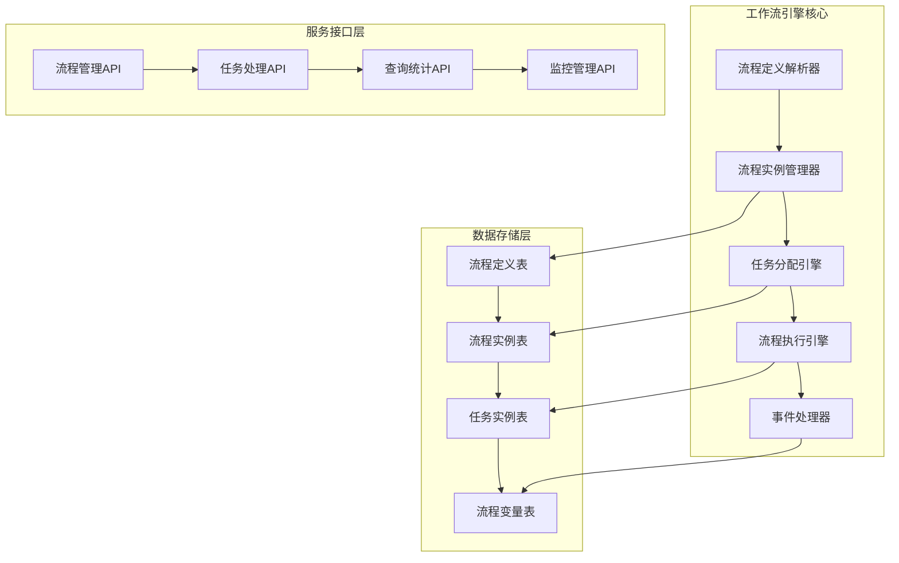

# ⚙️ 工作流引擎设计与实现

> **版本**: v1.0.0
> **更新时间**: 2025-11-16
> **分类**: 业务操作技能
> **标签**: 工作流、OA系统、流程引擎、审批流
> **技能等级**: ★★★ 高级
> **适用角色**: 后端架构师、OA系统开发工程师、流程引擎专家
> **预计学时**: 80-120小时

---

## 📚 知识要求

### 理论知识
- **BPMN 2.0**: 业务流程模型和 notation 标准
- **工作流模式**: 顺序流、并行流、条件流、子流程
- **状态机**: 流程状态转换、事件驱动、条件判断
- **流程设计**: 流程建模、流程优化、流程监控

### 业务理解
- **企业审批流程**: 请假、报销、采购、合同审批
- **OA系统需求**: 流程定义、流程实例、任务分配、消息通知
- **流程管理**: 流程版本控制、流程回退、流程撤销、流程委托

### 技术背景
- **Activiti/Camunda**: 开源工作流引擎
- **Spring Integration**: 企业应用集成模式
- **任务调度**: 定时任务、异步处理、事件驱动
- **数据库事务**: 分布式事务、事务补偿、 saga模式

---

## 🛠️ 核心技能实现

### 1. 工作流引擎架构设计

#### 核心组件架构


#### 核心数据模型
```sql
-- 流程定义表
CREATE TABLE t_workflow_definition (
    definition_id BIGINT PRIMARY KEY AUTO_INCREMENT COMMENT '流程定义ID',
    process_key VARCHAR(100) NOT NULL COMMENT '流程键',
    process_name VARCHAR(200) NOT NULL COMMENT '流程名称',
    version INT NOT NULL DEFAULT 1 COMMENT '版本号',
    process_description TEXT COMMENT '流程描述',
    bpmn_xml LONGTEXT NOT NULL COMMENT 'BPMN XML定义',
    start_form_key VARCHAR(200) COMMENT '启动表单键',
    category VARCHAR(50) COMMENT '流程分类',
    status TINYINT DEFAULT 1 COMMENT '状态(1:激活 0:挂起)',
    create_time DATETIME DEFAULT CURRENT_TIMESTAMP,
    update_time DATETIME DEFAULT CURRENT_TIMESTAMP ON UPDATE CURRENT_TIMESTAMP,
    deleted_flag TINYINT DEFAULT 0,
    UNIQUE KEY uk_process_key_version (process_key, version),
    INDEX idx_process_key (process_key),
    INDEX idx_status (status)
) ENGINE=InnoDB DEFAULT CHARSET=utf8mb4 COMMENT='流程定义表';

-- 流程实例表
CREATE TABLE t_workflow_instance (
    instance_id BIGINT PRIMARY KEY AUTO_INCREMENT COMMENT '流程实例ID',
    definition_id BIGINT NOT NULL COMMENT '流程定义ID',
    process_key VARCHAR(100) NOT NULL COMMENT '流程键',
    process_name VARCHAR(200) NOT NULL COMMENT '流程名称',
    instance_name VARCHAR(200) COMMENT '实例名称',
    business_key VARCHAR(100) COMMENT '业务键',
    starter_id BIGINT NOT NULL COMMENT '启动人ID',
    starter_name VARCHAR(50) NOT NULL COMMENT '启动人姓名',
    start_time DATETIME NOT NULL COMMENT '开始时间',
    end_time DATETIME COMMENT '结束时间',
    duration BIGINT COMMENT '持续时间(毫秒)',
    status VARCHAR(20) NOT NULL COMMENT '状态(RUNNING/SUSPENDED/COMPLETED/CANCELLED)',
    current_node_id VARCHAR(100) COMMENT '当前节点ID',
    create_time DATETIME DEFAULT CURRENT_TIMESTAMP,
    update_time DATETIME DEFAULT CURRENT_TIMESTAMP ON UPDATE CURRENT_TIMESTAMP,
    INDEX idx_definition_id (definition_id),
    INDEX idx_business_key (business_key),
    INDEX idx_starter_id (starter_id),
    INDEX idx_status (status),
    FOREIGN KEY (definition_id) REFERENCES t_workflow_definition(definition_id)
) ENGINE=InnoDB DEFAULT CHARSET=utf8mb4 COMMENT='流程实例表';

-- 任务实例表
CREATE TABLE t_workflow_task (
    task_id BIGINT PRIMARY KEY AUTO_INCREMENT COMMENT '任务ID',
    instance_id BIGINT NOT NULL COMMENT '流程实例ID',
    definition_key VARCHAR(100) NOT NULL COMMENT '流程键',
    task_name VARCHAR(200) NOT NULL COMMENT '任务名称',
    task_key VARCHAR(100) NOT NULL COMMENT '任务键',
    assignee_id BIGINT COMMENT '分配人ID',
    assignee_name VARCHAR(50) COMMENT '分配人姓名',
    candidate_groups VARCHAR(500) COMMENT '候选组',
    priority INT DEFAULT 50 COMMENT '优先级',
    due_time DATETIME COMMENT '到期时间',
    claim_time DATETIME COMMENT '认领时间',
    start_time DATETIME NOT NULL COMMENT '开始时间',
    end_time DATETIME COMMENT '结束时间',
    duration BIGINT COMMENT '持续时间(毫秒)',
    status VARCHAR(20) NOT NULL COMMENT '状态(ASSIGNED/UNASSIGNED/COMPLETED/CANCELLED)',
    create_time DATETIME DEFAULT CURRENT_TIMESTAMP,
    update_time DATETIME DEFAULT CURRENT_TIMESTAMP ON UPDATE CURRENT_TIMESTAMP,
    INDEX idx_instance_id (instance_id),
    INDEX idx_assignee_id (assignee_id),
    INDEX idx_status (status),
    INDEX idx_create_time (create_time),
    FOREIGN KEY (instance_id) REFERENCES t_workflow_instance(instance_id)
) ENGINE=InnoDB DEFAULT CHARSET=utf8mb4 COMMENT='任务实例表';

-- 流程变量表
CREATE TABLE t_workflow_variable (
    variable_id BIGINT PRIMARY KEY AUTO_INCREMENT COMMENT '变量ID',
    instance_id BIGINT NOT NULL COMMENT '流程实例ID',
    task_id BIGINT COMMENT '任务ID',
    variable_name VARCHAR(100) NOT NULL COMMENT '变量名',
    variable_value LONGTEXT COMMENT '变量值',
    variable_type VARCHAR(50) NOT NULL COMMENT '变量类型',
    create_time DATETIME DEFAULT CURRENT_TIMESTAMP,
    update_time DATETIME DEFAULT CURRENT_TIMESTAMP ON UPDATE CURRENT_TIMESTAMP,
    UNIQUE KEY uk_instance_name (instance_id, variable_name),
    INDEX idx_instance_id (instance_id),
    INDEX idx_task_id (task_id),
    FOREIGN KEY (instance_id) REFERENCES t_workflow_instance(instance_id)
) ENGINE=InnoDB DEFAULT CHARSET=utf8mb4 COMMENT='流程变量表';
```

### 2. 流程引擎核心实现

#### 流程定义管理器
```java
/**
 * 流程定义管理器
 */
@Slf4j
@Service
@RequiredArgsConstructor
public class WorkflowDefinitionService {

    @Resource
    private WorkflowDefinitionDao definitionDao;

    @Resource
    private BpmnParser bpmnParser;

    @Resource
    private RedisTemplate<String, Object> redisTemplate;

    private static final String DEFINITION_CACHE_KEY = "workflow:definition:";

    /**
     * 部署流程定义
     */
    @Transactional(rollbackFor = Exception.class)
    public WorkflowDefinition deployWorkflow(DeployWorkflowRequest request) {
        try {
            // 1. 解析BPMN XML
            ProcessDefinition processDefinition = bpmnParser.parse(request.getBpmnXml());

            // 2. 获取最新版本号
            Integer latestVersion = definitionDao.getLatestVersion(processDefinition.getKey());
            int newVersion = latestVersion != null ? latestVersion + 1 : 1;

            // 3. 保存流程定义
            WorkflowDefinition definition = WorkflowDefinition.builder()
                    .processKey(processDefinition.getKey())
                    .processName(processDefinition.getName())
                    .version(newVersion)
                    .processDescription(request.getDescription())
                    .bpmnXml(request.getBpmnXml())
                    .startFormKey(processDefinition.getStartFormKey())
                    .category(request.getCategory())
                    .status(1)
                    .build();

            definitionDao.insert(definition);

            // 4. 清除相关缓存
            clearDefinitionCache(processDefinition.getKey());

            log.info("流程部署成功: processKey={}, version={}", processDefinition.getKey(), newVersion);
            return definition;
        } catch (Exception e) {
            log.error("流程部署失败: processKey={}", request.getProcessKey(), e);
            throw new ServiceException("流程部署失败: " + e.getMessage());
        }
    }

    /**
     * 获取最新流程定义
     */
    @Cacheable(key = "workflow:definition:", expire = 60)
    public WorkflowDefinition getLatestDefinition(String processKey) {
        return definitionDao.getLatestDefinition(processKey);
    }

    /**
     * 启动流程实例
     */
    @Transactional(rollbackFor = Exception.class)
    public WorkflowInstance startProcess(StartProcessRequest request) {
        try {
            // 1. 获取流程定义
            WorkflowDefinition definition = getLatestDefinition(request.getProcessKey());
            if (definition == null) {
                throw new ServiceException("流程定义不存在: " + request.getProcessKey());
            }

            // 2. 解析BPMN流程
            ProcessDefinition processDefinition = bpmnParser.parse(definition.getBpmnXml());

            // 3. 创建流程实例
            WorkflowInstance instance = WorkflowInstance.builder()
                    .definitionId(definition.getDefinitionId())
                    .processKey(definition.getProcessKey())
                    .processName(definition.getProcessName())
                    .instanceName(request.getInstanceName())
                    .businessKey(request.getBusinessKey())
                    .starterId(request.getStarterId())
                    .starterName(request.getStarterName())
                    .startTime(LocalDateTime.now())
                    .status("RUNNING")
                    .currentNodeId(processDefinition.getStartEvent().getId())
                    .build();

            definitionDao.insertInstance(instance);

            // 4. 保存流程变量
            saveProcessVariables(instance.getInstanceId(), null, request.getVariables());

            // 5. 执行开始事件
            executeStartEvent(instance, processDefinition, request.getVariables());

            // 6. 继续执行流程
            continueProcess(instance, processDefinition, request.getVariables());

            log.info("流程启动成功: instanceId={}, processKey={}", instance.getInstanceId(), request.getProcessKey());
            return instance;
        } catch (Exception e) {
            log.error("流程启动失败: processKey={}", request.getProcessKey(), e);
            throw new ServiceException("流程启动失败: " + e.getMessage());
        }
    }

    /**
     * 完成任务
     */
    @Transactional(rollbackFor = Exception.class)
    public void completeTask(Long taskId, CompleteTaskRequest request) {
        try {
            // 1. 获取任务信息
            WorkflowTask task = definitionDao.getTaskById(taskId);
            if (task == null) {
                throw new ServiceException("任务不存在: " + taskId);
            }

            if (!"ASSIGNED".equals(task.getStatus())) {
                throw new ServiceException("任务状态异常: " + task.getStatus());
            }

            // 2. 检查任务分配人
            if (!request.getAssigneeId().equals(task.getAssigneeId())) {
                throw new ServiceException("无权限处理此任务");
            }

            // 3. 获取流程实例和定义
            WorkflowInstance instance = definitionDao.getInstanceById(task.getInstanceId());
            WorkflowDefinition definition = definitionDao.getDefinitionById(instance.getDefinitionId());
            ProcessDefinition processDefinition = bpmnParser.parse(definition.getBpmnXml());

            // 4. 保存任务变量
            saveProcessVariables(instance.getInstanceId(), taskId, request.getVariables());

            // 5. 更新任务状态
            task.setEndTime(LocalDateTime.now());
            task.setDuration(Duration.between(task.getStartTime(), task.getEndTime()).toMillis());
            task.setStatus("COMPLETED");
            definitionDao.updateTask(task);

            // 6. 执行任务完成事件
            executeTaskCompleteEvent(instance, task, processDefinition, request.getVariables());

            // 7. 继续执行流程
            continueProcess(instance, processDefinition, request.getVariables());

            log.info("任务完成成功: taskId={}, instanceId={}", taskId, instance.getInstanceId());
        } catch (Exception e) {
            log.error("任务完成失败: taskId={}", taskId, e);
            throw new ServiceException("任务完成失败: " + e.getMessage());
        }
    }

    /**
     * 继续执行流程
     */
    private void continueProcess(WorkflowInstance instance, ProcessDefinition processDefinition,
                               Map<String, Object> variables) {
        // 获取流程变量
        Map<String, Object> processVariables = getProcessVariables(instance.getInstanceId());
        if (variables != null) {
            processVariables.putAll(variables);
        }

        // 查找当前节点
        FlowNode currentNode = processDefinition.getFlowNode(instance.getCurrentNodeId());

        // 执行流出序列
        for (SequenceFlow sequenceFlow : currentNode.getOutgoingFlows()) {
            if (evaluateCondition(sequenceFlow, processVariables)) {
                FlowNode targetNode = sequenceFlow.getTargetNode();
                executeFlowNode(instance, targetNode, processVariables);
                break; // 目前只支持单一流程路径
            }
        }
    }

    /**
     * 执行流程节点
     */
    private void executeFlowNode(WorkflowInstance instance, FlowNode node, Map<String, Object> variables) {
        if (node instanceof UserTask) {
            executeUserTask(instance, (UserTask) node, variables);
        } else if (node instanceof ServiceTask) {
            executeServiceTask(instance, (ServiceTask) node, variables);
        } else if (node instanceof ExclusiveGateway) {
            executeExclusiveGateway(instance, (ExclusiveGateway) node, variables);
        } else if (node instanceof EndEvent) {
            executeEndEvent(instance, (EndEvent) node, variables);
        }
    }

    /**
     * 执行用户任务
     */
    private void executeUserTask(WorkflowInstance instance, UserTask userTask, Map<String, Object> variables) {
        // 创建任务实例
        WorkflowTask task = WorkflowTask.builder()
                .instanceId(instance.getInstanceId())
                .definitionKey(instance.getProcessKey())
                .taskName(userTask.getName())
                .taskKey(userTask.getId())
                .priority(userTask.getPriority())
                .startTime(LocalDateTime.now())
                .status("UNASSIGNED")
                .build();

        // 分配任务
        String assignee = evaluateAssignee(userTask, variables);
        if (assignee != null) {
            task.setAssigneeId(Long.parseLong(assignee));
            task.setStatus("ASSIGNED");
        }

        // 设置候选组
        if (userTask.getCandidateGroups() != null) {
            task.setCandidateGroups(String.join(",", userTask.getCandidateGroups()));
        }

        definitionDao.insertTask(task);

        // 更新流程实例当前节点
        instance.setCurrentNodeId(userTask.getId());
        definitionDao.updateInstance(instance);

        log.info("用户任务创建成功: taskId={}, taskName={}", task.getTaskId(), userTask.getName());
    }
}
```

### 3. 任务处理服务

#### 任务分配引擎
```java
/**
 * 任务分配引擎
 */
@Slf4j
@Service
@RequiredArgsConstructor
public class TaskAssignmentService {

    @Resource
    private UserDao userDao;

    @Resource
    private RoleDao roleDao;

    @Resource
    private DepartmentDao departmentDao;

    /**
     * 评估任务分配人
     */
    public String evaluateAssignee(UserTask userTask, Map<String, Object> variables) {
        String assigneeExpression = userTask.getAssignee();
        if (StringUtils.isEmpty(assigneeExpression)) {
            return null;
        }

        try {
            // 解析表达式
            if (assigneeExpression.startsWith("${") && assigneeExpression.endsWith("}")) {
                // 变量表达式
                String variableName = assigneeExpression.substring(2, assigneeExpression.length() - 1);
                Object value = variables.get(variableName);
                return value != null ? value.toString() : null;
            } else if (assigneeExpression.startsWith("role:")) {
                // 角色表达式
                return assignByRole(assigneeExpression.substring(5), variables);
            } else if (assigneeExpression.startsWith("dept:")) {
                // 部门表达式
                return assignByDepartment(assigneeExpression.substring(5), variables);
            } else if (assigneeExpression.startsWith("leader:")) {
                // 领导表达式
                return assignByLeader(assigneeExpression.substring(7), variables);
            } else {
                // 直接用户ID
                return assigneeExpression;
            }
        } catch (Exception e) {
            log.error("任务分配人评估失败: expression={}", assigneeExpression, e);
            return null;
        }
    }

    /**
     * 按角色分配
     */
    private String assignByRole(String roleCode, Map<String, Object> variables) {
        // 获取角色用户
        List<UserEntity> users = userDao.selectByRoleCode(roleCode);
        if (users.isEmpty()) {
            return null;
        }

        // 简单负载均衡：选择任务最少的用户
        return users.stream()
                .min(Comparator.comparing(user -> getTaskCount(user.getUserId())))
                .map(user -> user.getUserId().toString())
                .orElse(null);
    }

    /**
     * 按部门分配
     */
    private String assignByDepartment(String deptCode, Map<String, Object> variables) {
        // 获取部门领导
        DepartmentEntity department = departmentDao.selectByDeptCode(deptCode);
        if (department != null && department.getLeaderId() != null) {
            return department.getLeaderId().toString();
        }

        // 获取部门用户
        List<UserEntity> users = userDao.selectByDeptCode(deptCode);
        if (users.isEmpty()) {
            return null;
        }

        return users.get(0).getUserId().toString();
    }

    /**
     * 按领导关系分配
     */
    private String assignByLeader(String leaderType, Map<String, Object> variables) {
        Object userIdObj = variables.get("userId");
        if (userIdObj == null) {
            return null;
        }

        Long userId = Long.parseLong(userIdObj.toString());

        switch (leaderType) {
            case "direct":
                return getDirectLeader(userId);
            case "department":
                return getDepartmentLeader(userId);
            case "company":
                return getCompanyLeader();
            default:
                return null;
        }
    }

    /**
     * 获取直属领导
     */
    private String getDirectLeader(Long userId) {
        UserEntity user = userDao.selectById(userId);
        return user != null && user.getLeaderId() != null ?
            user.getLeaderId().toString() : null;
    }

    /**
     * 获取部门领导
     */
    private String getDepartmentLeader(Long userId) {
        UserEntity user = userDao.selectById(userId);
        if (user != null && user.getDeptId() != null) {
            DepartmentEntity dept = departmentDao.selectById(user.getDeptId());
            return dept != null && dept.getLeaderId() != null ?
                dept.getLeaderId().toString() : null;
        }
        return null;
    }
}
```

### 4. 流程监控和统计

#### 流程监控服务
```java
/**
 * 流程监控服务
 */
@Slf4j
@Service
@RequiredArgsConstructor
public class WorkflowMonitorService {

    @Resource
    private WorkflowDefinitionDao definitionDao;

    /**
     * 获取流程统计信息
     */
    public WorkflowStatistics getWorkflowStatistics(WorkflowStatisticsRequest request) {
        try {
            LocalDate startDate = request.getStartDate();
            LocalDate endDate = request.getEndDate();

            // 流程实例统计
            ProcessInstanceStats instanceStats = ProcessInstanceStats.builder()
                    .totalCount(definitionDao.countInstanceByDateRange(startDate, endDate))
                    .completedCount(definitionDao.countInstanceByStatusAndDateRange("COMPLETED", startDate, endDate))
                    .cancelledCount(definitionDao.countInstanceByStatusAndDateRange("CANCELLED", startDate, endDate))
                    .runningCount(definitionDao.countInstanceByStatus("RUNNING"))
                    .avgDuration(definitionDao.getAvgInstanceDuration(startDate, endDate))
                    .build();

            // 任务统计
            TaskStats taskStats = TaskStats.builder()
                    .totalCount(definitionDao.countTaskByDateRange(startDate, endDate))
                    .completedCount(definitionDao.countTaskByStatusAndDateRange("COMPLETED", startDate, endDate))
                    .avgProcessTime(definitionDao.getAvgTaskProcessTime(startDate, endDate))
                    .overdueCount(definitionDao.countOverdueTasks())
                    .build();

            // 按流程类型统计
            List<ProcessTypeStats> processTypeStats = definitionDao.getProcessTypeStats(startDate, endDate);

            return WorkflowStatistics.builder()
                    .instanceStats(instanceStats)
                    .taskStats(taskStats)
                    .processTypeStats(processTypeStats)
                    .build();
        } catch (Exception e) {
            log.error("获取流程统计信息失败", e);
            return WorkflowStatistics.builder().build();
        }
    }

    /**
     * 获取待办任务统计
     */
    public TodoTaskStats getTodoTaskStats(Long userId) {
        try {
            return TodoTaskStats.builder()
                    .totalTodoCount(definitionDao.countTodoTasksByUserId(userId))
                    .overdueCount(definitionDao.countOverdueTasksByUserId(userId))
                    .urgentCount(definitionDao.countUrgentTasksByUserId(userId))
                    .todayDueCount(definitionDao.countTodayDueTasksByUserId(userId))
                    .build();
        } catch (Exception e) {
            log.error("获取待办任务统计失败: userId={}", userId, e);
            return TodoTaskStats.builder().build();
        }
    }

    /**
     * 获取流程执行时长分析
     */
    public List<ProcessDurationAnalysis> getProcessDurationAnalysis(String processKey, LocalDate startDate, LocalDate endDate) {
        try {
            return definitionDao.getProcessDurationAnalysis(processKey, startDate, endDate);
        } catch (Exception e) {
            log.error("获取流程执行时长分析失败: processKey={}", processKey, e);
            return Collections.emptyList();
        }
    }
}
```

---

## ⚠️ 注意事项

### 安全提醒
- **权限控制**: 流程操作需要严格的权限验证
- **数据隔离**: 不同租户的流程数据需要隔离
- **审计日志**: 记录所有流程操作，便于审计追踪

### 质量要求
- **性能优化**: 流程启动响应时间≤2秒，任务分配响应时间≤500ms
- **事务一致**: 流程执行过程中保证数据一致性
- **高可用**: 支持集群部署，避免单点故障

### 最佳实践
- **流程版本管理**: 支持流程版本升级和历史版本兼容
- **异常处理**: 完善的异常处理机制，避免流程中断
- **监控告警**: 实时监控流程执行状态，异常情况及时告警

### 常见错误
- **流程死锁**: 循环依赖导致流程无法继续执行
- **任务堆积**: 任务分配不均导致部分用户任务过多
- **流程变量泄露**: 敏感信息存储在流程变量中造成安全风险

---

## 📊 评估标准

### 操作时间
- **引擎设计**: 20小时（核心架构设计、数据模型设计）
- **流程解析**: 15小时（BPMN解析、流程执行引擎）
- **任务管理**: 12小时（任务分配、任务处理）
- **监控统计**: 8小时（性能监控、统计分析）

### 准确率
- **流程执行**: 100%准确，无流程异常中断
- **任务分配**: 100%准确，符合分配规则
- **数据一致性**: 100%一致，无数据丢失或重复

### 质量标准
- **代码质量**: 遵循四层架构规范，支持高并发访问
- **功能完整**: 支持完整的BPMN 2.0核心功能
- **可扩展性**: 支持自定义节点类型、自定义分配规则

---

## 🔗 相关技能

### 相关技能
- **rbac-permission-system**: RBAC权限系统技能
- **multi-level-cache-architecture**: 多级缓存架构技能
- **spring-boot-development**: Spring Boot企业级开发技能

### 进阶路径
- **BPMN 2.0高级特性**: 子流程、事件、补偿事务
- **流程挖掘**: 基于日志的流程分析和优化
- **低代码平台**: 可视化流程设计和配置

### 参考资料
- **BPMN 2.0规范**: https://www.bpmn.org/
- **Activiti用户指南**: https://www.activiti.org/user-guide/
- **工作流模式**: https://www.workflowpatterns.com/