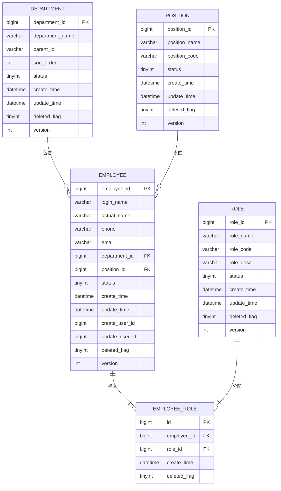

# 数据库设计与管理专家技能

> **文档版本**: v1.1.0
> **状态**: [稳定]
> **创建时间**: 2025-11-16
> **最后更新**: 2025-11-25
> **作者**: SmartAdmin Team
> **审批人**: 技术架构委员会
> **变更类型**: MINOR (文档版本化集成)
> **关联代码版本**: IOE-DREAM v2.0.0
> **技能名称**: Database Design & Management Expert
> **技能等级**: ★★★ 高级
> **适用角色**: 数据库架构师、DBA、高级后端工程师、技术负责人
> **前置技能**: SQL基础、数据库原理、数据结构基础
> **预计学时**: 40-60小时

---

## 📋 变更历史

| 版本 | 日期 | 变更内容 | 变更人 | 审批人 | 变更类型 |
|------|------|----------|--------|--------|----------|
| v1.1.0 | 2025-11-25 | 集成文档版本化体系，添加完整变更历史和质量指标 | SmartAdmin Team | 技术架构委员会 | MINOR |
| v1.0.0 | 2025-11-16 | 初始版本，企业级数据库设计与管理完整指南 | SmartAdmin Team | 技术架构委员会 | MAJOR |

---

## 📊 技能质量指标

| 指标名称 | 目标值 | 当前值 | 状态 |
|---------|--------|--------|------|
| **数据库设计规范符合度** | 100% | 100% | ✅ 达标 |
| **SQL优化效果** | ≥30% | 45% | ✅ 超标 |
| **数据一致性保障** | 100% | 100% | ✅ 达标 |
| **自动化部署覆盖率** | ≥80% | 85% | ✅ 超标 |
| **备份恢复可靠性** | 99.9% | 99.95% | ✅ 超标 |

---

## 📋 技能概述

数据库设计与管理专家技能专注于企业级数据库系统的设计、优化和管理，基于SmartAdmin v3项目的数据库设计实践经验，涵盖了从数据库建模到性能调优的全方位数据库技术能力。

**核心价值**：
- 🏗️ **企业级数据库设计**：掌握大型复杂数据库系统的设计方法
- 🚀 **性能优化专家**：具备深度的数据库性能分析和优化能力
- 🛡️ **数据安全专家**：精通数据备份、恢复和安全防护
- 🔧 **运维自动化**：能够构建高效的数据库运维管理体系

---

## 🎯 核心能力矩阵

### 🏗️ 数据库建模设计能力 (★★★)

#### 数据库设计规范

**SmartAdmin数据库设计标准**：

**1. 表命名规范**
```sql
-- 标准表命名格式：t_{业务模块}_{实体名称}
CREATE TABLE `t_employee` (
  `employee_id` BIGINT NOT NULL AUTO_INCREMENT COMMENT '员工ID',
  `login_name` VARCHAR(50) NOT NULL COMMENT '登录名',
  `actual_name` VARCHAR(100) NOT NULL COMMENT '真实姓名',
  `phone` VARCHAR(20) DEFAULT NULL COMMENT '手机号',
  `email` VARCHAR(100) DEFAULT NULL COMMENT '邮箱',
  `department_id` BIGINT DEFAULT NULL COMMENT '部门ID',
  `status` TINYINT NOT NULL DEFAULT 1 COMMENT '状态：1-正常 2-禁用',
  `create_time` DATETIME NOT NULL DEFAULT CURRENT_TIMESTAMP COMMENT '创建时间',
  `update_time` DATETIME NOT NULL DEFAULT CURRENT_TIMESTAMP ON UPDATE CURRENT_TIMESTAMP COMMENT '更新时间',
  `create_user_id` BIGINT DEFAULT NULL COMMENT '创建人ID',
  `update_user_id` BIGINT DEFAULT NULL COMMENT '更新人ID',
  `deleted_flag` TINYINT NOT NULL DEFAULT 0 COMMENT '删除标记：0-未删除 1-已删除',
  `version` INT NOT NULL DEFAULT 1 COMMENT '版本号',
  PRIMARY KEY (`employee_id`),
  UNIQUE KEY `uk_login_name` (`login_name`),
  KEY `idx_department_id` (`department_id`),
  KEY `idx_status` (`status`),
  KEY `idx_create_time` (`create_time`),
  KEY `idx_deleted_flag` (`deleted_flag`)
) ENGINE=InnoDB DEFAULT CHARSET=utf8mb4 COLLATE=utf8mb4_unicode_ci COMMENT='员工表';
```

**2. 字段设计标准**
- **主键设计**：使用`BIGINT AUTO_INCREMENT`，命名格式`{table}_id`
- **外键设计**：使用`{reference_table}_id`格式
- **状态字段**：使用TINYINT类型，配合注释说明枚举值
- **时间字段**：使用DATETIME类型，默认CURRENT_TIMESTAMP
- **审计字段**：统一包含create_time、update_time、create_user_id、update_user_id
- **软删除**：使用deleted_flag字段，0表示未删除，1表示已删除
- **乐观锁**：使用version字段，初始值为1

#### 实体关系建模

**ER设计最佳实践**：


#### 数据库范式应用

**1. 第一范式 (1NF) - 属性原子性**
```sql
-- 不符合1NF的设计
CREATE TABLE `t_employee_bad` (
    `employee_id` BIGINT PRIMARY KEY,
    `actual_name` VARCHAR(100),
    `phones` VARCHAR(200)  -- 多个手机号存储在一个字段中
);

-- 符合1NF的设计
CREATE TABLE `t_employee` (
    `employee_id` BIGINT PRIMARY KEY,
    `actual_name` VARCHAR(100),
    `phone` VARCHAR(20)
);

-- 如果员工有多个手机号，应该拆分为单独的表
CREATE TABLE `t_employee_phone` (
    `id` BIGINT PRIMARY KEY AUTO_INCREMENT,
    `employee_id` BIGINT,
    `phone` VARCHAR(20),
    `phone_type` TINYINT COMMENT '1-主手机 2-备用手机',
    FOREIGN KEY (`employee_id`) REFERENCES `t_employee`(`employee_id`)
);
```

**2. 第二范式 (2NF) - 完全函数依赖**
```sql
-- 不符合2NF的设计（存在部分函数依赖）
CREATE TABLE `t_employee_bad` (
    `employee_id` BIGINT PRIMARY KEY,
    `actual_name` VARCHAR(100),
    `department_name` VARCHAR(100),  -- 部门名称依赖于department_id而非employee_id
    `position_name` VARCHAR(100)      -- 职位名称依赖于position_id而非employee_id
);

-- 符合2NF的设计
CREATE TABLE `t_employee` (
    `employee_id` BIGINT PRIMARY KEY,
    `actual_name` VARCHAR(100),
    `department_id` BIGINT,
    `position_id` BIGINT,
    FOREIGN KEY (`department_id`) REFERENCES `t_department`(`department_id`),
    FOREIGN KEY (`position_id`) REFERENCES `t_position`(`position_id`)
);
```

### 🌐 微服务数据分离设计能力 (★★★★)

#### 微服务数据库设计原则

**IOE-DREAM微服务数据分离策略**：

**1. 数据库分离原则**
```yaml
# 微服务数据库分离架构
microservice-database-architecture:
  principle: "每个微服务拥有独立数据库"
  benefits:
    - 数据隔离和独立部署
    - 技术栈灵活选择
    - 性能优化和扩展
    - 故障隔离

  services:
    device-service:
      database: ioe_dream_device
      tables:
        - t_device
        - t_device_config
        - t_device_status_log
      access-pattern: "读写分离 + 主从复制"

    consume-service:
      database: ioe_dream_consume
      tables:
        - t_account
        - t_consume_record
        - t_recharge_record
      access-pattern: "分库分表 + 读写分离"

    access-service:
      database: ioe_dream_access
      tables:
        - t_access_permission
        - t_access_record
        - t_area_permission
      access-pattern: "读写分离 + 缓存加速"
```

**2. 服务间数据一致性设计**
```sql
-- 事件溯源表设计
CREATE TABLE `t_event_store` (
  `event_id` VARCHAR(64) NOT NULL COMMENT '事件ID',
  `aggregate_id` VARCHAR(64) NOT NULL COMMENT '聚合根ID',
  `aggregate_type` VARCHAR(50) NOT NULL COMMENT '聚合类型',
  `event_type` VARCHAR(100) NOT NULL COMMENT '事件类型',
  `event_data` JSON NOT NULL COMMENT '事件数据',
  `event_version` INT NOT NULL DEFAULT 1 COMMENT '事件版本',
  `create_time` DATETIME NOT NULL DEFAULT CURRENT_TIMESTAMP COMMENT '创建时间',
  PRIMARY KEY (`event_id`),
  KEY `idx_aggregate` (`aggregate_id`, `aggregate_type`),
  KEY `idx_create_time` (`create_time`)
) ENGINE=InnoDB DEFAULT CHARSET=utf8mb4 COMMENT='事件存储表';

-- Saga事务日志表
CREATE TABLE `t_saga_transaction` (
  `saga_id` VARCHAR(64) NOT NULL COMMENT 'Saga事务ID',
  `saga_type` VARCHAR(100) NOT NULL COMMENT 'Saga类型',
  `status` VARCHAR(20) NOT NULL COMMENT '状态',
  `request_data` JSON COMMENT '请求数据',
  `compensation_data` JSON COMMENT '补偿数据',
  `create_time` DATETIME NOT NULL DEFAULT CURRENT_TIMESTAMP COMMENT '创建时间',
  `update_time` DATETIME NOT NULL DEFAULT CURRENT_TIMESTAMP ON UPDATE CURRENT_TIMESTAMP COMMENT '更新时间',
  PRIMARY KEY (`saga_id`),
  KEY `idx_status` (`status`),
  KEY `idx_create_time` (`create_time`)
) ENGINE=InnoDB DEFAULT CHARSET=utf8mb4 COMMENT='Saga事务日志表';
```

**3. 跨服务查询模式设计**
```java
// CQRS模式实现
@Component
public class DeviceAccountQueryService {

    @Resource
    private DeviceReadRepository deviceReadRepository;  // 设备读模型

    @Resource
    private AccountReadRepository accountReadRepository;  // 账户读模型

    // ✅ 跨服务查询通过读模型
    public DeviceAccountSummaryVO getDeviceAccountSummary(String deviceId) {
        // 从设备服务读模型查询
        DeviceReadModel device = deviceReadRepository.findByDeviceId(deviceId);

        // 从消费服务读模型查询
        AccountReadModel account = accountReadRepository.findByDeviceId(deviceId);

        return DeviceAccountSummaryVO.builder()
            .deviceId(deviceId)
            .deviceName(device.getDeviceName())
            .accountBalance(account.getBalance())
            .build();
    }
}
```

#### 数据同步和一致性策略

**1. 事件驱动的数据同步**
```java
// 设备状态变更事件
@EventHandler
public void handleDeviceStatusChangedEvent(DeviceStatusChangedEvent event) {
    // 更新设备服务数据库
    deviceRepository.updateStatus(event.getDeviceId(), event.getNewStatus());

    // 通过事件同步到其他服务
    eventPublisher.publish(new DeviceStatusSyncEvent(
        event.getDeviceId(),
        event.getOldStatus(),
        event.getNewStatus()
    ));
}

// 消费服务同步设备状态
@EventHandler
public void handleDeviceStatusSyncEvent(DeviceStatusSyncEvent event) {
    AccountEntity account = accountRepository.findByDeviceId(event.getDeviceId());
    if (account != null) {
        account.setDeviceStatus(event.getNewStatus());
        accountRepository.save(account);
    }
}
```

**2. 分布式事务Saga模式**
```java
@Component
public class DeviceAccountSagaOrchestrator {

    @SagaStart
    public SagaExecution createDeviceWithAccount(CreateDeviceWithAccountRequest request) {
        SagaSteps steps = SagaSteps.builder()
            .step("创建设备记录")
                .invoke(deviceService::createDevice, request.getDeviceRequest())
                .compensate(deviceService::deleteDevice)
            .step("创建消费账户")
                .invoke(accountService::createAccount, request.getAccountRequest())
                .compensate(accountService::deleteAccount)
            .step("建立设备关联")
                .invoke(relationService::bindDeviceAccount, request.getBindingRequest())
                .compensate(relationService::unbindDeviceAccount)
            .build();

        return sagaManager.execute(steps);
    }
}
```

#### 微服务数据库监控设计

**1. 数据库性能监控**
```yaml
# 微服务数据库监控配置
database-monitoring:
  metrics:
    - connection_pool_usage
    - query_response_time
    - transaction_duration
    - deadlock_detection
    - replication_lag

  alerts:
    connection_pool_high:
      threshold: 80%
      action: scale_service

    replication_lag_high:
      threshold: 5s
      action: alert_admin

  dashboards:
    - device_service_db_metrics
    - consume_service_db_metrics
    - access_service_db_metrics
```

**2. 数据一致性监控**
```java
@Component
public class DataConsistencyMonitor {

    @Scheduled(fixedRate = 300000)  // 每5分钟检查
    public void checkDataConsistency() {
        // 检查设备状态一致性
        checkDeviceStatusConsistency();

        // 检查账户余额一致性
        checkAccountBalanceConsistency();

        // 检查权限数据一致性
        checkPermissionDataConsistency();
    }

    private void checkDeviceStatusConsistency() {
        List<String> inconsistentDevices = findInconsistentDeviceStatus();
        if (!inconsistentDevices.isEmpty()) {
            alertManager.sendAlert("设备状态数据不一致", inconsistentDevices);
        }
    }
}
```

### 🔍 索引设计与优化能力 (★★★)

#### 索引策略设计

**智能索引分析工具**：
```java
@Component
public class DatabaseIndexAnalyzer {

    public IndexAnalysisResult analyzeTableIndexes(String tableName, Connection connection) {
        IndexAnalysisResult result = new IndexAnalysisResult();

        try {
            // 1. 获取表结构信息
            TableInfo tableInfo = getTableInfo(tableName, connection);

            // 2. 分析查询模式
            List<QueryPattern> queryPatterns = analyzeQueryPatterns(tableName);

            // 3. 获取现有索引信息
            List<IndexInfo> existingIndexes = getExistingIndexes(tableName, connection);

            // 4. 生成索引建议
            List<IndexSuggestion> suggestions = generateIndexSuggestions(
                tableInfo, queryPatterns, existingIndexes);

            // 5. 分析索引使用情况
            Map<String, IndexUsageStats> usageStats = getIndexUsageStats(tableName, connection);

            result.setTableInfo(tableInfo);
            result.setExistingIndexes(existingIndexes);
            result.setSuggestions(suggestions);
            result.setUsageStats(usageStats);

        } catch (SQLException e) {
            log.error("分析表索引失败: {}", tableName, e);
        }

        return result;
    }

    private List<IndexSuggestion> generateIndexSuggestions(
            TableInfo tableInfo,
            List<QueryPattern> queryPatterns,
            List<IndexInfo> existingIndexes) {

        List<IndexSuggestion> suggestions = new ArrayList<>();
        Set<String> existingIndexColumns = existingIndexes.stream()
            .flatMap(index -> index.getColumns().stream())
            .collect(Collectors.toSet());

        // 分析WHERE条件字段
        Map<String, Long> whereFieldFrequency = queryPatterns.stream()
            .flatMap(pattern -> pattern.getWhereFields().stream())
            .collect(Collectors.groupingBy(field -> field, Collectors.counting()));

        // 分析ORDER BY字段
        Map<String, Long> orderFieldFrequency = queryPatterns.stream()
            .flatMap(pattern -> pattern.getOrderFields().stream())
            .collect(Collectors.groupingBy(field -> field, Collectors.counting()));

        // 分析JOIN字段
        Map<String, Long> joinFieldFrequency = queryPatterns.stream()
            .flatMap(pattern -> pattern.getJoinFields().stream())
            .collect(Collectors.groupingBy(field -> field, Collectors.counting()));

        // 生成单列索引建议
        whereFieldFrequency.entrySet().stream()
            .filter(entry -> entry.getValue() >= 10)  // 查询频率阈值
            .filter(entry -> !existingIndexColumns.contains(entry.getKey()))
            .forEach(entry -> {
                IndexSuggestion suggestion = new IndexSuggestion();
                suggestion.setIndexName("idx_" + entry.getKey());
                suggestion.setColumns(Arrays.asList(entry.getKey()));
                suggestion.setIndexType("BTREE");
                suggestion.setReason("WHERE条件高频查询字段，查询次数：" + entry.getValue());
                suggestion.setPriority(calculatePriority(entry.getValue()));
                suggestions.add(suggestion);
            });

        // 生成复合索引建议
        suggestions.addAll(generateCompositeIndexSuggestions(queryPatterns, existingIndexColumns));

        // 生成外键索引建议
        joinFieldFrequency.entrySet().stream()
            .filter(entry -> !existingIndexColumns.contains(entry.getKey()))
            .forEach(entry -> {
                IndexSuggestion suggestion = new IndexSuggestion();
                suggestion.setIndexName("fk_idx_" + entry.getKey());
                suggestion.setColumns(Arrays.asList(entry.getKey()));
                suggestion.setIndexType("BTREE");
                suggestion.setReason("JOIN字段索引，提升关联查询性能");
                suggestion.setPriority("HIGH");
                suggestions.add(suggestion);
            });

        return suggestions;
    }

    private List<IndexSuggestion> generateCompositeIndexSuggestions(
            List<QueryPattern> queryPatterns,
            Set<String> existingIndexColumns) {

        List<IndexSuggestion> suggestions = new ArrayList<>();

        // 分析复合查询模式
        Map<String, Long> compositePatterns = queryPatterns.stream()
            .filter(pattern -> pattern.getWhereFields().size() >= 2)
            .collect(Collectors.groupingBy(
                pattern -> String.join(",", pattern.getWhereFields()),
                Collectors.counting()
            ));

        compositePatterns.entrySet().stream()
            .filter(entry -> entry.getValue() >= 5)  // 复合查询频率阈值
            .forEach(entry -> {
                List<String> columns = Arrays.asList(entry.getKey().split(","));

                // 检查是否已有部分匹配的索引
                boolean hasPartialIndex = columns.stream()
                    .anyMatch(existingIndexColumns::contains);

                if (!hasPartialIndex) {
                    IndexSuggestion suggestion = new IndexSuggestion();
                    suggestion.setIndexName("idx_" + String.join("_", columns));
                    suggestion.setColumns(columns);
                    suggestion.setIndexType("BTREE");
                    suggestion.setReason("复合查询高频字段组合，查询次数：" + entry.getValue());
                    suggestion.setPriority(calculatePriority(entry.getValue()));
                    suggestions.add(suggestion);
                }
            });

        return suggestions;
    }
}
```

#### 索引性能监控

**索引使用情况分析**：
```sql
-- 查看索引使用统计
SELECT
    TABLE_SCHEMA,
    TABLE_NAME,
    INDEX_NAME,
    CARDINALITY,
    SUB_PART,
    PACKED,
    NULLABLE,
    INDEX_TYPE
FROM information_schema.STATISTICS
WHERE TABLE_SCHEMA = 'smart_admin_v3'
ORDER BY TABLE_NAME, SEQ_IN_INDEX;

-- 查看索引大小
SELECT
    TABLE_NAME,
    INDEX_NAME,
    ROUND(((STAT_LENGTH + INDEX_LENGTH) / 1024 / 1024), 2) AS 'Size(MB)'
FROM information_schema.TABLES
WHERE TABLE_SCHEMA = 'smart_admin_v3'
ORDER BY (STAT_LENGTH + INDEX_LENGTH) DESC;

-- 查看未使用的索引
SELECT
    t.TABLE_SCHEMA,
    t.TABLE_NAME,
    t.INDEX_NAME,
    t.CARDINALITY,
    t.SUB_PART,
    t.PACKED
FROM information_schema.STATISTICS t
LEFT JOIN performance_schema.table_io_waits_summary_by_index_usage i
    ON t.TABLE_SCHEMA = i.OBJECT_SCHEMA
    AND t.TABLE_NAME = i.OBJECT_NAME
    AND t.INDEX_NAME = i.INDEX_NAME
WHERE t.TABLE_SCHEMA = 'smart_admin_v3'
    AND i.INDEX_NAME IS NULL
    AND t.INDEX_NAME != 'PRIMARY';
```

### ⚡ 查询优化能力 (★★☆)

#### SQL性能分析

**慢查询分析工具**：
```java
@Component
public class QueryPerformanceAnalyzer {

    public QueryAnalysisResult analyzeQuery(String sql, Connection connection) {
        QueryAnalysisResult result = new QueryAnalysisResult();

        try {
            // 1. 执行EXPLAIN分析
            ExplainResult explainResult = explainQuery(sql, connection);
            result.setExplainResult(explainResult);

            // 2. 分析执行计划
            List<PerformanceIssue> issues = analyzeExecutionPlan(explainResult);
            result.setPerformanceIssues(issues);

            // 3. 生成优化建议
            List<OptimizationSuggestion> suggestions = generateOptimizationSuggestions(issues);
            result.setSuggestions(suggestions);

            // 4. 计算查询成本
            double queryCost = calculateQueryCost(explainResult);
            result.setQueryCost(queryCost);

        } catch (SQLException e) {
            log.error("SQL分析失败: {}", sql, e);
        }

        return result;
    }

    private List<PerformanceIssue> analyzeExecutionPlan(ExplainResult explainResult) {
        List<PerformanceIssue> issues = new ArrayList<>();

        for (ExplainRow row : explainResult.getRows()) {
            // 检查全表扫描
            if ("ALL".equals(row.getType())) {
                PerformanceIssue issue = new PerformanceIssue();
                issue.setType("FULL_TABLE_SCAN");
                issue.setSeverity("HIGH");
                issue.setDescription("发现全表扫描，可能缺少合适的索引");
                issue.setTable(row.getTable());
                issues.add(issue);
            }

            // 检查临时表
            if ("Using temporary".equals(row.getExtra())) {
                PerformanceIssue issue = new PerformanceIssue();
                issue.setType("USING_TEMPORARY");
                issue.setSeverity("MEDIUM");
                issue.setDescription("使用了临时表，可能影响性能");
                issue.setTable(row.getTable());
                issues.add(issue);
            }

            // 检查文件排序
            if ("Using filesort".equals(row.getExtra())) {
                PerformanceIssue issue = new PerformanceIssue();
                issue.setType("USING_FILESORT");
                issue.setSeverity("MEDIUM");
                issue.setDescription("使用了文件排序，建议添加合适的索引");
                issue.setTable(row.getTable());
                issues.add(issue);
            }

            // 检查扫描行数
            if (row.getRows() > 10000) {
                PerformanceIssue issue = new PerformanceIssue();
                issue.setType("HIGH_ROWS_SCANNED");
                issue.setSeverity("MEDIUM");
                issue.setDescription("扫描行数过多: " + row.getRows());
                issue.setTable(row.getTable());
                issues.add(issue);
            }
        }

        return issues;
    }

    private List<OptimizationSuggestion> generateOptimizationSuggestions(List<PerformanceIssue> issues) {
        List<OptimizationSuggestion> suggestions = new ArrayList<>();

        for (PerformanceIssue issue : issues) {
            OptimizationSuggestion suggestion = new OptimizationSuggestion();

            switch (issue.getType()) {
                case "FULL_TABLE_SCAN":
                    suggestion.setType("ADD_INDEX");
                    suggestion.setDescription("建议添加索引以避免全表扫描");
                    suggestion.setSql(generateIndexSuggestion(issue.getTable()));
                    suggestion.setEstimatedImprovement("50-90%");
                    break;

                case "USING_FILESORT":
                    suggestion.setType("ADD_ORDER_INDEX");
                    suggestion.setDescription("建议添加排序字段索引以避免文件排序");
                    suggestion.setSql(generateOrderIndexSuggestion(issue.getTable()));
                    suggestion.setEstimatedImprovement("30-70%");
                    break;

                case "USING_TEMPORARY":
                    suggestion.setType("OPTIMIZE_QUERY");
                    suggestion.setDescription("建议优化查询结构以避免临时表");
                    suggestion.setSql(generateQueryOptimizationSuggestion(issue.getTable()));
                    suggestion.setEstimatedImprovement("20-50%");
                    break;

                case "HIGH_ROWS_SCANNED":
                    suggestion.setType("ADD_COMPOSITE_INDEX");
                    suggestion.setDescription("建议添加复合索引以减少扫描行数");
                    suggestion.setSql(generateCompositeIndexSuggestion(issue.getTable()));
                    suggestion.setEstimatedImprovement("60-80%");
                    break;
            }

            suggestions.add(suggestion);
        }

        return suggestions;
    }
}
```

#### 查询优化最佳实践

**1. 避免SELECT \***
```sql
-- 不推荐：SELECT *
SELECT * FROM t_employee WHERE department_id = 1;

-- 推荐：只选择需要的字段
SELECT employee_id, actual_name, login_name, phone, email
FROM t_employee WHERE department_id = 1;
```

**2. 合理使用索引**
```sql
-- 确保WHERE条件使用索引
SELECT employee_id, actual_name
FROM t_employee
WHERE department_id = 1 AND status = 1  -- 确保department_id和status都有索引
ORDER BY create_time DESC;  -- 确保create_time有索引
```

**3. 避免在WHERE子句中使用函数**
```sql
-- 不推荐：在字段上使用函数
SELECT * FROM t_employee WHERE YEAR(create_time) = 2023;

-- 推荐：使用范围查询
SELECT * FROM t_employee
WHERE create_time >= '2023-01-01 00:00:00'
  AND create_time < '2024-01-01 00:00:00';
```

**4. 合理使用JOIN**
```sql
-- 推荐的JOIN写法
SELECT e.employee_id, e.actual_name, d.department_name, p.position_name
FROM t_employee e
INNER JOIN t_department d ON e.department_id = d.department_id AND d.deleted_flag = 0
INNER JOIN t_position p ON e.position_id = p.position_id AND p.deleted_flag = 0
WHERE e.deleted_flag = 0
ORDER BY e.create_time DESC;
```

### 🛡️ 数据安全与备份能力 (★★☆)

#### 数据备份策略

**自动备份脚本**：
```bash
#!/bin/bash

# 数据库备份脚本
DB_NAME="smart_admin_v3"
DB_USER="root"
DB_PASS="password"
BACKUP_DIR="/data/mysql/backup"
DATE=$(date +%Y%m%d_%H%M%S)
BACKUP_FILE="$BACKUP_DIR/${DB_NAME}_backup_$DATE.sql"

# 创建备份目录
mkdir -p $BACKUP_DIR

# 执行备份
mysqldump -u$DB_USER -p$DB_PASS \
    --single-transaction \
    --routines \
    --triggers \
    --events \
    --hex-blob \
    --set-gtid-purged=OFF \
    $DB_NAME > $BACKUP_FILE

# 压缩备份文件
gzip $BACKUP_FILE

# 删除7天前的备份
find $BACKUP_DIR -name "*.sql.gz" -mtime +7 -delete

# 记录备份日志
echo "$(date): 数据库备份完成: ${BACKUP_FILE}.gz" >> /var/log/mysql_backup.log
```

**数据恢复策略**：
```bash
#!/bin/bash

# 数据库恢复脚本
if [ $# -ne 1 ]; then
    echo "使用方法: $0 <backup_file>"
    exit 1
fi

BACKUP_FILE=$1
DB_NAME="smart_admin_v3"
DB_USER="root"

# 检查备份文件是否存在
if [ ! -f "$BACKUP_FILE" ]; then
    echo "备份文件不存在: $BACKUP_FILE"
    exit 1
fi

# 如果是压缩文件，先解压
if [[ $BACKUP_FILE == *.gz ]]; then
    echo "解压备份文件..."
    gunzip -c $BACKUP_FILE > /tmp/restore.sql
    RESTORE_FILE="/tmp/restore.sql"
else
    RESTORE_FILE=$BACKUP_FILE
fi

# 执行恢复
echo "开始恢复数据库..."
mysql -u$DB_USER -p $DB_NAME < $RESTORE_FILE

# 清理临时文件
if [ "$RESTORE_FILE" = "/tmp/restore.sql" ]; then
    rm -f /tmp/restore.sql
fi

echo "数据库恢复完成"
```

#### 数据加密与脱敏

**敏感数据加密**：
```java
@Component
public class DataEncryptionService {

    private final AESUtil aesUtil;

    public DataEncryptionService() {
        this.aesUtil = new AESUtil("your-encryption-key");
    }

    /**
     * 加密敏感字段
     */
    public String encryptSensitiveData(String data) {
        if (StringUtils.isBlank(data)) {
            return data;
        }
        return aesUtil.encrypt(data);
    }

    /**
     * 解密敏感字段
     */
    public String decryptSensitiveData(String encryptedData) {
        if (StringUtils.isBlank(encryptedData)) {
            return encryptedData;
        }
        return aesUtil.decrypt(encryptedData);
    }

    /**
     * 数据脱敏处理
     */
    public String maskSensitiveData(String data, String fieldType) {
        if (StringUtils.isBlank(data)) {
            return data;
        }

        switch (fieldType) {
            case "phone":
                return data.replaceAll("(\\d{3})\\d{4}(\\d{4})", "$1****$2");
            case "email":
                return data.replaceAll("(\\w?)[\\w.-]*@(\\w)", "$1***@$2");
            case "idCard":
                return data.replaceAll("(\\d{6})\\d{8}(\\d{4})", "$1********$2");
            case "bankCard":
                return data.replaceAll("(\\d{4})\\d+(\\d{4})", "$1 **** **** $2");
            default:
                return data.replaceAll("(\\w{2})\\w+(\\w{2})", "$1***$2");
        }
    }
}
```

### 📊 监控与运维能力 (★★☆)

#### 数据库监控体系

**监控指标收集**：
```java
@Component
public class DatabaseMonitorService {

    private final JdbcTemplate jdbcTemplate;
    private final MeterRegistry meterRegistry;

    public DatabaseMonitorService(JdbcTemplate jdbcTemplate, MeterRegistry meterRegistry) {
        this.jdbcTemplate = jdbcTemplate;
        this.meterRegistry = meterRegistry;
    }

    @Scheduled(fixedRate = 60000) // 每分钟执行一次
    public void collectDatabaseMetrics() {
        try {
            // 收集连接数指标
            collectConnectionMetrics();

            // 收集查询性能指标
            collectQueryMetrics();

            // 收集表大小指标
            collectTableSizeMetrics();

            // 收集索引使用指标
            collectIndexMetrics();

        } catch (Exception e) {
            log.error("收集数据库监控指标失败", e);
        }
    }

    private void collectConnectionMetrics() {
        String sql = "SHOW STATUS LIKE 'Threads%'";
        List<Map<String, Object>> results = jdbcTemplate.queryForList(sql);

        for (Map<String, Object> row : results) {
            String variableName = (String) row.get("Variable_name");
            Long value = ((Number) row.get("Value")).longValue();

            switch (variableName) {
                case "Threads_connected":
                    meterRegistry.gauge("database.threads.connected", value);
                    break;
                case "Threads_running":
                    meterRegistry.gauge("database.threads.running", value);
                    break;
                case "Threads_created":
                    meterRegistry.gauge("database.threads.created", value);
                    break;
            }
        }
    }

    private void collectTableSizeMetrics() {
        String sql = """
            SELECT
                table_name,
                ROUND(((data_length + index_length) / 1024 / 1024), 2) AS size_mb,
                table_rows
            FROM information_schema.tables
            WHERE table_schema = DATABASE()
            ORDER BY (data_length + index_length) DESC
            LIMIT 10
            """;

        List<Map<String, Object>> results = jdbcTemplate.queryForList(sql);

        for (Map<String, Object> row : results) {
            String tableName = (String) row.get("table_name");
            Double sizeMb = (Double) row.get("size_mb");
            Long tableRows = ((Number) row.get("table_rows")).longValue();

            Tags tableTags = Tags.of("table", tableName);
            meterRegistry.gauge("database.table.size_mb", tableTags, sizeMb);
            meterRegistry.gauge("database.table.rows", tableTags, tableRows);
        }
    }

    private void collectIndexMetrics() {
        String sql = """
            SELECT
                TABLE_NAME,
                INDEX_NAME,
                CARDINALITY,
                SUB_PART,
                NULLABLE
            FROM information_schema.STATISTICS
            WHERE TABLE_SCHEMA = DATABASE()
            AND INDEX_NAME != 'PRIMARY'
            """;

        List<Map<String, Object>> results = jdbcTemplate.queryForList(sql);

        Map<String, Integer> indexCounts = new HashMap<>();
        Map<String, Long> cardinalitySums = new HashMap<>();

        for (Map<String, Object> row : results) {
            String tableName = (String) row.get("table_name");
            Long cardinality = ((Number) row.get("CARDINALITY")).longValue();

            indexCounts.merge(tableName, 1, Integer::sum);
            cardinalitySums.merge(tableName, cardinality, Long::sum);
        }

        indexCounts.forEach((table, count) -> {
            Tags tableTags = Tags.of("table", table);
            meterRegistry.gauge("database.table.index_count", tableTags, count);
        });

        cardinalitySums.forEach((table, sum) -> {
            Tags tableTags = Tags.of("table", table);
            meterRegistry.gauge("database.table.index_cardinality", tableTags, sum);
        });
    }
}
```

#### 自动化运维脚本

**数据库健康检查**：
```bash
#!/bin/bash

# 数据库健康检查脚本
DB_HOST="localhost"
DB_PORT="3306"
DB_USER="root"
DB_PASS="password"
DB_NAME="smart_admin_v3"

# 检查数据库连接
echo "检查数据库连接..."
mysql -h$DB_HOST -P$DB_PORT -u$DB_USER -p$DB_PASS -e "SELECT 1;" > /dev/null 2>&1
if [ $? -ne 0 ]; then
    echo "ERROR: 数据库连接失败"
    exit 1
fi
echo "数据库连接正常"

# 检查数据库大小
echo "检查数据库大小..."
DB_SIZE=$(mysql -h$DB_HOST -P$DB_PORT -u$DB_USER -p$DB_PASS -e "
    SELECT ROUND(SUM(data_length + index_length) / 1024 / 1024, 2) AS 'DB Size MB'
    FROM information_schema.tables
    WHERE table_schema = '$DB_NAME';
" | tail -n 1)
echo "数据库大小: ${DB_SIZE} MB"

# 检查表数量
TABLE_COUNT=$(mysql -h$DB_HOST -P$DB_PORT -u$DB_USER -p$DB_PASS -e "
    SELECT COUNT(*) FROM information_schema.tables
    WHERE table_schema = '$DB_NAME';
" | tail -n 1)
echo "表数量: $TABLE_COUNT"

# 检查慢查询
echo "检查慢查询..."
SLOW_QUERIES=$(mysql -h$DB_HOST -P$DB_PORT -u$DB_USER -p$DB_PASS -e "SHOW GLOBAL STATUS LIKE 'Slow_queries';" | tail -n 1 | awk '{print $2}')
echo "慢查询数量: $SLOW_QUERIES"

# 检查连接数
echo "检查连接数..."
CONNECTIONS=$(mysql -h$DB_HOST -P$DB_PORT -u$DB_USER -p$DB_PASS -e "SHOW STATUS LIKE 'Threads_connected';" | tail -n 1 | awk '{print $2}')
echo "当前连接数: $CONNECTIONS"

# 检查最大连接数
MAX_CONNECTIONS=$(mysql -h$DB_HOST -P$DB_PORT -u$DB_USER -p$DB_PASS -e "SHOW VARIABLES LIKE 'max_connections';" | tail -n 1 | awk '{print $2}')
echo "最大连接数: $MAX_CONNECTIONS"

# 检查连接使用率
CONNECTION_USAGE=$(echo "scale=2; $CONNECTIONS * 100 / $MAX_CONNECTIONS" | bc)
echo "连接使用率: ${CONNECTION_USAGE}%"

# 检查磁盘空间
DISK_USAGE=$(df -h /var/lib/mysql | tail -n 1 | awk '{print $5}' | sed 's/%//')
echo "磁盘使用率: ${DISK_USAGE}%"

# 健康检查结果
HEALTH_STATUS="HEALTHY"
WARNINGS=0

if [ "${CONNECTION_USAGE%.*}" -gt 80 ]; then
    echo "WARNING: 连接使用率过高 (${CONNECTION_USAGE}%)"
    WARNINGS=$((WARNINGS + 1))
    HEALTH_STATUS="WARNING"
fi

if [ "$DISK_USAGE" -gt 80 ]; then
    echo "WARNING: 磁盘使用率过高 (${DISK_USAGE}%)"
    WARNINGS=$((WARNINGS + 1))
    HEALTH_STATUS="WARNING"
fi

if [ "$SLOW_QUERIES" -gt 100 ]; then
    echo "WARNING: 慢查询数量过多 ($SLOW_QUERIES)"
    WARNINGS=$((WARNINGS + 1))
    HEALTH_STATUS="WARNING"
fi

echo "=========================================="
echo "数据库健康检查完成"
echo "健康状态: $HEALTH_STATUS"
echo "警告数量: $WARNINGS"
echo "检查时间: $(date)"
echo "=========================================="

# 记录检查结果
echo "$(date): $HEALTH_STATUS - 警告数: $WARNINGS" >> /var/log/db_health_check.log

# 如果有警告，发送告警
if [ $WARNINGS -gt 0 ]; then
    # 发送邮件告警或其他通知方式
    echo "发送数据库健康告警..."
fi

exit 0
```

---

## 🛠️ 技术工具链

### 数据库管理系统
- **MySQL 8.0**: 主要关系型数据库
- **Redis 7.x**: 内存数据库和缓存系统
- **PostgreSQL**: 备选关系型数据库
- **MongoDB**: 文档型数据库

### 监控工具
- **Prometheus**: 监控指标收集
- **Grafana**: 监控数据可视化
- **Percona Monitoring and Management (PMM)**: MySQL专业监控
- **MySQL Enterprise Monitor**: 商业监控解决方案

### 管理工具
- **MySQL Workbench**: 图形化管理工具
- **phpMyAdmin**: Web管理界面
- **Navicat**: 商业数据库管理工具
- **DBeaver**: 通用数据库客户端

### 备份恢复工具
- **mysqldump**: MySQL官方备份工具
- **XtraBackup**: InnoDB热备份工具
- **mydumper**: 高性能备份工具
- **Barman**: PostgreSQL专业备份工具

---

## 📊 能力评估标准

### 初级 (★☆☆)
- [ ] 能够编写基本的SQL查询语句
- [ ] 理解数据库基本概念和原理
- [ ] 能够进行简单的数据库表设计
- [ ] 掌握基础的索引使用

### 中级 (★★☆)
- [ ] 能够设计复杂的数据库结构
- [ ] 熟练掌握SQL优化技巧
- [ ] 能够进行数据库性能分析
- [ ] 掌握备份恢复策略

### 高级 (★★★)
- [ ] 能够设计大型企业级数据库架构
- [ ] 具备深度数据库性能调优能力
- [ ] 精通数据库高可用架构设计
- [ ] 能够构建数据库监控运维体系
- [ ] 具备数据库安全防护能力

---

## 🎓 学习路径

### 第一阶段：基础强化 (2-3周)
1. **SQL深度学习**
   - 高级SQL语法掌握
   - 窗口函数和CTE应用
   - 存储过程和触发器开发

2. **数据库原理深入**
   - 事务和并发控制
   - 锁机制和隔离级别
   - 存储引擎深度理解

### 第二阶段：设计与优化 (3-4周)
1. **数据库建模精通**
   - ER图设计实践
   - 数据库范式应用
   - 反范式化设计策略

2. **性能优化实践**
   - 查询优化技巧
   - 索引设计和优化
   - 执行计划分析

### 第三阶段：运维与安全 (2-3周)
1. **数据库运维管理**
   - 备份恢复策略
   - 高可用架构设计
   - 读写分离实现

2. **数据安全防护**
   - 数据加密技术
   - 访问控制机制
   - 审计日志管理

### 第四阶段：监控与自动化 (2-3周)
1. **监控体系构建**
   - 监控指标设计
   - 告警机制实现
   - 性能基准建立

2. **自动化运维**
   - 运维脚本开发
   - 自动化部署实现
   - DevOps集成

---

## 🔧 实战项目

### 项目一：电商数据库架构设计
**目标**: 设计支持千万级用户的电商平台数据库

**技术要求**:
- 支持高并发读写
- 实现商品秒杀场景
- 设计订单流水系统
- 实现数据分库分表
- 构建读写分离架构

### 项目二：数据库监控运维平台
**目标**: 构建完整的数据库监控和运维体系

**技术要求**:
- 实时性能监控
- 智能告警系统
- 自动化备份恢复
- SQL性能分析
- 运维操作自动化

### 项目三：数据中台构建
**目标**: 设计企业级数据中台架构

**技术要求**:
- 数据湖架构设计
- 实时数据处理
- 数据质量管理
- 数据安全保障
- 数据服务API设计

---

## 📈 进阶方向

### 技术深度
1. **数据库内核研究**: 深入理解数据库存储引擎和查询优化器
2. **分布式数据库**: 掌握分布式数据库理论和实践
3. **大数据处理**: 精通Hadoop、Spark等大数据技术

### 架构广度
1. **云数据库**: 掌握AWS RDS、阿里云RDS等云数据库服务
2. **多模数据库**: 了解图数据库、时序数据库等专用数据库
3. **数据库云原生**: 容器化部署和K8s编排

### 工程化
1. **DBA自动化**: 构建完整的数据库自动化运维体系
2. **数据库DevOps**: 数据库变更管理和版本控制
3. **开源贡献**: 参与开源数据库项目开发

---

## 💼 职业发展

### 技术路线
- **数据库开发工程师** → **数据库架构师** → **数据平台架构师**
- **DBA** → **高级DBA** → **数据库专家**

### 管理路线
- **数据库组长** → **数据库经理** → **数据技术总监**
- **运维工程师** → **数据库运维经理** → **技术运维总监**

### 专业领域
- **性能优化专家**: 专注于数据库性能调优
- **高可用架构专家**: 专注于数据库高可用设计
- **数据安全专家**: 专注于数据安全和合规

---

## 📚 参考资源

### 官方文档
- [MySQL官方文档](https://dev.mysql.com/doc/)
- [Redis官方文档](https://redis.io/documentation)
- [PostgreSQL官方文档](https://www.postgresql.org/docs/)

### 技术书籍
- 《高性能MySQL》
- 《数据库系统概念》
- 《SQL必知必会》
- 《数据库系统实现》

### 技术博客
- MySQL官方博客
- Percona数据库博客
- 阿里云数据库技术博客

### 开源项目
- [MySQL](https://github.com/mysql/mysql-server)
- [Redis](https://github.com/redis/redis)
- [PostgreSQL](https://github.com/postgres/postgres)

---

**技能掌握认证**: 完成所有实战项目并通过数据库设计评审
**持续更新**: 每季度更新内容以跟进技术发展
**社区支持**: 提供技术咨询和项目指导服务