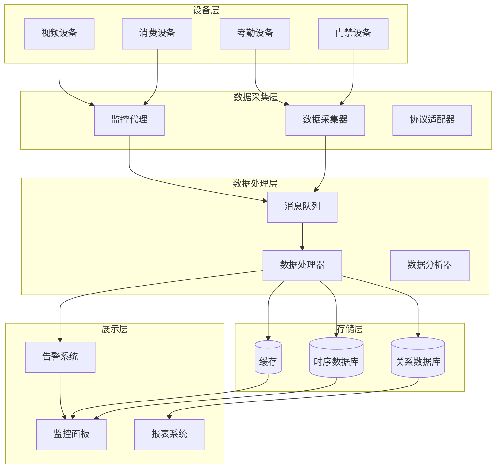

# 📊 设备状态监控技能

**技能名称**: IOT设备实时监控与故障诊断
**技能等级**: 中级
**适用角色**: 设备管理员、运维工程师、监控系统管理员
**前置技能**: 设备接入技能、网络基础知识、Linux基础操作
**预计学时**: 20小时

---

## 📚 知识要求

### 📖 理论知识
- **监控原理**: 理解设备状态监控的基本原理和方法
- **网络协议**: 掌握TCP/IP、HTTP、WebSocket、MQTT等监控协议
- **数据采集**: 了解设备数据采集的技术方案和实现方式
- **告警机制**: 理解告警规则的设计和实现原理
- **性能指标**: 熟悉设备性能指标的定义和计算方法

### 💼 业务理解
- **设备状态模型**: 理解IOE-DREAM项目的设备状态定义和转换规则
- **监控场景**: 掌握不同业务场景下的监控要求和策略
- **故障分类**: 了解设备故障的分类标准和处理流程
- **SLA要求**: 理解不同设备类型的服务等级协议要求
- **数据可视化**: 了解监控数据的可视化展示需求

### 🔧 技术背景
- **监控工具**: 熟悉Prometheus、Grafana、ELK等监控工具
- **消息队列**: 掌握RabbitMQ、Kafka等消息队列的使用
- **时序数据库**: 了解InfluxDB、TimescaleDB等时序数据库
- **缓存技术**: 掌握Redis在监控数据缓存中的应用
- **前端技术**: 了解WebSocket、实时图表等前端监控技术

---

## 🛠️ 操作步骤

### 步骤1: 监控系统架构设计 (4小时)

#### 1.1 监控系统架构


#### 1.2 监控数据模型设计
```java
/**
 * 设备监控数据实体
 */
@Entity
@Table(name = "t_device_monitor_data")
@Data
@Builder
@NoArgsConstructor
@AllArgsConstructor
public class DeviceMonitorDataEntity extends BaseEntity {

    @Id
    @Column(name = "monitor_id")
    private Long monitorId;

    @Column(name = "device_id", nullable = false)
    private Long deviceId;

    @Column(name = "metric_name", nullable = false, length = 100)
    private String metricName;

    @Column(name = "metric_value", nullable = false)
    private BigDecimal metricValue;

    @Column(name = "metric_unit", length = 20)
    private String metricUnit;

    @Enumerated(EnumType.STRING)
    @Column(name = "metric_type")
    private MetricTypeEnum metricType;

    @Column(name = "collect_time", nullable = false)
    private LocalDateTime collectTime;

    @Column(name = "tags")
    private String tags;
}

/**
 * 设备状态实体
 */
@Entity
@Table(name = "t_device_status")
@Data
@Builder
@NoArgsConstructor
@AllArgsConstructor
public class DeviceStatusEntity extends BaseEntity {

    @Id
    @Column(name = "status_id")
    private Long statusId;

    @Column(name = "device_id", nullable = false)
    private Long deviceId;

    @Enumerated(EnumType.STRING)
    @Column(name = "online_status", nullable = false)
    private OnlineStatusEnum onlineStatus;

    @Enumerated(EnumType.STRING)
    @Column(name = "run_status")
    private RunStatusEnum runStatus;

    @Column(name = "cpu_usage")
    private BigDecimal cpuUsage;

    @Column(name = "memory_usage")
    private BigDecimal memoryUsage;

    @Column(name = "disk_usage")
    private BigDecimal diskUsage;

    @Column(name = "network_status")
    private String networkStatus;

    @Column(name = "last_heartbeat_time")
    private LocalDateTime lastHeartbeatTime;

    @Column(name = "status_description", length = 500)
    private String statusDescription;
}
```

### 步骤2: 数据采集实现 (5小时)

#### 2.1 设备数据采集器
```java
@Component
@Slf4j
public class DeviceDataCollector {

    @Resource
    private List<ProtocolAdapter> protocolAdapters;

    @Resource
    private RabbitTemplate rabbitTemplate;

    @Autowired
    private MeterRegistry meterRegistry;

    /**
     * 定时采集设备数据
     */
    @Scheduled(fixedDelay = 30000) // 30秒执行一次
    public void collectDeviceData() {
        log.debug("开始设备数据采集");

        // 获取所有在线设备
        List<SmartDeviceEntity> onlineDevices = deviceDao.selectOnlineDevices();

        // 并行采集数据
        List<CompletableFuture<Void>> futures = onlineDevices.stream()
                .map(device -> CompletableFuture.runAsync(() -> collectSingleDeviceData(device)))
                .collect(Collectors.toList());

        // 等待所有采集完成
        CompletableFuture.allOf(futures.toArray(new CompletableFuture[0]))
                .thenRun(() -> log.debug("设备数据采集完成"))
                .exceptionally(throwable -> {
                    log.error("设备数据采集异常", throwable);
                    return null;
                });
    }

    /**
     * 采集单个设备数据
     */
    private void collectSingleDeviceData(SmartDeviceEntity device) {
        try {
            // 获取协议适配器
            ProtocolAdapter adapter = getProtocolAdapter(device.getProtocolType());

            // 采集设备状态
            DeviceStatus status = adapter.getDeviceStatus(device);

            // 采集设备指标
            List<DeviceMetric> metrics = adapter.collectMetrics(device);

            // 构建监控数据
            DeviceMonitorData monitorData = DeviceMonitorData.builder()
                    .deviceId(device.getDeviceId())
                    .collectTime(LocalDateTime.now())
                    .status(status)
                    .metrics(metrics)
                    .build();

            // 发送到消息队列
            rabbitTemplate.convertAndSend("device.monitor.exchange", "monitor.data", monitorData);

            // 更新设备状态缓存
            updateDeviceStatusCache(device.getDeviceId(), status);

            // 记录监控指标
            recordMonitorMetrics(device, status, metrics);

        } catch (Exception e) {
            log.error("采集设备数据失败: deviceId={}", device.getDeviceId(), e);
            handleCollectionError(device, e);
        }
    }

    /**
     * 记录监控指标
     */
    private void recordMonitorMetrics(SmartDeviceEntity device, DeviceStatus status, List<DeviceMetric> metrics) {
        // 设备在线状态指标
        Gauge.builder("device.online.status")
                .tag("device_id", device.getDeviceId().toString())
                .tag("device_type", device.getDeviceType())
                .register(meterRegistry, () -> status.isOnline() ? 1 : 0);

        // 设备CPU使用率
        if (status.getCpuUsage() != null) {
            Gauge.builder("device.cpu.usage")
                    .tag("device_id", device.getDeviceId().toString())
                    .register(meterRegistry, () -> status.getCpuUsage().doubleValue());
        }

        // 设备内存使用率
        if (status.getMemoryUsage() != null) {
            Gauge.builder("device.memory.usage")
                    .tag("device_id", device.getDeviceId().toString())
                    .register(meterRegistry, () -> status.getMemoryUsage().doubleValue());
        }

        // 自定义指标
        for (DeviceMetric metric : metrics) {
            Gauge.builder("device.custom.metric")
                    .tag("device_id", device.getDeviceId().toString())
                    .tag("metric_name", metric.getName())
                    .register(meterRegistry, () -> metric.getValue().doubleValue());
        }
    }
}
```

#### 2.2 协议适配器监控接口
```java
public interface ProtocolAdapter {

    /**
     * 获取设备状态
     */
    DeviceStatus getDeviceStatus(SmartDeviceEntity device) throws Exception;

    /**
     * 采集设备指标
     */
    List<DeviceMetric> collectMetrics(SmartDeviceEntity device) throws Exception;

    /**
     * 健康检查
     */
    HealthCheckResult healthCheck(SmartDeviceEntity device) throws Exception;

    /**
     * 设置监控回调
     */
    void setMonitorCallback(MonitorCallback callback);
}

/**
 * ZKTeco协议适配器监控实现
 */
@Component
public class ZKTecoMonitorAdapter implements ProtocolAdapter {

    @Override
    public DeviceStatus getDeviceStatus(SmartDeviceEntity device) {
        try {
            ZKTecoCommand command = new ZKTecoCommand();
            command.setCommandType("DEVICE_STATUS");

            ZKTecoResponse response = sendCommand(device, command);
            return parseDeviceStatus(response);

        } catch (Exception e) {
            log.error("获取ZKTeco设备状态失败: deviceId={}", device.getDeviceId(), e);
            return DeviceStatus.offline("通讯失败: " + e.getMessage());
        }
    }

    @Override
    public List<DeviceMetric> collectMetrics(SmartDeviceEntity device) {
        List<DeviceMetric> metrics = new ArrayList<>();

        try {
            // 采集基础指标
            metrics.add(collectTransactionCount(device));
            metrics.add(collectUserCount(device));
            metrics.add(collectLogSize(device));
            metrics.add(collectNetworkQuality(device));

            // 采集硬件指标
            metrics.addAll(collectHardwareMetrics(device));

        } catch (Exception e) {
            log.error("采集ZKTeco设备指标失败: deviceId={}", device.getDeviceId(), e);
        }

        return metrics;
    }

    private DeviceMetric collectTransactionCount(SmartDeviceEntity device) {
        ZKTecoCommand command = new ZKTecoCommand();
        command.setCommandType("GET_TRANSACTION_COUNT");

        ZKTecoResponse response = sendCommand(device, command);
        Long count = parseTransactionCount(response);

        return DeviceMetric.builder()
                .name("transaction_count")
                .value(BigDecimal.valueOf(count))
                .unit("count")
                .type(MetricTypeEnum.COUNTER)
                .timestamp(LocalDateTime.now())
                .build();
    }
}
```

### 步骤3: 实时数据处理 (4小时)

#### 3.1 监控数据处理器
```java
@Component
@Slf4j
public class DeviceMonitorDataProcessor {

    @Resource
    private DeviceMonitorDataDao monitorDataDao;

    @Resource
    private DeviceStatusDao deviceStatusDao;

    @Resource
    private RedisTemplate<String, Object> redisTemplate;

    @Resource
    private AlertRuleEngine alertRuleEngine;

    /**
     * 处理监控数据
     */
    @RabbitListener(queues = "device.monitor.queue")
    public void processMonitorData(DeviceMonitorData monitorData) {
        try {
            log.debug("处理设备监控数据: deviceId={}", monitorData.getDeviceId());

            // 1. 数据验证
            validateMonitorData(monitorData);

            // 2. 状态变更检测
            DeviceStatusChange change = detectStatusChange(monitorData);

            // 3. 保存监控数据
            saveMonitorData(monitorData);

            // 4. 更新设备状态
            updateDeviceStatus(monitorData);

            // 5. 更新实时缓存
            updateRealtimeCache(monitorData);

            // 6. 执行告警规则
            if (change != null) {
                executeAlertRules(monitorData, change);
            }

            // 7. 发送实时通知
            sendRealtimeNotification(monitorData);

        } catch (Exception e) {
            log.error("处理监控数据失败: deviceId={}", monitorData.getDeviceId(), e);
        }
    }

    /**
     * 检测状态变更
     */
    private DeviceStatusChange detectStatusChange(DeviceMonitorData monitorData) {
        Long deviceId = monitorData.getDeviceId();
        DeviceStatus newStatus = monitorData.getStatus();

        // 获取当前状态
        DeviceStatusEntity currentStatus = deviceStatusDao.selectByDeviceId(deviceId);

        if (currentStatus == null) {
            // 新设备首次监控
            return DeviceStatusChange.newDevice(deviceId, newStatus);
        }

        DeviceStatus oldStatus = DeviceStatus.fromEntity(currentStatus);

        // 检查状态是否发生变化
        if (!newStatus.equals(oldStatus)) {
            return DeviceStatusChange.changed(deviceId, oldStatus, newStatus);
        }

        return null;
    }

    /**
     * 更新实时缓存
     */
    private void updateRealtimeCache(DeviceMonitorData monitorData) {
        Long deviceId = monitorData.getDeviceId();

        // 更新设备状态缓存
        String statusKey = "device:status:" + deviceId;
        redisTemplate.opsForValue().set(statusKey, monitorData.getStatus(), 5, TimeUnit.MINUTES);

        // 更新设备指标缓存
        String metricsKey = "device:metrics:" + deviceId;
        Map<String, Object> metricsMap = new HashMap<>();

        for (DeviceMetric metric : monitorData.getMetrics()) {
            metricsMap.put(metric.getName(), metric.getValue());
        }

        redisTemplate.opsForHash().putAll(metricsKey, metricsMap);
        redisTemplate.expire(metricsKey, 5, TimeUnit.MINUTES);
    }
}
```

#### 3.2 告警规则引擎
```java
@Component
@Slf4j
public class AlertRuleEngine {

    @Resource
    private List<AlertRule> alertRules;

    @Resource
    private AlertNotificationService alertNotificationService;

    /**
     * 执行告警规则
     */
    public void executeAlertRules(DeviceMonitorData monitorData, DeviceStatusChange statusChange) {
        for (AlertRule rule : alertRules) {
            try {
                if (rule.isApplicable(monitorData, statusChange)) {
                    AlertResult result = rule.evaluate(monitorData, statusChange);

                    if (result.isTriggered()) {
                        handleAlertTriggered(rule, result, monitorData);
                    } else if (result.isRecovered()) {
                        handleAlertRecovered(rule, result, monitorData);
                    }
                }
            } catch (Exception e) {
                log.error("执行告警规则失败: ruleId={}", rule.getRuleId(), e);
            }
        }
    }

    /**
     * 处理告警触发
     */
    private void handleAlertTriggered(AlertRule rule, AlertResult result, DeviceMonitorData monitorData) {
        // 创建告警记录
        DeviceAlertEntity alert = DeviceAlertEntity.builder()
                .deviceId(monitorData.getDeviceId())
                .ruleId(rule.getRuleId())
                .alertLevel(result.getAlertLevel())
                .alertMessage(result.getMessage())
                .alertStatus(AlertStatusEnum.ACTIVE)
                .alertTime(LocalDateTime.now())
                .metricsData(JSON.toJSONString(result.getTriggerMetrics()))
                .build();

        deviceAlertDao.insert(alert);

        // 发送告警通知
        AlertNotification notification = AlertNotification.builder()
                .alertId(alert.getAlertId())
                .deviceId(monitorData.getDeviceId())
                .alertLevel(result.getAlertLevel())
                .title(rule.getRuleName() + " 告警")
                .message(result.getMessage())
                .timestamp(LocalDateTime.now())
                .build();

        alertNotificationService.sendNotification(notification);

        log.warn("设备告警触发: deviceId={}, ruleName={}, level={}",
                monitorData.getDeviceId(), rule.getRuleName(), result.getAlertLevel());
    }
}

/**
 * 设备离线告警规则
 */
@Component
public class DeviceOfflineAlertRule implements AlertRule {

    @Override
    public boolean isApplicable(DeviceMonitorData monitorData, DeviceStatusChange statusChange) {
        return statusChange != null &&
               statusChange.getNewStatus().isOffline() &&
               !statusChange.getOldStatus().isOffline();
    }

    @Override
    public AlertResult evaluate(DeviceMonitorData monitorData, DeviceStatusChange statusChange) {
        return AlertResult.builder()
                .triggered(true)
                .alertLevel(AlertLevelEnum.HIGH)
                .message("设备 " + monitorData.getDeviceId() + " 已离线")
                .build();
    }
}
```

### 步骤4: 监控面板开发 (3小时)

#### 4.1 实时监控状态组件
```vue
<template>
  <div class="device-monitor-dashboard">
    <!-- 设备概览 -->
    <a-row :gutter="16" class="mb-4">
      <a-col :span="6" v-for="stat in deviceStats" :key="stat.key">
        <a-card class="stat-card">
          <a-statistic
            :title="stat.title"
            :value="stat.value"
            :suffix="stat.suffix"
            :value-style="{ color: stat.color }"
          />
          <div class="stat-trend">
            <span :class="['trend', stat.trend > 0 ? 'up' : 'down']">
              {{ Math.abs(stat.trend) }}%
            </span>
            较昨日
          </div>
        </a-card>
      </a-col>
    </a-row>

    <!-- 设备状态地图 -->
    <a-card title="设备状态分布" class="mb-4">
      <div class="device-status-map">
        <device-area-map
          :devices="deviceList"
          :loading="loading"
          @device-click="handleDeviceClick"
        />
      </div>
    </a-card>

    <!-- 实时监控数据 -->
    <a-row :gutter="16">
      <a-col :span="12">
        <a-card title="设备状态趋势">
          <device-status-chart
            :data="statusTrendData"
            :loading="loading"
          />
        </a-card>
      </a-col>
      <a-col :span="12">
        <a-card title="设备性能指标">
          <device-performance-chart
            :data="performanceData"
            :loading="loading"
          />
        </a-card>
      </a-col>
    </a-row>

    <!-- 告警信息 -->
    <a-card title="实时告警" class="mt-4">
      <alert-list
        :alerts="alertList"
        :loading="loading"
        @alert-handle="handleAlert"
      />
    </a-card>
  </div>
</template>

<script setup>
import { ref, reactive, onMounted, onUnmounted } from 'vue'
import { useWebSocket } from '@/composables/useWebSocket'
import { deviceMonitorApi } from '@/api/device-monitor'

// 响应式数据
const loading = ref(false)
const deviceStats = reactive([
  { key: 'total', title: '设备总数', value: 0, suffix: '台', color: '#1890ff', trend: 0 },
  { key: 'online', title: '在线设备', value: 0, suffix: '台', color: '#52c41a', trend: 0 },
  { key: 'offline', title: '离线设备', value: 0, suffix: '台', color: '#f5222d', trend: 0 },
  { key: 'warning', title: '告警设备', value: 0, suffix: '台', color: '#fa8c16', trend: 0 }
])

const deviceList = ref([])
const statusTrendData = ref([])
const performanceData = ref([])
const alertList = ref([])

// WebSocket连接
const { connect, disconnect, subscribe } = useWebSocket()

// 方法
const loadDashboardData = async () => {
  loading.value = true
  try {
    // 加载设备统计
    const statsResponse = await deviceMonitorApi.getDeviceStats()
    Object.assign(deviceStats, statsResponse.data)

    // 加载设备列表
    const deviceResponse = await deviceMonitorApi.getDeviceList()
    deviceList.value = deviceResponse.data

    // 加载状态趋势数据
    const trendResponse = await deviceMonitorApi.getStatusTrend()
    statusTrendData.value = trendResponse.data

    // 加载性能数据
    const performanceResponse = await deviceMonitorApi.getPerformanceData()
    performanceData.value = performanceResponse.data

    // 加载告警列表
    const alertResponse = await deviceMonitorApi.getActiveAlerts()
    alertList.value = alertResponse.data

  } catch (error) {
    console.error('加载监控数据失败:', error)
  } finally {
    loading.value = false
  }
}

const handleDeviceClick = (device) => {
  // 跳转到设备详情页面
  router.push(`/device/detail/${device.deviceId}`)
}

const handleAlert = (alert) => {
  // 处理告警
  console.log('处理告警:', alert)
}

// WebSocket消息处理
const handleMonitorDataUpdate = (data) => {
  // 更新设备状态
  const deviceIndex = deviceList.value.findIndex(d => d.deviceId === data.deviceId)
  if (deviceIndex !== -1) {
    deviceList.value[deviceIndex] = { ...deviceList.value[deviceIndex], ...data }
  }

  // 更新统计数据
  await loadDashboardData()
}

const handleAlertNotification = (data) => {
  // 添加新告警到列表头部
  alertList.value.unshift(data)

  // 显示通知
  notification.warning({
    message: '设备告警',
    description: data.message,
    duration: 5
  })
}

// 生命周期
onMounted(async () => {
  // 加载初始数据
  await loadDashboardData()

  // 建立WebSocket连接
  connect()
  subscribe('device:monitor:update', handleMonitorDataUpdate)
  subscribe('device:alert:notification', handleAlertNotification)

  // 设置定时刷新
  const refreshTimer = setInterval(loadDashboardData, 60000) // 1分钟刷新一次

  // 组件销毁时清理
  onUnmounted(() => {
    clearInterval(refreshTimer)
    disconnect()
  })
})
</script>

<style scoped>
.device-monitor-dashboard {
  padding: 24px;
}

.stat-card {
  text-align: center;
}

.stat-trend {
  margin-top: 8px;
  font-size: 12px;
  color: #666;
}

.trend.up {
  color: #52c41a;
}

.trend.down {
  color: #f5222d;
}

.device-status-map {
  height: 400px;
}

.mb-4 {
  margin-bottom: 16px;
}

.mt-4 {
  margin-top: 16px;
}
</style>
```

### 步骤5: 告警通知配置 (2小时)

#### 5.1 告警通知服务
```java
@Service
@Slf4j
public class AlertNotificationService {

    @Resource
    private List<NotificationChannel> notificationChannels;

    @Resource
    private AlertRuleDao alertRuleDao;

    /**
     * 发送告警通知
     */
    public void sendNotification(AlertNotification notification) {
        log.info("发送告警通知: deviceId={}, level={}",
                notification.getDeviceId(), notification.getAlertLevel());

        // 获取告警规则配置
        DeviceAlertRuleEntity rule = alertRuleDao.selectById(notification.getRuleId());
        if (rule == null) {
            log.warn("告警规则不存在: ruleId={}", notification.getRuleId());
            return;
        }

        // 解析通知渠道配置
        List<String> channels = parseNotificationChannels(rule.getNotificationChannels());

        // 并行发送通知
        List<CompletableFuture<Void>> futures = channels.stream()
                .map(channel -> CompletableFuture.runAsync(() ->
                        sendNotificationByChannel(channel, notification)))
                .collect(Collectors.toList());

        // 等待所有通知发送完成
        CompletableFuture.allOf(futures.toArray(new CompletableFuture[0]))
                .thenRun(() -> log.info("告警通知发送完成: alertId={}", notification.getAlertId()))
                .exceptionally(throwable -> {
                    log.error("告警通知发送失败: alertId={}", notification.getAlertId(), throwable);
                    return null;
                });
    }

    /**
     * 通过指定渠道发送通知
     */
    private void sendNotificationByChannel(String channelType, AlertNotification notification) {
        try {
            NotificationChannel channel = getNotificationChannel(channelType);
            if (channel != null) {
                channel.send(notification);
            }
        } catch (Exception e) {
            log.error("通过渠道{}发送通知失败: alertId={}", channelType, notification.getAlertId(), e);
        }
    }

    /**
     * 邮件通知渠道
     */
    @Component
    public static class EmailNotificationChannel implements NotificationChannel {

        @Resource
        private JavaMailSender mailSender;

        @Override
        public void send(AlertNotification notification) {
            try {
                SimpleMailMessage message = new SimpleMailMessage();

                message.setSubject("[设备告警] " + notification.getTitle());
                message.setText(buildEmailContent(notification));
                message.setTo(getNotificationEmails());

                mailSender.send(message);

                log.info("邮件通知发送成功: alertId={}", notification.getAlertId());

            } catch (Exception e) {
                log.error("邮件通知发送失败: alertId={}", notification.getAlertId(), e);
                throw new RuntimeException("邮件发送失败", e);
            }
        }

        private String buildEmailContent(AlertNotification notification) {
            StringBuilder content = new StringBuilder();
            content.append("设备告警通知\n\n");
            content.append("告警标题: ").append(notification.getTitle()).append("\n");
            content.append("告警级别: ").append(notification.getAlertLevel()).append("\n");
            content.append("设备ID: ").append(notification.getDeviceId()).append("\n");
            content.append("告警时间: ").append(notification.getTimestamp()).append("\n");
            content.append("告警详情: ").append(notification.getMessage()).append("\n");

            return content.toString();
        }
    }

    /**
     * 短信通知渠道
     */
    @Component
    public static class SmsNotificationChannel implements NotificationChannel {

        @Override
        public void send(AlertNotification notification) {
            // 只对高级别告警发送短信
            if (notification.getAlertLevel().ordinal() >= AlertLevelEnum.HIGH.ordinal()) {
                try {
                    String content = buildSmsContent(notification);
                    List<String> phoneNumbers = getNotificationPhoneNumbers();

                    // 调用短信服务API
                    smsService.sendSms(phoneNumbers, content);

                    log.info("短信通知发送成功: alertId={}", notification.getAlertId());

                } catch (Exception e) {
                    log.error("短信通知发送失败: alertId={}", notification.getAlertId(), e);
                    throw new RuntimeException("短信发送失败", e);
                }
            }
        }
    }
}
```

### 步骤6: 性能优化和扩展 (2小时)

#### 6.1 数据存储优化
```java
@Configuration
@EnableCaching
public class MonitorDataCacheConfig {

    /**
     * 监控数据缓存配置
     */
    @Bean
    @Primary
    public CacheManager monitorDataCacheManager(RedisConnectionFactory connectionFactory) {
        // 监控数据短期缓存
        RedisCacheConfiguration shortTermConfig = RedisCacheConfiguration.defaultCacheConfig()
                .entryTtl(Duration.ofMinutes(5))
                .serializeKeysWith(RedisSerializationContext.SerializationPair
                        .fromSerializer(new StringRedisSerializer()))
                .serializeValuesWith(RedisSerializationContext.SerializationPair
                        .fromSerializer(new GenericJackson2JsonRedisSerializer()));

        // 统计数据长期缓存
        RedisCacheConfiguration longTermConfig = RedisCacheConfiguration.defaultCacheConfig()
                .entryTtl(Duration.ofHours(1))
                .serializeKeysWith(RedisSerializationContext.SerializationPair
                        .fromSerializer(new StringRedisSerializer()))
                .serializeValuesWith(RedisSerializationContext.SerializationPair
                        .fromSerializer(new GenericJackson2JsonRedisSerializer()));

        Map<String, RedisCacheConfiguration> cacheConfigurations = new HashMap<>();
        cacheConfigurations.put("device-status", shortTermConfig);
        cacheConfigurations.put("device-metrics", shortTermConfig);
        cacheConfigurations.put("device-stats", longTermConfig);

        return RedisCacheManager.builder(connectionFactory)
                .withInitialCacheConfigurations(cacheConfigurations)
                .transactionAware()
                .build();
    }
}
```

#### 6.2 监控数据压缩存储
```java
/**
 * 监控数据压缩存储服务
 */
@Service
@Slf4j
public class MonitorDataCompressionService {

    @Resource
    private InfluxDBTemplate influxDBTemplate;

    /**
     * 批量保存压缩的监控数据
     */
    public void batchSaveCompressedData(List<DeviceMonitorData> dataList) {
        // 按设备和时间分组
        Map<Long, Map<LocalDateTime, List<DeviceMonitorData>>> groupedData = dataList.stream()
                .collect(Collectors.groupingBy(
                        DeviceMonitorData::getDeviceId,
                        Collectors.groupingBy(
                                DeviceMonitorData::getCollectTime
                        )
                ));

        for (Map.Entry<Long, Map<LocalDateTime, List<DeviceMonitorData>>> deviceEntry : groupedData.entrySet()) {
            Long deviceId = deviceEntry.getKey();

            for (Map.Entry<LocalDateTime, List<DeviceMonitorData>> timeEntry : deviceEntry.getValue().entrySet()) {
                LocalDateTime collectTime = timeEntry.getKey();
                List<DeviceMonitorData> dataPoints = timeEntry.getValue();

                // 压缩数据点
                CompressedMonitorData compressedData = compressDataPoints(deviceId, collectTime, dataPoints);

                // 保存到时序数据库
                saveToInfluxDB(compressedData);
            }
        }
    }

    /**
     * 压缩数据点
     */
    private CompressedMonitorData compressDataPoints(Long deviceId, LocalDateTime collectTime,
                                                   List<DeviceMonitorData> dataPoints) {
        // 计算各项指标的统计值
        Map<String, MetricStatistics> metricStats = new HashMap<>();

        for (DeviceMonitorData dataPoint : dataPoints) {
            for (DeviceMetric metric : dataPoint.getMetrics()) {
                metricStats.computeIfAbsent(metric.getName(), k -> new MetricStatistics())
                        .addValue(metric.getValue().doubleValue());
            }
        }

        return CompressedMonitorData.builder()
                .deviceId(deviceId)
                .collectTime(collectTime)
                .metricStatistics(metricStats)
                .dataPointCount(dataPoints.size())
                .build();
    }
}
```

---

## ⚠️ 注意事项

### 🔒 安全提醒
- **数据传输**: 监控数据传输必须使用加密通道
- **访问控制**: 监控系统访问需要严格权限控制
- **数据隐私**: 监控数据中可能包含敏感信息，需要脱敏处理
- **日志审计**: 所有监控操作都需要记录审计日志

### 📊 性能要求
- **实时性**: 监控数据延迟应小于30秒
- **准确性**: 监控数据准确率应达到99.9%
- **可用性**: 监控系统可用性应达到99.9%
- **扩展性**: 支持至少10,000台设备同时监控

### 🎯 最佳实践
- **分层监控**: 设备层、网络层、应用层分层监控
- **智能告警**: 避免告警风暴，设置合理的告警阈值
- **数据保留**: 制定合理的数据保留策略
- **容量规划**: 提前进行监控系统的容量规划

---

## 📊 评估标准

### ⏱️ 操作时间要求
- **监控系统搭建**: 单设备类型监控配置2小时内完成
- **告警规则配置**: 单条规则配置30分钟内完成
- **故障排查**: 常见监控故障10分钟内定位
- **数据查询**: 复杂监控数据查询5分钟内完成

### 🎯 准确率要求
- **数据采集准确率**: 99.9%
- **告警触发准确率**: 95%
- **状态更新及时性**: 30秒内
- **故障检测率**: 99%

### 🔍 质量标准
- **监控覆盖率**: 100%设备覆盖监控
- **告警响应时间**: 平均响应时间<5分钟
- **系统稳定性**: 月度故障时间<1小时
- **数据完整性**: 监控数据完整率>99.9%

---

## 🔗 相关技能

### 📚 相关技能
- **[设备接入技能](./device-access.skill)** - 设备接入和协议适配
- **[设备配置技能](./device-config.skill)** - 设备配置和策略管理
- **[Spring Boot开发](../technical-skills/spring-boot-development.skill)** - 后端监控服务开发
- **[系统运维技能](../technical-skills/system-operations.skill)** - 监控系统部署和运维

### 🚀 进阶路径
1. **监控架构师**: 设计大规模监控系统架构
2. **告警专家**: 优化告警规则和通知策略
3. **数据分析师**: 监控数据的深度分析和洞察
4. **运维自动化专家**: 开发监控自动化工具

### 📖 参考资料
- **[设备管理核心操作设计](../../../docs/DEVICE_MANAGEMENT/ARCHITECTURE/device-management-core-operations.md)**
- **[IOT设备数据采集和处理架构](../../../docs/DEVICE_MANAGEMENT/ARCHITECTURE/iot-data-collection-processing.md)**
- **[系统安全规范](../../../docs/repowiki/zh/content/开发规范体系/系统安全规范.md)**
- **[通用开发检查清单](../../../docs/CHECKLISTS/通用开发检查清单.md)**

---

**✅ 技能认证完成标准**:
- 能够独立设计和实施设备监控系统
- 能够配置和管理监控告警规则
- 能够处理监控系统的常见故障
- 能够优化监控系统的性能和稳定性
- 通过技能评估测试（理论+实操+故障排查）