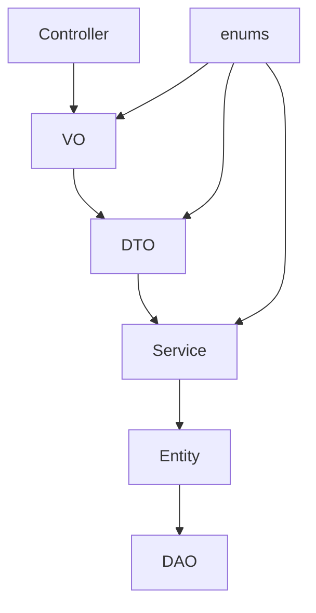

# 领域模型设计专家

> **版本**: v1.0.0
> **更新时间**: 2025-11-20
> **分类**: 架构设计技能 > 领域建模
> **标签**: ["领域模型", "DDD", "包架构", "设计模式", "类型安全"]
> **技能等级**: ★★★ 高级
> **适用角色**: 领域架构师、技术负责人、高级开发工程师

---

## 📋 技能概述

本技能规范定义了IOE-DREAM项目中领域模型设计的标准要求，包括领域对象建模、包结构设计、类型安全、可扩展性等核心能力。

## ⚠️ 核心约束（不可违反）

### 🚫 绝对禁止的包设计模式
```markdown
❌ 禁止在vo包中定义枚举类（如EmailPriority）
❌ 禁止在dto包中定义业务常量
❌ 禁止在entity包中定义视图对象
❌ 禁止重复定义相同的枚举类型
❌ 禁止跨包职责混乱（如utils包中定义业务逻辑）
❌ 禁止使用原始类型（String、int）代替枚举
```

### ✅ 必须执行的包设计原则
```markdown
✅ enums包只包含枚举类定义
✅ vo包只包含数据传输对象（可引用enums）
✅ dto包只包含数据转换对象（可引用enums）
✅ entity包只包含数据库映射实体
✅ 每个包都有明确的单一职责
✅ 保持依赖关系单向：entity ← dto ← vo ← controller
```

## 📚 核心知识体系

### 📖 DDD领域驱动设计理论
- **聚合根（Aggregate Root）**: 定义聚合的边界和一致性
- **值对象（Value Object）**: 无身份标识、不可变的核心概念
- **实体（Entity）**: 有唯一标识、可变的核心对象
- **领域服务（Domain Service）**: 跨聚合的业务逻辑
- **应用服务（Application Service）**: 协调领域对象

### 🏗️ Java类型系统深度理解
- **枚举（Enum）**: 类型安全的常量集合
- **记录类（Record）**: 不可变的数据载体
- **密封类（Sealed）**: 限制继承层次
- **泛型（Generic）**: 类型安全的参数化

## 🎯 包架构设计标准

### 📂 强制包结构规范
```
domain/
├── enums/          # 枚举定义层 ✅
│   ├── EmailPriority.java
│   ├── ConsumeStatus.java
│   ├── PaymentType.java
│   └── SecurityLevel.java
├── entity/         # 数据库实体层 ✅
│   ├── UserEntity.java
│   ├── OrderEntity.java
│   └── AccountEntity.java
├── vo/            # 数据传输对象层 ✅
│   ├── UserVO.java (可引用enums.EmailPriority)
│   ├── OrderDetailVO.java
│   └── StatisticsVO.java
├── dto/           # 数据转换对象层 ✅
│   ├── CreateUserDTO.java
│   ├── UpdateOrderDTO.java
│   └── BatchOperationDTO.java
└── service/       # 业务服务层 ✅
    ├── UserService.java
    ├── OrderService.java
    └── PaymentService.java
```

### 🔗 依赖关系规范


## 🛡️ 类型安全设计模式

### ✅ 正确的枚举设计模式
```java
// 📍 位置：domain/enums/EmailPriority.java
public enum EmailPriority {
    LOW(1, "低优先级"),
    NORMAL(2, "普通"),
    HIGH(3, "高优先级"),
    URGENT(4, "紧急");

    private final int code;
    private final String description;

    EmailPriority(int code, String description) {
        this.code = code;
        this.description = description;
    }

    public int getCode() {
        return code;
    }

    public String getDescription() {
        return description;
    }

    // 可扩展的业务方法
    public boolean isHigherThan(EmailPriority other) {
        return this.code > other.code;
    }
}
```

### ✅ 正确的VO设计模式
```java
// 📍 位置：domain/vo/EmailRequest.java
import net.lab1024.sa.admin.module.consume.domain.enums.EmailPriority;

public class EmailRequest {
    private String recipient;
    private String subject;
    private EmailPriority priority; // ✅ 正确：引用enums
    private String content;
    private LocalDateTime sendTime;

    // 构造函数
    public EmailRequest(String recipient, String subject, EmailPriority priority, String content) {
        this.recipient = recipient;
        this.subject = subject;
        this.priority = priority;
        this.content = content;
        this.sendTime = LocalDateTime.now();
    }

    // 业务验证方法
    public boolean isValid() {
        return StringUtils.hasText(recipient)
            && StringUtils.hasText(subject)
            && priority != null;
    }

    // Getter/Setter方法
    // ...
}
```

### ❌ 错误的设计模式（必须避免）
```java
// ❌ 错误1：在vo包中定义枚举
package net.lab1024.sa.admin.module.consume.domain.vo;
public enum EmailPriority {  // ❌ 违反单一职责原则
    LOW, NORMAL, HIGH, URGENT
}

// ❌ 错误2：使用String代替枚举
public class EmailRequest {
    private String priority; // ❌ 类型不安全
}

// ❌ 错误3：跨包职责混乱
package net.lab1024.sa.admin.module.consume.utils;
public class EmailConstants {  // ❌ utils包不应包含业务常量
    public static final String EMAIL_PRIORITY_LOW = "LOW";
}
```

## 🔧 实际应用指南

### 📋 检查清单（每次开发前必须验证）
```markdown
✅ [ ] 确认枚举定义在enums包中
✅ [ ] 确认VO/DTO正确引用enums枚举
✅ [ ] 确认没有重复的枚举定义
✅ [ ] 确认包职责单一明确
✅ [ ] 确认依赖关系正确
✅ [ ] 确认类型安全
✅ [ ] 确认可扩展性设计
```

### 🔍 自动化检查工具
```bash
# 检查enums包中是否有非枚举类
find domain/enums -name "*.java" -exec grep -L "public class\|public interface" {} \;

# 检查vo包中是否有枚举类
find domain/vo -name "*.java" -exec grep -L "public enum\|public class.*Enum" {} \;

# 检查重复的枚举定义
find domain -name "*Priority.java" -o -name "*Status.java" | sort
```

### 🚨 错误模式识别和修复
```java
// 识别问题：类型冲突
import net.lab1024.sa.admin.module.consume.domain.vo.EmailPriority;  // ❌ 错误包
import net.lab1024.sa.admin.module.consume.domain.enums.EmailPriority; // ✅ 正确包

// 修复方案：统一使用enums包
// 1. 删除vo包中的重复枚举定义
// 2. 统一导入enums包中的枚举
// 3. 更新所有引用点
```

## 📊 领域建模最佳实践

### 🎯 聚合根设计
```java
// 订单聚合根
@Entity
public class OrderAggregate {
    private OrderId orderId;
    private List<OrderItem> items;
    private OrderStatus status;
    private CustomerId customerId;

    // 聚合根方法（维护业务不变量）
    public void addItem(ProductId productId, int quantity, BigDecimal price) {
        OrderItem item = new OrderItem(productId, quantity, price);
        items.add(item);
        calculateTotal();
    }

    // 不变量保护
    public void markAsCompleted() {
        if (items.isEmpty()) {
            throw new DomainException("订单项不能为空");
        }
        this.status = OrderStatus.COMPLETED;
    }
}
```

### 🎯 值对象设计
```java
// 金额值对象（不可变）
@Value
public class Money {
    private final BigDecimal amount;
    private final Currency currency;

    public Money(BigDecimal amount, Currency currency) {
        this.amount = amount;
        this.currency = currency;
    }

    public Money add(Money other) {
        if (!this.currency.equals(other.currency)) {
            throw new IllegalArgumentException("货币类型不匹配");
        }
        return new Money(this.amount.add(other.amount), this.currency);
    }
}
```

## 🧪 代码质量标准

### ✅ 编码规范要求
```markdown
✅ 枚举类：使用大写字母开头，描述性命名
✅ VO类：使用VO后缀，清晰标识用途
✅ DTO类：使用DTO后缀，明确数据转换用途
✅ 方法命名：动词+名词模式，描述性行为
✅ 常量命名：全大写+下划线，描述性强
✅ 注释完整：每个类和公共方法都要有JavaDoc
```

### 📏 文档模板标准
```java
/**
 * 邮件优先级枚举
 * <p>
 * 定义邮件发送的优先级等级，用于业务流程控制和路由决策。
 * 优先级从低到高排序，支持自定义比较和业务逻辑扩展。
 * </p>
 *
 * @author SmartAdmin Team
 * @version 3.0.0
 * @since 2025-11-20
 */
public enum EmailPriority {
    // ...
}
```

## 🔧 技能应用场景

### 🎯 适用场景
1. **新模块设计**：创建新的业务模块的领域模型
2. **代码重构**：优化现有代码的架构设计
3. **代码审查**：验证代码是否符合领域模型规范
4. **架构评审**：评估包设计的合理性
5. **技术选型**：选择合适的领域建模技术

### 🎯 操作流程
1. **需求分析**：识别核心业务概念和关系
2. **模型设计**：定义领域对象和聚合关系
3. **包结构设计**：规划包的职责和依赖
4. **代码实现**：按照规范编写代码
5. **验证检查**：使用检查清单验证质量
6. **文档更新**：补充设计和API文档

### 🎯 质量指标
- **包职责单一性**: 每个包只有一种类型的类
- **类型安全性**: 使用枚举和强类型避免运行时错误
- **可维护性**: 枚举变更影响范围可控
- **扩展性**: 支持添加新的枚举值而不影响现有代码
- **一致性**: 全局使用统一的命名和设计模式

## 📚 进阶学习路径

### 📖 推荐学习资源
1. **《领域驱动设计》** - Eric Evans著
2. **《实现领域驱动设计》** - Vaughn Vernon著
3. **《重构：改善既有代码的设计》** - Martin Fowler著
4. **《Effective Java》** - Joshua Bloch著

### 🛠️ 推荐工具
1. **ArchUnit**：架构规则验证工具
2. **PMD**:代码质量检查工具
3. **SonarQube**:代码质量分析平台
4. **IntelliJ IDEA**：IDE支持DDD模式识别

---

## 🔒 技能验证

### ✅ 技能掌握标准
- [ ] 能够独立设计符合DDD规范的领域模型
- [ ] 能够识别和修复常见的架构设计问题
- [ ] 能够编写类型安全、可维护的枚举和VO类
- [ ] 能够设计清晰的包结构和依赖关系
- [ ] 能够使用工具验证代码质量
- [ ] 能够指导团队遵循领域设计规范

### 🎯 技能应用实践
- [ ] 参与新模块的领域模型设计
- [ ] 对现有代码进行架构重构
- [ ] 进行代码审查和架构评审
- [ ] 制定团队开发规范和培训计划