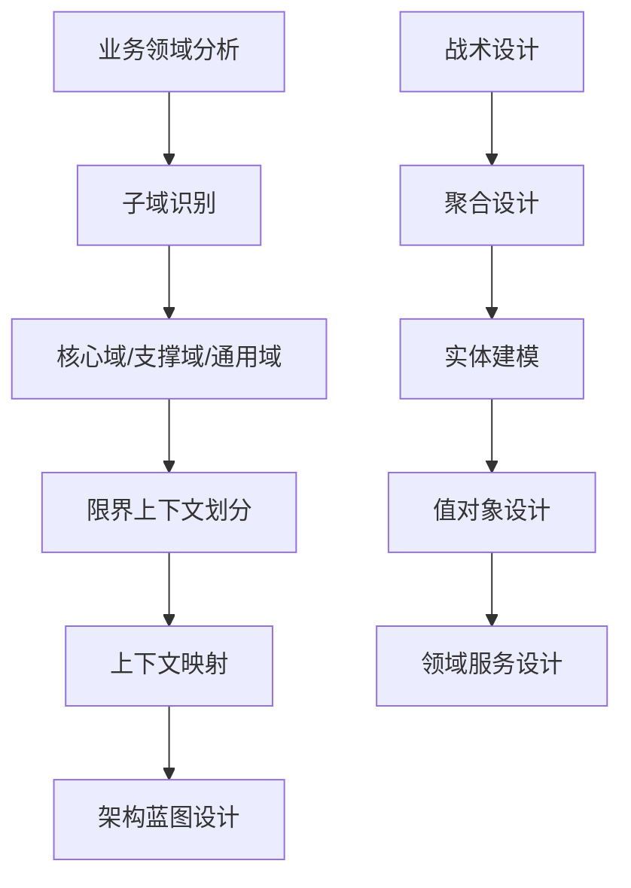
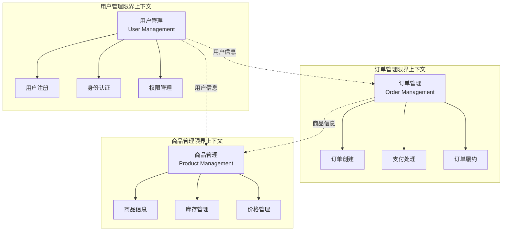

# 领域建模专家技能定义 (Domain Modeling Expert)

**技能等级**: ★★★ 高级
**适用角色**: 架构师、领域专家、高级开发工程师
**前置技能**: 微服务架构师、API设计专家、业务分析师
**预计学时**: 40-60小时

---

## 📖 技能概述

领域建模专家是企业级系统设计的核心专家，专注于业务领域分析和领域驱动设计(DDD)实践。本技能涵盖了从业务分析到领域模型设计的完整流程，帮助构建高质量、可扩展的微服务架构。

### 🎯 核心价值
- **业务建模**: 将复杂业务需求转化为清晰的领域模型
- **战略设计**: 通过限界上下文划分微服务边界
- **技术实现**: 指导领域模型的代码实现和持久化
- **演进支持**: 支持领域模型的持续演进和重构

---

## 📚 知识要求

### 🔬 理论知识

#### 1. **领域驱动设计(DDD)核心概念**
- **领域(Domain)**: 业务问题所在的空间
- **子域(Subdomain)**: 领域的特定部分，分为核心域、支撑域、通用域
- **限界上下文(Bounded Context)**: 明确定义的上下文边界
- **聚合(Aggregate)**: 数据修改的单元，保证事务一致性
- **实体(Entity)**: 具有唯一标识的领域对象
- **值对象(Value Object)**: 没有标识的不可变对象
- **领域服务(Domain Service)**: 不属于实体或值对象的业务逻辑
- **应用服务(Application Service)**: 协调领域对象执行业务用例
- **仓储(Repository)**: 聚合持久化的抽象接口

#### 2. **战略设计模式**


#### 3. **领域建模方法论**
- **事件风暴(EventStorming)**: 通过领域事件理解业务流程
- **四色建模**: 用原型模式描述业务领域
- **名词动词分析法**: 从需求文档中识别领域概念
- **用例驱动分析**: 基于业务用例进行领域建模

### 💼 业务理解要求

#### 1. **业务分析能力**
- **业务流程梳理**: 理解端到端的业务流程
- **业务规则识别**: 提取和形式化业务规则
- **业务不变量**: 识别业务的不变性约束
- **业务事件**: 识别业务领域中的重要事件

#### 2. **行业知识基础**
- **企业管理**: 组织架构、权限管理、工作流
- **电商业务**: 商品管理、订单处理、支付结算
- **金融业务**: 账户管理、风险控制、合规要求
- **供应链**: 库存管理、物流配送、供应商管理

### 🔧 技术背景

#### 1. **编程语言能力**
- **Java/Kotlin**: 面向对象设计、函数式编程
- **TypeScript**: 类型系统、接口设计
- **设计模式**: GoF设计模式、企业架构模式

#### 2. **架构设计基础**
- **微服务架构**: 服务拆分、服务间通信
- **数据架构**: 数据建模、数据库设计
- **API设计**: RESTful API、GraphQL、事件驱动API

---

## 🛠️ 操作步骤

### 第一阶段：领域分析 (8-12小时)

#### 1.1 **业务领域探索**
```bash
# 步骤1: 收集业务需求文档
find docs/ -name "*.md" -name "*业务*" -o -name "*需求*" -o -name "*用例*"

# 步骤2: 识别核心业务概念
grep -r "核心业务\|主要功能\|关键流程" docs/requirements/

# 步骤3: 分析业务流程
# 使用事件风暴方法识别领域事件
echo "领域事件分析:"
echo "- 用户注册"
echo "- 用户登录"
echo "- 订单创建"
echo "- 支付完成"
echo "- 商品发货"
echo "- 订单完成"
```

#### 1.2 **子域识别**
```java
// 子域分类示例
public class SubdomainAnalysis {

    // 核心域 - 直接创造业务价值
    CORE_DOMAIN("订单管理", "Order Management"),
    CORE_DOMAIN("商品管理", "Product Management"),
    CORE_DOMAIN("用户账户", "User Account");

    // 支撑域 - 支持核心域
    SUPPORTING_DOMAIN("库存管理", "Inventory Management"),
    SUPPORTING_DOMAIN("支付处理", "Payment Processing"),
    SUPPORTING_DOMAIN("物流配送", "Logistics & Delivery");

    // 通用域 - 通用功能
    GENERIC_DOMAIN("通知服务", "Notification Service"),
    GENERIC_DOMAIN("文件存储", "File Storage"),
    GENERIC_DOMAIN("身份认证", "Authentication");
}
```

#### 1.3 **限界上下文划分**


### 第二阶段：聚合设计 (10-15小时)

#### 2.1 **聚合根识别**
```java
/**
 * 聚合根设计原则：
 * 1. 聚合根是聚合的唯⼀访问⼝
 * 2. 聚合根负责保证聚合内部的业务不变量
 * 3. 聚合根通过ID引⽤其他聚合根
 * 4. 聚合内部的对象保持⼀致性边界
 */

// 订单聚合根
@Entity
@Table(name = "t_order")
public class OrderAggregate {

    @Id
    @GeneratedValue(strategy = GenerationType.IDENTITY)
    private Long orderId;

    // 聚合根标识
    private String orderNumber;

    // 订单状态 - 聚合状态
    @Enumerated(EnumType.STRING)
    private OrderStatus status;

    // 聚合内部的实体
    @OneToMany(mappedBy = "order", cascade = CascadeType.ALL, fetch = FetchType.LAZY)
    private List<OrderItemEntity> items;

    // 值对象
    @Embedded
    private AddressVO shippingAddress;

    @Embedded
    private MoneyVO totalAmount;

    // 业务方法 - 保证不变量
    public void addItem(ProductId productId, Integer quantity, MoneyVO unitPrice) {
        // 业务规则验证
        if (this.status != OrderStatus.DRAFT) {
            throw new OrderStatusException("只能向草稿状态的订单添加商品");
        }

        if (quantity <= 0) {
            throw new InvalidQuantityException("商品数量必须大于0");
        }

        // 创建订单项
        OrderItemEntity item = new OrderItemEntity(productId, quantity, unitPrice);
        this.items.add(item);

        // 重新计算总金额
        recalculateTotal();
    }

    public void confirm() {
        if (this.items.isEmpty()) {
            throw new EmptyOrderException("订单不能为空");
        }

        if (this.status != OrderStatus.DRAFT) {
            throw new OrderStatusException("只能确认草稿状态的订单");
        }

        this.status = OrderStatus.CONFIRMED;

        // 发布领域事件
        DomainEventPublisher.publish(new OrderConfirmedEvent(this.orderId));
    }

    private void recalculateTotal() {
        this.totalAmount = items.stream()
            .map(OrderItemEntity::getSubtotal)
            .reduce(MoneyVO.ZERO, MoneyVO::add);
    }
}
```

#### 2.2 **实体设计**
```java
/**
 * 实体设计模式：
 * 1. 具有唯一标识
 * 2. 具有生命周期
 * 3. 可变状态
 * 4. 封装业务行为
 */

@Entity
@Table(name = "t_order_item")
public class OrderItemEntity {

    @Id
    @GeneratedValue(strategy = GenerationType.IDENTITY)
    private Long orderItemId;

    // 外键引用聚合根
    private Long orderId;

    // 值对象
    @Embedded
    private ProductIdVO productId;

    private Integer quantity;

    @Embedded
    private MoneyVO unitPrice;

    // 计算属性
    public MoneyVO getSubtotal() {
        return unitPrice.multiply(quantity);
    }

    // 业务方法
    public void updateQuantity(Integer newQuantity) {
        if (newQuantity <= 0) {
            throw new InvalidQuantityException("商品数量必须大于0");
        }
        this.quantity = newQuantity;
    }
}
```

#### 2.3 **值对象设计**
```java
/**
 * 值对象设计原则：
 * 1. 不可变性
 * 2. 相等性基于值而不是标识
 * 3. 封装验证逻辑
 * 4. 可以是复合类型
 */

@Embeddable
public final class MoneyVO {

    public static final MoneyVO ZERO = new MoneyVO(BigDecimal.ZERO);

    private BigDecimal amount;
    private String currency;

    // 私有构造函数
    private MoneyVO() {}

    public MoneyVO(BigDecimal amount) {
        this(amount, "CNY");
    }

    public MoneyVO(BigDecimal amount, String currency) {
        if (amount == null) {
            throw new IllegalArgumentException("金额不能为空");
        }
        if (amount.compareTo(BigDecimal.ZERO) < 0) {
            throw new IllegalArgumentException("金额不能为负数");
        }
        this.amount = amount.setScale(2, RoundingMode.HALF_UP);
        this.currency = currency != null ? currency : "CNY";
    }

    // 业务方法
    public MoneyVO add(MoneyVO other) {
        if (!this.currency.equals(other.currency)) {
            throw new CurrencyMismatchException("货币类型不一致");
        }
        return new MoneyVO(this.amount.add(other.amount), this.currency);
    }

    public MoneyVO multiply(int multiplier) {
        return new MoneyVO(this.amount.multiply(new BigDecimal(multiplier)), this.currency);
    }

    // Getter方法
    public BigDecimal getAmount() {
        return amount;
    }

    public String getCurrency() {
        return currency;
    }

    // 基于值的相等性
    @Override
    public boolean equals(Object o) {
        if (this == o) return true;
        if (o == null || getClass() != o.getClass()) return false;
        MoneyVO moneyVO = (MoneyVO) o;
        return Objects.equals(amount, moneyVO.amount) &&
               Objects.equals(currency, moneyVO.currency);
    }

    @Override
    public int hashCode() {
        return Objects.hash(amount, currency);
    }

    @Override
    public String toString() {
        return amount + " " + currency;
    }
}
```

### 第三阶段：领域服务设计 (8-10小时)

#### 3.1 **领域服务识别**
```java
/**
 * 领域服务使用场景：
 * 1. 业务逻辑不属于实体或值对象
 * 2. 需要协调多个聚合
 * 3. 与外部服务交互
 * 4. 领域特定的技术计算
 */

@Service
@Transactional
public class OrderPricingDomainService {

    @Resource
    private ProductRepository productRepository;

    @Resource
    private PricingRuleRepository pricingRuleRepository;

    @Resource
    private DiscountDomainService discountService;

    /**
     * 计算订单价格 - 跨聚合的业务逻辑
     */
    public PricingResult calculateOrderPrice(OrderAggregate order) {

        MoneyVO subtotal = MoneyVO.ZERO;
        List<AppliedDiscount> discounts = new ArrayList<>();

        // 遍历订单项计算价格
        for (OrderItemEntity item : order.getItems()) {
            ProductEntity product = productRepository.findById(item.getProductId());

            // 获取商品基础价格
            MoneyVO basePrice = product.getCurrentPrice();

            // 应用定价规则
            PricingRule pricingRule = pricingRuleRepository.findApplicableRule(
                product.getCategoryId(),
                order.getCustomerId(),
                item.getQuantity()
            );

            MoneyVO finalPrice = applyPricingRule(basePrice, item.getQuantity(), pricingRule);

            // 计算折扣
            List<DiscountVO> itemDiscounts = discountService.calculateDiscounts(
                product,
                item.getQuantity(),
                order.getCustomerId()
            );

            // 应用折扣
            for (DiscountVO discount : itemDiscounts) {
                MoneyVO discountAmount = discount.calculate(finalPrice);
                finalPrice = finalPrice.subtract(discountAmount);
                discounts.add(new AppliedDiscount(item.getProductId(), discount));
            }

            subtotal = subtotal.add(finalPrice.multiply(item.getQuantity()));
        }

        // 计算税费
        MoneyVO tax = calculateTax(subtotal);

        // 计算运费
        MoneyVO shipping = calculateShipping(order.getShippingAddress(), subtotal);

        MoneyVO total = subtotal.add(tax).add(shipping);

        return new PricingResult(subtotal, tax, shipping, total, discounts);
    }

    /**
     * 库存检查 - 与外部聚合交互
     */
    public InventoryCheckResult checkInventoryAvailability(List<OrderItemEntity> items) {
        List<InventoryStatus> statuses = new ArrayList<>();
        boolean allAvailable = true;

        for (OrderItemEntity item : items) {
            ProductEntity product = productRepository.findById(item.getProductId());
            InventoryEntity inventory = product.getInventory();

            if (inventory.getAvailableQuantity() < item.getQuantity()) {
                statuses.add(new InventoryStatus(
                    item.getProductId(),
                    false,
                    inventory.getAvailableQuantity(),
                    item.getQuantity()
                ));
                allAvailable = false;
            } else {
                statuses.add(new InventoryStatus(
                    item.getProductId(),
                    true,
                    inventory.getAvailableQuantity(),
                    item.getQuantity()
                ));
            }
        }

        return new InventoryCheckResult(allAvailable, statuses);
    }

    private MoneyVO applyPricingRule(MoneyVO basePrice, Integer quantity, PricingRule rule) {
        if (rule == null) {
            return basePrice;
        }

        MoneyVO adjustedPrice = basePrice;

        // 数量折扣
        if (quantity >= rule.getBulkDiscountThreshold()) {
            adjustedPrice = adjustedPrice.multiply(100 - rule.getBulkDiscountPercentage())
                                      .divide(new BigDecimal(100));
        }

        // 会员折扣
        if (rule.getMemberDiscountPercentage() > 0) {
            adjustedPrice = adjustedPrice.multiply(100 - rule.getMemberDiscountPercentage())
                                      .divide(new BigDecimal(100));
        }

        return adjustedPrice;
    }

    private MoneyVO calculateTax(MoneyVO amount) {
        // 简化的税费计算
        return amount.multiply(new BigDecimal("0.13")); // 13%税率
    }

    private MoneyVO calculateShipping(AddressVO address, MoneyVO orderAmount) {
        // 简化的运费计算
        if (orderAmount.getAmount().compareTo(new BigDecimal("99.00")) > 0) {
            return MoneyVO.ZERO; // 满99免运费
        }
        return new MoneyVO(new BigDecimal("10.00")); // 10元运费
    }
}
```

#### 3.2 **应用服务设计**
```java
/**
 * 应用服务职责：
 * 1. 编排领域对象执行业务用例
 * 2. 事务边界控制
 * 3. 与基础设施交互
 * 4. 数据转换和验证
 */

@Service
@Transactional
public class OrderApplicationService {

    @Resource
    private OrderRepository orderRepository;

    @Resource
    private ProductRepository productRepository;

    @Resource
    private OrderPricingDomainService orderPricingService;

    @Resource
    private InventoryDomainService inventoryService;

    @Resource
    private PaymentDomainService paymentService;

    @Resource
    private DomainEventPublisher eventPublisher;

    /**
     * 创建订单用例
     */
    public OrderCreatedResult createOrder(CreateOrderRequest request) {

        // 1. 验证请求
        validateCreateOrderRequest(request);

        // 2. 创建订单聚合
        OrderAggregate order = new OrderAggregate();
        order.setOrderNumber(generateOrderNumber());
        order.setCustomerId(request.getCustomerId());
        order.setShippingAddress(request.getShippingAddress());

        // 3. 添加订单项
        for (CreateOrderItemRequest itemRequest : request.getItems()) {
            ProductEntity product = productRepository.findById(itemRequest.getProductId());

            // 验证商品
            validateProduct(product, itemRequest.getQuantity());

            // 添加到订单
            order.addItem(
                itemRequest.getProductId(),
                itemRequest.getQuantity(),
                product.getCurrentPrice()
            );
        }

        // 4. 检查库存
        InventoryCheckResult inventoryCheck = orderPricingService.checkInventoryAvailability(order.getItems());
        if (!inventoryCheck.isAllAvailable()) {
            throw new InsufficientInventoryException("库存不足", inventoryCheck.getStatuses());
        }

        // 5. 计算价格
        PricingResult pricing = orderPricingService.calculateOrderPrice(order);
        order.setTotalAmount(pricing.getTotal());

        // 6. 确认订单
        order.confirm();

        // 7. 保存订单
        OrderAggregate savedOrder = orderRepository.save(order);

        // 8. 发布领域事件
        eventPublisher.publish(new OrderCreatedEvent(savedOrder.getOrderId(), savedOrder));

        // 9. 返回结果
        return OrderCreatedResult.builder()
            .orderId(savedOrder.getOrderId())
            .orderNumber(savedOrder.getOrderNumber())
            .totalAmount(savedOrder.getTotalAmount())
            .build();
    }

    /**
     * 支付订单用例
     */
    public PaymentResult payOrder(PayOrderRequest request) {

        // 1. 获取订单
        OrderAggregate order = orderRepository.findById(request.getOrderId());
        validateOrderForPayment(order);

        // 2. 处理支付
        PaymentResult paymentResult = paymentService.processPayment(
            new PaymentRequest(
                order.getOrderId(),
                order.getTotalAmount(),
                request.getPaymentMethod(),
                request.getPayerInfo()
            )
        );

        // 3. 更新订单状态
        if (paymentResult.isSuccess()) {
            order.markAsPaid(paymentResult.getPaymentId());
            orderRepository.save(order);

            // 发布支付完成事件
            eventPublisher.publish(new OrderPaidEvent(order.getOrderId(), paymentResult));

            // 触发后续流程（库存预留、发货准备等）
            triggerPostPaymentProcesses(order);
        }

        return paymentResult;
    }

    private void validateCreateOrderRequest(CreateOrderRequest request) {
        if (request.getCustomerId() == null) {
            throw new InvalidRequestException("客户ID不能为空");
        }
        if (request.getItems() == null || request.getItems().isEmpty()) {
            throw new InvalidRequestException("订单项不能为空");
        }
        if (request.getShippingAddress() == null) {
            throw new InvalidRequestException("收货地址不能为空");
        }
    }

    private void validateProduct(ProductEntity product, Integer quantity) {
        if (product == null) {
            throw new ProductNotFoundException("商品不存在");
        }
        if (!product.isActive()) {
            throw new ProductNotAvailableException("商品已下架");
        }
        if (quantity <= 0) {
            throw new InvalidQuantityException("商品数量必须大于0");
        }
    }

    private void validateOrderForPayment(OrderAggregate order) {
        if (order == null) {
            throw new OrderNotFoundException("订单不存在");
        }
        if (order.getStatus() != OrderStatus.CONFIRMED) {
            throw new InvalidOrderStatusException("订单状态不允许支付");
        }
    }

    private String generateOrderNumber() {
        // 订单号生成策略
        return "ORD" + System.currentTimeMillis() + RandomUtils.nextInt(100, 999);
    }

    private void triggerPostPaymentProcesses(OrderAggregate order) {
        // 异步触发后续处理流程
        eventPublisher.publish(new InventoryReservationRequest(order.getOrderId(), order.getItems()));
        eventPublisher.publish(new ShippingPreparationRequest(order.getOrderId(), order.getShippingAddress()));
    }
}
```

### 第四阶段：仓储设计 (6-8小时)

#### 4.1 **仓储接口定义**
```java
/**
 * 仓储设计原则：
 * 1. 面向聚合设计
 * 2. 封装持久化细节
 * 3. 提供领域友好的接口
 * 4. 保证聚合的完整性
 */

@Repository
public interface OrderRepository {

    /**
     * 保存聚合 - 包括新增和更新
     */
    OrderAggregate save(OrderAggregate order);

    /**
     * 根据ID查找聚合
     */
    OrderAggregate findById(Long orderId);

    /**
     * 根据订单号查找聚合
     */
    OrderAggregate findByOrderNumber(String orderNumber);

    /**
     * 查找客户的订单列表
     */
    PageResult<OrderAggregate> findByCustomerId(Long customerId, PageParam pageParam);

    /**
     * 根据状态查找订单
     */
    List<OrderAggregate> findByStatus(OrderStatus status);

    /**
     * 删除聚合 - 软删除
     */
    void delete(Long orderId);

    /**
     * 统计查询
     */
    long countByCustomerId(Long customerId);

    /**
     * 复杂查询 - 按时间范围和状态查询
     */
    PageResult<OrderAggregate> findByDateRangeAndStatus(
        LocalDateTime startTime,
        LocalDateTime endTime,
        List<OrderStatus> statuses,
        PageParam pageParam
    );
}
```

#### 4.2 **仓储实现**
```java
/**
 * 仓储实现注意事项：
 * 1. 处理聚合的加载策略
 * 2. 优化查询性能
 * 3. 处理并发控制
 * 4. 实现缓存策略
 */

@Repository
public class OrderRepositoryImpl implements OrderRepository {

    @PersistenceContext
    private EntityManager entityManager;

    @Resource
    private OrderJpaRepository orderJpaRepository;

    @Resource
    private OrderItemJpaRepository orderItemJpaRepository;

    @Override
    @Transactional
    public OrderAggregate save(OrderAggregate order) {
        if (order.getOrderId() == null) {
            // 新增
            return insert(order);
        } else {
            // 更新
            return update(order);
        }
    }

    private OrderAggregate insert(OrderAggregate order) {

        // 保存聚合根
        OrderEntity orderEntity = new OrderEntity();
        orderEntity.setOrderNumber(order.getOrderNumber());
        orderEntity.setCustomerId(order.getCustomerId());
        orderEntity.setStatus(order.getStatus());
        orderEntity.setTotalAmount(order.getTotalAmount().getAmount());
        orderEntity.setShippingAddress(convertToAddressJson(order.getShippingAddress()));

        entityManager.persist(orderEntity);

        // 保存聚合内的实体
        for (OrderItemEntity item : order.getItems()) {
            OrderItemEntity itemEntity = new OrderItemEntity();
            itemEntity.setOrderId(orderEntity.getOrderId());
            itemEntity.setProductId(item.getProductId().getId());
            itemEntity.setQuantity(item.getQuantity());
            itemEntity.setUnitPrice(item.getUnitPrice().getAmount());

            entityManager.persist(itemEntity);
        }

        // 更新聚合根的ID
        order.setOrderId(orderEntity.getOrderId());

        return order;
    }

    private OrderAggregate update(OrderAggregate order) {

        OrderEntity orderEntity = entityManager.find(OrderEntity.class, order.getOrderId());
        if (orderEntity == null) {
            throw new EntityNotFoundException("订单不存在");
        }

        // 更新聚合根
        orderEntity.setStatus(order.getStatus());
        orderEntity.setTotalAmount(order.getTotalAmount().getAmount());
        orderEntity.setShippingAddress(convertToAddressJson(order.getShippingAddress()));

        // 处理订单项的变更
        updateOrderItems(order.getOrderId(), order.getItems());

        return order;
    }

    @Override
    public OrderAggregate findById(Long orderId) {

        OrderEntity orderEntity = orderJpaRepository.findById(orderId)
            .orElseThrow(() -> new EntityNotFoundException("订单不存在"));

        return assembleOrderAggregate(orderEntity);
    }

    @Override
    public OrderAggregate findByOrderNumber(String orderNumber) {

        OrderEntity orderEntity = orderJpaRepository.findByOrderNumber(orderNumber)
            .orElseThrow(() -> new EntityNotFoundException("订单不存在"));

        return assembleOrderAggregate(orderEntity);
    }

    @Override
    public PageResult<OrderAggregate> findByCustomerId(Long customerId, PageParam pageParam) {

        Page<OrderEntity> orderPage = orderJpaRepository.findByCustomerId(
            customerId,
            PageRequest.of(pageParam.getPageNum() - 1, pageParam.getPageSize())
        );

        List<OrderAggregate> orders = orderPage.getContent().stream()
            .map(this::assembleOrderAggregate)
            .collect(Collectors.toList());

        return new PageResult<>(orders, orderPage.getTotalElements());
    }

    /**
     * 组装聚合对象 - 处理懒加载和性能优化
     */
    private OrderAggregate assembleOrderAggregate(OrderEntity orderEntity) {

        OrderAggregate order = new OrderAggregate();
        order.setOrderId(orderEntity.getOrderId());
        order.setOrderNumber(orderEntity.getOrderNumber());
        order.setCustomerId(orderEntity.getCustomerId());
        order.setStatus(orderEntity.getStatus());
        order.setTotalAmount(new MoneyVO(orderEntity.getTotalAmount()));
        order.setShippingAddress(convertFromAddressJson(orderEntity.getShippingAddress()));

        // 加载订单项
        List<OrderItemEntity> items = orderItemJpaRepository.findByOrderId(orderEntity.getOrderId());
        for (OrderItemEntity itemEntity : items) {
            OrderItemEntity item = new OrderItemEntity();
            item.setOrderItemId(itemEntity.getOrderItemId());
            item.setProductId(new ProductIdVO(itemEntity.getProductId()));
            item.setQuantity(itemEntity.getQuantity());
            item.setUnitPrice(new MoneyVO(itemEntity.getUnitPrice()));

            order.getItems().add(item);
        }

        return order;
    }

    private void updateOrderItems(Long orderId, List<OrderItemEntity> newItems) {

        // 获取现有订单项
        List<OrderItemEntity> existingItems = orderItemJpaRepository.findByOrderId(orderId);

        // 处理删除的订单项
        Set<Long> newItemIds = newItems.stream()
            .filter(item -> item.getOrderItemId() != null)
            .map(OrderItemEntity::getOrderItemId)
            .collect(Collectors.toSet());

        for (OrderItemEntity existingItem : existingItems) {
            if (!newItemIds.contains(existingItem.getOrderItemId())) {
                entityManager.remove(existingItem);
            }
        }

        // 处理新增和更新的订单项
        for (OrderItemEntity newItem : newItems) {
            if (newItem.getOrderItemId() == null) {
                // 新增
                newItem.setOrderId(orderId);
                entityManager.persist(newItem);
            } else {
                // 更新
                OrderItemEntity existingItem = entityManager.find(OrderItemEntity.class, newItem.getOrderItemId());
                if (existingItem != null) {
                    existingItem.setQuantity(newItem.getQuantity());
                    existingItem.setUnitPrice(newItem.getUnitPrice().getAmount());
                }
            }
        }
    }

    private String convertToAddressJson(AddressVO address) {
        // 使用Jackson序列化地址对象
        ObjectMapper mapper = new ObjectMapper();
        try {
            return mapper.writeValueAsString(address);
        } catch (Exception e) {
            throw new RuntimeException("地址序列化失败", e);
        }
    }

    private AddressVO convertFromAddressJson(String addressJson) {
        ObjectMapper mapper = new ObjectMapper();
        try {
            return mapper.readValue(addressJson, AddressVO.class);
        } catch (Exception e) {
            throw new RuntimeException("地址反序列化失败", e);
        }
    }
}
```

---

## ⚠️ 注意事项

### 🔒 安全提醒
- **数据安全**: 领域模型要考虑敏感数据的保护
- **业务安全**: 领域服务要实现业务安全规则
- **访问控制**: 聚合边界要控制访问权限
- **数据一致性**: 要保证跨聚合的数据一致性

### 📏 质量要求
- **模型完整性**: 领域模型要完整反映业务需求
- **代码质量**: 领域模型代码要高质量、可维护
- **测试覆盖**: 领域逻辑要有充分的单元测试
- **文档完善**: 领域模型要有详细的文档说明

### 🚀 性能考虑
- **聚合大小**: 避免聚合过大，影响性能
- **查询优化**: 仓储查询要考虑性能优化
- **缓存策略**: 合理使用缓存提升性能
- **延迟加载**: 合理使用延迟加载避免N+1问题

---

## 📊 评估标准

### 操作时间要求
- **领域分析**: 8-12小时完成单个限界上下文的领域分析
- **聚合设计**: 10-15小时完成核心聚合的设计和实现
- **领域服务**: 8-10小时完成领域服务的设计和实现
- **仓储实现**: 6-8小时完成仓储接口和实现
- **完整实现**: 32-45小时完成单个限界上下文的完整实现

### 准确率要求
- **领域模型准确率**: ≥95% - 正确识别领域概念和关系
- **业务规则准确率**: ≥95% - 正确实现业务规则和约束
- **架构规范符合率**: ≥90% - 符合DDD架构设计规范
- **代码质量评分**: ≥85分 - 代码质量、可读性、可维护性

### 质量标准
- **领域概念清晰**: 概念定义明确，边界清晰
- **业务逻辑正确**: 正确实现业务规则和流程
- **设计模式合理**: 合理应用设计模式
- **测试覆盖完整**: 关键业务逻辑有单元测试
- **文档详细准确**: 有详细的设计文档和使用说明

### 高级能力要求
- **复杂业务建模**: 能够处理复杂的业务领域建模
- **系统集成设计**: 能够设计多个限界上下文的集成
- **演进规划**: 能够规划领域模型的演进路径
- **团队指导**: 能够指导团队进行领域建模实践

---

## 🎯 应用场景

### 1. **新系统架构设计**
**场景**: 设计全新的微服务系统架构
**应用**: 使用DDD方法论进行战略设计和战术设计
**示例**: 电商系统、金融系统、企业管理系统

### 2. **现有系统重构**
**场景**: 将单体系统重构为微服务架构
**应用**: 分析现有系统，识别限界上下文，制定重构计划
**示例**: 遗留系统现代化改造

### 3. **业务功能扩展**
**场景**: 在现有系统上添加新的业务功能
**应用**: 分析新功能对领域模型的影响，设计扩展方案
**示例**: 添加新的业务线、新的产品类型

### 4. **性能优化**
**场景**: 优化系统性能瓶颈
**应用**: 分析聚合设计，优化查询性能
**示例**: 大数据量查询优化、高并发场景优化

---

## 🔗 相关技能关联

### 前置技能
- **微服务架构师**: 提供微服务架构设计基础
- **API设计专家**: 提供API设计规范和最佳实践
- **业务分析师**: 提供业务需求分析能力

### 后续技能
- **数据库架构师**: 深入优化数据存储方案
- **性能优化专家**: 深入优化系统性能
- **DevOps专家**: 部署和运维领域驱动的系统

---

## 📚 学习资源

### 推荐书籍
1. **《领域驱动设计》** - Eric Evans
2. **《实现领域驱动设计》** - Vaughn Vernon
3. **《领域驱动设计精粹》** - Scott Millett
4. **《企业应用架构模式》** - Martin Fowler

### 实践资源
1. **DDD Community** - https://dddcommunity.org/
2. **DDD Samples** - GitHub上的DDD示例项目
3. **事件风暴指南** - https://eventstorming.com/
4. **架构决策记录(ADR)** - 架构设计决策文档化

---

**💡 核心价值**: 领域建模专家是企业级软件架构设计的核心角色，通过深入理解业务领域和DDD方法论，设计出高质量、可扩展、易维护的软件系统。本技能提供了从理论到实践的完整指导，帮助成为优秀的领域建模专家。