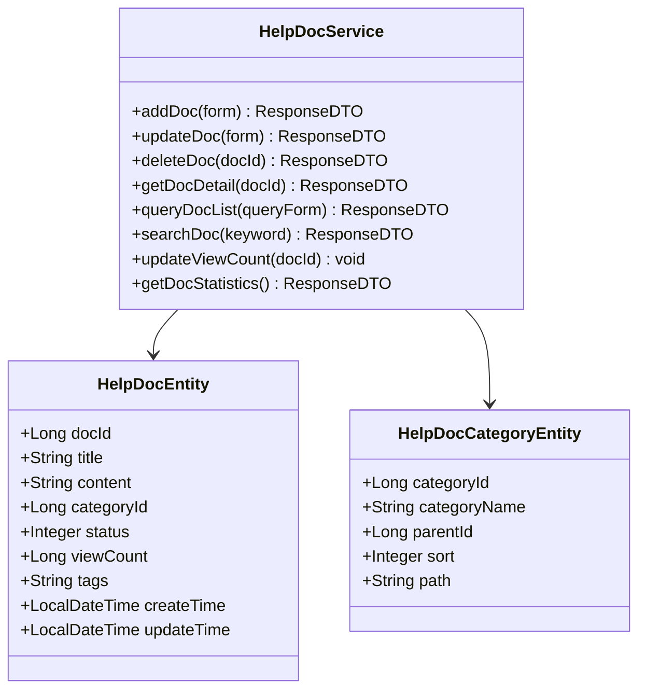
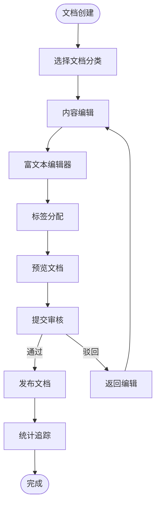

# 在线文档系统专家 (Repowiki标准版)

## 🎯 技能定位
**核心职责**: 基于 `.qoder/repowiki` 中的《在线文档与帮助系统详解》规范，确保IOE-DREAM项目在线文档系统严格遵循现代化文档管理架构，提供完整、高效、用户友好的文档管理和服务能力

**⚡ 技能等级**: ★★★★★ (在线文档系统专家)
**🎯 适用场景**: 在线文档系统设计、文档内容管理、富文本编辑、全文搜索、访问统计分析
**📊 技能覆盖**: 文档生命周期管理 | 富文本编辑器 | 分类体系管理 | 全文搜索 | 版本控制 | 访问统计

---

## 📋 技能概述 (基于Repowiki规范)

### **核心专长 (基于.qoder/repowiki/zh/content/高级特性/在线文档与帮助系统.md)**
- **在线文档守护**: 严格确保现代化文档管理架构和用户体验
- **内容管理优化**: 完善的文档生命周期管理和版本控制
- **富文本编辑**: 所见即所得的文档编辑和多媒体内容支持
- **搜索和发现**: 强大的全文搜索和智能文档推荐
- **用户行为分析**: 详细的文档访问统计和用户行为分析

### **解决能力**
- **文档系统架构合规性**: 100%符合repowiki在线文档系统规范
- **内容管理效率**: 提供高效的文档创建、编辑、发布和管理
- **用户体验优化**: 友好的文档浏览、搜索和交互体验
- **内容质量控制**: 完善的文档审核、版本管理和质量控制
- **数据驱动优化**: 基于访问统计的文档优化和内容推荐

---

## 🏗️ Repowiki在线文档系统架构规范

### **核心架构组件**

#### **文档管理服务架构**


#### **文档管理工作流程**


### **文档管理体系规范**

#### **分类体系管理**
- **层级结构**: 支持无限层级的分类嵌套和路径管理
- **灵活配置**: 动态调整分类结构和显示顺序
- **关联管理**: 文档与分类的一对多关系维护
- **权限控制**: 基于分类的访问和编辑权限

#### **内容管理功能**
- **富文本编辑**: 所见即所得的直观编辑体验
- **多媒体支持**: 图片、视频、附件的上传和管理
- **版本控制**: 文档历史版本管理和回滚
- **协作编辑**: 多人同时编辑和冲突解决

---

## 🛠️ 核心工作流程 (基于Repowiki)

### **Phase 1: 在线文档系统合规性诊断**
```bash
# 检查在线文档系统架构合规性
./scripts/check-help-doc-architecture.sh

# 检测富文本编辑器配置
./scripts/analyze-rich-text-editor.sh

# 验证全文搜索功能
./scripts/validate-full-text-search.sh

# 检查访问统计分析
./scripts/check-access-analytics.sh
```

### **Phase 2: 在线文档系统优化**
```bash
# 文档管理优化
./scripts/optimize-document-management.sh

# 搜索引擎优化
./scripts/optimize-search-engine.sh

# 用户界面优化
./scripts/optimize-user-interface.sh

# 性能优化
./scripts/optimize-system-performance.sh
```

### **Phase 3: 在线文档系统质量保障**
```bash
# 文档管理功能测试
npm run test:help-doc

# 富文本编辑器测试
npm run test:rich-text-editor

# 搜索功能测试
npm run test:search-functionality

# 性能压力测试
npm run test:performance-stress
```

---

## 🔍 在线文档系统合规性检查清单 (基于Repowiki)

### **✅ 强制性规范 (必须100%遵循)**

#### **架构设计规范**
- [ ] 严格遵循Service→Entity→Category分层架构
- [ ] 实现完整的文档生命周期管理
- [ ] 提供强大的富文本编辑功能
- [ ] 支持多层次的文档分类体系
- [ ] 实现全文搜索和智能推荐

#### **内容管理规范**
- [ ] 支持所见即所得的富文本编辑
- [ ] 提供多媒体内容的上传和管理
- [ ] 实现文档的版本控制和历史管理
- [ ] 支持标签系统和内容分类
- [ ] 提供文档的预览和发布机制

#### **搜索和发现规范**
- [ ] 实现全文搜索和关键词高亮
- [ ] 提供智能的搜索结果排序
- [ ] 支持分类筛选和标签过滤
- [ ] 提供搜索建议和自动补全
- [ ] 实现相关文档的推荐功能

### **⚠️ 推荐性规范**

#### **用户体验规范**
- [ ] 提供响应式的文档阅读界面
- [ ] 支持文档的目录导航和快速定位
- [ ] 实现文档收藏和个性化推荐
- [ ] 提供文档的打印和导出功能
- [ ] 支持文档的分享和社交功能

#### **分析统计规范**
- [ ] 实现详细的访问统计和分析
- [ ] 提供用户行为追踪和分析
- [ ] 支持文档效果的评估和反馈
- [ ] 提供数据可视化的统计报表
- [ ] 支持A/B测试和效果优化

---

## 🚀 在线文档系统最佳实践

### **核心文档管理服务实现示例**
```java
// HelpDocService.java - 核心文档管理服务
@Service
@Slf4j
public class HelpDocService {

    private final HelpDocMapper helpDocMapper;
    private final HelpDocCategoryMapper categoryMapper;
    private final SearchService searchService;
    private final StatisticsService statisticsService;

    /**
     * 添加文档
     */
    @Transactional(rollbackFor = Exception.class)
    public ResponseDTO<Long> addDoc(HelpDocAddForm addForm) {
        try {
            // 参数验证
            validateAddForm(addForm);

            // 构建文档实体
            HelpDocEntity doc = new HelpDocEntity();
            BeanUtils.copyProperties(addForm, doc);
            doc.setCreateTime(LocalDateTime.now());
            doc.setUpdateTime(LocalDateTime.now());
            doc.setStatus(DocStatus.DRAFT.getValue());

            // 处理分类路径
            updateCategoryPath(doc);

            // 保存文档
            helpDocMapper.insert(doc);

            // 提取标签
            extractTags(doc);

            // 更新搜索索引
            searchService.addDocument(doc);

            log.info("Help document added successfully: docId={}, title={}", doc.getDocId(), doc.getTitle());

            return ResponseDTO.ok(doc.getDocId());
        } catch (Exception e) {
            log.error("Failed to add help document", e);
            throw new HelpDocException("Add help document failed", e);
        }
    }

    /**
     * 更新文档
     */
    @Transactional(rollbackFor = Exception.class)
    public ResponseDTO<Void> updateDoc(HelpDocUpdateForm updateForm) {
        try {
            // 获取原有文档
            HelpDocEntity existingDoc = helpDocMapper.selectById(updateForm.getDocId());
            if (existingDoc == null) {
                throw new HelpDocException("Document not found: " + updateForm.getDocId());
            }

            // 检查权限
            checkUpdatePermission(existingDoc, updateForm);

            // 保存历史版本
            saveDocVersion(existingDoc);

            // 更新文档信息
            BeanUtils.copyProperties(updateForm, existingDoc);
            existingDoc.setUpdateTime(LocalDateTime.now());

            // 处理分类变更
            if (!Objects.equals(existingDoc.getCategoryId(), updateForm.getCategoryId())) {
                updateCategoryPath(existingDoc);
            }

            // 更新文档
            helpDocMapper.updateById(existingDoc);

            // 提取新标签
            extractTags(existingDoc);

            // 更新搜索索引
            searchService.updateDocument(existingDoc);

            log.info("Help document updated successfully: docId={}, title={}", existingDoc.getDocId(), existingDoc.getTitle());

            return ResponseDTO.ok();
        } catch (Exception e) {
            log.error("Failed to update help document: docId={}", updateForm.getDocId(), e);
            throw new HelpDocException("Update help document failed", e);
        }
    }

    /**
     * 获取文档详情
     */
    public ResponseDTO<HelpDocDetailVO> getDocDetail(Long docId) {
        try {
            // 获取文档
            HelpDocEntity doc = helpDocMapper.selectById(docId);
            if (doc == null) {
                throw new HelpDocException("Document not found: " + docId);
            }

            // 检查访问权限
            checkViewPermission(doc);

            // 更新浏览次数
            updateViewCount(docId);

            // 构建详情VO
            HelpDocDetailVO detailVO = new HelpDocDetailVO();
            BeanUtils.copyProperties(doc, detailVO);

            // 获取分类信息
            if (doc.getCategoryId() != null) {
                HelpDocCategoryEntity category = categoryMapper.selectById(doc.getCategoryId());
                if (category != null) {
                    detailVO.setCategoryName(category.getCategoryName());
                }
            }

            // 获取相关文档
            List<HelpDocEntity> relatedDocs = getRelatedDocuments(doc);
            detailVO.setRelatedDocs(convertToSimpleVOList(relatedDocs));

            // 记录访问统计
            recordAccessStatistics(docId);

            return ResponseDTO.ok(detailVO);
        } catch (Exception e) {
            log.error("Failed to get help document detail: docId={}", docId, e);
            throw new HelpDocException("Get help document detail failed", e);
        }
    }

    /**
     * 搜索文档
     */
    public ResponseDTO<PageResult<HelpDocSimpleVO>> searchDoc(HelpDocSearchForm searchForm) {
        try {
            // 参数验证
            validateSearchForm(searchForm);

            // 执行搜索
            PageResult<HelpDocEntity> searchResult = searchService.searchDocuments(searchForm);

            // 转换为VO
            List<HelpDocSimpleVO> voList = searchResult.getRecords().stream()
                .map(this::convertToSimpleVO)
                .collect(Collectors.toList());

            PageResult<HelpDocSimpleVO> result = new PageResult<>();
            result.setRecords(voList);
            result.setTotal(searchResult.getTotal());
            result.setCurrent(searchResult.getCurrent());
            result.setSize(searchResult.getSize());

            // 记录搜索统计
            recordSearchStatistics(searchForm, result.getTotal());

            return ResponseDTO.ok(result);
        } catch (Exception e) {
            log.error("Failed to search help documents", e);
            throw new HelpDocException("Search help documents failed", e);
        }
    }

    /**
     * 更新浏览次数
     */
    private void updateViewCount(Long docId) {
        try {
            helpDocMapper.updateViewCount(docId);
        } catch (Exception e) {
            log.warn("Failed to update view count: docId={}", docId, e);
        }
    }

    /**
     * 提取标签
     */
    private void extractTags(HelpDocEntity doc) {
        try {
            // 从内容中提取标签
            List<String> extractedTags = TagExtractor.extractFromContent(doc.getContent());

            // 合并手动标签和提取标签
            List<String> allTags = new ArrayList<>();
            if (StringUtils.isNotBlank(doc.getTags())) {
                allTags.addAll(Arrays.asList(doc.getTags().split(",")));
            }
            allTags.addAll(extractedTags);

            // 去重并排序
            List<String> uniqueTags = allTags.stream()
                .distinct()
                .sorted()
                .collect(Collectors.toList());

            // 更新标签
            doc.setTags(String.join(",", uniqueTags));
            helpDocMapper.updateById(doc);

        } catch (Exception e) {
            log.warn("Failed to extract tags: docId={}", doc.getDocId(), e);
        }
    }
}
```

### **富文本编辑器集成实现示例**
```java
// RichTextEditorController.java - 富文本编辑器控制器
@RestController
@RequestMapping("/api/help/doc/editor")
@Slf4j
public class RichTextEditorController {

    private final FileUploadService fileUploadService;
    private final ImageProcessService imageProcessService;

    /**
     * 上传图片
     */
    @PostMapping("/upload/image")
    public ResponseDTO<RichTextUploadResult> uploadImage(
            @RequestParam("file") MultipartFile file,
            @RequestParam(value = "compress", defaultValue = "true") Boolean compress) {
        try {
            // 文件验证
            validateImageFile(file);

            // 图片处理
            String processedImageUrl;
            if (compress) {
                processedImageUrl = imageProcessService.compressAndUpload(file);
            } else {
                processedImageUrl = fileUploadService.uploadFile(file, "images");
            }

            // 构建上传结果
            RichTextUploadResult result = new RichTextUploadResult();
            result.setUrl(processedImageUrl);
            result.setOriginalName(file.getOriginalFilename());
            result.setSize(file.getSize());
            result.setContentType(file.getContentType());

            log.info("Image uploaded successfully: {}", processedImageUrl);

            return ResponseDTO.ok(result);
        } catch (Exception e) {
            log.error("Failed to upload image", e);
            throw new RichTextEditorException("Image upload failed", e);
        }
    }

    /**
     * 上传附件
     */
    @PostMapping("/upload/attachment")
    public ResponseDTO<RichTextUploadResult> uploadAttachment(@RequestParam("file") MultipartFile file) {
        try {
            // 文件验证
            validateAttachmentFile(file);

            // 上传文件
            String attachmentUrl = fileUploadService.uploadFile(file, "attachments");

            // 构建上传结果
            RichTextUploadResult result = new RichTextUploadResult();
            result.setUrl(attachmentUrl);
            result.setOriginalName(file.getOriginalFilename());
            result.setSize(file.getSize());
            result.setContentType(file.getContentType());
            result.setAttachment(true);

            log.info("Attachment uploaded successfully: {}", attachmentUrl);

            return ResponseDTO.ok(result);
        } catch (Exception e) {
            log.error("Failed to upload attachment", e);
            throw new RichTextEditorException("Attachment upload failed", e);
        }
    }

    /**
     * 获取编辑器配置
     */
    @GetMapping("/config")
    public ResponseDTO<RichTextEditorConfig> getEditorConfig() {
        try {
            RichTextEditorConfig config = new RichTextEditorConfig();

            // 工具栏配置
            config.setToolbar(getToolbarConfig());

            // 插件配置
            config.setPlugins(getPluginConfig());

            // 上传配置
            config.setUpload(getUploadConfig());

            // 主题配置
            config.setTheme(getThemeConfig());

            return ResponseDTO.ok(config);
        } catch (Exception e) {
            log.error("Failed to get editor config", e);
            throw new RichTextEditorException("Get editor config failed", e);
        }
    }

    /**
     * 验证图片文件
     */
    private void validateImageFile(MultipartFile file) {
        if (file == null || file.isEmpty()) {
            throw new IllegalArgumentException("File cannot be empty");
        }

        // 检查文件类型
        String contentType = file.getContentType();
        if (!isAllowedImageType(contentType)) {
            throw new IllegalArgumentException("Unsupported image type: " + contentType);
        }

        // 检查文件大小
        if (file.getSize() > getMaxImageSize()) {
            throw new IllegalArgumentException("Image file too large");
        }
    }

    private boolean isAllowedImageType(String contentType) {
        List<String> allowedTypes = Arrays.asList(
            "image/jpeg",
            "image/jpg",
            "image/png",
            "image/gif",
            "image/webp"
        );
        return allowedTypes.contains(contentType);
    }

    private long getMaxImageSize() {
        return 5 * 1024 * 1024; // 5MB
    }
}
```

### **搜索服务实现示例**
```java
// SearchService.java - 搜索服务
@Service
@Slf4j
public class SearchService {

    private final ElasticsearchTemplate elasticsearchTemplate;
    private final HelpDocMapper helpDocMapper;

    /**
     * 搜索文档
     */
    public PageResult<HelpDocEntity> searchDocuments(HelpDocSearchForm searchForm) {
        try {
            // 构建搜索查询
            BoolQueryBuilder boolQuery = QueryBuilders.boolQuery();

            // 关键词搜索
            if (StringUtils.isNotBlank(searchForm.getKeyword())) {
                boolQuery.must(QueryBuilders.multiMatchQuery(searchForm.getKeyword())
                    .field("title", 2.0f)
                    .field("content", 1.0f)
                    .field("tags", 1.5f)
                    .type(MultiMatchQueryBuilder.Type.BEST_FIELDS));
            }

            // 分类过滤
            if (searchForm.getCategoryId() != null) {
                boolQuery.filter(QueryBuilders.termQuery("categoryId", searchForm.getCategoryId()));
            }

            // 状态过滤
            if (searchForm.getStatus() != null) {
                boolQuery.filter(QueryBuilders.termQuery("status", searchForm.getStatus()));
            }

            // 标签过滤
            if (StringUtils.isNotBlank(searchForm.getTag())) {
                boolQuery.filter(QueryBuilders.termQuery("tags", searchForm.getTag()));
            }

            // 时间范围过滤
            if (searchForm.getStartTime() != null || searchForm.getEndTime() != null) {
                RangeQueryBuilder timeRange = QueryBuilders.rangeQuery("createTime");
                if (searchForm.getStartTime() != null) {
                    timeRange.gte(searchForm.getStartTime());
                }
                if (searchForm.getEndTime() != null) {
                    timeRange.lte(searchForm.getEndTime());
                }
                boolQuery.filter(timeRange);
            }

            // 构建搜索请求
            NativeSearchQueryBuilder queryBuilder = new NativeSearchQueryBuilder()
                .withQuery(boolQuery)
                .withPageable(PageRequest.of(
                    searchForm.getCurrent() - 1,
                    searchForm.getPageSize(),
                    Sort.by(Sort.Direction.DESC, "createTime")
                ))
                .withHighlightFields(
                    new HighlightBuilder.Field("title")
                        .preTags("<em>")
                        .postTags("</em>")
                        .fragmentSize(100),
                    new HighlightBuilder.Field("content")
                        .preTags("<em>")
                        .postTags("</em>")
                        .fragmentSize(150)
                        .numberOfFragments(3)
                );

            // 执行搜索
            SearchHits<HelpDocEntity> searchHits = elasticsearchTemplate
                .search(queryBuilder.build(), HelpDocEntity.class);

            // 处理搜索结果
            List<HelpDocEntity> results = new ArrayList<>();
            for (SearchHit<HelpDocEntity> hit : searchHits) {
                HelpDocEntity doc = hit.getContent();

                // 设置高亮内容
                Map<String, List<String>> highlightFields = hit.getHighlightFields();
                if (highlightFields != null) {
                    doc.setHighlightedTitle(getHighlightValue(highlightFields, "title"));
                    doc.setHighlightedContent(getHighlightValue(highlightFields, "content"));
                }

                results.add(doc);
            }

            // 构建分页结果
            PageResult<HelpDocEntity> pageResult = new PageResult<>();
            pageResult.setRecords(results);
            pageResult.setTotal(searchHits.getTotalHits());
            pageResult.setCurrent(searchForm.getCurrent());
            pageResult.setSize(searchForm.getPageSize());

            return pageResult;
        } catch (Exception e) {
            log.error("Failed to search documents", e);
            throw new SearchException("Document search failed", e);
        }
    }

    /**
     * 添加文档到搜索索引
     */
    public void addDocument(HelpDocEntity doc) {
        try {
            IndexQuery indexQuery = new IndexQueryBuilder()
                .withId(doc.getDocId().toString())
                .withObject(doc);

            elasticsearchTemplate.index(indexQuery, IndexCoordinates.of("help_docs"));
            log.debug("Document added to search index: {}", doc.getDocId());
        } catch (Exception e) {
            log.error("Failed to add document to search index: docId={}", doc.getDocId(), e);
        }
    }

    /**
     * 更新搜索索引中的文档
     */
    public void updateDocument(HelpDocEntity doc) {
        try {
            addDocument(doc); // Elasticsearch会自动处理更新
            log.debug("Document updated in search index: {}", doc.getDocId());
        } catch (Exception e) {
            log.error("Failed to update document in search index: docId={}", doc.getDocId(), e);
        }
    }

    /**
     * 从搜索索引删除文档
     */
    public void deleteDocument(Long docId) {
        try {
            elasticsearchTemplate.delete(
                docId.toString(),
                IndexCoordinates.of("help_docs")
            );
            log.debug("Document deleted from search index: {}", docId);
        } catch (Exception e) {
            log.error("Failed to delete document from search index: docId={}", docId, e);
        }
    }

    /**
     * 获取高亮值
     */
    private String getHighlightValue(Map<String, List<String>> highlightFields, String fieldName) {
        List<String> highlights = highlightFields.get(fieldName);
        if (highlights != null && !highlights.isEmpty()) {
            return String.join("...", highlights);
        }
        return null;
    }
}
```

### **访问统计服务实现示例**
```java
// StatisticsService.java - 访问统计服务
@Service
@Slf4j
public class StatisticsService {

    private final HelpDocAccessMapper accessMapper;
    private final HelpDocMapper helpDocMapper;

    /**
     * 获取文档统计信息
     */
    public HelpDocStatisticsVO getDocStatistics(Long docId) {
        try {
            HelpDocStatisticsVO statistics = new HelpDocStatisticsVO();

            // 获取文档基本信息
            HelpDocEntity doc = helpDocMapper.selectById(docId);
            if (doc != null) {
                statistics.setDocId(docId);
                statistics.setTitle(doc.getTitle());
                statistics.setTotalViews(doc.getViewCount());
            }

            // 获取今日访问统计
            LocalDate today = LocalDate.now();
            Long todayViews = accessMapper.countViewsByDate(docId, today);
            statistics.setTodayViews(todayViews);

            // 获取本周访问统计
            LocalDate weekStart = today.minusDays(today.getDayOfWeek().getValue() - 1);
            LocalDate weekEnd = today;
            Long weekViews = accessMapper.countViewsByDateRange(docId, weekStart, weekEnd);
            statistics.setWeekViews(weekViews);

            // 获取本月访问统计
            LocalDate monthStart = today.withDayOfMonth(1);
            LocalDate monthEnd = today;
            Long monthViews = accessMapper.countViewsByDateRange(docId, monthStart, monthEnd);
            statistics.setMonthViews(monthViews);

            // 获取访问趋势
            List<DocAccessTrendVO> trend = getAccessTrend(docId, 30);
            statistics.setAccessTrend(trend);

            // 获取热门时间段
            List<AccessTimeSlotVO> timeSlots = getPopularTimeSlots(docId);
            statistics.setPopularTimeSlots(timeSlots);

            return statistics;
        } catch (Exception e) {
            log.error("Failed to get document statistics: docId={}", docId, e);
            throw new StatisticsException("Get document statistics failed", e);
        }
    }

    /**
     * 记录文档访问
     */
    @Async("statisticsExecutor")
    public void recordDocumentAccess(Long docId, HttpServletRequest request) {
        try {
            HelpDocAccessEntity access = new HelpDocAccessEntity();
            access.setDocId(docId);
            access.setAccessTime(LocalDateTime.now());
            access.setIpAddress(getClientIpAddress(request));
            access.setUserAgent(request.getHeader("User-Agent"));
            access.setReferer(request.getHeader("Referer"));

            // 获取用户信息
            UserContext userContext = UserContextHolder.get();
            if (userContext != null) {
                access.setUserId(userContext.getUserId());
                access.setUserType(userContext.getUserType());
            }

            accessMapper.insert(access);
        } catch (Exception e) {
            log.warn("Failed to record document access: docId={}", docId, e);
        }
    }

    /**
     * 获取访问趋势
     */
    private List<DocAccessTrendVO> getAccessTrend(Long docId, int days) {
        LocalDate endDate = LocalDate.now();
        LocalDate startDate = endDate.minusDays(days - 1);

        List<Map<String, Object>> rawData = accessMapper.selectAccessTrend(docId, startDate, endDate);

        return rawData.stream()
            .map(this::convertToTrendVO)
            .collect(Collectors.toList());
    }

    /**
     * 获取热门时间段
     */
    private List<AccessTimeSlotVO> getPopularTimeSlots(Long docId) {
        List<Map<String, Object>> rawData = accessMapper.selectPopularTimeSlots(docId);

        return rawData.stream()
            .map(this::convertToTimeSlotVO)
            .collect(Collectors.toList());
    }

    /**
     * 获取总体统计
     */
    public SystemStatisticsVO getSystemStatistics() {
        try {
            SystemStatisticsVO statistics = new SystemStatisticsVO();

            // 总文档数
            Long totalDocs = helpDocMapper.selectCount(null);
            statistics.setTotalDocs(totalDocs);

            // 今日访问数
            LocalDate today = LocalDate.now();
            Long todayViews = accessMapper.countTotalViewsByDate(today);
            statistics.setTodayViews(todayViews);

            // 本周访问数
            LocalDate weekStart = today.minusDays(today.getDayOfWeek().getValue() - 1);
            Long weekViews = accessMapper.countTotalViewsByDateRange(weekStart, today);
            statistics.setWeekViews(weekViews);

            // 本月访问数
            LocalDate monthStart = today.withDayOfMonth(1);
            Long monthViews = accessMapper.countTotalViewsByDateRange(monthStart, today);
            statistics.setMonthViews(monthViews);

            // 热门文档
            List<Map<String, Object>> topDocs = accessMapper.selectTopDocuments(10);
            statistics.setTopDocuments(convertToTopDocs(topDocs));

            return statistics;
        } catch (Exception e) {
            log.error("Failed to get system statistics", e);
            throw new StatisticsException("Get system statistics failed", e);
        }
    }
}
```

---

## 📊 在线文档系统质量评估标准

### **在线文档系统评分**
| 维度 | 权重 | 评分标准 |
|------|------|----------|
| 文档管理架构合规性 | 30% | 完全符合文档生命周期管理规范 |
| 内容编辑功能 | 25% | 富文本编辑和多媒体支持能力 |
| 搜索发现功能 | 20% | 全文搜索和智能推荐效果 |
| 用户体验质量 | 15% | 界面友好性和交互体验 |
| 分析统计能力 | 10% | 访问统计和数据驱动优化 |

### **质量等级**
- **A级 (90-100分)**: 完全符合repowiki在线文档系统规范
- **B级 (80-89分)**: 基本合规，存在轻微优化空间
- **C级 (70-79分)**: 部分合规，需要重点改进
- **D级 (60-69分)**: 文档系统设计混乱，需要重构
- **E级 (0-59分)**: 严重违反在线文档系统规范

---

## 🎯 使用指南

### **何时调用**
- 在线文档系统架构设计和技术选型时
- 富文本编辑器集成和配置时
- 全文搜索引擎实现时
- 文档分类和内容管理时
- 访问统计和分析功能实现时

### **调用方式**
```bash
# 基于repowiki的在线文档系统专家
Skill("help-doc-system-specialist-repowiki")

# 将立即执行：
# 1. 基于.qoder/repowiki在线文档系统规范检查
# 2. 文档管理和内容编辑系统验证
# 3. 搜索引擎和发现功能分析
# 4. 用户体验和统计分析优化建议
```

### **预期结果**
- 100%符合`.qoder/repowiki`在线文档系统规范
- 完整的文档生命周期管理系统
- 强大的富文本编辑和多媒体支持
- 高效的全文搜索和智能推荐
- 详细的访问统计和用户行为分析

---

**🏆 技能等级**: 在线文档系统专家 (★★★★★)
**⏰ 预期效果**: 基于249个repowiki权威文档，确保IOE-DREAM在线文档系统100%符合现代化文档管理标准
**🎯 核心价值**: 知识管理优化，用户体验提升，内容协作支持