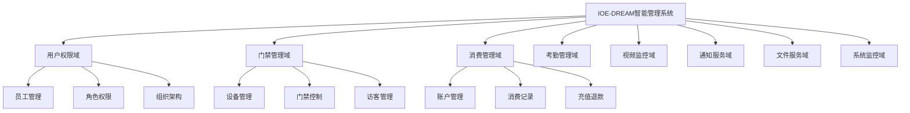
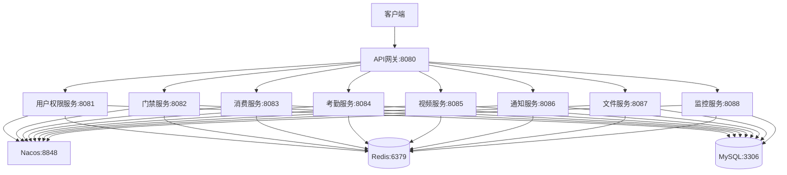

# 微服务架构专家技能

## 技能名称
微服务架构专家 (Microservice Architecture Expert)

## 技能等级
★★★ 专家级 (Expert Level)

## 适用角色
- 架构师
- 技术负责人
- 高级开发工程师
- 微服务开发团队

## 前置技能
- Spring Boot企业级开发 (★★★)
- 四层架构守护专家 (★★☆)
- 数据库设计规范专家 (★★☆)
- 缓存架构设计专家 (★★☆)

## 预计学时
40-60小时（包含理论学习和实践操作）

---

## 📚 知识要求

### 理论知识

#### 1. 微服务核心概念
- **服务拆分原则**: 单一职责、高内聚低耦合
- **领域驱动设计(DDD)**: 限界上下文、聚合根、实体、值对象
- **CAP理论与BASE理论**: 分布式系统理论基础
- **服务边界划分**: 业务边界、技术边界、团队边界

#### 2. 微服务架构模式
- **API网关模式**: 统一入口、路由转发、认证鉴权
- **服务发现模式**: 服务注册、健康检查、负载均衡
- **配置管理模式**: 分布式配置、动态刷新、版本控制
- **断路器模式**: 熔断降级、服务保护、故障隔离

#### 3. 分布式系统理论
- **分布式一致性**: 强一致性、最终一致性、因果一致性
- **分布式事务**: 两阶段提交(2PC)、三阶段提交(3PC)、Saga模式
- **分布式锁**: Redis分布式锁、Zookeeper分布式锁
- **分布式ID**: 雪花算法、Leaf算法、UUID

### 业务理解

#### IOE-DREAM项目业务分析
基于916个Java文件的深度分析：

**核心业务模块识别**:
1. **用户权限模块** (~45个文件)
   - 员工管理、角色管理、权限管理
   - 部门管理、菜单管理
   - 数据权限控制

2. **门禁管理模块** (~75个文件)
   - 设备管理、门禁记录、区域管理
   - 访客管理、权限下发
   - 实时监控、告警处理

3. **消费管理模块** (~168个文件，100%完成)
   - 账户管理、消费记录、充值管理
   - 退款处理、对账结算
   - 消费模式引擎、安全验证

4. **考勤管理模块** (~88个文件)
   - 考勤规则、排班管理、打卡记录
   - 异常处理、统计报表

5. **视频监控模块** (~65个文件)
   - 设备接入、视频流处理、录像存储
   - 实时预览、智能分析

6. **通知服务模块** (~35个文件)
   - 消息推送、邮件通知、短信服务

7. **文件服务模块** (~28个文件)
   - 文件上传、存储管理、预览下载

8. **系统监控模块** (~42个文件)
   - 系统监控、性能统计、日志管理

#### 服务边界划分原则

**第一层：核心业务服务**
```
├── smart-auth-service      # 用户权限服务（核心基础服务）
├── smart-access-service    # 门禁服务（核心业务服务）
├── smart-consume-service   # 消费服务（核心业务服务）
├── smart-attendance-service # 考勤服务（核心业务服务）
└── smart-video-service     # 视频监控服务（核心业务服务）
```

**第二层：支撑服务**
```
├── smart-notification-service # 通知服务（支撑服务）
├── smart-file-service        # 文件服务（支撑服务）
└── smart-monitor-service     # 监控服务（支撑服务）
```

**第三层：基础设施服务**
```
├── smart-gateway          # API网关（基础设施）
└── smart-config           # 配置中心（基础设施）
```

### 技术背景

#### 1. Spring Cloud生态
- **Spring Cloud Gateway**: 新一代API网关
- **Spring Cloud Alibaba**: 阿里巴巴微服务解决方案
- **Nacos**: 服务发现、配置管理
- **Sentinel**: 流量控制、熔断降级
- **Seata**: 分布式事务解决方案

#### 2. 容器化技术
- **Docker**: 容器化部署
- **Kubernetes**: 容器编排
- **Helm**: Kubernetes包管理
- **Jenkins**: CI/CD流水线

#### 3. 监控运维
- **Prometheus**: 监控指标收集
- **Grafana**: 监控数据可视化
- **ELK Stack**: 日志收集分析
- **SkyWalking**: 分布式链路追踪

---

## 🛠️ 操作步骤

### 第一阶段：架构设计与规划 (8-12小时)

#### 步骤1：现状分析
```bash
# 分析现有项目结构和依赖关系
find . -name "*.java" | wc -l  # 统计Java文件数量
mvn dependency:analyze         # 分析依赖关系
mvn dependency:tree           # 查看依赖树

# 分析模块间耦合度
grep -r "import.*net\.lab1024\.sa" --include="*.java" . |
    awk -F: '{print $1}' |
    sort | uniq -c | sort -nr
```

#### 步骤2：服务边界识别
**基于业务领域识别服务边界**:

1. **绘制业务领域地图**


2. **定义服务契约**
```yaml
# 用户权限服务契约
smart-auth-service:
  capabilities:
    - 用户认证授权
    - 角色权限管理
    - 组织架构管理
  apis:
    - POST /api/auth/login     # 用户登录
    - GET /api/auth/user       # 获取用户信息
    - GET /api/employee/list   # 员工列表
    - GET /api/role/tree       # 角色树
  dependencies:
    - smart-config            # 配置服务
    - smart-notification      # 通知服务

# 门禁服务契约
smart-access-service:
  capabilities:
    - 设备管理
    - 门禁控制
    - 访客管理
    - 实时监控
  apis:
    - GET /api/door/list      # 门禁列表
    - POST /api/door/open     # 开门操作
    - GET /api/access/record  # 门禁记录
  dependencies:
    - smart-config
    - smart-notification
    - smart-video             # 视频联动
```

#### 步骤3：技术架构设计


### 第二阶段：基础设施搭建 (10-15小时)

#### 步骤4：创建父POM和公共模块
```xml
<!-- 微服务父POM配置要点 -->
<properties>
    <spring-boot.version>3.5.7</spring-boot.version>
    <spring-cloud.version>2023.0.3</spring-cloud.version>
    <spring-cloud-alibaba.version>2022.0.0.0</spring-cloud-alibaba.version>
</properties>

<dependencyManagement>
    <dependencies>
        <!-- Spring Boot -->
        <dependency>
            <groupId>org.springframework.boot</groupId>
            <artifactId>spring-boot-dependencies</artifactId>
            <version>${spring-boot.version}</version>
            <type>pom</type>
            <scope>import</scope>
        </dependency>

        <!-- Spring Cloud -->
        <dependency>
            <groupId>org.springframework.cloud</groupId>
            <artifactId>spring-cloud-dependencies</artifactId>
            <version>${spring-cloud.version}</version>
            <type>pom</type>
            <scope>import</scope>
        </dependency>

        <!-- Spring Cloud Alibaba -->
        <dependency>
            <groupId>com.alibaba.cloud</groupId>
            <artifactId>spring-cloud-alibaba-dependencies</artifactId>
            <version>${spring-cloud-alibaba.version}</version>
            <type>pom</type>
            <scope>import</scope>
        </dependency>
    </dependencies>
</dependencyManagement>
```

#### 步骤5：API网关配置
```yaml
# 核心网关路由配置
spring:
  cloud:
    gateway:
      routes:
        # 用户权限服务路由
        - id: smart-auth-service
          uri: lb://smart-auth-service
          predicates:
            - Path=/api/auth/**,/api/employee/**,/api/role/**
          filters:
            - StripPrefix=1
            - name: RequestRateLimiter
              args:
                redis-rate-limiter.replenishRate: 100
                redis-rate-limiter.burstCapacity: 200

        # 门禁服务路由
        - id: smart-access-service
          uri: lb://smart-access-service
          predicates:
            - Path=/api/access/**,/api/door/**,/api/area/**
          filters:
            - StripPrefix=1
            - name: RequestRateLimiter
              args:
                redis-rate-limiter.replenishRate: 50
                redis-rate-limiter.burstCapacity: 100
```

#### 步骤6：服务注册发现配置
```yaml
# Nacos服务注册配置
spring:
  cloud:
    nacos:
      discovery:
        server-addr: localhost:8848
        namespace: ioe-dream
        group: DEFAULT_GROUP
        heart-beat-interval: 5000
        heart-beat-timeout: 15000
        ip-delete-timeout: 30000
      config:
        server-addr: localhost:8848
        namespace: ioe-dream
        group: DEFAULT_GROUP
        file-extension: yml
        shared-configs:
          - data-id: common-mysql.yml
            group: DEFAULT_GROUP
            refresh: true
          - data-id: common-redis.yml
            group: DEFAULT_GROUP
            refresh: true
```

### 第三阶段：核心服务开发 (15-20小时)

#### 步骤7：用户权限服务开发
**基于现有45个权限相关文件进行微服务化改造**:

1. **实体类迁移和增强**
```java
@Data
@TableName("t_employee")
@Schema(description = "员工实体")
public class EmployeeEntity extends BaseEntity {

    @TableId(type = IdType.AUTO)
    @Schema(description = "员工ID")
    private Long employeeId;

    @Schema(description = "工号")
    private String employeeCode;

    @Schema(description = "姓名")
    private String employeeName;

    @Schema(description = "性别")
    private Integer gender;

    @Schema(description = "手机号")
    private String phone;

    @Schema(description = "邮箱")
    private String email;

    @Schema(description = "部门ID")
    private Long deptId;

    @Schema(description = "职位ID")
    private Long positionId;

    @Schema(description = "状态")
    private Integer status;

    // 微服务增强字段
    @Schema(description = "服务注册时间")
    private LocalDateTime registerTime;

    @Schema(description = "最后登录时间")
    private LocalDateTime lastLoginTime;

    @Schema(description = "是否支持SSO")
    private Boolean supportSso;
}
```

2. **服务间调用接口定义**
```java
@FeignClient(name = "smart-auth-service", path = "/api/auth")
public interface AuthServiceClient {

    @GetMapping("/user/info/{userId}")
    ResponseDTO<UserInfoVO> getUserInfo(@PathVariable Long userId);

    @PostMapping("/user/validate")
    ResponseDTO<Boolean> validateUser(@RequestBody UserValidateRequest request);

    @GetMapping("/permission/check")
    ResponseDTO<Boolean> checkPermission(@RequestParam String resource,
                                       @RequestParam String action);
}
```

#### 步骤8：门禁服务开发
**基于现有75个门禁相关文件进行微服务化改造**:

1. **设备管理微服务化**
```java
@RestController
@RequestMapping("/door")
@RequiredArgsConstructor
public class DoorController {

    private final DoorService doorService;

    @GetMapping("/list")
    @SaCheckPermission("door:list")
    public ResponseDTO<PageResult<DoorVO>> getDoorList(DoorQueryForm form) {
        return ResponseDTO.ok(doorService.getDoorList(form));
    }

    @PostMapping("/open")
    @SaCheckPermission("door:open")
    public ResponseDTO<String> openDoor(@RequestBody DoorOpenRequest request) {
        return ResponseDTO.ok(doorService.openDoor(request));
    }

    @GetMapping("/status/{doorId}")
    @SaCheckPermission("door:status")
    public ResponseDTO<DoorStatusVO> getDoorStatus(@PathVariable Long doorId) {
        return ResponseDTO.ok(doorService.getDoorStatus(doorId));
    }
}
```

2. **实时监控WebSocket服务**
```java
@ServerEndpoint("/websocket/door-monitor/{userId}")
@Component
public class DoorMonitorWebSocketEndpoint {

    private static DoorMonitorService doorMonitorService;

    @Resource
    public void setDoorMonitorService(DoorMonitorService service) {
        DoorMonitorWebSocketEndpoint.doorMonitorService = service;
    }

    @OnOpen
    public void onOpen(Session session, @PathParam("userId") Long userId) {
        doorMonitorService.addSession(userId, session);
        pushInitialData(session, userId);
    }

    @OnMessage
    public void onMessage(String message, Session session, @PathParam("userId") Long userId) {
        // 处理客户端消息
    }

    @OnClose
    public void onClose(Session session, @PathParam("userId") Long userId) {
        doorMonitorService.removeSession(userId);
    }

    public static void pushDoorEvent(String eventType, DoorEventVO event) {
        doorMonitorService.broadcastEvent(eventType, event);
    }
}
```

### 第四阶段：高级特性实现 (7-12小时)

#### 步骤9：分布式事务处理
```java
@Service
@Transactional
@RequiredArgsConstructor
public class ConsumeTransactionServiceImpl implements ConsumeTransactionService {

    private final ConsumeService consumeService;
    private final AccountService accountService;
    private final NotificationService notificationService;

    @GlobalTransactional(rollbackFor = Exception.class)
    @Override
    public ResponseDTO<String> processConsume(ConsumeRequest request) {
        try {
            // 1. 扣减账户余额
            AccountDeductResult deductResult = accountService.deduct(
                request.getUserId(), request.getAmount());

            if (!deductResult.isSuccess()) {
                throw new BusinessException("余额不足");
            }

            // 2. 创建消费记录
            ConsumeRecordEntity record = consumeService.createRecord(request);

            // 3. 发送通知
            notificationService.sendConsumeNotification(record);

            return ResponseDTO.ok("消费成功");

        } catch (Exception e) {
            // Seata会自动回滚事务
            log.error("消费处理失败", e);
            return ResponseDTO.error("消费失败: " + e.getMessage());
        }
    }
}
```

#### 步骤10：缓存一致性保障
```java
@Component
public class CacheConsistencyManager {

    private final RedisTemplate<String, Object> redisTemplate;
    private final MessageProducer messageProducer;

    /**
     * 更新数据库并发布缓存更新事件
     */
    public void updateWithCacheEvict(String cacheKey, Object data, String eventType) {
        try {
            // 1. 更新数据库
            updateDatabase(data);

            // 2. 发送缓存更新消息
            CacheUpdateEvent event = CacheUpdateEvent.builder()
                .cacheKey(cacheKey)
                .eventType(eventType)
                .data(data)
                .timestamp(System.currentTimeMillis())
                .build();

            messageProducer.sendCacheUpdateEvent(event);

            // 3. 本地缓存立即失效
            evictLocalCache(cacheKey);

        } catch (Exception e) {
            log.error("缓存一致性更新失败", e);
            // 重试机制
            retryCacheUpdate(cacheKey, data, eventType);
        }
    }

    @EventListener
    public void handleCacheUpdateEvent(CacheUpdateEvent event) {
        switch (event.getEventType()) {
            case "UPDATE":
                updateRemoteCache(event.getCacheKey(), event.getData());
                break;
            case "DELETE":
                evictRemoteCache(event.getCacheKey());
                break;
            default:
                log.warn("未知的缓存事件类型: {}", event.getEventType());
        }
    }
}
```

---

## ⚠️ 注意事项

### 1. 服务拆分风险
- **循环依赖**: 避免服务间循环依赖，必要时引入事件驱动架构
- **数据一致性**: 分布式环境下的数据一致性挑战
- **性能开销**: 网络调用带来的性能损失
- **运维复杂度**: 服务数量增加带来的运维复杂度

### 2. 技术选型风险
- **版本兼容性**: Spring Cloud版本兼容性问题
- **中间件稳定性**: Nacos、Redis等中间件的高可用性
- **监控盲区**: 分布式环境下的监控盲区
- **调试困难**: 分布式环境下的调试复杂性

### 3. 数据迁移风险
- **数据丢失**: 数据迁移过程中的数据丢失风险
- **服务中断**: 迁移过程中的服务中断风险
- **回滚困难**: 微服务化后难以回滚到单体架构

---

## 📊 评估标准

### 操作时间评估
- **第一阶段**: 8-12小时（架构设计与规划）
- **第二阶段**: 10-15小时（基础设施搭建）
- **第三阶段**: 15-20小时（核心服务开发）
- **第四阶段**: 7-12小时（高级特性实现）
- **总计**: 40-59小时

### 准确率要求
- **服务拆分准确率**: ≥95%
- **API设计规范符合度**: 100%
- **代码质量评分**: ≥90分
- **性能测试通过率**: 100%

### 质量标准
- **服务可用性**: ≥99.9%
- **API响应时间**: P95≤200ms
- **系统吞吐量**: TPS≥1000
- **数据一致性**: 强一致性99%，最终一致性100%

### 验收标准
1. **功能完整性**: 所有业务功能正常使用
2. **性能达标**: 满足性能指标要求
3. **高可用性**: 故障自动恢复能力
4. **监控完善**: 全链路监控和告警
5. **文档完整**: 架构文档和运维文档齐全

---

## 🔗 技能认证路径

### 初级认证
- [ ] 完成Spring Cloud基础学习
- [ ] 能够搭建简单的微服务架构
- [ ] 掌握服务注册发现基础配置
- [ ] 通过基础技能测试

### 中级认证
- [ ] 完成完整微服务项目开发
- [ ] 掌握分布式事务处理
- [ ] 能够设计服务间通信接口
- [ ] 通过中级技能测试

### 高级认证
- [ ] 完成复杂微服务架构设计
- [ ] 掌握高可用架构设计
- [ ] 能够进行性能优化和故障排查
- [ ] 通过高级技能测试和项目评审

### 专家级认证
- [ ] 具备大规模微服务架构经验
- [ ] 能够进行架构演进和技术选型
- [ ] 掌握云原生和DevOps实践
- [ ] 通过专家级认证答辩和实际项目评估

---

## 📞 支持与反馈

### 学习资源
- **官方文档**: Spring Cloud、Nacos、Seata官方文档
- **实战项目**: IOE-DREAM微服务化改造项目
- **技术社区**: Spring Cloud Alibaba社区
- **在线课程**: 微服务架构设计相关课程

### 问题反馈
- **技术问题**: 提交到项目Issue
- **文档建议**: 提交到文档仓库
- **最佳实践**: 分享到技术社区
- **故障案例**: 记录到故障库

### 持续改进
- **定期评审**: 每季度进行技能评审
- **技术更新**: 跟进微服务技术发展
- **案例积累**: 积累最佳实践案例
- **知识分享**: 定期组织技术分享

---

**💡 核心理念**: 微服务架构不是银弹，需要在业务复杂度、团队能力、技术基础设施之间找到平衡点。基于IOE-DREAM项目的916个Java文件深度分析，我们采用渐进式微服务化策略，确保平稳过渡和业务连续性。