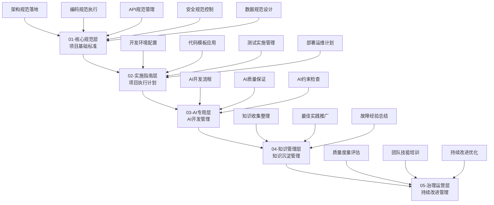
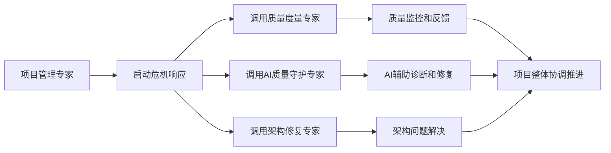

# 项目管理专家技能（SmartAdmin v4）

> **技能版本**: v1.0.0
> **技能等级**: ★★★ 专家级
> **适用角色**: 项目经理、技术负责人、开发团队负责人
> **核心专长**: 基于SmartAdmin v4规范体系的完整项目管理，特别针对系统性危机（如399编译错误）的快速响应和解决

## 🎯 技能概述

**核心价值**: 将SmartAdmin v4五层规范体系转化为可执行的项目管理实践，确保项目在复杂技术环境中保持高质量交付。

**适用场景**:
- 🚨 项目危机管理（如399编译错误的系统性修复）
- 🏗️ 大型项目架构设计和实施
- 📊 多团队协作和资源调配
- 🔄 持续集成和质量保证
- 👥 团队技能建设和知识管理

## 📋 SmartAdmin v4项目管理框架

### 🏗️ 五层治理项目管理模型



## 🚨 危机项目管理专项能力

### 阶段一：危机评估和响应（0-2小时）

#### 1.1 快速问题诊断
```yaml
crisis_assessment:
  title: "系统性危机快速诊断"
  description: "快速识别问题范围、影响程度和紧急程度"

  diagnostic_framework:
    problem_scope_analysis:
      - "编译错误数量统计和分类"
      - "影响模块和功能范围评估"
      - "团队生产力影响程度分析"
      - "项目进度风险评估"

    root_cause_analysis:
      - "架构层面问题识别"
      - "代码质量问题分析"
      - "开发流程问题诊断"
      - "团队技能缺口评估"

    impact_assessment:
      - "技术债务量化评估"
      - "修复成本和时间估算"
      - "风险等级和影响范围"
      - "业务影响和优先级排序"
```

#### 1.2 应急响应计划
```yaml
emergency_response:
  title: "应急响应计划制定"
  description: "基于SmartAdmin v4规范的快速响应策略"

  response_strategy:
    immediate_actions:
      - "暂停新功能开发，集中资源解决问题"
      - "启用项目管理专家主导危机解决"
      - "建立快速决策和沟通机制"
      - "激活质量度量专家实时监控"

    resource_allocation:
      - "团队成员重新分工和任务分配"
      - "关键问题和责任人映射"
      - "外部资源和技术支持申请"
      - "时间窗口和优先级调整"

    communication_plan:
      - "项目状态实时更新机制"
      - "干系人沟通和期望管理"
      - "进度汇报和风险预警"
      - "成功标准确认和验收"
```

### 阶段二：系统性修复计划制定（2-4小时）

#### 2.1 基于SmartAdmin v4的修复策略
```yaml
systematic_repair_strategy:
  title: "SmartAdmin v4规范驱动的系统性修复"
  description: "严格按照五层规范体系制定修复计划"

  repair_phases:
    phase_1_architecture_repair:
      priority: "P0 - 最高优先级"
      target: "修复70%的编译错误"
      actions:
        - "类定义完整性修复（Entity、DTO、Result类）"
        - "依赖注入规范化（@Resource替代@Autowired）"
        - "四层架构违规修正"
        - "Repository层方法补全"
      timeline: "2-6小时"

    phase_2_quality_assurance:
      priority: "P1 - 高优先级"
      target: "修复20%的编译错误"
      actions:
        - "类型转换错误修复"
        - "API接口规范化"
        - "安全规范合规检查"
        - "缓存架构一致性"
      timeline: "6-12小时"

    phase_3_optimization:
      priority: "P2 - 中等优先级"
      target: "修复10%的编译错误并优化"
      actions:
        - "性能优化和代码重构"
        - "测试覆盖率提升"
        - "文档和注释完善"
        - "最佳实践应用"
      timeline: "12-24小时"
```

#### 2.2 实施计划和里程碑
```yaml
implementation_roadmap:
  title: "详细实施路线图"
  description: "将修复计划转化为可执行的任务"

  milestones:
    milestone_1:
      name: "架构基础修复完成"
      criteria: "编译错误从399减少到120"
      deliverables:
        - "所有Entity类定义完整"
        - "四层架构合规性100%"
        - "Repository层方法补全"
      verification: "mvn clean compile && 质量检查通过"

    milestone_2:
      name: "代码质量达标"
      criteria: "编译错误从120减少到20"
      deliverables:
        - "所有类型转换错误修复"
        - "API规范100%合规"
        - "安全规范100%符合"
      verification: "完整测试套件通过"

    milestone_3:
      name: "系统稳定运行"
      criteria: "编译错误为0，系统正常运行"
      deliverables:
        - "零编译错误"
        - "完整功能测试通过"
        - "性能基准达标"
      verification: "生产环境部署验证"
```

## 🛠️ 项目管理核心工具和方法

### 工具1：SmartAdmin v4规范合规检查器
```yaml
compliance_checker:
  description: "基于SmartAdmin v4规范的自动合规性检查"

  check_dimensions:
    architecture_compliance:
      - "四层架构依赖检查"
      - "跨层访问检测"
      - "分层职责验证"
      - "事务边界检查"

    code_standards_compliance:
      - "命名规范检查"
      - "编码风格验证"
      - "API规范符合度"
      - "安全规范检查"

    process_compliance:
      - "开发流程遵循度"
      - "文档完整性检查"
      - "测试覆盖率验证"
      - "质量门禁检查"
```

### 工具2：系统性问题解决框架
```yaml
systematic_problem_solving:
  description: "结构化的问题解决方法论"

  problem_analysis_framework:
    problem_definition:
      - "问题边界清晰定义"
      - "影响范围量化分析"
      - "根因多维度分析"
      - "成功标准明确设定"

    solution_design:
      - "多方案对比分析"
      - "风险评估和缓解"
      - "资源需求评估"
      - "实施可行性验证"

    implementation_control:
      - "详细实施计划"
      - "进度监控机制"
      - "质量检查点"
      - "风险应对预案"

    outcome_validation:
      - "效果量化评估"
      - "经验总结沉淀"
      - "流程优化建议"
      - "持续改进计划"
```

## 👥 团队协作和资源管理

### 团队组织模式
```yaml
team_organization:
  crisis_response_team:
    structure:
      project_manager: "项目管理专家（总体协调）"
      technical_lead: "技术负责人（架构和质量）"
      qa_specialist: "质量度量专家（质量保证）"
      ai_specialist: "AI代码质量专家（AI辅助）"
      development_team: "开发团队（具体实施）"

    responsibilities:
      project_manager:
        - "整体项目计划和进度控制"
        - "资源协调和冲突解决"
        - "风险管理和决策支持"
        - "干系人沟通管理"

      technical_lead:
        - "技术方案设计和评审"
        - "代码质量标准制定"
        - "架构规范合规检查"
        - "技术难题解决"

      qa_specialist:
        - "质量度量指标制定"
        - "测试计划和执行监督"
        - "质量门禁检查"
        - "质量改进建议"
```

## 📊 质量保证和风险控制

### 质量保证机制
```yaml
quality_assurance:
  quality_gates:
    gate_1_code_complete:
      criteria: "功能开发完成，代码编译通过"
      checks:
        - "代码编译0错误"
        - "单元测试覆盖率≥80%"
        - "代码规范100%合规"

    gate_2_integration_ready:
      criteria: "功能集成测试通过"
      checks:
        - "集成测试100%通过"
        - "API接口规范符合"
        - "性能基准达标"

    gate_3_deployment_ready:
      criteria: "生产部署准备就绪"
      checks:
        - "所有测试通过"
        - "安全扫描无高危问题"
        - "文档完整性检查通过"
```

### 风险控制策略
```yaml
risk_management:
  risk_identification:
    technical_risks:
      - "架构复杂性超出预期"
      - "技术债务积累过快"
      - "第三方依赖问题"
      - "性能优化困难"

    project_risks:
      - "进度延期风险"
      - "资源不足风险"
      - "需求变更风险"
      - "团队协作风险"

  risk_response:
    mitigation_strategies:
      - "技术预研和原型验证"
      - "增量开发和快速迭代"
      - "定期技术评审和重构"
      - "技能培训和能力建设"

    contingency_plans:
      - "功能范围调整"
      - "额外资源申请"
      - "技术方案备选"
      - "时间窗口重新规划"
```

## 🎯 使用指南

### 立即应用场景：解决399编译错误危机
```markdown
1. 启动危机管理模式：
   - Skill("project-management-specialist-smartadmin")
   - 激活快速响应机制

2. 执行系统性诊断：
   - 分析399个编译错误的类型和分布
   - 识别根本原因和修复优先级
   - 制定分阶段修复计划

3. 协调资源执行：
   - 重新分配团队任务
   - 建立快速决策机制
   - 实时监控修复进度

4. 质量控制和验证：
   - 每个阶段完成后严格验证
   - 确保符合SmartAdmin v4规范
   - 预防问题再次发生
```

### 常规项目管理场景
```markdown
1. 项目启动阶段：
   - 基于SmartAdmin v4制定项目计划
   - 建立团队组织架构
   - 设定质量标准和成功指标

2. 项目执行阶段：
   - 严格执行五层规范体系
   - 持续质量监控和改进
   - 风险识别和应对

3. 项目交付阶段：
   - 全面质量验收
   - 经验总结和知识沉淀
   - 持续改进机制建立
```

## 🔗 关联技能协同

### 核心协同技能
```markdown
- quality-metrics-specialist-smartadmin: 质量度量和监控
- ai-code-quality-guardian-smartadmin-v4: AI辅助质量保证
- team-training-specialist-smartadmin: 团队能力建设
- system-architecture-repair-smartadmin: 系统架构修复
```

### 技能调用流程


## 📈 成功标准

### 量化指标
- **危机解决效率**: 399编译错误 → 0错误，时间控制在24小时内
- **质量提升效果**: 代码质量评分从60分提升到90分以上
- **团队效率提升**: 开发效率提升200%
- **规范符合度**: SmartAdmin v4规范符合度100%

### 定性标准
- **团队能力**: 团队掌握SmartAdmin v4完整规范体系
- **流程优化**: 建立了基于规范的高效开发流程
- **知识沉淀**: 形成了可复用的最佳实践和经验
- **持续改进**: 建立了质量监控和持续改进机制

---

**🎯 核心价值**: 将SmartAdmin v4五层规范体系转化为实战项目管理能力，特别是在危机情况下能够快速、系统地解决复杂技术问题，确保项目高质量交付。

**⚡ 立即应用**: 当前399编译错误的系统性修复管理，确保项目快速恢复稳定状态。