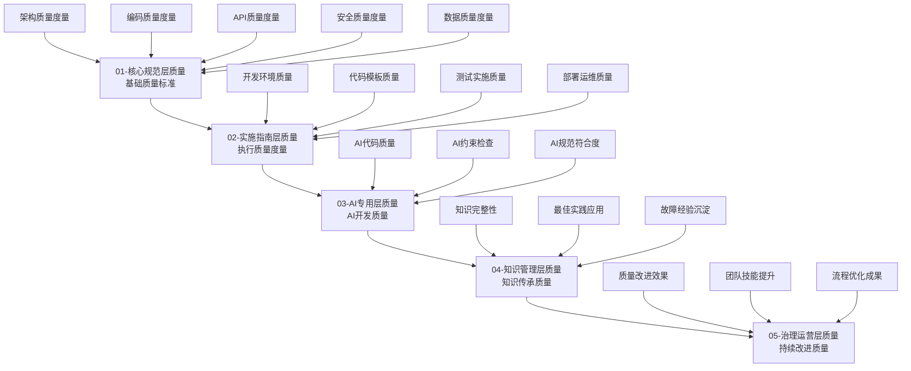

# 质量度量专家技能（SmartAdmin v4）

> **技能版本**: v1.0.0
> **技能等级**: ★★★ 专家级
> **适用角色**: 质量保证工程师、技术负责人、项目经理
> **核心专长**: 基于SmartAdmin v4规范体系的质量度量、监控和改进，特别针对大规模质量危机（如399编译错误）的量化管理和快速改进

## 🎯 技能概述

**核心价值**: 建立基于SmartAdmin v4五层规范的质量度量体系，通过数据驱动的质量管理和持续改进，确保项目质量可控、可预测、可优化。

**适用场景**:
- 📊 项目质量危机量化管理（399编译错误的系统性度量）
- 📈 质量趋势分析和预测
- 🎯 质量门禁设计和执行
- 🔄 持续质量改进优化
- 📋 质量报告和决策支持

## 📊 SmartAdmin v4质量度量框架

### 🏗️ 五层质量度量模型



## 🚨 质量危机度量专项能力

### 阶段一：质量危机量化评估（立即执行）

#### 1.1 编译错误量化分析
```yaml
compilation_error_metrics:
  title: "399编译错误系统性量化分析"
  description: "建立完整的编译错误分类、度量和跟踪体系"

  error_classification_system:
    by_severity:
      blocker: "无法编译，项目完全阻塞"
      critical: "核心功能受影响"
      major: "非核心功能受影响"
      minor: "轻微问题，可延后处理"

    by_category:
      architecture_errors: "架构设计问题"
      code_structure_errors: "代码结构问题"
      dependency_errors: "依赖关系问题"
      type_system_errors: "类型系统问题"
      api_design_errors: "API设计问题"

    by_layer:
      controller_layer: "Controller层错误"
      service_layer: "Service层错误"
      manager_layer: "Manager层错误"
      repository_layer: "Repository层错误"
      entity_layer: "Entity层错误"

  quantitative_metrics:
    total_errors: 399
    error_density: "错误数/千行代码"
    error_rate: "错误数/文件数"
    severity_distribution: "各严重程度错误的分布"
    category_distribution: "各类型错误的分布"
    layer_impact: "各层次影响的错误数"
```

#### 1.2 质量影响评估
```yaml
quality_impact_assessment:
  title: "质量危机影响量化评估"
  description: "评估399编译错误对项目的具体影响"

  impact_dimensions:
    technical_impact:
      build_failure_rate: "100% - 完全无法构建"
      code_coverage: "0% - 无法执行测试"
      deploy_readiness: "0% - 无法部署"
      performance_impact: "无法测量"

    business_impact:
      feature_delivery_delay: "完全阻塞新功能交付"
      maintenance_cost_increase: "预估增加300%"
      team_productivity_loss: "预估下降80%"
      customer_impact: "无法提供功能更新"

    team_impact:
      developer_productivity: "下降80%"
      code_review_efficiency: "下降90%"
      testing_efficiency: "下降100%"
      deployment_confidence: "完全丧失"
```

### 阶段二：质量改进跟踪（实时监控）

#### 2.1 质量改进度量模型
```yaml
quality_improvement_metrics:
  title: "质量改进实时跟踪系统"
  description: "建立从399到0的质量改进过程量化模型"

  improvement_tracking:
    baseline_metrics:
      compilation_errors: 399
      build_success_rate: 0%
      test_coverage: 0%
      quality_score: 20

    improvement_targets:
      phase_1_target:
        compilation_errors: "< 120"
        build_success_rate: "> 80%"
        quality_score: "> 60"
        timeline: "6小时内"

      phase_2_target:
        compilation_errors: "< 20"
        build_success_rate: "> 95%"
        test_coverage: "> 70%"
        quality_score: "> 80"
        timeline: "12小时内"

      final_target:
        compilation_errors: 0
        build_success_rate: 100%
        test_coverage: "> 85%"
        quality_score: "> 90
        timeline: "24小时内"

    real_time_monitoring:
      metrics_collection_frequency: "每15分钟"
      automated_analysis: "实时异常检测"
      trend_prediction: "基于历史数据预测"
      alert_thresholds: "自动预警机制"
```

#### 2.2 质量趋势分析
```yaml
quality_trend_analysis:
  title: "质量趋势分析和预测"
  description: "基于历史数据的质量改进趋势分析"

  trend_analysis_framework:
    time_series_analysis:
      error_reduction_rate: "错误减少速率"
      improvement_acceleration: "改进加速度"
      quality_convergence: "质量收敛趋势"
      risk_prediction: "风险预测模型"

    pattern_recognition:
      error_pattern_analysis: "错误模式识别"
      solution_effectiveness: "解决方案效果分析"
      team_performance_trend: "团队表现趋势"
      bottleneck_identification: "瓶颈识别"

    prediction_modeling:
      completion_time_prediction: "完成时间预测"
      quality_score_projection: "质量分数预测"
      resource_optimization: "资源优化建议"
      risk_assessment: "风险评估更新"
```

## 🛠️ 质量度量核心工具

### 工具1：SmartAdmin v4质量度量仪表板
```yaml
quality_dashboard:
  description: "基于SmartAdmin v4规范的质量度量实时仪表板"

  dashboard_sections:
    overview_section:
      total_errors: "当前错误总数"
      error_reduction_rate: "错误减少率"
      quality_score: "综合质量分数"
      improvement_progress: "改进进度百分比"

    detailed_metrics_section:
      errors_by_category: "分类错误统计图表"
      errors_by_severity: "严重程度分布图"
      errors_by_layer: "分层错误分析"
      fix_progress_timeline: "修复进度时间线"

    trend_analysis_section:
      error_reduction_trend: "错误减少趋势图"
      quality_improvement_curve: "质量改进曲线"
      team_productivity_chart: "团队生产力图表"
      resource_utilization: "资源利用率图表"

    alert_and_action_section:
      critical_alerts: "关键预警信息"
      recommended_actions: "推荐行动建议"
      resource_allocation: "资源分配建议"
      risk_indicators: "风险指标监控"
```

### 工具2：自动化质量检查器
```yaml
automated_quality_checker:
  description: "基于SmartAdmin v4规范的自动化质量检查系统"

  check_categories:
    architecture_quality:
      four_tier_architecture_compliance:
        - "Controller-Service-Manager-Repository依赖检查"
        - "跨层访问检测"
        - "分层职责验证"
        - "事务边界检查"

      dependency_injection_compliance:
        - "@Resource使用规范检查"
        - "@Autowired违规检测"
        - "循环依赖检测"

    code_quality:
      naming_conventions:
        - "类名规范检查"
        - "方法名规范检查"
        - "字段名规范检查"
        - "包名规范检查"

      code_standards:
        - "方法长度检查"
        - "圈复杂度检查"
        - "代码重复检查"
        - "注释完整性检查"

    api_quality:
      design_compliance:
        - "API路径规范检查"
        - "HTTP方法使用检查"
        - "响应格式验证"
        - "权限控制检查"

    security_quality:
      security_compliance:
        - "输入验证检查"
        - "密码安全检查"
        - "SQL注入防护检查"
        - "敏感信息处理检查"
```

## 📈 质量报告和决策支持

### 质量报告体系
```yaml
quality_reporting_system:
  report_types:
    real_time_dashboard:
      audience: "开发团队、技术负责人"
      frequency: "实时更新"
      content: "当前质量状态、关键指标、预警信息"

    daily_quality_report:
      audience: "项目经理、团队负责人"
      frequency: "每日生成"
      content: "质量进展、趋势分析、问题总结、改进建议"

    weekly_quality_analysis:
      audience: "管理层、质量团队"
      frequency: "每周汇总"
      content: "质量趋势、效率分析、风险评估、改进计划"

    quality_improvement_report:
      audience: "全体项目干系人"
      frequency: "项目里程碑完成时"
      content: "改进成果、经验总结、最佳实践、后续计划"

  report_content_structure:
    executive_summary:
      - "质量状况总体评估"
      - "关键问题和风险"
      - "改进建议和行动计划"

    detailed_analysis:
      - "各维度质量指标分析"
      - "趋势变化和模式识别"
      - "问题根因分析"
      - "改进效果评估"

    action_recommendations:
      - "优先级排序的行动建议"
      - "资源分配建议"
      - "时间规划建议"
      - "风险应对策略"
```

### 决策支持框架
```yaml
decision_support_framework:
  decision_types:
    go_no_go_decisions:
      criteria: "基于质量分数和风险评估"
      process: "质量门禁检查 + 专家评估"
      output: "明确的Go/No-Go建议"

    resource_allocation:
      criteria: "基于质量改进ROI分析"
      process: "问题严重性 + 修复成本 + 影响范围"
      output: "最优资源配置方案"

    timeline_adjustment:
      criteria: "基于改进趋势和预测模型"
      process: "历史数据分析 + 团队能力评估"
      output: "合理的时间调整建议"

    risk_management:
      criteria: "基于质量风险矩阵"
      process: "风险识别 + 影响评估 + 概率分析"
      output: "风险应对策略和预案"
```

## 🎯 质量改进策略

### 基于数据的改进策略
```yaml
data_driven_improvement:
  improvement_methodology:
    measure_analyze_improve_control:
      measure:
        - "建立质量度量体系"
        - "收集基线质量数据"
        - "设定改进目标"
        - "配置自动化监控"

      analyze:
        - "质量问题根因分析"
        - "影响范围和优先级评估"
        - "改进方案设计"
        - "风险评估和预案"

      improve:
        - "实施质量改进措施"
        - "监控改进过程"
        - "验证改进效果"
        - "调整改进策略"

      control:
        - "建立质量标准"
        - "实施质量控制"
        - "持续监控质量"
        - "预防问题复发"

  continuous_improvement:
    feedback_loops:
      - "质量度量反馈"
      - "团队经验反馈"
      - "用户反馈整合"
      - "最佳实践推广"

    learning_organization:
      - "质量知识库建设"
      - "经验案例分享"
      - "技能培训提升"
      - "创新文化建设"
```

## 🔗 与其他技能的协同

### 核心协同关系
```yaml
skill_collaboration:
  primary_collaborations:
    project_management_specialist:
      role: "提供质量度量和分析支持"
      interaction: "实时质量数据共享、质量建议提供"
      value: "支持基于数据的项目决策"

    ai_code_quality_guardian:
      role: "提供AI辅助的质量检查"
      interaction: "自动化质量检查、智能问题诊断"
      value: "提升质量检查效率和准确性"

    team_training_specialist:
      role: "提供团队能力评估"
      interaction: "技能缺口分析、培训效果评估"
      value: "支持针对性的团队培训"

  integration_patterns:
    real_time_data_sharing:
      - "质量度量数据实时同步"
      - "预警信息自动推送"
      - "改进建议实时生成"

    coordinated_action_planning:
      - "基于数据的联合决策"
      - "资源协同配置"
      - "效果联合评估"
```

## 📋 使用指南

### 立即应用场景：399编译错误质量管理
```markdown
1. 启动质量危机度量：
   - Skill("quality-metrics-specialist-smartadmin")
   - 立即建立399编译错误的量化分析体系

2. 实施质量监控：
   - 建立实时质量度量仪表板
   - 配置自动化质量检查
   - 设置质量预警机制

3. 支持决策制定：
   - 提供数据驱动的修复优先级建议
   - 生成质量改进趋势分析
   - 支持资源分配决策

4. 持续质量跟踪：
   - 监控质量改进进度
   - 评估改进措施效果
   - 预测完成时间和风险
```

### 常规质量管理场景
```markdown
1. 项目启动阶段：
   - 建立质量基线和目标
   - 配置质量度量体系
   - 设计质量门禁

2. 项目执行阶段：
   - 实时质量监控和预警
   - 质量趋势分析和预测
   - 持续质量改进

3. 项目交付阶段：
   - 质量评估和验收
   - 质量报告生成
   - 经验总结和沉淀
```

## 📈 成功标准

### 量化指标
- **质量改进效率**: 399编译错误24小时内减少到0
- **质量预测准确性**: 质量完成时间预测准确度≥90%
- **决策支持效果**: 基于数据的决策正确率≥95%
- **团队质量意识**: 团队质量意识评分提升200%

### 定性标准
- **数据驱动文化**: 建立了基于数据的质量管理文化
- **持续改进机制**: 形成了自动化的质量改进循环
- **质量可视性**: 质量状况完全透明和可预测
- **决策科学性**: 质量相关决策都有数据支撑

---

**🎯 核心价值**: 将SmartAdmin v4五层规范转化为可量化、可监控、可改进的质量管理体系，特别是在质量危机情况下能够提供数据驱动的决策支持和科学的质量改进路径。

**⚡ 立即应用**: 399编译错误的系统性质量度量、监控和改进管理，确保质量问题快速、科学、高效地解决。