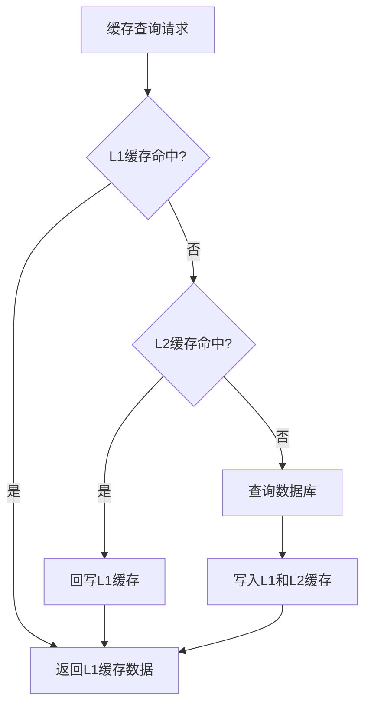

# 🏗️ 多级缓存架构设计与实现

> **版本**: v1.0.0
> **更新时间**: 2025-11-16
> **分类**: 技术开发技能
> **标签**: 缓存架构、性能优化、分布式系统
> **技能等级**: ★★☆ 中级
> **适用角色**: 后端开发工程师、架构师、性能优化工程师
> **预计学时**: 40-60小时

---

## 📚 知识要求

### 理论知识
- **缓存原理**: L1/L2缓存、缓存一致性、缓存穿透/击穿/雪崩
- **分布式理论**: CAP定理、最终一致性、分布式锁
- **性能优化**: 读写分离、热点数据、QPS提升策略
- **并发编程**: 多线程安全、锁机制、线程池

### 业务理解
- **高并发场景**: 电商秒杀、热点数据访问、API性能优化
- **缓存使用场景**: 查询优化、计算结果缓存、会话管理
- **系统瓶颈**: I/O瓶颈、CPU瓶颈、网络延迟分析

### 技术背景
- **Java基础**: 集合框架、并发包、JVM内存模型
- **Spring框架**: 依赖注入、AOP、事务管理
- **Redis**: 数据结构、持久化、集群模式
- **Caffeine**: 本地缓存框架、LRU算法、性能对比

---

## 🛠️ 核心技能实现

### 1. 多级缓存架构设计

#### 核心组件
```java
/**
 * 多级缓存管理器基类
 * - L1: Caffeine本地缓存 (1分钟过期, 10,000条上限)
 * - L2: Redis分布式缓存 (30分钟过期, 集群模式)
 * - 缓存策略: Cache Aside模式 + 双删策略
 */
@Slf4j
public abstract class BaseCacheManager {

    @Resource
    protected RedisTemplate<String, Object> redisTemplate;

    // L1本地缓存 - Caffeine
    private final Cache<String, Object> localCache = Caffeine.newBuilder()
            .maximumSize(10_000)
            .expireAfterWrite(5, TimeUnit.MINUTES)
            .recordStats()
            .build();

    // L2 Redis缓存过期时间
    protected static final long REDIS_EXPIRE_MINUTES = 30;

    // 双删策略延迟时间
    protected static final long DOUBLE_DELETE_DELAY_MS = 500;
}
```

#### 缓存读取流程


### 2. 缓存注解系统

#### @Cacheable 注解
```java
/**
 * 缓存注解 - 用于方法级别的缓存控制
 */
@Target(ElementType.METHOD)
@Retention(RetentionPolicy.RUNTIME)
public @interface Cacheable {
    String key() default "";          // 缓存键前缀
    int expire() default 30;          // 过期时间(分钟)
    boolean enabled() default true;   // 是否启用缓存
    String condition() default "";    // 条件表达式
    String unless() default "";       // 排除条件
}
```

#### @CacheEvict 注解
```java
/**
 * 缓存清除注解 - 用于缓存失效控制
 */
@Target(ElementType.METHOD)
@Retention(RetentionPolicy.RUNTIME)
public @interface CacheEvict {
    String key() default "";          // 缓存键前缀
    String pattern() default "";      // 模式匹配
    boolean allEntries() default false; // 是否全部清除
    boolean enabled() default true;   // 是否启用清除
}
```

### 3. 核心实现代码

#### 多级缓存查询
```java
/**
 * 多级缓存查询 - L1 -> L2 -> 数据库
 */
protected <T> T getCache(String cacheKey, DataLoader<T> dbLoader) {
    // 1. 先查L1本地缓存
    T data = (T) localCache.getIfPresent(cacheKey);
    if (data != null) {
        log.debug("L1缓存命中, cacheKey: {}", cacheKey);
        return data;
    }

    // 2. 查L2 Redis缓存
    try {
        T redisData = (T) redisTemplate.opsForValue().get(cacheKey);
        if (redisData != null) {
            // 回写L1缓存
            localCache.put(cacheKey, redisData);
            return redisData;
        }
    } catch (Exception e) {
        log.warn("Redis访问异常: {}", e.getMessage());
    }

    // 3. 查数据库并异步写入缓存
    if (dbLoader != null) {
        data = dbLoader.load();
        if (data != null) {
            setCacheAsync(cacheKey, data);
        }
    }

    return data;
}
```

#### 双删策略实现
```java
/**
 * 缓存清除 - 双删策略防止数据不一致
 */
@Async("cacheExecutor")
public void removeCache(String cacheKey) {
    try {
        // 第一次删除缓存
        localCache.invalidate(cacheKey);
        redisTemplate.delete(cacheKey);

        // 延迟500ms后再次删除(避免双写问题)
        Thread.sleep(DOUBLE_DELETE_DELAY_MS);

        localCache.invalidate(cacheKey);
        redisTemplate.delete(cacheKey);

    } catch (Exception e) {
        log.error("清除缓存失败: cacheKey: {}", cacheKey, e);
    }
}
```

### 4. 业务层集成示例

#### 智能门禁服务缓存集成
```java
@Service
@RequiredArgsConstructor
public class SmartAccessControlServiceImpl implements SmartAccessControlService {

    @Resource
    private SmartAccessPermissionDao accessPermissionDao;

    /**
     * 查询权限信息 - 添加缓存
     */
    @Cacheable(key = "access:perm:", expire = 15)
    public SmartAccessPermissionEntity getPermissionById(Long permissionId) {
        return accessPermissionDao.selectById(permissionId);
    }

    /**
     * 根据凭证查询权限 - 添加缓存
     */
    @Cacheable(key = "access:cred:", expire = 10)
    public SmartAccessPermissionEntity getPermissionByCredential(String accessType, String credential) {
        LocalDateTime currentTime = LocalDateTime.now();
        switch (accessType.toUpperCase()) {
            case "CARD":
                return accessPermissionDao.selectByCardNumber(credential, currentTime);
            case "FACE":
                return accessPermissionDao.selectByFaceFeatureId(credential, currentTime);
            case "FINGERPRINT":
                return accessPermissionDao.selectByFingerprintId(credential, currentTime);
            default:
                return null;
        }
    }

    /**
     * 更新权限 - 清除相关缓存
     */
    @CacheEvict(key = "access:perm:", pattern = "*")
    @Transactional(rollbackFor = Exception.class)
    public void updatePermission(SmartAccessPermissionEntity permission) {
        accessPermissionDao.updateById(permission);
        // 缓存会自动清除
    }
}
```

#### 员工服务缓存集成
```java
@Service
@Slf4j
public class EmployeeServiceImpl extends ServiceImpl<EmployeeDao, EmployeeEntity>
        implements EmployeeService {

    @Resource
    private EmployeeCacheManager employeeCacheManager;

    /**
     * 根据ID获取员工信息 - 使用缓存管理器
     */
    public EmployeeEntity getEmployeeById(Long employeeId) {
        return employeeCacheManager.getEmployee(employeeId);
    }

    /**
     * 添加员工 - 清除相关缓存
     */
    @CacheEvict(key = "employee:", pattern = "*")
    @Transactional(rollbackFor = Exception.class)
    public boolean addEmployee(EmployeeEntity employee) {
        boolean result = this.save(employee);
        if (result) {
            log.info("员工添加成功，清除缓存: employeeId={}", employee.getEmployeeId());
        }
        return result;
    }
}
```

### 5. 缓存性能监控

#### 缓存统计信息
```java
/**
 * 缓存性能统计
 */
public CacheStats getCacheStats() {
    var stats = localCache.stats();
    return CacheStats.builder()
            .hitCount(stats.hitCount())
            .missCount(stats.missCount())
            .hitRate(stats.hitRate())
            .evictionCount(stats.evictionCount())
            .estimatedSize(localCache.estimatedSize())
            .build();
}

/**
 * 缓存命中率监控
 */
@Scheduled(fixedRate = 60000) // 每分钟执行
public void monitorCacheHitRate() {
    CacheStats stats = getCacheStats();
    double hitRate = stats.getHitRate();

    log.info("缓存性能统计 - 命中率: {:.2f}%, 命中数: {}, 未命中数: {}, 大小: {}",
        hitRate * 100, stats.getHitCount(), stats.getMissCount(), stats.getEstimatedSize());

    // 命中率过低时告警
    if (hitRate < 0.8) {
        log.warn("缓存命中率过低: {:.2f}%, 请检查缓存配置", hitRate * 100);
    }
}
```

---

## ⚠️ 注意事项

### 安全提醒
- **敏感数据**: 用户密码、密钥等敏感信息不应缓存
- **缓存权限**: 实现基于用户的缓存隔离，防止数据泄露
- **缓存加密**: 对敏感缓存数据进行加密存储

### 质量要求
- **缓存一致性**: 确保缓存与数据库的数据一致性
- **性能监控**: 实时监控缓存命中率和响应时间
- **异常处理**: 缓存异常时不应影响主业务流程

### 最佳实践
- **合理过期**: 根据业务特点设置合理的缓存过期时间
- **容量控制**: 避免缓存无限增长导致内存溢出
- **分级缓存**: 根据数据访问频率设置不同的缓存策略

### 常见错误
- **缓存雪崩**: 大量缓存同时过期导致数据库压力
- **缓存穿透**: 查询不存在的数据导致缓存失效
- **缓存击穿**: 热点数据过期时大量并发直接访问数据库

---

## 📊 评估标准

### 操作时间
- **基础实现**: 8小时（包含L1+L2缓存搭建）
- **注解开发**: 4小时（缓存注解系统）
- **业务集成**: 6小时（服务层缓存集成）
- **监控完善**: 2小时（性能监控和统计）

### 准确率
- **缓存命中率**: ≥90%（正常业务场景）
- **响应时间**: 缓存命中时≤10ms，未命中时≤100ms
- **数据一致性**: 100%（无数据不一致问题）

### 质量标准
- **代码质量**: 遵循四层架构规范，无并发安全问题
- **性能提升**: 相比无缓存场景，QPS提升≥300%
- **可维护性**: 缓存配置可动态调整，支持多种缓存策略

---

## 🔗 相关技能

### 相关技能
- **spring-boot-development**: Spring Boot企业级开发技能
- **database-design-specialist**: 数据库设计和优化技能
- **code-quality-protector**: 代码质量守护技能

### 进阶路径
- **分布式缓存**: Redis集群、Codis、Memcached
- **缓存一致性**: 最终一致性、强一致性方案
- **性能优化**: JVM调优、数据库优化、网络优化

### 参考资料
- **Caffeine官方文档**: https://github.com/ben-manes/caffeine
- **Redis官方文档**: https://redis.io/documentation
- **Spring Cache文档**: https://spring.io/projects/spring-framework