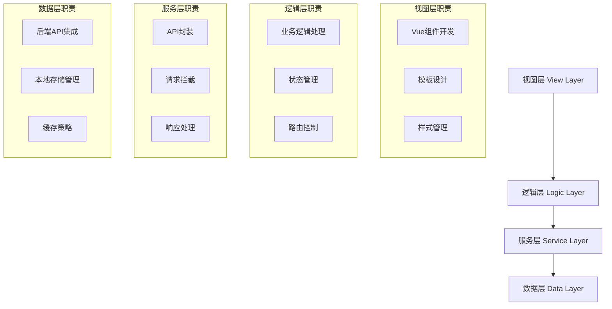

# Vue3企业级前端架构专家技能

**技能名称**: Vue3 Enterprise Frontend Architecture Expert
**技能等级**: ★★★ 高级
**适用角色**: 前端架构师、高级前端工程师、技术负责人
**前置技能**: Vue3基础、JavaScript ES6+、前端工程化
**预计学时**: 40-60小时

---

## 📋 技能概述

Vue3企业级前端架构专家技能专注于现代化大型企业级应用的架构设计和最佳实践，基于SmartAdmin v3项目的丰富经验，提供了从项目架构到性能优化的全方位解决方案。

**核心价值**：
- 🏗️ **企业级架构设计**：掌握大型前端系统的架构设计能力
- 🚀 **性能优化专家**：具备全方位的性能优化和问题解决能力
- 🛡️ **工程化实践**：熟练运用现代化前端工程化工具和流程
- 🔧 **技术领导力**：能够指导团队并进行技术决策

---

## 🎯 核心能力矩阵

### 🏗️ 前端架构设计能力 (★★★)

#### 四层架构设计


**架构设计原则**：
- **关注点分离**：每层专注特定职责，降低耦合度
- **依赖倒置**：高层模块不依赖低层模块，都依赖抽象
- **单一职责**：每个模块只负责一个功能领域
- **开闭原则**：对扩展开放，对修改封闭

#### 项目结构设计
```
smart-admin-web-javascript/
├── src/
│   ├── api/                    # API接口层
│   │   ├── system/            # 系统模块API
│   │   ├── business/          # 业务模块API
│   │   └── support/           # 支撑模块API
│   ├── components/            # 组件库
│   │   ├── business/          # 业务组件
│   │   ├── framework/         # 框架组件
│   │   ├── support/           # 支撑组件
│   │   └── system/            # 系统组件
│   ├── views/                 # 页面视图
│   ├── router/                # 路由配置
│   ├── store/                 # 状态管理
│   ├── layout/                # 布局系统
│   ├── utils/                 # 工具函数
│   ├── constants/             # 常量定义
│   └── assets/                # 静态资源
```

### 🧩 组件化架构能力 (★★★)

#### 四层组件分类体系

1. **业务组件 (Business Components)**
   - 专注特定业务领域
   - 封装复杂业务逻辑
   - 提供业务相关配置选项

2. **框架组件 (Framework Components)**
   - 提供基础UI交互功能
   - 高通用性和复用价值
   - 支持多种配置选项

3. **支撑组件 (Support Components)**
   - 提供系统级功能支持
   - 与状态管理深度集成
   - 跨业务通用功能

4. **系统组件 (System Components)**
   - 系统级别功能实现
   - 全局影响和安全性要求
   - 基础设施组件

#### 组件设计模式

**高阶组件设计**：
```javascript
// 表格操作组件示例
const TableOperator = {
  name: 'TableOperator',
  props: {
    modelValue: Array,
    refresh: Function,
    tableId: { type: Number, required: true },
    fullScreenFlag: Boolean
  },
  methods: {
    async buildUserTableColumns() {
      // 动态列配置逻辑
    },
    onFullScreen() {
      // 全屏切换逻辑
    },
    showModal() {
      // 显示列设置模态框
    }
  }
}
```

**复合组件模式**：
```javascript
// 文件上传复合组件
const FileUpload = {
  components: {
    SmartLoading,
    FilePreview,
    UploadProgress
  },
  provide() {
    return {
      uploadContext: {
        maxSize: this.maxSize,
        acceptTypes: this.accept
      }
    }
  }
}
```

### 🔄 状态管理架构能力 (★★★)

#### Pinia模块化设计

**系统模块状态管理**：
```javascript
// 用户状态管理示例
export const useUserStore = defineStore('user', {
  state: () => ({
    token: '',
    employeeId: '',
    menuTree: [],
    tagNav: [],
    keepAliveIncludes: []
  }),
  getters: {
    getToken: (state) => state.token,
    getMenuRouterList: (state) => state.menuRouterList,
    isLoggedIn: (state) => !!state.token
  },
  actions: {
    async setUserLoginInfo(data) {
      this.employeeId = data.employeeId;
      this.actualName = data.actualName;
      // 持久化到localStorage
      localSave(USER_TOKEN, data.token);
    },
    logout() {
      // 清理状态和持久化数据
      this.$reset();
      localRemove(USER_TOKEN);
    }
  },
  persist: {
    enabled: true,
    strategies: [
      { storage: localStorage, paths: ['token', 'employeeId'] }
    ]
  }
});
```

**业务模块状态管理**：
```javascript
// 设备状态管理示例
export const useDeviceStore = defineStore('device', {
  state: () => ({
    deviceList: [],
    groupTreeData: [],
    loading: false,
    currentDevice: null
  }),
  getters: {
    onlineDeviceCount: (state) =>
      state.deviceList.filter(device => device.onlineStatus).length,
    deviceTypeStats: (state) => {
      const stats = {};
      state.deviceList.forEach(device => {
        stats[device.deviceType] = (stats[device.deviceType] || 0) + 1;
      });
      return stats;
    }
  },
  actions: {
    async fetchDeviceList(params, useMock = false) {
      this.loading = true;
      try {
        const response = await deviceApi.queryDevice(params, useMock);
        this.deviceList = response.data;
        return response;
      } finally {
        this.loading = false;
      }
    }
  }
});
```

#### 状态管理最佳实践

1. **模块拆分原则**：按业务领域而非技术拆分
2. **状态规范化**：使用扁平化状态结构
3. **异步处理**：在actions中处理所有异步操作
4. **类型安全**：使用TypeScript增强类型检查
5. **性能优化**：合理使用getter和计算属性缓存

### 🛣️ 路由系统架构能力 (★★★)

#### 动态路由系统

**路由生成流程**：
```javascript
// 动态路由构建函数
export function buildRoutes(menuList) {
  const routes = [];

  menuList.forEach(menu => {
    if (!menu.visibleFlag) return;

    const route = {
      path: menu.menuPath,
      name: menu.menuName,
      meta: {
        id: menu.menuId,
        title: menu.menuName,
        icon: menu.menuIcon,
        hideInMenu: !menu.visibleFlag,
        keepAlive: menu.keepAlive,
        frameFlag: menu.frameFlag,
        frameUrl: menu.frameUrl
      }
    };

    if (menu.frameFlag) {
      // 外链路由处理
      route.component = IFrameLayout;
    } else {
      // 动态组件加载
      route.component = () => import(
        `@/views${menu.menuPath.replace('/business', '/business')}/index.vue`
      );
    }

    routes.push(route);
  });

  return routes;
}
```

**路由守卫机制**：
```javascript
// 全局前置守卫
router.beforeEach(async (to, from, next) => {
  NProgress.start();

  // 公共页面直接放行
  if (PUBLIC_PAGE.includes(to.path)) {
    next();
    return;
  }

  // 登录状态检查
  const token = userStore.getToken;
  if (!token) {
    userStore.logout();
    next('/login');
    return;
  }

  // 首页特殊处理
  if (to.path === '/home') {
    next();
    return;
  }

  // 动态路由构建
  if (!userStore.getMenuRouterInitFlag) {
    await userStore.queryUserMenuTree();
    const dynamicRoutes = buildRoutes(userStore.getMenuTree);
    dynamicRoutes.forEach(route => {
      router.addRoute(route);
    });
    next({ ...to, replace: true });
    return;
  }

  // 缓存管理
  if (to.meta?.keepAlive) {
    userStore.pushKeepAliveIncludes(to.meta.componentName);
  }

  next();
});

router.afterEach((to, from) => {
  NProgress.done();
  userStore.setTagNav(to, from);
});
```

#### 路由性能优化

1. **组件懒加载**：使用动态import实现代码分割
2. **预加载策略**：关键组件提前加载
3. **缓存机制**：合理配置keep-alive
4. **路由匹配优化**：避免复杂的路由匹配规则

### 🌐 API集成架构能力 (★★★)

#### Axios封装架构

**统一请求实例**：
```javascript
// Axios实例配置
const instance = axios.create({
  baseURL: import.meta.env.VITE_APP_API_BASE_URL,
  timeout: 30000,
  headers: {
    'Content-Type': 'application/json;charset=UTF-8'
  }
});

// 请求拦截器
instance.interceptors.request.use(
  (config) => {
    // 添加认证Token
    const token = userStore.getToken;
    if (token) {
      config.headers[TOKEN_HEADER] = token;
    }

    // 加密处理
    if (config.encrypt) {
      config.data = encryptData(config.data);
    }

    return config;
  },
  (error) => Promise.reject(error)
);

// 响应拦截器
instance.interceptors.response.use(
  (response) => {
    // 解密处理
    if (response.data.encrypted) {
      response.data = decryptData(response.data);
    }

    // 业务状态码处理
    const { code, message, data } = response.data;
    if (code !== 200) {
      handleBusinessError(code, message);
      return Promise.reject(new Error(message));
    }

    return data;
  },
  (error) => {
    handleNetworkError(error);
    return Promise.reject(error);
  }
);
```

#### API模块化组织

**按业务领域划分**：
```javascript
// 员工管理API
export const employeeApi = {
  queryAll: () => request.get('/employee/queryAll'),
  queryEmployee: (params) => request.post('/employee/query', params),
  addEmployee: (params) => request.post('/employee/add', params),
  updateEmployee: (params) => request.post('/employee/update', params),
  deleteEmployee: (id) => request.post('/employee/delete', { id }),
  batchDelete: (ids) => request.post('/employee/batchDelete', { ids })
};

// 消费管理API
export const consumptionApi = {
  getStatistics: (params) => request.post('/consumption/statistics', params),
  getRegionList: (params) => request.post('/consumption/region/list', params),
  exportData: (params) => request.download('/consumption/export', params)
};
```

#### 错误处理机制

**统一错误处理**：
```javascript
// 错误码映射
const ERROR_CODE_MAP = {
  30007: { type: 'auth', action: 'logout', message: '登录已过期，请重新登录' },
  30008: { type: 'auth', action: 'logout', message: '账号在其他地方登录' },
  30010: { type: 'security', action: 'modal', message: '检测到安全风险' },
  30012: { type: 'session', action: 'forceLogout', message: '会话已超时' }
};

// 业务错误处理
function handleBusinessError(code, message) {
  const errorInfo = ERROR_CODE_MAP[code];
  if (!errorInfo) {
    message.error(message || '操作失败');
    return;
  }

  switch (errorInfo.action) {
    case 'logout':
      Modal.warning({
        title: '系统提示',
        content: errorInfo.message,
        onOk: () => userStore.logout()
      });
      break;
    case 'modal':
      Modal.warning({
        title: '安全提醒',
        content: errorInfo.message
      });
      break;
    case 'forceLogout':
      Modal.confirm({
        title: '会话超时',
        content: errorInfo.message,
        onOk: () => userStore.logout()
      });
      break;
  }
}
```

### 🎨 UI组件架构能力 (★★☆)

#### Ant Design Vue集成

**主题定制系统**：
```javascript
// 主题配置
const themeConfig = {
  token: {
    colorPrimary: '#1890ff',
    colorSuccess: '#52c41a',
    colorWarning: '#faad14',
    colorError: '#f5222d',
    borderRadius: 6,
    wireframe: false
  },
  components: {
    Button: {
      borderRadius: 4
    },
    Input: {
      borderRadius: 4
    },
    Table: {
      headerBg: '#fafafa'
    }
  }
};

// 动态主题切换
export function updateTheme(theme) {
  ConfigProvider.config({
    theme: {
      ...themeConfig,
      ...theme
    }
  });
}
```

**响应式布局系统**：
```javascript
// 布局适配
const layoutAdaptive = {
  mixins: [deviceMixin],
  computed: {
    isMobile() {
      return this.isMobileDevice;
    },
    layoutMode() {
      return this.isMobile ? 'top' : 'side';
    },
    siderCollapsed() {
      return this.isMobile || this.collapsed;
    }
  },
  methods: {
    handleBreakpoint(breakpoint) {
      this.breakpoint = breakpoint;
      if (breakpoint === 'xs' || breakpoint === 'sm') {
        this.collapsed = true;
      }
    }
  }
};
```

### 🚀 性能优化能力 (★★☆)

#### 代码分割与懒加载

**路由级别代码分割**：
```javascript
// 路由懒加载配置
const routes = [
  {
    path: '/business/consumption',
    component: () => import(
      /* webpackChunkName: "consumption" */
      '@/views/business/consumption/dashboard/index.vue'
    ),
    meta: { keepAlive: true }
  },
  {
    path: '/business/smart-video',
    component: () => import(
      /* webpackChunkName: "smart-video" */
      '@/views/business/smart-video/system-overview/index.vue'
    ),
    meta: { keepAlive: true }
  }
];
```

**组件级别懒加载**：
```javascript
// 异步组件包装
const AsyncComponent = defineAsyncComponent({
  loader: () => import('./HeavyComponent.vue'),
  loadingComponent: LoadingComponent,
  errorComponent: ErrorComponent,
  delay: 200,
  timeout: 10000
});
```

#### 缓存策略优化

**多级缓存机制**：
```javascript
// 缓存策略配置
const cacheStrategy = {
  // 内存缓存
  memory: {
    maxSize: 50, // 最大缓存条目
    ttl: 5 * 60 * 1000 // 5分钟过期
  },
  // localStorage缓存
  storage: {
    maxSize: 10 * 1024 * 1024, // 10MB
    ttl: 24 * 60 * 60 * 1000 // 24小时过期
  },
  // Service Worker缓存
  sw: {
    strategy: 'networkFirst',
    cacheable: ['/api/dict', '/api/config']
  }
};
```

#### 性能监控与分析

**性能指标收集**：
```javascript
// 性能监控
class PerformanceMonitor {
  constructor() {
    this.metrics = {
      fcp: 0, // First Contentful Paint
      lcp: 0, // Largest Contentful Paint
      fid: 0, // First Input Delay
      cls: 0  // Cumulative Layout Shift
    };
  }

  init() {
    // FCP监控
    new PerformanceObserver((list) => {
      const entries = list.getEntries();
      this.metrics.fcp = entries[0].startTime;
    }).observe({ entryTypes: ['paint'] });

    // LCP监控
    new PerformanceObserver((list) => {
      const entries = list.getEntries();
      this.metrics.lcp = entries[entries.length - 1].startTime;
    }).observe({ entryTypes: ['largest-contentful-paint'] });
  }

  getReport() {
    return {
      ...this.metrics,
      memoryUsage: performance.memory?.usedJSHeapSize || 0,
      resourceTiming: this.getResourceTiming()
    };
  }
}
```

---

## 🛠️ 技术工具链

### 构建工具
- **Vite 5.x**: 现代化构建工具，提供快速的开发体验
- **Vue 3.4+**: 渐进式JavaScript框架
- **TypeScript 5.0+**: 类型安全的JavaScript超集

### 状态管理
- **Pinia 2.x**: Vue 3官方推荐的状态管理库
- **VueUse**: Vue组合式工具集

### UI框架
- **Ant Design Vue 4.x**: 企业级UI设计语言
- **Less**: CSS预处理器
- **PostCSS**: CSS后处理器

### 开发工具
- **ESLint**: 代码质量检查
- **Prettier**: 代码格式化
- **Husky**: Git钩子管理
- **Lint-staged**: 暂存文件检查

---

## 📊 能力评估标准

### 初级 (★☆☆)
- [ ] 能够使用Vue 3开发基础组件
- [ ] 理解组件通信的基本方式
- [ ] 掌握Vue Router的基础用法
- [ ] 能够进行简单的状态管理

### 中级 (★★☆)
- [ ] 能够设计复杂的组件架构
- [ ] 熟练使用Pinia进行状态管理
- [ ] 掌握动态路由和路由守卫
- [ ] 能够进行基本的性能优化

### 高级 (★★★)
- [ ] 能够设计大型前端系统架构
- [ ] 具备性能监控和深度优化能力
- [ ] 能够制定前端工程化规范
- [ ] 具备技术选型和架构决策能力
- [ ] 能够指导团队并进行代码review

---

## 🎓 学习路径

### 第一阶段：基础强化 (2-3周)
1. **Vue 3深入理解**
   - Composition API核心原理
   - 响应式系统深度解析
   - 组件生命周期优化

2. **TypeScript进阶**
   - 高级类型系统
   - 泛型编程
   - 装饰器使用

### 第二阶段：架构实践 (3-4周)
1. **组件架构设计**
   - 设计模式应用
   - 组件库开发
   - 复合组件设计

2. **状态管理精通**
   - Pinia源码解析
   - 复杂状态场景处理
   - 状态持久化方案

### 第三阶段：性能优化 (2-3周)
1. **构建优化**
   - Webpack/Vite配置优化
   - 代码分割策略
   - Tree Shaking实践

2. **运行时优化**
   - 虚拟列表实现
   - 图片懒加载
   - 缓存策略设计

### 第四阶段：工程化建设 (2-3周)
1. **开发规范制定**
   - ESLint规则配置
   - Git提交规范
   - 代码review流程

2. **CI/CD集成**
   - 自动化测试
   - 部署流程优化
   - 监控告警系统

---

## 🔧 实战项目

### 项目一：企业级组件库开发
**目标**: 开发一套完整的企业级Vue3组件库

**要求**:
- 包含20+个高质量组件
- 完整的TypeScript类型定义
- 单元测试覆盖率≥90%
- 详细的文档和示例

### 项目二：性能监控系统
**目标**: 构建前端性能监控和分析系统

**要求**:
- 实时性能指标收集
- 可视化性能报表
- 异常监控和告警
- 用户行为分析

### 项目三：微前端架构实践
**目标**: 基于qiankun实现微前端架构

**要求**:
- 主应用和子应用设计
- 应用间通信机制
- 样式隔离方案
- 公共依赖管理

---

## 📈 进阶方向

### 技术深度
1. **Vue源码研究**: 深入理解Vue 3响应式原理
2. **编译工具开发**: 自定义构建工具和插件
3. **性能极限优化**: 毫秒级性能优化实践

### 架构广度
1. **微服务架构**: BFF(Backend for Frontend)设计
2. **跨端开发**: 小程序、Electron应用开发
3. **Serverless**: 无服务器前端架构

### 工程化
1. **低代码平台**: 可视化开发平台构建
2. **组件库生态**: 开源组件库维护
3. **开发工具链**: IDE插件和开发工具开发

---

## 💼 职业发展

### 技术路线
- **前端架构师** → **技术总监** → **CTO**
- **前端专家** → **技术专家** → **首席技术专家**

### 管理路线
- **技术组长** → **前端经理** → **技术总监**
- **项目经理** → **技术产品经理** → **技术总监**

### 专业领域
- **前端性能专家**: 专注于性能优化和用户体验
- **前端工程化专家**: 专注于工具链和工程效率
- **跨端开发专家**: 专注于多平台应用开发

---

## 📚 参考资源

### 官方文档
- [Vue 3官方文档](https://vuejs.org/)
- [Pinia官方文档](https://pinia.vuejs.org/)
- [Ant Design Vue文档](https://www.antdv.com/)
- [Vite官方文档](https://vitejs.dev/)

### 技术博客
- Vue.js官方博客
- Ant Design团队博客
- 前端工程技术专栏

### 开源项目
- [Vue 3核心项目](https://github.com/vuejs/core)
- [SmartAdmin项目](https://github.com/1024-lab/smart-admin)
- [Ant Design Vue](https://github.com/vueComponent/ant-design-vue)

---

**技能掌握认证**: 完成所有实战项目并通过代码review
**持续更新**: 每季度更新内容以跟进技术发展
**社区支持**: 提供技术答疑和项目指导服务