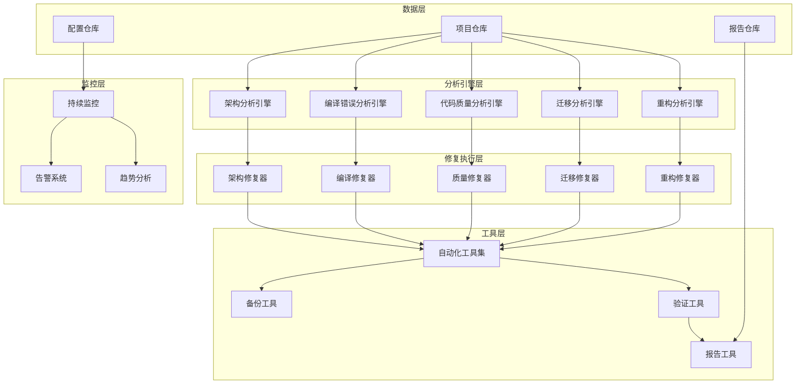

# IOE-DREAM 全局代码深度分析与修复设计文档

## 概述

本设计文档描述了IOE-DREAM项目全局代码深度分析与修复系统的架构设计。该系统旨在系统性地诊断和修复项目中的各类代码异常问题，包括架构违规、编译错误、代码质量问题、技术迁移问题和模块拆分问题。

## 架构设计

### 系统架构图



### 核心组件设计

#### 1. 架构分析引擎 (ArchitectureAnalysisEngine)

负责分析项目的架构问题，包括依赖关系、循环依赖、四层架构合规性等。

```python
class ArchitectureAnalysisEngine:
    def __init__(self, project_path: str):
        self.project_path = project_path
        self.dependency_analyzer = DependencyAnalyzer()
        self.layer_analyzer = LayerAnalyzer()
        self.compliance_checker = ComplianceChecker()
    
    def analyze_dependencies(self) -> DependencyGraph:
        """分析模块间依赖关系"""
        pass
    
    def detect_cycles(self, graph: DependencyGraph) -> List[CyclePath]:
        """检测循环依赖"""
        pass
    
    def check_layer_compliance(self) -> List[LayerViolation]:
        """检查四层架构合规性"""
        pass
    
    def calculate_health_score(self) -> ArchitectureHealthScore:
        """计算架构健康度评分"""
        pass
```

#### 2. 编译错误分析引擎 (CompilationErrorAnalysisEngine)

负责分析和分类编译错误，区分真实编译错误和IDE诊断错误。

```python
class CompilationErrorAnalysisEngine:
    def __init__(self):
        self.error_classifier = ErrorClassifier()
        self.encoding_detector = EncodingDetector()
        self.package_analyzer = PackageAnalyzer()
    
    def classify_errors(self, error_log: str) -> ErrorClassification:
        """分类编译错误"""
        pass
    
    def detect_encoding_issues(self, file_path: str) -> EncodingIssue:
        """检测字符编码问题"""
        pass
    
    def analyze_package_imports(self) -> List[PackageIssue]:
        """分析包导入问题"""
        pass
    
    def prioritize_errors(self, errors: List[CompilationError]) -> List[PrioritizedError]:
        """按优先级分类错误"""
        pass
```

#### 3. 代码质量分析引擎 (CodeQualityAnalysisEngine)

负责检测代码质量问题，包括注解使用、编码规范等。

```python
class CodeQualityAnalysisEngine:
    def __init__(self):
        self.annotation_checker = AnnotationChecker()
        self.lombok_checker = LombokChecker()
        self.style_checker = StyleChecker()
    
    def check_annotation_violations(self) -> List[AnnotationViolation]:
        """检查注解违规使用"""
        pass
    
    def verify_lombok_configuration(self) -> LombokConfigStatus:
        """验证Lombok配置"""
        pass
    
    def assess_code_quality(self) -> QualityReport:
        """评估代码质量"""
        pass
```

#### 4. 迁移分析引擎 (MigrationAnalysisEngine)

负责分析技术迁移问题，特别是Jakarta EE迁移。

```python
class MigrationAnalysisEngine:
    def __init__(self):
        self.package_scanner = PackageScanner()
        self.dependency_checker = DependencyChecker()
        self.compatibility_checker = CompatibilityChecker()
    
    def scan_javax_usage(self) -> List[JavaxUsage]:
        """扫描javax包名使用"""
        pass
    
    def check_dependency_compatibility(self) -> CompatibilityReport:
        """检查依赖兼容性"""
        pass
    
    def verify_migration_completeness(self) -> MigrationStatus:
        """验证迁移完整性"""
        pass
```

#### 5. 重构分析引擎 (RefactoringAnalysisEngine)

负责分析模块拆分和重构问题。

```python
class RefactoringAnalysisEngine:
    def __init__(self):
        self.module_analyzer = ModuleAnalyzer()
        self.responsibility_analyzer = ResponsibilityAnalyzer()
        self.refactoring_planner = RefactoringPlanner()
    
    def analyze_module_boundaries(self) -> ModuleBoundaryAnalysis:
        """分析模块边界"""
        pass
    
    def detect_responsibility_overlap(self) -> List[ResponsibilityOverlap]:
        """检测职责重叠"""
        pass
    
    def plan_refactoring(self) -> RefactoringPlan:
        """制定重构计划"""
        pass
```

## 组件和接口设计

### 核心接口定义

#### IAnalysisEngine 接口

```python
from abc import ABC, abstractmethod
from typing import Any, Dict, List

class IAnalysisEngine(ABC):
    @abstractmethod
    def analyze(self, context: AnalysisContext) -> AnalysisResult:
        """执行分析"""
        pass
    
    @abstractmethod
    def get_analysis_type(self) -> str:
        """获取分析类型"""
        pass
    
    @abstractmethod
    def validate_context(self, context: AnalysisContext) -> bool:
        """验证分析上下文"""
        pass
```

#### IFixEngine 接口

```python
class IFixEngine(ABC):
    @abstractmethod
    def fix(self, issues: List[Issue]) -> FixResult:
        """执行修复"""
        pass
    
    @abstractmethod
    def can_fix(self, issue: Issue) -> bool:
        """判断是否可以修复"""
        pass
    
    @abstractmethod
    def create_backup(self) -> BackupInfo:
        """创建备份"""
        pass
    
    @abstractmethod
    def rollback(self, backup_info: BackupInfo) -> bool:
        """回滚修复"""
        pass
```

### 数据模型设计

#### 分析结果模型

```python
@dataclass
class AnalysisResult:
    analysis_type: str
    timestamp: datetime
    issues: List[Issue]
    metrics: Dict[str, Any]
    recommendations: List[Recommendation]
    health_score: float

@dataclass
class Issue:
    id: str
    type: IssueType
    severity: Severity
    location: Location
    description: str
    fix_suggestion: Optional[str]
    
@dataclass
class Location:
    file_path: str
    line_number: int
    column_number: int
    
enum IssueType:
    ARCHITECTURE_VIOLATION
    COMPILATION_ERROR
    QUALITY_ISSUE
    MIGRATION_ISSUE
    REFACTORING_NEEDED

enum Severity:
    P0_CRITICAL
    P1_HIGH
    P2_MEDIUM
    P3_LOW
```

#### 修复结果模型

```python
@dataclass
class FixResult:
    fix_id: str
    timestamp: datetime
    issues_fixed: List[str]
    success_count: int
    failure_count: int
    backup_info: BackupInfo
    verification_result: VerificationResult

@dataclass
class BackupInfo:
    backup_id: str
    backup_path: str
    timestamp: datetime
    files_backed_up: List[str]

@dataclass
class VerificationResult:
    compilation_success: bool
    tests_passed: bool
    quality_improved: bool
    metrics_before: Dict[str, Any]
    metrics_after: Dict[str, Any]
```

## 正确性属性

*属性是一个特征或行为，应该在系统的所有有效执行中保持为真——本质上是关于系统应该做什么的正式陈述。属性作为人类可读规范和机器可验证正确性保证之间的桥梁。*

基于需求分析的预工作，以下是系统的核心正确性属性：

### 属性1：依赖关系分析完整性
*对于任何*项目结构，当系统执行架构分析时，识别出的模块依赖关系应该包含项目中所有实际存在的依赖关系
**验证：需求1.1**

### 属性2：循环依赖检测准确性
*对于任何*包含循环依赖的模块关系图，系统应该能够检测出所有的循环依赖路径，并且不产生误报
**验证：需求1.2**

### 属性3：四层架构合规性检查
*对于任何*代码调用关系，系统应该能够准确识别违反Controller→Service→Manager→DAO调用顺序的跨层调用
**验证：需求1.3, 1.4**

### 属性4：编译错误分类准确性
*对于任何*编译日志，系统应该能够准确区分真实的Maven编译错误和IDE诊断错误，分类准确率应达到95%以上
**验证：需求2.1**

### 属性5：字符编码检测准确性
*对于任何*文本文件，系统应该能够准确检测文件的字符编码，并在检测到编码问题时提供正确的转换方案
**验证：需求2.2**

### 属性6：注解违规检测完整性
*对于任何*Java代码文件，系统应该能够检测出所有的@Autowired和@Repository注解违规使用，不遗漏任何实例
**验证：需求3.1, 3.2**

### 属性7：包名扫描完整性
*对于任何*Java项目，系统应该能够扫描出所有使用javax.*包名的位置，扫描覆盖率应达到100%
**验证：需求4.1**

### 属性8：包名替换准确性
*对于任何*包含javax.*包名的代码，系统提供的jakarta.*替换方案应该在语义上等价且语法正确
**验证：需求4.2**

### 属性9：模块职责分析准确性
*对于任何*模块结构，系统应该能够准确识别模块间的职责重叠，并且分析结果应该与架构专家的判断一致
**验证：需求5.1, 5.2**

### 属性10：自动修复工具安全性
*对于任何*自动修复操作，系统应该在修复前创建完整备份，并且备份应该能够完全恢复原始状态
**验证：需求6.5**

### 属性11：批量替换准确性
*对于任何*需要批量替换的代码模式（如注解、包名），替换操作应该只影响目标模式，不误修改其他代码
**验证：需求6.1, 6.3**

### 属性12：质量评分一致性
*对于任何*代码质量数据，系统计算的质量评分应该在相同输入下产生一致的结果，评分算法应该是确定性的
**验证：需求3.5, 8.3**

### 属性13：修复效果验证准确性
*对于任何*修复操作，系统应该能够准确验证修复效果，包括编译状态、测试通过率和质量改善情况
**验证：需求2.5, 8.4**

### 属性14：配置解析往返一致性
*对于任何*有效的配置对象，执行解析→格式化→解析的往返操作应该产生与原始对象等价的结果
**验证：需求9.4**

### 属性15：报告生成准确性
*对于任何*分析或修复数据，系统生成的报告应该准确反映实际情况，统计数据应该与源数据一致
**验证：需求8.1, 8.2**

## 错误处理

### 错误分类

1. **系统错误**: 文件系统访问失败、内存不足等
2. **配置错误**: 配置文件格式错误、参数缺失等
3. **分析错误**: 代码解析失败、依赖分析异常等
4. **修复错误**: 修复操作失败、备份创建失败等
5. **验证错误**: 修复效果验证失败等

### 错误处理策略

```python
class ErrorHandler:
    def handle_system_error(self, error: SystemError) -> ErrorResponse:
        """处理系统级错误"""
        # 记录错误日志
        # 尝试恢复操作
        # 返回用户友好的错误信息
        pass
    
    def handle_analysis_error(self, error: AnalysisError) -> ErrorResponse:
        """处理分析错误"""
        # 记录分析上下文
        # 提供部分分析结果
        # 建议用户检查输入
        pass
    
    def handle_fix_error(self, error: FixError) -> ErrorResponse:
        """处理修复错误"""
        # 自动回滚已执行的修复
        # 保留错误现场
        # 提供详细的错误报告
        pass
```

### 容错机制

1. **渐进式分析**: 单个模块分析失败不影响其他模块
2. **部分修复**: 支持部分修复成功的场景
3. **自动回滚**: 修复失败时自动回滚到原始状态
4. **重试机制**: 对于临时性错误提供重试机制
5. **降级处理**: 在某些功能不可用时提供基础功能

## 测试策略

### 单元测试

- **分析引擎测试**: 测试各个分析引擎的核心逻辑
- **修复器测试**: 测试修复器的修复逻辑和回滚机制
- **工具类测试**: 测试各种工具类的功能正确性
- **数据模型测试**: 测试数据模型的序列化和反序列化

### 属性测试

基于上述正确性属性，实现以下属性测试：

1. **依赖分析属性测试**: 生成随机的模块依赖关系，验证分析完整性
2. **循环依赖检测属性测试**: 构造包含和不包含循环依赖的图，验证检测准确性
3. **编译错误分类属性测试**: 生成各种类型的编译错误，验证分类准确性
4. **注解检测属性测试**: 生成包含各种注解使用情况的代码，验证检测完整性
5. **包名扫描属性测试**: 生成包含不同包名的代码，验证扫描完整性
6. **自动修复属性测试**: 验证修复操作的安全性和准确性
7. **往返一致性属性测试**: 验证配置解析和格式化的一致性

### 集成测试

- **端到端测试**: 测试完整的分析→修复→验证流程
- **真实项目测试**: 在真实的IOE-DREAM项目上验证系统功能
- **性能测试**: 测试大型项目的分析和修复性能
- **并发测试**: 测试多个分析任务并发执行的正确性

### 测试配置

每个属性测试运行最少100次迭代，确保充分的随机性覆盖。测试标签格式：
**Feature: global-code-analysis, Property {number}: {property_text}**

例如：
- **Feature: global-code-analysis, Property 1: 依赖关系分析完整性**
- **Feature: global-code-analysis, Property 4: 编译错误分类准确性**

### 测试数据生成

使用属性测试框架（如Hypothesis for Python）生成测试数据：

```python
from hypothesis import given, strategies as st

@given(st.lists(st.text(), min_size=1, max_size=20))
def test_dependency_analysis_completeness(module_names):
    """属性测试：依赖关系分析完整性"""
    # 生成随机的模块依赖关系
    # 验证分析结果的完整性
    pass

@given(st.lists(st.tuples(st.text(), st.text()), min_size=3, max_size=10))
def test_cycle_detection_accuracy(dependencies):
    """属性测试：循环依赖检测准确性"""
    # 构造依赖关系图
    # 验证循环依赖检测的准确性
    pass
```

通过这种双重测试策略（单元测试处理具体示例和边界情况，属性测试验证通用正确性），我们确保系统的全面正确性验证。

## 实现计划

### Phase 1: 基础设施搭建 (Week 1)

**目标**: 建立项目基础结构和核心工具类

**任务清单**:
- [ ] 创建项目目录结构
- [ ] 配置开发环境（Python 3.9+, 依赖管理）
- [ ] 实现基础数据模型（AnalysisResult, Issue, FixResult等）
- [ ] 实现错误处理框架（ErrorHandler, 异常类）
- [ ] 配置日志系统
- [ ] 配置测试框架（pytest, hypothesis）

**交付物**:
- 项目骨架代码
- 基础工具类库
- 测试框架配置

### Phase 2: 分析引擎实现 (Week 2-4)

**目标**: 实现5个核心分析引擎

#### Week 2: 架构分析引擎
- [ ] 实现依赖关系分析器（DependencyAnalyzer）
- [ ] 实现循环依赖检测算法（Tarjan算法）
- [ ] 实现四层架构合规性检查器（LayerAnalyzer）
- [ ] 实现架构健康度评分算法
- [ ] 编写单元测试和属性测试

#### Week 3: 编译错误和代码质量分析引擎
- [ ] 实现编译错误分类器（ErrorClassifier）
- [ ] 实现字符编码检测器（EncodingDetector）
- [ ] 实现包导入分析器（PackageAnalyzer）
- [ ] 实现注解检查器（AnnotationChecker）
- [ ] 实现Lombok配置检查器
- [ ] 编写单元测试和属性测试

#### Week 4: 迁移和重构分析引擎
- [ ] 实现包名扫描器（PackageScanner）
- [ ] 实现依赖兼容性检查器
- [ ] 实现模块边界分析器（ModuleAnalyzer）
- [ ] 实现职责重叠检测器
- [ ] 实现重构计划生成器
- [ ] 编写单元测试和属性测试

**交付物**:
- 5个完整的分析引擎
- 完整的单元测试套件
- 属性测试套件（每个属性≥100次迭代）

### Phase 3: 修复执行器实现 (Week 5-6)

**目标**: 实现自动化修复工具

#### Week 5: 基础修复器
- [ ] 实现架构修复器（ArchitectureFixEngine）
- [ ] 实现编译错误修复器（CompilationFixEngine）
- [ ] 实现备份工具（BackupTool）
- [ ] 实现回滚机制
- [ ] 编写修复器测试

#### Week 6: 高级修复器
- [ ] 实现代码质量修复器（QualityFixEngine）
- [ ] 实现迁移修复器（MigrationFixEngine）
- [ ] 实现重构修复器（RefactoringFixEngine）
- [ ] 实现批量替换工具
- [ ] 编写修复器测试

**交付物**:
- 5个完整的修复执行器
- 备份和回滚机制
- 自动化修复工具集

### Phase 4: 自动化工具开发 (Week 7)

**目标**: 开发自动化工具和CLI

**任务清单**:
- [ ] 实现CLI命令行工具
- [ ] 实现批量注解替换工具
- [ ] 实现字符编码转换工具
- [ ] 实现包名批量替换工具
- [ ] 实现依赖关系检查工具
- [ ] 实现配置文件解析器和序列化器
- [ ] 编写工具使用文档

**交付物**:
- 完整的CLI工具
- 自动化工具集
- 工具使用文档

### Phase 5: 监控和报告系统 (Week 8)

**目标**: 实现持续监控和报告生成

**任务清单**:
- [ ] 实现Git pre-commit钩子
- [ ] 实现CI/CD集成脚本
- [ ] 实现报告生成器（ReportGenerator）
- [ ] 实现趋势分析器（TrendAnalyzer）
- [ ] 实现告警系统（AlertSystem）
- [ ] 实现健康度监控面板

**交付物**:
- Git钩子脚本
- CI/CD集成配置
- 报告生成系统
- 监控面板

### Phase 6: 集成测试和优化 (Week 9)

**目标**: 完整的集成测试和性能优化

**任务清单**:
- [ ] 在真实IOE-DREAM项目上进行端到端测试
- [ ] 性能测试和优化
- [ ] 并发测试
- [ ] 边界情况测试
- [ ] 修复发现的问题
- [ ] 代码审查和重构

**交付物**:
- 完整的集成测试报告
- 性能测试报告
- 优化后的代码

### Phase 7: 文档和发布 (Week 10)

**目标**: 完善文档并发布系统

**任务清单**:
- [ ] 编写用户手册
- [ ] 编写开发者文档
- [ ] 编写API文档
- [ ] 编写部署指南
- [ ] 录制使用视频教程
- [ ] 准备发布包
- [ ] 发布v1.0版本

**交付物**:
- 完整的文档体系
- 使用视频教程
- v1.0发布包

## 技术选型

### 开发语言和框架

- **主语言**: Python 3.9+
- **依赖管理**: Poetry
- **CLI框架**: Click 8.0+
- **测试框架**: pytest 7.0+
- **属性测试**: hypothesis 6.0+
- **代码分析**: ast, javalang
- **文件处理**: chardet, pathlib
- **配置解析**: PyYAML, toml
- **报告生成**: Jinja2, matplotlib
- **日志**: loguru

### 开发工具

- **IDE**: PyCharm / VS Code
- **版本控制**: Git
- **CI/CD**: GitHub Actions / GitLab CI
- **代码质量**: pylint, black, mypy
- **文档生成**: Sphinx

### 第三方库

```python
# pyproject.toml
[tool.poetry.dependencies]
python = "^3.9"
click = "^8.0"
pytest = "^7.0"
hypothesis = "^6.0"
javalang = "^0.13"
chardet = "^5.0"
PyYAML = "^6.0"
toml = "^0.10"
Jinja2 = "^3.0"
matplotlib = "^3.5"
loguru = "^0.6"
networkx = "^3.0"  # 用于依赖图分析
```

## 性能考虑

### 性能目标

- **分析速度**: 
  - 单个微服务分析 < 30秒
  - 全项目分析（11个微服务） < 5分钟
  
- **修复速度**:
  - 单文件修复 < 1秒
  - 批量修复（100个文件） < 30秒
  
- **内存占用**:
  - 分析阶段 < 2GB
  - 修复阶段 < 1GB

### 性能优化策略

1. **并行处理**: 使用多进程并行分析多个微服务
2. **增量分析**: 只分析变更的文件
3. **缓存机制**: 缓存分析结果，避免重复分析
4. **流式处理**: 大文件使用流式读取，避免一次性加载
5. **索引优化**: 建立文件索引，加速查找

```python
from concurrent.futures import ProcessPoolExecutor
from functools import lru_cache

class PerformanceOptimizer:
    def __init__(self, max_workers=4):
        self.executor = ProcessPoolExecutor(max_workers=max_workers)
        self.cache = {}
    
    def parallel_analyze(self, services: List[str]) -> List[AnalysisResult]:
        """并行分析多个微服务"""
        futures = [
            self.executor.submit(self.analyze_service, service)
            for service in services
        ]
        return [future.result() for future in futures]
    
    @lru_cache(maxsize=1000)
    def cached_file_analysis(self, file_path: str, file_hash: str) -> FileAnalysisResult:
        """缓存文件分析结果"""
        return self._analyze_file(file_path)
    
    def incremental_analysis(self, changed_files: List[str]) -> AnalysisResult:
        """增量分析变更文件"""
        # 只分析变更的文件
        pass
```

## 安全考虑

### 安全措施

1. **备份机制**: 所有修复操作前自动创建备份
2. **权限检查**: 检查文件读写权限
3. **输入验证**: 验证所有用户输入
4. **路径安全**: 防止路径遍历攻击
5. **代码注入防护**: 防止代码注入攻击

```python
class SecurityManager:
    def validate_path(self, path: str) -> bool:
        """验证路径安全性"""
        # 防止路径遍历
        real_path = os.path.realpath(path)
        project_root = os.path.realpath(self.project_path)
        return real_path.startswith(project_root)
    
    def create_backup(self, files: List[str]) -> BackupInfo:
        """创建安全备份"""
        backup_id = uuid.uuid4().hex
        backup_path = f".backups/{backup_id}"
        
        # 创建备份目录
        os.makedirs(backup_path, exist_ok=True)
        
        # 复制文件
        for file in files:
            if self.validate_path(file):
                shutil.copy2(file, backup_path)
        
        return BackupInfo(
            backup_id=backup_id,
            backup_path=backup_path,
            timestamp=datetime.now(),
            files_backed_up=files
        )
    
    def sanitize_input(self, user_input: str) -> str:
        """清理用户输入"""
        # 移除危险字符
        dangerous_chars = ['<', '>', '&', '"', "'", ';', '|', '`']
        for char in dangerous_chars:
            user_input = user_input.replace(char, '')
        return user_input
```

## 可扩展性设计

### 插件架构

系统采用插件架构，支持自定义分析器和修复器：

```python
class PluginManager:
    def __init__(self):
        self.analyzers = {}
        self.fixers = {}
    
    def register_analyzer(self, name: str, analyzer: IAnalysisEngine):
        """注册自定义分析器"""
        self.analyzers[name] = analyzer
    
    def register_fixer(self, name: str, fixer: IFixEngine):
        """注册自定义修复器"""
        self.fixers[name] = fixer
    
    def load_plugins(self, plugin_dir: str):
        """从目录加载插件"""
        for file in os.listdir(plugin_dir):
            if file.endswith('.py'):
                module = importlib.import_module(f"plugins.{file[:-3]}")
                if hasattr(module, 'register'):
                    module.register(self)

# 自定义插件示例
# plugins/custom_analyzer.py
def register(plugin_manager: PluginManager):
    plugin_manager.register_analyzer(
        'custom_analyzer',
        CustomAnalyzer()
    )
```

### 配置系统

支持灵活的配置系统：

```yaml
# config.yaml
analysis:
  enabled_engines:
    - architecture
    - compilation
    - quality
    - migration
    - refactoring
  
  architecture:
    check_cycles: true
    check_layers: true
    max_depth: 5
  
  compilation:
    classify_errors: true
    detect_encoding: true
    priority_threshold: P1
  
fix:
  auto_backup: true
  backup_retention_days: 30
  dry_run: false
  
  annotation_replacement:
    enabled: true
    rules:
      - from: "@Autowired"
        to: "@Resource"
      - from: "@Repository"
        to: "@Mapper"
  
  package_replacement:
    enabled: true
    rules:
      - from: "javax."
        to: "jakarta."

monitoring:
  enabled: true
  git_hooks: true
  ci_integration: true
  alert_threshold:
    critical: 10
    high: 50
    medium: 100

reporting:
  format: ["html", "json", "markdown"]
  output_dir: "./reports"
  include_metrics: true
  include_trends: true
```

## 部署和运维

### 安装方式

```bash
# 方式1: pip安装
pip install ioedream-code-analyzer

# 方式2: 源码安装
git clone https://github.com/your-org/ioedream-code-analyzer.git
cd ioedream-code-analyzer
poetry install

# 方式3: Docker安装
docker pull ioedream/code-analyzer:latest
docker run -v /path/to/project:/project ioedream/code-analyzer analyze
```

### CLI使用

```bash
# 分析项目
ioedream-analyzer analyze /path/to/IOE-DREAM

# 修复问题
ioedream-analyzer fix /path/to/IOE-DREAM --auto-backup

# 生成报告
ioedream-analyzer report /path/to/IOE-DREAM --format html

# 安装Git钩子
ioedream-analyzer install-hooks /path/to/IOE-DREAM

# 查看帮助
ioedream-analyzer --help
```

### CI/CD集成

```yaml
# .github/workflows/code-quality.yml
name: Code Quality Check

on: [push, pull_request]

jobs:
  analyze:
    runs-on: ubuntu-latest
    steps:
      - uses: actions/checkout@v2
      
      - name: Set up Python
        uses: actions/setup-python@v2
        with:
          python-version: '3.9'
      
      - name: Install analyzer
        run: pip install ioedream-code-analyzer
      
      - name: Run analysis
        run: ioedream-analyzer analyze . --format json --output analysis-result.json
      
      - name: Check quality gate
        run: |
          python -c "
          import json
          with open('analysis-result.json') as f:
              result = json.load(f)
              if result['health_score'] < 0.8:
                  exit(1)
          "
      
      - name: Upload report
        uses: actions/upload-artifact@v2
        with:
          name: analysis-report
          path: analysis-result.json
```

## 未来扩展

### 计划功能

1. **AI辅助修复**: 使用机器学习模型提供智能修复建议
2. **可视化面板**: Web界面展示分析结果和趋势
3. **团队协作**: 支持多人协作修复和代码审查
4. **自定义规则**: 支持用户自定义分析规则和修复策略
5. **IDE插件**: 开发VS Code和IntelliJ IDEA插件
6. **实时监控**: 实时监控代码质量变化
7. **知识库**: 建立常见问题和解决方案知识库

### 技术演进

1. **性能优化**: 使用Rust重写性能关键部分
2. **分布式分析**: 支持分布式分析大型项目
3. **云服务**: 提供SaaS版本的代码分析服务
4. **多语言支持**: 扩展支持其他编程语言（Go, Python等）

## 总结

本设计文档详细描述了IOE-DREAM全局代码深度分析与修复系统的完整设计，包括：

1. **架构设计**: 清晰的分层架构和组件划分
2. **核心组件**: 5个分析引擎和5个修复执行器
3. **正确性属性**: 15个核心正确性属性，确保系统可靠性
4. **测试策略**: 单元测试 + 属性测试的双重保障
5. **实现计划**: 10周的详细实施路线图
6. **技术选型**: 合理的技术栈和工具选择
7. **性能优化**: 并行处理、缓存、增量分析等优化策略
8. **安全考虑**: 完善的安全措施和备份机制
9. **可扩展性**: 插件架构和灵活的配置系统
10. **部署运维**: 多种安装方式和CI/CD集成

通过本设计的实施，将为IOE-DREAM项目提供一个强大、可靠、易用的代码质量保障系统，帮助团队持续改进代码质量，提高开发效率。