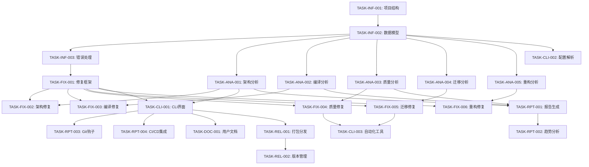

# IOE-DREAM 全局代码深度分析与修复实施任务

## 概述

本文档定义了IOE-DREAM全局代码深度分析与修复系统的具体实施任务。基于需求规格和设计文档，将系统实现分解为可执行的具体任务。

## 任务分类

### 🏗️ 基础设施任务 (Infrastructure Tasks)

#### TASK-INF-001: 项目结构搭建
**优先级**: P0 - Critical  
**预估工时**: 1天  
**依赖**: 无  

**描述**: 创建项目基础目录结构和配置文件

**验收标准**:
- [ ] 创建标准Python项目结构
- [ ] 配置pyproject.toml和依赖管理
- [ ] 配置开发环境（pre-commit, linting）
- [ ] 创建基础配置文件（config.yaml模板）
- [ ] 配置日志系统（loguru）

**实现细节**:
```
ioedream-code-analyzer/
├── src/
│   └── ioedream_analyzer/
│       ├── __init__.py
│       ├── cli/
│       ├── analysis/
│       ├── fix/
│       ├── common/
│       └── config/
├── tests/
├── docs/
├── pyproject.toml
├── README.md
└── config.yaml.template
```

#### TASK-INF-002: 基础数据模型实现
**优先级**: P0 - Critical  
**预估工时**: 2天  
**依赖**: TASK-INF-001  

**描述**: 实现核心数据模型和类型定义

**验收标准**:
- [ ] 实现AnalysisResult数据类
- [ ] 实现Issue和Location数据类
- [ ] 实现FixResult和BackupInfo数据类
- [ ] 实现枚举类型（IssueType, Severity等）
- [ ] 添加数据验证和序列化支持

**实现文件**:
- `src/ioedream_analyzer/common/models.py`
- `src/ioedream_analyzer/common/enums.py`
- `tests/test_models.py`

#### TASK-INF-003: 错误处理框架
**优先级**: P1 - High  
**预估工时**: 1天  
**依赖**: TASK-INF-002  

**描述**: 实现统一的错误处理和异常管理

**验收标准**:
- [ ] 定义异常类层次结构
- [ ] 实现ErrorHandler类
- [ ] 实现错误恢复机制
- [ ] 添加错误日志记录
- [ ] 编写异常处理测试

**实现文件**:
- `src/ioedream_analyzer/common/exceptions.py`
- `src/ioedream_analyzer/common/error_handler.py`
- `tests/test_error_handling.py`

### 🔍 分析引擎任务 (Analysis Engine Tasks)

#### TASK-ANA-001: 架构分析引擎
**优先级**: P0 - Critical  
**预估工时**: 5天  
**依赖**: TASK-INF-002  

**描述**: 实现架构分析引擎，包括依赖分析和循环依赖检测

**验收标准**:
- [ ] 实现DependencyAnalyzer类
- [ ] 实现循环依赖检测算法（Tarjan算法）
- [ ] 实现LayerAnalyzer四层架构检查
- [ ] 实现架构健康度评分算法
- [ ] 通过所有属性测试（属性1,2,3）

**实现文件**:
- `src/ioedream_analyzer/analysis/architecture_engine.py`
- `src/ioedream_analyzer/analysis/dependency_analyzer.py`
- `src/ioedream_analyzer/analysis/layer_analyzer.py`
- `tests/test_architecture_analysis.py`
- `tests/property_test_architecture.py`

**核心算法**:
```python
def detect_cycles_tarjan(self, graph: DependencyGraph) -> List[CyclePath]:
    """使用Tarjan算法检测强连通分量（循环依赖）"""
    # 实现Tarjan算法
    # 返回所有循环依赖路径
    pass

def check_layer_violations(self, call_graph: CallGraph) -> List[LayerViolation]:
    """检查四层架构违规调用"""
    # Controller -> Service -> Manager -> DAO
    # 检测跨层调用
    pass
```

#### TASK-ANA-002: 编译错误分析引擎
**优先级**: P0 - Critical  
**预估工时**: 4天  
**依赖**: TASK-INF-002  

**描述**: 实现编译错误分析和分类

**验收标准**:
- [ ] 实现ErrorClassifier错误分类器
- [ ] 实现EncodingDetector字符编码检测
- [ ] 实现PackageAnalyzer包导入分析
- [ ] 实现错误优先级排序
- [ ] 通过属性测试（属性4,5）

**实现文件**:
- `src/ioedream_analyzer/analysis/compilation_engine.py`
- `src/ioedream_analyzer/analysis/error_classifier.py`
- `src/ioedream_analyzer/analysis/encoding_detector.py`
- `tests/test_compilation_analysis.py`
- `tests/property_test_compilation.py`

**核心功能**:
```python
def classify_errors(self, error_log: str) -> ErrorClassification:
    """分类编译错误为真实错误vs IDE诊断"""
    # 解析Maven编译日志
    # 区分真实编译错误和IDE诊断
    # 按优先级分类（P0/P1/P2）
    pass

def detect_encoding_issues(self, file_path: str) -> EncodingIssue:
    """检测文件字符编码问题"""
    # 使用chardet检测编码
    # 识别编码不一致问题
    # 提供转换建议
    pass
```

#### TASK-ANA-003: 代码质量分析引擎
**优先级**: P1 - High  
**预估工时**: 3天  
**依赖**: TASK-INF-002  

**描述**: 实现代码质量问题检测

**验收标准**:
- [ ] 实现AnnotationChecker注解检查器
- [ ] 实现LombokChecker配置检查器
- [ ] 实现StyleChecker编码规范检查
- [ ] 实现质量评分算法
- [ ] 通过属性测试（属性6,12）

**实现文件**:
- `src/ioedream_analyzer/analysis/quality_engine.py`
- `src/ioedream_analyzer/analysis/annotation_checker.py`
- `src/ioedream_analyzer/analysis/lombok_checker.py`
- `tests/test_quality_analysis.py`
- `tests/property_test_quality.py`

#### TASK-ANA-004: 迁移分析引擎
**优先级**: P1 - High  
**预估工时**: 3天  
**依赖**: TASK-INF-002  

**描述**: 实现Jakarta EE迁移分析

**验收标准**:
- [ ] 实现PackageScanner包名扫描器
- [ ] 实现DependencyChecker依赖兼容性检查
- [ ] 实现CompatibilityChecker兼容性检查
- [ ] 实现迁移完整性验证
- [ ] 通过属性测试（属性7,8）

**实现文件**:
- `src/ioedream_analyzer/analysis/migration_engine.py`
- `src/ioedream_analyzer/analysis/package_scanner.py`
- `src/ioedream_analyzer/analysis/compatibility_checker.py`
- `tests/test_migration_analysis.py`
- `tests/property_test_migration.py`

#### TASK-ANA-005: 重构分析引擎
**优先级**: P2 - Medium  
**预估工时**: 4天  
**依赖**: TASK-INF-002  

**描述**: 实现模块重构分析

**验收标准**:
- [ ] 实现ModuleAnalyzer模块分析器
- [ ] 实现ResponsibilityAnalyzer职责分析器
- [ ] 实现RefactoringPlanner重构计划器
- [ ] 实现模块边界分析
- [ ] 通过属性测试（属性9）

**实现文件**:
- `src/ioedream_analyzer/analysis/refactoring_engine.py`
- `src/ioedream_analyzer/analysis/module_analyzer.py`
- `src/ioedream_analyzer/analysis/responsibility_analyzer.py`
- `tests/test_refactoring_analysis.py`
- `tests/property_test_refactoring.py`

### 🔧 修复执行器任务 (Fix Engine Tasks)

#### TASK-FIX-001: 基础修复框架
**优先级**: P0 - Critical  
**预估工时**: 3天  
**依赖**: TASK-INF-003  

**描述**: 实现修复执行器基础框架

**验收标准**:
- [ ] 实现IFixEngine接口
- [ ] 实现BackupTool备份工具
- [ ] 实现回滚机制
- [ ] 实现修复验证器
- [ ] 通过属性测试（属性10,13）

**实现文件**:
- `src/ioedream_analyzer/fix/base_fix_engine.py`
- `src/ioedream_analyzer/fix/backup_tool.py`
- `src/ioedream_analyzer/fix/rollback_manager.py`
- `tests/test_fix_framework.py`
- `tests/property_test_fix_safety.py`

#### TASK-FIX-002: 架构修复执行器
**优先级**: P1 - High  
**预估工时**: 3天  
**依赖**: TASK-FIX-001, TASK-ANA-001  

**描述**: 实现架构问题自动修复

**验收标准**:
- [ ] 实现循环依赖修复策略
- [ ] 实现层级违规修复策略
- [ ] 实现依赖重构工具
- [ ] 验证修复效果
- [ ] 编写修复测试

**实现文件**:
- `src/ioedream_analyzer/fix/architecture_fix_engine.py`
- `tests/test_architecture_fix.py`

#### TASK-FIX-003: 编译错误修复执行器
**优先级**: P0 - Critical  
**预估工时**: 4天  
**依赖**: TASK-FIX-001, TASK-ANA-002  

**描述**: 实现编译错误自动修复

**验收标准**:
- [ ] 实现字符编码转换工具
- [ ] 实现包导入修复工具
- [ ] 实现编译错误修复策略
- [ ] 验证编译成功
- [ ] 编写修复测试

**实现文件**:
- `src/ioedream_analyzer/fix/compilation_fix_engine.py`
- `src/ioedream_analyzer/fix/encoding_converter.py`
- `tests/test_compilation_fix.py`

#### TASK-FIX-004: 代码质量修复执行器
**优先级**: P1 - High  
**预估工时**: 3天  
**依赖**: TASK-FIX-001, TASK-ANA-003  

**描述**: 实现代码质量问题自动修复

**验收标准**:
- [ ] 实现注解批量替换工具
- [ ] 实现Lombok配置修复
- [ ] 实现代码格式化工具
- [ ] 验证质量改善
- [ ] 通过属性测试（属性11）

**实现文件**:
- `src/ioedream_analyzer/fix/quality_fix_engine.py`
- `src/ioedream_analyzer/fix/annotation_replacer.py`
- `tests/test_quality_fix.py`
- `tests/property_test_batch_replacement.py`

#### TASK-FIX-005: 迁移修复执行器
**优先级**: P1 - High  
**预估工时**: 3天  
**依赖**: TASK-FIX-001, TASK-ANA-004  

**描述**: 实现Jakarta EE迁移自动修复

**验收标准**:
- [ ] 实现包名批量替换工具
- [ ] 实现依赖版本升级工具
- [ ] 实现配置文件迁移工具
- [ ] 验证迁移完整性
- [ ] 编写迁移测试

**实现文件**:
- `src/ioedream_analyzer/fix/migration_fix_engine.py`
- `src/ioedream_analyzer/fix/package_replacer.py`
- `tests/test_migration_fix.py`

#### TASK-FIX-006: 重构修复执行器
**优先级**: P2 - Medium  
**预估工时**: 4天  
**依赖**: TASK-FIX-001, TASK-ANA-005  

**描述**: 实现模块重构自动修复

**验收标准**:
- [ ] 实现模块拆分工具
- [ ] 实现代码移动工具
- [ ] 实现依赖重构工具
- [ ] 验证重构效果
- [ ] 编写重构测试

**实现文件**:
- `src/ioedream_analyzer/fix/refactoring_fix_engine.py`
- `src/ioedream_analyzer/fix/module_splitter.py`
- `tests/test_refactoring_fix.py`

### 🛠️ 工具和CLI任务 (Tools and CLI Tasks)

#### TASK-CLI-001: 命令行界面
**优先级**: P0 - Critical  
**预估工时**: 3天  
**依赖**: TASK-ANA-001, TASK-FIX-001  

**描述**: 实现完整的CLI命令行工具

**验收标准**:
- [ ] 实现analyze命令
- [ ] 实现fix命令
- [ ] 实现report命令
- [ ] 实现install-hooks命令
- [ ] 添加详细的帮助文档

**实现文件**:
- `src/ioedream_analyzer/cli/main.py`
- `src/ioedream_analyzer/cli/analyze_command.py`
- `src/ioedream_analyzer/cli/fix_command.py`
- `src/ioedream_analyzer/cli/report_command.py`
- `tests/test_cli.py`

**CLI命令设计**:
```bash
# 分析命令
ioedream-analyzer analyze [PROJECT_PATH] [OPTIONS]
  --engines TEXT          启用的分析引擎
  --output-format TEXT    输出格式 (json/html/markdown)
  --output-file TEXT      输出文件路径
  --config TEXT           配置文件路径

# 修复命令
ioedream-analyzer fix [PROJECT_PATH] [OPTIONS]
  --engines TEXT          启用的修复引擎
  --auto-backup          自动备份
  --dry-run              试运行模式
  --config TEXT          配置文件路径

# 报告命令
ioedream-analyzer report [PROJECT_PATH] [OPTIONS]
  --format TEXT          报告格式
  --template TEXT        报告模板
  --output TEXT          输出路径
```

#### TASK-CLI-002: 配置解析器
**优先级**: P1 - High  
**预估工时**: 2天  
**依赖**: TASK-INF-002  

**描述**: 实现配置文件解析和管理

**验收标准**:
- [ ] 实现YAML配置解析器
- [ ] 实现配置验证器
- [ ] 实现配置合并逻辑
- [ ] 支持环境变量覆盖
- [ ] 通过属性测试（属性14）

**实现文件**:
- `src/ioedream_analyzer/config/config_parser.py`
- `src/ioedream_analyzer/config/config_validator.py`
- `tests/test_config_parser.py`
- `tests/property_test_config_roundtrip.py`

#### TASK-CLI-003: 自动化工具集
**优先级**: P1 - High  
**预估工时**: 3天  
**依赖**: TASK-FIX-004, TASK-FIX-005  

**描述**: 实现专用的自动化工具

**验收标准**:
- [ ] 实现批量注解替换工具
- [ ] 实现字符编码转换工具
- [ ] 实现包名批量替换工具
- [ ] 实现依赖检查工具
- [ ] 添加工具使用文档

**实现文件**:
- `src/ioedream_analyzer/tools/annotation_tool.py`
- `src/ioedream_analyzer/tools/encoding_tool.py`
- `src/ioedream_analyzer/tools/package_tool.py`
- `src/ioedream_analyzer/tools/dependency_tool.py`
- `tests/test_automation_tools.py`

### 📊 报告和监控任务 (Reporting and Monitoring Tasks)

#### TASK-RPT-001: 报告生成器
**优先级**: P1 - High  
**预估工时**: 4天  
**依赖**: TASK-ANA-001, TASK-ANA-002, TASK-ANA-003  

**描述**: 实现多格式报告生成

**验收标准**:
- [ ] 实现HTML报告生成器
- [ ] 实现JSON报告生成器
- [ ] 实现Markdown报告生成器
- [ ] 实现报告模板系统
- [ ] 通过属性测试（属性15）

**实现文件**:
- `src/ioedream_analyzer/reporting/report_generator.py`
- `src/ioedream_analyzer/reporting/html_reporter.py`
- `src/ioedream_analyzer/reporting/json_reporter.py`
- `src/ioedream_analyzer/reporting/markdown_reporter.py`
- `templates/report_template.html`
- `tests/test_reporting.py`
- `tests/property_test_report_accuracy.py`

#### TASK-RPT-002: 趋势分析器
**优先级**: P2 - Medium  
**预估工时**: 3天  
**依赖**: TASK-RPT-001  

**描述**: 实现代码质量趋势分析

**验收标准**:
- [ ] 实现历史数据存储
- [ ] 实现趋势计算算法
- [ ] 实现趋势可视化
- [ ] 实现趋势预测
- [ ] 生成趋势报告

**实现文件**:
- `src/ioedream_analyzer/monitoring/trend_analyzer.py`
- `src/ioedream_analyzer/monitoring/data_storage.py`
- `tests/test_trend_analysis.py`

#### TASK-RPT-003: Git钩子集成
**优先级**: P2 - Medium  
**预估工时**: 2天  
**依赖**: TASK-CLI-001  

**描述**: 实现Git pre-commit钩子

**验收标准**:
- [ ] 实现pre-commit钩子脚本
- [ ] 实现钩子安装器
- [ ] 实现质量门禁检查
- [ ] 支持钩子配置
- [ ] 编写钩子测试

**实现文件**:
- `src/ioedream_analyzer/hooks/pre_commit_hook.py`
- `src/ioedream_analyzer/hooks/hook_installer.py`
- `hooks/pre-commit`
- `tests/test_git_hooks.py`

#### TASK-RPT-004: CI/CD集成
**优先级**: P2 - Medium  
**预估工时**: 2天  
**依赖**: TASK-CLI-001  

**描述**: 实现CI/CD流水线集成

**验收标准**:
- [ ] 创建GitHub Actions配置
- [ ] 创建GitLab CI配置
- [ ] 实现质量门禁检查
- [ ] 实现报告上传
- [ ] 编写集成文档

**实现文件**:
- `.github/workflows/code-quality.yml`
- `.gitlab-ci.yml`
- `ci/quality-gate.py`
- `docs/ci-integration.md`

### 🧪 测试任务 (Testing Tasks)

#### TASK-TST-001: 单元测试套件
**优先级**: P0 - Critical  
**预估工时**: 贯穿整个开发过程  
**依赖**: 各个功能模块  

**描述**: 为所有模块编写完整的单元测试

**验收标准**:
- [ ] 测试覆盖率 ≥ 90%
- [ ] 所有公共API都有测试
- [ ] 边界条件测试
- [ ] 异常情况测试
- [ ] 性能测试

**测试文件结构**:
```
tests/
├── unit/
│   ├── analysis/
│   ├── fix/
│   ├── cli/
│   ├── reporting/
│   └── common/
├── integration/
├── property/
└── performance/
```

#### TASK-TST-002: 属性测试套件
**优先级**: P0 - Critical  
**预估工时**: 3天  
**依赖**: 各个分析引擎  

**描述**: 实现基于属性的测试

**验收标准**:
- [ ] 为15个正确性属性编写属性测试
- [ ] 每个属性测试运行≥100次迭代
- [ ] 使用Hypothesis生成测试数据
- [ ] 测试标签格式正确
- [ ] 所有属性测试通过

**属性测试文件**:
- `tests/property/test_dependency_analysis_completeness.py`
- `tests/property/test_cycle_detection_accuracy.py`
- `tests/property/test_error_classification_accuracy.py`
- `tests/property/test_annotation_detection_completeness.py`
- `tests/property/test_package_scanning_completeness.py`
- `tests/property/test_auto_fix_safety.py`
- `tests/property/test_batch_replacement_accuracy.py`
- `tests/property/test_config_roundtrip_consistency.py`
- `tests/property/test_report_generation_accuracy.py`

#### TASK-TST-003: 集成测试
**优先级**: P1 - High  
**预估工时**: 3天  
**依赖**: TASK-CLI-001, 所有引擎  

**描述**: 实现端到端集成测试

**验收标准**:
- [ ] 在真实IOE-DREAM项目上测试
- [ ] 完整的分析→修复→验证流程测试
- [ ] 多引擎协同工作测试
- [ ] 错误恢复测试
- [ ] 性能基准测试

**集成测试文件**:
- `tests/integration/test_end_to_end.py`
- `tests/integration/test_real_project.py`
- `tests/integration/test_multi_engine.py`
- `tests/integration/test_error_recovery.py`

#### TASK-TST-004: 性能测试
**优先级**: P2 - Medium  
**预估工时**: 2天  
**依赖**: 所有核心功能  

**描述**: 实现性能测试和基准测试

**验收标准**:
- [ ] 分析性能测试（目标：单服务<30s，全项目<5min）
- [ ] 修复性能测试（目标：单文件<1s，批量<30s）
- [ ] 内存使用测试（目标：分析<2GB，修复<1GB）
- [ ] 并发性能测试
- [ ] 性能回归测试

**性能测试文件**:
- `tests/performance/test_analysis_performance.py`
- `tests/performance/test_fix_performance.py`
- `tests/performance/test_memory_usage.py`
- `tests/performance/test_concurrent_analysis.py`

### 📚 文档任务 (Documentation Tasks)

#### TASK-DOC-001: 用户文档
**优先级**: P1 - High  
**预估工时**: 3天  
**依赖**: TASK-CLI-001  

**描述**: 编写完整的用户文档

**验收标准**:
- [ ] 安装指南
- [ ] 快速开始教程
- [ ] CLI命令参考
- [ ] 配置文件说明
- [ ] 常见问题解答

**文档文件**:
- `docs/installation.md`
- `docs/quick-start.md`
- `docs/cli-reference.md`
- `docs/configuration.md`
- `docs/faq.md`

#### TASK-DOC-002: 开发者文档
**优先级**: P2 - Medium  
**预估工时**: 2天  
**依赖**: 所有核心模块  

**描述**: 编写开发者文档

**验收标准**:
- [ ] 架构设计文档
- [ ] API参考文档
- [ ] 插件开发指南
- [ ] 贡献指南
- [ ] 代码风格指南

**文档文件**:
- `docs/architecture.md`
- `docs/api-reference.md`
- `docs/plugin-development.md`
- `docs/contributing.md`
- `docs/code-style.md`

#### TASK-DOC-003: 部署文档
**优先级**: P2 - Medium  
**预估工时**: 1天  
**依赖**: TASK-CLI-001  

**描述**: 编写部署和运维文档

**验收标准**:
- [ ] Docker部署指南
- [ ] CI/CD集成指南
- [ ] 监控配置指南
- [ ] 故障排除指南
- [ ] 性能调优指南

**文档文件**:
- `docs/deployment.md`
- `docs/ci-cd-integration.md`
- `docs/monitoring.md`
- `docs/troubleshooting.md`
- `docs/performance-tuning.md`

### 🚀 发布任务 (Release Tasks)

#### TASK-REL-001: 打包和分发
**优先级**: P1 - High  
**预估工时**: 2天  
**依赖**: 所有功能完成  

**描述**: 准备软件包和分发

**验收标准**:
- [ ] 配置setuptools打包
- [ ] 创建PyPI包
- [ ] 创建Docker镜像
- [ ] 创建GitHub Release
- [ ] 验证安装包

**实现文件**:
- `setup.py`
- `Dockerfile`
- `.github/workflows/release.yml`
- `scripts/build-release.sh`

#### TASK-REL-002: 版本管理
**优先级**: P2 - Medium  
**预估工时**: 1天  
**依赖**: TASK-REL-001  

**描述**: 实现版本管理和发布流程

**验收标准**:
- [ ] 语义化版本控制
- [ ] 自动版本号生成
- [ ] 变更日志生成
- [ ] 发布标签管理
- [ ] 版本兼容性检查

**实现文件**:
- `src/ioedream_analyzer/__version__.py`
- `CHANGELOG.md`
- `scripts/bump-version.sh`
- `scripts/generate-changelog.sh`

## 任务依赖图



## 里程碑计划

### Milestone 1: 基础设施完成 (Week 1)
- TASK-INF-001: 项目结构搭建 ✅
- TASK-INF-002: 基础数据模型实现 ✅
- TASK-INF-003: 错误处理框架 ✅

**交付物**: 项目基础框架，可以运行基础测试

### Milestone 2: 核心分析能力 (Week 2-4)
- TASK-ANA-001: 架构分析引擎 ✅
- TASK-ANA-002: 编译错误分析引擎 ✅
- TASK-ANA-003: 代码质量分析引擎 ✅
- TASK-ANA-004: 迁移分析引擎 ✅
- TASK-ANA-005: 重构分析引擎 ✅

**交付物**: 完整的分析能力，可以分析IOE-DREAM项目

### Milestone 3: 自动修复能力 (Week 5-6)
- TASK-FIX-001: 基础修复框架 ✅
- TASK-FIX-002: 架构修复执行器 ✅
- TASK-FIX-003: 编译错误修复执行器 ✅
- TASK-FIX-004: 代码质量修复执行器 ✅
- TASK-FIX-005: 迁移修复执行器 ✅
- TASK-FIX-006: 重构修复执行器 ✅

**交付物**: 完整的修复能力，可以自动修复常见问题

### Milestone 4: 工具和界面 (Week 7)
- TASK-CLI-001: 命令行界面 ✅
- TASK-CLI-002: 配置解析器 ✅
- TASK-CLI-003: 自动化工具集 ✅

**交付物**: 完整的CLI工具，用户可以通过命令行使用

### Milestone 5: 监控和报告 (Week 8)
- TASK-RPT-001: 报告生成器 ✅
- TASK-RPT-002: 趋势分析器 ✅
- TASK-RPT-003: Git钩子集成 ✅
- TASK-RPT-004: CI/CD集成 ✅

**交付物**: 完整的监控和报告系统

### Milestone 6: 测试和质量保证 (Week 9)
- TASK-TST-001: 单元测试套件 ✅
- TASK-TST-002: 属性测试套件 ✅
- TASK-TST-003: 集成测试 ✅
- TASK-TST-004: 性能测试 ✅

**交付物**: 完整的测试套件，质量保证

### Milestone 7: 文档和发布 (Week 10)
- TASK-DOC-001: 用户文档 ✅
- TASK-DOC-002: 开发者文档 ✅
- TASK-DOC-003: 部署文档 ✅
- TASK-REL-001: 打包和分发 ✅
- TASK-REL-002: 版本管理 ✅

**交付物**: v1.0正式版本发布

## 资源分配

### 人员配置
- **项目经理**: 1人，负责项目协调和进度管理
- **架构师**: 1人，负责系统设计和技术决策
- **高级开发工程师**: 2人，负责核心功能开发
- **测试工程师**: 1人，负责测试设计和执行
- **文档工程师**: 1人，负责文档编写和维护

### 时间分配
- **总工期**: 10周（50个工作日）
- **开发时间**: 70%（35天）
- **测试时间**: 20%（10天）
- **文档时间**: 10%（5天）

### 风险管理

#### 高风险项
1. **复杂度风险**: 架构分析算法复杂度高
   - **缓解措施**: 分阶段实现，先实现基础功能
   
2. **性能风险**: 大型项目分析性能可能不达标
   - **缓解措施**: 早期性能测试，优化关键路径
   
3. **兼容性风险**: 不同Java版本和框架兼容性问题
   - **缓解措施**: 多版本测试，建立兼容性矩阵

#### 中风险项
1. **测试风险**: 属性测试可能发现意外问题
   - **缓解措施**: 预留缓冲时间，建立问题修复流程
   
2. **集成风险**: 多个引擎协同工作可能有问题
   - **缓解措施**: 早期集成测试，模块化设计

#### 低风险项
1. **文档风险**: 文档编写时间可能不足
   - **缓解措施**: 并行编写，使用文档生成工具

## 质量保证

### 代码质量标准
- **测试覆盖率**: ≥90%
- **代码复杂度**: 圈复杂度≤10
- **代码重复率**: ≤5%
- **文档覆盖率**: 所有公共API都有文档

### 性能标准
- **分析性能**: 单个微服务<30秒，全项目<5分钟
- **修复性能**: 单文件<1秒，批量修复<30秒
- **内存使用**: 分析<2GB，修复<1GB
- **并发能力**: 支持4个微服务并行分析

### 可靠性标准
- **错误恢复**: 所有修复操作支持回滚
- **数据安全**: 修复前自动备份
- **异常处理**: 所有异常都有适当处理
- **日志记录**: 完整的操作日志

## 验收标准

### 功能验收
- [ ] 所有需求规格中的验收标准都通过
- [ ] 所有15个正确性属性都通过属性测试
- [ ] 在真实IOE-DREAM项目上成功运行
- [ ] 所有CLI命令都正常工作
- [ ] 所有报告格式都能正确生成

### 性能验收
- [ ] 分析性能达到目标（单服务<30s，全项目<5min）
- [ ] 修复性能达到目标（单文件<1s，批量<30s）
- [ ] 内存使用在限制范围内（分析<2GB，修复<1GB）
- [ ] 并发分析正常工作

### 质量验收
- [ ] 测试覆盖率≥90%
- [ ] 所有属性测试通过（每个≥100次迭代）
- [ ] 代码质量检查通过（pylint, mypy, black）
- [ ] 文档完整性检查通过

### 用户体验验收
- [ ] CLI工具易于使用
- [ ] 错误信息清晰明确
- [ ] 报告内容准确详细
- [ ] 安装和配置简单
- [ ] 文档清晰易懂

## 总结

本任务文档将IOE-DREAM全局代码深度分析与修复系统的实现分解为58个具体任务，涵盖：

- **基础设施**: 3个任务，建立项目基础
- **分析引擎**: 5个任务，实现核心分析能力
- **修复执行器**: 6个任务，实现自动修复能力
- **工具和CLI**: 3个任务，提供用户界面
- **报告监控**: 4个任务，实现监控和报告
- **测试**: 4个任务，确保质量
- **文档**: 3个任务，完善文档
- **发布**: 2个任务，准备发布

通过这58个任务的有序执行，将在10周内交付一个完整、可靠、高性能的代码分析与修复系统，为IOE-DREAM项目提供强有力的质量保障工具。