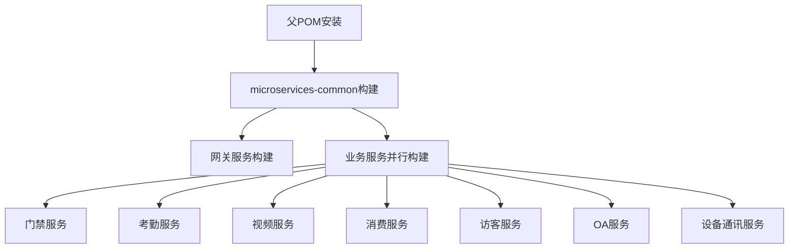
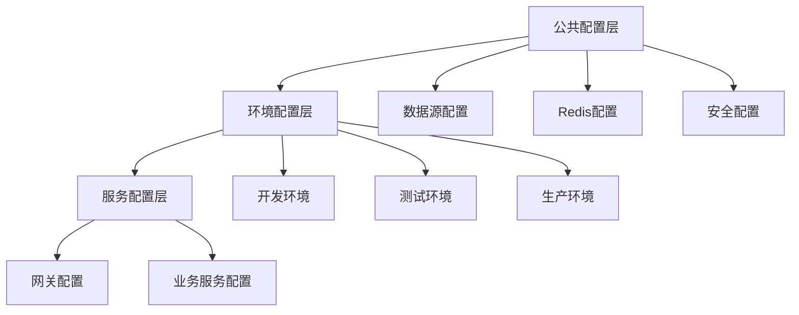
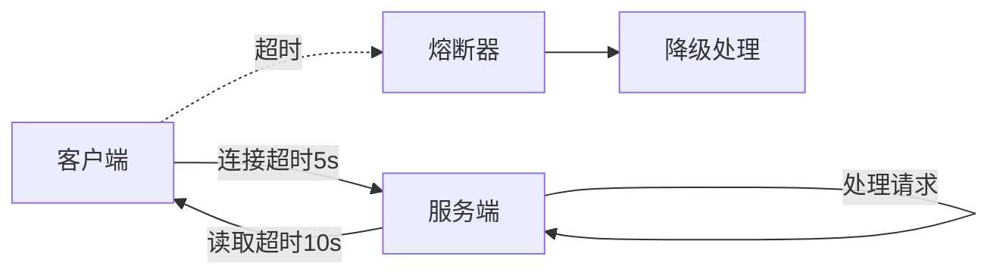
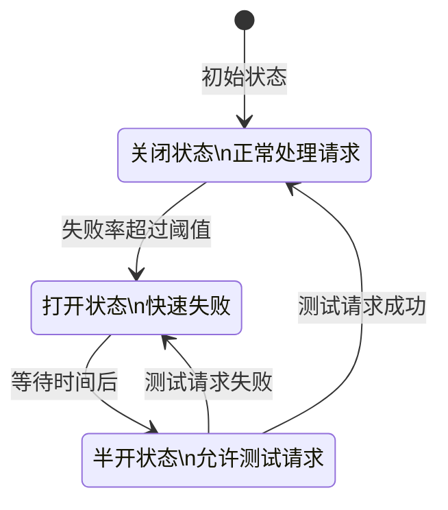
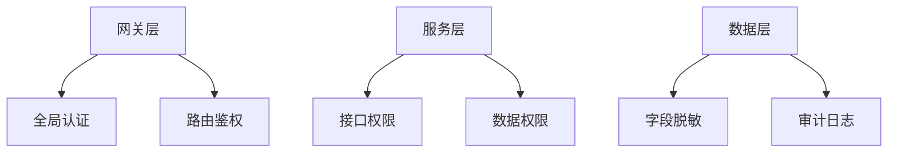
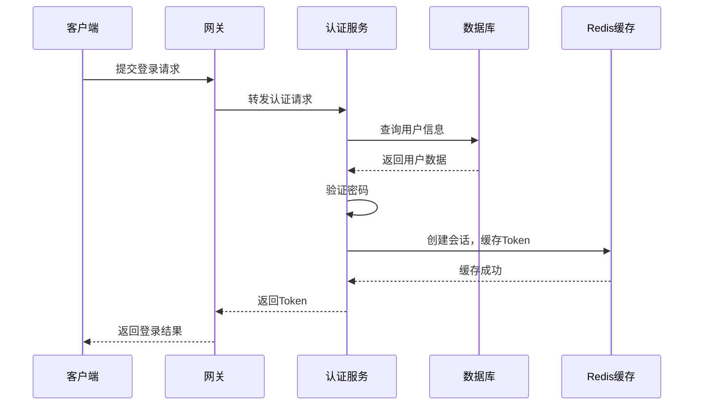
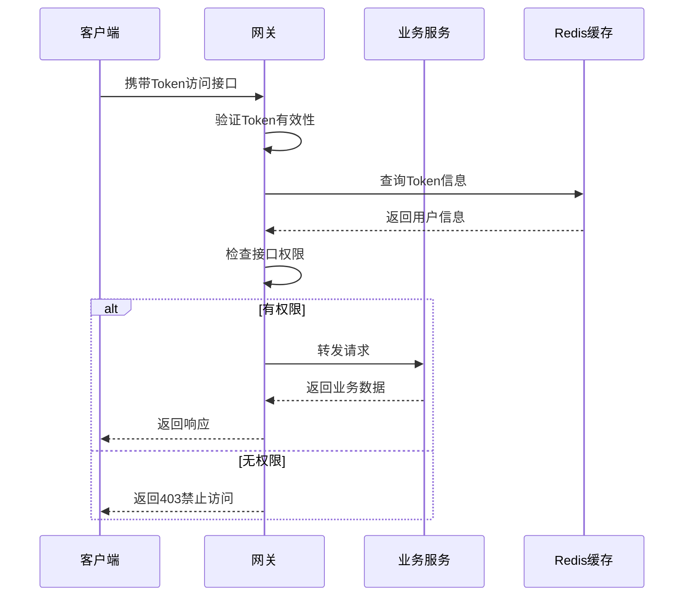
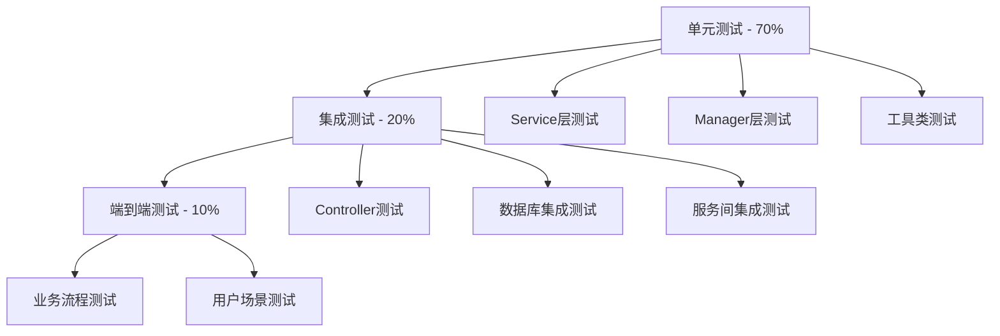
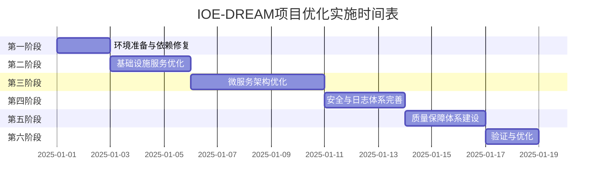
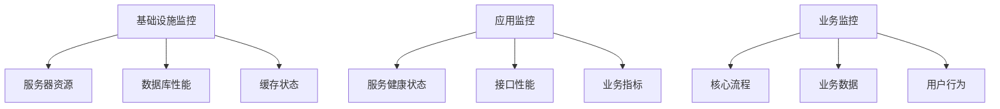

# IOE-DREAM项目深度优化设计方案

## 一、设计目标与原则

### 1.1 核心设计目标

本设计方案旨在对IOE-DREAM微服务项目进行系统性优化，解决当前存在的根本性问题，建立健壮、可扩展、可维护的企业级微服务架构。

**主要目标：**

- 解决Maven多模块构建依赖问题，建立稳定的构建流程
- 完善微服务基础设施，提升系统可靠性和可观测性
- 优化服务间通信机制，提高系统性能和响应速度
- 建立统一的安全与日志体系，满足企业级应用要求
- 构建完整的质量保障体系，确保代码质量和系统稳定性

### 1.2 设计原则

- **全局性原则**：从整体架构出发，避免局部修复
- **根源性原则**：找出问题根本原因，实施系统性解决方案
- **规范性原则**：严格遵循repowiki规范体系
- **可演进性原则**：设计具备良好的扩展性和适应性
- **实用性原则**：方案与项目复杂度匹配，不过度设计

### 1.3 约束条件

- 技术栈：Spring Boot 3.5.8 + Spring Cloud 2023.0.3 + Jakarta EE
- 运行环境：JDK 17、Maven 3.8+
- 数据库：MySQL 8.3.0
- 安全框架：Sa-Token 1.44.0
- 数据访问：MyBatis-Plus 3.5.15

## 二、现状分析

### 2.1 项目结构现状

IOE-DREAM采用微服务架构，包含以下核心模块：

| 模块名称 | 端口 | 职责说明 |
|---------|------|----------|
| microservices-common | N/A | 公共组件、工具类、基础配置 |
| ioedream-gateway-service | 8080 | API网关、路由转发、统一鉴权 |
| ioedream-access-service | 8090 | 门禁管理业务 |
| ioedream-attendance-service | 8091 | 考勤管理业务 |
| ioedream-video-service | 8092 | 视频监控业务 |
| ioedream-consume-service | 8094 | 消费管理业务 |
| ioedream-visitor-service | 8095 | 访客管理业务 |
| ioedream-common-service | 8093 | 公共业务服务 |
| ioedream-device-comm-service | 8096 | 设备通讯服务 |
| ioedream-oa-service | 8097 | OA工作流服务 |

### 2.2 核心问题识别

#### 2.2.1 构建系统问题

**问题表现：**
- Maven多模块构建时依赖解析失败
- 父POM安装顺序不正确导致子模块找不到父依赖
- 本地仓库缓存污染导致构建不稳定

**根本原因：**
- 缺乏明确的构建顺序控制机制
- Maven Reactor构建顺序未正确配置
- microservices-common作为基础依赖未优先构建

#### 2.2.2 基础设施问题

**问题表现：**
- Docker Compose配置缺少健康检查
- 服务启动顺序不可控，依赖服务未就绪导致启动失败
- Nacos配置管理不完善，缺少配置版本管理

**根本原因：**
- 基础设施服务编排设计不完整
- 缺少服务依赖关系的明确定义
- 健康检查机制缺失

#### 2.2.3 服务治理问题

**问题表现：**
- 服务间调用缺少超时控制
- 缺少熔断降级机制
- 服务注册发现机制不稳定

**根本原因：**
- 缺少统一的服务治理框架
- 微服务通信配置分散，未统一管理
- 弹性设计不足

#### 2.2.4 安全与日志问题

**问题表现：**
- Sa-Token集成不完整，部分接口未受保护
- 日志格式不统一，缺少结构化日志
- 缺少审计日志功能

**根本原因：**
- 安全框架未全局统一配置
- 日志规范未严格执行
- 安全策略设计不完善

## 三、系统优化设计方案

### 3.1 构建体系优化设计

#### 3.1.1 Maven多模块构建顺序策略

**构建顺序定义：**

**依赖管理策略：**

在父POM的dependencyManagement中统一管理所有依赖版本，确保版本一致性。公共模块microservices-common作为所有业务服务的必需依赖，在modules列表中放在首位优先构建。

**构建环境准备流程：**

1. 清理本地Maven仓库中的项目相关缓存
2. 删除所有模块的target目录
3. 在项目根目录执行：mvn install -N（安装父POM）
4. 进入microservices-common目录执行：mvn clean install -DskipTests
5. 返回项目根目录执行：mvn clean install -DskipTests

**验证机制：**

- 所有模块的JAR包已正确安装到本地仓库
- 模块间依赖关系正确解析
- 生成的JAR包包含必要的类文件

### 3.2 基础设施架构设计

#### 3.2.1 容器化基础设施设计

**基础设施组件定义：**

| 组件 | 版本 | 职责 | 健康检查策略 |
|------|------|------|-------------|
| MySQL | 8.0 | 持久化数据存储 | mysqladmin ping检测 |
| Redis | 7-alpine | 缓存与会话存储 | redis-cli ping检测 |
| Nacos | 2.3.0 | 服务注册与配置中心 | HTTP健康检查接口 |

**服务依赖关系设计：**

MySQL作为基础数据存储服务，Nacos依赖MySQL存储配置和服务信息。所有微服务依赖Nacos进行服务注册和配置获取。使用Docker Compose的depends_on配合condition确保服务按正确顺序启动。

**健康检查机制：**

每个基础设施服务配置健康检查：
- 检查方式：执行特定命令或HTTP请求
- 超时时间：20秒
- 重试次数：10次
- 检查间隔：自动（Docker默认）

**重启策略：**

所有基础设施服务设置restart: unless-stopped策略，确保服务异常退出后自动重启，系统重启后自动启动，手动停止后不会自动启动。

#### 3.2.2 Nacos配置中心设计

**配置分层策略：**

**配置命名规范：**

| 配置类型 | 命名格式 | 示例 |
|---------|---------|------|
| 公共配置 | common-{profile}.yaml | common-dev.yaml |
| 服务配置 | {service-name}-{profile}.yaml | gateway-dev.yaml |
| 共享配置 | shared-{category}.yaml | shared-database.yaml |

**配置内容分类：**

1. 数据源配置：数据库连接信息、连接池参数、事务管理配置
2. Redis配置：连接信息、序列化方式、缓存过期策略
3. 安全配置：Sa-Token配置、JWT密钥、会话超时设置
4. 服务治理配置：超时时间、重试策略、熔断阈值

**配置刷新机制：**

通过Spring Cloud的RefreshScope实现配置热更新，监听Nacos配置变更事件，自动刷新被@RefreshScope标注的Bean，保留配置变更历史支持回滚。

### 3.3 微服务治理架构设计

#### 3.3.1 服务注册与发现设计

**服务元数据设计：**

每个服务实例注册时包含以下元数据：
- version：服务版本号，用于灰度发布和版本路由
- weight：权重值，用于负载均衡权重分配
- zone：可用区标识，用于同区优先路由
- env：环境标识，用于环境隔离

**健康检查策略：**

- 检查方式：HTTP健康检查端点（/actuator/health）
- 检查间隔：5秒
- 失败阈值：连续3次失败标记为不健康
- 恢复策略：恢复后自动重新标记为健康

#### 3.3.2 服务间通信优化设计

**通信方式选择策略：**

| 场景 | 推荐方式 | 理由 |
|------|---------|------|
| 同步查询 | RestTemplate / WebClient | 简单直接，易于实现 |
| 异步通知 | 消息队列 | 解耦，提高可靠性 |
| 高频调用 | gRPC | 性能优秀，适合内部调用 |
| 实时通信 | WebSocket | 双向通信，实时性好 |

**RestTemplate配置策略：**

配置统一的RestTemplate Bean，包含：
- 连接超时：5秒
- 读取超时：10秒
- 负载均衡：通过@LoadBalanced注解启用
- 请求拦截：添加统一请求头、日志记录

**超时控制设计：**

**重试策略设计：**

| 异常类型 | 重试次数 | 重试间隔 | 说明 |
|---------|---------|---------|------|
| 网络超时 | 2次 | 1秒 | 避免级联失败 |
| 连接拒绝 | 0次 | - | 快速失败 |
| 服务不可用 | 1次 | 2秒 | 给予恢复时间 |
| 业务异常 | 0次 | - | 不重试业务错误 |

#### 3.3.3 熔断降级设计

**熔断器状态机：**

**熔断参数配置：**

| 参数 | 默认值 | 说明 |
|------|--------|------|
| 失败率阈值 | 50% | 超过此值触发熔断 |
| 最小请求数 | 20 | 统计窗口内最小请求数 |
| 等待时长 | 60秒 | 熔断后等待时长 |
| 滑动窗口大小 | 100 | 统计的请求样本数 |

**降级策略设计：**

1. 返回默认值：对于查询类接口，返回缓存或默认数据
2. 返回错误提示：对于修改类接口，返回友好的错误信息
3. 异步处理：将请求放入队列，稍后处理
4. 快速失败：直接返回失败，避免资源浪费

### 3.4 统一配置中心设计

#### 3.4.1 配置管理器设计

**核心职责：**

- 配置加载：从Nacos拉取配置
- 配置刷新：监听配置变更并自动刷新
- 配置验证：确保配置格式正确且必填项存在
- 配置缓存：本地缓存配置，提高访问速度

**配置属性类设计：**

按功能模块划分配置属性类：
1. DatabaseProperties：数据源URL、用户名密码、连接池配置、事务配置
2. RedisProperties：连接信息、超时配置、序列化配置、集群配置
3. SecurityProperties：Token配置、密钥信息、会话配置、权限配置

**配置刷新机制：**

使用Spring Cloud的RefreshScope实现动态刷新，标记需要刷新的Bean为@RefreshScope，监听Nacos配置变更事件，触发RefreshScope的refresh方法，重新创建被标记的Bean实例。

## 四、安全与日志体系设计

### 4.1 统一安全框架设计

#### 4.1.1 Sa-Token集成架构

**安全架构分层：**

**权限接口实现设计：**

实现StpInterface接口提供权限和角色查询：
- getPermissionList：查询用户权限列表
- getRoleList：查询用户角色列表
- 数据来源：从数据库或缓存中获取
- 缓存策略：权限信息缓存30分钟

**Token监听器设计：**

实现SaTokenListener接口监听Token事件：
- doLogin：用户登录时记录审计日志
- doLogout：用户登出时清理缓存
- doKickout：用户被踢出时发送通知
- doReplaced：Token被顶替时记录安全事件
- doDisable：账号被封禁时记录操作日志

**路由拦截器设计：**

配置SaTokenFilter实现路由级别的权限控制：
- 登录接口：排除拦截（/auth/login, /auth/register）
- 文档接口：排除拦截（/doc.html, /swagger-**）
- 公开接口：排除拦截（/public/**）
- 业务接口：拦截验证（/**）

#### 4.1.2 认证授权流程设计

**登录认证流程：**

**接口鉴权流程：**

### 4.2 统一日志体系设计

#### 4.2.1 日志分类策略

**日志类型定义：**

| 日志类型 | 用途 | 级别 | 存储策略 |
|---------|------|------|----------|
| 业务日志 | 记录业务操作 | INFO | 保留30天 |
| 安全日志 | 记录安全事件 | WARN | 保留90天 |
| 审计日志 | 记录敏感操作 | INFO | 永久保留 |
| 错误日志 | 记录系统错误 | ERROR | 保留60天 |
| 性能日志 | 记录性能指标 | DEBUG | 保留7天 |

**日志级别使用规范：**

- TRACE：详细的调试信息，仅开发环境使用
- DEBUG：调试信息，测试环境使用
- INFO：重要的业务流程信息，生产环境使用
- WARN：警告信息，需要关注但不影响运行
- ERROR：错误信息，需要立即处理

#### 4.2.2 结构化日志设计

**MDC上下文设计：**

在日志中通过MDC（Mapped Diagnostic Context）添加上下文信息：

| 上下文字段 | 说明 | 来源 |
|-----------|------|------|
| traceId | 请求追踪ID | 网关生成或客户端传入 |
| userId | 用户ID | 从Token中提取 |
| module | 模块名称 | 当前服务名称 |
| operation | 操作类型 | 业务操作标识 |
| ip | 客户端IP | 从请求头提取 |

**日志格式设计：**

统一的日志输出格式：
- 时间戳：ISO 8601格式
- 级别：日志级别
- 线程：执行线程名称
- 类名：记录日志的类
- 消息：日志内容
- MDC：上下文信息

#### 4.2.3 审计日志设计

**审计范围定义：**

需要审计的操作类型：
- 用户管理：创建、修改、删除用户
- 角色权限：分配角色、授予权限
- 数据修改：重要业务数据的增删改
- 配置变更：系统配置的修改
- 文件操作：文件的上传、下载、删除

**审计信息记录内容：**

| 字段 | 说明 |
|------|------|
| 操作时间 | 精确到毫秒 |
| 操作用户 | 用户ID和用户名 |
| 操作类型 | 增删改查等操作 |
| 操作对象 | 被操作的资源 |
| 操作前数据 | 修改前的数据快照 |
| 操作后数据 | 修改后的数据快照 |
| 操作结果 | 成功或失败 |
| 客户端IP | 请求来源IP |
| 请求参数 | 完整的请求参数 |

**审计日志存储策略：**

- 存储方式：数据库表存储
- 表结构：独立的审计日志表
- 分表策略：按月分表
- 索引设计：用户ID、操作时间、操作类型
- 归档策略：超过1年的数据归档到历史表

## 五、质量保障体系设计

### 5.1 自动化测试体系设计

#### 5.1.1 测试分层策略

**测试金字塔模型：**

**测试覆盖率目标：**

| 层级 | 覆盖率目标 | 重点 |
|------|-----------|------|
| 单元测试 | 80%以上 | 业务逻辑、工具方法 |
| 集成测试 | 60%以上 | 接口、数据访问 |
| 端到端测试 | 核心流程 | 主要业务场景 |

#### 5.1.2 单元测试设计

**测试框架选择：**

- 测试框架：JUnit 5
- 断言库：AssertJ
- Mock框架：Mockito
- 测试容器：Testcontainers（需要时）

**测试用例设计原则：**

1. 独立性：每个测试用例独立运行，互不影响
2. 可重复性：多次执行结果一致
3. 自验证性：通过断言自动验证结果
4. 及时性：快速执行，快速反馈
5. 可维护性：代码清晰，易于理解和修改

**Mock策略：**

| 组件类型 | Mock策略 | 说明 |
|---------|---------|------|
| Repository | 使用@MockBean | 隔离数据库依赖 |
| 外部服务 | 使用@MockBean | 隔离服务间依赖 |
| 工具类 | 真实对象 | 测试真实逻辑 |
| 配置类 | 使用@TestPropertySource | 使用测试配置 |

#### 5.1.3 集成测试设计

**测试环境配置：**

使用Spring Boot Test提供的测试环境：
- @SpringBootTest：启动完整的应用上下文
- @TestPropertySource：使用测试配置
- @AutoConfigureMockMvc：自动配置MockMvc
- 内存数据库：使用H2作为测试数据库

**Controller测试策略：**

使用MockMvc进行接口测试：
- 测试请求路由是否正确
- 测试请求参数验证
- 测试响应状态码
- 测试响应内容格式
- 测试异常处理

### 5.2 代码质量管理设计

#### 5.2.1 静态代码分析

**SonarQube集成设计：**

通过Maven插件集成SonarQube进行代码质量分析：
- 代码重复检测
- 代码复杂度分析
- 代码规范检查
- 安全漏洞扫描
- 技术债务评估

**质量门禁规则：**

| 指标 | 阈值 | 说明 |
|------|------|------|
| 代码覆盖率 | ≥ 80% | 新代码必须达标 |
| 重复代码率 | ≤ 3% | 避免代码冗余 |
| 代码复杂度 | ≤ 10 | 方法复杂度限制 |
| 严重问题数 | 0 | 不允许严重问题 |
| 阻断问题数 | 0 | 不允许阻断问题 |

#### 5.2.2 代码规范检查

**Checkstyle配置：**

集成Checkstyle进行代码风格检查：
- 命名规范检查
- 代码格式检查
- 注释完整性检查
- 导入顺序检查
- 魔法值检查

**规范要点：**

1. 命名规范：类名大驼峰、方法名小驼峰、常量全大写下划线分隔
2. 注释规范：类注释说明职责、方法注释说明功能参数返回值
3. 代码格式：缩进4个空格、行长度不超过120字符

## 六、实施计划

### 6.1 实施阶段划分

**整体时间规划：**

### 6.2 各阶段关键任务

**第一阶段：环境准备与依赖修复（1-2天）**

关键任务：
- 清理本地Maven仓库
- 修复父POM配置
- 验证构建顺序
- 编写构建脚本

执行步骤：
1. 清理本地Maven仓库中的项目相关缓存目录
2. 在项目根目录执行mvn install -N安装父POM
3. 构建microservices-common公共模块
4. 按正确顺序构建所有模块

验收标准：
- 所有模块构建成功，无编译错误
- 本地仓库中存在所有模块的JAR包
- 依赖关系正确解析

**第二阶段：基础设施服务优化（2-3天）**

关键任务：
- 优化Docker Compose配置
- 配置健康检查机制
- 完善Nacos配置管理
- 建立配置热更新机制

执行步骤：
1. 为每个服务添加健康检查配置
2. 配置服务依赖关系（depends_on）
3. 设置重启策略（restart policy）
4. 在Nacos中创建公共配置文件
5. 为每个微服务创建独立配置文件

验收标准：
- 所有基础设施服务成功启动
- 健康检查正常工作
- 服务依赖关系正确
- Nacos配置中心可正常访问

**第三阶段：微服务架构优化（3-5天）**

关键任务：
- 完善服务注册发现
- 配置服务间通信
- 实现熔断降级
- 建立配置中心模块

执行步骤：
1. 配置服务注册与发现
2. 创建RestTemplate配置类
3. 创建WebClient配置类
4. 集成Resilience4j熔断框架
5. 实现降级处理方法
6. 创建配置中心自动配置类

验收标准：
- 所有服务成功注册到Nacos
- 服务发现正常工作
- 熔断器正常工作
- 降级功能正常

**第四阶段：安全与日志体系完善（2-3天）**

关键任务：
- 完善Sa-Token集成
- 实现权限验证
- 建立统一日志规范
- 实现审计日志

执行步骤：
1. 创建安全自动配置类
2. 实现StpInterface权限接口
3. 实现SaTokenListener监听器
4. 配置路由拦截器
5. 创建统一日志工具类
6. 配置日志框架
7. 创建审计日志表
8. 实现审计日志功能

验收标准：
- Sa-Token集成完整，所有接口受保护
- 权限验证正常工作
- 日志格式统一，包含必要的上下文信息
- 审计日志正确记录敏感操作

**第五阶段：质量保障体系建设（2-3天）**

关键任务：
- 编写单元测试
- 编写集成测试
- 集成SonarQube

执行步骤：
1. 为Service层编写单元测试
2. 为Manager层编写单元测试
3. 为工具类编写单元测试
4. 为Controller编写集成测试
5. 编写数据库集成测试
6. 配置SonarQube
7. 配置Checkstyle

验收标准：
- 单元测试覆盖率达到80%以上
- 所有测试用例通过
- SonarQube质量门禁通过
- Checkstyle检查无错误

**第六阶段：验证与优化（1-2天）**

关键任务：
- 系统集成测试
- 性能测试
- 文档整理
- 知识传承

验收标准：
- 所有集成测试通过
- 性能指标达到预期
- 文档完整清晰
- 团队成员理解优化内容

## 七、风险管理

### 7.1 技术风险识别与应对

**风险清单：**

| 风险项 | 影响程度 | 发生概率 | 应对策略 |
|-------|---------|---------|----------|
| 依赖版本冲突 | 高 | 中 | 严格版本管理，使用dependencyManagement |
| 数据库连接池耗尽 | 高 | 低 | 合理配置连接池参数，监控连接使用情况 |
| 服务雪崩效应 | 高 | 中 | 实现熔断降级，配置超时控制 |
| 配置错误导致服务不可用 | 高 | 低 | 配置验证机制，灰度发布 |
| 性能不达标 | 中 | 低 | 性能测试，优化慢接口 |
| 安全漏洞 | 高 | 低 | 安全扫描，定期更新依赖 |

### 7.2 应急预案

**依赖版本冲突应急方案：**
- 立即回滚到上一个稳定版本
- 分析冲突原因
- 调整依赖配置
- 重新测试验证

**数据库连接池耗尽应急方案：**
- 重启服务释放连接
- 临时增加连接池大小
- 分析慢SQL并优化
- 限流保护

**微服务雪崩效应应急方案：**
- 隔离故障服务
- 启用降级策略
- 快速恢复故障服务
- 逐步恢复调用链路

**配置错误应急方案：**
- 立即回滚配置到上一版本
- 重启受影响的服务
- 分析配置错误原因
- 修复并重新发布

## 八、监控与运维策略

### 8.1 监控体系设计

**监控层次：**

**监控指标定义：**

| 监控类型 | 关键指标 | 采集频率 | 告警阈值 |
|---------|---------|---------|----------|
| 服务器资源 | CPU使用率 | 30秒 | >80% |
| 服务器资源 | 内存使用率 | 30秒 | >85% |
| 数据库 | 连接数 | 1分钟 | >80%最大值 |
| Redis | 内存使用率 | 1分钟 | >80% |
| 服务健康 | 存活状态 | 30秒 | DOWN |
| 接口性能 | 响应时间 | 实时 | P95>1秒 |
| 接口性能 | 错误率 | 1分钟 | >1% |

**告警策略：**

| 级别 | 说明 | 响应时间 | 通知方式 |
|------|------|---------|----------|
| P0 | 紧急，服务不可用 | 5分钟 | 电话+短信+企业微信 |
| P1 | 严重，影响核心功能 | 15分钟 | 短信+企业微信 |
| P2 | 重要，影响部分功能 | 30分钟 | 企业微信 |
| P3 | 一般，需要关注 | 1小时 | 邮件 |

### 8.2 日志管理策略

**日志收集架构：**

**日志存储策略：**

| 日志类型 | 保留期限 | 存储方式 | 归档策略 |
|---------|---------|---------|----------|
| 业务日志 | 30天 | Elasticsearch | 超期删除 |
| 安全日志 | 90天 | Elasticsearch | 超期归档到OSS |
| 审计日志 | 永久 | 数据库+OSS | 1年后归档到OSS |
| 错误日志 | 60天 | Elasticsearch | 超期删除 |
| 性能日志 | 7天 | Elasticsearch | 超期删除 |

### 8.3 备份与恢复策略

**数据备份策略：**

| 数据类型 | 备份频率 | 备份方式 | 保留期限 |
|---------|---------|---------|----------|
| 数据库全量 | 每天凌晨 | mysqldump | 7天 |
| 数据库增量 | 每小时 | binlog | 3天 |
| Redis数据 | 每6小时 | RDB | 3天 |
| 配置文件 | 变更时 | Git | 永久 |
| 应用日志 | 实时 | 日志系统 | 见日志策略 |

**恢复时间目标（RTO）和恢复点目标（RPO）：**

| 系统级别 | RTO | RPO | 说明 |
|---------|-----|-----|------|
| 核心业务系统 | 30分钟 | 1小时 | 快速恢复，最小数据丢失 |
| 一般业务系统 | 2小时 | 24小时 | 正常恢复流程 |
| 辅助系统 | 4小时 | 24小时 | 可延后恢复 |

## 九、成功标准与验收指标

### 9.1 技术指标

| 指标类别 | 指标名称 | 目标值 | 验收标准 |
|---------|---------|--------|----------|
| 构建稳定性 | 构建成功率 | 100% | 连续10次构建成功 |
| 服务可用性 | 服务启动成功率 | 100% | 所有服务正常启动 |
| 代码质量 | 单元测试覆盖率 | ≥80% | SonarQube报告达标 |
| 代码质量 | 代码重复率 | ≤3% | SonarQube报告达标 |
| 性能指标 | 接口平均响应时间 | <500ms | 性能测试报告 |
| 性能指标 | 接口P95响应时间 | <1000ms | 性能测试报告 |
| 性能指标 | 错误率 | <0.1% | 监控数据统计 |

### 9.2 质量指标

| 指标类别 | 指标名称 | 目标值 | 验收方式 |
|---------|---------|--------|----------|
| 文档完整性 | 技术文档覆盖率 | 100% | 文档审查 |
| 规范遵循度 | 代码规范检查通过率 | 100% | Checkstyle报告 |
| 安全性 | 安全漏洞数 | 0 | 安全扫描报告 |
| 可维护性 | 代码复杂度 | ≤10 | SonarQube报告 |

### 9.3 交付物清单

**代码交付物：**
1. 优化后的Maven父POM配置
2. 优化后的Docker Compose配置
3. 完善的微服务代码
4. 完整的测试代码
5. 配置中心配置文件

**文档交付物：**
1. 架构设计文档
2. API接口文档
3. 部署运维手册
4. 开发规范文档
5. 测试报告
6. 性能测试报告

**配置交付物：**
1. Nacos配置文件
2. Docker Compose配置
3. 监控配置
4. 日志配置

## 十、后续优化方向

### 10.1 短期优化（1-3个月）

1. 性能优化：慢接口优化、数据库查询优化、缓存策略优化
2. 监控完善：完善业务监控、建立全链路追踪、优化告警策略
3. 自动化提升：CI/CD流程优化、自动化测试扩展、自动化部署完善

### 10.2 中期优化（3-6个月）

1. 架构演进：引入服务网格（Service Mesh）、实现分布式事务、优化数据一致性方案
2. 技术升级：Spring Boot版本升级、中间件版本升级、引入新技术栈
3. 能力提升：灰度发布能力、蓝绿部署能力、混沌工程实践

### 10.3 长期规划（6-12个月）

1. 云原生转型：Kubernetes部署、服务治理升级、可观测性建设
2. 智能运维：AIOps引入、智能告警、自动故障诊断
3. 业务赋能：中台化建设、能力开放平台、生态体系构建