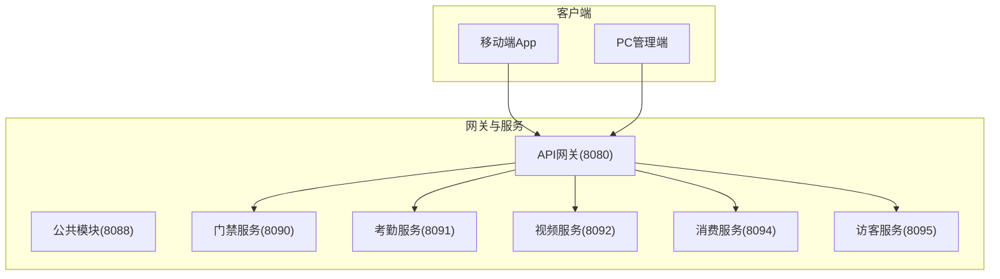
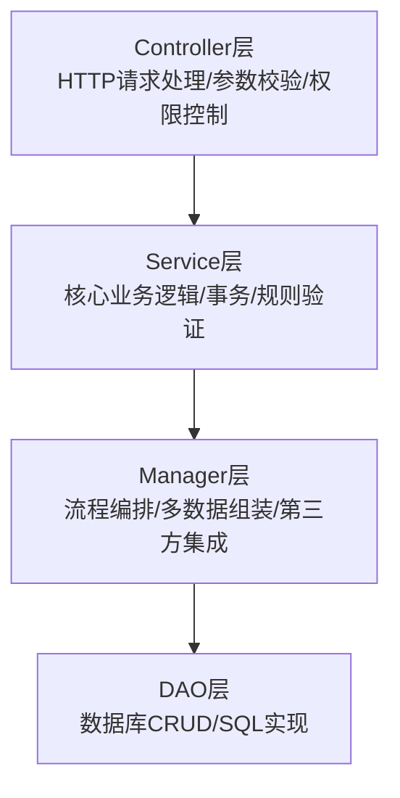
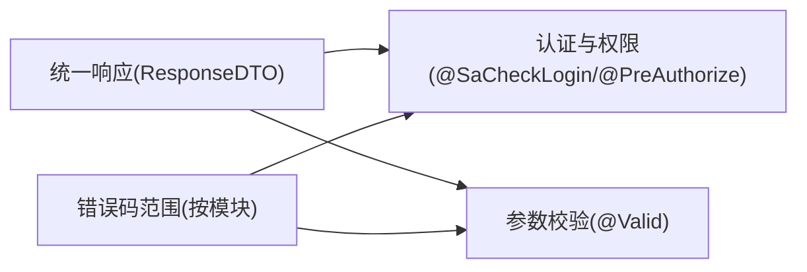

# API参考

<cite>
**本文引用的文件**
- [API路径规范.md](file://documentation/01-核心规范/API路径规范.md)
- [权限命名规范.md](file://documentation/01-核心规范/权限命名规范.md)
- [API文档模板.md](file://documentation/api/API_DOCUMENTATION_TEMPLATE.md)
- [API契约索引.md](file://documentation/api/API_CONTRACT_INDEX.md)
- [门禁模块API契约.md](file://documentation/api/access/access-api-contract.md)
- [考勤模块API契约.md](file://documentation/api/attendance/attendance-api-contract.md)
- [消费模块API契约.md](file://documentation/api/consume/consume-api-contract.md)
- [访客模块API契约.md](file://documentation/api/visitor/visitor-api-contract.md)
- [视频模块API契约.md](file://documentation/api/video/video-api-contract.md)
- [AccessMobileController.java](file://microservices/ioedream-access-service/src/main/java/net/lab1024/sa/access/controller/AccessMobileController.java)
- [AccessDeviceController.java](file://microservices/ioedream-access-service/src/main/java/net/lab1024/sa/access/controller/AccessDeviceController.java)
- [AttendanceMobileController.java](file://microservices/ioedream-attendance-service/src/main/java/net/lab1024/sa/attendance/controller/AttendanceMobileController.java)
- [AttendanceRecordController.java](file://microservices/ioedream-attendance-service/src/main/java/net/lab1024/sa/attendance/controller/AttendanceRecordController.java)
- [ConsumeMobileController.java](file://microservices/ioedream-consume-service/src/main/java/net/lab1024/sa/consume/controller/ConsumeMobileController.java)
- [AccountController.java](file://microservices/ioedream-consume-service/src/main/java/net/lab1024/sa/consume/controller/AccountController.java)
- [VisitorMobileController.java](file://microservices/ioedream-visitor-service/src/main/java/net/lab1024/sa/visitor/controller/VisitorMobileController.java)
</cite>

## 目录
1. [简介](#简介)
2. [项目结构](#项目结构)
3. [核心组件](#核心组件)
4. [架构总览](#架构总览)
5. [详细组件分析](#详细组件分析)
6. [依赖分析](#依赖分析)
7. [性能考虑](#性能考虑)
8. [故障排查指南](#故障排查指南)
9. [结论](#结论)
10. [附录](#附录)

## 简介
本文件为IOE-DREAM智慧园区一卡通管理平台的统一API参考文档，覆盖门禁、考勤、消费、访客、视频五大业务模块。文档基于项目现有的API契约文档与Controller实现，统一规范RESTful风格、URL命名、HTTP方法使用、请求/响应格式、认证与权限控制，并提供各模块端点的完整说明与使用示例。

## 项目结构
- 微服务架构：包含门禁、考勤、消费、访客、视频等独立服务，均采用Spring Boot + Sa-Token鉴权 + OpenAPI(Swagger)注解。
- API路径规范：Controller层使用@RequestMapping定义模块路径，不带/api或/v1前缀；查询类接口优先使用GET /list、/tree、/detail/{id}；写入类接口优先使用POST /add、/update、/delete/{id}。
- 统一响应格式：所有接口返回ResponseDTO<T>，包含code、message、data、timestamp字段。
- 权限控制：移动端接口使用@SaCheckLogin与@SaCheckPermission；PC端接口使用@PreAuthorize基于角色权限。

图表来源
- [API路径规范.md](file://documentation/01-核心规范/API路径规范.md#L20-L47)

章节来源
- [API路径规范.md](file://documentation/01-核心规范/API路径规范.md#L1-L120)
- [API契约索引.md](file://documentation/api/API_CONTRACT_INDEX.md#L1-L120)

## 核心组件
- 统一响应格式
  - 字段：code、message、data、timestamp
  - 成功状态码：200表示成功
  - 参考：[API契约索引.md](file://documentation/api/API_CONTRACT_INDEX.md#L190-L210)
- 统一错误码范围
  - 消费模块：4000-4999
  - 门禁模块：5000-5999
  - 考勤模块：6000-6999
  - 访客模块：7000-7999
  - 视频模块：8000-8999
  - 参考：[API契约索引.md](file://documentation/api/API_CONTRACT_INDEX.md#L206-L216)
- 认证与权限
  - 移动端：@SaCheckLogin（登录校验），@SaCheckPermission（权限校验）
  - PC端：@PreAuthorize（基于角色）
  - 参考：[API契约索引.md](file://documentation/api/API_CONTRACT_INDEX.md#L216-L226)
- 参数校验
  - 所有POST/PUT请求使用@Valid进行参数校验，结合Jakarta Validation注解
  - 参考：[API契约索引.md](file://documentation/api/API_CONTRACT_INDEX.md#L221-L226)

章节来源
- [API契约索引.md](file://documentation/api/API_CONTRACT_INDEX.md#L190-L226)

## 架构总览
- 控制器层：负责HTTP请求处理、参数校验、权限控制
- 业务层：核心业务逻辑、事务管理、业务规则验证
- 管理层：复杂流程编排、多数据组装、第三方服务集成
- 数据访问层：数据库CRUD操作、SQL查询实现

图表来源
- [API路径规范.md](file://documentation/01-核心规范/API路径规范.md#L48-L66)

章节来源
- [API路径规范.md](file://documentation/01-核心规范/API路径规范.md#L48-L66)

## 详细组件分析

### 门禁模块API
- 基础路径
  - 移动端：/api/v1/mobile/access
  - PC端：/api/v1/access（部分接口规划中）
- 移动端接口
  - 门禁检查：POST /api/v1/mobile/access/check
  - 二维码验证：POST /api/v1/mobile/access/qr/verify
  - NFC验证：POST /api/v1/mobile/access/nfc/verify
  - 生物识别验证：POST /api/v1/mobile/access/biometric/verify
  - 获取附近设备：GET /api/v1/mobile/access/devices/nearby
  - 获取用户权限：GET /api/v1/mobile/access/permissions/{userId}
  - 获取访问记录：GET /api/v1/mobile/access/records/{userId}
  - 获取区域列表：GET /api/v1/mobile/access/areas
  - 临时开门申请：POST /api/v1/mobile/access/temporary-access
  - 实时门禁状态：GET /api/v1/mobile/access/status/realtime
  - 推送通知：POST /api/v1/mobile/access/notification/push
- PC端接口（规划中）
  - 设备管理：/api/v1/access/device（query、{id}、add、update、delete、status/update）
  - 权限管理：/api/v1/access/permission（grant、revoke、batch/grant、batch/revoke）
  - 记录查询：/api/v1/access/record（query）

统一响应与错误码
- 统一响应格式：参考[API契约索引.md](file://documentation/api/API_CONTRACT_INDEX.md#L190-L210)
- 错误码范围：门禁模块5000-5999，参考[API契约索引.md](file://documentation/api/API_CONTRACT_INDEX.md#L206-L216)

认证与权限
- 移动端：@SaCheckLogin；部分接口@SaCheckPermission
- PC端：@PreAuthorize（角色权限）

请求/响应示例（以“门禁检查”为例）
- URL：POST /api/v1/mobile/access/check
- 请求头：Content-Type: application/json
- 请求体（JSON Schema）：
  - userId: integer
  - deviceId: integer
  - areaId: integer
  - verificationType: string（枚举：CARD、FACE、FINGERPRINT、QR_CODE）
  - location: string（可选）
- 响应体（JSON Schema）：
  - code: integer
  - message: string
  - data: boolean
  - timestamp: integer
- 使用示例（curl）
  - curl -X POST "http://<host>/api/v1/mobile/access/check" \
    -H "Content-Type: application/json" \
    -H "Authorization: Bearer {token}" \
    -d '{"userId":1001,"deviceId":1,"areaId":1,"verificationType":"CARD"}'

章节来源
- [门禁模块API契约.md](file://documentation/api/access/access-api-contract.md#L1-L120)
- [AccessMobileController.java](file://microservices/ioedream-access-service/src/main/java/net/lab1024/sa/access/controller/AccessMobileController.java#L61-L100)
- [AccessDeviceController.java](file://microservices/ioedream-access-service/src/main/java/net/lab1024/sa/access/controller/AccessDeviceController.java#L74-L120)

### 考勤模块API
- 基础路径
  - 移动端：/api/attendance/mobile
  - PC端：/api/attendance（部分接口规划中）
- 移动端接口
  - GPS定位打卡：POST /api/attendance/mobile/gps-punch
  - 位置验证：POST /api/attendance/mobile/location/validate
  - 离线数据缓存：POST /api/attendance/mobile/offline/cache
  - 离线数据同步：POST /api/attendance/mobile/offline/sync/{employeeId}
- PC端接口（规划中）
  - 考勤记录查询：/api/attendance/record（query）
  - 考勤统计：/api/attendance/statistics（daily、monthly、department、employee）
  - 请假管理：/api/attendance/leave（submit、query）
  - 加班管理：/api/attendance/overtime（submit）
  - 出差管理：/api/attendance/travel（submit）
  - 补卡管理：/api/attendance/supplement（submit）
  - 班次管理：/api/attendance/shift（list）

统一响应与错误码
- 统一响应格式：参考[API契约索引.md](file://documentation/api/API_CONTRACT_INDEX.md#L486-L497)
- 错误码范围：考勤模块6000-6999，参考[API契约索引.md](file://documentation/api/API_CONTRACT_INDEX.md#L500-L507)

认证与权限
- 移动端：@SaCheckLogin与@SaCheckPermission（如attendance:punch:gps等）
- PC端：@PreAuthorize（角色权限）

请求/响应示例（以“GPS定位打卡”为例）
- URL：POST /api/attendance/mobile/gps-punch
- 请求头：Content-Type: application/json
- 请求体（JSON Schema）：
  - employeeId: integer
  - latitude: number
  - longitude: number
  - photoUrl: string（可选）
  - address: string（可选）
- 响应体（JSON Schema）同统一响应格式
- 使用示例（curl）
  - curl -X POST "http://<host>/api/attendance/mobile/gps-punch" \
    -H "Content-Type: application/json" \
    -H "Authorization: Bearer {token}" \
    -d '{"employeeId":1001,"latitude":39.9042,"longitude":116.4074}'

章节来源
- [考勤模块API契约.md](file://documentation/api/attendance/attendance-api-contract.md#L1-L120)
- [AttendanceMobileController.java](file://microservices/ioedream-attendance-service/src/main/java/net/lab1024/sa/attendance/controller/AttendanceMobileController.java#L57-L111)

### 消费模块API
- 基础路径：/api/v1/consume
- 移动端接口
  - 快速消费：POST /api/v1/consume/mobile/transaction/quick
  - 扫码消费：POST /api/v1/consume/mobile/transaction/scan
  - NFC消费：POST /api/v1/consume/mobile/transaction/nfc
  - 人脸识别消费：POST /api/v1/consume/mobile/transaction/face
  - 快速用户查询：GET /api/v1/consume/mobile/user/quick
  - 用户消费信息：GET /api/v1/consume/mobile/user/consume-info/{userId}
  - 有效餐别：GET /api/v1/consume/mobile/meal/available
  - 设备配置：GET /api/v1/consume/mobile/device/config/{deviceId}
  - 设备今日统计：GET /api/v1/consume/mobile/device/today-stats/{deviceId}
  - 实时交易汇总：GET /api/v1/consume/mobile/transaction/summary
  - 离线交易同步：POST /api/v1/consume/mobile/sync/offline
  - 获取同步数据：GET /api/v1/consume/mobile/sync/data/{deviceId}
  - 权限验证：POST /api/v1/consume/mobile/validate/permission
  - 用户统计：GET /api/v1/consume/mobile/stats/{userId}
- PC端接口（规划中）
  - 交易记录查询：/api/v1/consume/transaction（query）
  - 账户管理：/api/v1/consume/account（add、{id}、update、delete、query、balance/*、status/*）
  - 报表统计：/api/v1/consume/report（generate、export、templates、statistics）
  - 支付相关：/api/v1/consume/payment（create、callback/{paymentMethod}、order/{orderNo}）
  - 对账：/api/v1/consume/reconciliation（daily、realtime、history）
  - 退款/报销：/api/v1/consume/refund（submit、{refundNo}/status）、/api/v1/consume/reimbursement（submit、{reimbursementNo}/status）

统一响应与错误码
- 统一响应格式：参考[API契约索引.md](file://documentation/api/API_CONTRACT_INDEX.md#L190-L210)
- 错误码范围：消费模块4000-4999，参考[API契约索引.md](file://documentation/api/API_CONTRACT_INDEX.md#L206-L216)

认证与权限
- 移动端：@SaCheckLogin
- PC端：@PreAuthorize（角色权限）

请求/响应示例（以“快速消费”为例）
- URL：POST /api/v1/consume/mobile/transaction/quick
- 请求头：Content-Type: application/json
- 请求体（JSON Schema）：
  - deviceId: integer
  - userId: integer
  - amount: number
  - consumeMode: string（可选，枚举：FIXED、AMOUNT、PRODUCT、COUNT）
  - remark: string（可选）
- 响应体（JSON Schema）：
  - code: integer
  - message: string
  - data: object（包含transactionNo、success、message、balance、consumeAmount）
  - timestamp: integer
- 使用示例（curl）
  - curl -X POST "http://<host>/api/v1/consume/mobile/transaction/quick" \
    -H "Content-Type: application/json" \
    -H "Authorization: Bearer {token}" \
    -d '{"deviceId":1,"userId":1001,"amount":10.00}'

章节来源
- [消费模块API契约.md](file://documentation/api/consume/consume-api-contract.md#L1-L120)
- [ConsumeMobileController.java](file://microservices/ioedream-consume-service/src/main/java/net/lab1024/sa/consume/controller/ConsumeMobileController.java#L69-L125)

### 访客模块API
- 基础路径
  - 移动端：/api/v1/mobile/visitor
  - PC端：/api/v1/visitor（部分接口规划中）
- 移动端接口
  - 预约详情：GET /api/v1/mobile/visitor/appointment/{appointmentId}
  - 签到状态：GET /api/v1/mobile/visitor/checkin/status/{appointmentId}
  - 创建预约：POST /api/v1/mobile/visitor/appointment
  - 访客签到：POST /api/v1/mobile/visitor/checkin/{appointmentId}
  - 访客签退：POST /api/v1/mobile/visitor/checkout/{appointmentId}
  - 查询访客记录：GET /api/v1/mobile/visitor/records
  - 查询我的预约：GET /api/v1/mobile/visitor/my-appointments
  - 获取统计数据：GET /api/v1/mobile/visitor/statistics
  - 更新预约状态：PUT /api/v1/mobile/visitor/appointment/{appointmentId}/status
  - OCR识别身份证：POST /api/v1/mobile/visitor/ocr/idcard
- PC端接口（规划中）
  - 访客记录查询：/api/v1/visitor/record（query）
  - 预约管理：/api/v1/visitor/appointment（query、{id}、add、update、delete、approve、reject）
  - 统计报表：/api/v1/visitor/statistics（daily、monthly、department、export）

统一响应与错误码
- 统一响应格式：参考[API契约索引.md](file://documentation/api/API_CONTRACT_INDEX.md#L339-L351)
- 错误码范围：访客模块7000-7999，参考[API契约索引.md](file://documentation/api/API_CONTRACT_INDEX.md#L353-L360)

认证与权限
- 移动端：@SaCheckLogin
- PC端：@PreAuthorize（角色权限）

请求/响应示例（以“创建预约”为例）
- URL：POST /api/v1/mobile/visitor/appointment
- 请求头：Content-Type: application/json
- 请求体（JSON Schema）：
  - visitorName: string
  - visitorPhone: string
  - visitorIdCard: string（可选）
  - hostUserId: integer
  - hostName: string
  - visitPurpose: string
  - visitDate: string（yyyy-MM-dd）
  - visitStartTime: string（HH:mm）
  - visitEndTime: string（HH:mm）
  - areaIds: array（可选）
  - deviceIds: array（可选）
  - remark: string（可选）
  - attachments: array（可选）
- 响应体（JSON Schema）：
  - code: integer
  - message: string
  - data: object（包含appointmentId、appointmentNo、qrCode、status、message）
  - timestamp: integer
- 使用示例（curl）
  - curl -X POST "http://<host>/api/v1/mobile/visitor/appointment" \
    -H "Content-Type: application/json" \
    -H "Authorization: Bearer {token}" \
    -d '{"visitorName":"张三","visitorPhone":"13800001111","hostUserId":1001,...}'

章节来源
- [访客模块API契约.md](file://documentation/api/visitor/visitor-api-contract.md#L1-L120)
- [VisitorMobileController.java](file://microservices/ioedream-visitor-service/src/main/java/net/lab1024/sa/visitor/controller/VisitorMobileController.java#L108-L139)

### 视频模块API
- 基础路径：/api/v1/video（移动端与PC端规划中）
- 移动端接口（规划中）
  - 设备列表：GET /api/v1/mobile/video/device/list
  - 设备详情：GET /api/v1/mobile/video/device/{deviceId}
  - 视频流地址：POST /api/v1/mobile/video/play/stream
  - 截图获取：GET /api/v1/mobile/video/device/{deviceId}/snapshot
  - 录像列表：POST /api/v1/mobile/video/playback/query
  - 录像播放：POST /api/v1/mobile/video/playback/stream
  - PTZ控制：POST /api/v1/mobile/video/ptz/control
  - PTZ预设位：GET /api/v1/mobile/video/ptz/presets/{deviceId}、POST /api/v1/mobile/video/ptz/preset/call
  - AI分析：GET /api/v1/mobile/video/ai/analysis/{deviceId}
- PC端接口（规划中）
  - 设备管理：/api/v1/video/device（query、{id}、add、update、delete、status/update、test/connection）
  - 多画面监控：/api/v1/video/monitor（multi-view、tv-wall/control）
  - 录像管理：/api/v1/video/record（query、download）
  - AI分析：/api/v1/video/ai（analysis/query、statistics）

统一响应与错误码
- 统一响应格式：参考[API契约索引.md](file://documentation/api/API_CONTRACT_INDEX.md#L480-L492)
- 错误码范围：视频模块8000-8999，参考[API契约索引.md](file://documentation/api/API_CONTRACT_INDEX.md#L494-L501)

章节来源
- [视频模块API契约.md](file://documentation/api/video/video-api-contract.md#L1-L120)

## 依赖分析
- 统一响应与错误码
  - 所有模块遵循统一响应格式与错误码范围，便于前端统一处理
- 认证与权限
  - 移动端统一使用Sa-Token登录校验与权限校验
  - PC端统一使用Spring Security基于角色的权限控制
- 参数校验
  - 所有写入类接口均使用@Valid进行参数校验，减少无效请求进入业务层

图表来源
- [API契约索引.md](file://documentation/api/API_CONTRACT_INDEX.md#L190-L226)

章节来源
- [API契约索引.md](file://documentation/api/API_CONTRACT_INDEX.md#L190-L226)

## 性能考虑
- 分页查询优先使用GET /list或POST /query，避免超大分页导致内存压力
- 批量查询使用POST /batch/search，减少多次网络往返
- 离线数据同步采用批量提交，降低频繁请求开销
- 设备状态与实时统计接口建议缓存热点数据，减少数据库压力

## 故障排查指南
- 统一响应格式
  - 成功：code=200，message为操作提示，data为业务数据
  - 失败：code为具体错误码（参考模块错误码范围），message为错误说明
- 常见错误
  - 400系列：参数错误、未授权、禁止访问
  - 500系列：服务器内部错误
- 模块错误码范围
  - 消费模块：4000-4999
  - 门禁模块：5000-5999
  - 考勤模块：6000-6999
  - 访客模块：7000-7999
  - 视频模块：8000-8999

章节来源
- [API契约索引.md](file://documentation/api/API_CONTRACT_INDEX.md#L206-L226)

## 结论
本API参考文档基于现有契约与Controller实现，统一了RESTful风格、URL命名、HTTP方法使用、请求/响应格式、认证与权限控制，并覆盖门禁、考勤、消费、访客、视频五大模块的公共接口。建议在后续迭代中逐步完善PC端规划接口与视频模块接口，确保前后端一致性和可维护性。

## 附录
- API路径规范要点
  - 不加/api或/v1前缀
  - 查询类接口优先GET /list、/tree、/detail/{id}
  - 写入类接口优先POST /add、/update、/delete/{id}
  - 参考：[API路径规范.md](file://documentation/01-核心规范/API路径规范.md#L163-L251)
- 权限命名规范
  - 格式：{domain}:{module}:{action}
  - 参考：[权限命名规范.md](file://documentation/01-核心规范/权限命名规范.md#L11-L26)

章节来源
- [API路径规范.md](file://documentation/01-核心规范/API路径规范.md#L163-L251)
- [权限命名规范.md](file://documentation/01-核心规范/权限命名规范.md#L11-L26)