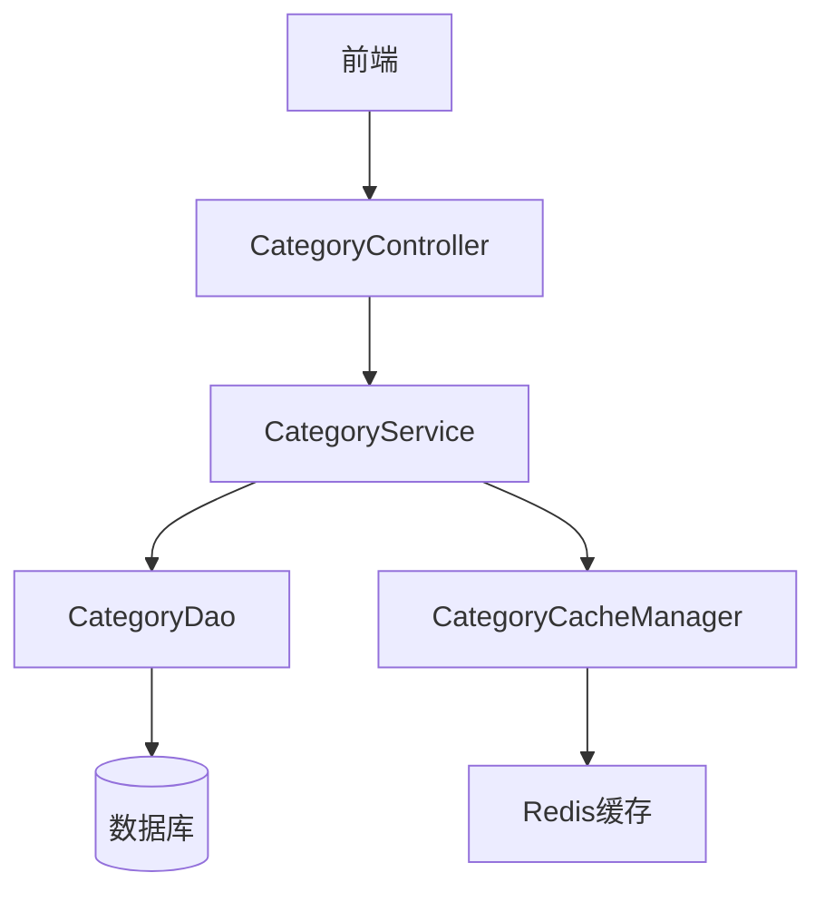
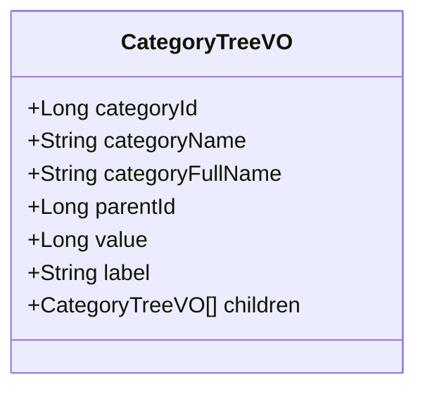
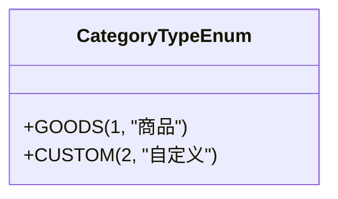
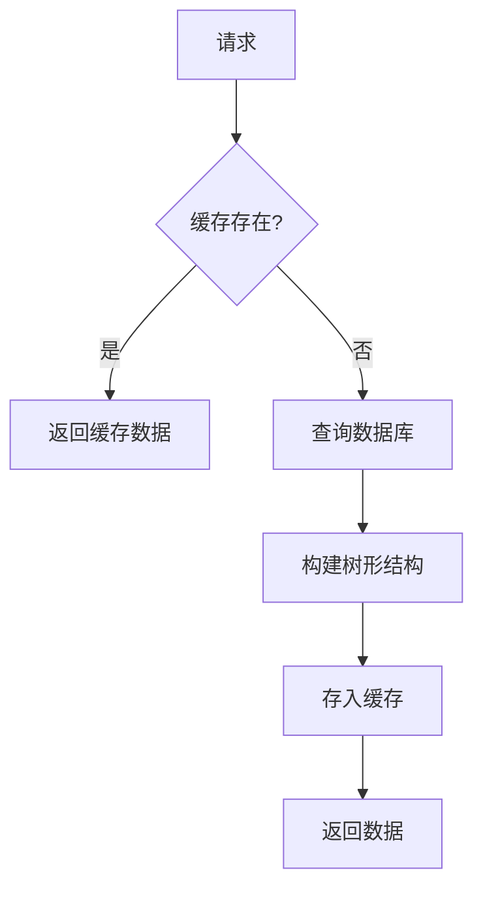
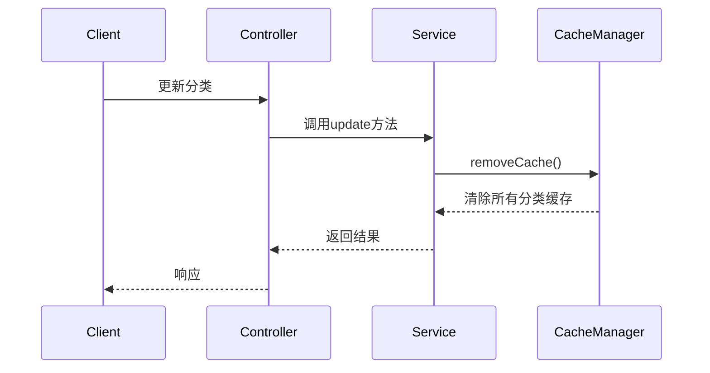

# 商品分类API

<cite>
**本文档引用文件**  
- [CategoryController.java](file://smart-admin-api-java17-springboot3\sa-admin\src\main\java\net\lab1024\sa\admin\module\business\category\controller\CategoryController.java)
- [category-api.js](file://smart-admin-web-javascript\src\api\business\category\category-api.js)
- [CategoryService.java](file://smart-admin-api-java17-springboot3\sa-admin\src\main\java\net\lab1024\sa\admin\module\business\category\service\CategoryService.java)
- [CategoryCacheManager.java](file://smart-admin-api-java17-springboot3\sa-admin\src\main\java\net\lab1024\sa\admin\module\business\category\manager\CategoryCacheManager.java)
- [CategoryTypeEnum.java](file://smart-admin-api-java17-springboot3\sa-admin\src\main\java\net\lab1024\sa\admin\module\business\category\constant\CategoryTypeEnum.java)
- [CategoryAddForm.java](file://smart-admin-api-java17-springboot3\sa-admin\src\main\java\net\lab1024\sa\admin\module\business\category\domain\form\CategoryAddForm.java)
- [CategoryUpdateForm.java](file://smart-admin-api-java17-springboot3\sa-admin\src\main\java\net\lab1024\sa\admin\module\business\category\domain\form\CategoryUpdateForm.java)
- [CategoryTreeVO.java](file://smart-admin-api-java17-springboot3\sa-admin\src\main\java\net\lab1024\sa\admin\module\business\category\domain\vo\CategoryTreeVO.java)
- [CategoryEntity.java](file://smart-admin-api-java17-springboot3\sa-admin\src\main\java\net\lab1024\sa\admin\module\business\category\domain\entity\CategoryEntity.java)
- [CategoryDao.java](file://smart-admin-api-java17-springboot3\sa-admin\src\main\java\net\lab1024\sa\admin\module\business\category\dao\CategoryDao.java)
</cite>

## 目录
1. [商品分类API概述](#商品分类api概述)
2. [核心功能与架构](#核心功能与架构)
3. [API端点详细说明](#api端点详细说明)
4. [请求参数与数据结构](#请求参数与数据结构)
5. [响应格式与错误码](#响应格式与错误码)
6. [前端调用示例](#前端调用示例)
7. [分类类型与业务规则](#分类类型与业务规则)
8. [排序逻辑与状态管理](#排序逻辑与状态管理)
9. [缓存机制与性能优化](#缓存机制与性能优化)
10. [最佳实践与注意事项](#最佳实践与注意事项)

## 商品分类API概述

商品分类API提供了一套完整的树形结构分类管理功能，支持商品类目的增删改查操作。该API基于Spring Boot框架构建，采用RESTful设计风格，通过`CategoryController`控制器暴露多个端点，实现了对商品分类的全面管理。系统支持多级嵌套的树形结构，能够满足复杂商品分类体系的需求。

**本节来源**  
- [CategoryController.java](file://smart-admin-api-java17-springboot3\sa-admin\src\main\java\net\lab1024\sa\admin\module\business\category\controller\CategoryController.java#L1-L35)

## 核心功能与架构

商品分类系统采用分层架构设计，包含控制器层、服务层、数据访问层和缓存管理层。`CategoryController`作为入口，接收HTTP请求并调用`CategoryService`进行业务处理。`CategoryService`负责核心业务逻辑，包括数据校验、权限控制和事务管理。`CategoryDao`通过MyBatis Plus实现与数据库的交互，而`CategoryCacheManager`则提供了高效的缓存机制，显著提升了树形结构查询的性能。



**图示来源**  
- [CategoryController.java](file://smart-admin-api-java17-springboot3\sa-admin\src\main\java\net\lab1024\sa\admin\module\business\category\controller\CategoryController.java)
- [CategoryService.java](file://smart-admin-api-java17-springboot3\sa-admin\src\main\java\net\lab1024\sa\admin\module\business\category\service\CategoryService.java)
- [CategoryDao.java](file://smart-admin-api-java17-springboot3\sa-admin\src\main\java\net\lab1024\sa\admin\module\business\category\dao\CategoryDao.java)
- [CategoryCacheManager.java](file://smart-admin-api-java17-springboot3\sa-admin\src\main\java\net\lab1024\sa\admin\module\business\category\manager\CategoryCacheManager.java)

**本节来源**  
- [CategoryController.java](file://smart-admin-api-java17-springboot3\sa-admin\src\main\java\net\lab1024\sa\admin\module\business\category\controller\CategoryController.java)
- [CategoryService.java](file://smart-admin-api-java17-springboot3\sa-admin\src\main\java\net\lab1024\sa\admin\module\business\category\service\CategoryService.java)

## API端点详细说明

### 创建分类 (POST /category/add)

用于创建新的商品分类。客户端需要提供分类名称、类型、父级ID等信息。系统会自动校验分类名称的唯一性，并确保父级分类存在且类型匹配。

**本节来源**  
- [CategoryController.java](file://smart-admin-api-java17-springboot3\sa-admin\src\main\java\net\lab1024\sa\admin\module\business\category\controller\CategoryController.java#L36-L41)

### 更新分类 (POST /category/update)

用于更新现有分类的信息。支持修改分类名称、排序、备注和禁用状态，但不允许更改分类类型和父级关系，以保证分类树的稳定性。

**本节来源**  
- [CategoryController.java](file://smart-admin-api-java17-springboot3\sa-admin\src\main\java\net\lab1024\sa\admin\module\business\category\controller\CategoryController.java#L43-L48)

### 删除分类 (GET /category/delete/{categoryId})

用于删除指定的分类。删除前会检查该分类是否存在子分类，如果存在子分类则不允许删除，确保数据完整性。

**本节来源**  
- [CategoryController.java](file://smart-admin-api-java17-springboot3\sa-admin\src\main\java\net\lab1024\sa\admin\module\business\category\controller\CategoryController.java#L63-L68)

### 获取分类树 (POST /category/tree)

用于获取分类的层级树结构。支持按分类类型和父级ID进行过滤，返回完整的树形结构数据，包含每个节点的完整路径名称。

**本节来源**  
- [CategoryController.java](file://smart-admin-api-java17-springboot3\sa-admin\src\main\java\net\lab1024\sa\admin\module\business\category\controller\CategoryController.java#L56-L61)

## 请求参数与数据结构

### CategoryAddForm 结构

| 字段 | 类型 | 必填 | 描述 | 约束 |
|------|------|------|------|------|
| categoryName | String | 是 | 分类名称 | 最多20字符 |
| categoryType | Integer | 是 | 分类类型 | 必须为有效类型值 |
| parentId | Long | 否 | 父级分类ID | 可为空，表示根节点 |
| sort | Integer | 否 | 排序值 | 数字越大越靠前 |
| remark | String | 否 | 备注信息 | 最多200字符 |
| disabledFlag | Boolean | 是 | 禁用状态 | true表示禁用 |

**本节来源**  
- [CategoryAddForm.java](file://smart-admin-api-java17-springboot3\sa-admin\src\main\java\net\lab1024\sa\admin\module\business\category\domain\form\CategoryAddForm.java)

### CategoryUpdateForm 结构

继承自`CategoryAddForm`，额外包含`categoryId`字段，用于标识要更新的分类。

| 字段 | 类型 | 必填 | 描述 |
|------|------|------|------|
| categoryId | Long | 是 | 分类ID |

**本节来源**  
- [CategoryUpdateForm.java](file://smart-admin-api-java17-springboot3\sa-admin\src\main\java\net\lab1024\sa\admin\module\business\category\domain\form\CategoryUpdateForm.java)

### CategoryTreeQueryForm 结构

| 字段 | 类型 | 必填 | 描述 |
|------|------|------|------|
| categoryType | Integer | 否 | 分类类型 | 用于过滤特定类型的分类树 |
| parentId | Long | 否 | 父级ID | 用于获取指定节点下的子树 |

**本节来源**  
- [CategoryTreeQueryForm.java](file://smart-admin-api-java17-springboot3\sa-admin\src\main\java\net\lab1024\sa\admin\module\business\category\domain\form\CategoryTreeQueryForm.java)

## 响应格式与错误码

### CategoryTreeVO 响应结构



**图示来源**  
- [CategoryTreeVO.java](file://smart-admin-api-java17-springboot3\sa-admin\src\main\java\net\lab1024\sa\admin\module\business\category\domain\vo\CategoryTreeVO.java)

**本节来源**  
- [CategoryTreeVO.java](file://smart-admin-api-java17-springboot3\sa-admin\src\main\java\net\lab1024\sa\admin\module\business\category\domain\vo\CategoryTreeVO.java)

### 标准响应格式

所有API端点返回统一的`ResponseDTO<T>`格式：
- `ok`: 布尔值，表示请求是否成功
- `data`: 泛型数据，包含实际返回内容
- `code`: 状态码
- `msg`: 消息描述

### 常见错误码

| 错误码 | 描述 | 场景 |
|--------|------|------|
| DATA_NOT_EXIST | 数据不存在 | 请求的分类ID不存在 |
| USER_ERROR_PARAM | 参数错误 | 输入参数验证失败 |
| PERMISSION_DENIED | 权限不足 | 用户无权执行操作 |

**本节来源**  
- [CategoryController.java](file://smart-admin-api-java17-springboot3\sa-admin\src\main\java\net\lab1024\sa\admin\module\business\category\controller\CategoryController.java)
- [CategoryService.java](file://smart-admin-api-java17-springboot3\sa-admin\src\main\java\net\lab1024\sa\admin\module\business\category\service\CategoryService.java)

## 前端调用示例

### 添加分类

```javascript
categoryApi.addCategory({
  categoryName: '电子产品',
  categoryType: 1,
  parentId: null,
  sort: 1,
  remark: '主要电子商品分类',
  disabledFlag: false
}).then(response => {
  console.log('分类创建成功');
});
```

### 获取分类树

```javascript
categoryApi.queryCategoryTree({
  categoryType: 1,
  parentId: 0
}).then(response => {
  console.log('分类树:', response.data);
  // 处理树形结构数据
});
```

### 更新分类

```javascript
categoryApi.updateCategory({
  categoryId: 123,
  categoryName: '消费电子',
  sort: 2,
  disabledFlag: false
}).then(response => {
  console.log('分类更新成功');
});
```

### 删除分类

```javascript
categoryApi.deleteCategoryById(123).then(response => {
  console.log('分类删除成功');
});
```

**本节来源**  
- [category-api.js](file://smart-admin-web-javascript\src\api\business\category\category-api.js)

## 分类类型与业务规则

### CategoryTypeEnum 枚举



**图示来源**  
- [CategoryTypeEnum.java](file://smart-admin-api-java17-springboot3\sa-admin\src\main\java\net\lab1024\sa\admin\module\business\category\constant\CategoryTypeEnum.java)

**本节来源**  
- [CategoryTypeEnum.java](file://smart-admin-api-java17-springboot3\sa-admin\src\main\java\net\lab1024\sa\admin\module\business\category\constant\CategoryTypeEnum.java)

### 业务规则

1. **类型一致性**：子分类必须与其父分类具有相同的类型
2. **循环引用检测**：禁止将分类设置为其自身的父级
3. **唯一性约束**：同一父级下的分类名称必须唯一
4. **根节点处理**：没有父级的分类被视为根节点，其父级ID为0

**本节来源**  
- [CategoryService.java](file://smart-admin-api-java17-springboot3\sa-admin\src\main\java\net\lab1024\sa\admin\module\business\category\service\CategoryService.java#L106-L148)

## 排序逻辑与状态管理

### 排序机制

- 分类默认按`sort`字段进行升序排列
- `sort`值越小，排序越靠前
- 如果未指定`sort`值，默认为0
- 支持通过更新操作调整分类顺序

### 状态管理

- `disabledFlag`: 控制分类的启用/禁用状态
- `deletedFlag`: 软删除标记，用于逻辑删除
- 禁用的分类在前端通常显示为灰色或不可选
- 删除操作为软删除，保留数据完整性

**本节来源**  
- [CategoryEntity.java](file://smart-admin-api-java17-springboot3\sa-admin\src\main\java\net\lab1024\sa\admin\module\business\category\domain\entity\CategoryEntity.java)
- [CategoryService.java](file://smart-admin-api-java17-springboot3\sa-admin\src\main\java\net\lab1024\sa\admin\module\business\category\service\CategoryService.java)

## 缓存机制与性能优化

### 缓存策略

系统采用三级缓存机制，显著提升分类树查询性能：



**图示来源**  
- [CategoryCacheManager.java](file://smart-admin-api-java17-springboot3\sa-admin\src\main\java\net\lab1024\sa\admin\module\business\category\manager\CategoryCacheManager.java)

### 缓存键定义

- `CATEGORY_ENTITY`: 单个分类实体缓存
- `CATEGORY_SUB`: 分类子级列表缓存
- `CATEGORY_TREE`: 完整分类树缓存

### 缓存更新策略

任何对分类的增删改操作都会触发缓存清除：



**图示来源**  
- [CategoryCacheManager.java](file://smart-admin-api-java17-springboot3\sa-admin\src\main\java\net\lab1024\sa\admin\module\business\category\manager\CategoryCacheManager.java#L42-L45)
- [CategoryService.java](file://smart-admin-api-java17-springboot3\sa-admin\src\main\java\net\lab1024\sa\admin\module\business\category\service\CategoryService.java#L65-L66)

**本节来源**  
- [CategoryCacheManager.java](file://smart-admin-api-java17-springboot3\sa-admin\src\main\java\net\lab1024\sa\admin\module\business\category\manager\CategoryCacheManager.java)
- [CategoryService.java](file://smart-admin-api-java17-springboot3\sa-admin\src\main\java\net\lab1024\sa\admin\module\business\category\service\CategoryService.java)

## 最佳实践与注意事项

1. **批量操作**：避免频繁的单个分类操作，尽量使用批量接口
2. **缓存预热**：在系统启动或大量数据导入后，考虑预热分类缓存
3. **权限控制**：确保对分类操作的权限校验严格，防止越权访问
4. **数据一致性**：在分布式环境下，注意缓存与数据库的一致性问题
5. **性能监控**：监控分类树查询的响应时间，及时发现性能瓶颈

**本节来源**  
- [CategoryController.java](file://smart-admin-api-java17-springboot3\sa-admin\src\main\java\net\lab1024\sa\admin\module\business\category\controller\CategoryController.java)
- [CategoryService.java](file://smart-admin-api-java17-springboot3\sa-admin\src\main\java\net\lab1024\sa\admin\module\business\category\service\CategoryService.java)
- [CategoryCacheManager.java](file://smart-admin-api-java17-springboot3\sa-admin\src\main\java\net\lab1024\sa\admin\module\business\category\manager\CategoryCacheManager.java)