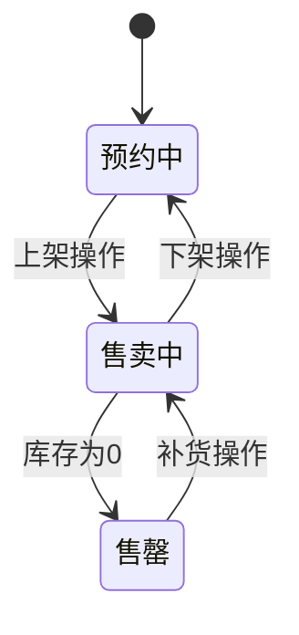

# 商品管理API

<cite>
**本文档引用文件**  
- [GoodsController.java](file://smart-admin-api-java17-springboot3\sa-admin\src\main\java\net\lab1024\sa\admin\module\business\goods\controller\GoodsController.java)
- [GoodsAddForm.java](file://smart-admin-api-java17-springboot3\sa-admin\src\main\java\net\lab1024\sa\admin\module\business\goods\domain\form\GoodsAddForm.java)
- [GoodsQueryForm.java](file://smart-admin-api-java17-springboot3\sa-admin\src\main\java\net\lab1024\sa\admin\module\business\goods\domain\form\GoodsQueryForm.java)
- [GoodsVO.java](file://smart-admin-api-java17-springboot3\sa-admin\src\main\java\net\lab1024\sa\admin\module\business\goods\domain\vo\GoodsVO.java)
- [GoodsStatusEnum.java](file://smart-admin-api-java17-springboot3\sa-admin\src\main\java\net\lab1024\sa\admin\module\business\goods\constant\GoodsStatusEnum.java)
- [goods-api.js](file://smart-admin-web-javascript\src\api\business\goods\goods-api.js)
</cite>

## 目录
1. [商品管理API](#商品管理api)
2. [核心功能概述](#核心功能概述)
3. [接口详情](#接口详情)
4. [商品状态流转](#商品状态流转)
5. [数据校验规则](#数据校验规则)
6. [前端调用示例](#前端调用示例)
7. [业务约束说明](#业务约束说明)

## 核心功能概述

商品管理API提供完整的商品生命周期管理功能，包括商品的增删改查、分页查询、批量操作、导入导出等功能。系统通过RESTful风格的接口设计，实现了对商品信息的全面管理。

**接口特点：**
- 基于Spring Boot 3和Java 17构建
- 使用Sa-Token进行权限控制
- 支持数据校验和异常处理
- 提供Excel导入导出功能
- 支持分页查询和条件筛选

**主要功能模块：**
- 商品增删改查：实现商品的基本CRUD操作
- 分页查询：支持多条件组合查询和分页展示
- 批量操作：支持批量删除商品
- 数据导入导出：支持Excel格式的数据导入和导出

**Section sources**
- [GoodsController.java](file://smart-admin-api-java17-springboot3\sa-admin\src\main\java\net\lab1024\sa\admin\module\business\goods\controller\GoodsController.java#L35-L94)

## 接口详情

### 商品增删改查接口

#### 添加商品
- **HTTP方法**: POST
- **URL路径**: `/goods/add`
- **权限要求**: `goods:add`
- **请求体**: `GoodsAddForm`对象
- **响应**: `ResponseDTO<String>`

**请求参数说明：**
| 参数名 | 类型 | 必填 | 描述 | 校验规则 |
|-------|------|------|------|---------|
| categoryId | Long | 是 | 商品分类ID | 不为空 |
| goodsName | String | 是 | 商品名称 | 不为空 |
| goodsStatus | Integer | 是 | 商品状态 | 必须为有效状态值 |
| place | String | 是 | 产地 | 不为空 |
| price | BigDecimal | 是 | 商品价格 | 不为空且≥0 |
| shelvesFlag | Boolean | 是 | 上架状态 | 不为空 |
| remark | String | 否 | 备注 | 可选 |

**Section sources**
- [GoodsController.java](file://smart-admin-api-java17-springboot3\sa-admin\src\main\java\net\lab1024\sa\admin\module\business\goods\controller\GoodsController.java#L49-L54)
- [GoodsAddForm.java](file://smart-admin-api-java17-springboot3\sa-admin\src\main\java\net\lab1024\sa\admin\module\business\goods\domain\form\GoodsAddForm.java#L26-L56)

#### 更新商品
- **HTTP方法**: POST
- **URL路径**: `/goods/update`
- **权限要求**: `goods:update`
- **请求体**: `GoodsUpdateForm`对象
- **响应**: `ResponseDTO<String>`

**请求参数说明：**
在`GoodsAddForm`的基础上增加：
| 参数名 | 类型 | 必填 | 描述 | 校验规则 |
|-------|------|------|------|---------|
| goodsId | Long | 是 | 商品ID | 不为空 |

**Section sources**
- [GoodsController.java](file://smart-admin-api-java17-springboot3\sa-admin\src\main\java\net\lab1024\sa\admin\module\business\goods\controller\GoodsController.java#L56-L61)
- [GoodsUpdateForm.java](file://smart-admin-api-java17-springboot3\sa-admin\src\main\java\net\lab1024\sa\admin\module\business\goods\domain\form\GoodsUpdateForm.java#L17-L22)

#### 删除商品
- **HTTP方法**: GET
- **URL路径**: `/goods/delete/{goodsId}`
- **权限要求**: `goods:delete`
- **路径参数**: `goodsId` (Long)
- **响应**: `ResponseDTO<String>`

**Section sources**
- [GoodsController.java](file://smart-admin-api-java17-springboot3\sa-admin\src\main\java\net\lab1024\sa\admin\module\business\goods\controller\GoodsController.java#L63-L68)

#### 批量删除商品
- **HTTP方法**: POST
- **URL路径**: `/goods/batchDelete`
- **权限要求**: `goods:batchDelete`
- **请求体**: `ValidateList<Long>` (商品ID列表)
- **响应**: `ResponseDTO<String>`

**Section sources**
- [GoodsController.java](file://smart-admin-api-java17-springboot3\sa-admin\src\main\java\net\lab1024\sa\admin\module\business\goods\controller\GoodsController.java#L70-L75)

### 分页查询接口

- **HTTP方法**: POST
- **URL路径**: `/goods/query`
- **权限要求**: `goods:query`
- **请求体**: `GoodsQueryForm`对象
- **响应**: `ResponseDTO<PageResult<GoodsVO>>`

**请求参数说明：**
| 参数名 | 类型 | 必填 | 描述 | 校验规则 |
|-------|------|------|------|---------|
| categoryId | Integer | 否 | 商品分类 | - |
| searchWord | String | 否 | 搜索关键词 | 最多30字符 |
| goodsStatus | Integer | 否 | 商品状态 | 有效状态值 |
| place | String | 否 | 产地 | - |
| shelvesFlag | Boolean | 否 | 上架状态 | - |
| current | Long | 是 | 当前页码 | 继承自PageParam |
| pageSize | Long | 是 | 每页数量 | 继承自PageParam |

**响应结构说明：**
`GoodsVO`对象包含以下字段：
| 字段名 | 类型 | 描述 |
|-------|------|------|
| goodsId | Long | 商品ID |
| categoryId | Long | 商品分类ID |
| goodsName | String | 商品名称 |
| goodsStatus | Integer | 商品状态 |
| place | String | 产地 |
| price | BigDecimal | 商品价格 |
| shelvesFlag | Boolean | 上架状态 |
| remark | String | 备注 |
| categoryName | String | 商品分类名称 |
| createTime | LocalDateTime | 创建时间 |
| updateTime | LocalDateTime | 更新时间 |

**Section sources**
- [GoodsController.java](file://smart-admin-api-java17-springboot3\sa-admin\src\main\java\net\lab1024\sa\admin\module\business\goods\controller\GoodsController.java#L42-L47)
- [GoodsQueryForm.java](file://smart-admin-api-java17-springboot3\sa-admin\src\main\java\net\lab1024\sa\admin\module\business\goods\domain\form\GoodsQueryForm.java#L23-L45)
- [GoodsVO.java](file://smart-admin-api-java17-springboot3\sa-admin\src\main\java\net\lab1024\sa\admin\module\business\goods\domain\vo\GoodsVO.java#L21-L53)

### 导入导出接口

#### 商品导入
- **HTTP方法**: POST
- **URL路径**: `/goods/importGoods`
- **权限要求**: `goods:importGoods`
- **请求参数**: `MultipartFile` (文件)
- **响应**: `ResponseDTO<String>`

**导入文件格式要求：**
| 列名 | 类型 | 必填 | 描述 |
|------|------|------|------|
| 商品分类 | String | 是 | 分类名称 |
| 商品名称 | String | 是 | 商品名称 |
| 商品状态错误 | String | 是 | 状态描述 |
| 产地 | String | 是 | 产地信息 |
| 商品价格 | BigDecimal | 是 | 商品价格 |
| 备注 | String | 否 | 备注信息 |

**Section sources**
- [GoodsController.java](file://smart-admin-api-java17-springboot3\sa-admin\src\main\java\net\lab1024\sa\admin\module\business\goods\controller\GoodsController.java#L79-L84)
- [GoodsImportForm.java](file://smart-admin-api-java17-springboot3\sa-admin\src\main\java\net\lab1024\sa\admin\module\business\goods\domain\form\GoodsImportForm.java#L18-L37)

#### 商品导出
- **HTTP方法**: GET
- **URL路径**: `/goods/exportGoods`
- **权限要求**: `goods:exportGoods`
- **响应**: Excel文件（商品列表.xlsx）

**Section sources**
- [GoodsController.java](file://smart-admin-api-java17-springboot3\sa-admin\src\main\java\net\lab1024\sa\admin\module\business\goods\controller\GoodsController.java#L86-L92)

## 商品状态流转

商品状态由`GoodsStatusEnum`枚举定义，包含三种状态：



**状态定义：**
| 状态值 | 状态名称 | 描述 |
|-------|---------|------|
| 1 | 预约中 | 商品已创建但未上架销售 |
| 2 | 售卖中 | 商品正在销售中 |
| 3 | 售罄 | 商品已售完 |

**状态流转规则：**
1. 新建商品默认状态为"预约中"
2. "预约中"的商品可以上架变为"售卖中"
3. "售卖中"的商品当库存为0时自动变为"售罄"
4. "售罄"的商品补货后可恢复为"售卖中"
5. "售卖中"的商品可以下架变为"预约中"

**Section sources**
- [GoodsStatusEnum.java](file://smart-admin-api-java17-springboot3\sa-admin\src\main\java\net\lab1024\sa\admin\module\business\goods\constant\GoodsStatusEnum.java#L19-L37)

## 数据校验规则

系统对商品数据进行严格的校验，确保数据的完整性和准确性。

### 请求参数校验
- **通用校验**：使用Jakarta Bean Validation进行参数校验
- **空值校验**：关键字段不能为空
- **长度校验**：搜索词最多30个字符
- **数值校验**：商品价格必须≥0
- **枚举校验**：商品状态必须为有效值

### 业务逻辑校验
在`GoodsService`中实现的业务校验逻辑：
- 商品分类必须存在且有效
- 商品名称不能重复
- 价格必须为正数
- 产地信息必须填写
- 上架状态必须明确

**校验流程：**
1. 接收请求参数
2. 执行Bean Validation校验
3. 执行业务逻辑校验
4. 返回校验结果
5. 校验失败时返回具体错误信息

**Section sources**
- [GoodsAddForm.java](file://smart-admin-api-java17-springboot3\sa-admin\src\main\java\net\lab1024\sa\admin\module\business\goods\domain\form\GoodsAddForm.java#L28-L55)
- [GoodsQueryForm.java](file://smart-admin-api-java17-springboot3\sa-admin\src\main\java\net\lab1024\sa\admin\module\business\goods\domain\form\GoodsQueryForm.java#L25-L44)

## 前端调用示例

### 分页查询示例
```javascript
// 分页查询商品
const queryForm = {
  current: 1,
  pageSize: 10,
  searchWord: '手机',
  categoryId: 1,
  goodsStatus: 2,
  shelvesFlag: true
};

goodsApi.queryGoodsList(queryForm).then(res => {
  console.log('查询结果:', res.data);
});
```

### 条件筛选示例
```javascript
// 多条件组合查询
const filterQuery = {
  current: 1,
  pageSize: 20,
  searchWord: '苹果',
  place: '中国',
  goodsStatus: 2,
  shelvesFlag: true
};

goodsApi.queryGoodsList(filterQuery).then(res => {
  // 处理查询结果
});
```

### 文件上传示例
```javascript
// 商品导入
function onImportGoods() {
  const formData = new FormData();
  fileList.value.forEach((file) => {
    formData.append('file', file.originFileObj);
  });

  SmartLoading.show();
  try {
    let res = await goodsApi.importGoods(formData);
    message.success(res.msg);
  } catch (e) {
    smartSentry.captureError(e);
  } finally {
    SmartLoading.hide();
  }
}
```

### 添加商品示例
```javascript
// 添加新商品
const addForm = {
  categoryId: 1,
  goodsName: 'iPhone 15',
  goodsStatus: 1,
  place: '中国',
  price: 5999.00,
  shelvesFlag: false,
  remark: '新品预售'
};

goodsApi.addGoods(addForm).then(res => {
  if (res.ok) {
    message.success('商品添加成功');
  } else {
    message.error(res.msg);
  }
});
```

**Section sources**
- [goods-api.js](file://smart-admin-web-javascript\src\api\business\goods\goods-api.js#L10-L41)

## 业务约束说明

### 库存管理约束
- 商品状态与库存状态关联
- "售罄"状态由库存为0自动触发
- 补货操作需要手动更新商品状态
- 上架商品必须有正数库存

### 数据一致性约束
- 商品分类变更需要同步更新所有相关商品
- 删除商品前需要检查是否有未完成的订单
- 商品信息修改需要记录数据变更历史
- 批量操作需要保证事务一致性

### 安全性约束
- 所有接口都需要权限验证
- 敏感操作需要日志记录
- 文件上传需要格式和大小限制
- 数据导出需要权限控制

### 性能约束
- 分页查询默认每页20条记录
- 搜索功能支持关键词模糊匹配
- 大数据量导出需要异步处理
- 高频查询接口需要缓存机制

**Section sources**
- [GoodsController.java](file://smart-admin-api-java17-springboot3\sa-admin\src\main\java\net\lab1024\sa\admin\module\business\goods\controller\GoodsController.java#L35-L94)
- [GoodsService.java](file://smart-admin-api-java17-springboot3\sa-admin\src\main\java\net\lab1024\sa\admin\module\business\goods\service\GoodsService.java#L60-L100)