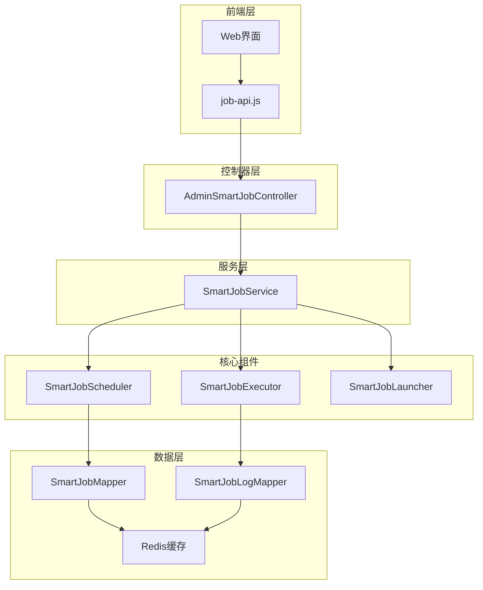
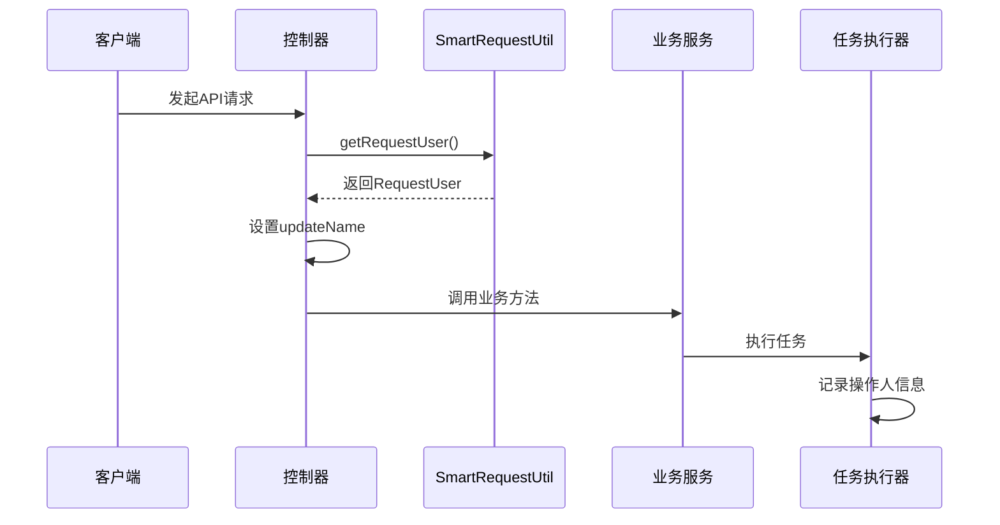

# 定时任务API文档

<cite>
**本文档中引用的文件**
- [AdminSmartJobController.java](file://smart-admin-api-java17-springboot3\sa-admin\src\main\java\net\lab1024\sa\admin\module\system\support\AdminSmartJobController.java)
- [job-api.js](file://smart-admin-web-javascript\src\api\support\job-api.js)
- [SmartJobExecuteForm.java](file://smart-admin-api-java17-springboot3\sa-base\src\main\java\net\lab1024\sa\base\module\support\job\api\domain\SmartJobExecuteForm.java)
- [SmartJobAddForm.java](file://smart-admin-api-java17-springboot3\sa-base\src\main\java\net\lab1024\sa\base\module\support\job\api\domain\SmartJobAddForm.java)
- [SmartJobUpdateForm.java](file://smart-admin-api-java17-springboot3\sa-base\src\main\java\net\lab1024\sa\base\module\support\job\api\domain\SmartJobUpdateForm.java)
- [SmartJobQueryForm.java](file://smart-admin-api-java17-springboot3\sa-base\src\main\java\net\lab1024\sa\base\module\support\job\api\domain\SmartJobQueryForm.java)
- [SmartJobLogQueryForm.java](file://smart-admin-api-java17-springboot3\sa-base\src\main\java\net\lab1024\sa\base\module\support\job\api\domain\SmartJobLogQueryForm.java)
- [SmartJobVO.java](file://smart-admin-api-java17-springboot3\sa-base\src\main\java\net\lab1024\sa\base\module\support\job\api\domain\SmartJobVO.java)
- [SmartJobLogVO.java](file://smart-admin-api-java17-springboot3\sa-base\src\main\java\net\lab1024\sa\base\module\support\job\api\domain\SmartJobLogVO.java)
- [SmartJobEnabledUpdateForm.java](file://smart-admin-api-java17-springboot3\sa-base\src\main\java\net\lab1024\sa\base\module\support\job\api\domain\SmartJobEnabledUpdateForm.java)
- [RepeatSubmit.java](file://smart-admin-api-java17-springboot3\sa-base\src\main\java\net\lab1024\sa\base\module\support\repeatsubmit\annoation\RepeatSubmit.java)
- [SmartRequestUtil.java](file://smart-admin-api-java17-springboot3\sa-base\src\main\java\net\lab1024\sa\base\common\util\SmartRequestUtil.java)
- [RequestUser.java](file://smart-admin-api-java17-springboot3\sa-base\src\main\java\net\lab1024\sa\base\common\domain\RequestUser.java)
- [ResponseDTO.java](file://smart-admin-api-java17-springboot3\sa-base\src\main\java\net\lab1024\sa\base\common\domain\ResponseDTO.java)
- [SmartJobTriggerTypeEnum.java](file://smart-admin-api-java17-springboot3\sa-base\src\main\java\net\lab1024\sa\base\module\support\job\constant\SmartJobTriggerTypeEnum.java)
</cite>

## 目录
1. [简介](#简介)
2. [核心架构](#核心架构)
3. [API端点详解](#api端点详解)
4. [数据模型说明](#数据模型说明)
5. [防重复提交机制](#防重复提交机制)
6. [任务执行上下文](#任务执行上下文)
7. [前端调用示例](#前端调用示例)
8. [错误处理](#错误处理)
9. [最佳实践](#最佳实践)

## 简介

定时任务API提供了完整的任务管理功能，支持任务的创建、执行、监控和维护。该系统基于Spring Boot构建，采用RESTful API设计，提供了强大的任务调度能力和完善的监控体系。

### 主要功能特性

- **任务生命周期管理**：支持任务的创建、修改、删除和状态控制
- **多种触发方式**：支持Cron表达式和固定间隔两种触发类型
- **实时执行控制**：支持任务的立即执行和状态切换
- **详细执行日志**：提供完整的任务执行记录和监控信息
- **防重复提交**：内置防重复提交机制确保操作安全性
- **权限追踪**：自动记录操作人和操作时间

## 核心架构



**图表来源**
- [AdminSmartJobController.java](file://smart-admin-api-java17-springboot3\sa-admin\src\main\java\net\lab1024\sa\admin\module\system\support\AdminSmartJobController.java#L19-L93)
- [SmartJobService.java](file://smart-admin-api-java17-springboot3\sa-base\src\main\java\net\lab1024\sa\base\module\support\job\api\SmartJobService.java#L71-L103)

## API端点详解

### 1. 任务立即执行

**端点信息**
- **HTTP方法**: POST
- **URL路径**: `/job/execute`
- **功能描述**: 立即执行指定的任务

**请求体结构**

| 参数名 | 类型 | 是否必填 | 描述 | 验证规则 |
|--------|------|----------|------|----------|
| jobId | Integer | 必填 | 任务ID | 不能为空 |
| param | String | 可选 | 任务参数 | 最多2000字符 |
| updateName | String | 隐藏字段 | 操作人名称 | 自动填充 |

**响应格式**
```json
{
  "code": 0,
  "level": null,
  "ok": true,
  "msg": "操作成功",
  "data": "任务已提交执行"
}
```

**使用场景**
- 手动触发任务执行
- 测试任务逻辑
- 应急处理场景

### 2. 任务详情查询

**端点信息**
- **HTTP方法**: GET
- **URL路径**: `/job/{jobId}`
- **功能描述**: 查询指定任务的详细信息

**路径参数**

| 参数名 | 类型 | 描述 |
|--------|------|------|
| jobId | Integer | 任务ID |

**响应格式**
```json
{
  "code": 0,
  "level": null,
  "ok": true,
  "msg": "操作成功",
  "data": {
    "jobId": 1,
    "jobName": "定时备份任务",
    "jobClass": "com.example.BackupJob",
    "triggerType": "cron",
    "triggerValue": "0 0/5 * * * ?",
    "param": "{\"backupType\":\"full\"}",
    "enabledFlag": true,
    "lastExecuteTime": "2024-06-25 14:30:00",
    "lastExecuteLogId": 1001,
    "remark": "每日凌晨备份数据库",
    "sort": 1,
    "updateName": "admin",
    "updateTime": "2024-06-25 14:30:00",
    "createTime": "2024-06-25 14:00:00",
    "lastJobLog": {...},
    "nextJobExecuteTimeList": ["2024-06-25 15:00:00", "2024-06-25 15:05:00"]
  }
}
```

### 3. 任务分页查询

**端点信息**
- **HTTP方法**: POST
- **URL路径**: `/job/query`
- **功能描述**: 分页查询任务列表

**请求体结构**

| 参数名 | 类型 | 是否必填 | 描述 | 验证规则 |
|--------|------|----------|------|----------|
| pageNo | Integer | 必填 | 页码 | 默认1 |
| pageSize | Integer | 必填 | 每页大小 | 默认10 |
| searchWord | String | 可选 | 搜索关键词 | 最多50字符 |
| triggerType | String | 可选 | 触发类型枚举值 | 见触发类型定义 |
| enabledFlag | Boolean | 可选 | 是否启用 |
| deletedFlag | Boolean | 可选 | 是否删除 |

**响应格式**
```json
{
  "code": 0,
  "level": null,
  "ok": true,
  "msg": "操作成功",
  "data": {
    "records": [
      {
        "jobId": 1,
        "jobName": "定时备份任务",
        "jobClass": "com.example.BackupJob",
        "triggerType": "cron",
        "triggerValue": "0 0/5 * * * ?",
        "enabledFlag": true,
        "lastExecuteTime": "2024-06-25 14:30:00",
        "remark": "每日凌晨备份数据库"
      }
    ],
    "total": 10,
    "size": 10,
    "current": 1,
    "orders": [],
    "optimizeCountSql": true,
    "searchCount": true
  }
}
```

### 4. 添加任务

**端点信息**
- **HTTP方法**: POST
- **URL路径**: `/job/add`
- **功能描述**: 创建新的定时任务

**请求体结构**

| 参数名 | 类型 | 是否必填 | 描述 | 验证规则 |
|--------|------|----------|------|----------|
| jobName | String | 必填 | 任务名称 | 不能为空，最多100字符 |
| jobClass | String | 必填 | 任务执行类 | 不能为空，最多200字符 |
| triggerType | String | 必填 | 触发类型 | 见触发类型枚举 |
| triggerValue | String | 必填 | 触发配置 | 不能为空，最多100字符 |
| param | String | 可选 | 任务参数 | 最多1000字符 |
| enabledFlag | Boolean | 必填 | 是否启用 | 不能为空 |
| remark | String | 可选 | 备注 | 最多250字符 |
| sort | Integer | 必填 | 排序 | 不能为空 |
| updateName | String | 隐藏字段 | 操作人名称 | 自动填充 |

**触发类型枚举**
- `cron`: Cron表达式触发
- `fixed_delay`: 固定间隔触发

**响应格式**
```json
{
  "code": 0,
  "level": null,
  "ok": true,
  "msg": "操作成功",
  "data": "任务创建成功"
}
```

### 5. 更新任务

**端点信息**
- **HTTP方法**: POST
- **URL路径**: `/job/update`
- **功能描述**: 更新现有任务信息

**请求体结构**

| 参数名 | 类型 | 是否必填 | 描述 | 验证规则 |
|--------|------|----------|------|----------|
| jobId | Integer | 必填 | 任务ID | 不能为空 |
| jobName | String | 必填 | 任务名称 | 不能为空，最多100字符 |
| jobClass | String | 必填 | 任务执行类 | 不能为空，最多200字符 |
| triggerType | String | 必填 | 触发类型 | 见触发类型枚举 |
| triggerValue | String | 必填 | 触发配置 | 不能为空，最多100字符 |
| param | String | 可选 | 任务参数 | 最多1000字符 |
| enabledFlag | Boolean | 必填 | 是否启用 | 不能为空 |
| remark | String | 可选 | 备注 | 最多250字符 |
| sort | Integer | 必填 | 排序 | 不能为空 |
| updateName | String | 隐藏字段 | 操作人名称 | 自动填充 |

**响应格式**
```json
{
  "code": 0,
  "level": null,
  "ok": true,
  "msg": "操作成功",
  "data": "任务更新成功"
}
```

### 6. 更新任务状态

**端点信息**
- **HTTP方法**: POST
- **URL路径**: `/job/update/enabled`
- **功能描述**: 更新任务的启用/禁用状态

**请求体结构**

| 参数名 | 类型 | 是否必填 | 描述 | 验证规则 |
|--------|------|----------|------|----------|
| jobId | Integer | 必填 | 任务ID | 不能为空 |
| enabledFlag | Boolean | 必填 | 是否启用 | 不能为空 |
| updateName | String | 隐藏字段 | 操作人名称 | 自动填充 |

**响应格式**
```json
{
  "code": 0,
  "level": null,
  "ok": true,
  "msg": "操作成功",
  "data": "任务状态更新成功"
}
```

### 7. 删除任务

**端点信息**
- **HTTP方法**: GET
- **URL路径**: `/job/delete`
- **功能描述**: 删除指定任务

**查询参数**

| 参数名 | 类型 | 描述 |
|--------|------|------|
| jobId | Integer | 任务ID |

**响应格式**
```json
{
  "code": 0,
  "level": null,
  "ok": true,
  "msg": "操作成功",
  "data": "任务删除成功"
}
```

### 8. 任务执行日志查询

**端点信息**
- **HTTP方法**: POST
- **URL路径**: `/job/log/query`
- **功能描述**: 分页查询任务执行日志

**请求体结构**

| 参数名 | 类型 | 是否必填 | 描述 | 验证规则 |
|--------|------|----------|------|----------|
| pageNo | Integer | 必填 | 页码 | 默认1 |
| pageSize | Integer | 必填 | 每页大小 | 默认10 |
| searchWord | String | 可选 | 搜索关键词 | 最多50字符 |
| jobId | Integer | 可选 | 任务ID |
| successFlag | Boolean | 可选 | 是否成功 |
| startTime | LocalDate | 可选 | 开始时间 |
| endTime | LocalDate | 可选 | 截止时间 |

**响应格式**
```json
{
  "code": 0,
  "level": null,
  "ok": true,
  "msg": "操作成功",
  "data": {
    "records": [
      {
        "logId": 1001,
        "jobId": 1,
        "jobName": "定时备份任务",
        "param": "{\"backupType\":\"full\"}",
        "successFlag": true,
        "executeStartTime": "2024-06-25 14:30:00",
        "executeTimeMillis": 1500,
        "executeResult": "备份完成，共备份100MB数据",
        "executeEndTime": "2024-06-25 14:30:01",
        "ip": "192.168.1.100",
        "processId": "12345",
        "programPath": "/app/backup.jar"
      }
    ],
    "total": 50,
    "size": 10,
    "current": 1,
    "orders": [],
    "optimizeCountSql": true,
    "searchCount": true
  }
}
```

**节来源**
- [AdminSmartJobController.java](file://smart-admin-api-java17-springboot3\sa-admin\src\main\java\net\lab1024\sa\admin\module\system\support\AdminSmartJobController.java#L34-L92)

## 数据模型说明

### 任务实体模型 (SmartJobVO)

任务实体包含了任务的所有基本信息和状态信息：

| 字段名 | 类型 | 描述 | 示例值 |
|--------|------|------|--------|
| jobId | Integer | 任务唯一标识 | 1 |
| jobName | String | 任务名称 | "定时备份任务" |
| jobClass | String | 任务执行类全限定名 | "com.example.BackupJob" |
| triggerType | String | 触发类型 | "cron" |
| triggerValue | String | 触发配置 | "0 0/5 * * * ?" |
| param | String | 任务参数 | "{\"backupType\":\"full\"}" |
| enabledFlag | Boolean | 是否启用 | true |
| lastExecuteTime | LocalDateTime | 最后执行时间 | "2024-06-25 14:30:00" |
| lastExecuteLogId | Long | 最后执行记录ID | 1001 |
| remark | String | 备注信息 | "每日凌晨备份数据库" |
| sort | Integer | 排序权重 | 1 |
| updateName | String | 更新人 | "admin" |
| updateTime | LocalDateTime | 更新时间 | "2024-06-25 14:30:00" |
| createTime | LocalDateTime | 创建时间 | "2024-06-25 14:00:00" |
| lastJobLog | SmartJobLogVO | 最后执行记录 | {...} |
| nextJobExecuteTimeList | List<LocalDateTime> | 未来N次执行时间 | ["2024-06-25 15:00:00", "2024-06-25 15:05:00"] |

### 执行日志模型 (SmartJobLogVO)

执行日志记录了每次任务执行的详细信息：

| 字段名 | 类型 | 描述 | 示例值 |
|--------|------|------|--------|
| logId | Long | 日志唯一标识 | 1001 |
| jobId | Integer | 关联任务ID | 1 |
| jobName | String | 任务名称 | "定时备份任务" |
| param | String | 执行参数 | "{\"backupType\":\"full\"}" |
| successFlag | Boolean | 执行是否成功 | true |
| executeStartTime | LocalDateTime | 开始执行时间 | "2024-06-25 14:30:00" |
| executeTimeMillis | Long | 执行时长（毫秒） | 1500 |
| executeResult | String | 执行结果描述 | "备份完成，共备份100MB数据" |
| executeEndTime | LocalDateTime | 执行结束时间 | "2024-06-25 14:30:01" |
| ip | String | 执行服务器IP | "192.168.1.100" |
| processId | String | 进程ID | "12345" |
| programPath | String | 程序路径 | "/app/backup.jar" |
| createName | String | 创建人 | "system" |
| createTime | LocalDateTime | 创建时间 | "2024-06-25 14:30:01" |

**节来源**
- [SmartJobVO.java](file://smart-admin-api-java17-springboot3\sa-base\src\main\java\net\lab1024\sa\base\module\support\job\api\domain\SmartJobVO.java#L18-L66)
- [SmartJobLogVO.java](file://smart-admin-api-java17-springboot3\sa-base\src\main\java\net\lab1024\sa\base\module\support\job\api\domain\SmartJobLogVO.java#L14-L56)

## 防重复提交机制

### @RepeatSubmit注解

系统使用`@RepeatSubmit`注解来防止重复提交，确保关键操作的安全性。

**注解特性**
- **作用范围**: 方法级别
- **默认间隔**: 0毫秒（仅允许单次请求）
- **特殊说明**: 当方法执行时间超过间隔时间时，可能允许多个并发请求

**配置参数**

| 参数名 | 类型 | 默认值 | 描述 |
|--------|------|--------|------|
| intervalMilliSecond | int | 0 | 间隔时间（毫秒） |

**工作原理**
1. **单请求模式** (`intervalMilliSecond = 0`): 上一个请求完成后才允许新请求
2. **时间窗口模式** (`intervalMilliSecond > 0`): 在指定时间内只允许一次请求

**应用场景**
- 任务立即执行
- 任务添加/更新
- 任务状态变更
- 任务删除

**节来源**
- [RepeatSubmit.java](file://smart-admin-api-java17-springboot3\sa-base\src\main\java\net\lab1024\sa\base\module\support\repeatsubmit\annoation\RepeatSubmit.java#L27-L36)

## 任务执行上下文

### RequestUser接口

系统通过`RequestUser`接口传递任务执行上下文，包含当前操作用户的信息。

**接口定义**
```java
public interface RequestUser {
    Long getUserId();           // 用户ID
    String getUserName();       // 用户名称
    UserTypeEnum getUserType(); // 用户类型
    String getIp();             // 请求IP
    String getUserAgent();      // 用户代理
}
```

### 上下文传递流程



**图表来源**
- [SmartRequestUtil.java](file://smart-admin-api-java17-springboot3\sa-base\src\main\java\net\lab1024\sa\base\common\util\SmartRequestUtil.java#L27-L28)
- [RequestUser.java](file://smart-admin-api-java17-springboot3\sa-base\src\main\java\net\lab1024\sa\base\common\domain\RequestUser.java#L14-L49)

**上下文信息用途**
- **审计追踪**: 记录谁在何时执行了什么操作
- **权限验证**: 确保操作符合用户权限
- **日志记录**: 提供详细的执行背景信息
- **异常处理**: 在异常情况下提供操作上下文

**节来源**
- [SmartRequestUtil.java](file://smart-admin-api-java17-springboot3\sa-base\src\main\java\net\lab1024\sa\base\common\util\SmartRequestUtil.java#L16-L42)
- [RequestUser.java](file://smart-admin-api-java17-springboot3\sa-base\src\main\java\net\lab1024\sa\base\common\domain\RequestUser.java#L14-L49)

## 前端调用示例

### job-api.js封装

前端通过`job-api.js`文件封装了所有定时任务API的调用方法。

**主要方法**

| 方法名 | 功能描述 | 参数 | 返回值 |
|--------|----------|------|--------|
| queryJob | 分页查询任务 | queryForm | Promise<ResponseDTO> |
| queryJobInfo | 查询任务详情 | jobId | Promise<ResponseDTO> |
| executeJob | 立即执行任务 | executeForm | Promise<ResponseDTO> |
| addJob | 添加任务 | addForm | Promise<ResponseDTO> |
| updateJob | 更新任务 | updateForm | Promise<ResponseDTO> |
| updateJobEnabled | 更新任务状态 | enabledForm | Promise<ResponseDTO> |
| queryJobLog | 查询执行日志 | logQueryForm | Promise<ResponseDTO> |
| deleteJob | 删除任务 | jobId | Promise<ResponseDTO> |

### 调用示例

**1. 查询任务列表**
```javascript
// 分页查询任务
const queryForm = {
    pageNo: 1,
    pageSize: 10,
    searchWord: "备份",
    enabledFlag: true
};

await jobApi.queryJob(queryForm);
```

**2. 立即执行任务**
```javascript
// 执行任务
const executeForm = {
    jobId: 1,
    param: JSON.stringify({ backupType: "full" })
};

await jobApi.executeJob(executeForm);
```

**3. 添加新任务**
```javascript
// 添加任务
const addForm = {
    jobName: "定时备份任务",
    jobClass: "com.example.BackupJob",
    triggerType: "cron",
    triggerValue: "0 0/5 * * * ?",
    param: JSON.stringify({ backupType: "full" }),
    enabledFlag: true,
    remark: "每5分钟备份一次",
    sort: 1
};

await jobApi.addJob(addForm);
```

**4. 查询执行日志**
```javascript
// 查询执行日志
const logQueryForm = {
    pageNo: 1,
    pageSize: 20,
    jobId: 1,
    successFlag: true,
    startTime: "2024-06-25",
    endTime: "2024-06-26"
};

await jobApi.queryJobLog(logQueryForm);
```

**节来源**
- [job-api.js](file://smart-admin-web-javascript\src\api\support\job-api.js#L9-L42)

## 错误处理

### 响应格式统一

系统使用`ResponseDTO`作为统一的响应格式，包含完整的错误信息。

**标准响应结构**
```json
{
  "code": 0,           // 状态码，0表示成功
  "level": null,       // 错误级别
  "ok": true,          // 操作是否成功
  "msg": "操作成功",   // 错误消息
  "data": null         // 响应数据
}
```

### 常见错误码

| 错误码 | 错误级别 | 描述 | 场景 |
|--------|----------|------|------|
| 0 | SUCCESS | 操作成功 | 所有成功操作 |
| 400 | PARAM_ERROR | 参数错误 | 请求参数验证失败 |
| 401 | AUTH_ERROR | 权限不足 | 用户未登录或权限不够 |
| 500 | SERVER_ERROR | 服务器错误 | 系统内部异常 |
| 1001 | JOB_NOT_FOUND | 任务不存在 | 查询不存在的任务 |
| 1002 | JOB_EXECUTION_FAILED | 任务执行失败 | 任务运行过程中出错 |

### 错误处理策略

**1. 参数验证错误**
```javascript
try {
    await jobApi.addJob(invalidForm);
} catch (error) {
    console.error('参数验证失败:', error.message);
    // 显示具体的验证错误信息给用户
}
```

**2. 业务逻辑错误**
```javascript
const response = await jobApi.executeJob(executeForm);
if (!response.ok) {
    console.error('任务执行失败:', response.msg);
    // 根据错误码进行不同处理
}
```

**3. 网络错误处理**
```javascript
try {
    const response = await jobApi.queryJob(queryForm);
    if (response.ok) {
        return response.data;
    } else {
        throw new Error(response.msg || '网络请求失败');
    }
} catch (error) {
    console.error('网络错误:', error);
    // 显示友好的错误提示
}
```

**节来源**
- [ResponseDTO.java](file://smart-admin-api-java17-springboot3\sa-base\src\main\java\net\lab1024\sa\base\common\domain\ResponseDTO.java#L21-L121)

## 最佳实践

### 1. 任务设计原则

**a. 单一职责原则**
- 每个任务只负责一个明确的功能
- 避免在一个任务中处理多个不相关的业务逻辑

**b. 异常处理**
- 任务必须包含完整的异常捕获和处理逻辑
- 记录详细的错误信息到执行日志

**c. 性能考虑**
- 避免长时间运行的任务
- 对于大数据量处理，考虑分批处理

### 2. 触发器选择

**Cron表达式触发**
- 适合时间敏感的任务
- 支持复杂的调度需求
- 适用于需要精确时间控制的场景

**固定间隔触发**
- 适合周期性但不严格时间要求的任务
- 更加灵活，不受时间限制
- 适用于依赖前次执行结果的任务

### 3. 参数传递

**推荐的参数格式**
```json
{
  "backupType": "full",
  "targetDatabase": "production",
  "emailNotification": true,
  "timeoutMinutes": 30
}
```

**注意事项**
- 参数长度不超过最大限制
- 使用JSON格式传递复杂参数
- 参数内容应该经过验证

### 4. 监控和维护

**a. 定期检查**
- 监控任务执行成功率
- 检查任务执行时间是否正常
- 确认任务参数配置正确

**b. 日志分析**
- 定期分析执行日志
- 识别潜在的问题任务
- 优化性能瓶颈

**c. 备份策略**
- 定期备份任务配置
- 保留重要的执行历史
- 建立灾难恢复计划

### 5. 安全考虑

**a. 权限控制**
- 限制任务的执行权限
- 验证任务参数的安全性
- 记录所有操作的审计日志

**b. 输入验证**
- 严格验证所有输入参数
- 防止恶意参数注入
- 限制参数长度和格式

**c. 资源管理**
- 监控任务对系统资源的消耗
- 设置合理的超时时间
- 避免资源泄漏

通过遵循这些最佳实践，可以确保定时任务系统的稳定性和可靠性，为业务系统提供可靠的任务调度服务。