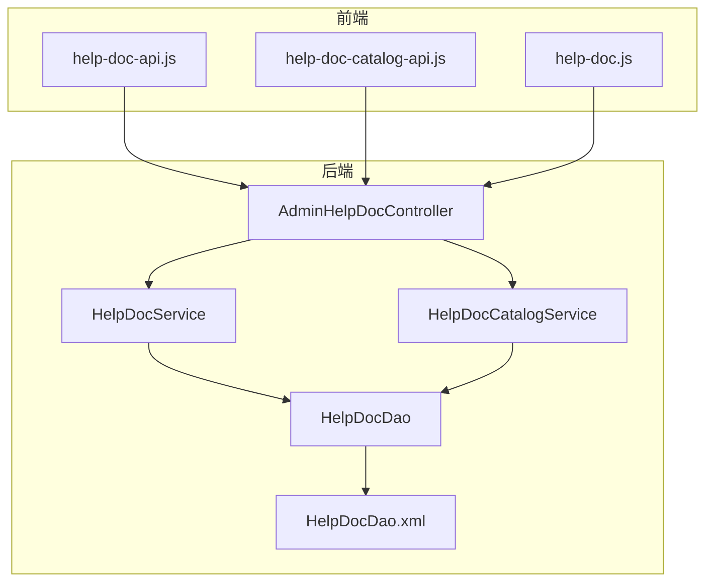
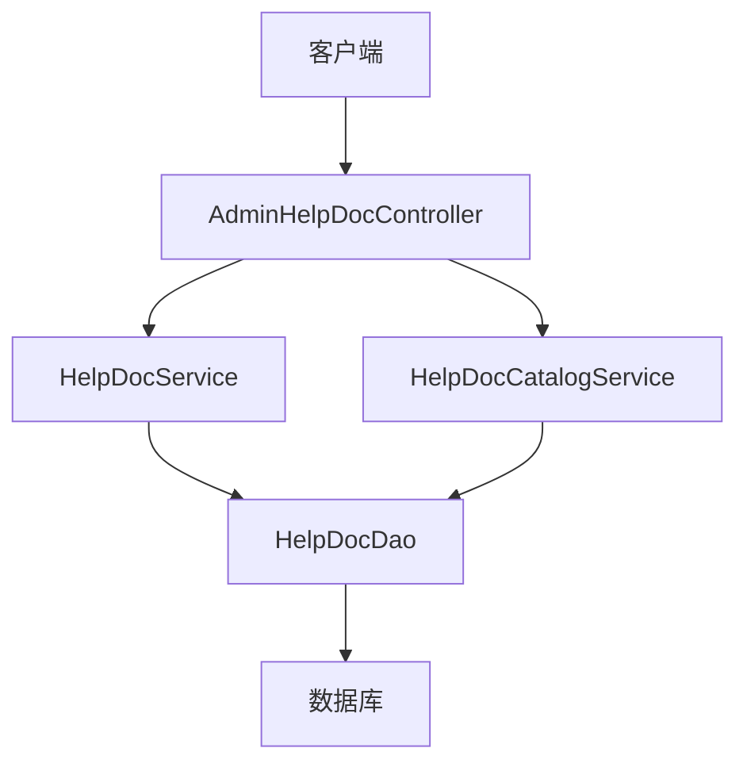
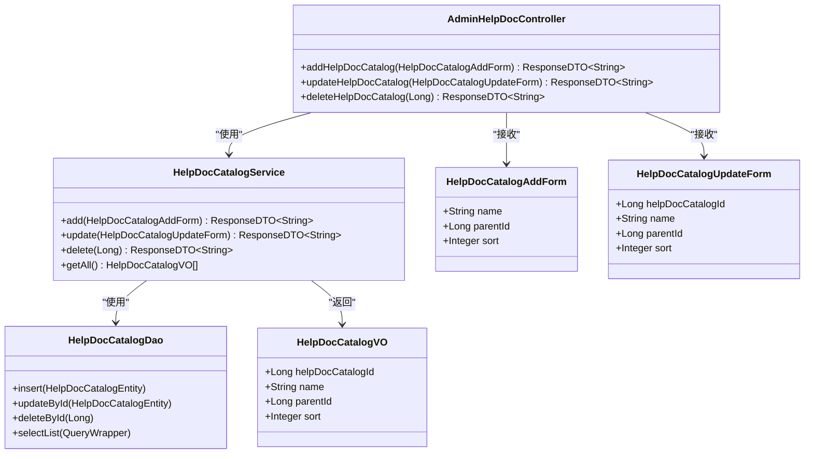
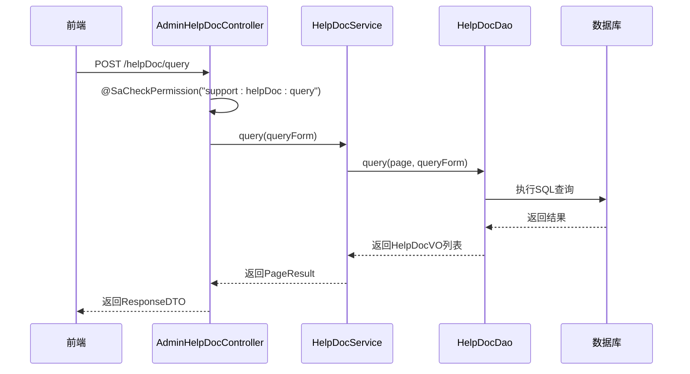
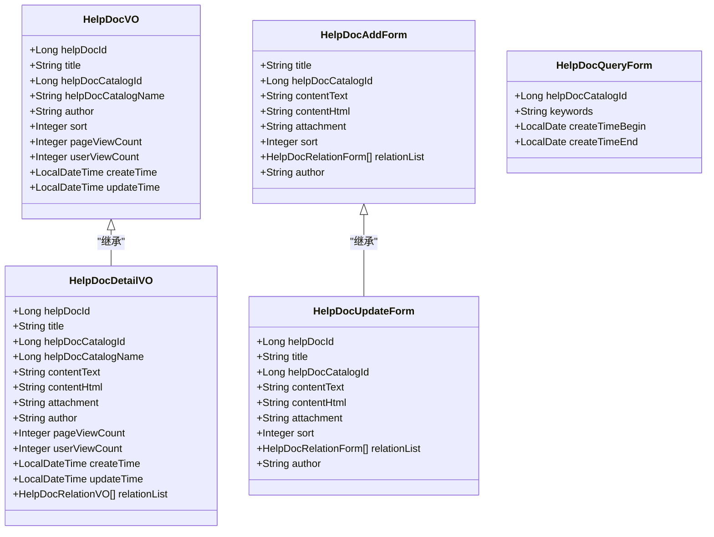
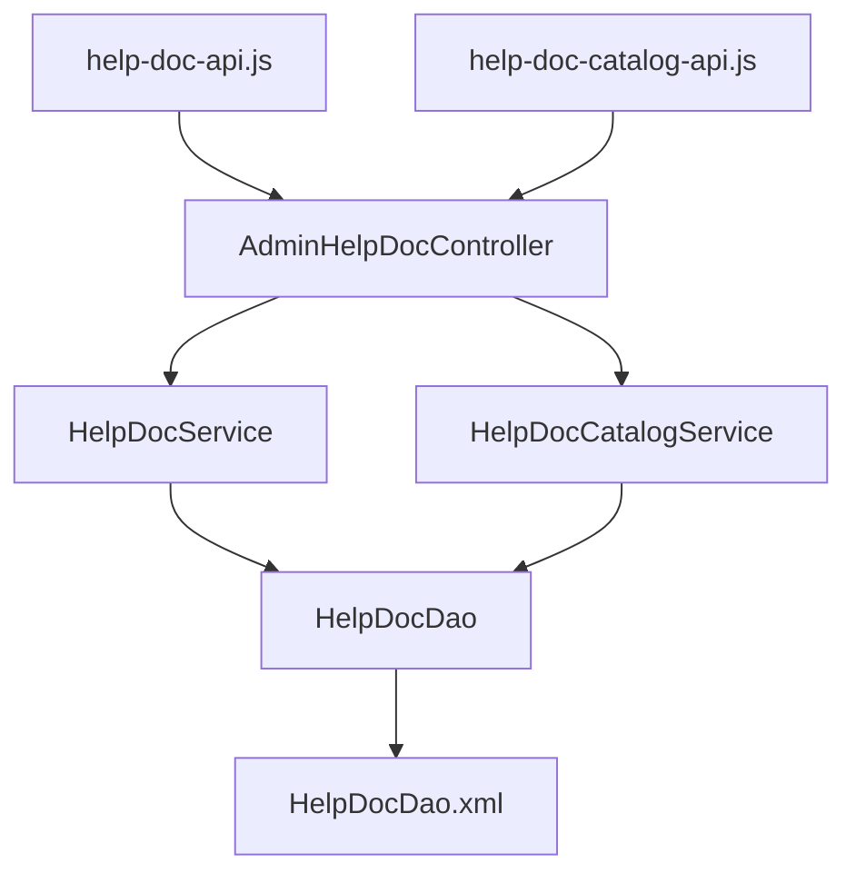

# 帮助文档API

<cite>
**本文档引用的文件**  
- [AdminHelpDocController.java](file://smart-admin-api-java17-springboot3\sa-admin\src\main\java\net\lab1024\sa\admin\module\system\support\AdminHelpDocController.java)
- [help-doc-api.js](file://smart-admin-web-javascript\src\api\support\help-doc-api.js)
- [help-doc-catalog-api.js](file://smart-admin-web-javascript\src\api\support\help-doc-catalog-api.js)
- [HelpDocService.java](file://smart-admin-api-java17-springboot3\sa-base\src\main\java\net\lab1024\sa\base\module\support\helpdoc\service\HelpDocService.java)
- [HelpDocCatalogService.java](file://smart-admin-api-java17-springboot3\sa-base\src\main\java\net\lab1024\sa\base\module\support\helpdoc\service\HelpDocCatalogService.java)
- [HelpDocDao.xml](file://smart-admin-api-java17-springboot3\sa-base\src\main\resources\mapper\support\HelpDocDao.xml)
- [HelpDocVO.java](file://smart-admin-api-java17-springboot3\sa-base\src\main\java\net\lab1024\sa\base\module\support\helpdoc\domain\vo\HelpDocVO.java)
- [HelpDocDetailVO.java](file://smart-admin-api-java17-springboot3\sa-base\src\main\java\net\lab1024\sa\base\module\support\helpdoc\domain\vo\HelpDocDetailVO.java)
- [HelpDocCatalogVO.java](file://smart-admin-api-java17-springboot3\sa-base\src\main\java\net\lab1024\sa\base\module\support\helpdoc\domain\vo\HelpDocCatalogVO.java)
- [HelpDocQueryForm.java](file://smart-admin-api-java17-springboot3\sa-base\src\main\java\net\lab1024\sa\base\module\support\helpdoc\domain\form\HelpDocQueryForm.java)
- [HelpDocAddForm.java](file://smart-admin-api-java17-springboot3\sa-base\src\main\java\net\lab1024\sa\base\module\support\helpdoc\domain\form\HelpDocAddForm.java)
- [HelpDocUpdateForm.java](file://smart-admin-api-java17-springboot3\sa-base\src\main\java\net\lab1024\sa\base\module\support\helpdoc\domain\form\HelpDocUpdateForm.java)
- [HelpDocCatalogAddForm.java](file://smart-admin-api-java17-springboot3\sa-base\src\main\java\net\lab1024\sa\base\module\support\helpdoc\domain\form\HelpDocCatalogAddForm.java)
- [HelpDocCatalogUpdateForm.java](file://smart-admin-api-java17-springboot3\sa-base\src\main\java\net\lab1024\sa\base\module\support\helpdoc\domain\form\HelpDocCatalogUpdateForm.java)
</cite>

## 目录
1. [简介](#简介)
2. [项目结构](#项目结构)
3. [核心组件](#核心组件)
4. [架构概述](#架构概述)
5. [详细组件分析](#详细组件分析)
6. [依赖分析](#依赖分析)
7. [性能考虑](#性能考虑)
8. [故障排除指南](#故障排除指南)
9. [结论](#结论)

## 简介
本文档全面介绍了帮助文档API的功能，详细说明了`AdminHelpDocController`提供的完整文档管理功能。系统提供了帮助文档目录的增删改查功能和帮助文档本身的全生命周期管理功能。文档明确了每个端点的HTTP方法、URL路径、请求参数和响应格式，特别说明了分页查询和权限控制（@SaCheckPermission）的实现。结合前端`help-doc-api.js`和`help-doc-catalog-api.js`提供了调用示例，阐述了如何在系统中构建和维护在线帮助文档体系，包括目录树结构的构建和文档关联机制。

## 项目结构
系统采用前后端分离架构，后端使用Spring Boot框架，前端使用JavaScript框架。帮助文档功能主要分布在两个模块中：`sa-admin`模块包含管理后台的控制器，`sa-base`模块包含基础服务和数据访问层。

**图示来源**
- [AdminHelpDocController.java](file://smart-admin-api-java17-springboot3\sa-admin\src\main\java\net\lab1024\sa\admin\module\system\support\AdminHelpDocController.java)
- [help-doc-api.js](file://smart-admin-web-javascript\src\api\support\help-doc-api.js)
- [help-doc-catalog-api.js](file://smart-admin-web-javascript\src\api\support\help-doc-catalog-api.js)
- [HelpDocService.java](file://smart-admin-api-java17-springboot3\sa-base\src\main\java\net\lab1024\sa\base\module\support\helpdoc\service\HelpDocService.java)
- [HelpDocDao.xml](file://smart-admin-api-java17-springboot3\sa-base\src\main\resources\mapper\support\HelpDocDao.xml)

**章节来源**
- [AdminHelpDocController.java](file://smart-admin-api-java17-springboot3\sa-admin\src\main\java\net\lab1024\sa\admin\module\system\support\AdminHelpDocController.java)
- [help-doc-api.js](file://smart-admin-web-javascript\src\api\support\help-doc-api.js)
- [help-doc-catalog-api.js](file://smart-admin-web-javascript\src\api\support\help-doc-catalog-api.js)

## 核心组件
核心组件包括`AdminHelpDocController`控制器，它提供了帮助文档和目录管理的所有API端点。`HelpDocService`和`HelpDocCatalogService`服务类实现了业务逻辑，`HelpDocDao`数据访问对象负责与数据库交互。前端通过`help-doc-api.js`和`help-doc-catalog-api.js`封装了API调用。

**章节来源**
- [AdminHelpDocController.java](file://smart-admin-api-java17-springboot3\sa-admin\src\main\java\net\lab1024\sa\admin\module\system\support\AdminHelpDocController.java)
- [HelpDocService.java](file://smart-admin-api-java17-springboot3\sa-base\src\main\java\net\lab1024\sa\base\module\support\helpdoc\service\HelpDocService.java)
- [HelpDocCatalogService.java](file://smart-admin-api-java17-springboot3\sa-base\src\main\java\net\lab1024\sa\base\module\support\helpdoc\service\HelpDocCatalogService.java)

## 架构概述
系统采用典型的三层架构：表现层（Controller）、业务逻辑层（Service）和数据访问层（DAO）。`AdminHelpDocController`作为表现层，接收HTTP请求并返回响应。`HelpDocService`和`HelpDocCatalogService`作为业务逻辑层，处理具体的业务规则。`HelpDocDao`作为数据访问层，通过MyBatis与数据库交互。

**图示来源**
- [AdminHelpDocController.java](file://smart-admin-api-java17-springboot3\sa-admin\src\main\java\net\lab1024\sa\admin\module\system\support\AdminHelpDocController.java)
- [HelpDocService.java](file://smart-admin-api-java17-springboot3\sa-base\src\main\java\net\lab1024\sa\base\module\support\helpdoc\service\HelpDocService.java)
- [HelpDocCatalogService.java](file://smart-admin-api-java17-springboot3\sa-base\src\main\java\net\lab1024\sa\base\module\support\helpdoc\service\HelpDocCatalogService.java)
- [HelpDocDao.java](file://smart-admin-api-java17-springboot3\sa-base\src\main\java\net\lab1024\sa\base\module\support\helpdoc\dao\HelpDocDao.java)

## 详细组件分析
### 帮助文档目录管理分析
`AdminHelpDocController`提供了帮助文档目录的增删改查功能。目录管理API包括添加、更新和删除目录，确保目录名称的唯一性，并在删除目录时检查是否存在子目录或关联文档。

#### 目录管理类图

**图示来源**
- [AdminHelpDocController.java](file://smart-admin-api-java17-springboot3\sa-admin\src\main\java\net\lab1024\sa\admin\module\system\support\AdminHelpDocController.java)
- [HelpDocCatalogService.java](file://smart-admin-api-java17-springboot3\sa-base\src\main\java\net\lab1024\sa\base\module\support\helpdoc\service\HelpDocCatalogService.java)
- [HelpDocCatalogVO.java](file://smart-admin-api-java17-springboot3\sa-base\src\main\java\net\lab1024\sa\base\module\support\helpdoc\domain\vo\HelpDocCatalogVO.java)

**章节来源**
- [AdminHelpDocController.java](file://smart-admin-api-java17-springboot3\sa-admin\src\main\java\net\lab1024\sa\admin\module\system\support\AdminHelpDocController.java)
- [HelpDocCatalogService.java](file://smart-admin-api-java17-springboot3\sa-base\src\main\java\net\lab1024\sa\base\module\support\helpdoc\service\HelpDocCatalogService.java)

### 帮助文档管理分析
`AdminHelpDocController`提供了帮助文档的全生命周期管理功能，包括查询、获取详情、添加、更新、删除和根据关联ID查询文档。系统实现了分页查询和权限控制机制。

#### 文档管理序列图

**图示来源**
- [AdminHelpDocController.java](file://smart-admin-api-java17-springboot3\sa-admin\src\main\java\net\lab1024\sa\admin\module\system\support\AdminHelpDocController.java)
- [HelpDocService.java](file://smart-admin-api-java17-springboot3\sa-base\src\main\java\net\lab1024\sa\base\module\support\helpdoc\service\HelpDocService.java)
- [HelpDocDao.java](file://smart-admin-api-java17-springboot3\sa-base\src\main\java\net\lab1024\sa\base\module\support\helpdoc\dao\HelpDocDao.java)
- [HelpDocDao.xml](file://smart-admin-api-java17-springboot3\sa-base\src\main\resources\mapper\support\HelpDocDao.xml)

**章节来源**
- [AdminHelpDocController.java](file://smart-admin-api-java17-springboot3\sa-admin\src\main\java\net\lab1024\sa\admin\module\system\support\AdminHelpDocController.java)
- [HelpDocService.java](file://smart-admin-api-java17-springboot3\sa-base\src\main\java\net\lab1024\sa\base\module\support\helpdoc\service\HelpDocService.java)

### 数据模型分析
系统定义了清晰的数据模型，包括帮助文档和帮助文档目录的实体、视图对象和表单对象。这些模型确保了数据在不同层之间的正确传递和验证。

#### 数据模型类图

**图示来源**
- [HelpDocVO.java](file://smart-admin-api-java17-springboot3\sa-base\src\main\java\net\lab1024\sa\base\module\support\helpdoc\domain\vo\HelpDocVO.java)
- [HelpDocDetailVO.java](file://smart-admin-api-java17-springboot3\sa-base\src\main\java\net\lab1024\sa\base\module\support\helpdoc\domain\vo\HelpDocDetailVO.java)
- [HelpDocAddForm.java](file://smart-admin-api-java17-springboot3\sa-base\src\main\java\net\lab1024\sa\base\module\support\helpdoc\domain\form\HelpDocAddForm.java)
- [HelpDocUpdateForm.java](file://smart-admin-api-java17-springboot3\sa-base\src\main\java\net\lab1024\sa\base\module\support\helpdoc\domain\form\HelpDocUpdateForm.java)
- [HelpDocQueryForm.java](file://smart-admin-api-java17-springboot3\sa-base\src\main\java\net\lab1024\sa\base\module\support\helpdoc\domain\form\HelpDocQueryForm.java)

**章节来源**
- [HelpDocVO.java](file://smart-admin-api-java17-springboot3\sa-base\src\main\java\net\lab1024\sa\base\module\support\helpdoc\domain\vo\HelpDocVO.java)
- [HelpDocDetailVO.java](file://smart-admin-api-java17-springboot3\sa-base\src\main\java\net\lab1024\sa\base\module\support\helpdoc\domain\vo\HelpDocDetailVO.java)
- [HelpDocAddForm.java](file://smart-admin-api-java17-springboot3\sa-base\src\main\java\net\lab1024\sa\base\module\support\helpdoc\domain\form\HelpDocAddForm.java)
- [HelpDocUpdateForm.java](file://smart-admin-api-java17-springboot3\sa-base\src\main\java\net\lab1024\sa\base\module\support\helpdoc\domain\form\HelpDocUpdateForm.java)
- [HelpDocQueryForm.java](file://smart-admin-api-java17-springboot3\sa-base\src\main\java\net\lab1024\sa\base\module\support\helpdoc\domain\form\HelpDocQueryForm.java)

## 依赖分析
系统各组件之间存在明确的依赖关系。`AdminHelpDocController`依赖于`HelpDocService`和`HelpDocCatalogService`，这两个服务又依赖于相应的DAO组件。前端API文件依赖于后端提供的RESTful接口。

**图示来源**
- [help-doc-api.js](file://smart-admin-web-javascript\src\api\support\help-doc-api.js)
- [help-doc-catalog-api.js](file://smart-admin-web-javascript\src\api\support\help-doc-catalog-api.js)
- [AdminHelpDocController.java](file://smart-admin-api-java17-springboot3\sa-admin\src\main\java\net\lab1024\sa\admin\module\system\support\AdminHelpDocController.java)
- [HelpDocService.java](file://smart-admin-api-java17-springboot3\sa-base\src\main\java\net\lab1024\sa\base\module\support\helpdoc\service\HelpDocService.java)
- [HelpDocCatalogService.java](file://smart-admin-api-java17-springboot3\sa-base\src\main\java\net\lab1024\sa\base\module\support\helpdoc\service\HelpDocCatalogService.java)
- [HelpDocDao.java](file://smart-admin-api-java17-springboot3\sa-base\src\main\java\net\lab1024\sa\base\module\support\helpdoc\dao\HelpDocDao.java)
- [HelpDocDao.xml](file://smart-admin-api-java17-springboot3\sa-base\src\main\resources\mapper\support\HelpDocDao.xml)

**章节来源**
- [help-doc-api.js](file://smart-admin-web-javascript\src\api\support\help-doc-api.js)
- [help-doc-catalog-api.js](file://smart-admin-web-javascript\src\api\support\help-doc-catalog-api.js)
- [AdminHelpDocController.java](file://smart-admin-api-java17-springboot3\sa-admin\src\main\java\net\lab1024\sa\admin\module\system\support\AdminHelpDocController.java)
- [HelpDocService.java](file://smart-admin-api-java17-springboot3\sa-base\src\main\java\net\lab1024\sa\base\module\support\helpdoc\service\HelpDocService.java)
- [HelpDocCatalogService.java](file://smart-admin-api-java17-springboot3\sa-base\src\main\java\net\lab1024\sa\base\module\support\helpdoc\service\HelpDocCatalogService.java)

## 性能考虑
系统在设计时考虑了性能优化。分页查询避免了大数据量的全表扫描，通过索引优化查询性能。`HelpDocService`中的`query`方法使用了MyBatis的分页插件，有效控制了返回数据量。同时，系统通过`@RepeatSubmit`注解防止重复提交，避免了不必要的数据库操作。

**章节来源**
- [HelpDocService.java](file://smart-admin-api-java17-springboot3\sa-base\src\main\java\net\lab1024\sa\base\module\support\helpdoc\service\HelpDocService.java)
- [HelpDocDao.xml](file://smart-admin-api-java17-springboot3\sa-base\src\main\resources\mapper\support\HelpDocDao.xml)

## 故障排除指南
当遇到帮助文档功能问题时，可以按照以下步骤进行排查：
1. 检查API端点是否正确，特别是URL路径和HTTP方法
2. 验证权限配置，确保用户具有相应的`@SaCheckPermission`权限
3. 检查数据库连接和表结构，确保`t_help_doc`和`t_help_doc_catalog`表存在且结构正确
4. 查看日志文件，检查是否有异常信息
5. 验证前端API调用参数是否符合要求

**章节来源**
- [AdminHelpDocController.java](file://smart-admin-api-java17-springboot3\sa-admin\src\main\java\net\lab1024\sa\admin\module\system\support\AdminHelpDocController.java)
- [HelpDocService.java](file://smart-admin-api-java17-springboot3\sa-base\src\main\java\net\lab1024\sa\base\module\support\helpdoc\service\HelpDocService.java)
- [HelpDocDao.xml](file://smart-admin-api-java17-springboot3\sa-base\src\main\resources\mapper\support\HelpDocDao.xml)

## 结论
本文档详细介绍了帮助文档API的完整功能和实现细节。系统提供了完善的帮助文档管理功能，包括目录管理和文档全生命周期管理。通过清晰的分层架构和合理的权限控制，确保了系统的安全性和可维护性。前端API封装使得调用更加方便，开发者可以轻松集成帮助文档功能到自己的应用中。