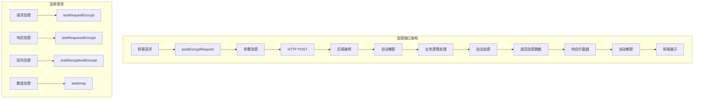
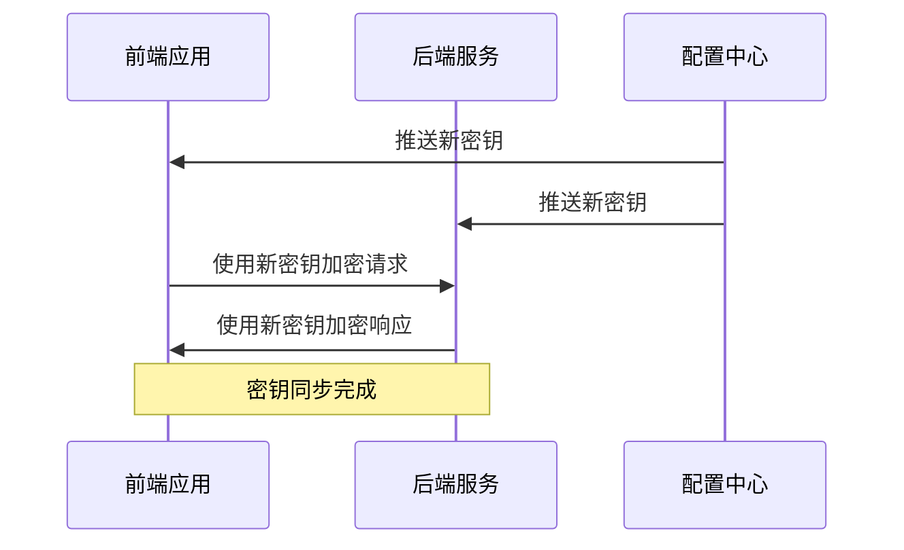
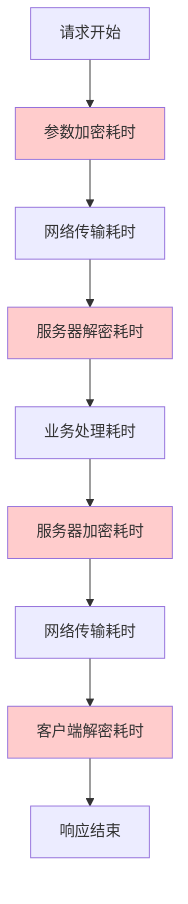

# 接口加密API文档

<cite>
**本文档引用的文件**
- [AdminApiEncryptController.java](file://smart-admin-api-java17-springboot3/sa-admin/src/main/java/net/lab1024.sa.admin/module/system/support/AdminApiEncryptController.java)
- [api-encrypt-api.js](file://smart-admin-web-javascript/src/api/support/api-encrypt-api.js)
- [axios.js](file://smart-admin-web-javascript/src/lib/axios.js)
- [encrypt.js](file://smart-admin-web-javascript/src/lib/encrypt.js)
- [ApiDecrypt.java](file://smart-admin-api-java17-springboot3/sa-base/src/main/java/net/lab1024.sa/base/module/support/apiencrypt/annotation/ApiDecrypt.java)
- [ApiEncrypt.java](file://smart-admin-api-java17-springboot3/sa-base/src/main/java/net/lab1024.sa/base/module/support/apiencrypt/annotation/ApiEncrypt.java)
- [ApiEncryptServiceAesImpl.java](file://smart-admin-api-java17-springboot3/sa-base/src/main/java/net/lab1024.sa/base/module/support/apiencrypt/service/ApiEncryptServiceAesImpl.java)
- [ApiEncryptServiceSmImpl.java](file://smart-admin-api-java17-springboot3/sa-base/src/main/java/net/lab1024.sa/base/module/support/apiencrypt/service/ApiEncryptServiceSmImpl.java)
- [api-encrypt-index.vue](file://smart-admin-web-javascript/src/views/support/api-encrypt/api-encrypt-index.vue)
</cite>

## 目录
1. [概述](#概述)
2. [核心接口介绍](#核心接口介绍)
3. [接口详细说明](#接口详细说明)
4. [加密算法配置](#加密算法配置)
5. [密钥管理最佳实践](#密钥管理最佳实践)
6. [前端调用示例](#前端调用示例)
7. [后端配置说明](#后端配置说明)
8. [错误处理与调试](#错误处理与调试)
9. [性能考虑](#性能考虑)
10. [故障排除指南](#故障排除指南)

## 概述

SmartAdmin框架提供了完整的接口加密解决方案，支持前后端数据传输的安全保护。该系统通过注解驱动的方式，在API层面实现透明的数据加密和解密，确保敏感数据在传输过程中的安全性。

### 主要特性

- **双重加密支持**：同时支持国密SM4和AES加密算法
- **注解驱动**：通过`@ApiDecrypt`和`@ApiEncrypt`注解实现透明加解密
- **数组加密**：支持复杂数据结构的批量加密
- **自动类型检测**：根据注解自动识别加密需求
- **密钥统一管理**：前后端使用相同的密钥配置

## 核心接口介绍

系统提供四个核心加密测试接口，涵盖不同的加解密场景：



**图表来源**
- [AdminApiEncryptController.java](file://smart-admin-api-java17-springboot3/sa-admin/src/main/java/net/lab1024.sa.admin/module/system/support/AdminApiEncryptController.java#L36-L81)
- [axios.js](file://smart-admin-web-javascript/src/lib/axios.js#L160-L170)

## 接口详细说明

### 1. 请求加密测试 - testRequestEncrypt

**功能描述**：测试仅对请求参数进行加密的场景

**HTTP方法**：`POST`

**URL路径**：`/apiEncrypt/testRequestEncrypt`

**请求体结构**：
```json
{
  "name": "字符串类型，不能为空",
  "age": "整数类型，最小值为1"
}
```

**响应格式**：
```json
{
  "code": 1,
  "msg": "success",
  "data": {
    "name": "解密后的姓名",
    "age": 100
  },
  "dataType": "ENCRYPT"
}
```

**注解配置**：
- `@ApiDecrypt`：自动解密请求参数
- `@ApiEncrypt`：自动加密响应数据

**使用场景**：
- 敏感数据上传（如用户个人信息）
- 支付信息传输
- 认证凭据传递

### 2. 响应加密测试 - testResponseEncrypt

**功能描述**：测试仅对响应数据进行加密的场景

**HTTP方法**：`POST`

**URL路径**：`/apiEncrypt/testResponseEncrypt`

**请求体结构**：
```json
{
  "name": "字符串类型，不能为空",
  "age": "整数类型，最小值为1"
}
```

**响应格式**：
```json
{
  "code": 1,
  "msg": "success",
  "data": "加密后的JSON字符串",
  "dataType": "ENCRYPT"
}
```

**注解配置**：
- `@ApiEncrypt`：自动加密响应数据
- `@ApiDecrypt`：无解密处理（保持原样）

**使用场景**：
- 敏感数据查询返回
- 用户隐私信息展示
- 系统配置数据传输

### 3. 双向加密测试 - testDecryptAndEncrypt

**功能描述**：测试请求参数和响应数据同时进行加解密的完整流程

**HTTP方法**：`POST`

**URL路径**：`/apiEncrypt/testDecryptAndEncrypt`

**请求体结构**：
```json
{
  "name": "字符串类型，不能为空",
  "age": "整数类型，最小值为1"
}
```

**响应格式**：
```json
{
  "code": 1,
  "msg": "success",
  "data": {
    "name": "解密后的姓名",
    "age": 100
  },
  "dataType": "ENCRYPT"
}
```

**注解配置**：
- `@ApiDecrypt`：自动解密请求参数
- `@ApiEncrypt`：自动加密响应数据

**使用场景**：
- 完整的加密通信链路
- 高安全级别的数据交互
- 多步骤业务流程处理

### 4. 数组加密测试 - testArray

**功能描述**：测试复杂数据结构（数组）的加密和解密

**HTTP方法**：`POST`

**URL路径**：`/apiEncrypt/testArray`

**请求体结构**：
```json
[
  {
    "name": "字符串类型，不能为空",
    "age": "整数类型，最小值为1"
  },
  {
    "name": "字符串类型，不能为空",
    "age": "整数类型，最小值为1"
  }
]
```

**响应格式**：
```json
{
  "code": 1,
  "msg": "success",
  "data": [
    {
      "name": "解密后的姓名1",
      "age": 100
    },
    {
      "name": "解密后的姓名2",
      "age": 200
    }
  ],
  "dataType": "ENCRYPT"
}
```

**注解配置**：
- `@ApiDecrypt`：自动解密请求数组
- `@ApiEncrypt`：自动加密响应数组

**使用场景**：
- 批量数据处理
- 列表数据传输
- 复杂业务对象集合

**章节来源**
- [AdminApiEncryptController.java](file://smart-admin-api-java17-springboot3/sa-admin/src/main/java/net/lab1024.sa.admin/module/system/support/AdminApiEncryptController.java#L36-L81)

## 加密算法配置

### 支持的加密算法

系统支持两种主要的加密算法：

#### 1. 国密SM4算法

**特点**：
- 中国国家密码标准
- 密钥长度：128位
- 分组长度：128位
- ECB模式加密

**实现类**：`ApiEncryptServiceSmImpl`

**密钥要求**：
- 长度必须为16个字符
- 支持字母、数字、特殊符号组合
- 默认密钥：`1024lab__1024lab`

#### 2. AES算法

**特点**：
- 国际通用对称加密算法
- 密钥长度：128位（可选192/256位）
- 分组长度：128位
- ECB模式加密（默认）

**实现类**：`ApiEncryptServiceAesImpl`

**密钥要求**：
- 长度必须为16个字符
- 支持字母、数字、特殊符号组合
- 默认密钥：`1024lab__1024lab`

### 前端算法切换

```javascript
// 默认使用SM4算法
const EncryptObject = SM4;
// const EncryptObject = AES; // 切换到AES算法
```

**章节来源**
- [ApiEncryptServiceAesImpl.java](file://smart-admin-api-java17-springboot3/sa-base/src/main/java/net/lab1024.sa/base/module/support/apiencrypt/service/ApiEncryptServiceAesImpl.java#L1-L40)
- [ApiEncryptServiceSmImpl.java](file://smart-admin-api-java17-springboot3/sa-base/src/main/java/net/lab1024.sa/base/module/support/apiencrypt/service/ApiEncryptServiceSmImpl.java#L1-L42)
- [encrypt.js](file://smart-admin-web-javascript/src/lib/encrypt.js#L104-L106)

## 密钥管理最佳实践

### 密钥配置原则

1. **密钥长度要求**
   - 必须为16个字符
   - 支持多种字符类型混合
   - 避免使用简单字典词汇

2. **密钥生成建议**
   ```javascript
   // 推荐的密钥生成方式
   const generateSecureKey = () => {
     const chars = 'ABCDEFGHIJKLMNOPQRSTUVWXYZabcdefghijklmnopqrstuvwxyz0123456789!@#$%^&*()';
     let key = '';
     for (let i = 0; i < 16; i++) {
       key += chars.charAt(Math.floor(Math.random() * chars.length));
     }
     return key;
   };
   ```

3. **密钥存储安全**
   - 不要在代码中硬编码密钥
   - 使用环境变量或配置文件
   - 实施密钥轮换策略

### 生产环境配置

#### 后端配置
```yaml
# application.yml 示例
api-encrypt:
  algorithm: SM4  # 或 AES
  key: "${ENCRYPT_KEY:default_key_16_chars}"
```

#### 前端配置
```javascript
// 在环境配置文件中设置
const ENCRYPT_KEY = process.env.REACT_APP_ENCRYPT_KEY || 'default_key_16_chars';
```

### 密钥同步机制



**图表来源**
- [ApiEncryptServiceSmImpl.java](file://smart-admin-api-java17-springboot3/sa-base/src/main/java/net/lab1024.sa/base/module/support/apiencrypt/service/ApiEncryptServiceSmImpl.java#L35-L85)

## 前端调用示例

### 基础调用方式

#### 1. 请求加密调用

```javascript
import { encryptApi } from '/@/api/support/api-encrypt-api';

// 调用请求加密接口
async function testRequestEncryption() {
  const requestData = {
    name: '张三',
    age: 25
  };
  
  try {
    const response = await encryptApi.testRequestEncrypt(requestData);
    console.log('加密响应:', response);
  } catch (error) {
    console.error('加密请求失败:', error);
  }
}
```

#### 2. 响应解密处理

```javascript
// 自动解密处理（由axios拦截器完成）
// 响应数据会自动解密并转换为JavaScript对象
const decryptedData = response.data; // 已解密的对象
```

#### 3. 手动加密调用

```javascript
import { encryptData, decryptData } from '/@/lib/encrypt';

// 手动加密数据
const rawData = { name: '李四', age: 30 };
const encryptedData = encryptData(rawData);
console.log('加密数据:', encryptedData);

// 手动解密数据
const decrypted = decryptData(encryptedData);
console.log('解密数据:', decrypted);
```

### Vue组件集成示例

```vue
<script setup>
import { reactive, ref } from 'vue';
import { encryptApi } from '/@/api/support/api-encrypt-api';
import { encryptData } from '/@/lib/encrypt';

// 请求参数
const formData = reactive({
  name: '王五',
  age: 28
});

// 状态变量
const requestStr = ref('');
const encryptedStr = ref('');
const responseStr = ref('');

// 测试请求加密
async function testEncryption() {
  // 显示原始请求
  requestStr.value = JSON.stringify(formData);
  
  // 加密请求参数
  encryptedStr.value = encryptData(formData);
  
  // 发送加密请求
  try {
    const result = await encryptApi.testRequestEncrypt(formData);
    responseStr.value = JSON.stringify(result.data);
  } catch (error) {
    console.error('加密请求失败:', error);
  }
}
</script>
```

**章节来源**
- [api-encrypt-api.js](file://smart-admin-web-javascript/src/api/support/api-encrypt-api.js#L1-L40)
- [api-encrypt-index.vue](file://smart-admin-web-javascript/src/views/support/api-encrypt/api-encrypt-index.vue#L147-L188)

## 后端配置说明

### 注解使用指南

#### 1. 请求解密注解

```java
@ApiDecrypt
@PostMapping("/apiEncrypt/testRequestEncrypt")
public ResponseDTO<JweForm> testRequestEncrypt(@RequestBody @Valid JweForm form) {
    // form对象已经是解密后的数据
    return ResponseDTO.ok(form);
}
```

#### 2. 响应加密注解

```java
@ApiEncrypt
@PostMapping("/apiEncrypt/testResponseEncrypt")
public ResponseDTO<JweForm> testResponseEncrypt(@RequestBody @Valid JweForm form) {
    // 返回的数据会被自动加密
    return ResponseDTO.ok(form);
}
```

#### 3. 双向加密注解

```java
@ApiDecrypt
@ApiEncrypt
@PostMapping("/apiEncrypt/testDecryptAndEncrypt")
public ResponseDTO<JweForm> testDecryptAndEncrypt(@RequestBody @Valid JweForm form) {
    // form是解密后的数据
    // 返回的数据会被自动加密
    return ResponseDTO.ok(form);
}
```

### 加密服务配置

#### 1. SM4加密服务

```java
@Service
public class ApiEncryptServiceSmImpl implements ApiEncryptService {
    
    private static final String SM4_KEY = "1024lab__1024lab"; // 16字符密钥
    
    @Override
    public String encrypt(String data) {
        // SM4加密实现
        SM4 sm4 = new SM4(hexToBytes(stringToHex(SM4_KEY)));
        String encryptHex = sm4.encryptHex(data);
        return new String(Base64.getEncoder().encode(encryptHex.getBytes(CHARSET)), CHARSET);
    }
    
    @Override
    public String decrypt(String data) {
        // SM4解密实现
        byte[] base64Decode = Base64.getDecoder().decode(data);
        SM4 sm4 = new SM4(hexToBytes(stringToHex(SM4_KEY)));
        return sm4.decryptStr(new String(base64Decode));
    }
}
```

#### 2. AES加密服务

```java
@Service
public class ApiEncryptServiceAesImpl implements ApiEncryptService {
    
    private static final String AES_KEY = "1024lab__1024lab"; // 16字符密钥
    
    @Override
    public String encrypt(String data) {
        // AES加密实现
        AES aes = new AES("ECB", "PKCS5Padding", 
                         AES_KEY.getBytes(StandardCharsets.UTF_8));
        return aes.encryptBase64(data);
    }
    
    @Override
    public String decrypt(String data) {
        // AES解密实现
        AES aes = new AES("ECB", "PKCS5Padding", 
                         AES_KEY.getBytes(StandardCharsets.UTF_8));
        return aes.decryptStr(data);
    }
}
```

### 全局配置

```java
@Configuration
public class ApiEncryptConfig {
    
    @Bean
    @ConditionalOnProperty(name = "api.encrypt.algorithm", havingValue = "SM4")
    public ApiEncryptService apiEncryptServiceSm() {
        return new ApiEncryptServiceSmImpl();
    }
    
    @Bean
    @ConditionalOnProperty(name = "api.encrypt.algorithm", havingValue = "AES")
    public ApiEncryptService apiEncryptServiceAes() {
        return new ApiEncryptServiceAesImpl();
    }
}
```

**章节来源**
- [AdminApiEncryptController.java](file://smart-admin-api-java17-springboot3/sa-admin/src/main/java/net/lab1024.sa.admin/module/system/support/AdminApiEncryptController.java#L36-L81)
- [ApiDecrypt.java](file://smart-admin-api-java17-springboot3/sa-base/src/main/java/net/lab1024.sa/base/module/support/apiencrypt/annotation/ApiDecrypt.java#L1-L20)
- [ApiEncrypt.java](file://smart-admin-api-java17-springboot3/sa-base/src/main/java/net/lab1024.sa/base/module/support/apiencrypt/annotation/ApiEncrypt.java#L1-L20)

## 错误处理与调试

### 常见错误类型

#### 1. 密钥不匹配错误

**错误表现**：
```json
{
  "code": 500,
  "msg": "密钥验证失败",
  "data": null
}
```

**解决方法**：
- 检查前后端密钥是否一致
- 确认密钥长度是否为16字符
- 验证字符编码是否正确

#### 2. 加密数据格式错误

**错误表现**：
```json
{
  "code": 400,
  "msg": "加密数据格式错误",
  "data": null
}
```

**解决方法**：
- 确保加密数据为有效的JSON字符串
- 检查Base64编码是否正确
- 验证数据完整性

#### 3. 解密超时错误

**错误表现**：
```json
{
  "code": 408,
  "msg": "解密超时",
  "data": null
}
```

**解决方法**：
- 检查网络连接稳定性
- 增加解密超时时间配置
- 优化加密算法性能

### 调试工具

#### 1. 前端调试

```javascript
// 开启加密日志
window.DEBUG_ENCRYPT = true;

// 加密状态检查
const checkEncryptionStatus = () => {
  console.log('当前加密算法:', EncryptObject === SM4 ? 'SM4' : 'AES');
  console.log('密钥长度:', SM4_KEY.length);
  console.log('加密服务可用:', typeof encryptData === 'function');
};
```

#### 2. 后端调试

```java
@Slf4j
@Component
public class EncryptionDebugInterceptor implements HandlerInterceptor {
    
    @Override
    public boolean preHandle(HttpServletRequest request, HttpServletResponse response, Object handler) throws Exception {
        if (log.isDebugEnabled()) {
            log.debug("加密请求开始: {}", request.getRequestURI());
            log.debug("请求头: {}", request.getHeaderNames());
        }
        return true;
    }
}
```

### 性能监控



**图表来源**
- [axios.js](file://smart-admin-web-javascript/src/lib/axios.js#L68-L76)

## 性能考虑

### 加密性能对比

| 算法 | 加密速度 | 解密速度 | CPU占用 | 内存占用 |
|------|----------|----------|---------|----------|
| SM4  | 中等 | 中等 | 低 | 低 |
| AES  | 快 | 快 | 中等 | 中等 |

### 优化建议

#### 1. 批量处理优化
```java
// 推荐：批量加密处理
@PostMapping("/batchEncrypt")
public ResponseDTO<List<JweForm>> batchEncrypt(@RequestBody List<JweForm> dataList) {
    // 批量处理逻辑
    return ResponseDTO.ok(processBatch(dataList));
}
```

#### 2. 异步处理
```java
// 对于大数据量，使用异步处理
@PostMapping("/asyncEncrypt")
public CompletableFuture<ResponseDTO<JweForm>> asyncEncrypt(@RequestBody JweForm form) {
    return CompletableFuture.supplyAsync(() -> {
        // 异步加密处理
        return ResponseDTO.ok(processAsync(form));
    });
}
```

#### 3. 缓存策略
```java
// 缓存加密结果（适用于重复数据）
@Cacheable(value = "encryptCache", key = "#data.hashCode()")
public String cachedEncrypt(String data) {
    return apiEncryptService.encrypt(data);
}
```

### 性能监控指标

- **加密延迟**：平均加密/解密时间
- **吞吐量**：每秒处理的加密请求数
- **CPU使用率**：加密操作的CPU消耗
- **内存使用**：加密过程中的内存占用

## 故障排除指南

### 常见问题诊断

#### 1. 接口无法访问

**症状**：404 Not Found 或 405 Method Not Allowed

**排查步骤**：
1. 检查URL路径是否正确
2. 验证HTTP方法是否匹配
3. 确认控制器是否正确注册
4. 检查Swagger文档配置

#### 2. 数据传输异常

**症状**：响应数据为空或格式错误

**排查步骤**：
1. 检查加密算法是否匹配
2. 验证密钥配置是否一致
3. 确认数据格式是否符合要求
4. 检查网络传输是否稳定

#### 3. 性能问题

**症状**：接口响应缓慢

**排查步骤**：
1. 分析加密算法性能
2. 检查并发处理能力
3. 优化数据传输大小
4. 实施缓存策略

### 调试工具推荐

#### 1. 浏览器开发者工具
- Network面板：查看加密数据传输
- Console面板：检查JavaScript错误
- Application面板：查看本地存储

#### 2. 后端调试工具
- 日志分析：启用DEBUG级别日志
- 性能监控：使用APM工具
- 单元测试：编写加密相关测试

#### 3. 网络抓包工具
- Wireshark：分析网络流量
- Charles：代理抓包分析
- Fiddler：HTTP/HTTPS抓包

### 最佳实践总结

1. **安全第一**：始终使用强密钥，定期轮换
2. **性能平衡**：根据业务需求选择合适的加密算法
3. **监控到位**：实施全面的性能和安全监控
4. **文档完善**：维护详细的接口文档和配置说明
5. **测试充分**：进行全面的功能和性能测试

通过遵循这些指导原则和最佳实践，可以确保接口加密系统的安全性和可靠性，为业务系统提供强大的数据安全保障。