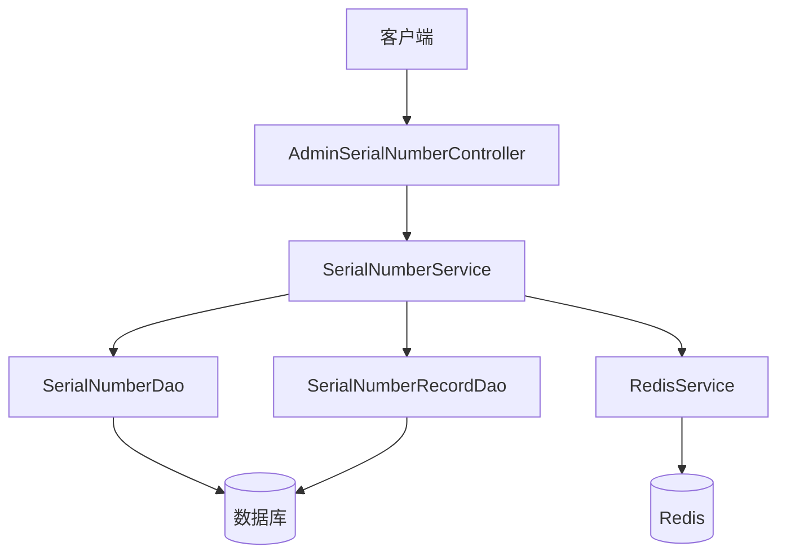
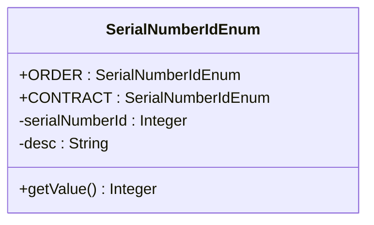
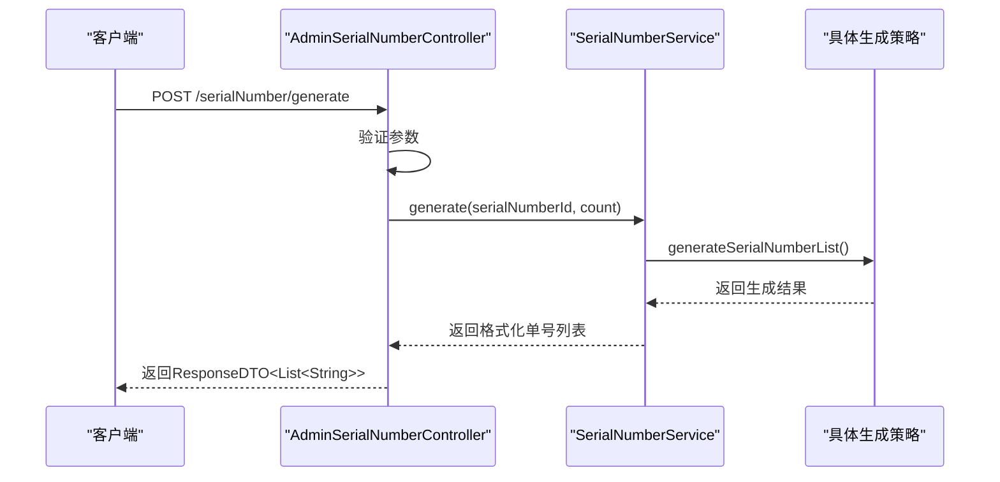
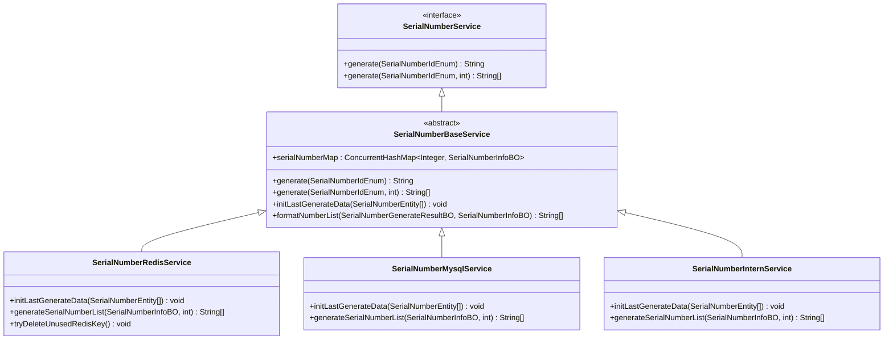

# 流水号生成API

<cite>
**本文档引用文件**  
- [AdminSerialNumberController.java](file://smart-admin-api-java17-springboot3\sa-admin\src\main\java\net\lab1024\sa\admin\module\system\support\AdminSerialNumberController.java)
- [SerialNumberIdEnum.java](file://smart-admin-api-java17-springboot3\sa-base\src\main\java\net\lab1024\sa\base\module\support\serialnumber\constant\SerialNumberIdEnum.java)
- [serial-number-api.js](file://smart-admin-web-javascript\src\api\support\serial-number-api.js)
- [SerialNumberGenerateForm.java](file://smart-admin-api-java17-springboot3\sa-base\src\main\java\net\lab1024\sa\base\module\support\serialnumber\domain\SerialNumberGenerateForm.java)
- [SerialNumberRecordQueryForm.java](file://smart-admin-api-java17-springboot3\sa-base\src\main\java\net\lab1024\sa\base\module\support\serialnumber\domain\SerialNumberRecordQueryForm.java)
- [SerialNumberEntity.java](file://smart-admin-api-java17-springboot3\sa-base\src\main\java\net\lab1024\sa\base\module\support\serialnumber\domain\SerialNumberEntity.java)
- [SerialNumberService.java](file://smart-admin-api-java17-springboot3\sa-base\src\main\java\net\lab1024\sa\base\module\support\serialnumber\service\SerialNumberService.java)
- [SerialNumberBaseService.java](file://smart-admin-api-java17-springboot3\sa-base\src\main\java\net\lab1024\sa\base\module\support\serialnumber\service\SerialNumberBaseService.java)
- [SerialNumberRuleTypeEnum.java](file://smart-admin-api-java17-springboot3\sa-base\src\main\java\net\lab1024\sa\base\module\support\serialnumber\constant\SerialNumberRuleTypeEnum.java)
- [SerialNumberRedisService.java](file://smart-admin-api-java17-springboot3\sa-base\src\main\java\net\lab1024\sa\base\module\support\serialnumber\service\impl\SerialNumberRedisService.java)
- [SerialNumberMysqlService.java](file://smart-admin-api-java17-springboot3\sa-base\src\main\java\net\lab1024\sa\base\module\support\serialnumber\service\impl\SerialNumberMysqlService.java)
- [SerialNumberInternService.java](file://smart-admin-api-java17-springboot3\sa-base\src\main\java\net\lab1024\sa\base\module\support\serialnumber\service\impl\SerialNumberInternService.java)
</cite>

## 目录
1. [简介](#简介)
2. [核心功能](#核心功能)
3. [API端点详情](#api端点详情)
4. [SerialNumberIdEnum枚举说明](#serialnumberidenum枚举说明)
5. [数量控制机制](#数量控制机制)
6. [前端调用示例](#前端调用示例)
7. [生成策略服务](#生成策略服务)
8. [数据库表结构](#数据库表结构)

## 简介
流水号生成API提供了一套完整的业务单号（如订单号、合同号等）生成解决方案。该系统支持多种生成策略（数据库、Redis、内存），确保在分布式环境下生成的单号唯一且符合预定义规则。API由`AdminSerialNumberController`提供核心功能，包括单号生成、单号定义查询和生成记录查询。

**本文档引用文件**
- [AdminSerialNumberController.java](file://smart-admin-api-java17-springboot3\sa-admin\src\main\java\net\lab1024\sa\admin\module\system\support\AdminSerialNumberController.java)
- [SerialNumberEntity.java](file://smart-admin-api-java17-springboot3\sa-base\src\main\java\net\lab1024\sa\base\module\support\serialnumber\domain\SerialNumberEntity.java)

## 核心功能
流水号生成系统提供三大核心功能：
1. **单号生成**：根据预定义规则生成符合格式的唯一业务单号
2. **所有单号定义查询**：获取系统中所有已配置的单号生成规则
3. **生成记录查询**：查询特定单号类型的生成历史记录

这些功能通过`AdminSerialNumberController`控制器暴露为RESTful API，支持权限控制和参数验证。



**图示来源**
- [AdminSerialNumberController.java](file://smart-admin-api-java17-springboot3\sa-admin\src\main\java\net\lab1024\sa\admin\module\system\support\AdminSerialNumberController.java)
- [SerialNumberService.java](file://smart-admin-api-java17-springboot3\sa-base\src\main\java\net\lab1024\sa\base\module\support\serialnumber\service\SerialNumberService.java)
- [SerialNumberDao.java](file://smart-admin-api-java17-springboot3\sa-base\src\main\java\net\lab1024\sa\base\module\support\serialnumber\dao\SerialNumberDao.java)

**本文档引用文件**
- [AdminSerialNumberController.java](file://smart-admin-api-java17-springboot3\sa-admin\src\main\java\net\lab1024\sa\admin\module\system\support\AdminSerialNumberController.java)
- [SerialNumberService.java](file://smart-admin-api-java17-springboot3\sa-base\src\main\java\net\lab1024\sa\base\module\support\serialnumber\service\SerialNumberService.java)

## API端点详情
### 单号生成 (generate)
- **HTTP方法**: POST
- **URL路径**: `/serialNumber/generate`
- **权限要求**: `support:serialNumber:generate`
- **请求参数**:
  - `serialNumberId`: 单号类型ID（必填）
  - `count`: 生成数量（必填）
- **响应格式**: `ResponseDTO<List<String>>`
- **功能描述**: 根据指定的单号类型和数量生成符合规则的业务单号

### 所有单号定义查询 (getAll)
- **HTTP方法**: GET
- **URL路径**: `/serialNumber/all`
- **权限要求**: 无
- **请求参数**: 无
- **响应格式**: `ResponseDTO<List<SerialNumberEntity>>`
- **功能描述**: 查询系统中所有已配置的单号生成规则定义

### 生成记录查询 (queryRecord)
- **HTTP方法**: POST
- **URL路径**: `/serialNumber/queryRecord`
- **权限要求**: `support:serialNumber:record`
- **请求参数**:
  - `serialNumberId`: 单号类型ID（必填）
  - `current`: 当前页码
  - `pageSize`: 每页数量
- **响应格式**: `ResponseDTO<PageResult<SerialNumberRecordEntity>>`
- **功能描述**: 查询指定单号类型的生成历史记录，支持分页

**本文档引用文件**
- [AdminSerialNumberController.java](file://smart-admin-api-java17-springboot3\sa-admin\src\main\java\net\lab1024\sa\admin\module\system\support\AdminSerialNumberController.java)
- [SerialNumberGenerateForm.java](file://smart-admin-api-java17-springboot3\sa-base\src\main\java\net\lab1024\sa\base\module\support\serialnumber\domain\SerialNumberGenerateForm.java)
- [SerialNumberRecordQueryForm.java](file://smart-admin-api-java17-springboot3\sa-base\src\main\java\net\lab1024\sa\base\module\support\serialnumber\domain\SerialNumberRecordQueryForm.java)

## SerialNumberIdEnum枚举说明
`SerialNumberIdEnum`枚举定义了系统支持的单号类型，通过枚举值确保类型安全和代码可读性。

```java
public enum SerialNumberIdEnum implements BaseEnum {
    ORDER(1, "订单id"),
    CONTRACT(2, "合同id");
}
```

- **ORDER (1)**: 订单号类型，用于生成订单业务单号
- **CONTRACT (2)**: 合同号类型，用于生成合同业务单号

在调用`generate`接口时，必须传入有效的`serialNumberId`值，系统会通过`SmartEnumUtil.getEnumByValue`方法验证枚举值的有效性，无效值将返回参数错误响应。



**图示来源**
- [SerialNumberIdEnum.java](file://smart-admin-api-java17-springboot3\sa-base\src\main\java\net\lab1024\sa\base\module\support\serialnumber\constant\SerialNumberIdEnum.java)

**本文档引用文件**
- [SerialNumberIdEnum.java](file://smart-admin-api-java17-springboot3\sa-base\src\main\java\net\lab1024\sa\base\module\support\serialnumber\constant\SerialNumberIdEnum.java)
- [AdminSerialNumberController.java](file://smart-admin-api-java17-springboot3\sa-admin\src\main\java\net\lab1024\sa\admin\module\system\support\AdminSerialNumberController.java)

## 数量控制机制
系统支持批量生成单号，通过`count`参数控制生成数量。当`count > 1`时，系统会生成指定数量的连续单号。

### 生成流程
1. 验证`serialNumberId`有效性
2. 根据`count`参数确定生成数量
3. 调用`SerialNumberService.generate`方法生成单号列表
4. 返回包含所有生成单号的列表

### 并发控制
系统通过三种策略确保在高并发场景下的单号唯一性：
- **数据库锁**: 使用MySQL行级锁确保原子性
- **Redis自增**: 利用Redis的`INCR`命令实现高性能自增
- **内存锁**: 使用Guava的Interner实现内存级别的并发控制



**图示来源**
- [AdminSerialNumberController.java](file://smart-admin-api-java17-springboot3\sa-admin\src\main\java\net\lab1024\sa\admin\module\system\support\AdminSerialNumberController.java)
- [SerialNumberService.java](file://smart-admin-api-java17-springboot3\sa-base\src\main\java\net\lab1024\sa\base\module\support\serialnumber\service\SerialNumberService.java)

**本文档引用文件**
- [SerialNumberService.java](file://smart-admin-api-java17-springboot3\sa-base\src\main\java\net\lab1024\sa\base\module\support\serialnumber\service\SerialNumberService.java)
- [SerialNumberBaseService.java](file://smart-admin-api-java17-springboot3\sa-base\src\main\java\net\lab1024\sa\base\module\support\serialnumber\service\SerialNumberBaseService.java)

## 前端调用示例
前端通过`serial-number-api.js`提供的封装方法调用流水号生成API。

```javascript
import { serialNumberApi } from '/@/api/support/serial-number-api';

// 生成订单号（生成1个）
serialNumberApi.generate({
    serialNumberId: 1, // ORDER
    count: 1
}).then(response => {
    console.log('生成的订单号:', response.data);
});

// 生成多个合同号
serialNumberApi.generate({
    serialNumberId: 2, // CONTRACT
    count: 5
}).then(response => {
    console.log('生成的5个合同号:', response.data);
});

// 查询所有单号定义
serialNumberApi.getAll().then(response => {
    console.log('所有单号定义:', response.data);
});

// 查询订单号生成记录
serialNumberApi.queryRecord({
    serialNumberId: 1,
    current: 1,
    pageSize: 10
}).then(response => {
    console.log('订单号生成记录:', response.data);
});
```

**本文档引用文件**
- [serial-number-api.js](file://smart-admin-web-javascript\src\api\support\serial-number-api.js)
- [AdminSerialNumberController.java](file://smart-admin-api-java17-springboot3\sa-admin\src\main\java\net\lab1024\sa\admin\module\system\support\AdminSerialNumberController.java)

## 生成策略服务
`SerialNumberService`是流水号生成的核心服务接口，支持多种实现策略以适应不同性能和可靠性需求。

### 策略实现
#### Redis策略 (SerialNumberRedisService)
- **特点**: 高性能、低延迟
- **机制**: 使用Redis的`INCR`命令实现原子自增
- **适用场景**: 高并发、高性能要求的场景
- **周期管理**: 按日/月/年周期自动重置计数器

#### 数据库策略 (SerialNumberMysqlService)
- **特点**: 强一致性、高可靠性
- **机制**: 使用MySQL行级锁确保原子性
- **适用场景**: 对数据一致性要求极高的场景
- **事务管理**: 使用`@Transactional`注解确保操作原子性

#### 内存策略 (SerialNumberInternService)
- **特点**: 极致性能、低延迟
- **机制**: 使用Guava Interner实现内存锁
- **适用场景**: 单机部署、极高性能要求的场景
- **并发控制**: 基于单号ID的细粒度锁

### 抽象基类 (SerialNumberBaseService)
提供通用功能实现：
- 单号格式化（替换[yyyy][mm][dd][nnn]等占位符）
- 生成记录持久化
- 周期重置逻辑
- 初始化加载所有单号配置



**图示来源**
- [SerialNumberService.java](file://smart-admin-api-java17-springboot3\sa-base\src\main\java\net\lab1024\sa\base\module\support\serialnumber\service\SerialNumberService.java)
- [SerialNumberBaseService.java](file://smart-admin-api-java17-springboot3\sa-base\src\main\java\net\lab1024\sa\base\module\support\serialnumber\service\SerialNumberBaseService.java)
- [SerialNumberRedisService.java](file://smart-admin-api-java17-springboot3\sa-base\src\main\java\net\lab1024\sa\base\module\support\serialnumber\service\impl\SerialNumberRedisService.java)
- [SerialNumberMysqlService.java](file://smart-admin-api-java17-springboot3\sa-base\src\main\java\net\lab1024\sa\base\module\support\serialnumber\service\impl\SerialNumberMysqlService.java)
- [SerialNumberInternService.java](file://smart-admin-api-java17-springboot3\sa-base\src\main\java\net\lab1024\sa\base\module\support\serialnumber\service\impl\SerialNumberInternService.java)

**本文档引用文件**
- [SerialNumberService.java](file://smart-admin-api-java17-springboot3\sa-base\src\main\java\net\lab1024\sa\base\module\support\serialnumber\service\SerialNumberService.java)
- [SerialNumberBaseService.java](file://smart-admin-api-java17-springboot3\sa-base\src\main\java\net\lab1024\sa\base\module\support\serialnumber\service\SerialNumberBaseService.java)
- [SerialNumberRedisService.java](file://smart-admin-api-java17-springboot3\sa-base\src\main\java\net\lab1024\sa\base\module\support\serialnumber\service\impl\SerialNumberRedisService.java)
- [SerialNumberMysqlService.java](file://smart-admin-api-java17-springboot3\sa-base\src\main\java\net\lab1024\sa\base\module\support\serialnumber\service\impl\SerialNumberMysqlService.java)
- [SerialNumberInternService.java](file://smart-admin-api-java17-springboot3\sa-base\src\main\java\net\lab1024\sa\base\module\support\serialnumber\service\impl\SerialNumberInternService.java)

## 数据库表结构
### t_serial_number (单号定义表)
| 字段名 | 类型 | 描述 |
|--------|------|------|
| serialNumberId | INT | 主键，单号类型ID |
| businessName | VARCHAR | 业务名称 |
| format | VARCHAR | 单号格式（如：ORDER[yyyy][mm][dd][nnnn]） |
| ruleType | VARCHAR | 生成规则（NONE/YEAR/MONTH/DAY） |
| initNumber | BIGINT | 初始值 |
| stepRandomRange | INT | 步长随机数范围 |
| remark | VARCHAR | 备注 |
| lastNumber | BIGINT | 上次生成的单号 |
| lastTime | DATETIME | 上次生成时间 |

### t_serial_number_record (生成记录表)
| 字段名 | 类型 | 描述 |
|--------|------|------|
| serialNumberId | INT | 单号类型ID |
| recordDate | DATE | 记录日期 |
| lastNumber | BIGINT | 最后更新值 |
| lastTime | DATETIME | 上次生成时间 |
| count | BIGINT | 生成数量 |

**本文档引用文件**
- [SerialNumberEntity.java](file://smart-admin-api-java17-springboot3\sa-base\src\main\java\net\lab1024\sa\base\module\support\serialnumber\domain\SerialNumberEntity.java)
- [SerialNumberRecordEntity.java](file://smart-admin-api-java17-springboot3\sa-base\src\main\java\net\lab1024\sa\base\module\support\serialnumber\domain\SerialNumberRecordEntity.java)