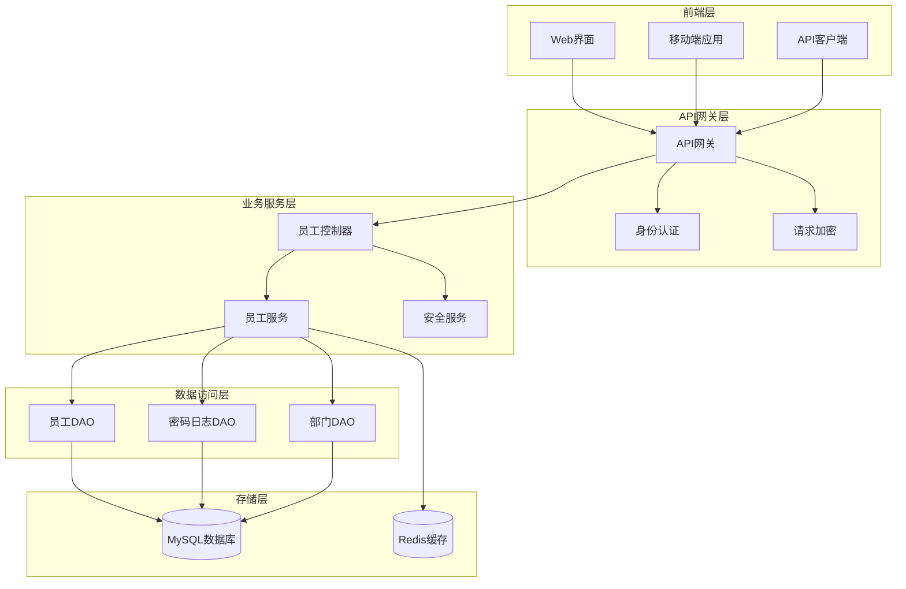
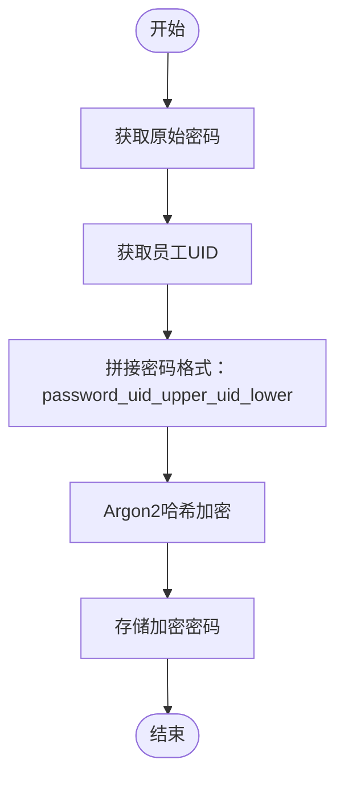
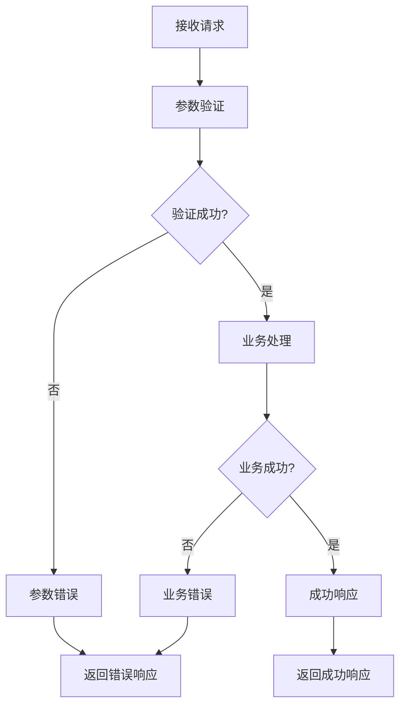

# 员工管理API文档

<cite>
**本文档中引用的文件**
- [employee-api.js](file://smart-admin-web-javascript/src/api/system/employee-api.js)
- [EmployeeController.java](file://smart-admin-api-java17-springboot3/sa-admin/src/main/java/net/lab1024/sa/admin/module/system/employee/controller/EmployeeController.java)
- [EmployeeService.java](file://smart-admin-api-java17-springboot3/sa-admin/src/main/java/net/lab1024/sa/admin/module/system/employee/service/EmployeeService.java)
- [EmployeeQueryForm.java](file://smart-admin-api-java17-springboot3/sa-admin/src/main/java/net/lab1024/sa/admin/module/system/employee/domain/form/EmployeeQueryForm.java)
- [EmployeeAddForm.java](file://smart-admin-api-java17-springboot3/sa-admin/src/main/java/net/lab1024/sa/admin/module/system/employee/domain/form/EmployeeAddForm.java)
- [EmployeeUpdateForm.java](file://smart-admin-api-java17-springboot3/sa-admin/src/main/java/net/lab1024/sa/admin/module/system/employee/domain/form/EmployeeUpdateForm.java)
- [EmployeeUpdatePasswordForm.java](file://smart-admin-api-java17-springboot3/sa-admin/src/main/java/net/lab1024/sa/admin/module/system/employee/domain/form/EmployeeUpdatePasswordForm.java)
- [EmployeeVO.java](file://smart-admin-api-java17-springboot3/sa-admin/src/main/java/net/lab1024/sa/admin/module/system/employee/domain/vo/EmployeeVO.java)
- [SecurityPasswordService.java](file://smart-admin-api-java17-springboot3/sa-base/src/main/java/net/lab1024/sa/base/module/support/securityprotect/service/SecurityPasswordService.java)
- [Level3ProtectConfigService.java](file://smart-admin-api-java17-springboot3/sa-base/src/main/java/net/lab1024/sa/base/module/support/securityprotect/service/Level3ProtectConfigService.java)
</cite>

## 目录
1. [简介](#简介)
2. [系统架构](#系统架构)
3. [核心接口详解](#核心接口详解)
4. [数据模型](#数据模型)
5. [密码安全机制](#密码安全机制)
6. [错误处理](#错误处理)
7. [前端调用示例](#前端调用示例)
8. [最佳实践](#最佳实践)

## 简介

本文档详细介绍了智能管理系统中的员工管理API，涵盖了员工全生命周期的完整管理功能，包括查询、增删改、状态变更、密码管理及批量操作。系统采用前后端分离架构，后端基于Spring Boot 3构建，前端使用JavaScript实现。

## 系统架构



**图表来源**
- [EmployeeController.java](file://smart-admin-api-java17-springboot3/sa-admin/src/main/java/net/lab1024/sa/admin/module/system/employee/controller/EmployeeController.java#L30-L130)
- [EmployeeService.java](file://smart-admin-api-java17-springboot3/sa-admin/src/main/java/net/lab1024/sa/admin/module/system/employee/service/EmployeeService.java#L47-L448)

## 核心接口详解

### 1. 分页查询员工 (query)

**HTTP方法**: POST  
**URL路径**: `/employee/query`  
**权限要求**: 无特殊权限

#### 请求参数
```javascript
{
  "keyword": "搜索关键词",
  "departmentId": 123,
  "disabledFlag": false,
  "employeeIdList": [1, 2, 3],
  "pageNum": 1,
  "pageSize": 10
}
```

#### 响应格式
```javascript
{
  "code": 200,
  "data": {
    "records": [
      {
        "employeeId": 1,
        "loginName": "admin",
        "actualName": "管理员",
        "gender": 1,
        "phone": "13800138000",
        "email": "admin@example.com",
        "departmentId": 10,
        "departmentName": "技术部",
        "positionId": 5,
        "positionName": "开发工程师",
        "roleIdList": [1, 2],
        "roleNameList": ["超级管理员", "普通用户"],
        "disabledFlag": false,
        "createTime": "2024-01-01T00:00:00"
      }
    ],
    "total": 100,
    "size": 10,
    "current": 1
  },
  "msg": "success"
}
```

**节来源**
- [EmployeeController.java](file://smart-admin-api-java17-springboot3/sa-admin/src/main/java/net/lab1024/sa/admin/module/system/employee/controller/EmployeeController.java#L40-L44)
- [EmployeeQueryForm.java](file://smart-admin-api-java17-springboot3/sa-admin/src/main/java/net/lab1024/sa/admin/module/system/employee/domain/form/EmployeeQueryForm.java#L21-L41)

### 2. 添加员工 (addEmployee)

**HTTP方法**: POST  
**URL路径**: `/employee/add`  
**权限要求**: `system:employee:add`

#### 请求参数
```javascript
{
  "actualName": "张三",
  "loginName": "zhangsan",
  "gender": 1,
  "departmentId": 10,
  "disabledFlag": false,
  "phone": "13800138000",
  "email": "zhangsan@example.com",
  "positionId": 5,
  "roleIdList": [1, 2],
  "remark": "新入职员工"
}
```

#### 响应格式
```javascript
{
  "code": 200,
  "data": "Aa1@abcd",
  "msg": "success"
}
```
返回值为新创建员工的初始密码。

**节来源**
- [EmployeeController.java](file://smart-admin-api-java17-springboot3/sa-admin/src/main/java/net/lab1024/sa/admin/module/system/employee/controller/EmployeeController.java#L46-L51)
- [EmployeeAddForm.java](file://smart-admin-api-java17-springboot3/sa-admin/src/main/java/net/lab1024/sa/admin/module/system/employee/domain/form/EmployeeAddForm.java#L25-L70)

### 3. 更新员工信息 (updateEmployee)

**HTTP方法**: POST  
**URL路径**: `/employee/update`  
**权限要求**: `system:employee:update`

#### 请求参数
```javascript
{
  "employeeId": 1,
  "actualName": "李四",
  "gender": 1,
  "departmentId": 15,
  "disabledFlag": false,
  "phone": "13800138001",
  "email": "lisi@example.com",
  "positionId": 8,
  "roleIdList": [2],
  "remark": "更新后的备注"
}
```

#### 响应格式
```javascript
{
  "code": 200,
  "data": null,
  "msg": "success"
}
```

**节来源**
- [EmployeeController.java](file://smart-admin-api-java17-springboot3/sa-admin/src/main/java/net/lab1024/sa/admin/module/system/employee/controller/EmployeeController.java#L53-L58)
- [EmployeeUpdateForm.java](file://smart-admin-api-java17-springboot3/sa-admin/src/main/java/net/lab1024/sa/admin/module/system/employee/domain/form/EmployeeUpdateForm.java#L16-L23)

### 4. 更新个人中心信息 (updateCenter)

**HTTP方法**: POST  
**URL路径**: `/employee/update/center`  
**权限要求**: 无特殊权限

#### 请求参数
```javascript
{
  "actualName": "王五",
  "gender": 1,
  "phone": "13800138002",
  "email": "wangwu@example.com",
  "avatar": "https://example.com/avatar.jpg"
}
```

#### 响应格式
```javascript
{
  "code": 200,
  "data": null,
  "msg": "success"
}
```

**节来源**
- [EmployeeController.java](file://smart-admin-api-java17-springboot3/sa-admin/src/main/java/net/lab1024/sa/admin/module/system/employee/controller/EmployeeController.java#L60-L65)

### 5. 更新头像 (updateAvatar)

**HTTP方法**: POST  
**URL路径**: `/employee/update/avatar`  
**权限要求**: 无特殊权限

#### 请求参数
```javascript
{
  "avatar": "https://example.com/new-avatar.jpg"
}
```

#### 响应格式
```javascript
{
  "code": 200,
  "data": null,
  "msg": "success"
}
```

**节来源**
- [EmployeeController.java](file://smart-admin-api-java17-springboot3/sa-admin/src/main/java/net/lab1024/sa/admin/module/system/employee/controller/EmployeeController.java#L66-L72)
- [EmployeeUpdateAvatarForm.java](file://smart-admin-api-java17-springboot3/sa-admin/src/main/java/net/lab1024/sa/admin/module/system/employee/domain/form/EmployeeUpdateAvatarForm.java#L1-L25)

### 6. 启用/禁用员工 (updateDisableFlag)

**HTTP方法**: GET  
**URL路径**: `/employee/update/disabled/{employeeId}`  
**权限要求**: `system:employee:disabled`

#### URL参数
- `employeeId`: 员工ID

#### 响应格式
```javascript
{
  "code": 200,
  "data": null,
  "msg": "success"
}
```

**节来源**
- [EmployeeController.java](file://smart-admin-api-java17-springboot3/sa-admin/src/main/java/net/lab1024/sa/admin/module/system/employee/controller/EmployeeController.java#L74-L79)

### 7. 批量删除员工 (batchUpdateDeleteFlag)

**HTTP方法**: POST  
**URL路径**: `/employee/update/batch/delete`  
**权限要求**: `system:employee:delete`

#### 请求参数
```javascript
[1, 2, 3, 4, 5]
```

#### 响应格式
```javascript
{
  "code": 200,
  "data": null,
  "msg": "success"
}
```

**节来源**
- [EmployeeController.java](file://smart-admin-api-java17-springboot3/sa-admin/src/main/java/net/lab1024/sa/admin/module/system/employee/controller/EmployeeController.java#L80-L86)

### 8. 批量调整部门 (batchUpdateDepartment)

**HTTP方法**: POST  
**URL路径**: `/employee/update/batch/department`  
**权限要求**: `system:employee:department:update`

#### 请求参数
```javascript
{
  "employeeIdList": [1, 2, 3],
  "departmentId": 20
}
```

#### 响应格式
```javascript
{
  "code": 200,
  "data": null,
  "msg": "success"
}
```

**节来源**
- [EmployeeController.java](file://smart-admin-api-java17-springboot3/sa-admin/src/main/java/net/lab1024/sa/admin/module/system/employee/controller/EmployeeController.java#L88-L93)
- [EmployeeBatchUpdateDepartmentForm.java](file://smart-admin-api-java17-springboot3/sa-admin/src/main/java/net/lab1024/sa/admin/module/system/employee/domain/form/EmployeeBatchUpdateDepartmentForm.java#L1-L31)

### 9. 修改密码 (updatePassword)

**HTTP方法**: POST  
**URL路径**: `/employee/update/password`  
**权限要求**: 无特殊权限  
**请求加密**: 是

#### 请求参数
```javascript
{
  "oldPassword": "oldPassword123",
  "newPassword": "newPassword@123"
}
```

#### 响应格式
```javascript
{
  "code": 200,
  "data": null,
  "msg": "success"
}
```

**节来源**
- [EmployeeController.java](file://smart-admin-api-java17-springboot3/sa-admin/src/main/java/net/lab1024/sa/admin/module/system/employee/controller/EmployeeController.java#L95-L101)
- [EmployeeUpdatePasswordForm.java](file://smart-admin-api-java17-springboot3/sa-admin/src/main/java/net/lab1024/sa/admin/module/system/employee/domain/form/EmployeeUpdatePasswordForm.java#L16-L30)

### 10. 重置密码 (resetPassword)

**HTTP方法**: GET  
**URL路径**: `/employee/update/password/reset/{employeeId}`  
**权限要求**: `system:employee:password:reset`

#### URL参数
- `employeeId`: 员工ID

#### 响应格式
```javascript
{
  "code": 200,
  "data": "Aa1@reset",
  "msg": "success"
}
```
返回值为重置后的随机密码。

**节来源**
- [EmployeeController.java](file://smart-admin-api-java17-springboot3/sa-admin/src/main/java/net/lab1024/sa/admin/module/system/employee/controller/EmployeeController.java#L110-L115)

### 11. 查询所有员工 (queryAllEmployee)

**HTTP方法**: GET  
**URL路径**: `/employee/queryAll`  
**权限要求**: 无特殊权限

#### 查询参数
- `disabledFlag`: 是否禁用（可选）

#### 响应格式
```javascript
{
  "code": 200,
  "data": [
    {
      "employeeId": 1,
      "loginName": "admin",
      "actualName": "管理员",
      "gender": 1,
      "phone": "13800138000",
      "email": "admin@example.com",
      "departmentId": 10,
      "departmentName": "技术部",
      "positionId": 5,
      "positionName": "开发工程师",
      "roleIdList": [1, 2],
      "roleNameList": ["超级管理员", "普通用户"],
      "disabledFlag": false,
      "createTime": "2024-01-01T00:00:00"
    }
  ],
  "msg": "success"
}
```

**节来源**
- [EmployeeController.java](file://smart-admin-api-java17-springboot3/sa-admin/src/main/java/net/lab1024/sa/admin/module/system/employee/controller/EmployeeController.java#L123-L127)

### 12. 查询员工-根据部门ID (queryEmployeeByDeptId)

**HTTP方法**: GET  
**URL路径**: `/employee/getAllEmployeeByDepartmentId/{departmentId}`  
**权限要求**: 无特殊权限

#### URL参数
- `departmentId`: 部门ID

#### 响应格式
```javascript
{
  "code": 200,
  "data": [
    {
      "employeeId": 1,
      "loginName": "admin",
      "actualName": "管理员",
      "gender": 1,
      "phone": "13800138000",
      "email": "admin@example.com",
      "departmentId": 10,
      "departmentName": "技术部",
      "positionId": 5,
      "positionName": "开发工程师",
      "roleIdList": [1, 2],
      "roleNameList": ["超级管理员", "普通用户"],
      "disabledFlag": false,
      "createTime": "2024-01-01T00:00:00"
    }
  ],
  "msg": "success"
}
```

**节来源**
- [EmployeeController.java](file://smart-admin-api-java17-springboot3/sa-admin/src/main/java/net/lab1024/sa/admin/module/system/employee/controller/EmployeeController.java#L117-L122)

## 数据模型

### 员工查询表单 (EmployeeQueryForm)

| 字段名 | 类型 | 必填 | 描述 | 验证规则 |
|--------|------|------|------|----------|
| keyword | String | 否 | 搜索关键词 | 最多20字符 |
| departmentId | Long | 否 | 部门ID | 无 |
| disabledFlag | Boolean | 否 | 是否禁用 | 无 |
| employeeIdList | List<Long> | 否 | 员工ID集合 | 最多99个 |
| pageNum | Integer | 是 | 页码 | 无 |
| pageSize | Integer | 是 | 每页数量 | 无 |

### 员工添加表单 (EmployeeAddForm)

| 字段名 | 类型 | 必填 | 描述 | 验证规则 |
|--------|------|------|------|----------|
| actualName | String | 是 | 姓名 | 不能为空，最多30字符 |
| loginName | String | 是 | 登录账号 | 不能为空，最多30字符 |
| gender | Integer | 是 | 性别 | 枚举值验证 |
| departmentId | Long | 是 | 部门ID | 不能为空 |
| disabledFlag | Boolean | 是 | 是否启用 | 不能为空 |
| phone | String | 是 | 手机号 | 不能为空，格式验证 |
| email | String | 是 | 邮箱账号 | 不能为空，格式验证 |
| positionId | Long | 否 | 职务级别ID | 无 |
| roleIdList | List<Long> | 否 | 角色列表 | 无 |
| remark | String | 否 | 备注 | 最多200字符 |

### 员工视图对象 (EmployeeVO)

| 字段名 | 类型 | 描述 |
|--------|------|------|
| employeeId | Long | 主键ID |
| loginName | String | 登录账号 |
| gender | Integer | 性别 |
| actualName | String | 员工名称 |
| phone | String | 手机号码 |
| departmentId | Long | 部门ID |
| departmentName | String | 部门名称 |
| positionId | Long | 职务ID |
| positionName | String | 职务名称 |
| roleIdList | List<Long> | 角色ID列表 |
| roleNameList | List<String> | 角色名称列表 |
| disabledFlag | Boolean | 是否被禁用 |
| administratorFlag | Boolean | 是否超级管理员 |
| email | String | 邮箱 |
| createTime | LocalDateTime | 创建时间 |

**节来源**
- [EmployeeQueryForm.java](file://smart-admin-api-java17-springboot3/sa-admin/src/main/java/net/lab1024/sa/admin/module/system/employee/domain/form/EmployeeQueryForm.java#L21-L41)
- [EmployeeAddForm.java](file://smart-admin-api-java17-springboot3/sa-admin/src/main/java/net/lab1024/sa/admin/module/system/employee/domain/form/EmployeeAddForm.java#L25-L70)
- [EmployeeVO.java](file://smart-admin-api-java17-springboot3/sa-admin/src/main/java/net/lab1024/sa/admin/module/system/employee/domain/vo/EmployeeVO.java#L21-L69)

## 密码安全机制

### 密码加盐加密逻辑

系统采用独特的加盐密码加密机制，确保密码安全性：



**图表来源**
- [EmployeeService.java](file://smart-admin-api-java17-springboot3/sa-admin/src/main/java/net/lab1024/sa/admin/module/system/employee/service/EmployeeService.java#L438-L446)

#### 密码生成算法
```java
// 格式：[password]_[uid大写]_[uid小写]
public String generateSaltPassword(String password, String employeeUid) {
    return password + "_" +
           employeeUid.toUpperCase() + "_" +
           employeeUid.toLowerCase();
}
```

### 三级等保密码策略

系统遵循中国三级等保标准，实施严格的密码安全策略：

#### 密码复杂度要求
- **长度要求**: 8-20位字符
- **字符类型**: 必须包含大小写字母、数字、特殊符号三种及以上组合
- **正则表达式**: `^(?![a-zA-Z]+$)(?![A-Z0-9]+$)(?![A-Z\\W_!@#$%^&*`~()-+=]+$)(?![a-z0-9]+$)(?![a-z\\W_!@#$%^&*`~()-+=]+$)(?![0-9\\W_!@#$%^&*`~()-+=]+$)[a-zA-Z0-9\\W_!@#$%^&*`~()-+=]*$`

#### 密码安全特性
1. **Argon2加密**: 使用Spring Security提供的Argon2PasswordEncoder
2. **定期更换**: 支持定期强制修改密码
3. **重复检测**: 防止使用历史密码
4. **随机生成**: 支持复杂度可配置的随机密码生成

#### 配置参数

| 参数名 | 默认值 | 描述 |
|--------|--------|------|
| passwordComplexityEnabled | true | 密码复杂度是否开启 |
| regularChangePasswordDays | 90天 | 定期修改密码间隔 |
| regularChangePasswordNotAllowRepeatTimes | 3次 | 不允许重复使用的历史密码次数 |

**节来源**
- [SecurityPasswordService.java](file://smart-admin-api-java17-springboot3/sa-base/src/main/java/net/lab1024/sa/base/module/support/securityprotect/service/SecurityPasswordService.java#L25-L156)
- [Level3ProtectConfigService.java](file://smart-admin-api-java17-springboot3/sa-base/src/main/java/net/lab1024/sa/base/module/support/securityprotect/service/Level3ProtectConfigService.java#L79-L188)

## 错误处理

### 常见错误码

| 错误码 | 错误消息 | 描述 |
|--------|----------|------|
| 400 | "登录名重复" | 添加或更新员工时登录名已存在 |
| 400 | "手机号已存在" | 添加或更新员工时手机号已存在 |
| 400 | "邮箱账号已存在" | 添加或更新员工时邮箱已存在 |
| 400 | "部门不存在" | 指定的部门ID不存在 |
| 400 | "原密码有误，请重新输入" | 修改密码时原密码不正确 |
| 400 | "新密码与原始密码相同，请重新输入" | 新密码与原密码相同 |
| 400 | "密码必须为长度8-20位且必须包含大小写字母、数字、特殊符号等三种字符" | 密码复杂度不满足要求 |
| 400 | "与前3个历史密码重复，请换个密码!" | 密码重复使用检测失败 |

### 错误处理流程



**节来源**
- [EmployeeService.java](file://smart-admin-api-java17-springboot3/sa-admin/src/main/java/net/lab1024/sa/admin/module/system/employee/service/EmployeeService.java#L122-L155)

## 前端调用示例

### 基础API调用封装

```javascript
// 员工管理API封装
import { getRequest, postEncryptRequest, postRequest } from '/@/lib/axios';

export const employeeApi = {
  /**
   * 查询所有员工
   */
  queryAll: () => {
    return getRequest('/employee/queryAll');
  },
  
  /**
   * 员工管理查询
   */
  queryEmployee: (params) => {
    return postRequest('/employee/query', params);
  },
  
  /**
   * 添加员工
   */
  addEmployee: (params) => {
    return postRequest('/employee/add', params);
  },
  
  /**
   * 更新员工信息
   */
  updateEmployee: (params) => {
    return postRequest('/employee/update', params);
  },
  
  /**
   * 更新员工个人中心信息
   */
  updateCenter: (params) => {
    return postRequest('/employee/update/center', params);
  },
  
  /**
   * 更新登录人头像
   */
  updateAvatar: (params) => {
    return postRequest('/employee/update/avatar', params);
  },
  
  /**
   * 删除员工
   */
  deleteEmployee: (employeeId) => {
    return getRequest(`/employee/delete/${employeeId}`);
  },
  
  /**
   * 批量删除员工
   */
  batchDeleteEmployee: (employeeIdList) => {
    return postRequest('/employee/update/batch/delete', employeeIdList);
  },
  
  /**
   * 批量调整员工部门
   */
  batchUpdateDepartmentEmployee: (updateParam) => {
    return postRequest('/employee/update/batch/department', updateParam);
  },
  
  /**
   * 重置员工密码
   */
  resetPassword: (employeeId) => {
    return getRequest(`/employee/update/password/reset/${employeeId}`);
  },
  
  /**
   * 修改密码
   */
  updateEmployeePassword: (param) => {
    return postEncryptRequest('/employee/update/password', param);
  },
  
  /**
   * 获取密码复杂度
   */
  getPasswordComplexityEnabled: () => {
    return getRequest('/employee/getPasswordComplexityEnabled');
  },
  
  /**
   * 更新员工禁用状态
   */
  updateDisabled: (employeeId) => {
    return getRequest(`/employee/update/disabled/${employeeId}`);
  },
  
  /**
   * 查询员工-根据部门id
   */
  queryEmployeeByDeptId: (departmentId) => {
    return getRequest(`/employee/getAllEmployeeByDepartmentId/${departmentId}`);
  },
};
```

### 实际使用示例

#### 添加员工示例
```javascript
// 添加员工
async function createEmployee() {
  try {
    const employeeData = {
      actualName: "张三",
      loginName: "zhangsan",
      gender: 1,
      departmentId: 10,
      disabledFlag: false,
      phone: "13800138000",
      email: "zhangsan@example.com",
      positionId: 5,
      roleIdList: [1, 2],
      remark: "新入职员工"
    };
    
    const response = await employeeApi.addEmployee(employeeData);
    if (response.code === 200) {
      console.log("员工添加成功，初始密码:", response.data);
      // 显示初始密码给管理员
      showInitialPassword(response.data);
    }
  } catch (error) {
    console.error("添加员工失败:", error);
  }
}
```

#### 修改密码示例
```javascript
// 修改密码
async function changePassword() {
  try {
    const passwordData = {
      oldPassword: "oldPassword123",
      newPassword: "newPassword@123"
    };
    
    const response = await employeeApi.updateEmployeePassword(passwordData);
    if (response.code === 200) {
      console.log("密码修改成功");
      showMessage("密码修改成功，请使用新密码登录");
    }
  } catch (error) {
    console.error("修改密码失败:", error);
  }
}
```

#### 查询员工示例
```javascript
// 查询员工
async function searchEmployees(keyword = '', departmentId = null) {
  try {
    const params = {
      keyword: keyword,
      departmentId: departmentId,
      pageNum: 1,
      pageSize: 10
    };
    
    const response = await employeeApi.queryEmployee(params);
    if (response.code === 200) {
      const employees = response.data.records;
      renderEmployeeList(employees);
    }
  } catch (error) {
    console.error("查询员工失败:", error);
  }
}
```

**节来源**
- [employee-api.js](file://smart-admin-web-javascript/src/api/system/employee-api.js#L1-L99)

## 最佳实践

### 1. 安全最佳实践

#### 密码管理
- 使用强密码策略，确保密码复杂度
- 定期强制用户修改密码
- 防止密码重复使用
- 使用HTTPS传输敏感信息

#### 权限控制
- 实施最小权限原则
- 定期审查用户权限
- 记录关键操作审计日志

### 2. 性能优化建议

#### 查询优化
- 合理使用分页查询
- 对常用查询添加缓存
- 优化数据库索引

#### 批量操作
- 控制批量操作的数据量
- 使用事务保证数据一致性
- 提供进度反馈机制

### 3. 错误处理建议

#### 用户友好提示
- 提供清晰的错误信息
- 引导用户正确操作
- 记录详细的错误日志

#### 系统稳定性
- 实施熔断机制
- 提供降级方案
- 监控系统健康状态

### 4. 开发规范

#### 接口设计
- 保持接口版本兼容性
- 使用统一的响应格式
- 完善的接口文档

#### 代码质量
- 实施代码审查
- 编写单元测试
- 遵循编码规范

通过遵循这些最佳实践，可以确保员工管理系统的安全性、稳定性和可维护性，为用户提供优质的管理体验。