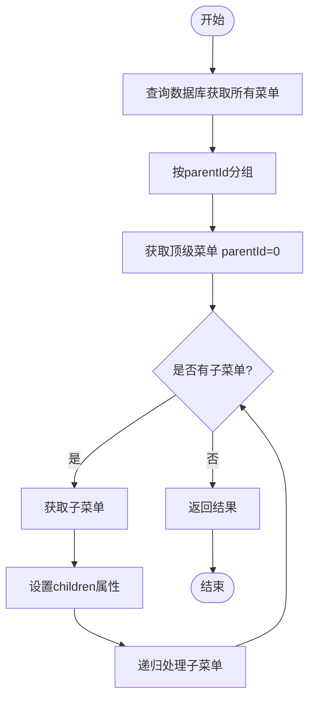

# 菜单管理API

<cite>
**本文档引用的文件**
- [MenuController.java](file://smart-admin-api-java17-springboot3\sa-admin\src\main\java\net\lab1024\sa\admin\module\system\menu\controller\MenuController.java)
- [MenuService.java](file://smart-admin-api-java17-springboot3\sa-admin\src\main\java\net\lab1024\sa\admin\module\system\menu\service\MenuService.java)
- [MenuAddForm.java](file://smart-admin-api-java17-springboot3\sa-admin\src\main\java\net\lab1024\sa\admin\module\system\menu\domain\form\MenuAddForm.java)
- [MenuUpdateForm.java](file://smart-admin-api-java17-springboot3\sa-admin\src\main\java\net\lab1024\sa\admin\module\system\menu\domain\form\MenuUpdateForm.java)
- [MenuVO.java](file://smart-admin-api-java17-springboot3\sa-admin\src\main\java\net\lab1024\sa\admin\module\system\menu\domain\vo\MenuVO.java)
- [MenuTreeVO.java](file://smart-admin-api-java17-springboot3\sa-admin\src\main\java\net\lab1024\sa\admin\module\system\menu\domain\vo\MenuTreeVO.java)
- [menu-api.js](file://smart-admin-web-javascript\src\api\system\menu-api.js)
- [menu-data-handler.js](file://smart-admin-web-javascript\src\views\system\menu\menu-data-handler.js)
- [user.js](file://smart-admin-web-javascript\src\store\modules\system\user.js)
</cite>

## 目录
1. [简介](#简介)
2. [核心API接口](#核心api接口)
3. [请求参数与响应结构](#请求参数与响应结构)
4. [业务约束与校验规则](#业务约束与校验规则)
5. [菜单树构建逻辑](#菜单树构建逻辑)
6. [前端调用示例](#前端调用示例)
7. [缓存策略](#缓存策略)

## 简介
本API文档详细说明了系统菜单管理模块的接口设计，涵盖菜单的增删改查、树形结构构建及权限配置功能。系统通过`MenuController`提供RESTful API，支持菜单的全生命周期管理，包括添加、更新、批量删除、查询列表、获取详情、查询菜单树以及获取所有系统请求路径等功能。

**Section sources**
- [MenuController.java](file://smart-admin-api-java17-springboot3\sa-admin\src\main\java\net\lab1024\sa\admin\module\system\menu\controller\MenuController.java#L1-L30)

## 核心API接口

### 添加菜单 (addMenu)
- **HTTP方法**: POST
- **URL路径**: `/menu/add`
- **权限要求**: `system:menu:add`
- **功能描述**: 添加新的菜单项，需校验菜单名和权限字符串的唯一性

### 更新菜单 (updateMenu)
- **HTTP方法**: POST
- **URL路径**: `/menu/update`
- **权限要求**: `system:menu:update`
- **功能描述**: 更新现有菜单信息，禁止自环引用（上级菜单不能是自身）

### 批量删除菜单 (batchDeleteMenu)
- **HTTP方法**: GET
- **URL路径**: `/menu/batchDelete`
- **权限要求**: `system:menu:batchDelete`
- **功能描述**: 批量删除菜单，支持级联删除子菜单

### 查询菜单列表 (queryMenuList)
- **HTTP方法**: GET
- **URL路径**: `/menu/query`
- **功能描述**: 查询所有菜单列表

### 获取菜单详情 (getMenuDetail)
- **HTTP方法**: GET
- **URL路径**: `/menu/detail/{menuId}`
- **功能描述**: 根据菜单ID获取菜单详情

### 查询菜单树 (queryMenuTree)
- **HTTP方法**: GET
- **URL路径**: `/menu/tree`
- **功能描述**: 查询菜单树结构，支持仅查询菜单类型

### 获取所有请求路径 (getAuthUrl)
- **HTTP方法**: GET
- **URL路径**: `/menu/auth/url`
- **功能描述**: 获取系统中所有需要权限控制的请求路径

**Section sources**
- [MenuController.java](file://smart-admin-api-java17-springboot3\sa-admin\src\main\java\net\lab1024\sa\admin\module\system\menu\controller\MenuController.java#L37-L83)

## 请求参数与响应结构

### 请求参数

#### 添加菜单请求体 (MenuAddForm)
- `menuName`: 菜单名称
- `parentId`: 上级菜单ID（0表示顶级菜单）
- `menuType`: 菜单类型（目录、菜单、按钮）
- `path`: 路由路径
- `component`: 组件路径
- `icon`: 图标
- `sort`: 排序号
- `visibleFlag`: 是否可见
- `disabledFlag`: 是否禁用
- `webPerms`: 前端权限字符串
- `apiPerms`: 后端API权限字符串

#### 更新菜单请求体 (MenuUpdateForm)
- 包含MenuAddForm的所有字段
- `menuId`: 菜单ID（必填）

#### 批量删除菜单参数
- `menuIdList`: 菜单ID列表（逗号分隔）

#### 查询菜单树参数
- `onlyMenu`: 是否仅查询菜单类型（true/false）

### 响应结构

#### 菜单基本信息 (MenuVO)
```json
{
  "menuId": 1,
  "menuName": "系统管理",
  "parentId": 0,
  "menuType": 1,
  "path": "/system",
  "component": "Layout",
  "icon": "SettingOutlined",
  "sort": 1,
  "visibleFlag": true,
  "disabledFlag": false,
  "webPerms": "system:manage",
  "apiPerms": "system:api",
  "createTime": "2023-01-01T00:00:00",
  "createUserId": 1,
  "updateTime": "2023-01-01T00:00:00",
  "updateUserId": 1
}
```

#### 菜单树结构 (MenuTreeVO)
```json
{
  "menuId": 1,
  "menuName": "系统管理",
  "parentId": 0,
  "menuType": 1,
  "path": "/system",
  "component": "Layout",
  "icon": "SettingOutlined",
  "sort": 1,
  "visibleFlag": true,
  "disabledFlag": false,
  "webPerms": "system:manage",
  "apiPerms": "system:api",
  "createTime": "2023-01-01T00:00:00",
  "createUserId": 1,
  "updateTime": "2023-01-01T00:00:00",
  "updateUserId": 1,
  "children": [
    {
      "menuId": 2,
      "menuName": "用户管理",
      "parentId": 1,
      "menuType": 2,
      "path": "/system/user",
      "component": "system/user/index",
      "icon": "UserOutlined",
      "sort": 1,
      "visibleFlag": true,
      "disabledFlag": false,
      "webPerms": "system:user",
      "apiPerms": "system:user:api",
      "createTime": "2023-01-01T00:00:00",
      "createUserId": 1,
      "updateTime": "2023-01-01T00:00:00",
      "updateUserId": 1,
      "children": []
    }
  ]
}
```

#### 通用响应格式
```json
{
  "code": 200,
  "data": {},
  "msg": "操作成功"
}
```

**Section sources**
- [MenuAddForm.java](file://smart-admin-api-java17-springboot3\sa-admin\src\main\java\net\lab1024\sa\admin\module\system\menu\domain\form\MenuAddForm.java#L1-L21)
- [MenuUpdateForm.java](file://smart-admin-api-java17-springboot3\sa-admin\src\main\java\net\lab1024\sa\admin\module\system\menu\domain\form\MenuUpdateForm.java#L1-L26)
- [MenuVO.java](file://smart-admin-api-java17-springboot3\sa-admin\src\main\java\net\lab1024\sa\admin\module\system\menu\domain\vo\MenuVO.java#L1-L36)
- [MenuTreeVO.java](file://smart-admin-api-java17-springboot3\sa-admin\src\main\java\net\lab1024\sa\admin\module\system\menu\domain\vo\MenuTreeVO.java#L1-L23)

## 业务约束与校验规则

### 添加菜单校验
1. **菜单名唯一性校验**: 检查同级菜单中是否存在相同名称的菜单
2. **前端权限字符串唯一性校验**: 检查系统中是否存在相同的前端权限字符串
3. **必填字段校验**: 菜单名称、上级菜单ID等必填字段不能为空

### 更新菜单校验
1. **菜单存在性校验**: 检查要更新的菜单是否存在
2. **菜单状态校验**: 检查菜单是否已被删除
3. **菜单名唯一性校验**: 检查同级菜单中是否存在相同名称的菜单（排除自身）
4. **前端权限字符串唯一性校验**: 检查系统中是否存在相同的前端权限字符串（排除自身）
5. **自环引用校验**: 禁止将菜单的上级菜单设置为自身

### 批量删除菜单校验
1. **菜单ID非空校验**: 删除的菜单ID列表不能为空
2. **级联删除**: 删除菜单时会级联删除其所有子菜单

### 查询菜单树约束
1. **仅菜单类型查询**: 当`onlyMenu`参数为true时，只返回目录和菜单类型的节点，不包含按钮类型
2. **有效菜单过滤**: 只返回未删除、未禁用的菜单

### 错误码说明
- `200`: 操作成功
- `400`: 用户参数错误
- `500`: 系统错误
- `菜单名称已存在`: 菜单名称重复
- `前端权限字符串已存在`: 前端权限字符串重复
- `上级菜单不能为自己`: 自环引用错误
- `菜单不存在`: 要操作的菜单不存在
- `菜单已被删除`: 要操作的菜单已被删除
- `所选菜单不能为空`: 批量删除时菜单ID列表为空

**Section sources**
- [MenuService.java](file://smart-admin-api-java17-springboot3\sa-admin\src\main\java\net\lab1024\sa\admin\module\system\menu\service\MenuService.java#L49-L151)

## 菜单树构建逻辑

### 后端构建逻辑
后端通过`MenuService`的`buildMenuTree`方法递归构建菜单树：

1. 从数据库查询所有菜单列表
2. 根据`parentId`对菜单进行分组
3. 从顶级菜单（parentId=0）开始递归构建树结构
4. 为每个菜单节点设置其子菜单列表



**Diagram sources**
- [MenuService.java](file://smart-admin-api-java17-springboot3\sa-admin\src\main\java\net\lab1024\sa\admin\module\system\menu\service\MenuService.java#L202-L211)

### 前端构建逻辑
前端通过`buildMenuTree`方法构建菜单树：

1. 过滤出有效的目录和菜单（排除按钮类型、隐藏和禁用的菜单）
2. 获取顶级目录（parentId=0）
3. 递归构建子菜单结构

```javascript
function buildMenuTree(menuList) {
  // 获取所有有效的目录和菜单
  let catalogAndMenuList = menuList.filter((menu) => 
    menu.menuType !== MENU_TYPE_ENUM.POINTS.value && 
    menu.visibleFlag && 
    !menu.disabledFlag
  );

  // 获取顶级目录
  let topCatalogList = catalogAndMenuList.filter((menu) => menu.parentId === 0);
  
  // 递归构建子菜单
  for (const topCatalog of topCatalogList) {
    buildMenuChildren(topCatalog, catalogAndMenuList);
  }
  
  return topCatalogList;
}
```

**Section sources**
- [user.js](file://smart-admin-web-javascript\src\store\modules\system\user.js#L322-L363)

## 前端调用示例

### API调用封装
前端在`menu-api.js`中封装了菜单管理API：

```javascript
export const menuApi = {
  /**
   * 添加菜单
   */
  addMenu: (param) => {
    return postRequest('/menu/add', param);
  },

  /**
   * 更新菜单
   */
  updateMenu: (param) => {
    return postRequest('/menu/update', param);
  },

  /**
   * 批量删除菜单
   */
  batchDeleteMenu: (menuIdList) => {
    return getRequest(`/menu/batchDelete?menuIdList=${menuIdList}`);
  },

  /**
   * 查询菜单树
   */
  queryMenuTree: (onlyMenu) => {
    return getRequest(`/menu/tree?onlyMenu=${onlyMenu}`);
  }
};
```

### 菜单树渲染
前端通过递归组件渲染菜单树：

```vue
<!-- recursion-menu.vue -->
<template>
  <div class="recursion-container" v-show="topMenu.children && topMenu.children.length > 0">
    <div class="top-menu">
      <span class="ant-menu">{{ topMenu.menuName }}</span>
    </div>
    <div class="bottom-menu">
      <a-menu :selectedKeys="selectedKeys" :openKeys="openKeys" mode="inline">
        <template v-for="item in topMenu.children" :key="item.menuId">
          <template v-if="item.visibleFlag">
            <template v-if="!item.children">
              <a-menu-item :key="item.menuId.toString()" @click="turnToPage(item)">
                <template #icon v-if="item.icon">
                  <component :is="$antIcons[item.icon]" />
                </template>
                {{ item.menuName }}
              </a-menu-item>
            </template>
            <template v-else>
              <SubMenu :menu-info="item" :key="item.menuId" @turnToPage="turnToPage" />
            </template>
          </template>
        </template>
      </a-menu>
    </div>
  </div>
</template>
```

**Section sources**
- [menu-api.js](file://smart-admin-web-javascript\src\api\system\menu-api.js#L1-L55)
- [recursion-menu.vue](file://smart-admin-web-javascript\src\layout\components\side-expand-menu\recursion-menu.vue#L1-L118)
- [sub-menu.vue](file://smart-admin-web-javascript\src\layout\components\side-expand-menu\sub-menu.vue#L1-L47)

## 缓存策略

### 后端缓存
系统通过`CacheConfig`配置了Redis缓存，对菜单数据进行缓存以提高查询性能：

1. **缓存键设计**: 使用`CacheKeyConst.MENU_TREE`作为菜单树的缓存键
2. **缓存失效**: 当菜单数据发生变化时（添加、更新、删除），清除相关缓存
3. **缓存更新**: 查询菜单树时优先从缓存读取，缓存不存在时从数据库查询并写入缓存

### 前端缓存
前端在用户store中缓存菜单数据：

1. **菜单数据缓存**: 将用户权限范围内的菜单树缓存在`userStore`中
2. **Keep-Alive缓存**: 对菜单对应的页面组件使用`<keep-alive>`进行缓存，提高页面切换性能
3. **缓存清理**: 当用户登出或菜单权限发生变化时清理菜单缓存

```javascript
// 清理Keep-Alive缓存
useUserStore().deleteKeepAliveIncludes(route.menuId.toString());
```

**Section sources**
- [CacheConfig.java](file://smart-admin-api-java17-springboot3\sa-base\src\main\java\net\lab1024\sa\base\config\CacheConfig.java)
- [user.js](file://smart-admin-web-javascript\src\store\modules\system\user.js)