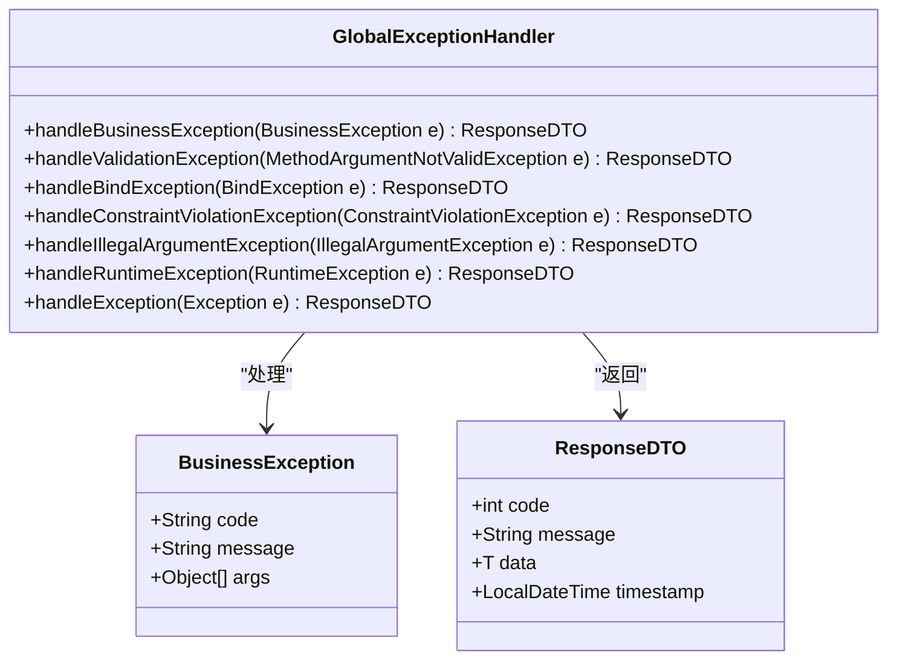
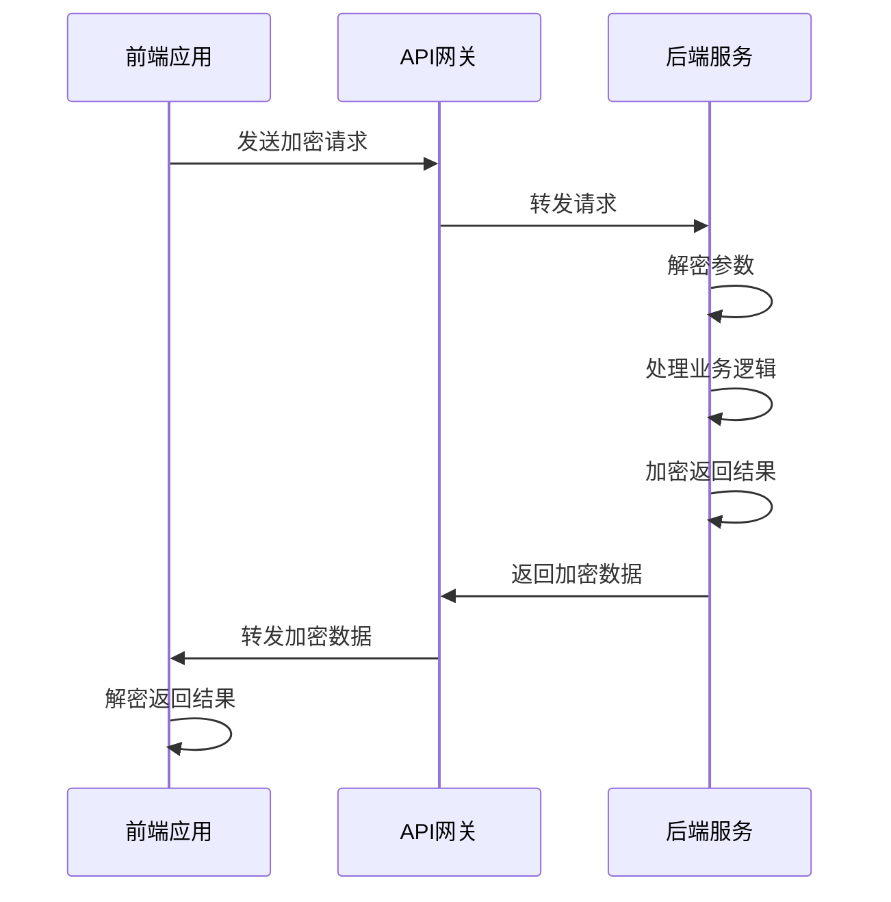

# 公共API与网关

<cite>
**本文档引用文件**   
- [HealthCheckController.java](file://microservices/microservices-common/src/main/java/net/lab1024/sa/common/controller/HealthCheckController.java)
- [SystemHealthController.java](file://restful_refactor_backup_20251202_014224/microservices_ioedream-monitor-service_src_main_java_net_lab1024_sa_monitor_controller_SystemHealthController.java)
- [GlobalExceptionHandler.java](file://documentation/01-核心规范/开发规范/Java编码规范.md)
- [PHASE3_TASK32_EXCEPTION_HANDLING_COMPLETE.md](file://documentation/archive/reports-2025-12-04/PHASE3_TASK32_EXCEPTION_HANDLING_COMPLETE.md)
- [ioedream-gateway-service/pom.xml](file://microservices/ioedream-gateway-service/pom.xml)
- [application.yml](file://microservices/ioedream-gateway-service/src/main/resources/application.yml)
- [SecurityConfig.java](file://microservices/microservices-common/src/main/java/net/lab1024/sa/common/auth/config/SecurityConfig.java)
- [AuthManager.java](file://microservices/microservices-common/src/main/java/net/lab1024/sa/common/auth/manager/AuthManager.java)
- [api-encrypt-api.js](file://smart-admin-web-javascript/src/api/support/api-encrypt-api.js)
- [axios.js](file://smart-admin-web-javascript/src/lib/axios.js)
- [API路径规范.md](file://documentation/01-核心规范/API路径规范.md)
</cite>

## 目录
1. [引言](#引言)
2. [公共服务接口](#公共服务接口)
3. [API网关配置](#api网关配置)
4. [统一认证集成](#统一认证集成)
5. [API加密机制](#api加密机制)
6. [前端调用指南](#前端调用指南)
7. [配置文件解读](#配置文件解读)
8. [调用示例](#调用示例)
9. [结论](#结论)

## 引言
本文档旨在详细描述IOE-DREAM项目中的公共API和网关配置。文档涵盖了健康检查、配置获取、全局异常处理等公共服务接口，深入解析了API网关（ioedream-gateway-service）的路由规则、统一认证（Sa-Token）的集成方式、全局请求/响应拦截器和API加密（api-encrypt）的实现机制。同时，文档解释了前端如何通过网关调用后端服务，并遵循API路径规范，为开发人员提供全面的配置和调用指导。

## 公共服务接口

### 健康检查接口
健康检查接口是系统稳定运行的重要保障，用于监控服务的运行状态。系统提供了基础和详细的健康检查功能。

**基础健康检查**：
- **路径**: `/health`
- **方法**: `GET`
- **功能**: 检查服务的基础运行状态，包括服务名称、时间戳和运行时间。

**详细健康检查**：
- **路径**: `/health/detailed`
- **方法**: `GET`
- **功能**: 检查服务的详细运行状态，包括依赖和资源的健康状况。

**系统健康监控**：
- **路径**: `/api/monitor/health`
- **方法**: `GET`
- **功能**: 获取数据库状态、缓存状态和执行手动健康检查。

**Section sources**
- [HealthCheckController.java](file://microservices/microservices-common/src/main/java/net/lab1024/sa/common/controller/HealthCheckController.java#L54-L82)
- [SystemHealthController.java](file://restful_refactor_backup_20251202_014224/microservices_ioedream-monitor-service_src_main_java_net_lab1024_sa_monitor_controller_SystemHealthController.java#L30-L137)

### 配置获取接口
配置获取接口用于动态获取和更新系统配置，确保系统在运行时能够灵活调整。

**获取配置**：
- **路径**: `/config/list`
- **方法**: `POST`
- **功能**: 根据查询条件获取配置列表。

**更新配置**：
- **路径**: `/config/update`
- **方法**: `POST`
- **功能**: 更新指定配置项的值。

### 全局异常处理
全局异常处理机制确保系统在发生异常时能够统一处理，提供一致的错误响应。

**异常处理规范**：
- **业务异常**: 使用`BusinessException`类，包含错误码和详细消息。
- **参数验证异常**: 使用`MethodArgumentNotValidException`、`BindException`和`ConstraintViolationException`。
- **系统异常**: 使用`Exception`类，捕获所有未处理的异常。

**全局异常处理器**：
- **类名**: `GlobalExceptionHandler`
- **注解**: `@RestControllerAdvice`
- **功能**: 统一处理所有异常，记录日志并返回标准化的错误响应。



**Diagram sources **
- [GlobalExceptionHandler.java](file://documentation/01-核心规范/开发规范/Java编码规范.md#L212-L227)
- [PHASE3_TASK32_EXCEPTION_HANDLING_COMPLETE.md](file://documentation/archive/reports-2025-12-04/PHASE3_TASK32_EXCEPTION_HANDLING_COMPLETE.md#L37-L103)

**Section sources**
- [GlobalExceptionHandler.java](file://documentation/01-核心规范/开发规范/Java编码规范.md#L212-L227)
- [PHASE3_TASK32_EXCEPTION_HANDLING_COMPLETE.md](file://documentation/archive/reports-2025-12-04/PHASE3_TASK32_EXCEPTION_HANDLING_COMPLETE.md#L37-L103)

## API网关配置

### 网关服务概述
API网关（ioedream-gateway-service）是系统的入口，负责路由转发、负载均衡、限流熔断等功能。网关服务基于Spring Cloud Gateway实现，通过Nacos进行服务发现。

**Section sources**
- [ioedream-gateway-service/pom.xml](file://microservices/ioedream-gateway-service/pom.xml#L29-L33)

### 路由规则
网关的路由规则定义了请求如何被转发到后端服务。路由规则通过Nacos配置中心动态管理。

**路由配置示例**：
```yaml
spring:
  cloud:
    gateway:
      routes:
        - id: access-service
          uri: lb://ioedream-access-service
          predicates:
            - Path=/api/access/**
          filters:
            - StripPrefix=1
        - id: attendance-service
          uri: lb://ioedream-attendance-service
          predicates:
            - Path=/api/attendance/**
          filters:
            - StripPrefix=1
```

**Section sources**
- [application.yml](file://microservices/ioedream-gateway-service/src/main/resources/application.yml#L15-L75)

## 统一认证集成

### Sa-Token认证
系统采用Sa-Token作为统一认证框架，实现用户登录、权限验证和会话管理。

**认证流程**：
1. 用户登录，获取访问令牌（Access Token）。
2. 前端在请求头中携带令牌。
3. 网关和服务层验证令牌的有效性。

**认证配置**：
```java
@Configuration
@EnableWebSecurity
@EnableMethodSecurity(prePostEnabled = true, securedEnabled = true, jsr250Enabled = true)
public class SecurityConfig {
    @Bean
    public PasswordEncoder passwordEncoder() {
        return new BCryptPasswordEncoder(10);
    }

    @Bean
    public SecurityFilterChain securityFilterChain(HttpSecurity http) throws Exception {
        http
            .csrf(csrf -> csrf.disable())
            .sessionManagement(session -> session
                .sessionCreationPolicy(SessionCreationPolicy.STATELESS))
            .authorizeHttpRequests(auth -> auth
                .requestMatchers(
                    "/api/v1/auth/login",
                    "/api/v1/auth/refresh",
                    "/api/v1/auth/register",
                    "/actuator/**",
                    "/doc.html",
                    "/swagger-ui/**",
                    "/v3/api-docs/**"
                ).permitAll()
                .anyRequest().authenticated());
        return http.build();
    }
}
```

**Section sources**
- [SecurityConfig.java](file://microservices/microservices-common/src/main/java/net/lab1024/sa/common/auth/config/SecurityConfig.java#L32-L75)
- [AuthManager.java](file://microservices/microservices-common/src/main/java/net/lab1024/sa/common/auth/manager/AuthManager.java#L1-L51)

## API加密机制

### 加密实现
API加密机制用于保护敏感数据在传输过程中的安全。系统支持国密SM和AES加密算法。

**前端加密**：
- **文件**: `/lib/encrypt.js`
- **方法**: `encryptData(data)`
- **功能**: 对请求参数进行加密。

**后端解密**：
- **注解**: `@ApiDecrypt`
- **功能**: 在Controller方法执行前解密请求参数。

**后端加密**：
- **注解**: `@ApiEncrypt`
- **功能**: 在Controller方法执行后加密返回结果。

**前端解密**：
- **文件**: `/lib/axios.js`
- **方法**: `decryptData(data)`
- **功能**: 对返回结果进行解密。



**Diagram sources **
- [api-encrypt-api.js](file://smart-admin-web-javascript/src/api/support/api-encrypt-api.js#L8-L40)
- [axios.js](file://smart-admin-web-javascript/src/lib/axios.js#L76-L83)

**Section sources**
- [api-encrypt-api.js](file://smart-admin-web-javascript/src/api/support/api-encrypt-api.js#L8-L40)
- [axios.js](file://smart-admin-web-javascript/src/lib/axios.js#L76-L83)

## 前端调用指南

### API路径规范
前端调用后端API时，必须遵循API路径规范，确保路径的一致性和可维护性。

**路径格式**：
- **系统模块**: `/module`
- **支持模块**: `/module`
- **业务模块**: `/business/module` 或 `/module`

**HTTP方法**：
- **查询**: `GET`
- **新增**: `POST`
- **更新**: `POST`
- **删除**: `POST`

**示例**：
```javascript
import { getRequest, postRequest, postEncryptRequest } from '/@/lib/axios';

export const employeeApi = {
  queryAll: (params) => {
    return getRequest('/employee/queryAll', params);
  },
  addEmployee: (params) => {
    return postRequest('/employee/add', params);
  },
  updateEmployee: (params) => {
    return postRequest('/employee/update', params);
  },
  deleteEmployee: (employeeId) => {
    return getRequest(`/employee/delete/${employeeId}`);
  },
  updateEmployeePassword: (param) => {
    return postEncryptRequest('/employee/update/password', param);
  },
};
```

**Section sources**
- [API路径规范.md](file://documentation/01-核心规范/API路径规范.md#L11-L539)

## 配置文件解读

### 网关配置文件
网关配置文件`application.yml`定义了服务的基本信息、Nacos配置、服务器配置和监控配置。

**服务基本信息**：
- **服务名称**: `ioedream-gateway-service`
- **服务端口**: `8080`

**Nacos配置**：
- **服务发现**: 配置Nacos服务器地址、命名空间和组。
- **配置中心**: 配置Nacos服务器地址、命名空间和文件扩展名。

**服务器配置**：
- **端口**: `8080`
- **编码**: `UTF-8`

**监控配置**：
- **Actuator**: 暴露健康检查、信息、指标等端点。

**Section sources**
- [application.yml](file://microservices/ioedream-gateway-service/src/main/resources/application.yml#L1-L75)

## 调用示例

### 健康检查调用
```http
GET /health HTTP/1.1
Host: localhost:8080
```

**响应**：
```json
{
  "code": 200,
  "message": "操作成功",
  "data": {
    "status": "UP",
    "service": "ioedream-service",
    "timestamp": "2025-12-02T10:00:00",
    "uptime": 3600
  },
  "timestamp": "2025-12-02T10:00:00"
}
```

### 认证调用
```http
POST /api/v1/auth/login HTTP/1.1
Host: localhost:8080
Content-Type: application/json

{
  "username": "admin",
  "password": "password"
}
```

**响应**：
```json
{
  "code": 200,
  "message": "操作成功",
  "data": {
    "accessToken": "eyJhbGciOiJIUzI1NiIsInR5cCI6IkpXVCJ9...",
    "refreshToken": "eyJhbGciOiJIUzI1NiIsInR5cCI6IkpXVCJ9...",
    "tokenType": "Bearer",
    "expiresIn": 86400,
    "refreshExpiresIn": 604800,
    "userId": 1,
    "username": "admin",
    "nickname": "管理员",
    "avatarUrl": "https://example.com/avatar.jpg",
    "permissions": ["system:menu:query", "system:user:query"],
    "roles": ["admin"]
  },
  "timestamp": "2025-12-02T10:00:00"
}
```

### 加密调用
```http
POST /support/apiEncrypt/testRequestEncrypt HTTP/1.1
Host: localhost:8080
Content-Type: application/json

{
  "name": "张三",
  "age": 30
}
```

**响应**：
```json
{
  "code": 200,
  "message": "操作成功",
  "data": {
    "name": "张三",
    "age": 30
  },
  "timestamp": "2025-12-02T10:00:00"
}
```

## 结论
本文档详细描述了IOE-DREAM项目中的公共API和网关配置，涵盖了健康检查、配置获取、全局异常处理等公共服务接口，以及API网关的路由规则、统一认证集成和API加密机制。通过遵循本文档的指导，开发人员可以更好地理解和使用系统的公共API和网关配置，确保系统的稳定性和安全性。