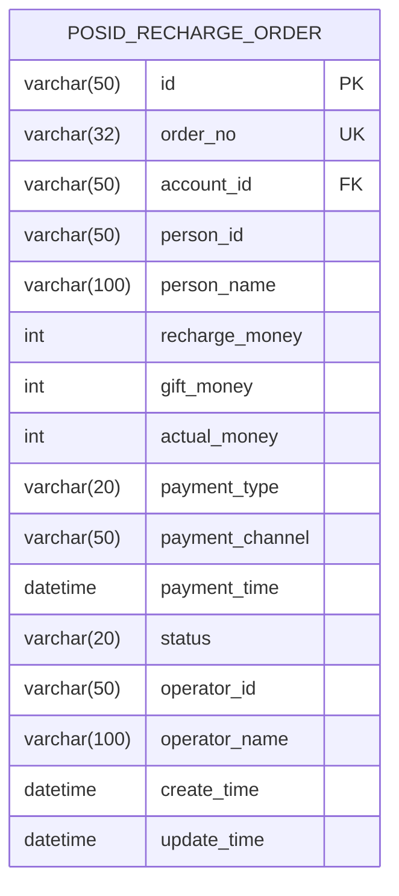
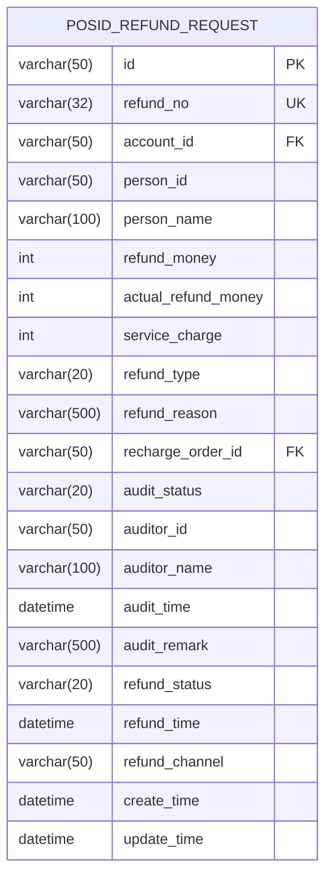
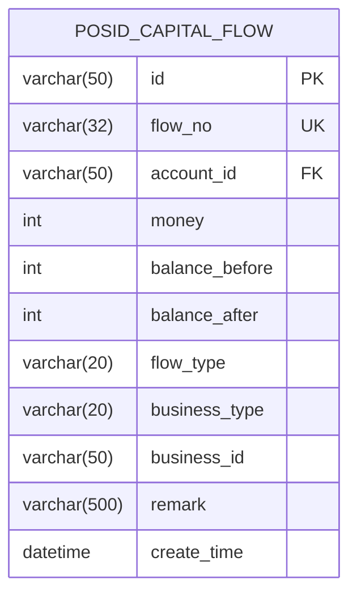
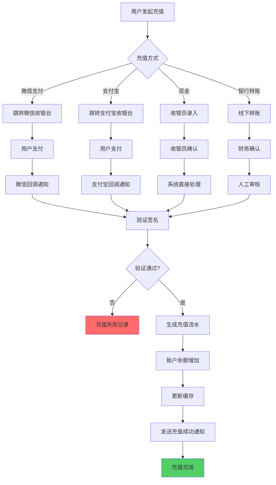
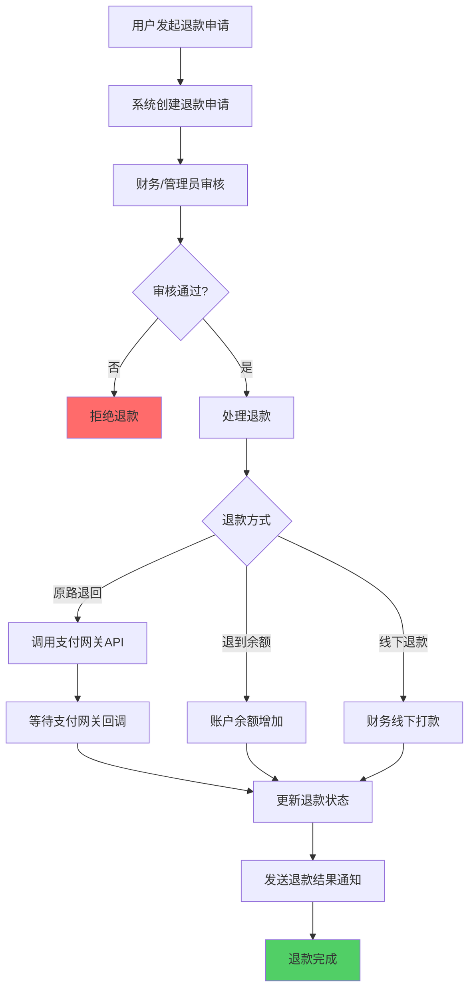
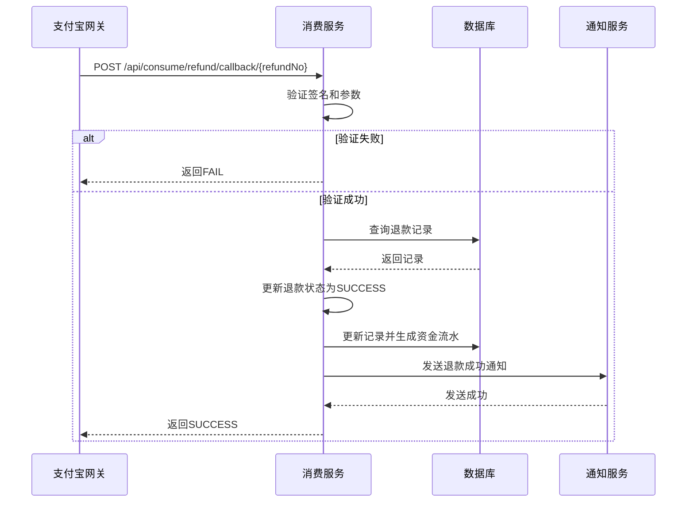
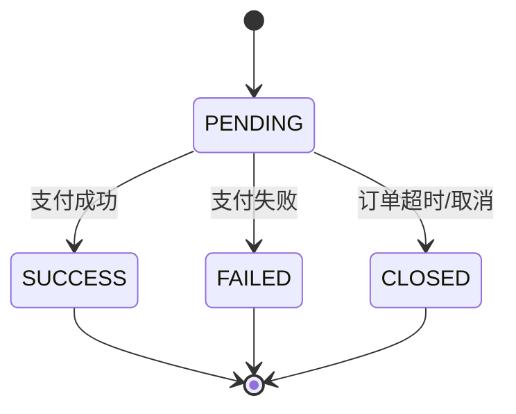
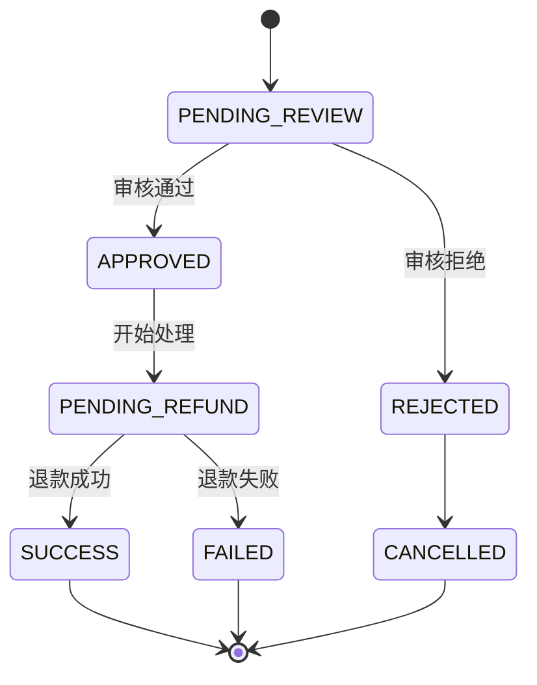

# 充值与退款API

<cite>
**本文档引用文件**   
- [RechargeController.java](file://restful_refactor_backup_20251202_014224\microservices_ioedream-consume-service_src_main_java_net_lab1024_sa_consume_controller_RechargeController.java)
- [RefundController.java](file://restful_refactor_backup_20251202_014224\microservices_ioedream-consume-service_src_main_java_net_lab1024_sa_consume_controller_RefundController.java)
- [08-充值退款流程重构设计.md](file://documentation\03-业务模块\各业务模块文档\消费\08-充值退款流程重构设计.md)
- [PaymentService.java](file://microservices\ioedream-consume-service\src\main\java\net\lab1024\sa\consume\service\PaymentService.java)
</cite>

## 目录
1. [简介](#简介)
2. [核心数据结构](#核心数据结构)
3. [充值流程与API](#充值流程与api)
4. [退款流程与API](#退款流程与api)
5. [外部支付网关集成](#外部支付网关集成)
6. [支付回调处理](#支付回调处理)
7. [交易流水与资金安全](#交易流水与资金安全)
8. [状态流转与校验](#状态流转与校验)

## 简介
本技术文档详细阐述了智慧园区一卡通系统中的充值与退款API的设计与实现。系统支持通过现金、银行卡、微信支付、支付宝等多种方式进行账户充值，并提供完整的退款申请与处理流程。文档重点说明了与外部支付网关的集成方式、支付回调的安全处理逻辑、交易流水的记录机制，以及退款时的资金路径和状态校验，确保整个资金流转过程的安全、可靠与可追溯。

**Section sources**
- [08-充值退款流程重构设计.md](file://documentation\03-业务模块\各业务模块文档\消费\08-充值退款流程重构设计.md#L1-L23)

## 核心数据结构

### 充值订单 (Recharge Order)
充值订单是用户发起充值请求后创建的核心数据实体，用于记录充值的详细信息。



**Diagram sources**
- [08-充值退款流程重构设计.md](file://documentation\03-业务模块\各业务模块文档\消费\08-充值退款流程重构设计.md#L150-L189)

**字段说明**
- **id**: 订单唯一标识符。
- **order_no**: 充值订单号，全局唯一。
- **account_id**: 关联的账户ID。
- **recharge_money**: 充值金额，单位为分。
- **gift_money**: 赠送金额，单位为分。
- **actual_money**: 实际到账金额（充值金额 + 赠送金额），单位为分。
- **payment_type**: 支付方式，枚举值：`WECHAT`（微信）、`ALIPAY`（支付宝）、`CASH`（现金）、`TRANSFER`（转账）。
- **payment_channel**: 支付渠道订单号，用于与第三方支付平台对账。
- **status**: 订单状态，枚举值：`PENDING`（待支付）、`SUCCESS`（成功）、`FAILED`（失败）、`CLOSED`（已关闭）。

### 退款申请 (Refund Request)
退款申请是用户发起退款请求后创建的数据实体，用于管理退款的审核与处理流程。



**Diagram sources**
- [08-充值退款流程重构设计.md](file://documentation\03-业务模块\各业务模块文档\消费\08-充值退款流程重构设计.md#L191-L232)

**字段说明**
- **refund_no**: 退款单号，全局唯一。
- **refund_money**: 申请退款金额，单位为分。
- **refund_type**: 退款类型，枚举值：`ORIGINAL`（原路退回）、`BALANCE`（退到余额）、`OFFLINE`（线下退款）。
- **recharge_order_id**: 关联的充值订单ID，用于追溯资金来源。
- **audit_status**: 审核状态，枚举值：`PENDING`（待审核）、`APPROVED`（已通过）、`REJECTED`（已拒绝）。
- **refund_status**: 退款状态，枚举值：`PENDING`（待退款）、`SUCCESS`（成功）、`FAILED`（失败）。

### 资金流水 (Capital Flow)
资金流水表是记录所有账户资金变动的核心审计表，确保每一笔资金流动都有据可查。



**Diagram sources**
- [08-充值退款流程重构设计.md](file://documentation\03-业务模块\各业务模块文档\消费\08-充值退款流程重构设计.md#L234-L266)

**字段说明**
- **flow_no**: 流水号，全局唯一。
- **money**: 变动金额，单位为分。
- **balance_before**: 操作前余额。
- **balance_after**: 操作后余额。
- **flow_type**: 流水类型，枚举值：`RECHARGE`（充值）、`CONSUME`（消费）、`REFUND`（退款）、`ADJUST`（调账）。
- **business_id**: 关联的业务ID（如充值订单ID或退款单号）。

**Section sources**
- [08-充值退款流程重构设计.md](file://documentation\03-业务模块\各业务模块文档\消费\08-充值退款流程重构设计.md#L150-L295)

## 充值流程与API

### 充值流程
充值流程支持多种支付方式，其核心流程如下：


**Diagram sources**
- [08-充值退款流程重构设计.md](file://documentation\03-业务模块\各业务模块文档\消费\08-充值退款流程重构设计.md#L30-L65)

### 充值API
`RechargeController` 提供了充值相关的RESTful API。

#### 创建充值订单
- **接口**: `POST /api/consume/recharge/recharge`
- **权限**: `consume:recharge:add`
- **请求体**: `RechargeRequestDTO`
- **描述**: 用户发起充值请求，系统创建充值订单并返回支付信息。

#### 查询充值记录
- **接口**: `POST /api/consume/recharge/query`
- **权限**: `consume:recharge:query`
- **请求体**: `RechargeQueryDTO`
- **描述**: 分页查询用户的充值记录。

#### 获取充值详情
- **接口**: `GET /api/consume/recharge/detail/{id}`
- **权限**: `consume:recharge:detail`
- **描述**: 根据订单ID获取单个充值订单的详细信息。

**Section sources**
- [RechargeController.java](file://restful_refactor_backup_20251202_014224\microservices_ioedream-consume-service_src_main_java_net_lab1024_sa_consume_controller_RechargeController.java#L45-L96)

## 退款流程与API

### 退款流程
退款流程是一个多步骤的审核流程，确保资金安全。


**Diagram sources**
- [08-充值退款流程重构设计.md](file://documentation\03-业务模块\各业务模块文档\消费\08-充值退款流程重构设计.md#L67-L98)

### 退款API
`RefundController` 提供了退款相关的RESTful API。

#### 创建退款申请
- **接口**: `POST /api/consume/refund/create`
- **权限**: `consume:refund:add`
- **请求体**: `RefundRequestDTO`
- **描述**: 用户提交退款申请，系统创建退款记录，状态为“待审核”。

#### 审核退款
- **接口**: `POST /api/consume/refund/review/{refundId}`
- **权限**: `consume:refund:review`
- **参数**: `approved` (布尔值，是否批准)
- **描述**: 管理员审核退款申请，批准后进入退款处理流程。

#### 查询退款记录
- **接口**: `POST /api/consume/refund/query`
- **权限**: `consume:refund:query`
- **请求体**: `RefundQueryDTO`
- **描述**: 分页查询退款申请记录。

**Section sources**
- [RefundController.java](file://restful_refactor_backup_20251202_014224\microservices_ioedream-consume-service_src_main_java_net_lab1024_sa_consume_controller_RefundController.java#L45-L76)

## 外部支付网关集成

系统通过 `PaymentService` 与微信支付和支付宝网关进行集成。

```mermaid
classDiagram
class PaymentService {
+String wechatAppId
+String wechatMchId
+String alipayAppId
+String alipayPrivateKey
-Config wechatPayConfig
-AlipayClient alipayClient
+initWechatPayConfig()
+initAlipayClient()
+createWechatPayOrder()
+createAlipayOrder()
+handleWechatCallback()
+handleAlipayCallback()
}
PaymentService --> "1" "1" "微信支付SDK"
PaymentService --> "1" "1" "支付宝SDK"
```

**Diagram sources**
- [PaymentService.java](file://microservices\ioedream-consume-service\src\main\java\net\lab1024\sa\consume\service\PaymentService.java#L75-L219)

**集成要点**:
- **微信支付**: 使用微信支付Java SDK v3，通过`RSAAutoCertificateConfig`自动管理证书，支持JSAPI、Native等多种支付方式。
- **支付宝**: 使用支付宝SDK v4，通过`DefaultAlipayClient`进行API调用。
- **配置管理**: 所有支付密钥和配置通过Spring的`@Value`注解从配置文件中注入，确保安全性。
- **延迟初始化**: 支付客户端在首次使用时才进行初始化，避免系统启动时因配置错误而失败。

**Section sources**
- [PaymentService.java](file://microservices\ioedream-consume-service\src\main\java\net\lab1024\sa\consume\service\PaymentService.java#L75-L219)

## 支付回调处理

支付回调是确保交易最终一致性的关键环节。系统通过专门的回调接口接收第三方支付平台的通知。

### 回调处理流程


**Diagram sources**
- [RefundController.java](file://restful_refactor_backup_20251202_014224\microservices_ioedream-consume-service_src_main_java_net_lab1024_sa_consume_controller_RefundController.java#L88-L99)

**安全措施**:
1.  **签名验证**: 必须验证回调请求的签名，确保请求来自合法的支付网关。
2.  **幂等性处理**: 回调可能重复发送，系统必须保证处理的幂等性，避免重复记账。
3.  **异步处理**: 回调处理逻辑应尽可能轻量，耗时操作（如发送通知）应放入异步队列。

**Section sources**
- [RefundController.java](file://restful_refactor_backup_20251202_014224\microservices_ioedream-consume-service_src_main_java_net_lab1024_sa_consume_controller_RefundController.java#L88-L99)

## 交易流水与资金安全

### 交易流水记录
每一笔成功的充值或退款操作，都会在`POSID_CAPITAL_FLOW`表中生成一条流水记录。该记录是资金对账和审计的唯一依据。

**记录时机**:
- **充值成功**: 在支付回调验证通过后，生成`RECHARGE`类型的流水。
- **退款成功**: 在退款处理完成（无论是原路退回还是余额退款）后，生成`REFUND`类型的流水。

**Section sources**
- [08-充值退款流程重构设计.md](file://documentation\03-业务模块\各业务模块文档\消费\08-充值退款流程重构设计.md#L234-L266)

### 资金安全机制
系统通过以下机制确保资金安全：
1.  **状态机校验**: 所有资金操作都基于严格的状态机。例如，只有状态为`SUCCESS`的充值订单才能被申请退款。
2.  **余额校验**: 在进行退款操作前，系统会校验账户余额是否充足（对于余额退款）。
3.  **事务性操作**: 账户余额更新、流水记录生成等关键操作在同一个数据库事务中完成，保证数据一致性。
4.  **操作日志**: 所有资金相关的操作（创建、审核、处理）都会被记录到审计日志中，便于追溯。

## 状态流转与校验

### 充值订单状态流转


**Diagram sources**
- [08-充值退款流程重构设计.md](file://documentation\03-业务模块\各业务模块文档\消费\08-充值退款流程重构设计.md#L236)

### 退款申请状态流转


**Diagram sources**
- [08-充值退款流程重构设计.md](file://documentation\03-业务模块\各业务模块文档\消费\08-充值退款流程重构设计.md#L284-L285)

**状态校验规则**:
- **创建退款**: 只能对状态为`SUCCESS`的充值订单创建退款申请。
- **审核退款**: 只能对状态为`PENDING`的退款申请进行审核。
- **处理退款**: 只能对状态为`APPROVED`的退款申请进行处理。

**Section sources**
- [08-充值退款流程重构设计.md](file://documentation\03-业务模块\各业务模块文档\消费\08-充值退款流程重构设计.md#L236-L285)