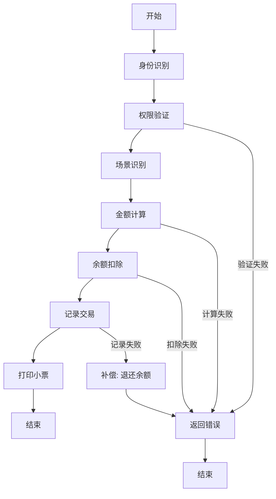
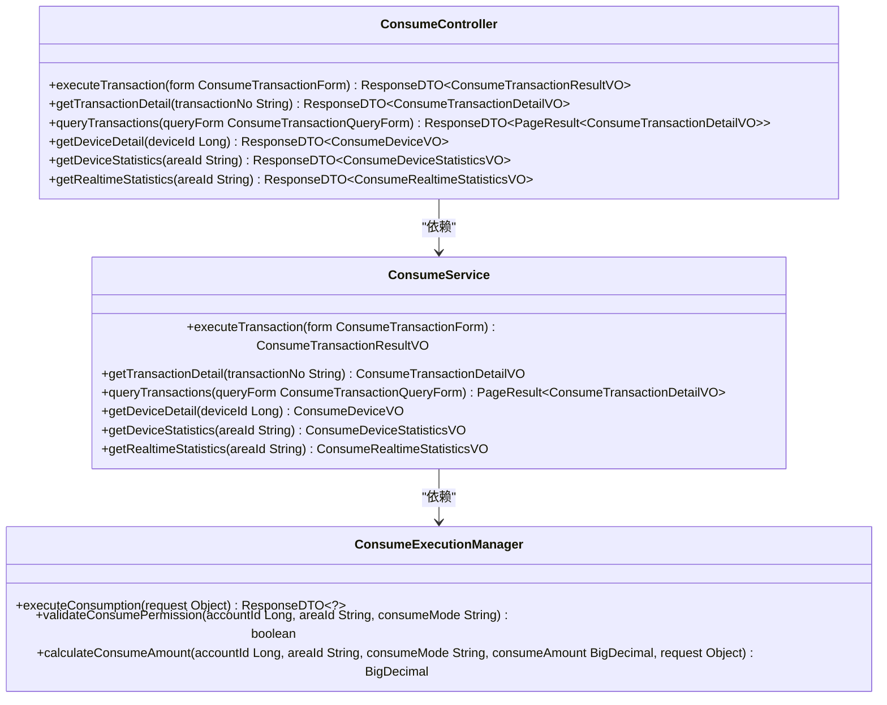
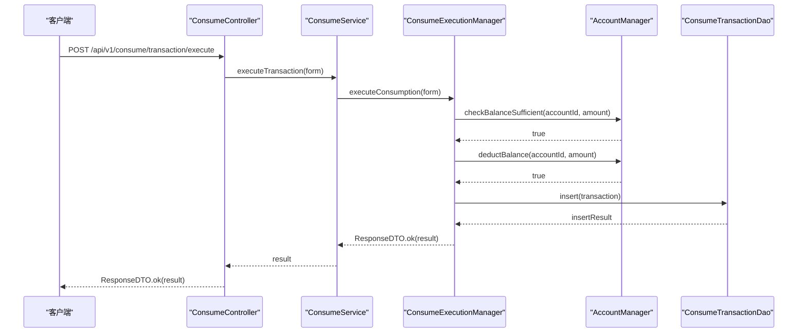
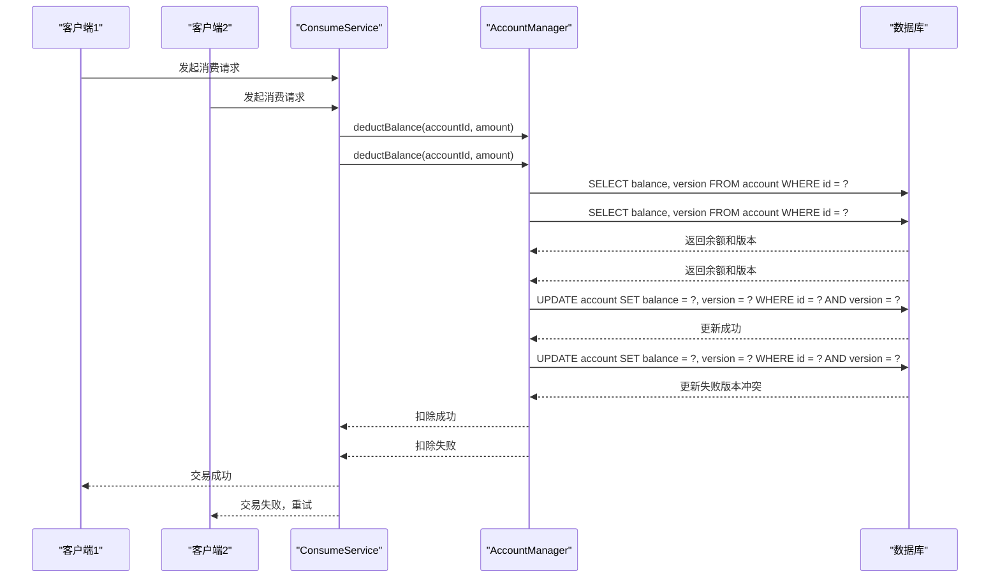

# 消费交易API

<cite>
**本文档引用文件**   
- [ConsumeController.java](file://microservices/ioedream-consume-service/src/main/java/net/lab1024/sa/consume/controller/ConsumeController.java)
- [consume-api-contract.md](file://documentation/api/consume/consume-api-contract.md)
- [spec.md](file://openspec/changes/archive/completed-proposals/complete-consume-module-implementation/specs/consume-module/spec.md)
- [ConsumeRequestDTO.java](file://microservices/ioedream-consume-service/src/main/java/net/lab1024/sa/consume/domain/dto/ConsumeRequestDTO.java)
- [ConsumeTransactionForm.java](file://microservices/ioedream-consume-service/src/main/java/net/lab1024/sa/consume/domain/form/ConsumeTransactionForm.java)
- [ConsumeTransactionResultVO.java](file://microservices/ioedream-consume-service/src/main/java/net/lab1024/sa/consume/domain/vo/ConsumeTransactionResultVO.java)
- [ConsumeExecutionManagerImpl.java](file://microservices/ioedream-consume-service/src/main/java/net/lab1024/sa/consume/manager/impl/ConsumeExecutionManagerImpl.java)
- [ConsumeServiceImpl.java](file://microservices/ioedream-consume-service/src/main/java/net/lab1024/sa/consume/service/impl/ConsumeServiceImpl.java)
- [MinerU_消费PUSH通讯协议 （中控智慧） V1.0-20181225__20251206181016.md](file://documentation/各个设备通讯协议/MinerU_消费PUSH通讯协议 （中控智慧） V1.0-20181225__20251206181016.md)
</cite>

## 目录
1. [引言](#引言)
2. [核心流程](#核心流程)
3. [接口设计](#接口设计)
4. [扣款逻辑与消费流水](#扣款逻辑与消费流水)
5. [设备通讯服务交互](#设备通讯服务交互)
6. [高并发场景下的数据一致性](#高并发场景下的数据一致性)
7. [离线消费数据同步与对账](#离线消费数据同步与对账)
8. [请求示例](#请求示例)
9. [结论](#结论)

## 引言

消费交易API是IOE-DREAM系统中负责处理用户消费行为的核心模块。该API支持在线和离线两种消费模式，为用户提供便捷的支付体验。系统通过严格的权限验证、金额计算和余额扣减流程，确保每一笔交易的安全性和准确性。消费交易流程遵循7步标准流程：身份识别→权限验证→场景识别→金额计算→余额扣除→记录交易→打印小票。系统采用SAGA分布式事务模式，确保账户扣款、消费记录和补贴扣除的最终一致性。同时，系统实现了L1本地缓存、L2 Redis缓存和L3网关调用的三级缓存架构，以保证高性能和数据一致性。

**Section sources**
- [spec.md](file://openspec/changes/archive/completed-proposals/complete-consume-module-implementation/specs/consume-module/spec.md#L31-L43)
- [consume-api-contract.md](file://documentation/api/consume/consume-api-contract.md#L10-L18)

## 核心流程

消费交易的核心流程严格遵循7步标准流程，确保交易的完整性和安全性。流程从身份识别开始，系统首先验证用户的账户有效性。随后进行权限验证，检查用户在目标区域的消费权限。接下来是场景识别，系统根据区域经营模式（餐别制、超市制或混合模式）确定消费场景。在金额计算阶段，系统根据消费模式和策略计算实际消费金额。余额扣除阶段使用SAGA事务模式，确保账户余额的准确扣减。交易记录阶段将完整的交易信息写入数据库。最后，系统生成并打印消费小票，完成整个消费流程。

当消费流程中任何步骤出现异常时，系统会回滚已执行的操作，记录详细的错误日志，并向用户返回明确的错误信息。对于重复的消费请求，系统能够识别并返回原消费结果，避免重复扣款。在设备与服务器连接异常时，系统会启用离线消费模式，使用缓存的账户和区域信息，记录离线消费数据，并在网络恢复后同步离线数据。



**Diagram sources**
- [spec.md](file://openspec/changes/archive/completed-proposals/complete-consume-module-implementation/specs/consume-module/spec.md#L32-L43)

**Section sources**
- [spec.md](file://openspec/changes/archive/completed-proposals/complete-consume-module-implementation/specs/consume-module/spec.md#L31-L43)
- [ConsumeExecutionManagerImpl.java](file://microservices/ioedream-consume-service/src/main/java/net/lab1024/sa/consume/manager/impl/ConsumeExecutionManagerImpl.java#L118-L208)

## 接口设计

消费交易API提供了丰富的接口，支持多种消费模式和查询功能。核心接口包括执行消费交易、查询交易详情、分页查询消费记录、获取设备详情、获取设备状态统计和获取实时统计。API严格遵循RESTful规范，使用POST方法执行消费交易，GET方法进行查询操作。

执行消费交易接口支持多种消费模式，包括刷卡、刷脸、NFC和手机支付等。系统自动进行账户余额验证、设备状态检查和权限验证。查询交易详情接口根据交易流水号返回交易的完整信息，包括交易金额、时间、状态和设备信息。分页查询消费记录接口支持多条件筛选，包括用户ID、区域ID、时间范围、消费模式和交易状态。



**Diagram sources**
- [ConsumeController.java](file://microservices/ioedream-consume-service/src/main/java/net/lab1024/sa/consume/controller/ConsumeController.java#L58-L355)
- [ConsumeServiceImpl.java](file://microservices/ioedream-consume-service/src/main/java/net/lab1024/sa/consume/service/impl/ConsumeServiceImpl.java#L61-L533)
- [ConsumeExecutionManagerImpl.java](file://microservices/ioedream-consume-service/src/main/java/net/lab1024/sa/consume/manager/impl/ConsumeExecutionManagerImpl.java#L50-L1159)

**Section sources**
- [ConsumeController.java](file://microservices/ioedream-consume-service/src/main/java/net/lab1024/sa/consume/controller/ConsumeController.java#L58-L355)
- [consume-api-contract.md](file://documentation/api/consume/consume-api-contract.md#L23-L387)

## 扣款逻辑与消费流水

系统的扣款逻辑是消费交易的核心环节，确保账户余额的准确扣减。当执行消费交易时，系统首先检查账户余额是否充足。如果余额充足，系统使用乐观锁机制进行余额扣除，防止高并发场景下的超卖问题。余额扣除成功后，系统会立即记录交易流水，确保交易的可追溯性。

消费流水记录包含完整的交易信息，包括交易流水号、用户ID、账户ID、设备ID、区域ID、消费金额、消费模式、交易时间和交易状态。交易流水号采用时间戳加随机数的格式生成，确保全局唯一性。系统还通过网关服务客户端获取用户姓名和部门信息，丰富交易记录的上下文。



**Diagram sources**
- [ConsumeExecutionManagerImpl.java](file://microservices/ioedream-consume-service/src/main/java/net/lab1024/sa/consume/manager/impl/ConsumeExecutionManagerImpl.java#L118-L208)
- [ConsumeServiceImpl.java](file://microservices/ioedream-consume-service/src/main/java/net/lab1024/sa/consume/service/impl/ConsumeServiceImpl.java#L86-L143)

**Section sources**
- [ConsumeExecutionManagerImpl.java](file://microservices/ioedream-consume-service/src/main/java/net/lab1024/sa/consume/manager/impl/ConsumeExecutionManagerImpl.java#L118-L208)
- [ConsumeServiceImpl.java](file://microservices/ioedream-consume-service/src/main/java/net/lab1024/sa/consume/service/impl/ConsumeServiceImpl.java#L86-L143)

## 设备通讯服务交互

消费交易系统与设备通讯服务紧密集成，确保消费终端与后台系统的实时交互。系统通过GatewayServiceClient统一进行微服务间调用，禁止直接访问其他服务的数据库。当需要获取区域信息时，系统通过GatewayServiceClient调用区域服务。当需要验证设备状态时，系统通过GatewayServiceClient调用设备服务。

设备通讯服务负责管理消费设备的注册、状态上报和消费验证。消费设备支持多种类型和协议，包括中控智慧的消费PUSH通讯协议。设备端完成身份识别后，将识别结果提交到服务端进行验证。服务端验证设备在线状态、权限、识别结果置信度、账户状态和可用性，以及区域信息和经营模式，然后执行完整的消费流程。

**Section sources**
- [spec.md](file://openspec/changes/archive/completed-proposals/complete-consume-module-implementation/specs/consume-module/spec.md#L116-L132)
- [MinerU_消费PUSH通讯协议 （中控智慧） V1.0-20181225__20251206181016.md](file://documentation/各个设备通讯协议/MinerU_消费PUSH通讯协议 （中控智慧） V1.0-20181225__20251206181016.md)

## 高并发场景下的数据一致性

在高并发场景下，系统通过多种机制保证余额扣减的幂等性和数据一致性。核心机制包括分布式锁和数据库乐观锁。系统采用SAGA分布式事务模式，确保跨多个服务的数据变更最终一致性。当消费流程需要跨多个服务进行数据变更时，系统创建SAGA事务并定义补偿步骤，按顺序执行各个步骤，并在每个步骤成功后记录事务状态。

对于余额扣除操作，系统使用数据库乐观锁机制。在更新账户余额时，系统会检查版本号或时间戳，确保在读取余额和更新余额之间没有其他事务修改了余额。如果检测到冲突，系统会重试操作，直到成功或达到最大重试次数。此外，系统还实现了幂等性保障，对于重复的消费请求，系统能够识别并返回原消费结果，避免重复扣款。



**Diagram sources**
- [spec.md](file://openspec/changes/archive/completed-proposals/complete-consume-module-implementation/specs/consume-module/spec.md#L75-L97)
- [ConsumeExecutionManagerImpl.java](file://microservices/ioedream-consume-service/src/main/java/net/lab1024/sa/consume/manager/impl/ConsumeExecutionManagerImpl.java#L174-L179)

**Section sources**
- [spec.md](file://openspec/changes/archive/completed-proposals/complete-consume-module-implementation/specs/consume-module/spec.md#L75-L97)
- [ConsumeExecutionManagerImpl.java](file://microservices/ioedream-consume-service/src/main/java/net/lab1024/sa/consume/manager/impl/ConsumeExecutionManagerImpl.java#L174-L179)

## 离线消费数据同步与对账

系统支持离线消费模式，确保在网络异常时仍能正常进行消费。当设备与服务器连接异常时，系统启用离线消费模式，使用缓存的账户和区域信息，记录离线消费数据。离线消费数据包括交易流水号、用户ID、消费金额、消费时间和消费模式。

在网络恢复后，系统会自动同步离线消费数据。移动端通过离线交易同步接口将离线消费数据上传到服务器。服务器验证每笔交易的有效性，执行完整的消费流程，并将交易记录写入数据库。对于同步失败的交易，系统会记录失败原因，并提供失败交易列表供后续处理。

系统还提供了对账功能，确保财务数据的完整性和一致性。系统按日、周、月生成对账报告，支持多维度对账（按设备、区域、账户类型）。对账过程检查账户余额与交易记录的一致性、补贴使用记录与预算的一致性，以及消费记录与库存记录的一致性。发现不一致时，系统生成修复任务，并提供差异分析和调整建议。

**Section sources**
- [spec.md](file://openspec/changes/archive/completed-proposals/complete-consume-module-implementation/specs/consume-module/spec.md#L68-L73)
- [consume-api-contract.md](file://documentation/api/consume/consume-api-contract.md#L289-L327)
- [spec.md](file://openspec/changes/archive/completed-proposals/complete-consume-module-implementation/specs/consume-module/spec.md#L184-L190)

## 请求示例

发起消费请求需要提供以下必填参数：设备ID、用户ID、消费金额和消费模式。以下是一个完整的请求示例：

```json
{
  "userId": 1001,
  "accountId": 2001,
  "deviceId": 3001,
  "areaId": "4001",
  "amount": 50.00,
  "consumeMode": "CARD"
}
```

请求参数说明：
- **userId**: 用户ID，用于标识消费用户
- **accountId**: 账户ID，用于标识消费账户
- **deviceId**: 设备ID，用于标识消费设备
- **areaId**: 区域ID，用于标识消费区域
- **amount**: 消费金额，单位为元
- **consumeMode**: 消费模式，支持CARD（刷卡）、FACE（刷脸）、NFC、MOBILE（手机支付）等

响应示例：
```json
{
  "code": "OK",
  "data": {
    "transactionId": "123456",
    "transactionNo": "TXN20250130143025123456",
    "amount": 50.00,
    "balanceAfter": 950.00,
    "transactionTime": "2025-01-30T14:30:25",
    "status": "SUCCESS"
  },
  "message": "消费成功"
}
```

**Section sources**
- [ConsumeController.java](file://microservices/ioedream-consume-service/src/main/java/net/lab1024/sa/consume/controller/ConsumeController.java#L72-L82)
- [ConsumeRequestDTO.java](file://microservices/ioedream-consume-service/src/main/java/net/lab1024/sa/consume/domain/dto/ConsumeRequestDTO.java#L21-L64)
- [ConsumeTransactionForm.java](file://microservices/ioedream-consume-service/src/main/java/net/lab1024/sa/consume/domain/form/ConsumeTransactionForm.java#L21-L84)
- [ConsumeTransactionResultVO.java](file://microservices/ioedream-consume-service/src/main/java/net/lab1024/sa/consume/domain/vo/ConsumeTransactionResultVO.java#L21-L66)

## 结论

消费交易API通过严谨的设计和实现，为用户提供安全、可靠、高效的消费体验。系统支持在线和离线两种消费模式，满足不同场景下的需求。核心流程遵循7步标准流程，确保交易的完整性和安全性。接口设计遵循RESTful规范，提供丰富的功能。扣款逻辑采用SAGA分布式事务模式和乐观锁机制，保证高并发场景下的数据一致性。系统与设备通讯服务紧密集成，支持多种设备类型和协议。离线消费数据同步与对账功能确保在网络异常时仍能正常进行消费，并保证财务数据的完整性和一致性。整体设计体现了企业级应用的高可用性、高性能和高安全性。