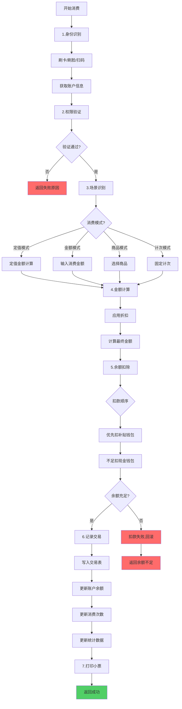
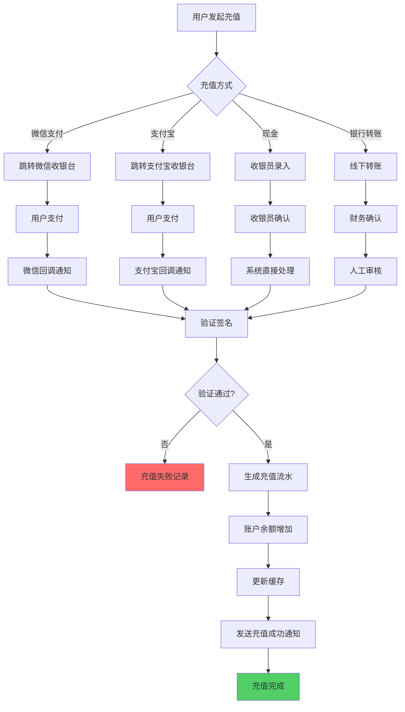
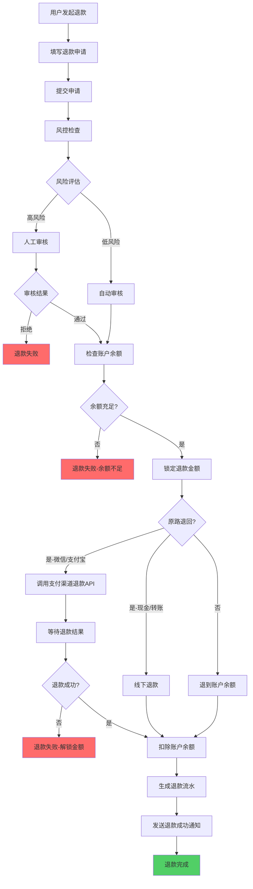
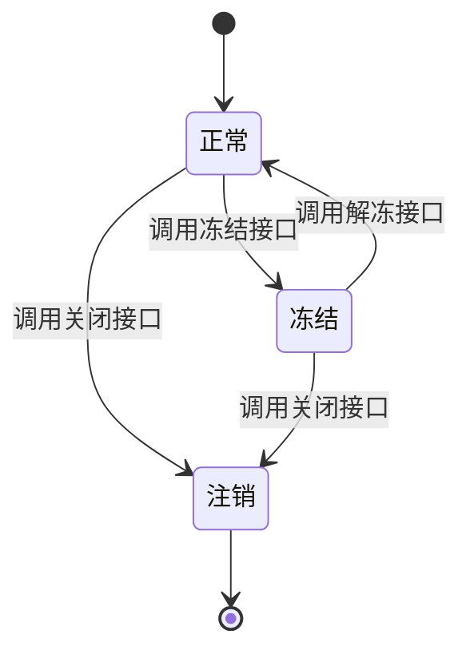
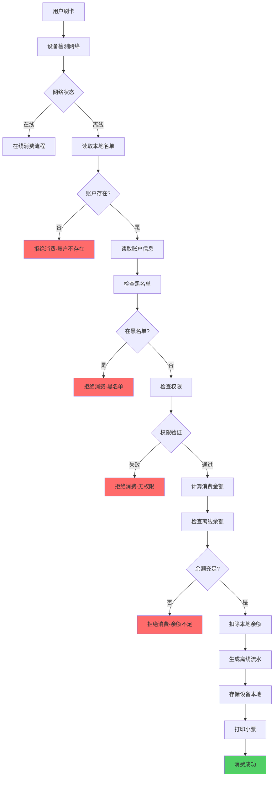
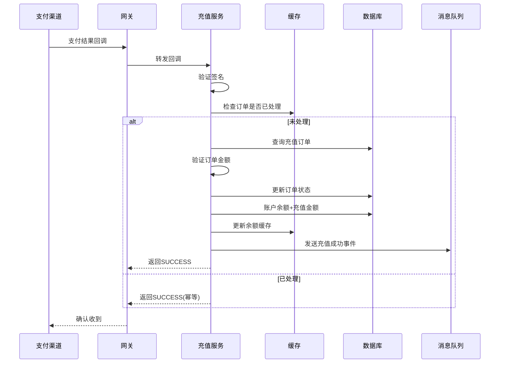

# 消费系统API

<cite>
**本文档引用的文件**  
- [consume-api-contract.md](file://documentation/api/consume/consume-api-contract.md)
- [AccountController.java](file://microservices/ioedream-consume-service/src/main/java/net/lab1024/sa/consume/controller/AccountController.java)
- [ConsumeController.java](file://microservices/ioedream-consume-service/src/main/java/net/lab1024/sa/consume/controller/ConsumeController.java)
- [ConsumeMobileController.java](file://microservices/ioedream-consume-service/src/main/java/net/lab1024/sa/consume/controller/ConsumeMobileController.java)
- [ConsumeServiceImpl.java](file://microservices/ioedream-consume-service/src/main/java/net/lab1024/sa/consume/service/impl/ConsumeServiceImpl.java)
- [AccountEntity.java](file://microservices/ioedream-consume-service/src/main/java/net/lab1024/sa/consume/domain/entity/AccountEntity.java)
- [03-账户类别与消费模式设计.md](file://docs/各业务模块文档/消费/03-账户类别与消费模式设计.md)
- [06-消费处理流程重构设计.md](file://docs/各业务模块文档/消费/06-消费处理流程重构设计.md)
- [08-充值退款流程重构设计.md](file://docs/各业务模块文档/消费/08-充值退款流程重构设计.md)
- [11-离线消费模块重构设计.md](file://docs/各业务模块文档/消费/11-离线消费模块重构设计.md)
</cite>

## 目录
1. [引言](#引言)
2. [账户管理](#账户管理)
3. [消费交易](#消费交易)
4. [充值与退款](#充值与退款)
5. [补贴发放](#补贴发放)
6. [账户状态机](#账户状态机)
7. [消费模式实现](#消费模式实现)
8. [支付网关交互](#支付网关交互)
9. [高并发幂等性处理](#高并发幂等性处理)
10. [附录](#附录)

## 引言

本技术文档旨在全面阐述消费系统API的设计与实现，覆盖账户管理、消费交易、充值退款、补贴发放等核心业务流程。文档基于`consume-api-contract.md`和消费模式设计文档，详细定义了所有接口的精确数据格式，并深入解释了账户状态机、消费模式（在线/离线）的实现差异，以及与支付网关的交互机制。

文档提供了账户余额查询、发起一笔消费、处理退款等操作的完整请求/响应示例，并重点说明了在高并发场景下的幂等性处理机制，确保系统在极端情况下的数据一致性与可靠性。

## 账户管理

账户管理是消费系统的核心，负责用户账户的全生命周期管理，包括创建、查询、更新、状态变更及余额操作。

### 核心接口

根据API契约文档，账户管理提供以下核心接口：

| 接口 | HTTP方法 | 路径 | 功能 |
| :--- | :--- | :--- | :--- |
| 创建账户 | POST | `/api/v1/consume/account/add` | 为指定用户创建新的消费账户 |
| 查询账户详情 | GET | `/api/v1/consume/account/{id}` | 根据账户ID查询账户的完整信息 |
| 分页查询账户列表 | POST | `/api/v1/consume/account/query` | 支持多条件筛选的账户列表查询 |
| 增加余额 | POST | `/api/v1/consume/account/balance/add` | 为指定账户增加余额 |
| 扣减余额 | POST | `/api/v1/consume/account/balance/deduct` | 从指定账户扣减余额 |
| 冻结余额 | POST | `/api/v1/consume/account/balance/freeze` | 冻结指定账户的余额 |
| 解冻余额 | POST | `/api/v1/consume/account/balance/unfreeze` | 解冻指定账户的余额 |
| 启用账户 | POST | `/api/v1/consume/account/status/enable` | 启用指定账户 |
| 禁用账户 | POST | `/api/v1/consume/account/status/disable` | 禁用指定账户 |
| 冻结账户 | POST | `/api/v1/consume/account/status/freeze` | 冻结指定账户状态 |
| 解冻账户 | POST | `/api/v1/consume/account/status/unfreeze` | 解冻指定账户状态 |
| 关闭账户 | POST | `/api/v1/consume/account/status/close` | 关闭指定账户 |

### 数据模型

账户的核心数据模型由`AccountEntity`类定义，主要字段如下：

```java
public class AccountEntity extends BaseEntity {
    private Long id; // 账户ID
    private Long userId; // 用户ID
    private Long accountKindId; // 账户类别ID
    private Long balance; // 账户余额（单位：分）
    private Long allowanceBalance; // 补贴余额（单位：分）
    private Long frozenBalance; // 冻结余额（单位：分）
    private Integer status; // 账户状态 (1-正常 2-冻结 3-注销)
    private Integer version; // 乐观锁版本号
}
```

**字段说明**：
- **余额单位**：为避免浮点数精度问题，所有金额字段（`balance`, `allowanceBalance`, `frozenBalance`）均以“分”为单位存储。
- **状态机**：`status`字段管理账户的生命周期状态，具体状态机将在“账户状态机”章节详细阐述。
- **并发控制**：`version`字段用于实现乐观锁，防止高并发下的余额更新冲突。

### 请求/响应示例

**请求：增加账户余额**

```json
POST /api/v1/consume/account/balance/add
Content-Type: application/json

{
  "accountId": 2001,
  "amount": 100.00,
  "remark": "管理员充值"
}
```

**响应：成功**

```json
{
  "code": 0,
  "message": "OK",
  "data": true
}
```

**响应：失败**

```json
{
  "code": "ADD_BALANCE_ERROR",
  "message": "增加账户余额失败: 账户不存在",
  "data": null
}
```

**账户状态码**：
- `1`：正常
- `2`：冻结
- `3`：注销

**Section sources**
- [consume-api-contract.md](file://documentation/api/consume/consume-api-contract.md#L444-L462)
- [AccountController.java](file://microservices/ioedream-consume-service/src/main/java/net/lab1024/sa/consume/controller/AccountController.java#L269-L310)
- [AccountEntity.java](file://microservices/ioedream-consume-service/src/main/java/net/lab1024/sa/consume/domain/entity/AccountEntity.java#L117-L118)

## 消费交易

消费交易是系统的核心业务，支持多种消费模式和场景，包括移动端的快速消费、扫码消费、NFC消费和人脸识别消费。

### 核心接口

移动端消费交易接口是主要的消费入口：

| 接口 | HTTP方法 | 路径 | 功能 |
| :--- | :--- | :--- | :--- |
| 快速消费 | POST | `/api/v1/consume/mobile/transaction/quick` | 移动端快速消费交易 |
| 扫码消费 | POST | `/api/v1/consume/mobile/transaction/scan` | 移动端扫码消费交易 |
| NFC消费 | POST | `/api/v1/consume/mobile/transaction/nfc` | 移动端NFC消费交易 |
| 人脸识别消费 | POST | `/api/v1/consume/mobile/transaction/face` | 移动端人脸识别消费交易 |
| 查询交易详情 | GET | `/api/v1/consume/transaction/detail/{transactionNo}` | 根据交易流水号查询交易详情 |
| 分页查询消费记录 | GET | `/api/v1/consume/transaction/query` | 分页查询消费记录 |

### 业务流程

消费交易的完整流程如下：



**Diagram sources**
- [06-消费处理流程重构设计.md](file://docs/各业务模块文档/消费/06-消费处理流程重构设计.md#L25-L73)

### 请求/响应示例

**请求：发起一笔快速消费**

```json
POST /api/v1/consume/mobile/transaction/quick
Content-Type: application/json

{
  "deviceId": 3001,
  "userId": 1001,
  "amount": 15.00,
  "consumeMode": "FIXED"
}
```

**响应：成功**

```json
{
  "code": 0,
  "message": "OK",
  "data": {
    "transactionNo": "TXN2025013012345678",
    "success": true,
    "balance": 85.00,
    "consumeAmount": 15.00
  }
}
```

**响应：失败（余额不足）**

```json
{
  "code": "EXECUTE_TRANSACTION_ERROR",
  "message": "执行消费交易失败: 余额不足",
  "data": {
    "transactionNo": "",
    "success": false,
    "message": "余额不足，当前余额10.00元",
    "balance": 10.00,
    "consumeAmount": 15.00
  }
}
```

**Section sources**
- [consume-api-contract.md](file://documentation/api/consume/consume-api-contract.md#L29-L58)
- [ConsumeMobileController.java](file://microservices/ioedream-consume-service/src/main/java/net/lab1024/sa/consume/controller/ConsumeMobileController.java#L69-L77)
- [ConsumeServiceImpl.java](file://microservices/ioedream-consume-service/src/main/java/net/lab1024/sa/consume/service/impl/ConsumeServiceImpl.java#L86-L143)

## 充值与退款

充值与退款模块负责管理账户的资金流入和流出，确保资金操作的安全、可靠和可追溯。

### 核心流程

充值和退款遵循严格的业务流程，以保证资金安全。

#### 充值流程



**Diagram sources**
- [08-充值退款流程重构设计.md](file://docs/各业务模块文档/消费/08-充值退款流程重构设计.md#L30-L65)

#### 退款流程



**Diagram sources**
- [08-充值退款流程重构设计.md](file://docs/各业务模块文档/消费/08-充值退款流程重构设计.md#L69-L110)

### 数据模型

核心数据表包括：

- **POSID_RECHARGE_ORDER**：充值订单表
- **POSID_REFUND_REQUEST**：退款申请表
- **POSID_CAPITAL_FLOW**：资金流水表

### 安全与风控

为保障资金安全，系统实施了多重安全措施：
- **签名验证**：验证支付渠道回调的签名，防止数据篡改。
- **IP白名单**：只接受支付渠道官方IP的回调请求。
- **风控规则**：对大额充值、频繁充值、快速退款等行为进行人工审核或限流。

**Section sources**
- [08-充值退款流程重构设计.md](file://docs/各业务模块文档/消费/08-充值退款流程重构设计.md#L26-L110)
- [consume-api-contract.md](file://documentation/api/consume/consume-api-contract.md#L489-L582)

## 补贴发放

补贴发放是消费系统的重要功能，用于向特定用户群体发放福利性资金。

### 发放机制

补贴发放通常与充值操作结合，通过“充值赠送规则”实现。当用户充值达到一定金额时，系统自动计算并发放相应的补贴。

**核心配置**：
- **充值赠送规则表 (POSID_RECHARGE_GIFT_RULE)**：定义了不同充值金额区间的赠送规则（固定金额或百分比）。

### 业务流程

1.  **用户充值**：用户发起充值请求。
2.  **规则匹配**：系统根据充值金额，查询适用的赠送规则。
3.  **计算赠送金额**：根据规则计算应赠送的补贴金额。
4.  **资金入账**：将充值金额和赠送的补贴金额分别记入账户的主余额和补贴余额。
5.  **生成流水**：记录完整的资金流水，包括充值和赠送明细。

### 扣款优先级

在消费时，系统会按照以下优先级顺序扣除资金：
1.  **补贴余额**：优先使用账户的补贴钱包。
2.  **现金余额**：补贴余额不足时，扣除主账户余额。

此机制鼓励用户优先使用补贴，优化资金使用效率。

**Section sources**
- [08-充值退款流程重构设计.md](file://docs/各业务模块文档/消费/08-充值退款流程重构设计.md#L269-L294)
- [06-消费处理流程重构设计.md](file://docs/各业务模块文档/消费/06-消费处理流程重构设计.md#L348-L359)

## 账户状态机

账户状态机管理账户的整个生命周期，确保状态变更的合法性和一致性。

### 状态定义

账户状态由`AccountEntity`中的`status`字段表示，具体含义如下：

| 状态码 | 状态名称 | 说明 |
| :--- | :--- | :--- |
| 1 | 正常 | 账户处于可用状态，可以进行消费和充值 |
| 2 | 冻结 | 账户被冻结，无法进行消费，但可以充值 |
| 3 | 注销 | 账户已注销，所有功能均不可用 |

### 状态转换

账户状态的转换遵循严格的规则，通过API进行控制：



**转换规则**：
- **启用/禁用**：`enableAccount`和`disableAccount`接口用于控制账户的启用和禁用，这通常与账户的“冻结”状态相关联。
- **冻结/解冻**：`freezeAccount`和`unfreezeAccount`接口直接改变账户的`status`字段。
- **关闭**：`closeAccount`接口将账户状态永久设置为“注销”。

**Section sources**
- [AccountEntity.java](file://microservices/ioedream-consume-service/src/main/java/net/lab1024/sa/consume/domain/entity/AccountEntity.java#L117-L118)
- [AccountController.java](file://microservices/ioedream-consume-service/src/main/java/net/lab1024/sa/consume/controller/AccountController.java#L367-L459)

## 消费模式实现

系统支持多种消费模式，以适应不同的业务场景，如食堂、超市、停车场等。

### 六大核心模式

根据`03-账户类别与消费模式设计.md`文档，系统将原有的9种模式合并为6种通用模式：

| 模式 | 子类型 | 适用场景 |
| :--- | :--- | :--- |
| **固定金额模式 (FIXED_AMOUNT)** | SIMPLE, KEYVALUE, SECTION | 食堂、班车、门票 |
| **自由金额模式 (FREE_AMOUNT)** | - | 超市、食堂、停车场、会议室 |
| **计量计费模式 (METERED)** | TIMING, COUNT | 会议室、停车场、健身房、充电桩 |
| **商品模式 (PRODUCT)** | - | 超市、便利店、面包房 |
| **订餐模式 (ORDER)** | - | 企业食堂、学校食堂 |
| **智能模式 (INTELLIGENCE)** | - | 智能取餐、无人超市 |

### 实现差异

#### 在线消费模式

在线消费模式下，所有操作均实时与服务器交互，确保数据的实时性和一致性。流程如下：
1.  设备发起消费请求。
2.  服务器进行权限验证、余额检查、金额计算。
3.  执行扣款并记录交易。
4.  返回结果给设备。

#### 离线消费模式

离线消费模式用于网络不稳定或无网络的场景，保障业务连续性。

**核心流程**：


**Diagram sources**
- [11-离线消费模块重构设计.md](file://docs/各业务模块文档/消费/11-离线消费模块重构设计.md#L91-L127)

**数据同步**：
当设备恢复网络后，会自动将本地存储的离线交易流水批量上传至服务器，服务器进行校验和处理。

**余额冲突处理**：
在离线期间，若账户在其他设备上发生余额变动，可能导致余额冲突。系统通过以下策略处理：
- **小额差异**：自动补单，确保数据一致。
- **重大差异**：触发人工审核工单，由管理员介入处理。

**Section sources**
- [03-账户类别与消费模式设计.md](file://docs/各业务模块文档/消费/03-账户类别与消费模式设计.md#L114-L130)
- [11-离线消费模块重构设计.md](file://docs/各业务模块文档/消费/11-离线消费模块重构设计.md#L51-L173)

## 支付网关交互

系统通过支付网关与第三方支付平台（如微信、支付宝）进行交互，实现在线支付功能。

### 核心接口

| 接口 | HTTP方法 | 路径 | 功能 |
| :--- | :--- | :--- | :--- |
| 创建支付订单 | POST | `/api/v1/consume/payment/create` | 创建支付订单（微信/支付宝） |
| 支付回调 | POST | `/api/v1/consume/payment/callback/{paymentMethod}` | 处理支付平台的异步回调 |
| 查询支付订单 | GET | `/api/v1/consume/payment/order/{orderNo}` | 查询支付订单状态 |

### 交互流程



**Diagram sources**
- [08-充值退款流程重构设计.md](file://docs/各业务模块文档/消费/08-充值退款流程重构设计.md#L115-L142)

### 关键设计

- **幂等性保证**：通过Redis的`SET NX`命令，确保支付回调只被处理一次。
- **异步处理**：收到回调后，快速返回`SUCCESS`，然后通过消息队列异步处理后续的充值逻辑，保证高并发下的响应速度。
- **补偿机制**：定时任务会主动查询支付渠道的订单状态，对漏单或失败的订单进行补单，确保资金安全。

**Section sources**
- [consume-api-contract.md](file://documentation/api/consume/consume-api-contract.md#L489-L556)
- [08-充值退款流程重构设计.md](file://docs/各业务模块文档/消费/08-充值退款流程重构设计.md#L111-L142)

## 高并发幂等性处理

在高并发场景下，为防止重复请求导致的数据不一致（如重复扣款、重复充值），系统实现了严格的幂等性机制。

### 幂等性实现

系统采用“唯一请求ID + Redis分布式锁”的双重机制来保证幂等性。

**流程如下**：
1.  **客户端生成唯一ID**：客户端在发起请求时，生成一个全局唯一的请求ID（如UUID），并将其作为请求头或参数传递。
2.  **服务端校验**：服务端接收到请求后，首先检查该请求ID是否已存在于Redis中。
3.  **执行或拒绝**：
    -   **不存在**：将该请求ID写入Redis（设置过期时间），然后执行业务逻辑。
    -   **存在**：说明该请求已被处理，直接返回之前的结果，不再执行业务逻辑。

### 代码示例

```java
// 伪代码示例
public ResponseDTO<?> executeTransaction(String requestId, ConsumeTransactionForm form) {
    // 1. 检查请求ID是否已处理
    String redisKey = "request:id:" + requestId;
    Boolean exists = redisTemplate.hasKey(redisKey);
    if (exists) {
        // 2. 已处理，返回缓存结果（幂等）
        log.info("请求已处理，返回幂等结果，requestId={}", requestId);
        return getCacheResult(requestId);
    }
    
    // 3. 未处理，加锁并执行
    try {
        // 使用Redisson等工具实现分布式锁
        RLock lock = redissonClient.getLock("transaction:lock:" + form.getAccountId());
        if (lock.tryLock()) {
            try {
                // 4. 再次检查，防止并发
                if (redisTemplate.hasKey(redisKey)) {
                    return getCacheResult(requestId);
                }
                
                // 5. 执行核心业务逻辑
                ResponseDTO<?> result = doExecuteTransaction(form);
                
                // 6. 将结果和请求ID存入缓存
                redisTemplate.opsForValue().set(redisKey, result, 30, TimeUnit.MINUTES);
                return result;
            } finally {
                lock.unlock();
            }
        } else {
            return ResponseDTO.error("BUSY", "系统繁忙，请稍后重试");
        }
    } catch (Exception e) {
        log.error("执行交易失败", e);
        return ResponseDTO.error("ERROR", "系统错误");
    }
}
```

此机制确保了即使在高并发或网络重试的情况下，同一笔交易也只会被成功执行一次。

**Section sources**
- [08-充值退款流程重构设计.md](file://docs/各业务模块文档/消费/08-充值退款流程重构设计.md#L324-L329)
- [06-消费处理流程重构设计.md](file://docs/各业务模块文档/消费/06-消费处理流程重构设计.md#L330-L336)

## 附录

### 术语表

| 术语 | 说明 |
| :--- | :--- |
| **账户类别 (AccountKind)** | 定义账户的类型，如员工卡、访客卡、临时卡等，不同类别有不同的消费权限和规则。 |
| **消费模式 (ConsumeMode)** | 指消费的具体方式，如固定金额、自由金额、商品扫码等。 |
| **SAGA事务** | 一种分布式事务模式，通过一系列本地事务和补偿事务来保证最终一致性。 |
| **幂等性 (Idempotency)** | 一个操作无论执行一次还是多次，其结果都是一样的。 |

### 参考文档

- `consume-api-contract.md`：消费模块API接口契约文档
- `03-账户类别与消费模式设计.md`：账户类别与消费模式设计文档
- `06-消费处理流程重构设计.md`：消费处理流程重构设计文档
- `08-充值退款流程重构设计.md`：充值退款流程重构设计文档
- `11-离线消费模块重构设计.md`：离线消费模块重构设计文档