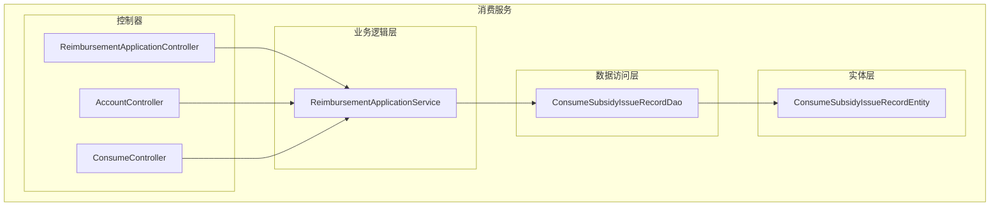
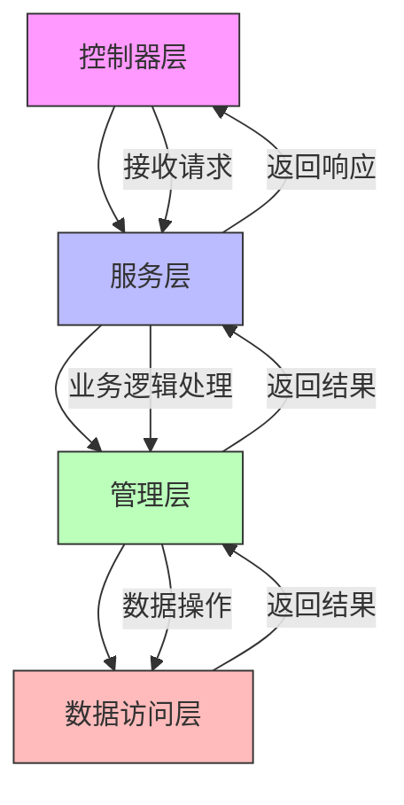
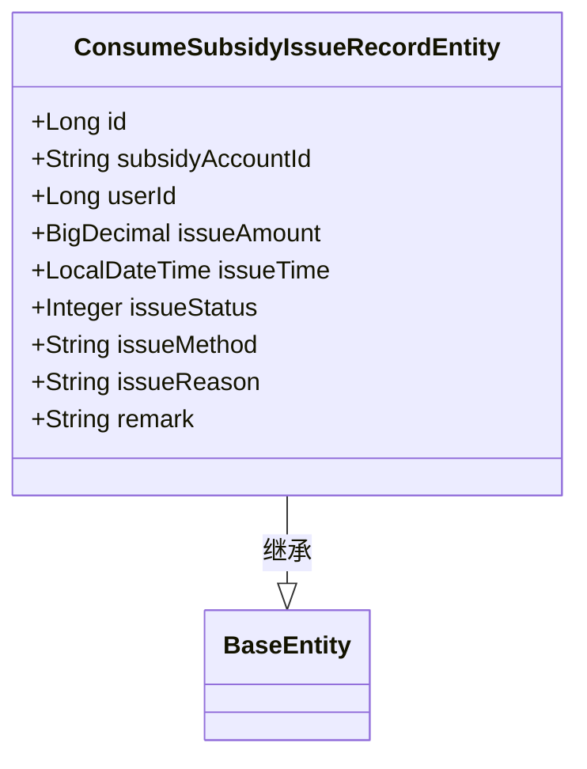
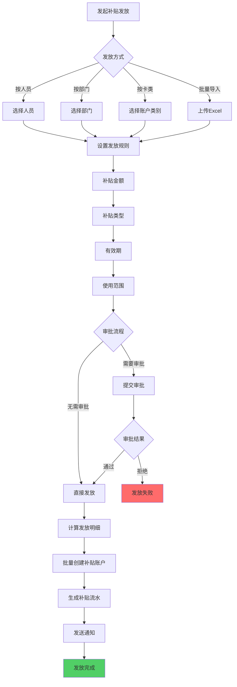
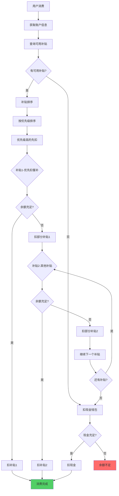
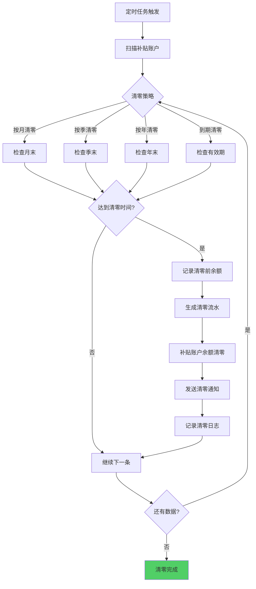
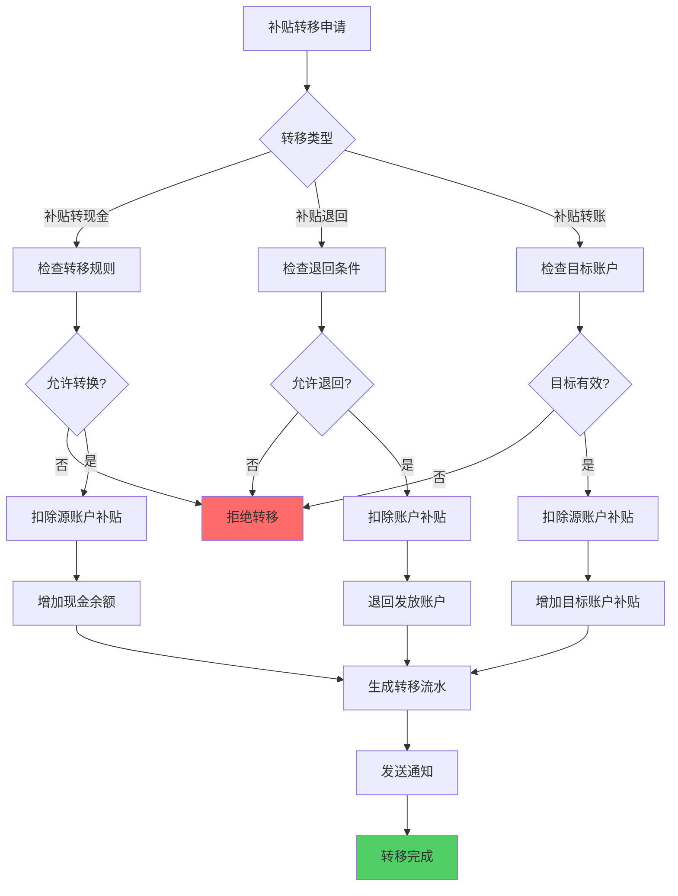
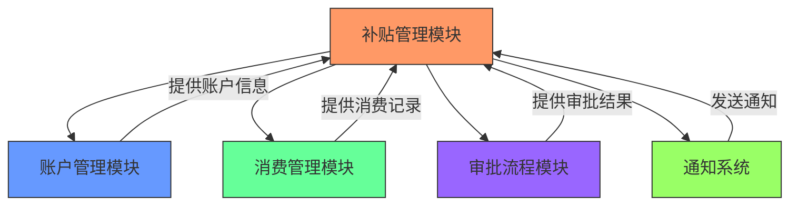

# 补贴管理API

<cite>
**本文档引用文件**   
- [ReimbursementApplicationController.java](file://microservices\ioedream-consume-service\src\main\java\net\lab1024\sa\consume\controller\ReimbursementApplicationController.java)
- [ConsumeSubsidyIssueRecordDao.java](file://microservices\ioedream-consume-service\src\main\java\net\lab1024\sa\consume\dao\ConsumeSubsidyIssueRecordDao.java)
- [ConsumeSubsidyIssueRecordEntity.java](file://microservices\ioedream-consume-service\src\main\java\net\lab1024\sa\consume\domain\entity\ConsumeSubsidyIssueRecordEntity.java)
- [ENTERPRISE_IMPLEMENTATION_COMPLETE_REPORT.md](file://microservices\ioedream-consume-service\docs\ENTERPRISE_IMPLEMENTATION_COMPLETE_REPORT.md)
- [10-补贴管理模块重构设计.md](file://documentation\03-业务模块\消费\10-补贴管理模块重构设计.md)
- [AccountController.java](file://microservices\ioedream-consume-service\src\main\java\net\lab1024\sa\consume\controller\AccountController.java)
</cite>

## 目录
1. [引言](#引言)
2. [项目结构](#项目结构)
3. [核心组件](#核心组件)
4. [架构概述](#架构概述)
5. [详细组件分析](#详细组件分析)
6. [依赖分析](#依赖分析)
7. [性能考虑](#性能考虑)
8. [故障排除指南](#故障排除指南)
9. [结论](#结论)
10. [附录](#附录)（如有必要）

## 引言
本文档详细描述了企业为员工发放消费补贴的机制和接口。基于补贴管理设计文档，深入解释了补贴规则的配置、补贴发放的触发条件（如按月、按次）以及补贴额度的计算方式。提供了为特定账户或账户组发放补贴的API调用示例，并说明了补贴资金与账户余额的关系，以及如何查询补贴发放记录和余额。

## 项目结构
消费服务的项目结构清晰地组织了补贴管理相关的代码。核心补贴管理功能位于`ioedream-consume-service`微服务中，主要包含控制器、数据访问对象（DAO）和实体类。

**图表来源**
- [ReimbursementApplicationController.java](file://microservices\ioedream-consume-service\src\main\java\net\lab1024\sa\consume\controller\ReimbursementApplicationController.java)
- [ConsumeSubsidyIssueRecordDao.java](file://microservices\ioedream-consume-service\src\main\java\net\lab1024\sa\consume\dao\ConsumeSubsidyIssueRecordDao.java)
- [ConsumeSubsidyIssueRecordEntity.java](file://microservices\ioedream-consume-service\src\main\java\net\lab1024\sa\consume\domain\entity\ConsumeSubsidyIssueRecordEntity.java)

**章节来源**
- [ReimbursementApplicationController.java](file://microservices\ioedream-consume-service\src\main\java\net\lab1024\sa\consume\controller\ReimbursementApplicationController.java)
- [ConsumeSubsidyIssueRecordDao.java](file://microservices\ioedream-consume-service\src\main\java\net\lab1024\sa\consume\dao\ConsumeSubsidyIssueRecordDao.java)

## 核心组件
补贴管理API的核心组件包括补贴发放记录的实体类、数据访问对象和控制器。这些组件共同实现了补贴的发放、查询和管理功能。

**章节来源**
- [ConsumeSubsidyIssueRecordEntity.java](file://microservices\ioedream-consume-service\src\main\java\net\lab1024\sa\consume\domain\entity\ConsumeSubsidyIssueRecordEntity.java)
- [ConsumeSubsidyIssueRecordDao.java](file://microservices\ioedream-consume-service\src\main\java\net\lab1024\sa\consume\dao\ConsumeSubsidyIssueRecordDao.java)
- [ReimbursementApplicationController.java](file://microservices\ioedream-consume-service\src\main\java\net\lab1024\sa\consume\controller\ReimbursementApplicationController.java)

## 架构概述
补贴管理模块采用四层架构设计，确保了代码的清晰性和可维护性。从上至下分别为控制器层、服务层、管理层和数据访问层。

**图表来源**
- [ENTERPRISE_IMPLEMENTATION_COMPLETE_REPORT.md](file://microservices\ioedream-consume-service\docs\ENTERPRISE_IMPLEMENTATION_COMPLETE_REPORT.md)
- [10-补贴管理模块重构设计.md](file://documentation\03-业务模块\消费\10-补贴管理模块重构设计.md)

## 详细组件分析
### 补贴发放记录实体分析
补贴发放记录实体类`ConsumeSubsidyIssueRecordEntity`定义了补贴发放的核心数据结构，包括发放金额、时间、状态等关键字段。

#### 类图

**图表来源**
- [ConsumeSubsidyIssueRecordEntity.java](file://microservices\ioedream-consume-service\src\main\java\net\lab1024\sa\consume\domain\entity\ConsumeSubsidyIssueRecordEntity.java)

### 补贴发放流程分析
补贴发放流程涉及多个步骤，包括规则配置、触发条件判断、额度计算和实际发放。

#### 流程图

**图表来源**
- [10-补贴管理模块重构设计.md](file://documentation\03-业务模块\消费\10-补贴管理模块重构设计.md)

### 补贴消费扣款顺序分析
当用户进行消费时，系统会按照预设的优先级顺序扣除补贴和现金。

#### 流程图

**图表来源**
- [10-补贴管理模块重构设计.md](file://documentation\03-业务模块\消费\10-补贴管理模块重构设计.md)

### 补贴清零流程分析
系统支持多种清零策略，包括按月、按季、按年和到期清零。

#### 流程图

**图表来源**
- [10-补贴管理模块重构设计.md](file://documentation\03-业务模块\消费\10-补贴管理模块重构设计.md)

### 补贴转移/退回流程分析
系统支持补贴的转移、退回和转账操作，确保资金的灵活管理。

#### 流程图

**图表来源**
- [10-补贴管理模块重构设计.md](file://documentation\03-业务模块\消费\10-补贴管理模块重构设计.md)

**章节来源**
- [10-补贴管理模块重构设计.md](file://documentation\03-业务模块\消费\10-补贴管理模块重构设计.md)

## 依赖分析
补贴管理模块与其他模块存在明确的依赖关系，确保了系统的整体性和一致性。

**图表来源**
- [ENTERPRISE_IMPLEMENTATION_COMPLETE_REPORT.md](file://microservices\ioedream-consume-service\docs\ENTERPRISE_IMPLEMENTATION_COMPLETE_REPORT.md)
- [10-补贴管理模块重构设计.md](file://documentation\03-业务模块\消费\10-补贴管理模块重构设计.md)

**章节来源**
- [ENTERPRISE_IMPLEMENTATION_COMPLETE_REPORT.md](file://microservices\ioedream-consume-service\docs\ENTERPRISE_IMPLEMENTATION_COMPLETE_REPORT.md)

## 性能考虑
在设计补贴管理API时，充分考虑了性能因素，包括数据库查询优化、缓存策略和批量处理。

**章节来源**
- [10-补贴管理模块重构设计.md](file://documentation\03-业务模块\消费\10-补贴管理模块重构设计.md)

## 故障排除指南
### 常见问题及解决方案
1. **补贴发放失败**
   - 检查账户是否存在
   - 确认账户状态是否正常
   - 验证补贴规则配置是否正确

2. **补贴余额不正确**
   - 检查补贴发放记录
   - 核对消费流水记录
   - 确认清零策略执行情况

3. **审批流程卡住**
   - 检查审批人是否在线
   - 确认审批规则配置
   - 查看系统日志

**章节来源**
- [ENTERPRISE_IMPLEMENTATION_COMPLETE_REPORT.md](file://microservices\ioedream-consume-service\docs\ENTERPRISE_IMPLEMENTATION_COMPLETE_REPORT.md)
- [10-补贴管理模块重构设计.md](file://documentation\03-业务模块\消费\10-补贴管理模块重构设计.md)

## 结论
本文档详细介绍了补贴管理API的设计和实现，涵盖了从规则配置到实际发放的全过程。通过清晰的架构设计和完善的流程控制，确保了补贴管理的准确性和可靠性。