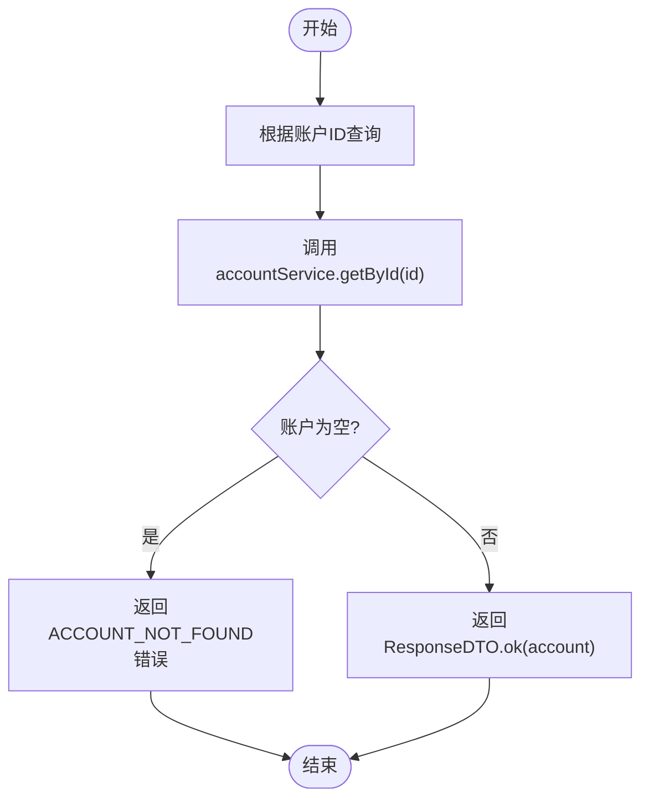

# 账户管理API

<cite>
**本文档引用文件**  
- [AccountController.java](file://microservices\ioedream-consume-service\src\main\java\net\lab1024\sa\consume\controller\AccountController.java)
- [AccountEntity.java](file://microservices\ioedream-consume-service\src\main\java\net\lab1024\sa\consume\domain\entity\AccountEntity.java)
- [AccountServiceImpl.java](file://microservices\ioedream-consume-service\src\main\java\net\lab1024\sa\consume\service\impl\AccountServiceImpl.java)
- [AccountAddForm.java](file://microservices\ioedream-consume-service\src\main\java\net\lab1024\sa\consume\domain\form\AccountAddForm.java)
- [AccountUpdateForm.java](file://microservices\ioedream-consume-service\src\main\java\net\lab1024\sa\consume\domain\form\AccountUpdateForm.java)
- [AccountDao.java](file://microservices\ioedream-consume-service\src\main\java\net\lab1024\sa\consume\dao\AccountDao.java)
- [ACCOUNT_ENTITY_UNIFICATION_SUMMARY.md](file://documentation\archive\reports-2025-12-04\ACCOUNT_ENTITY_UNIFICATION_SUMMARY.md)
- [ACCOUNT_SERVICE_IMPL_COMPLETE.md](file://documentation\archive\reports-2025-12-04\ACCOUNT_SERVICE_IMPL_COMPLETE.md)
</cite>

## 目录
1. [简介](#简介)
2. [账户实体数据模型](#账户实体数据模型)
3. [核心API接口](#核心api接口)
4. [账户状态机与流转逻辑](#账户状态机与流转逻辑)
5. [系统集成与状态同步](#系统集成与状态同步)
6. [请求/响应示例](#请求响应示例)
7. [性能与缓存策略](#性能与缓存策略)

## 简介

账户管理API是消费服务的核心模块，负责管理用户消费账户的全生命周期。该API提供账户的创建、查询、状态变更（激活、冻结、注销）等操作，支持现金和补贴双余额管理，并与门禁、考勤等系统进行状态同步。API严格遵循RESTful规范，使用统一的响应格式和权限控制。

**本文档引用文件**
- [AccountController.java](file://microservices\ioedream-consume-service\src\main\java\net\lab1024\sa\consume\controller\AccountController.java#L1-L566)
- [AccountServiceImpl.java](file://microservices\ioedream-consume-service\src\main\java\net\lab1024\sa\consume\service\impl\AccountServiceImpl.java#L1-L1038)

## 账户实体数据模型

账户实体（AccountEntity）是账户管理的核心数据结构，定义了账户的所有属性和业务逻辑。该实体继承自BaseEntity，包含审计字段（创建时间、更新时间等），并使用MyBatis-Plus的@TableName注解指定数据库表名为"account"。

### 核心字段

| 字段名 | 类型 | 说明 |
|--------|------|------|
| id | Long | 账户ID（主键，自增） |
| userId | Long | 用户ID |
| accountKindId | Long | 账户类别ID |
| balance | Long | 账户余额（单位：分） |
| allowanceBalance | Long | 补贴余额（单位：分） |
| frozenBalance | Long | 冻结余额（单位：分） |
| status | Integer | 账户状态（1-正常，2-冻结，3-注销） |
| version | Integer | 乐观锁版本号 |

### 业务逻辑方法

AccountEntity提供了丰富的业务逻辑方法，用于账户状态和余额的验证：

- `isNormal()`：检查账户是否正常
- `isFrozen()`：检查账户是否冻结
- `isClosed()`：检查账户是否关闭
- `getAvailableBalance()`：获取可用余额
- `isBalanceSufficient(amount)`：检查余额是否充足
- `canConsume(amount)`：检查是否可以消费

### 数据转换

为了方便计算，AccountEntity提供了将分转换为元的辅助方法：

- `getBalanceAmount()`：获取账户余额（BigDecimal类型，单位：元）
- `getAllowanceBalanceAmount()`：获取补贴余额（BigDecimal类型，单位：元）
- `getFrozenBalanceAmount()`：获取冻结余额（BigDecimal类型，单位：元）

**本文档引用文件**
- [AccountEntity.java](file://microservices\ioedream-consume-service\src\main\java\net\lab1024\sa\consume\domain\entity\AccountEntity.java#L1-L154)
- [ACCOUNT_ENTITY_UNIFICATION_SUMMARY.md](file://documentation\archive\reports-2025-12-04\ACCOUNT_ENTITY_UNIFICATION_SUMMARY.md#L1-L212)

## 核心API接口

账户管理API提供了一系列RESTful接口，用于账户的CRUD操作和状态管理。所有接口返回统一的ResponseDTO格式，包含code、message和data字段。

### 账户创建

创建账户接口用于为指定用户创建新的消费账户。


**接口详情**
- **URL**: `/api/v1/consume/account/add`
- **方法**: POST
- **权限**: CONSUME_MANAGER
- **请求体**: AccountAddForm
- **成功响应**: 200，返回账户ID
- **失败响应**: 400，账户已存在或参数错误

**本文档引用文件**
- [AccountController.java](file://microservices\ioedream-consume-service\src\main\java\net\lab1024\sa\consume\controller\AccountController.java#L78-L109)
- [AccountServiceImpl.java](file://microservices\ioedream-consume-service\src\main\java\net\lab1024\sa\consume\service\impl\AccountServiceImpl.java#L73-L119)
- [AccountAddForm.java](file://microservices\ioedream-consume-service\src\main\java\net\lab1024\sa\consume\domain\form\AccountAddForm.java#L1-L44)

### 账户查询

提供多种查询接口，支持根据账户ID、用户ID或条件分页查询账户列表。



**接口列表**
- `GET /api/v1/consume/account/{id}`：根据账户ID查询账户详情
- `GET /api/v1/consume/account/user/{userId}`：根据用户ID查询账户
- `GET /api/v1/consume/account/query`：分页查询账户列表
- `POST /api/v1/consume/account/batch/search`：批量查询账户信息

**本文档引用文件**
- [AccountController.java](file://microservices\ioedream-consume-service\src\main\java\net\lab1024\sa\consume\controller\AccountController.java#L140-L239)
- [AccountServiceImpl.java](file://microservices\ioedream-consume-service\src\main\java\net\lab1024\sa\consume\service\impl\AccountServiceImpl.java#L217-L351)

### 余额管理

提供增加、扣减、冻结、解冻账户余额的接口。


**接口列表**
- `POST /api/v1/consume/account/balance/add`：增加账户余额
- `POST /api/v1/consume/account/balance/deduct`：扣减账户余额
- `POST /api/v1/consume/account/balance/freeze`：冻结账户余额
- `POST /api/v1/consume/account/balance/unfreeze`：解冻账户余额

**本文档引用文件**
- [AccountController.java](file://microservices\ioedream-consume-service\src\main\java\net\lab1024\sa\consume\controller\AccountController.java#L269-L359)
- [AccountServiceImpl.java](file://microservices\ioedream-consume-service\src\main\java\net\lab1024\sa\consume\service\impl\AccountServiceImpl.java#L417-L612)

### 状态管理

提供账户状态变更接口，包括启用、禁用、冻结、解冻、关闭等操作。


**接口列表**
- `POST /api/v1/consume/account/status/enable`：启用账户
- `POST /api/v1/consume/account/status/disable`：禁用账户
- `POST /api/v1/consume/account/status/freeze`：冻结账户状态
- `POST /api/v1/consume/account/status/unfreeze`：解冻账户状态
- `POST /api/v1/consume/account/status/close`：关闭账户

**本文档引用文件**
- [AccountController.java](file://microservices\ioedream-consume-service\src\main\java\net\lab1024\sa\consume\controller\AccountController.java#L367-L463)
- [AccountServiceImpl.java](file://microservices\ioedream-consume-service\src\main\java\net\lab1024\sa\consume\service\impl\AccountServiceImpl.java#L661-L755)

## 账户状态机与流转逻辑

账户状态机定义了账户在不同状态之间的流转规则。账户有三种主要状态：正常（1）、冻结（2）和注销（3）。

### 状态流转规则

- **正常 → 冻结**：当账户需要临时停用时，调用冻结接口。
- **正常 → 注销**：当账户需要永久关闭时，调用关闭接口。
- **冻结 → 正常**：当账户需要恢复使用时，调用解冻接口。
- **注销**：为最终状态，不可逆。

### 状态变更验证

在状态变更前，系统会进行必要的验证：

- 冻结账户前，检查账户是否有未完成的交易。
- 关闭账户前，检查账户余额是否为零。
- 解冻账户前，检查账户是否被其他系统锁定。


**本文档引用文件**
- [AccountServiceImpl.java](file://microservices\ioedream-consume-service\src\main\java\net\lab1024\sa\consume\service\impl\AccountServiceImpl.java#L661-L755)
- [ACCOUNT_SERVICE_IMPL_COMPLETE.md](file://documentation\archive\reports-2025-12-04\ACCOUNT_SERVICE_IMPL_COMPLETE.md#L1-L80)

## 系统集成与状态同步

账户状态需要与门禁、考勤等系统保持同步，确保用户在不同系统中的权限一致。

### 同步机制

使用事件驱动架构，当账户状态变更时，发布账户状态变更事件，由消息队列通知其他系统。


### 同步流程

1. 账户服务更新账户状态。
2. 发布账户状态变更事件到消息队列。
3. 门禁服务消费事件，更新用户的门禁权限。
4. 考勤服务消费事件，更新用户的考勤状态。
5. 所有系统更新完成后，标记事件为已处理。

**本文档引用文件**
- [AccountServiceImpl.java](file://microservices\ioedream-consume-service\src\main\java\net\lab1024\sa\consume\service\impl\AccountServiceImpl.java#L661-L755)

## 请求/响应示例

### 创建账户

**请求**
```json
{
  "userId": 1001,
  "accountKindId": 1,
  "initialBalance": 100.00
}
```

**成功响应**
```json
{
  "code": 200,
  "data": 2001
}
```

**失败响应**
```json
{
  "code": 400,
  "message": "CREATE_ACCOUNT_ERROR",
  "data": "创建账户失败: 该用户账户已存在"
}
```

### 查询账户详情

**请求**
```
GET /api/v1/consume/account/2001
```

**成功响应**
```json
{
  "code": 200,
  "data": {
    "id": 2001,
    "userId": 1001,
    "accountKindId": 1,
    "balance": 10000,
    "allowanceBalance": 0,
    "frozenBalance": 0,
    "status": 1,
    "version": 0,
    "createTime": "2025-01-30T10:00:00",
    "updateTime": "2025-01-30T10:00:00"
  }
}
```

### 冻结账户

**请求**
```
POST /api/v1/consume/account/status/freeze?accountId=2001&reason=账户异常
```

**成功响应**
```json
{
  "code": 200,
  "data": true
}
```

**本文档引用文件**
- [AccountController.java](file://microservices\ioedream-consume-service\src\main\java\net\lab1024\sa\consume\controller\AccountController.java#L407-L421)
- [ACCOUNT_SERVICE_IMPL_COMPLETE.md](file://documentation\archive\reports-2025-12-04\ACCOUNT_SERVICE_IMPL_COMPLETE.md#L1-L80)

## 性能与缓存策略

### 缓存设计

使用Redis缓存频繁访问的账户数据，减少数据库查询压力。

- **缓存键**: `account:{accountId}`
- **缓存时间**: 5分钟
- **缓存更新**: 在账户创建、更新、删除操作后清除缓存

### 性能优化

- **批量查询**: 使用IN查询替代循环查询，提高批量查询性能。
- **分页查询**: 使用MyBatis-Plus的分页插件，支持高效分页。
- **索引优化**: 在userId、status等常用查询字段上创建索引。


**本文档引用文件**
- [AccountServiceImpl.java](file://microservices\ioedream-consume-service\src\main\java\net\lab1024\sa\consume\service\impl\AccountServiceImpl.java#L226-L227)
- [ACCOUNT_SERVICE_IMPL_COMPLETE.md](file://documentation\archive\reports-2025-12-04\ACCOUNT_SERVICE_IMPL_COMPLETE.md#L60-L63)