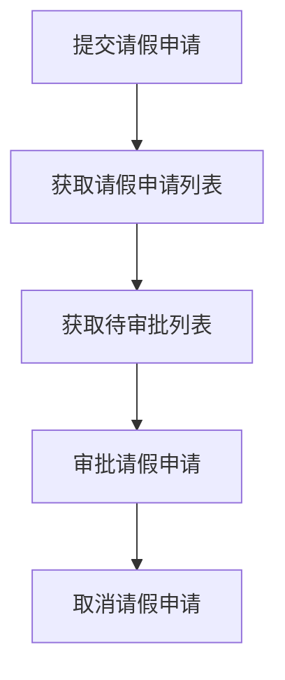
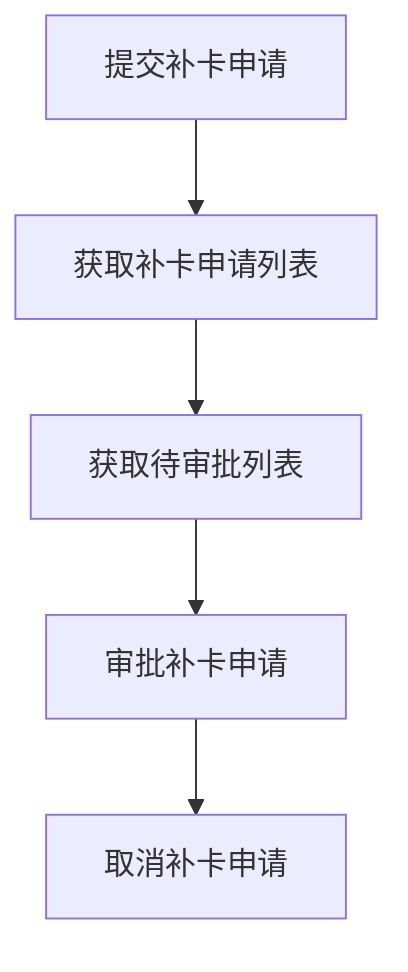
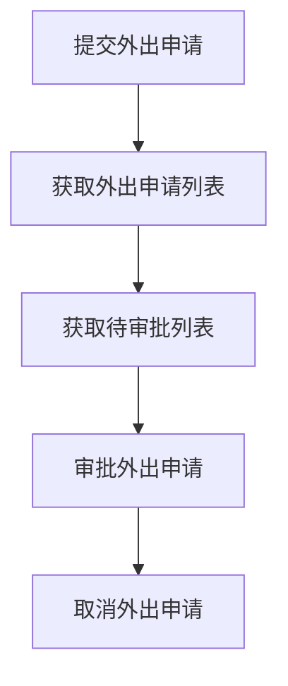
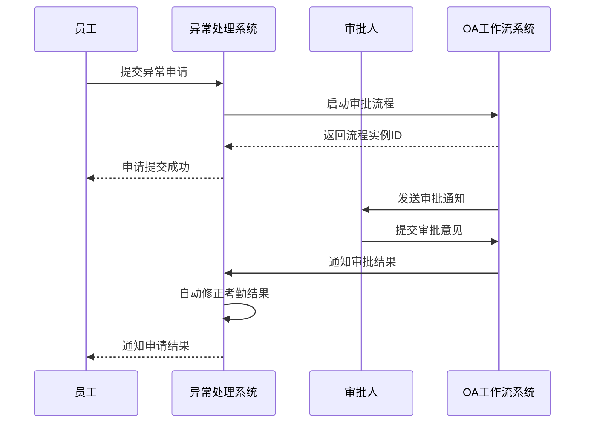
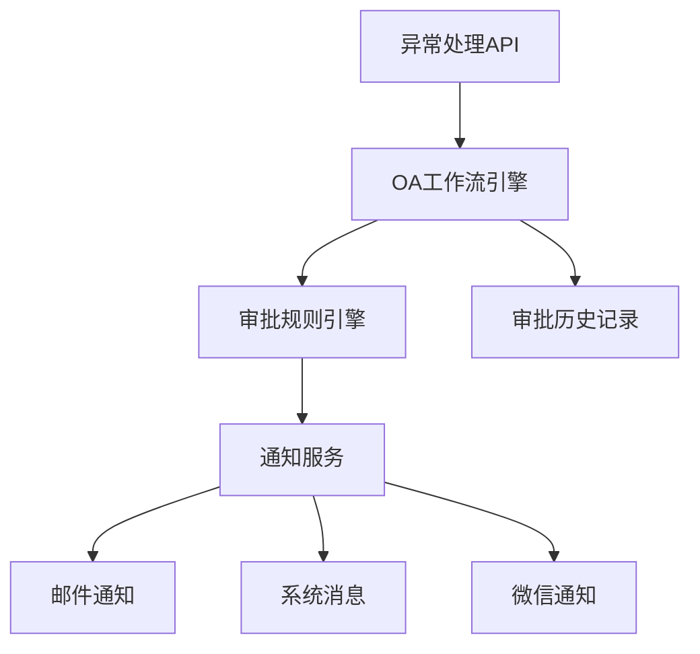
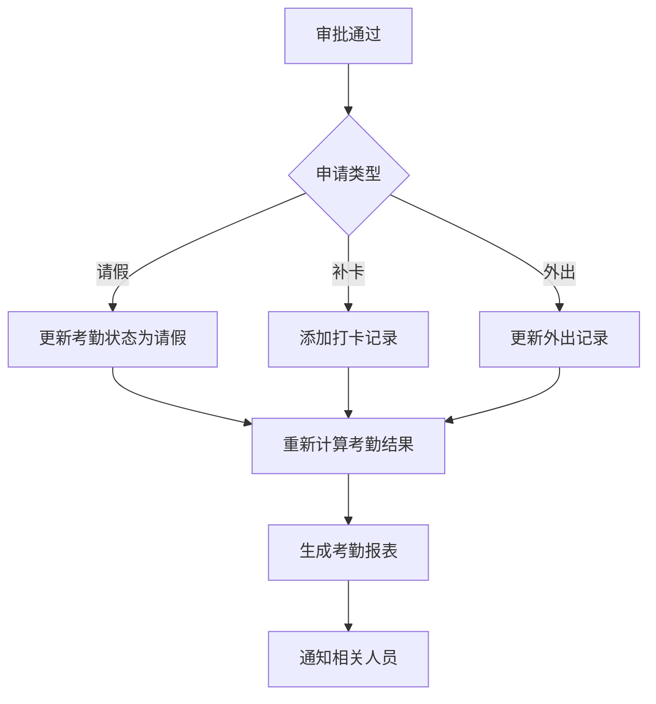

# 异常处理API

<cite>
**本文档引用文件**  
- [AttendanceExceptionApplicationController.java](file://restful_refactor_backup_20251202_014224\microservices_ioedream-attendance-service_src_main_java_net_lab1024_sa_attendance_controller_AttendanceExceptionApplicationController.java)
- [AttendanceLeaveController.java](file://microservices\ioedream-attendance-service\src\main\java\net\lab1024\sa\attendance\controller\AttendanceLeaveController.java)
- [AttendanceOvertimeController.java](file://microservices\ioedream-attendance-service\src\main\java\net\lab1024\sa\attendance\controller\AttendanceOvertimeController.java)
- [异常管理.md](file://documentation\03-业务模块\考勤\异常管理.md)
- [考勤前端原型布局\异常管理功能布局文档_完整版.md](file://documentation\03-业务模块\各业务模块文档\考勤\考勤前端原型布局\异常管理功能布局文档_完整版.md)
- [smart-workflow.md](file://documentation\technical\smart-workflow.md)
</cite>

## 目录
1. [简介](#简介)
2. [核心API接口](#核心api接口)
3. [数据模型](#数据模型)
4. [审批流程](#审批流程)
5. [OA工作流集成](#oa工作流集成)
6. [自动修正机制](#自动修正机制)
7. [示例代码](#示例代码)

## 简介
异常处理API是考勤系统的核心组件，负责处理请假申请、补卡申请、外出申请等考勤异常情况。该API通过与OA工作流服务集成，实现了多级审批流程，并在审批通过后自动修正考勤结果。

**Section sources**
- [异常管理.md](file://documentation\03-业务模块\考勤\异常管理.md)

## 核心API接口
异常处理API提供了以下核心接口：

### 请假申请相关接口


**Diagram sources**
- [AttendanceLeaveController.java](file://microservices\ioedream-attendance-service\src\main\java\net\lab1024\sa\attendance\controller\AttendanceLeaveController.java)

### 补卡申请相关接口


**Diagram sources**
- [AttendanceExceptionApplicationController.java](file://restful_refactor_backup_20251202_014224\microservices_ioedream-attendance-service_src_main_java_net_lab1024_sa_attendance_controller_AttendanceExceptionApplicationController.java)

### 外出申请相关接口


**Diagram sources**
- [AttendanceExceptionApplicationController.java](file://restful_refactor_backup_20251202_014224\microservices_ioedream-attendance-service_src_main_java_net_lab1024_sa_attendance_controller_AttendanceExceptionApplicationController.java)

## 数据模型
### ExceptionApplication数据模型
异常申请数据模型包含以下关键字段：

| 字段名 | 类型 | 描述 |
|-------|------|------|
| applicationId | Long | 申请ID |
| employeeId | Long | 员工ID |
| applicationType | String | 申请类型（LEAVE, OVERTIME, FORGOT_PUNCH等） |
| startDate | Date | 开始日期 |
| startTime | Time | 开始时间 |
| endDate | Date | 结束日期 |
| endTime | Time | 结束时间 |
| duration | Decimal | 时长（天/小时） |
| reason | Text | 申请原因 |
| approvalStatus | TinyInt | 审批状态（0-待审批，1-已通过，2-已拒绝） |
| approverId | Long | 审批人ID |
| approvalTime | DateTime | 审批时间 |
| approvalComment | Text | 审批意见 |
| status | TinyInt | 状态（0-删除，1-正常） |

**Section sources**
- [异常管理.md](file://documentation\03-业务模块\考勤\异常管理.md)

## 审批流程
异常申请的审批流程如下：



**Diagram sources**
- [smart-workflow.md](file://documentation\technical\smart-workflow.md)

## OA工作流集成
异常处理API与OA工作流服务深度集成，实现多级审批流程。

### 集成架构


**Diagram sources**
- [smart-workflow.md](file://documentation\technical\smart-workflow.md)

### 审批流程配置
审批流程通过JSON配置，支持灵活的审批规则：

```json
{
  "workflow_name": "请假审批流程",
  "approval_levels": [
    {
      "level": 1,
      "approver_type": "direct_manager",
      "approver_role": "直属领导",
      "required": true,
      "time_limit_hours": 24
    },
    {
      "level": 2,
      "approver_type": "hr_manager",
      "approver_role": "HR经理",
      "required": true,
      "time_limit_hours": 48,
      "condition": "duration >= 3"
    }
  ],
  "escalation_rules": [
    {
      "condition": "approval_timeout",
      "action": "escalate_to_next_level",
      "timeout_hours": 24
    }
  ]
}
```

**Section sources**
- [异常管理.md](file://documentation\03-业务模块\考勤\异常管理.md)

## 自动修正机制
审批通过后，系统自动修正考勤结果：



**Diagram sources**
- [AttendanceLeaveController.java](file://microservices\ioedream-attendance-service\src\main\java\net\lab1024\sa\attendance\controller\AttendanceLeaveController.java)

## 示例代码
### 提交请假申请
```javascript
// src/api/business/attendance/exception/leave-api.js
import { postRequest } from '/@/lib/axios';

export const leaveApi = {
  createLeaveApplication: (params) => postRequest('/attendance/exception/leave/apply', params)
};
```

**Section sources**
- [考勤前端原型布局\异常管理功能布局文档_完整版.md](file://documentation\03-业务模块\各业务模块文档\考勤\考勤前端原型布局\异常管理功能布局文档_完整版.md)

### 提交加班申请
```javascript
// src/api/business/attendance/exception/overtime-api.js
import { postRequest } from '/@/lib/axios';

export const overtimeApi = {
  createOvertimeApplication: (params) => postRequest('/attendance/exception/overtime/apply', params)
};
```

**Section sources**
- [考勤前端原型布局\异常管理功能布局文档_完整版.md](file://documentation\03-业务模块\各业务模块文档\考勤\考勤前端原型布局\异常管理功能布局文档_完整版.md)