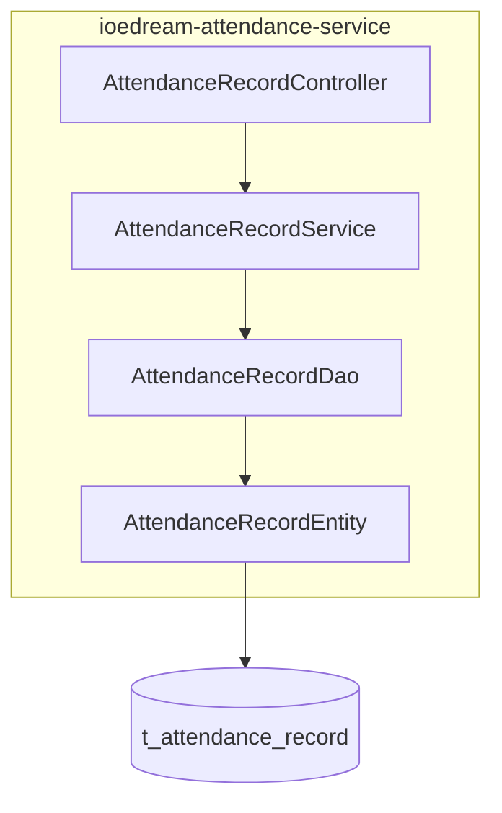
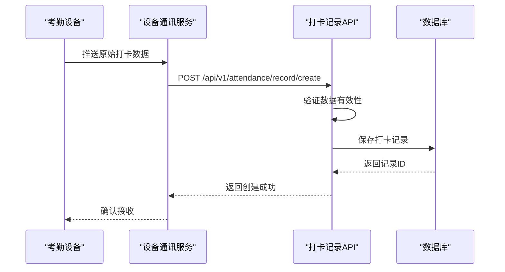
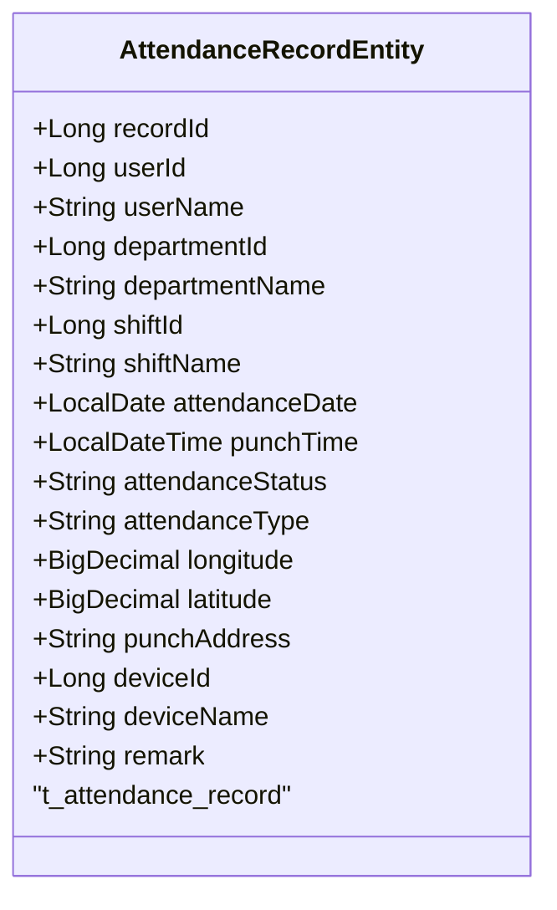
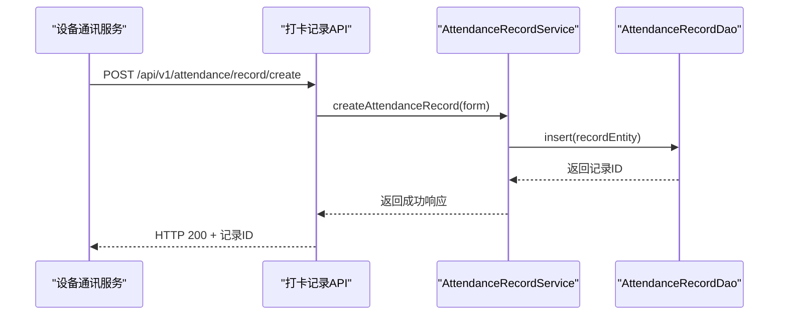
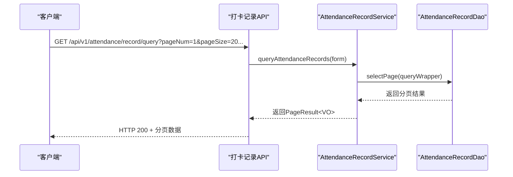
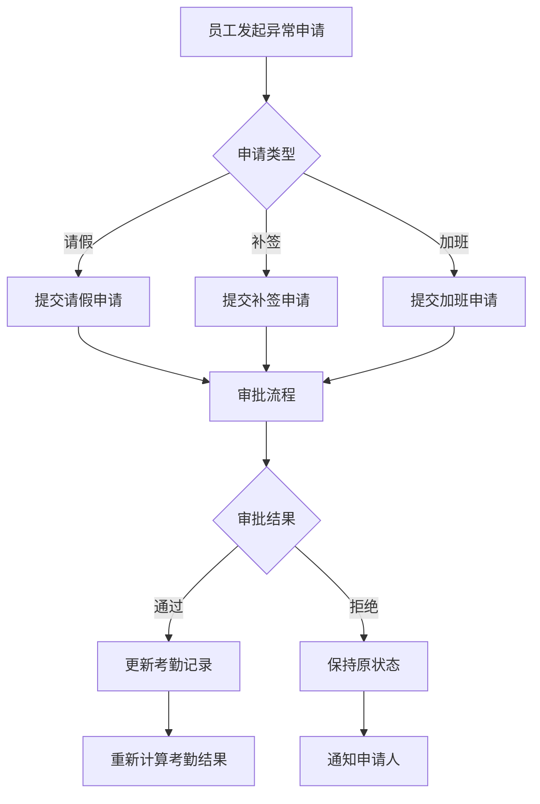
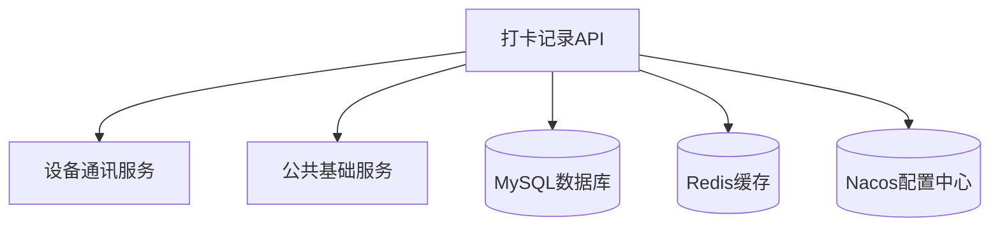

# 打卡记录API

<cite>
**本文档引用的文件**  
- [AttendanceRecordController.java](file://microservices\ioedream-attendance-service\src\main\java\net\lab1024\sa\attendance\controller\AttendanceRecordController.java)
- [AttendanceRecordEntity.java](file://microservices\ioedream-attendance-service\src\main\java\net\lab1024\sa\attendance\domain\entity\AttendanceRecordEntity.java)
- [AttendanceRecordService.java](file://microservices\ioedream-attendance-service\src\main\java\net\lab1024\sa\attendance\service\AttendanceRecordService.java)
- [AttendanceRecordAddForm.java](file://microservices\ioedream-attendance-service\src\main\java\net\lab1024\sa\attendance\domain\form\AttendanceRecordAddForm.java)
- [AttendanceRecordQueryForm.java](file://microservices\ioedream-attendance-service\src\main\java\net\lab1024\sa\attendance\domain\form\AttendanceRecordQueryForm.java)
- [AttendanceRecordVO.java](file://microservices\ioedream-attendance-service\src\main\java\net\lab1024\sa\attendance\domain\vo\AttendanceRecordVO.java)
- [AttendanceRecordStatisticsVO.java](file://microservices\ioedream-attendance-service\src\main\java\net\lab1024\sa\attendance\domain\vo\AttendanceRecordStatisticsVO.java)
- [MinerU_考勤PUSH通讯协议 （熵基科技） V4.0-20210113(水印版)__20251206181117.md](file://documentation\各个设备通讯协议\MinerU_考勤PUSH通讯协议 （熵基科技） V4.0-20210113(水印版)__20251206181117.md)
- [考勤系统数据库ER图设计.md](file://documentation\03-业务模块\考勤\考勤系统数据库ER图设计.md)
- [原始记录及考勤计算.md](file://documentation\03-业务模块\各业务模块文档\考勤\原始记录及考勤计算.md)
- [AttendanceExceptionApplicationController.java](file://restful_refactor_backup_20251202_014224\microservices_ioedream-attendance-service_src_main_java_net_lab1024_sa_attendance_controller_AttendanceExceptionApplicationController.java)
</cite>

## 目录
1. [简介](#简介)
2. [项目结构](#项目结构)
3. [核心组件](#核心组件)
4. [架构概述](#架构概述)
5. [详细组件分析](#详细组件分析)
6. [依赖分析](#依赖分析)
7. [性能考虑](#性能考虑)
8. [故障排除指南](#故障排除指南)
9. [结论](#结论)

## 简介
本API文档详细描述了IoE-DREAM系统中的打卡记录API，重点涵盖员工打卡、异常打卡处理、打卡记录查询等核心功能。文档详细说明了`AttendanceRecord`数据模型的字段含义，包括打卡时间、设备ID、打卡类型等关键信息。同时，提供了通过门禁系统同步打卡数据的集成示例，以及处理迟到、早退、缺卡等异常情况的业务逻辑。API通过与设备通讯服务交互，从考勤机等设备获取原始打卡数据，并进行有效性验证和处理。

## 项目结构
打卡记录API主要位于`ioedream-attendance-service`微服务中，其核心功能分布在控制器、服务、数据访问和实体包中。API通过`AttendanceRecordController`暴露RESTful接口，由`AttendanceRecordService`处理业务逻辑，并通过`AttendanceRecordDao`与数据库交互。数据模型由`AttendanceRecordEntity`定义，与数据库表`t_attendance_record`映射。

**Diagram sources**
- [AttendanceRecordController.java](file://microservices\ioedream-attendance-service\src\main\java\net\lab1024\sa\attendance\controller\AttendanceRecordController.java)
- [AttendanceRecordService.java](file://microservices\ioedream-attendance-service\src\main\java\net\lab1024\sa\attendance\service\AttendanceRecordService.java)
- [AttendanceRecordDao.java](file://microservices\ioedream-attendance-service\src\main\java\net\lab1024\sa\attendance\dao\AttendanceRecordDao.java)
- [AttendanceRecordEntity.java](file://microservices\ioedream-attendance-service\src\main\java\net\lab1024\sa\attendance\domain\entity\AttendanceRecordEntity.java)

**Section sources**
- [AttendanceRecordController.java](file://microservices\ioedream-attendance-service\src\main\java\net\lab1024\sa\attendance\controller\AttendanceRecordController.java)
- [AttendanceRecordEntity.java](file://microservices\ioedream-attendance-service\src\main\java\net\lab1024\sa\attendance\domain\entity\AttendanceRecordEntity.java)

## 核心组件
打卡记录API的核心组件包括`AttendanceRecordController`、`AttendanceRecordService`和`AttendanceRecordEntity`。控制器负责处理HTTP请求，服务层实现业务逻辑，实体类则定义了与数据库交互的数据模型。此外，`AttendanceRecordAddForm`和`AttendanceRecordQueryForm`用于封装创建和查询请求的参数，而`AttendanceRecordVO`和`AttendanceRecordStatisticsVO`则用于向客户端返回视图数据。

**Section sources**
- [AttendanceRecordController.java](file://microservices\ioedream-attendance-service\src\main\java\net\lab1024\sa\attendance\controller\AttendanceRecordController.java)
- [AttendanceRecordService.java](file://microservices\ioedream-attendance-service\src\main\java\net\lab1024\sa\attendance\service\AttendanceRecordService.java)
- [AttendanceRecordEntity.java](file://microservices\ioedream-attendance-service\src\main\java\net\lab1024\sa\attendance\domain\entity\AttendanceRecordEntity.java)
- [AttendanceRecordAddForm.java](file://microservices\ioedream-attendance-service\src\main\java\net\lab1024\sa\attendance\domain\form\AttendanceRecordAddForm.java)
- [AttendanceRecordQueryForm.java](file://microservices\ioedream-attendance-service\src\main\java\net\lab1024\sa\attendance\domain\form\AttendanceRecordQueryForm.java)
- [AttendanceRecordVO.java](file://microservices\ioedream-attendance-service\src\main\java\net\lab1024\sa\attendance\domain\vo\AttendanceRecordVO.java)
- [AttendanceRecordStatisticsVO.java](file://microservices\ioedream-attendance-service\src\main\java\net\lab1024\sa\attendance\domain\vo\AttendanceRecordStatisticsVO.java)

## 架构概述
打卡记录API采用典型的分层架构，包括表现层（Controller）、业务逻辑层（Service）、数据访问层（DAO）和持久层（Entity）。API通过RESTful接口与前端应用和设备通讯服务交互。设备通讯服务通过熵基科技的PUSH协议将考勤机的原始打卡数据推送到本API，API进行验证和处理后存入数据库。系统还支持通过移动端进行GPS打卡。

**Diagram sources**
- [AttendanceRecordController.java](file://microservices\ioedream-attendance-service\src\main\java\net\lab1024\sa\attendance\controller\AttendanceRecordController.java)
- [MinerU_考勤PUSH通讯协议 （熵基科技） V4.0-20210113(水印版)__20251206181117.md](file://documentation\各个设备通讯协议\MinerU_考勤PUSH通讯协议 （熵基科技） V4.0-20210113(水印版)__20251206181117.md)

## 详细组件分析
本节将深入分析打卡记录API的各个关键组件，包括数据模型、核心接口和业务逻辑。

### AttendanceRecord数据模型分析
`AttendanceRecordEntity`是打卡记录的核心数据模型，定义了所有与打卡相关的字段。该实体与数据库表`t_attendance_record`进行映射，包含了员工信息、打卡时间、位置、设备信息等关键数据。

**Diagram sources**
- [AttendanceRecordEntity.java](file://microservices\ioedream-attendance-service\src\main\java\net\lab1024\sa\attendance\domain\entity\AttendanceRecordEntity.java)
- [考勤系统数据库ER图设计.md](file://documentation\03-业务模块\考勤\考勤系统数据库ER图设计.md)

**Section sources**
- [AttendanceRecordEntity.java](file://microservices\ioedream-attendance-service\src\main\java\net\lab1024\sa\attendance\domain\entity\AttendanceRecordEntity.java)

### 打卡记录API接口分析
打卡记录API提供了创建、查询和统计打卡记录的核心接口。`AttendanceRecordController`中的接口遵循RESTful规范，使用标准的HTTP方法和状态码。

#### 创建打卡记录接口
该接口用于接收来自设备通讯服务的原始打卡数据，支持考勤机和移动端的打卡。

**Diagram sources**
- [AttendanceRecordController.java](file://microservices\ioedream-attendance-service\src\main\java\net\lab1024\sa\attendance\controller\AttendanceRecordController.java)
- [AttendanceRecordService.java](file://microservices\ioedream-attendance-service\src\main\java\net\lab1024\sa\attendance\service\AttendanceRecordService.java)
- [AttendanceRecordDao.java](file://microservices\ioedream-attendance-service\src\main\java\net\lab1024\sa\attendance\dao\AttendanceRecordDao.java)

#### 查询打卡记录接口
该接口支持分页查询打卡记录，可根据员工ID、部门ID、日期范围、考勤状态和考勤类型等条件进行筛选。

**Diagram sources**
- [AttendanceRecordController.java](file://microservices\ioedream-attendance-service\src\main\java\net\lab1024\sa\attendance\controller\AttendanceRecordController.java)
- [AttendanceRecordService.java](file://microservices\ioedream-attendance-service\src\main\java\net\lab1024\sa\attendance\service\AttendanceRecordService.java)
- [AttendanceRecordDao.java](file://microservices\ioedream-attendance-service\src\main\java\net\lab1024\sa\attendance\dao\AttendanceRecordDao.java)

### 异常打卡处理分析
系统通过`AttendanceExceptionApplicationController`处理各种异常打卡情况，如请假、补签、加班等。员工可以提交异常申请，经过审批流程后，系统会根据审批结果调整考勤状态。

**Diagram sources**
- [AttendanceExceptionApplicationController.java](file://restful_refactor_backup_20251202_014224\microservices_ioedream-attendance-service_src_main_java_net_lab1024_sa_attendance_controller_AttendanceExceptionApplicationController.java)
- [原始记录及考勤计算.md](file://documentation\03-业务模块\各业务模块文档\考勤\原始记录及考勤计算.md)

**Section sources**
- [AttendanceExceptionApplicationController.java](file://restful_refactor_backup_20251202_014224\microservices_ioedream-attendance-service_src_main_java_net_lab1024_sa_attendance_controller_AttendanceExceptionApplicationController.java)

## 依赖分析
打卡记录API依赖于多个外部服务和组件。它依赖于`ioedream-device-comm-service`来接收原始打卡数据，依赖于`ioedream-common-service`提供的基础组件和工具类。数据库方面，使用MySQL存储打卡记录，并通过MyBatis-Plus进行数据访问。

**Diagram sources**
- [pom.xml](file://microservices\ioedream-attendance-service\pom.xml)
- [AttendanceRecordController.java](file://microservices\ioedream-attendance-service\src\main\java\net\lab1024\sa\attendance\controller\AttendanceRecordController.java)

**Section sources**
- [pom.xml](file://microservices\ioedream-attendance-service\pom.xml)

## 性能考虑
为确保API的高性能，系统采用了多种优化策略。使用Redis缓存频繁查询的考勤统计数据，减少数据库压力。数据库表`t_attendance_record`在关键字段（如`user_id`, `attendance_date`, `punch_time`）上建立了索引，以加速查询操作。对于大量数据的导出，系统采用异步处理机制，避免阻塞主线程。

## 故障排除指南
当遇到打卡记录相关问题时，可按照以下步骤进行排查：

1. **检查设备连接**：确认考勤设备与网络连接正常，设备通讯服务能正常接收数据。
2. **验证数据格式**：检查设备推送的打卡数据是否符合PUSH协议规范，特别是时间戳和用户ID的格式。
3. **查看API日志**：检查`ioedream-attendance-service`的日志，查找创建打卡记录时的错误信息。
4. **检查数据库状态**：确认数据库连接正常，表`t_attendance_record`的写入操作没有异常。
5. **验证权限配置**：确保员工的打卡权限配置正确，特别是对于特定区域或设备的打卡限制。

**Section sources**
- [AttendanceRecordController.java](file://microservices\ioedream-attendance-service\src\main\java\net\lab1024\sa\attendance\controller\AttendanceRecordController.java)
- [AttendanceRecordService.java](file://microservices\ioedream-attendance-service\src\main\java\net\lab1024\sa\attendance\service\AttendanceRecordService.java)

## 结论
打卡记录API是IoE-DREAM考勤系统的核心组件，它提供了一套完整的解决方案，用于处理员工的打卡数据。通过与设备通讯服务的紧密集成，API能够实时接收和处理来自各种考勤设备的原始数据。系统支持灵活的查询和统计功能，并通过完善的异常处理机制，确保了考勤数据的准确性和完整性。未来可进一步优化移动端功能和生物识别集成，提升用户体验和安全性。