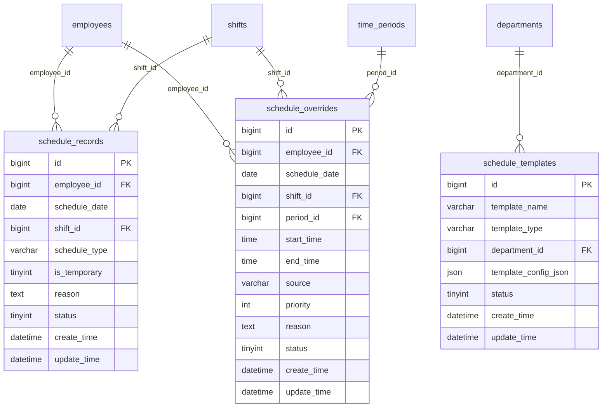

# 排班管理API

<cite>
**本文档引用文件**  
- [ShiftsController.java](file://restful_refactor_backup_20251202_014224\microservices_ioedream-attendance-service_src_main_java_net_lab1024_sa_attendance_controller_ShiftsController.java)
- [AttendanceScheduleController.java](file://restful_refactor_backup_20251202_014224\microservices_ioedream-attendance-service_src_main_java_net_lab1024_sa_attendance_controller_AttendanceScheduleController.java)
- [排班管理.md](file://documentation\03-业务模块\各业务模块文档\考勤\排班管理.md)
- [考勤前端原型布局\班次时间功能布局文档_完整版.md](file://documentation\03-业务模块\各业务模块文档\考勤\考勤前端原型布局\班次时间功能布局文档_完整版.md)
- [schedule_records.sql](file://database-scripts\common-service\18-t_employee.sql)
</cite>

## 目录
1. [简介](#简介)
2. [核心数据模型](#核心数据模型)
3. [排班配置数据结构](#排班配置数据结构)
4. [排班管理API接口](#排班管理api接口)
5. [班次管理API接口](#班次管理api接口)
6. [排班场景实现](#排班场景实现)
7. [批量排班设置](#批量排班设置)
8. [与考勤规则的关联](#与考勤规则的关联)
9. [数据表结构](#数据表结构)
10. [ER图](#er图)

## 简介
排班管理API提供了一套完整的排班计划创建和管理功能，支持固定班制、弹性班制和轮班制等多种复杂排班场景。本API允许管理员为部门或个人批量设置排班计划，并与考勤规则进行关联，确保考勤数据的准确性和完整性。

## 核心数据模型
排班管理模块的核心数据模型包括排班记录、排班模板和临时排班覆盖。这些模型共同构成了排班管理的基础，支持各种排班策略的实现。

**本节来源**
- [排班管理.md](file://documentation\03-业务模块\各业务模块文档\考勤\排班管理.md#L8-L54)

## 排班配置数据结构
### ScheduleConfig数据模型
ScheduleConfig数据模型用于定义排班计划的详细配置，包括工作日设置、班次时间、弹性时间等配置项。

```json
{
  "template_name": "技术部标准排班模板",
  "cycle_type": "weekly",
  "cycle_days": 7,
  "schedule_pattern": [
    {
      "day_of_week": 1,
      "shift_id": 101,
      "required_employees": 5,
      "skill_requirements": ["开发", "测试"]
    },
    {
      "day_of_week": 2,
      "shift_id": 102,
      "required_employees": 3,
      "skill_requirements": ["运维"]
    }
  ],
  "rotation_rules": {
    "auto_rotation": true,
    "rotation_frequency": "weekly",
    "fairness_factor": 0.8
  },
  "constraints": {
    "max_consecutive_days": 6,
    "min_rest_hours": 12,
    "weekend_balance": true,
    "holiday_preference": false
  },
  "applicable_employees": {
    "departments": [1, 2, 3],
    "positions": [10, 20],
    "exclude_employees": [1001, 1002]
  }
}
```

**本节来源**
- [排班管理.md](file://documentation\03-业务模块\各业务模块文档\考勤\排班管理.md#L144-L180)

## 排班管理API接口
### 排班记录管理
#### 创建排班记录
- **接口**: POST /api/attendance/schedules
- **权限**: attendance:schedule:create
- **描述**: 为员工创建新的排班记录

#### 更新排班记录
- **接口**: PUT /api/attendance/schedules/{scheduleId}
- **权限**: attendance:schedule:update
- **描述**: 更新指定的排班记录

#### 删除排班记录
- **接口**: DELETE /api/attendance/schedules/{scheduleId}
- **权限**: attendance:schedule:delete
- **描述**: 删除指定的排班记录

#### 批量删除排班记录
- **接口**: DELETE /api/attendance/schedules/batch
- **权限**: attendance:schedule:batch-delete
- **描述**: 批量删除指定的排班记录

#### 获取员工排班
- **接口**: GET /api/attendance/schedules/employee/{employeeId}
- **权限**: attendance:schedule:query
- **描述**: 查询员工指定日期范围的排班信息

#### 获取部门排班
- **接口**: GET /api/attendance/schedules/department/{departmentId}
- **权限**: attendance:schedule:query
- **描述**: 查询部门指定日期范围的排班信息

**本节来源**
- [AttendanceScheduleController.java](file://restful_refactor_backup_20251202_014224\microservices_ioedream-attendance-service_src_main_java_net_lab1024_sa_attendance_controller_AttendanceScheduleController.java#L56-L244)

## 班次管理API接口
### 班次配置管理
#### 创建班次
- **接口**: POST /api/attendance/shifts
- **权限**: attendance:shifts:create
- **描述**: 创建新的班次配置

#### 更新班次
- **接口**: PUT /api/attendance/shifts/{shiftId}
- **权限**: attendance:shifts:update
- **描述**: 更新指定的班次配置

#### 删除班次
- **接口**: DELETE /api/attendance/shifts/{shiftId}
- **权限**: attendance:shifts:delete
- **描述**: 删除指定的班次

#### 批量删除班次
- **接口**: DELETE /api/attendance/shifts/batch
- **权限**: attendance:shifts:batch-delete
- **描述**: 批量删除指定的班次

#### 获取班次详情
- **接口**: GET /api/attendance/shifts/{shiftId}
- **权限**: attendance:shifts:query
- **描述**: 查询指定班次的详细信息

#### 查询班次列表
- **接口**: GET /api/attendance/shifts
- **权限**: attendance:shifts:list
- **描述**: 根据查询条件查询班次列表

**本节来源**
- [ShiftsController.java](file://restful_refactor_backup_20251202_014224\microservices_ioedream-attendance-service_src_main_java_net_lab1024_sa_attendance_controller_ShiftsController.java#L57-L195)

## 排班场景实现
### 固定班制
固定班制适用于工作时间固定的员工，如行政人员。通过创建固定的排班模板，可以为员工批量设置排班计划。

### 弹性班制
弹性班制允许员工在规定的时间范围内自由选择上下班时间。通过配置弹性时间规则，可以实现灵活的排班管理。

### 轮班制
轮班制适用于需要24小时连续工作的岗位，如安保人员。通过配置轮班规则，可以实现自动化的轮班安排。

**本节来源**
- [排班管理.md](file://documentation\03-业务模块\各业务模块文档\考勤\排班管理.md#L118-L134)

## 批量排班设置
### 为部门批量设置排班计划
通过调用批量创建排班接口，可以为整个部门的员工批量设置排班计划。首先创建排班模板，然后应用到指定部门的所有员工。

### 为个人批量设置排班计划
通过调用批量创建排班接口，可以为特定员工批量设置排班计划。可以基于员工的岗位、技能等属性，应用相应的排班模板。

**本节来源**
- [AttendanceScheduleController.java](file://restful_refactor_backup_20251202_014224\microservices_ioedream-attendance-service_src_main_java_net_lab1024_sa_attendance_controller_AttendanceScheduleController.java#L311-L334)

## 与考勤规则的关联
排班管理API与考勤规则紧密关联，确保考勤数据的准确性和完整性。排班记录作为考勤计算的基础，直接影响考勤结果。通过将排班计划与考勤规则关联，可以实现自动化的考勤处理。

**本节来源**
- [排班管理.md](file://documentation\03-业务模块\各业务模块文档\考勤\排班管理.md#L270-L278)

## 数据表结构
### schedule_records（排班记录表）
```sql
CREATE TABLE schedule_records (
    bigint id PK "主键ID，自增长"
    bigint employee_id FK "员工ID，关联employees表"
    date schedule_date "排班日期，如：2024-01-15"
    bigint shift_id FK "班次ID，关联shifts表"
    varchar schedule_type "排班类型：正常排班/临时调班/加班排班"
    tinyint is_temporary "是否临时排班：0-正常，1-临时"
    text reason "排班原因，如：项目需要、人员调整"
    tinyint status "状态：0-取消，1-正常"
    datetime create_time "创建时间，记录排班创建时间"
    datetime update_time "更新时间，记录最后修改时间"
);
```

### schedule_templates（排班模板表）
```sql
CREATE TABLE schedule_templates (
    bigint id PK "主键ID，自增长"
    varchar template_name "模板名称，如：技术部标准排班模板"
    varchar template_type "模板类型：部门模板/岗位模板/个人模板"
    bigint department_id FK "部门ID，关联departments表"
    json template_config_json "模板配置JSON，包含排班规则和周期"
    tinyint status "状态：0-禁用，1-启用"
    datetime create_time "创建时间，记录模板创建时间"
    datetime update_time "更新时间，记录最后修改时间"
);
```

### schedule_overrides（临时排班覆盖表）
```sql
CREATE TABLE schedule_overrides (
    bigint id PK "主键ID，自增长"
    bigint employee_id FK "员工ID，关联employees表"
    date schedule_date "日期，如：2024-01-15"
    bigint shift_id FK "班次ID(可空)，用于整班覆盖"
    bigint period_id FK "时间段ID(可空)，关联time_periods表"
    time start_time "自定义开始时间(当不引用period时)"
    time end_time "自定义结束时间(当不引用period时)"
    varchar source "来源：manual/system/api"
    int priority "优先级(数值越大优先级越高)"
    text reason "原因，如：临时支援、临时会议"
    tinyint status "状态：0-取消，1-生效"
    datetime create_time "创建时间"
    datetime update_time "更新时间"
);
```

**本节来源**
- [排班管理.md](file://documentation\03-业务模块\各业务模块文档\考勤\排班管理.md#L9-L54)

## ER图


**图表来源**
- [排班管理.md](file://documentation\03-业务模块\各业务模块文档\考勤\排班管理.md#L60-L109)