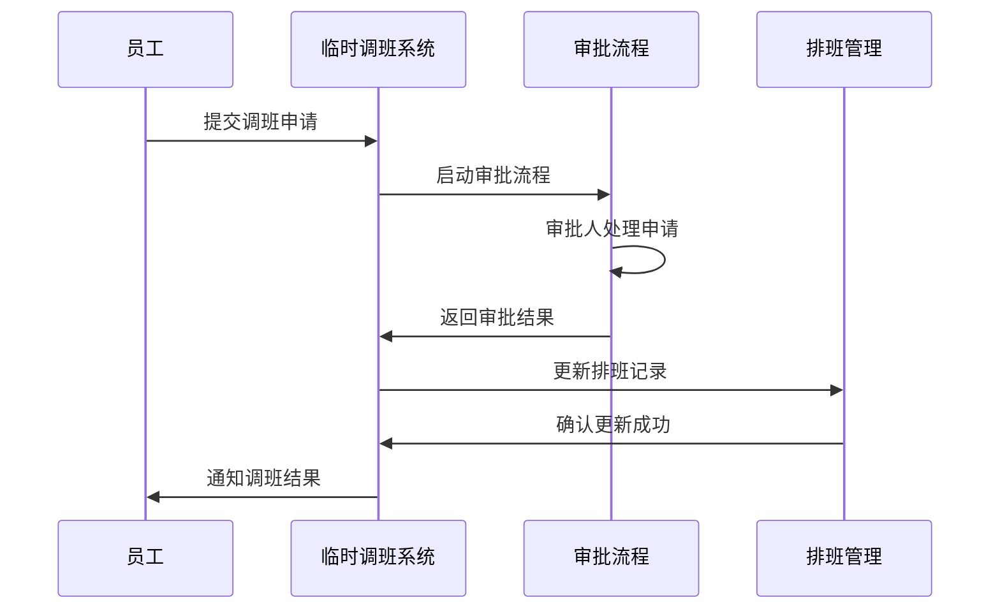
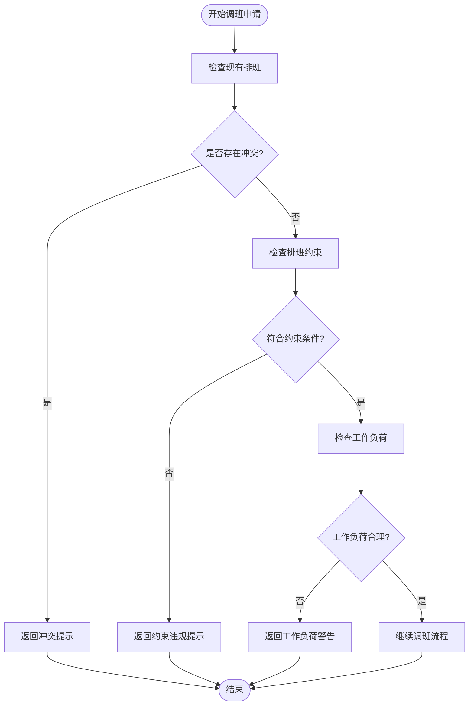
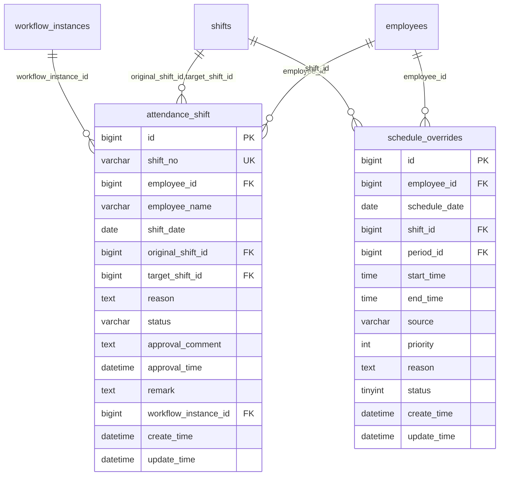
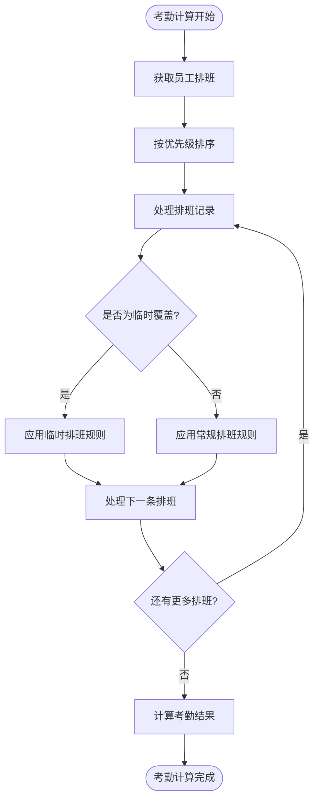
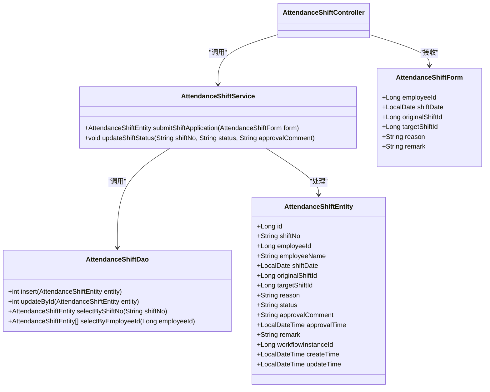
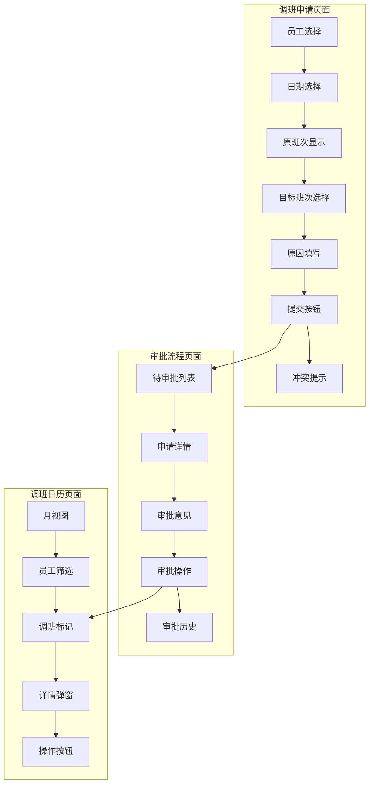

# 临时调班管理

<cite>
**本文档引用文件**  
- [排班管理.md](file://documentation\03-业务模块\考勤\排班管理.md)
- [AttendanceShiftController.java](file://microservices\ioedream-attendance-service\src\main\java\net\lab1024\sa\attendance\controller\AttendanceShiftController.java)
- [AttendanceShiftServiceImpl.java](file://microservices\ioedream-attendance-service\src\main\java\net\lab1024\sa\attendance\service\impl\AttendanceShiftServiceImpl.java)
- [AttendanceShiftEntity.java](file://microservices\ioedream-attendance-service\src\main\java\net\lab1024\sa\attendance\domain\entity\AttendanceShiftEntity.java)
- [AttendanceShiftForm.java](file://microservices\ioedream-attendance-service\src\main\java\net\lab1024\sa\attendance\domain\form\AttendanceShiftForm.java)
</cite>

## 目录
1. [简介](#简介)
2. [临时调班申请与审批流程](#临时调班申请与审批流程)
3. [冲突检测机制](#冲突检测机制)
4. [数据模型设计](#数据模型设计)
5. [考勤计算中的优先级应用](#考勤计算中的优先级应用)
6. [API接口示例](#api接口示例)
7. [调班历史追溯](#调班历史追溯)
8. [前端功能布局](#前端功能布局)

## 简介
本文档详细描述了临时调班管理功能的设计与实现，重点涵盖单个员工临时调班的申请、审批和生效流程。文档详细说明了临时调班与常规排班计划的冲突检测机制，以及临时调班记录的数据模型设计。同时，文档解释了如何在考勤计算中优先应用临时调班规则，提供了临时调班API接口的请求响应示例，并阐述了调班历史追溯功能的实现方式。结合前端功能布局，说明了调班申请表单的设计要点和审批流程的可视化展示。

## 临时调班申请与审批流程
临时调班管理功能实现了完整的申请、审批和生效流程。员工提交调班申请后，系统启动审批流程，审批通过后自动更新排班记录。



**流程说明**：
1. 员工通过前端界面提交调班申请，填写调班日期、原班次、目标班次和调班原因等信息
2. 系统接收申请后，创建调班记录并启动审批流程
3. 审批流程根据预设规则分配给相应的审批人进行处理
4. 审批通过后，系统自动更新员工的排班记录
5. 系统通知申请人调班结果，并记录操作日志

**流程特点**：
- **自动化审批**：与工作流引擎集成，实现审批流程的自动化管理
- **实时生效**：审批通过后立即更新排班记录，确保调班及时生效
- **完整追溯**：记录调班申请的完整生命周期，支持历史追溯

**流程来源**
- [排班管理.md](file://documentation\03-业务模块\考勤\排班管理.md#L254-L257)
- [AttendanceShiftController.java](file://microservices\ioedream-attendance-service\src\main\java\net\lab1024\sa\attendance\controller\AttendanceShiftController.java#L31-L38)
- [AttendanceShiftServiceImpl.java](file://microservices\ioedream-attendance-service\src\main\java\net\lab1024\sa\attendance\service\impl\AttendanceShiftServiceImpl.java#L38-L87)

## 冲突检测机制
临时调班管理功能包含完善的冲突检测机制，确保调班不会与其他排班安排产生冲突。



**冲突检测规则**：
1. **时间冲突检测**：检查调班日期是否与其他排班安排存在时间重叠
2. **班次约束检测**：验证目标班次是否符合员工的岗位要求和技能匹配
3. **工作负荷检测**：评估调班后员工的工作负荷是否在合理范围内
4. **连续工作检测**：防止员工连续工作超过规定天数
5. **休息时间检测**：确保调班后员工有足够的休息时间

**检测实现**：
- 在提交调班申请时，系统自动执行冲突检测
- 检测结果实时反馈给申请人
- 对于严重冲突，阻止调班申请提交
- 对于警告性冲突，提供提示但允许继续申请

**冲突检测来源**
- [排班管理.md](file://documentation\03-业务模块\考勤\排班管理.md#L185-L186)
- [AttendanceShiftServiceImpl.java](file://microservices\ioedream-attendance-service\src\main\java\net\lab1024\sa\attendance\service\impl\AttendanceShiftServiceImpl.java#L132-L137)

## 数据模型设计
临时调班管理功能的数据模型设计考虑了灵活性、可扩展性和性能优化。



**核心表结构**：

### 1. attendance_shift（调班申请表）
| 字段名 | 类型 | 说明 |
|--------|------|------|
| id | bigint | 主键ID，自增长 |
| shift_no | varchar | 调班编号，唯一标识 |
| employee_id | bigint | 员工ID，关联员工表 |
| employee_name | varchar | 员工姓名 |
| shift_date | date | 调班日期 |
| original_shift_id | bigint | 原班次ID |
| target_shift_id | bigint | 目标班次ID |
| reason | text | 调班原因 |
| status | varchar | 状态：PENDING/REJECTED/APPROVED |
| approval_comment | text | 审批意见 |
| approval_time | datetime | 审批时间 |
| remark | text | 备注 |
| workflow_instance_id | bigint | 工作流实例ID |
| create_time | datetime | 创建时间 |
| update_time | datetime | 更新时间 |

### 2. schedule_overrides（排班覆盖表）
| 字段名 | 类型 | 说明 |
|--------|------|------|
| id | bigint | 主键ID，自增长 |
| employee_id | bigint | 员工ID |
| schedule_date | date | 排班日期 |
| shift_id | bigint | 班次ID（可空） |
| period_id | bigint | 时间段ID（可空） |
| start_time | time | 自定义开始时间 |
| end_time | time | 自定义结束时间 |
| source | varchar | 来源：manual/system/api |
| priority | int | 优先级（数值越大优先级越高） |
| reason | text | 原因 |
| status | tinyint | 状态：0-取消，1-生效 |
| create_time | datetime | 创建时间 |
| update_time | datetime | 更新时间 |

**设计特点**：
- **分离设计**：将调班申请与实际排班覆盖分离，支持审批流程
- **优先级机制**：通过priority字段实现临时排班的优先级管理
- **完整追溯**：记录调班的完整生命周期，支持历史查询
- **灵活扩展**：支持部分时段覆盖和自定义时间段

**数据模型来源**
- [排班管理.md](file://documentation\03-业务模块\考勤\排班管理.md#L38-L54)
- [AttendanceShiftEntity.java](file://microservices\ioedream-attendance-service\src\main\java\net\lab1024\sa\attendance\domain\entity\AttendanceShiftEntity.java#L1-L42)

## 考勤计算中的优先级应用
临时调班规则在考勤计算中具有最高优先级，确保临时安排能够正确影响考勤结果。



**优先级应用规则**：
1. **优先级排序**：在考勤计算时，首先对排班记录按优先级进行排序
2. **覆盖机制**：高优先级的临时排班覆盖低优先级的常规排班
3. **时间优先**：对于同一时间段的多个排班，优先应用优先级高的排班
4. **完整性检查**：确保排班覆盖的完整性，避免出现时间空隙

**实现方式**：
- 在考勤计算服务中，首先查询员工的所有排班记录
- 根据priority字段对排班记录进行排序
- 按照排序后的顺序应用排班规则
- 对于被覆盖的常规排班，标记为"已覆盖"状态
- 生成最终的排班计划用于考勤计算

**优先级应用来源**
- [排班管理.md](file://documentation\03-业务模块\考勤\排班管理.md#L189-L190)
- [AttendanceShiftServiceImpl.java](file://microservices\ioedream-attendance-service\src\main\java\net\lab1024\sa\attendance\service\impl\AttendanceShiftServiceImpl.java#L132-L144)

## API接口示例
临时调班管理功能提供了标准化的RESTful API接口，支持前端应用的集成。

### 1. 提交调班申请
**请求**
```http
POST /api/v1/attendance/shift/submit
Content-Type: application/json
Authorization: Bearer <token>

{
  "employeeId": 1001,
  "shiftDate": "2024-01-15",
  "originalShiftId": 101,
  "targetShiftId": 102,
  "reason": "项目紧急支援",
  "remark": "需要参与客户紧急会议"
}
```

**响应（成功）**
```http
HTTP/1.1 200 OK
Content-Type: application/json

{
  "code": 0,
  "data": {
    "id": 1001,
    "shiftNo": "SH1705289600000",
    "employeeId": 1001,
    "employeeName": "张三",
    "shiftDate": "2024-01-15",
    "originalShiftId": 101,
    "targetShiftId": 102,
    "reason": "项目紧急支援",
    "status": "PENDING",
    "workflowInstanceId": 2001,
    "createTime": "2024-01-10T10:00:00"
  },
  "message": "调班申请提交成功"
}
```

**响应（失败）**
```http
HTTP/1.1 400 Bad Request
Content-Type: application/json

{
  "code": 1001,
  "data": null,
  "message": "调班日期不能为空"
}
```

### 2. 查询调班申请
**请求**
```http
GET /api/v1/attendance/shift?employeeId=1001&status=PENDING
Authorization: Bearer <token>
```

**响应**
```http
HTTP/1.1 200 OK
Content-Type: application/json

{
  "code": 0,
  "data": [
    {
      "id": 1001,
      "shiftNo": "SH1705289600000",
      "employeeId": 1001,
      "employeeName": "张三",
      "shiftDate": "2024-01-15",
      "originalShiftId": 101,
      "targetShiftId": 102,
      "reason": "项目紧急支援",
      "status": "PENDING",
      "workflowInstanceId": 2001,
      "createTime": "2024-01-10T10:00:00"
    }
  ],
  "message": "查询成功"
}
```

### 3. 更新调班状态
**请求**
```http
PUT /api/v1/attendance/shift/SH1705289600000/status
Content-Type: application/json
Authorization: Bearer <token>

{
  "status": "APPROVED",
  "approvalComment": "同意调班申请"
}
```

**响应**
```http
HTTP/1.1 200 OK
Content-Type: application/json

{
  "code": 0,
  "data": null,
  "message": "调班状态更新成功"
}
```

**API接口来源**
- [AttendanceShiftController.java](file://microservices\ioedream-attendance-service\src\main\java\net\lab1024\sa\attendance\controller\AttendanceShiftController.java#L31-L50)
- [AttendanceShiftForm.java](file://microservices\ioedream-attendance-service\src\main\java\net\lab1024\sa\attendance\domain\form\AttendanceShiftForm.java#L1-L32)

## 调班历史追溯
调班历史追溯功能提供了完整的调班记录查询和审计能力。



**追溯功能特点**：
1. **完整记录**：保存调班申请的完整信息，包括申请、审批和生效状态
2. **时间线视图**：提供调班记录的时间线展示，便于查看历史变更
3. **多维度查询**：支持按员工、日期、状态等多维度查询调班记录
4. **审批历史**：记录审批流程的完整历史，包括审批人和审批意见
5. **操作审计**：记录所有调班相关的操作，支持安全审计

**实现方式**：
- 使用独立的调班申请表记录调班生命周期
- 与工作流引擎集成，保存审批流程历史
- 提供RESTful API接口支持前端查询
- 实现分页查询和条件过滤功能
- 支持数据导出和报表生成

**调班历史来源**
- [AttendanceShiftEntity.java](file://microservices\ioedream-attendance-service\src\main\java\net\lab1024\sa\attendance\domain\entity\AttendanceShiftEntity.java#L1-L42)
- [AttendanceShiftServiceImpl.java](file://microservices\ioedream-attendance-service\src\main\java\net\lab1024\sa\attendance\service\impl\AttendanceShiftServiceImpl.java#L90-L111)

## 前端功能布局
前端功能布局设计考虑了用户体验和操作效率，提供了直观的调班管理界面。



**调班申请表单设计要点**：
1. **简洁布局**：采用垂直布局，确保表单字段清晰可见
2. **智能填充**：自动填充员工信息和当前班次
3. **实时验证**：输入时实时验证必填字段和格式
4. **冲突提示**：选择目标班次时实时显示冲突信息
5. **操作引导**：提供清晰的操作指引和帮助信息

**审批流程可视化展示**：
1. **待办事项**：在首页显示待审批的调班申请数量
2. **列表视图**：以列表形式展示待审批申请，支持排序和筛选
3. **详情页面**：点击申请查看详细信息，包括员工信息、调班详情和审批历史
4. **操作按钮**：提供"同意"和"拒绝"按钮，简化审批操作
5. **审批意见**：提供文本框填写审批意见，支持必填设置

**调班日历展示**：
1. **月视图**：以日历形式展示整月的调班情况
2. **颜色编码**：使用不同颜色标识不同类型的调班
3. **悬停提示**：鼠标悬停显示调班详情
4. **快速操作**：支持在日历上直接进行调班操作
5. **筛选功能**：支持按员工、部门、状态等条件筛选

**前端功能来源**
- [排班管理.md](file://documentation\03-业务模块\考勤\排班管理.md#L338-L359)
- [AttendanceShiftController.java](file://microservices\ioedream-attendance-service\src\main\java\net\lab1024\sa\attendance\controller\AttendanceShiftController.java#L26-L53)