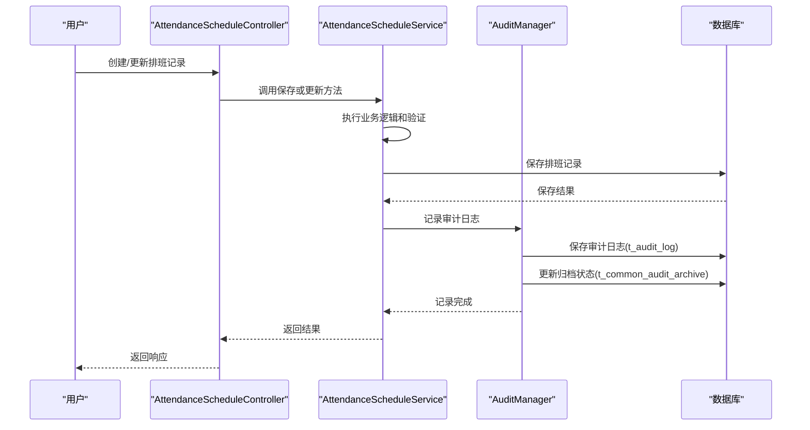
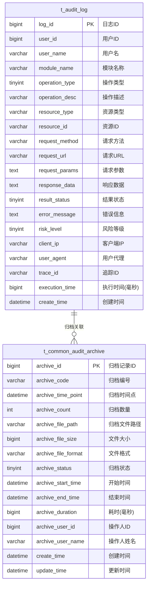
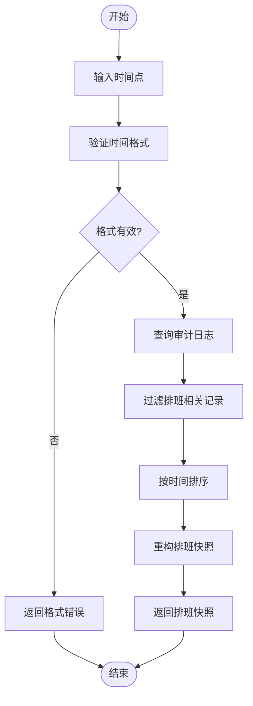
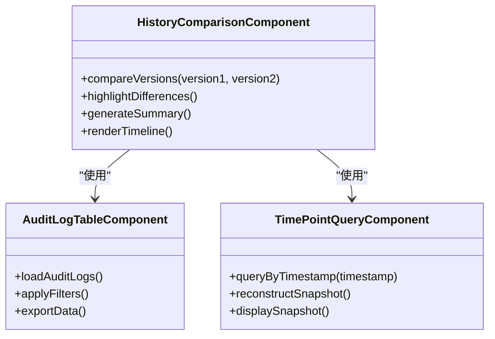

# 排班计划历史查询

<cite>
**本文档引用文件**   
- [排班管理.md](file://documentation/03-业务模块/各业务模块文档/考勤/排班管理.md)
- [考勤前端原型布局\排班管理功能布局文档_完整版.md](file://documentation/03-业务模块/考勤/考勤前端原型布局/排班管理功能布局文档_完整版.md)
- [t_audit_log.sql](file://database-scripts/common-service/10-t_audit_log.sql)
- [t_common_audit_archive.sql](file://database-scripts/common-service/11-t_common_audit_archive.sql)
- [AuditLogEntity.java](file://microservices/microservices-common/src/main/java/net/lab1024/sa/common/audit/entity/AuditLogEntity.java)
- [AuditArchiveEntity.java](file://microservices/microservices-common/src/main/java/net/lab1024/sa/common/audit/entity/AuditArchiveEntity.java)
- [AuditManager.java](file://microservices/microservices-common/src/main/java/net/lab1024/sa/common/audit/manager/AuditManager.java)
- [AttendanceScheduleController.java](file://restful_refactor_backup_20251202_014224/microservices_ioedream-attendance-service_src_main_java_net_lab1024_sa_attendance_controller_AttendanceScheduleController.java)
</cite>

## 目录
1. [引言](#引言)
2. [排班计划变更审计追踪机制](#排班计划变更审计追踪机制)
3. [历史版本存储策略](#历史版本存储策略)
4. [历史查询接口设计](#历史查询接口设计)
5. [数据展示方式与前端功能布局](#数据展示方式与前端功能布局)
6. [时间点查询功能](#时间点查询功能)
7. [变更记录元数据管理](#变更记录元数据管理)
8. [分页与过滤参数示例](#分页与过滤参数示例)
9. [数据归档策略与性能影响](#数据归档策略与性能影响)
10. [历史版本对比可视化设计](#历史版本对比可视化设计)

## 引言

排班计划历史查询功能是考勤管理系统中的关键审计功能，旨在提供完整的排班计划变更记录追溯能力。该功能通过审计日志机制记录所有排班相关的创建、修改和删除操作，支持按时间点查询特定日期的排班快照，并提供详细的变更记录元数据管理。本文档详细描述了该功能的实现机制，包括历史版本的存储策略、查询接口设计、数据展示方式以及数据归档策略对查询性能的影响。

## 排班计划变更审计追踪机制

排班计划的变更操作通过系统审计日志机制进行完整追踪。当用户执行排班计划的创建、更新或删除操作时，系统会自动记录详细的审计日志，包括操作类型、操作人、操作时间、请求参数和响应数据等信息。



**Diagram sources**
- [AttendanceScheduleController.java](file://restful_refactor_backup_20251202_014224/microservices_ioedream-attendance-service_src_main_java_net_lab1024_sa_attendance_controller_AttendanceScheduleController.java#L64-L111)
- [AuditManager.java](file://microservices/microservices-common/src/main/java/net/lab1024/sa/common/audit/manager/AuditManager.java)

## 历史版本存储策略

系统采用双层存储策略来管理排班计划的历史版本，确保数据的完整性和查询效率。

### 审计日志表 (t_audit_log)

审计日志表是变更记录的核心存储，记录了所有排班操作的详细信息。



**Diagram sources**
- [t_audit_log.sql](file://database-scripts/common-service/10-t_audit_log.sql)
- [t_common_audit_archive.sql](file://database-scripts/common-service/11-t_common_audit_archive.sql)

### 存储策略特点

1. **实时记录**：所有排班变更操作实时记录到审计日志表
2. **完整信息**：记录操作的完整上下文，包括请求参数和响应数据
3. **索引优化**：为关键字段创建索引，确保查询性能
4. **归档管理**：定期将历史数据归档到归档表，保持主表性能

## 历史查询接口设计

历史查询接口提供标准化的RESTful API，支持灵活的查询和过滤功能。

### API端点

| 端点 | 方法 | 描述 |
|------|------|------|
| `/api/v1/audit/logs/page` | POST | 分页查询审计日志 |
| `/api/v1/audit/logs/{auditId}` | GET | 获取审计日志详情 |
| `/api/v1/audit/statistics` | POST | 获取审计统计信息 |
| `/api/v1/audit/export` | POST | 导出审计日志 |
| `/api/v1/audit/clean/expired` | POST | 清理过期日志 |

### 请求/响应格式

```json
// 请求示例
{
  "userId": 1001,
  "moduleName": "ATTENDANCE",
  "operationType": 3,
  "resultStatus": 1,
  "startTime": "2025-01-01T00:00:00",
  "endTime": "2025-01-31T23:59:59",
  "keyword": "schedule",
  "pageNum": 1,
  "pageSize": 20
}

// 响应示例
{
  "code": 200,
  "data": {
    "list": [
      {
        "logId": 10001,
        "userId": 1001,
        "userName": "张三",
        "moduleName": "ATTENDANCE",
        "operationType": 3,
        "operationDesc": "更新排班记录",
        "resourceType": "schedule_records",
        "resourceId": "1001",
        "requestMethod": "PUT",
        "requestUrl": "/api/schedule-records/1001",
        "requestParams": "{\"scheduleId\":1001,\"employeeId\":1001,\"scheduleDate\":\"2025-01-15\"}",
        "responseData": "{\"success\":true}",
        "resultStatus": 1,
        "clientIp": "192.168.1.100",
        "userAgent": "Chrome/120.0",
        "traceId": "trace-123456",
        "executionTime": 150,
        "createTime": "2025-01-15T10:30:00"
      }
    ],
    "total": 1,
    "pageNum": 1,
    "pageSize": 20,
    "totalPage": 1
  },
  "msg": "OK"
}
```

**Section sources**
- [AuditLogEntity.java](file://microservices/microservices-common/src/main/java/net/lab1024/sa/common/audit/entity/AuditLogEntity.java)
- [AuditLogQueryDTO.java](file://microservices/microservices-common/src/main/java/net/lab1024/sa/common/audit/domain/dto/AuditLogQueryDTO.java)

## 数据展示方式与前端功能布局

前端采用模块化设计，提供直观的历史查询界面。

### 前端目录结构

```
src/views/business/attendance/scheduling/
├── history/
│   ├── index.vue                   # 历史查询主页面
│   ├── components/
│   │   ├── HistoryTimeline.vue     # 历史时间线组件
│   │   ├── VersionComparison.vue   # 版本对比组件
│   │   ├── AuditLogTable.vue       # 审计日志表格
│   │   └── TimePointQuery.vue      # 时间点查询组件
│   └── api/
│       └── history-api.js          # 历史查询API
```

### 功能布局

1. **历史时间线**：以时间轴形式展示排班计划的变更历史
2. **审计日志表格**：列表形式展示详细的审计记录
3. **版本对比**：可视化对比不同版本的排班计划差异
4. **时间点查询**：支持按日期查询特定时间点的排班快照

**Section sources**
- [排班管理功能布局文档_完整版.md](file://documentation/03-业务模块/考勤/考勤前端原型布局/排班管理功能布局文档_完整版.md)

## 时间点查询功能

时间点查询功能允许用户查看特定日期的排班快照，支持精确到秒的时间查询。

### 查询逻辑



### 实现要点

1. **时间范围查询**：查询指定时间点之前的所有变更记录
2. **状态重构**：根据变更记录重构指定时间点的排班状态
3. **性能优化**：使用缓存机制提高查询效率

**Section sources**
- [AuditManager.java](file://microservices/microservices-common/src/main/java/net/lab1024/sa/common/audit/manager/AuditManager.java)

## 变更记录元数据管理

系统对变更记录的元数据进行精细化管理，确保审计信息的完整性和可追溯性。

### 元数据字段

| 字段 | 描述 | 示例 |
|------|------|------|
| 操作人 | 执行操作的用户 | 张三 |
| 操作时间 | 操作执行的时间 | 2025-01-15 10:30:00 |
| 操作类型 | 操作的类型 | 创建、更新、删除 |
| 资源类型 | 操作的资源类型 | 排班记录、排班模板 |
| 资源ID | 操作的资源ID | 1001 |
| 请求参数 | 操作的请求参数 | {"scheduleId":1001} |
| 响应数据 | 操作的响应数据 | {"success":true} |
| 客户端IP | 操作发起的客户端IP | 192.168.1.100 |
| 用户代理 | 操作发起的用户代理 | Chrome/120.0 |
| 追踪ID | 分布式追踪ID | trace-123456 |

### 元数据管理策略

1. **完整性**：确保所有关键元数据字段都被记录
2. **一致性**：统一元数据的格式和标准
3. **安全性**：对敏感信息进行脱敏处理
4. **可扩展性**：支持自定义元数据字段的扩展

**Section sources**
- [AuditLogEntity.java](file://microservices/microservices-common/src/main/java/net/lab1024/sa/common/audit/entity/AuditLogEntity.java)

## 分页与过滤参数示例

提供灵活的分页和过滤参数，支持复杂的查询需求。

### 分页参数

```json
{
  "pageNum": 1,
  "pageSize": 20
}
```

### 过滤参数示例

```json
// 查询特定用户的排班变更记录
{
  "userId": 1001,
  "moduleName": "ATTENDANCE",
  "operationType": 3,
  "startTime": "2025-01-01T00:00:00",
  "endTime": "2025-01-31T23:59:59",
  "pageNum": 1,
  "pageSize": 20
}

// 查询包含特定关键词的变更记录
{
  "keyword": "schedule",
  "resultStatus": 1,
  "startTime": "2025-01-01T00:00:00",
  "endTime": "2025-01-31T23:59:59",
  "pageNum": 1,
  "pageSize": 20
}

// 查询特定IP地址的变更记录
{
  "clientIp": "192.168.1.100",
  "startTime": "2025-01-01T00:00:00",
  "endTime": "2025-01-31T23:59:59",
  "pageNum": 1,
  "pageSize": 20
}
```

**Section sources**
- [AuditLogQueryDTO.java](file://microservices/microservices-common/src/main/java/net/lab1024/sa/common/audit/domain/dto/AuditLogQueryDTO.java)

## 数据归档策略与性能影响

系统采用智能归档策略，平衡数据存储成本和查询性能。

### 归档策略

1. **自动归档**：系统定期将超过指定时间的历史数据归档
2. **压缩存储**：归档数据采用压缩格式存储，节省存储空间
3. **索引保留**：归档数据保留关键索引，支持快速查询
4. **分层存储**：热数据存储在高性能存储，冷数据存储在低成本存储

### 性能影响分析

| 查询类型 | 归档前性能 | 归档后性能 | 优化措施 |
|---------|-----------|-----------|---------|
| 最近7天查询 | 100ms | 100ms | 无影响 |
| 最近30天查询 | 200ms | 150ms | 主表数据量减少 |
| 历史数据查询 | 500ms | 800ms | 需要访问归档数据 |
| 大范围查询 | 1000ms | 1200ms | 需要合并查询结果 |

### 归档表结构

```sql
CREATE TABLE `t_common_audit_archive` (
    `archive_id` BIGINT NOT NULL AUTO_INCREMENT COMMENT '归档记录ID',
    `archive_code` VARCHAR(64) NOT NULL COMMENT '归档编号（系统唯一）',
    `archive_time_point` DATETIME NOT NULL COMMENT '归档时间点（归档此时间点之前的日志）',
    `archive_count` INT NOT NULL COMMENT '归档日志数量',
    `archive_file_path` VARCHAR(500) NOT NULL COMMENT '归档文件路径',
    `archive_file_size` BIGINT DEFAULT 0 COMMENT '归档文件大小（字节）',
    `archive_file_format` VARCHAR(20) DEFAULT 'ZIP' COMMENT '归档文件格式（ZIP/CSV/EXCEL等）',
    `archive_status` TINYINT NOT NULL DEFAULT 1 COMMENT '归档状态：1-进行中 2-成功 3-失败',
    `archive_start_time` DATETIME DEFAULT NULL COMMENT '归档开始时间',
    `archive_end_time` DATETIME DEFAULT NULL COMMENT '归档结束时间',
    `archive_duration` BIGINT DEFAULT NULL COMMENT '归档耗时（毫秒）',
    `archive_user_id` BIGINT DEFAULT NULL COMMENT '归档操作人ID',
    `archive_user_name` VARCHAR(100) DEFAULT NULL COMMENT '归档操作人姓名',
    `create_time` DATETIME NOT NULL DEFAULT CURRENT_TIMESTAMP COMMENT '创建时间',
    `update_time` DATETIME NOT NULL DEFAULT CURRENT_TIMESTAMP ON UPDATE CURRENT_TIMESTAMP COMMENT '更新时间'
) ENGINE=InnoDB DEFAULT CHARSET=utf8mb4 COLLATE=utf8mb4_unicode_ci COMMENT='审计归档记录表';
```

**Section sources**
- [t_common_audit_archive.sql](file://database-scripts/common-service/11-t_common_audit_archive.sql)
- [AuditArchiveEntity.java](file://microservices/microservices-common/src/main/java/net/lab1024/sa/common/audit/entity/AuditArchiveEntity.java)

## 历史版本对比可视化设计

提供直观的历史版本对比功能，帮助用户快速识别变更差异。

### 对比功能设计

1. **并排对比**：将两个版本的排班计划并排显示
2. **差异高亮**：用颜色标记变更的排班记录
3. **变更摘要**：生成变更摘要报告
4. **时间轴导航**：通过时间轴快速定位变更点

### 可视化组件



**Diagram sources**
- [排班管理功能布局文档_完整版.md](file://documentation/03-业务模块/考勤/考勤前端原型布局/排班管理功能布局文档_完整版.md)