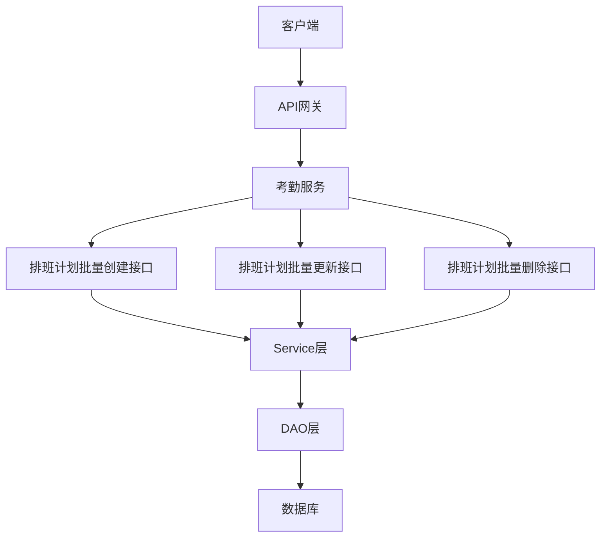
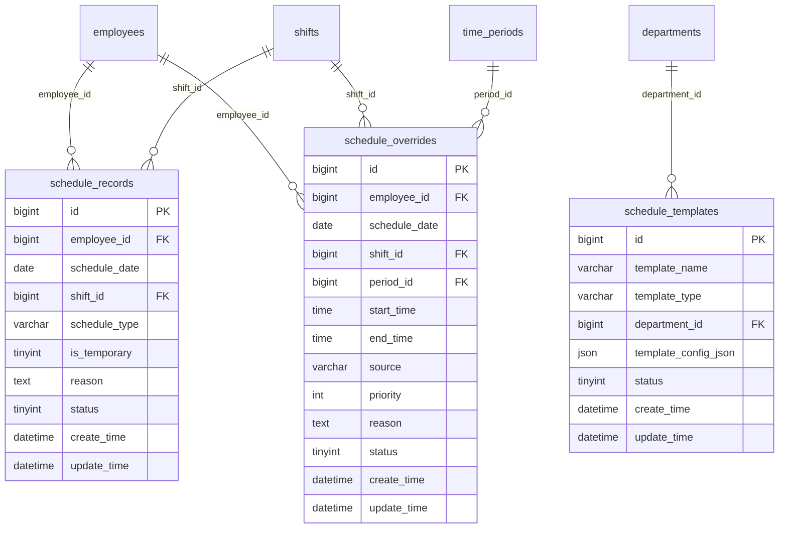
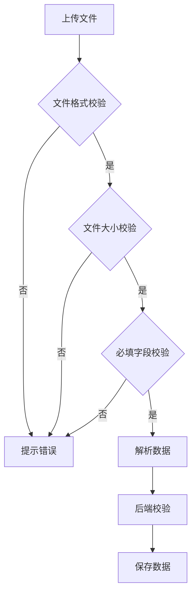
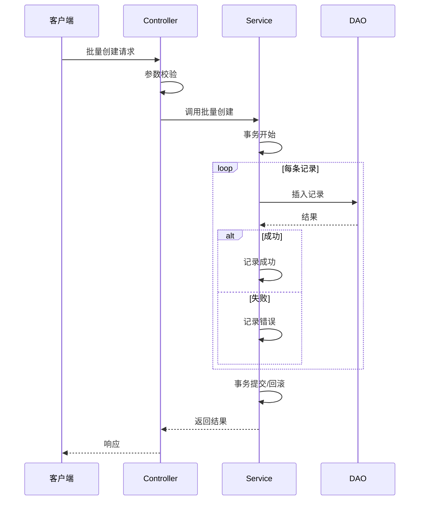
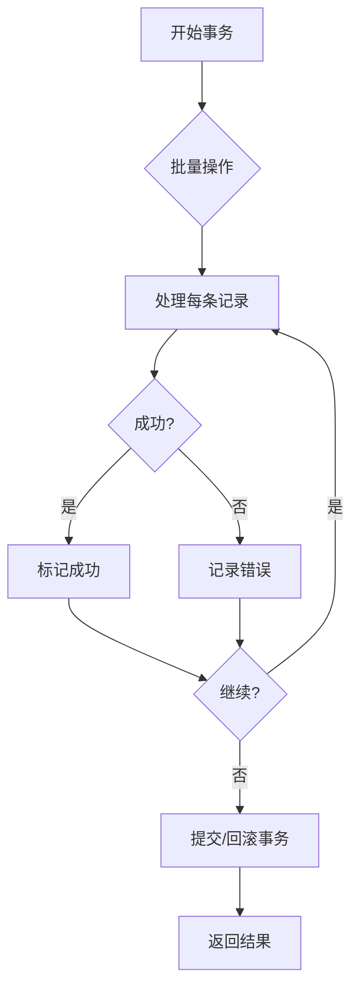
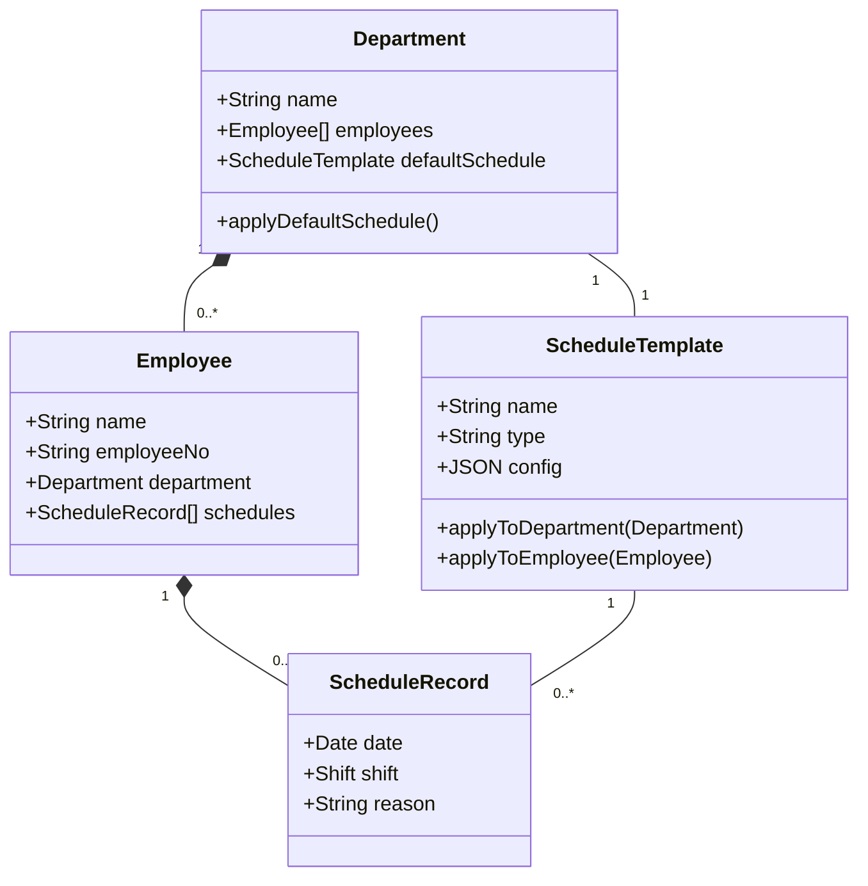
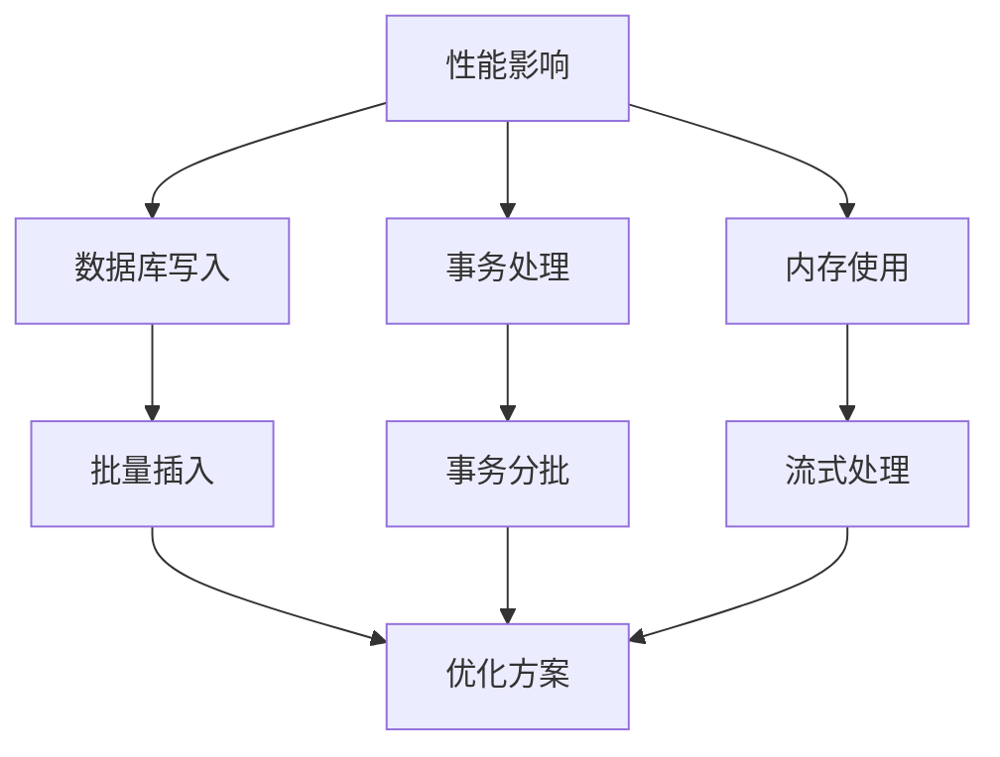
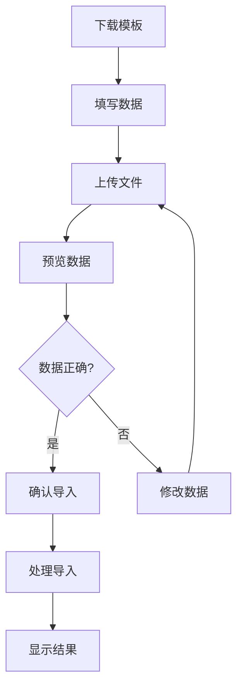

# 排班计划批量操作

<cite>
**本文档引用文件**   
- [AttendanceScheduleController.java](file://microservices/ioedream-attendance-service/src/main/java/net/lab1024/sa/attendance/controller/AttendanceScheduleController.java)
- [ShiftsController.java](file://restful_refactor_backup_20251202_014224/microservices_ioedream-attendance-service_src_main_java_net_lab1024_sa_attendance_controller_ShiftsController.java)
- [排班管理.md](file://documentation/03-业务模块/考勤/排班管理.md)
- [排班管理功能布局文档_完整版.md](file://documentation/03-业务模块/各业务模块文档/考勤/考勤前端原型布局/排班管理功能布局文档_完整版.md)
- [基础信息功能布局文档_完整版.md](file://documentation/03-业务模块/各业务模块文档/考勤/考勤前端原型布局/基础信息功能布局文档_完整版.md)
- [班次时间功能布局文档_完整版.md](file://documentation/03-业务模块/各业务模块文档/考勤/考勤前端原型布局/班次时间功能布局文档_完整版.md)
</cite>

## 目录
1. [简介](#简介)
2. [批量操作API接口设计](#批量操作api接口设计)
3. [批量导入模板格式要求](#批量导入模板格式要求)
4. [数据校验规则](#数据校验规则)
5. [错误处理机制](#错误处理机制)
6. [事务管理策略](#事务管理策略)
7. [部门继承默认排班计划](#部门继承默认排班计划)
8. [系统性能影响及优化方案](#系统性能影响及优化方案)
9. [用户交互流程](#用户交互流程)

## 简介
排班计划批量操作功能旨在为部门或全公司员工提供高效的批量创建、更新排班计划的能力。该功能通过API接口实现，支持批量导入导出，确保数据一致性，并提供完善的错误处理机制。本文档详细描述了该功能的设计与实现，包括API接口、数据校验、事务管理、性能优化等方面。

**Section sources**
- [排班管理.md](file://documentation/03-业务模块/考勤/排班管理.md#L1-L404)

## 批量操作API接口设计
排班计划批量操作提供了多个API接口，支持批量创建、更新和删除排班记录。这些接口遵循RESTful规范，使用统一的ResponseDTO格式返回结果。

**Diagram sources**
- [AttendanceScheduleController.java](file://microservices/ioedream-attendance-service/src/main/java/net/lab1024/sa/attendance/controller/AttendanceScheduleController.java#L1-L53)
- [排班管理.md](file://documentation/03-业务模块/考勤/排班管理.md#L280-L336)

**Section sources**
- [AttendanceScheduleController.java](file://microservices/ioedream-attendance-service/src/main/java/net/lab1024/sa/attendance/controller/AttendanceScheduleController.java#L1-L53)
- [排班管理.md](file://documentation/03-业务模块/考勤/排班管理.md#L280-L336)

## 批量导入模板格式要求
批量导入功能使用Excel模板，支持xlsx和xls格式。模板包含以下列：姓名、工号、部门、岗位、手机号、邮箱、入职时间。文件大小限制为10MB，单次最多导入1000条记录。

**Diagram sources**
- [排班管理.md](file://documentation/03-业务模块/考勤/排班管理.md#L125-L173)

**Section sources**
- [基础信息功能布局文档_完整版.md](file://documentation/03-业务模块/各业务模块文档/考勤/考勤前端原型布局/基础信息功能布局文档_完整版.md#L1084-L1361)

## 数据校验规则
批量操作的数据校验分为前端校验和后端校验。前端校验包括文件格式、大小和必填字段验证；后端校验包括数据完整性、业务规则和冲突检测。

**Diagram sources**
- [基础信息功能布局文档_完整版.md](file://documentation/03-业务模块/各业务模块文档/考勤/考勤前端原型布局/基础信息功能布局文档_完整版.md#L1174-L1285)

**Section sources**
- [基础信息功能布局文档_完整版.md](file://documentation/03-业务模块/各业务模块文档/考勤/考勤前端原型布局/基础信息功能布局文档_完整版.md#L1174-L1285)

## 错误处理机制
批量操作的错误处理机制包括预校验、部分失败处理和错误日志记录。当批量操作中部分数据失败时，系统会继续处理其他数据，并返回详细的错误信息。

**Diagram sources**
- [AttendanceScheduleController.java](file://microservices/ioedream-attendance-service/src/main/java/net/lab1024/sa/attendance/controller/AttendanceScheduleController.java#L1-L53)
- [ShiftsController.java](file://restful_refactor_backup_20251202_014224/microservices_ioedream-attendance-service_src_main_java_net_lab1024_sa_attendance_controller_ShiftsController.java#L310-L334)

**Section sources**
- [AttendanceScheduleController.java](file://microservices/ioedream-attendance-service/src/main/java/net/lab1024/sa/attendance/controller/AttendanceScheduleController.java#L1-L53)
- [ShiftsController.java](file://restful_refactor_backup_20251202_014224/microservices_ioedream-attendance-service_src_main_java_net_lab1024_sa_attendance_controller_ShiftsController.java#L310-L334)

## 事务管理策略
批量操作采用事务管理策略，确保数据一致性。当部分操作失败时，系统会根据配置决定是否回滚整个事务或仅回滚失败的部分。

**Diagram sources**
- [AttendanceScheduleController.java](file://microservices/ioedream-attendance-service/src/main/java/net/lab1024/sa/attendance/controller/AttendanceScheduleController.java#L1-L53)
- [ShiftsController.java](file://restful_refactor_backup_20251202_014224/microservices_ioedream-attendance-service_src_main_java_net_lab1024_sa_attendance_controller_ShiftsController.java#L310-L334)

**Section sources**
- [AttendanceScheduleController.java](file://microservices/ioedream-attendance-service/src/main/java/net/lab1024/sa/attendance/controller/AttendanceScheduleController.java#L1-L53)
- [ShiftsController.java](file://restful_refactor_backup_20251202_014224/microservices_ioedream-attendance-service_src_main_java_net_lab1024_sa_attendance_controller_ShiftsController.java#L310-L334)

## 部门继承默认排班计划
部门可以继承默认排班计划，新员工加入部门时自动应用默认排班。此功能通过排班模板实现，支持部门、岗位和个人三种模板类型。

**Diagram sources**
- [排班管理.md](file://documentation/03-业务模块/考勤/排班管理.md#L208-L245)
- [班次时间功能布局文档_完整版.md](file://documentation/03-业务模块/各业务模块文档/考勤/考勤前端原型布局/班次时间功能布局文档_完整版.md#L808-L1357)

**Section sources**
- [排班管理.md](file://documentation/03-业务模块/考勤/排班管理.md#L208-L245)
- [班次时间功能布局文档_完整版.md](file://documentation/03-业务模块/各业务模块文档/考勤/考勤前端原型布局/班次时间功能布局文档_完整版.md#L808-L1357)

## 系统性能影响及优化方案
批量操作对系统性能有一定影响，主要体现在数据库写入和事务处理上。优化方案包括批量插入、索引优化和异步处理。

**Diagram sources**
- [排班管理.md](file://documentation/03-业务模块/考勤/排班管理.md#L388-L392)

**Section sources**
- [排班管理.md](file://documentation/03-业务模块/考勤/排班管理.md#L388-L392)

## 用户交互流程
用户通过前端界面进行批量操作，包括下载模板、上传文件、预览数据和确认导入。系统提供实时反馈和错误提示，确保操作的准确性和可靠性。

**Diagram sources**
- [基础信息功能布局文档_完整版.md](file://documentation/03-业务模块/各业务模块文档/考勤/考勤前端原型布局/基础信息功能布局文档_完整版.md#L1084-L1361)
- [排班管理功能布局文档_完整版.md](file://documentation/03-业务模块/各业务模块文档/考勤/考勤前端原型布局/排班管理功能布局文档_完整版.md#L76-L128)

**Section sources**
- [基础信息功能布局文档_完整版.md](file://documentation/03-业务模块/各业务模块文档/考勤/考勤前端原型布局/基础信息功能布局文档_完整版.md#L1084-L1361)
- [排班管理功能布局文档_完整版.md](file://documentation/03-业务模块/各业务模块文档/考勤/考勤前端原型布局/排班管理功能布局文档_完整版.md#L76-L128)