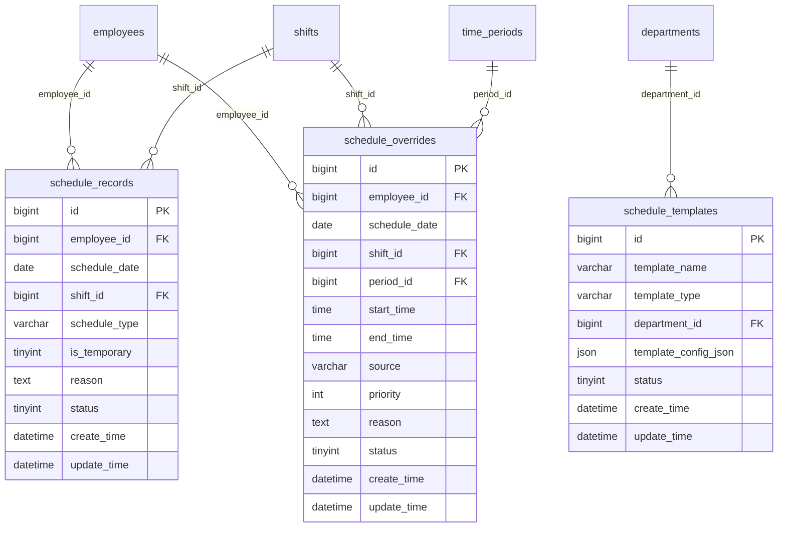
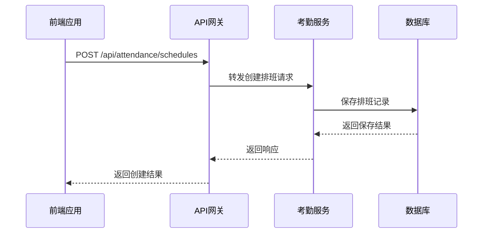
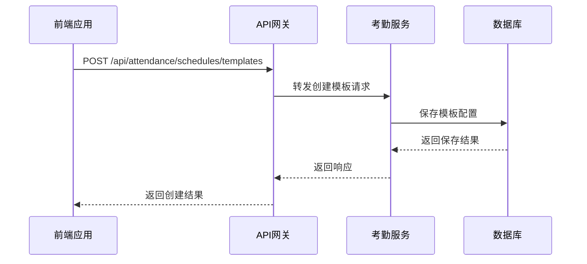
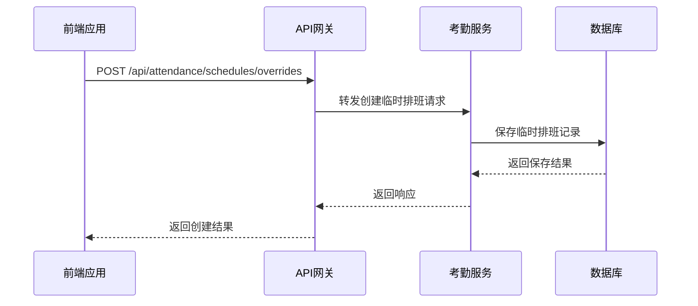
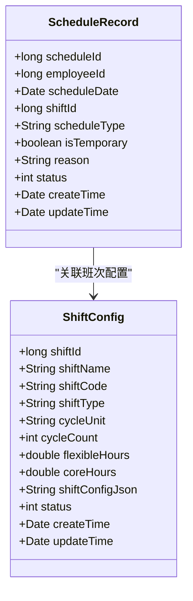
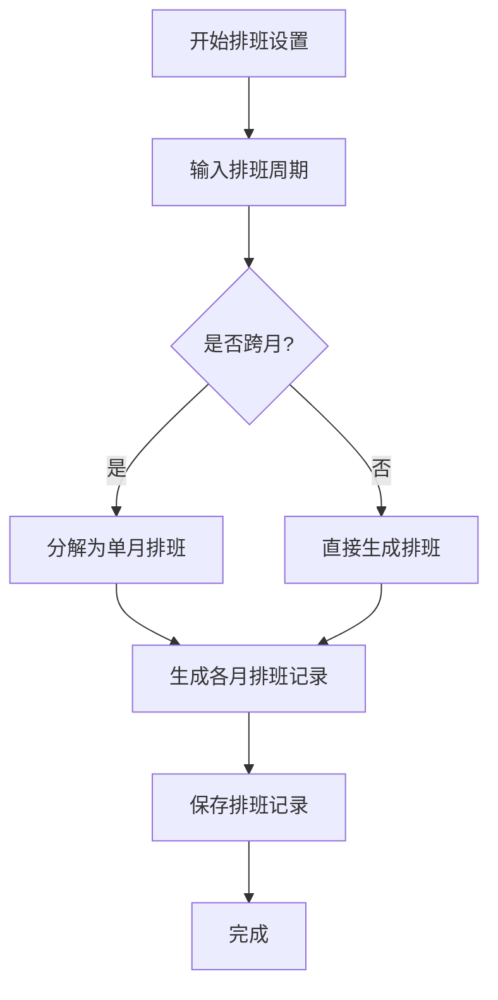
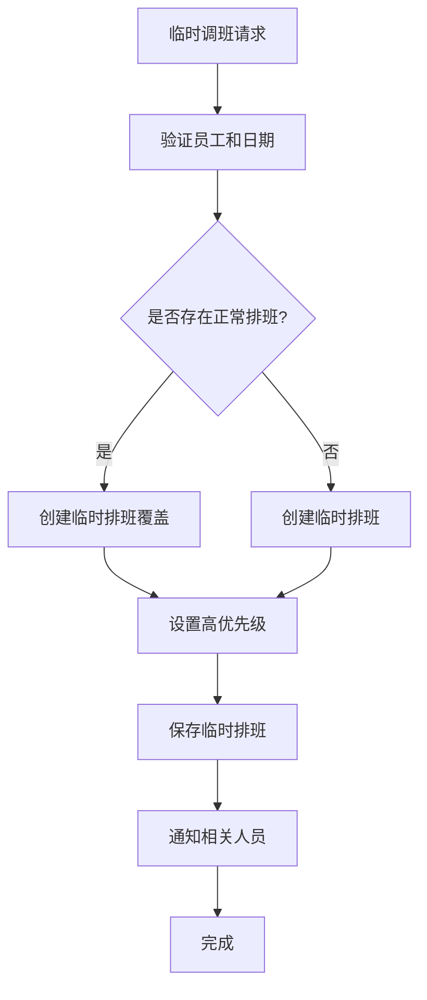
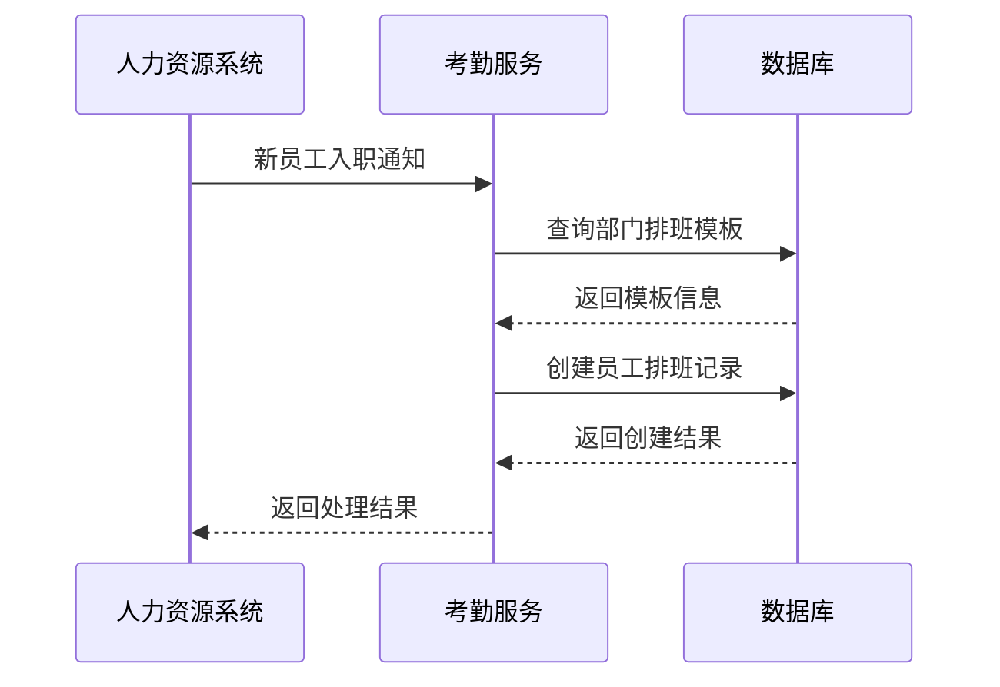
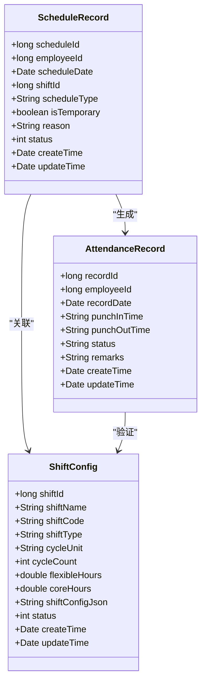
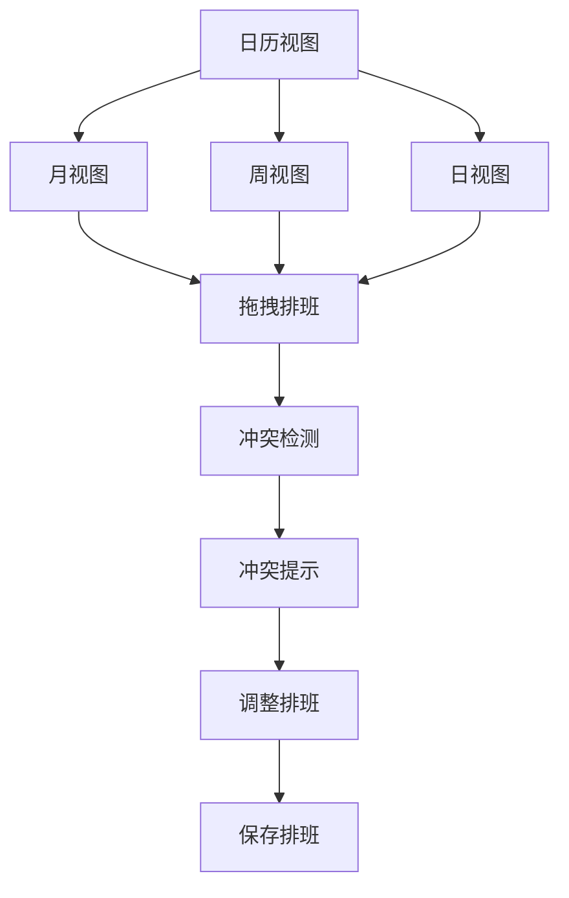

# 排班计划管理

<cite>
**本文档引用的文件**   
- [排班管理.md](file://documentation\03-业务模块\各业务模块文档\考勤\排班管理.md)
- [考勤前端原型布局\排班管理功能布局文档_完整版.md](file://documentation\03-业务模块\考勤\考勤前端原型布局\排班管理功能布局文档_完整版.md)
- [AttendanceScheduleController.java](file://restful_refactor_backup_20251202_014224\microservices_ioedream-attendance-service_src_main_java_net_lab1024_sa_attendance_controller_AttendanceScheduleController.java)
- [ShiftsController.java](file://restful_refactor_backup_20251202_014224\microservices_ioedream-attendance-service_src_main_java_net_lab1024_sa_attendance_controller_ShiftsController.java)
</cite>

## 目录
1. [简介](#简介)
2. [核心数据结构](#核心数据结构)
3. [排班计划API接口](#排班计划api接口)
4. [排班计划与班次配置关联](#排班计划与班次配置关联)
5. [特殊场景处理](#特殊场景处理)
6. [新员工排班计划继承](#新员工排班计划继承)
7. [排班计划与考勤记录关联](#排班计划与考勤记录关联)
8. [前端可视化展示](#前端可视化展示)

## 简介
排班计划管理功能是考勤系统的核心模块，负责管理员工的排班安排。该功能支持为单个员工、部门或全公司批量设置排班计划，提供灵活的排班策略和自动化排班能力。系统通过排班模板实现标准化排班配置，支持临时调班等特殊场景，并与考勤记录生成机制紧密关联，确保考勤数据的准确性和完整性。

**Section sources**
- [排班管理.md](file://documentation\03-业务模块\各业务模块文档\考勤\排班管理.md)

## 核心数据结构
排班计划管理功能涉及三个核心数据表：排班记录表、排班模板表和临时排班覆盖表。这些表通过员工、班次和部门等实体建立关联，形成完整的排班管理体系。

**Diagram sources**
- [排班管理.md](file://documentation\03-业务模块\各业务模块文档\考勤\排班管理.md)

**Section sources**
- [排班管理.md](file://documentation\03-业务模块\各业务模块文档\考勤\排班管理.md)

## 排班计划API接口
排班计划管理功能提供了一套完整的RESTful API接口，支持创建、查询、更新和删除排班计划。这些接口遵循统一的响应格式和权限控制机制，确保系统的安全性和一致性。

### 排班记录接口
排班记录接口用于管理单个员工的排班计划，支持基本的CRUD操作和批量操作。

**Diagram sources**
- [AttendanceScheduleController.java](file://restful_refactor_backup_20251202_014224\microservices_ioedream-attendance-service_src_main_java_net_lab1024_sa_attendance_controller_AttendanceScheduleController.java)

### 排班模板接口
排班模板接口用于管理排班模板，支持模板的创建、更新、应用和复制等操作。

**Diagram sources**
- [AttendanceScheduleController.java](file://restful_refactor_backup_20251202_014224\microservices_ioedream-attendance-service_src_main_java_net_lab1024_sa_attendance_controller_AttendanceScheduleController.java)

### 临时排班接口
临时排班接口用于处理临时调班等特殊场景，支持临时排班的创建、更新和删除。

**Diagram sources**
- [AttendanceScheduleController.java](file://restful_refactor_backup_20251202_014224\microservices_ioedream-attendance-service_src_main_java_net_lab1024_sa_attendance_controller_AttendanceScheduleController.java)

**Section sources**
- [AttendanceScheduleController.java](file://restful_refactor_backup_20251202_014224\microservices_ioedream-attendance-service_src_main_java_net_lab1024_sa_attendance_controller_AttendanceScheduleController.java)

## 排班计划与班次配置关联
排班计划与班次配置通过班次ID建立关联关系。每个排班记录都关联一个具体的班次配置，该配置定义了工作时间、休息时间、考勤规则等详细信息。

**Diagram sources**
- [ShiftsController.java](file://restful_refactor_backup_20251202_014224\microservices_ioedream-attendance-service_src_main_java_net_lab1024_sa_attendance_controller_ShiftsController.java)

**Section sources**
- [ShiftsController.java](file://restful_refactor_backup_20251202_014224\microservices_ioedream-attendance-service_src_main_java_net_lab1024_sa_attendance_controller_ShiftsController.java)

## 特殊场景处理
排班计划管理功能需要处理跨月排班、临时调班等特殊场景，确保排班计划的灵活性和准确性。

### 跨月排班处理
跨月排班通过将排班周期分解为多个单月排班计划来处理。系统会自动识别跨月情况，并生成相应的排班记录。

**Diagram sources**
- [排班管理.md](file://documentation\03-业务模块\各业务模块文档\考勤\排班管理.md)

### 临时调班处理
临时调班通过临时排班覆盖表实现，具有更高的优先级。当临时排班与正常排班冲突时，系统会优先采用临时排班。

**Diagram sources**
- [排班管理.md](file://documentation\03-业务模块\各业务模块文档\考勤\排班管理.md)

**Section sources**
- [排班管理.md](file://documentation\03-业务模块\各业务模块文档\考勤\排班管理.md)

## 新员工排班计划继承
新员工入职时，系统会自动继承其所在部门的排班计划。这一过程通过部门排班模板实现，确保新员工能够快速融入团队工作安排。

**Diagram sources**
- [排班管理.md](file://documentation\03-业务模块\各业务模块文档\考勤\排班管理.md)

**Section sources**
- [排班管理.md](file://documentation\03-业务模块\各业务模块文档\考勤\排班管理.md)

## 排班计划与考勤记录关联
排班计划与考勤记录生成机制紧密关联。系统根据排班计划生成考勤记录模板，并在考勤周期结束后进行数据核对和统计分析。

**Diagram sources**
- [排班管理.md](file://documentation\03-业务模块\各业务模块文档\考勤\排班管理.md)

**Section sources**
- [排班管理.md](file://documentation\03-业务模块\各业务模块文档\考勤\排班管理.md)

## 前端可视化展示
排班计划在前端通过日历视图进行可视化展示，支持月视图、周视图和日视图等多种展示方式。用户可以通过拖拽操作进行排班调整，并实时查看排班冲突。

**Diagram sources**
- [考勤前端原型布局\排班管理功能布局文档_完整版.md](file://documentation\03-业务模块\考勤\考勤前端原型布局\排班管理功能布局文档_完整版.md)

**Section sources**
- [考勤前端原型布局\排班管理功能布局文档_完整版.md](file://documentation\03-业务模块\考勤\考勤前端原型布局\排班管理功能布局文档_完整版.md)