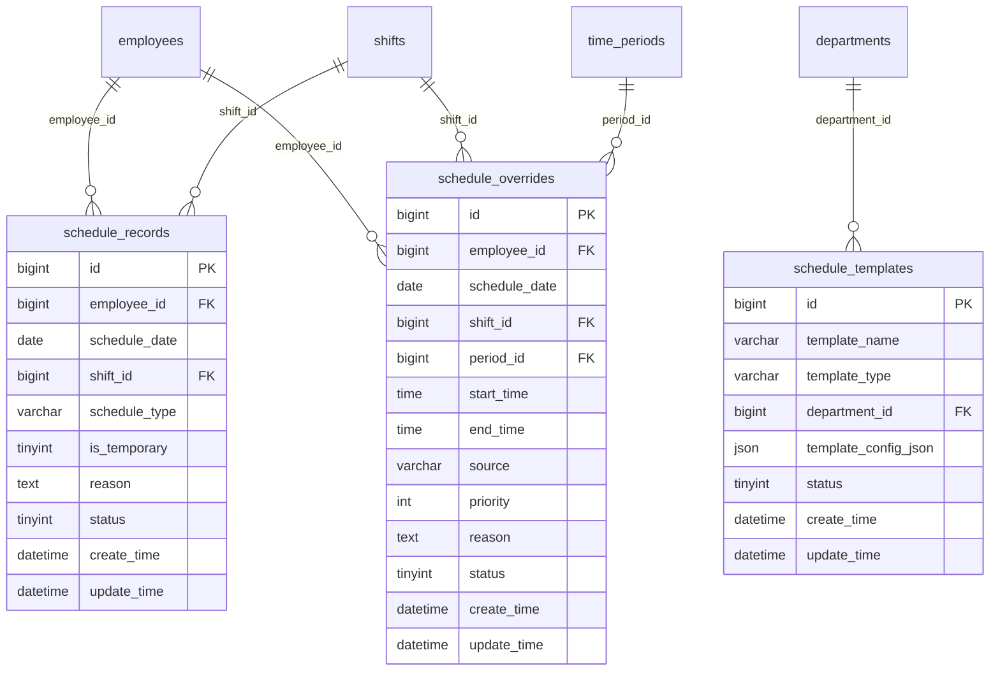
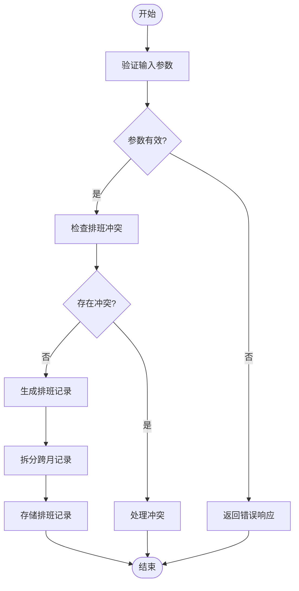
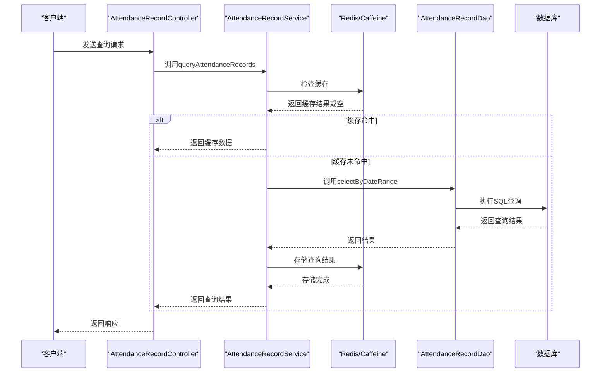
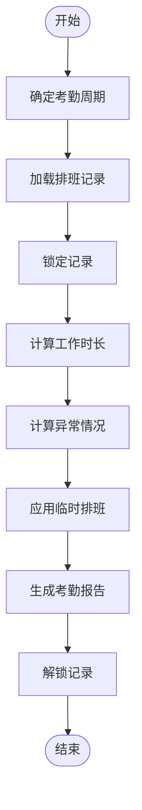
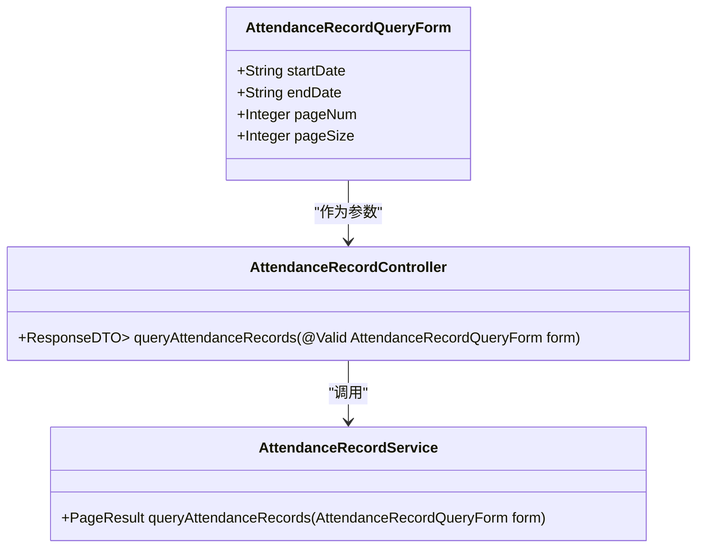
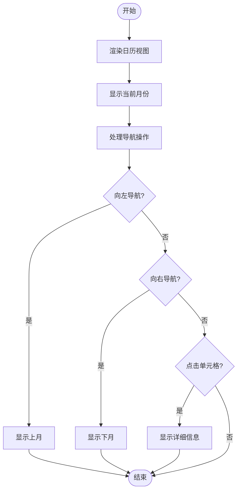

# 跨月排班处理

<cite>
**本文档引用文件**   
- [attendance-api-contract.md](file://documentation/api/attendance/attendance-api-contract.md)
- [AttendanceShiftController.java](file://microservices/ioedream-attendance-service/src/main/java/net/lab1024/sa/attendance/controller/AttendanceShiftController.java)
- [AttendanceShiftService.java](file://microservices/ioedream-attendance-service/src/main/java/net/lab1024/sa/attendance/service/AttendanceShiftService.java)
- [AttendanceShiftEntity.java](file://microservices/ioedream-attendance-service/src/main/java/net/lab1024/sa/attendance/domain/entity/AttendanceShiftEntity.java)
- [AttendanceShiftDao.java](file://microservices/ioedream-attendance-service/src/main/java/net/lab1024/sa/attendance/dao/AttendanceShiftDao.java)
- [AttendanceShiftServiceImpl.java](file://microservices/ioedream-attendance-service/src/main/java/net/lab1024/sa/attendance/service/impl/AttendanceShiftServiceImpl.java)
- [排班管理.md](file://documentation/03-业务模块/考勤/排班管理.md)
- [班次时间段管理.md](file://documentation/03-业务模块/考勤/班次时间段管理.md)
- [ShiftCalendar.vue](file://smart-admin-web-javascript/src/views/business/smart-video/components/ShiftCalendar.vue)
- [ScheduleCalendar.vue](file://documentation/03-业务模块/各业务模块文档/考勤/13-前端移动端组件设计.md)
- [AttendanceManager.java](file://microservices/microservices-common/src/main/java/net/lab1024/sa/common/attendance/manager/AttendanceManager.java)
</cite>

## 目录
1. [引言](#引言)
2. [跨月排班数据模型设计](#跨月排班数据模型设计)
3. [存储与查询方案](#存储与查询方案)
4. [日期边界处理逻辑](#日期边界处理逻辑)
5. [分页查询优化策略](#分页查询优化策略)
6. [考勤周期计算特殊处理](#考勤周期计算特殊处理)
7. [API接口日期范围参数处理](#api接口日期范围参数处理)
8. [日历视图渲染与用户体验](#日历视图渲染与用户体验)
9. [结论](#结论)

## 引言

跨月排班处理机制是考勤管理系统中的核心功能之一，旨在解决员工排班计划跨越自然月时的数据存储、查询和展示问题。本文档详细阐述了跨月排班的完整处理方案，包括数据模型设计、存储查询策略、日期边界处理、分页优化、考勤周期计算规则以及前端渲染方式。系统通过合理的数据结构设计和业务逻辑处理，确保了跨月排班数据的准确性和一致性，避免了重复计算或遗漏的问题。

## 跨月排班数据模型设计

跨月排班的数据模型设计基于考勤系统的四层架构规范，遵循企业级微服务架构的最佳实践。核心数据表包括排班记录表（schedule_records）、排班模板表（schedule_templates）和临时排班覆盖表（schedule_overrides），这些表通过外键关联，形成了完整的排班数据体系。



**图示来源**
- [排班管理.md](file://documentation/03-业务模块/考勤/排班管理.md#L125-L173)

**本节来源**
- [排班管理.md](file://documentation/03-业务模块/考勤/排班管理.md#L8-L114)

## 存储与查询方案

跨月排班的存储与查询方案采用分层架构设计，确保数据的一致性和高效性。在存储方面，系统通过`schedule_records`表记录每个员工的每日排班信息，`schedule_date`字段以日期类型存储，支持跨月数据的连续存储。查询时，系统通过`AttendanceRecordQueryForm`表单参数，结合`startDate`和`endDate`范围查询，实现跨月数据的高效检索。

```mermaid
classDiagram
class AttendanceRecordQueryForm {
+Long employeeId
+Long departmentId
+String startDate
+String endDate
+String status
+Integer pageNum
+Integer pageSize
}
class AttendanceRecordService {
+PageResult<AttendanceRecordVO> queryAttendanceRecords(AttendanceRecordQueryForm form)
+List<AttendanceRecordEntity> getRecordsByDateRange(LocalDate startDate, LocalDate endDate)
}
class AttendanceRecordDao {
+List<AttendanceRecordEntity> selectByDateRange(@Param("startDate") LocalDate startDate, @Param("endDate") LocalDate endDate)
}
AttendanceRecordQueryForm --> AttendanceRecordService : "作为参数"
AttendanceRecordService --> AttendanceRecordDao : "调用"
AttendanceRecordDao --> "schedule_records" : "数据访问"
```

**图示来源**
- [AttendanceRecordQueryForm.java](file://microservices/ioedream-attendance-service/src/main/java/net/lab1024/sa/attendance/domain/form/AttendanceRecordQueryForm.java)
- [AttendanceRecordService.java](file://microservices/ioedream-attendance-service/src/main/java/net/lab1024/sa/attendance/service/AttendanceRecordService.java)
- [AttendanceRecordDao.java](file://microservices/ioedream-attendance-service/src/main/java/net/lab1024/sa/attendance/dao/AttendanceRecordDao.java)

**本节来源**
- [attendance-api-contract.md](file://documentation/api/attendance/attendance-api-contract.md#L221-L230)
- [排班管理.md](file://documentation/03-业务模块/考勤/排班管理.md#L284-L295)

## 日期边界处理逻辑

跨月排班的日期边界处理逻辑是确保数据准确性的关键。系统在处理跨越自然月的排班计划时，采用`LocalDate`类型进行日期计算，避免了时区和时间戳的复杂性。当排班计划跨越月份时，系统会自动将排班记录拆分为多个连续的日期条目，分别存储在`schedule_records`表中。例如，一个从1月31日到2月2日的排班计划，会被拆分为1月31日、2月1日和2月2日三条独立的记录。

在查询时，系统通过`startDate`和`endDate`参数确定查询范围，确保跨月数据的完整性。同时，系统还实现了排班冲突检测机制，防止同一员工在同一时间被安排多个班次。冲突检测通过`AttendanceManager`类的`checkScheduleConflict`方法实现，该方法会检查指定日期范围内是否存在时间重叠的排班记录。



**图示来源**
- [AttendanceShiftServiceImpl.java](file://microservices/ioedream-attendance-service/src/main/java/net/lab1024/sa/attendance/service/impl/AttendanceShiftServiceImpl.java#L38-L87)
- [AttendanceManager.java](file://microservices/microservices-common/src/main/java/net/lab1024/sa/common/attendance/manager/AttendanceManager.java)

**本节来源**
- [排班管理.md](file://documentation/03-业务模块/考勤/排班管理.md#L182-L187)
- [班次时间段管理.md](file://documentation/03-业务模块/考勤/班次时间段管理.md#L182-L187)

## 分页查询优化策略

为提高跨月排班数据的查询性能，系统采用了多种分页查询优化策略。首先，系统在`AttendanceRecordQueryForm`中引入了`pageNum`和`pageSize`参数，支持分页查询，避免一次性加载大量数据。其次，系统在数据库层面为`schedule_records`表的`schedule_date`字段建立了索引，显著提升了按日期范围查询的效率。

此外，系统还实现了多级缓存机制，结合Redis和Caffeine缓存，减少数据库访问频率。当用户查询跨月排班数据时，系统首先检查缓存中是否存在对应的数据，如果存在则直接返回缓存结果，否则从数据库查询并将结果存入缓存。这种缓存策略不仅提高了查询速度，还降低了数据库的负载。



**图示来源**
- [AttendanceRecordController.java](file://microservices/ioedream-attendance-service/src/main/java/net/lab1024/sa/attendance/controller/AttendanceRecordController.java)
- [AttendanceRecordService.java](file://microservices/ioedream-attendance-service/src/main/java/net/lab1024/sa/attendance/service/AttendanceRecordService.java)
- [AttendanceRecordDao.java](file://microservices/ioedream-attendance-service/src/main/java/net/lab1024/sa/attendance/dao/AttendanceRecordDao.java)

**本节来源**
- [attendance-api-contract.md](file://documentation/api/attendance/attendance-api-contract.md#L173-L177)
- [排班管理.md](file://documentation/03-业务模块/考勤/排班管理.md#L388-L392)

## 考勤周期计算特殊处理

在考勤周期计算中，跨月排班的特殊处理规则至关重要。系统通过`AttendanceManager`类的`calculateAttendanceCycle`方法，实现了对跨月排班的精确计算。该方法首先确定考勤周期的起止日期，然后根据`schedule_records`表中的排班记录，计算每个员工在该周期内的工作时长、迟到早退次数等指标。

为了避免重复计算或遗漏，系统采用了基于日期范围的原子性计算策略。在计算过程中，系统会锁定指定日期范围内的所有排班记录，确保计算的完整性和一致性。同时，系统还支持对临时排班和正常排班的优先级处理，临时排班的优先级高于正常排班，确保了特殊情况下的考勤准确性。



**图示来源**
- [AttendanceManager.java](file://microservices/microservices-common/src/main/java/net/lab1024/sa/common/attendance/manager/AttendanceManager.java)
- [AttendanceRecordService.java](file://microservices/ioedream-attendance-service/src/main/java/net/lab1024/sa/attendance/service/AttendanceRecordService.java)

**本节来源**
- [排班管理.md](file://documentation/03-业务模块/考勤/排班管理.md#L276-L278)
- [班次时间段管理.md](file://documentation/03-业务模块/考勤/班次时间段管理.md#L271-L273)

## API接口日期范围参数处理

API接口的日期范围参数处理是跨月排班功能的核心。系统在`attendance-api-contract.md`中定义了统一的日期范围查询接口，支持`startDate`和`endDate`参数。这些参数以`yyyy-MM-dd`格式传递，确保了日期的标准化和可读性。在后端，系统通过`@Valid`注解对参数进行验证，确保输入的日期范围有效。



**图示来源**
- [attendance-api-contract.md](file://documentation/api/attendance/attendance-api-contract.md#L173-L177)
- [AttendanceRecordQueryForm.java](file://microservices/ioedream-attendance-service/src/main/java/net/lab1024/sa/attendance/domain/form/AttendanceRecordQueryForm.java)

**本节来源**
- [attendance-api-contract.md](file://documentation/api/attendance/attendance-api-contract.md#L173-L177)

## 日历视图渲染与用户体验

跨月排班在日历视图中的渲染方式直接影响用户体验。系统通过前端组件`ScheduleCalendar.vue`实现了日历视图的渲染，支持月视图、周视图和日视图的切换。在月视图中，系统以网格形式展示整月的排班情况，每个单元格代表一天，通过不同的颜色和图标标识不同的排班类型。

为了优化用户体验，系统实现了平滑的月份切换功能，用户可以通过左右箭头按钮或滑动操作切换月份。同时，系统还支持点击单元格查看详细的排班信息，包括班次名称、工作时间、加班信息等。在移动端，系统采用了响应式设计，确保在不同屏幕尺寸下的良好显示效果。



**图示来源**
- [ScheduleCalendar.vue](file://documentation/03-业务模块/各业务模块文档/考勤/13-前端移动端组件设计.md#L1476-L2261)
- [ShiftCalendar.vue](file://smart-admin-web-javascript/src/views/business/smart-video/components/ShiftCalendar.vue#L225-L275)

**本节来源**
- [ScheduleCalendar.vue](file://documentation/03-业务模块/各业务模块文档/考勤/13-前端移动端组件设计.md#L1476-L2261)
- [ShiftCalendar.vue](file://smart-admin-web-javascript/src/views/business/smart-video/components/ShiftCalendar.vue#L225-L275)

## 结论

跨月排班处理机制通过合理的数据模型设计、高效的存储查询方案、精确的日期边界处理、优化的分页策略、严谨的考勤周期计算规则以及友好的前端渲染方式，全面解决了员工排班计划跨越自然月时的各种挑战。系统不仅确保了数据的准确性和一致性，还提供了良好的用户体验，为企业的考勤管理提供了强有力的支持。