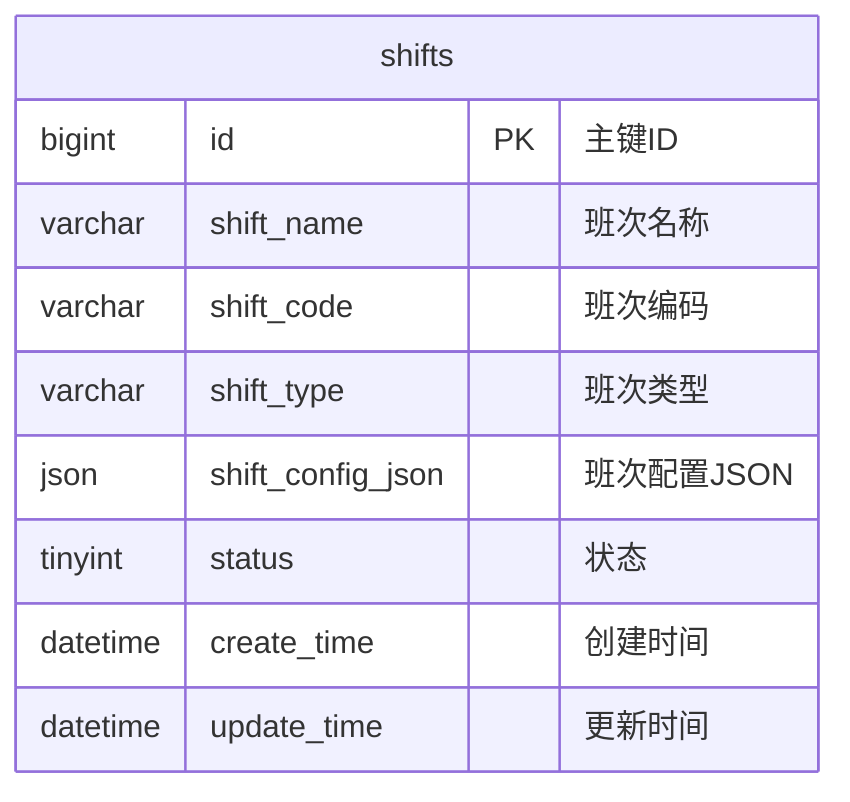

# 班次配置模型

<cite>
**本文档引用的文件**   
- [班次时间段管理.md](file://documentation\03-业务模块\考勤\班次时间段管理.md)
- [考勤系统数据库ER图设计.md](file://documentation\03-业务模块\考勤\考勤系统数据库ER图设计.md)
- [排班管理.md](file://documentation\03-业务模块\考勤\排班管理.md)
</cite>

## 目录
1. [引言](#引言)
2. [班次配置数据模型](#班次配置数据模型)
3. [ScheduleConfig类字段详解](#scheduleconfig类字段详解)
4. [班次类型与配置实现](#班次类型与配置实现)
5. [JSON配置示例](#json配置示例)
6. [数据库映射关系](#数据库映射关系)

## 引言
本文档旨在深入解析排班系统中的班次配置数据模型，特别是`ScheduleConfig`类的详细结构。文档将全面阐述班次名称、工作日设置、上下班时间、弹性打卡、迟到早退计算规则及休息时间等核心配置项的数据类型、约束条件和业务含义。通过结合排班管理功能，说明如何利用这些配置实现标准班次、弹性班次和特殊班次。同时，文档将提供具体的JSON示例，并阐明其与数据库表`t_schedule_config`的映射关系。

## 班次配置数据模型
班次配置是排班系统的核心，它定义了员工工作的具体时间规则。该模型通过一个结构化的JSON对象（`shift_config_json`）存储在数据库中，为排班、考勤计算和异常处理提供基础数据。

### 数据模型概述
班次配置模型主要包含以下核心部分：
- **班次模式 (shift_pattern)**: 定义班次的基本类型，如固定、轮班或弹性。
- **时间配置**: 包括上班时间、下班时间、核心工作时段和弹性工作时段。
- **休息规则 (break_times)**: 定义班次内的休息时间段。
- **高级规则**: 如是否支持跨天、最大连续工作天数等。

该模型通过`shifts`表的`shift_config_json`字段进行持久化存储，实现了配置的灵活性和可扩展性。

**Section sources**
- [班次时间段管理.md](file://documentation\03-业务模块\考勤\班次时间段管理.md#L161-L226)
- [考勤系统数据库ER图设计.md](file://documentation\03-业务模块\考勤\考勤系统数据库ER图设计.md#L572-L585)

## ScheduleConfig类字段详解
本节将深入解析`ScheduleConfig`类（或其对应的JSON结构）的每一个字段，包括其数据类型、约束条件和业务含义。

### 核心字段
| 字段名 | 数据类型 | 约束条件 | 业务含义 |
| :--- | :--- | :--- | :--- |
| `shift_pattern` | string | 枚举值：`fixed`, `rotating`, `flexible` | 班次模式，决定班次的基本行为。`fixed`表示固定班次，`rotating`表示轮班，`flexible`表示弹性班次。 |
| `shift_name` | string | 最大长度50字符，非空 | 班次的名称，用于在界面上标识和选择班次，如“标准班”、“夜班”。 |
| `workdays` | array of int | 元素为1-7的整数，表示周一至周日 | 定义该班次适用的工作日。例如，`[1,2,3,4,5]`表示周一到周五。 |
| `flexible_start_time` | string | 格式为`HH:mm` | 弹性班次的最早允许上班时间。员工在此时间之后打卡不视为迟到。 |
| `flexible_end_time` | string | 格式为`HH:mm` | 弹性班次的最晚允许下班时间。员工在此时间之前打卡不视为早退。 |
| `core_start_time` | string | 格式为`HH:mm` | 核心工作时间的开始时间。在此时间段内，要求员工必须在岗。 |
| `core_end_time` | string | 格式为`HH:mm` | 核心工作时间的结束时间。在此时间段内，要求员工必须在岗。 |
| `break_duration` | int | 大于0，单位为分钟 | 班次中总的休息时长。 |
| `cross_day_enabled` | boolean | - | 是否支持跨天班次。当为`true`时，下班时间可以早于上班时间（如下夜班）。 |

### 休息时间配置
`break_times`字段是一个对象数组，用于精确配置班次中的多个休息时间段。

| 子字段 | 数据类型 | 约束条件 | 业务含义 |
| :--- | :--- | :--- | :--- |
| `start` | string | 格式为`HH:mm` | 休息时间段的开始时间。 |
| `end` | string | 格式为`HH:mm` | 休息时间段的结束时间。 |

**示例**:
```json
"break_times": [
  {"start": "12:00", "end": "13:00"},
  {"start": "15:00", "end": "15:15"}
]
```
此配置表示班次包含两个休息时间：午休1小时和下午茶歇15分钟。

### 迟到早退计算规则
这些规则定义了如何根据打卡时间判断迟到和早退。

| 字段名 | 数据类型 | 约束条件 | 业务含义 |
| :--- | :--- | :--- | :--- |
| `late_threshold` | int | 大于等于0，单位为分钟 | 迟到计算的阈值。例如，设置为15分钟，表示上班时间后15分钟内打卡不计为迟到。 |
| `early_threshold` | int | 大于等于0，单位为分钟 | 早退计算的阈值。例如，设置为15分钟，表示下班时间前15分钟内打卡不计为早退。 |

### 高级配置
| 字段名 | 数据类型 | 约束条件 | 业务含义 |
| :--- | :--- | :--- | :--- |
| `rotation_sequence` | array of int | 元素为班次ID | 仅在`shift_pattern`为`rotating`时有效。定义轮班的顺序，数组中的ID按顺序循环。 |
| `rotation_cycle_days` | int | 大于0 | 仅在`shift_pattern`为`rotating`时有效。定义一个轮班周期的天数。 |
| `max_continuous_days` | int | 大于0 | 该班次允许的最大连续工作天数，用于合规性检查。 |
| `min_rest_days` | int | 大于等于0 | 该班次要求的最少休息天数，用于合规性检查。 |

**Section sources**
- [班次时间段管理.md](file://documentation\03-业务模块\考勤\班次时间段管理.md#L161-L226)

## 班次类型与配置实现
不同的班次类型通过配置`ScheduleConfig`的不同字段组合来实现。

### 标准班次
标准班次是最常见的固定班次，通常为朝九晚五。

**配置要点**:
- `shift_pattern`: `"fixed"`
- `flexible_start_time` 和 `flexible_end_time`: 与 `core_start_time` 和 `core_end_time` 相同或非常接近。
- `workdays`: `[1,2,3,4,5]` (周一至周五)。

### 弹性班次
弹性班次允许员工在一定的时间范围内自由选择上下班时间。

**配置要点**:
- `shift_pattern`: `"flexible"`
- `flexible_start_time`: 例如 `"08:00"`
- `flexible_end_time`: 例如 `"10:00"`
- `core_start_time`: 例如 `"10:00"`
- `core_end_time`: 例如 `"17:00"`
- `workdays`: `[1,2,3,4,5]`

此配置意味着员工可以在8:00到10:00之间任意时间上班，但必须在10:00前到岗，并在17:00后下班。

### 特殊班次
特殊班次包括夜班、三班倒等复杂班次。

**配置要点**:
- **夜班**: `cross_day_enabled` 设置为 `true`，且 `core_end_time` 小于 `core_start_time` (例如，`core_start_time: "22:00"`, `core_end_time: "06:00"`)。
- **轮班**: `shift_pattern` 设置为 `"rotating"`，并配置 `rotation_sequence` 和 `rotation_cycle_days`。

**Section sources**
- [班次时间段管理.md](file://documentation\03-业务模块\考勤\班次时间段管理.md#L161-L226)
- [排班管理.md](file://documentation\03-业务模块\考勤\排班管理.md#L115-L175)

## JSON配置示例
以下是不同班次类型的完整JSON配置示例。

### 标准班次示例
```json
{
  "shift_pattern": "fixed",
  "shift_name": "标准班",
  "workdays": [1, 2, 3, 4, 5],
  "flexible_start_time": "09:00",
  "flexible_end_time": "09:00",
  "core_start_time": "09:00",
  "core_end_time": "18:00",
  "break_duration": 60,
  "break_times": [
    {
      "start": "12:00",
      "end": "13:00"
    }
  ],
  "late_threshold": 15,
  "early_threshold": 15,
  "cross_day_enabled": false
}
```

### 弹性班次示例
```json
{
  "shift_pattern": "flexible",
  "shift_name": "弹性班",
  "workdays": [1, 2, 3, 4, 5],
  "flexible_start_time": "08:00",
  "flexible_end_time": "10:00",
  "core_start_time": "10:00",
  "core_end_time": "17:00",
  "break_duration": 60,
  "break_times": [
    {
      "start": "12:00",
      "end": "13:00"
    }
  ],
  "late_threshold": 0,
  "early_threshold": 0,
  "cross_day_enabled": false
}
```

### 轮班班次示例
```json
{
  "shift_pattern": "rotating",
  "shift_name": "三班倒",
  "workdays": [1, 2, 3, 4, 5, 6, 7],
  "rotation_sequence": [1, 2, 3],
  "rotation_cycle_days": 3,
  "flexible_start_time": "08:00",
  "flexible_end_time": "08:00",
  "core_start_time": "08:00",
  "core_end_time": "16:00",
  "break_duration": 60,
  "break_times": [
    {
      "start": "12:00",
      "end": "13:00"
    }
  ],
  "cross_day_enabled": false
}
```

### 夜班班次示例
```json
{
  "shift_pattern": "fixed",
  "shift_name": "夜班",
  "workdays": [1, 2, 3, 4, 5, 6, 7],
  "flexible_start_time": "22:00",
  "flexible_end_time": "22:00",
  "core_start_time": "22:00",
  "core_end_time": "06:00",
  "break_duration": 60,
  "break_times": [
    {
      "start": "00:00",
      "end": "01:00"
    }
  ],
  "cross_day_enabled": true
}
```

**Section sources**
- [班次时间段管理.md](file://documentation\03-业务模块\考勤\班次时间段管理.md#L161-L226)

## 数据库映射关系
班次配置数据模型在数据库中通过`shifts`表进行存储。

### 数据库表结构
`shifts` 表是存储班次信息的核心表。

| 字段名 | 数据类型 | 说明 |
| :--- | :--- | :--- |
| `id` | bigint | 主键ID |
| `shift_name` | varchar(100) | 班次名称 |
| `shift_code` | varchar(50) | 班次编码 |
| `shift_type` | varchar(50) | 班次类型 |
| `shift_config_json` | json | 班次配置JSON，包含本文档描述的所有规则 |
| `status` | tinyint | 状态（0-禁用，1-启用） |
| `create_time` | datetime | 创建时间 |
| `update_time` | datetime | 更新时间 |

### 映射关系
- `shifts`表中的`shift_name`字段直接对应配置中的`shift_name`。
- 所有复杂的配置规则（如上下班时间、休息时间、轮班规则等）都序列化为一个JSON对象，存储在`shift_config_json`字段中。
- 这种设计将固定字段和可变配置分离，既保证了核心信息的查询效率，又提供了极大的配置灵活性。



**Diagram sources**
- [考勤系统数据库ER图设计.md](file://documentation\03-业务模块\考勤\考勤系统数据库ER图设计.md#L572-L585)

**Section sources**
- [考勤系统数据库ER图设计.md](file://documentation\03-业务模块\考勤\考勤系统数据库ER图设计.md#L572-L585)