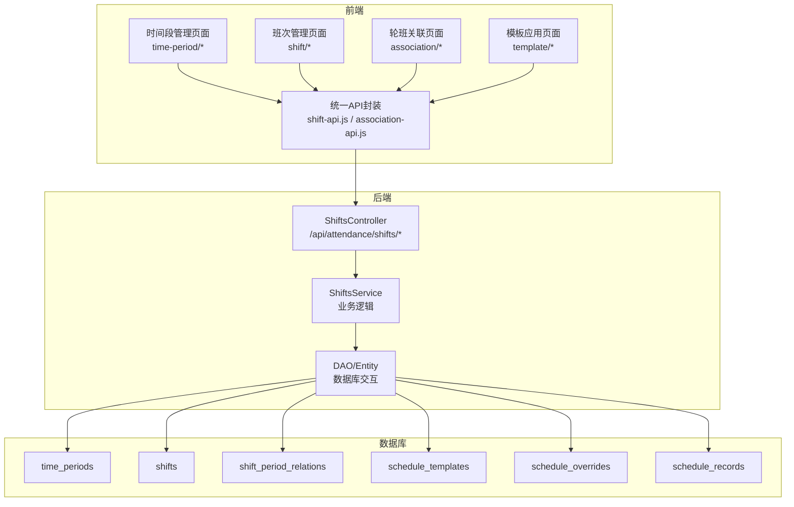
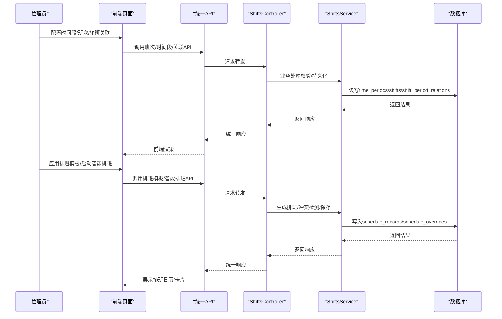
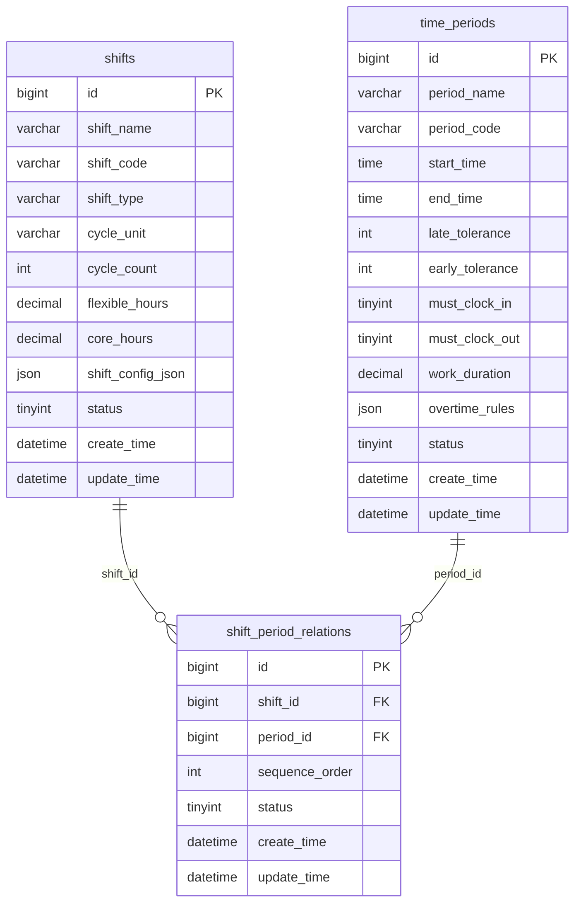
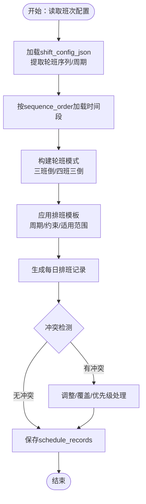
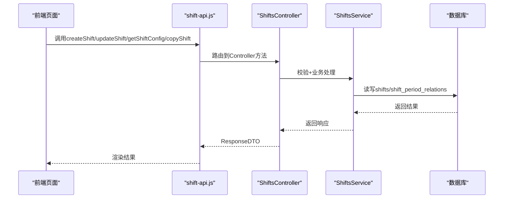
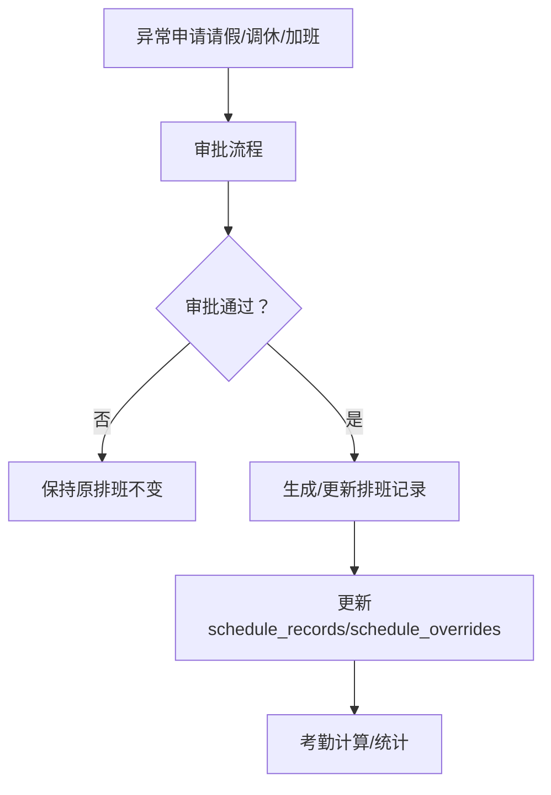
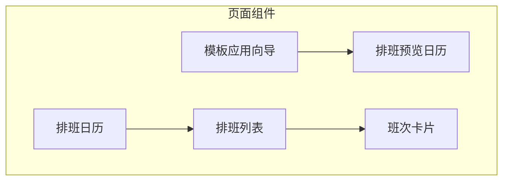
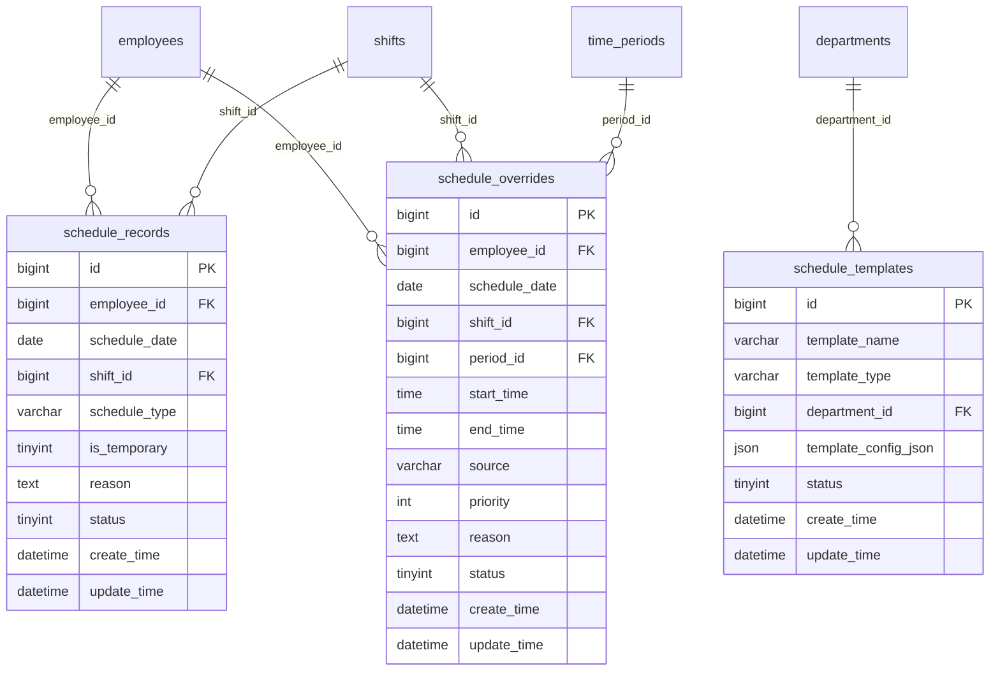

# 轮班规则配置

<cite>
**本文引用的文件**
- [班次时间段管理.md](file://documentation/03-业务模块/各业务模块文档/考勤/班次时间段管理.md)
- [排班管理.md](file://documentation/03-业务模块/各业务模块文档/考勤/排班管理.md)
- [班次时间功能布局文档_完整版.md](file://documentation/03-业务模块/考勤/考勤前端原型布局/班次时间功能布局文档_完整版.md)
- [排班管理.md](file://docs/各业务模块文档/考勤/排班管理.md)
- [异常管理.md](file://documentation/03-业务模块/各业务模块文档/考勤/异常管理.md)
- [ShiftsController.java](file://restful_refactor_backup_20251202_014224/microservices_ioedream-attendance-service_src_main_java_net_lab1024_sa_attendance_controller_ShiftsController.java)
</cite>

## 目录
1. [简介](#简介)
2. [项目结构](#项目结构)
3. [核心组件](#核心组件)
4. [架构总览](#架构总览)
5. [详细组件分析](#详细组件分析)
6. [依赖分析](#依赖分析)
7. [性能考量](#性能考量)
8. [故障排查指南](#故障排查指南)
9. [结论](#结论)
10. [附录](#附录)

## 简介
本文件面向“轮班规则配置与管理”的完整文档化目标，围绕三班倒、四班两倒等复杂轮班模式，系统阐述以下主题：
- 如何通过API配置轮班周期、班次顺序、交接班时间等关键参数；
- 轮班规则与班次配置的关联方式；
- 轮班过程中的异常处理（如请假、调休）；
- 配置一个月轮班计划的完整示例；
- 系统如何根据轮班规则自动生成每日排班安排；
- 结合前端布局文档，描述轮班计划的可视化呈现方式。

## 项目结构
围绕轮班规则与排班管理，本仓库的关键文档与接口分布在如下位置：
- 考勤模块文档：班次时间段管理、排班管理、异常管理、前端布局与API定义
- 后端控制器：ShiftsController 提供班次管理API入口
- 前端布局：时间管理、班次管理、轮班关联、模板应用等页面与API封装

图表来源
- [班次时间功能布局文档_完整版.md](file://documentation/03-业务模块/考勤/考勤前端原型布局/班次时间功能布局文档_完整版.md#L68-L125)
- [排班管理.md](file://docs/各业务模块文档/考勤/排班管理.md#L23-L109)
- [ShiftsController.java](file://restful_refactor_backup_20251202_014224/microservices_ioedream-attendance-service_src_main_java_net_lab1024_sa_attendance_controller_ShiftsController.java#L44-L120)

章节来源
- [班次时间功能布局文档_完整版.md](file://documentation/03-业务模块/考勤/考勤前端原型布局/班次时间功能布局文档_完整版.md#L68-L125)
- [排班管理.md](file://docs/各业务模块文档/考勤/排班管理.md#L23-L109)
- [ShiftsController.java](file://restful_refactor_backup_20251202_014224/microservices_ioedream-attendance-service_src_main_java_net_lab1024_sa_attendance_controller_ShiftsController.java#L44-L120)

## 核心组件
- 时间段（time_periods）：定义工作/休息/弹性/加班等时间段，含开始/结束时间、容忍度、打卡要求、加班规则等。
- 班次（shifts）：定义班次类型（规律/弹性/三班倒/四班三倒）、轮班周期单位与数量、弹性/核心工作时长、班次配置JSON等。
- 班次-时间段关联（shift_period_relations）：将多个时间段按顺序组合成复杂班次。
- 排班模板（schedule_templates）：定义周期、轮班规则、约束条件、适用员工等，支撑批量应用。
- 临时排班覆盖（schedule_overrides）：在特定日期覆盖某员工的排班，支持优先级与来源。
- 排班记录（schedule_records）：最终每日排班结果，关联员工、班次、日期、类型等。

章节来源
- [班次时间段管理.md](file://documentation/03-业务模块/各业务模块文档/考勤/班次时间段管理.md#L8-L115)
- [排班管理.md](file://docs/各业务模块文档/考勤/排班管理.md#L8-L109)

## 架构总览
轮班规则配置与排班生成的总体流程：
- 配置阶段：时间段与班次配置，建立班次-时间段关联；定义轮班周期与轮班序列（三班倒/四班三倒）。
- 应用阶段：通过排班模板或智能排班，按周期生成每日排班；临时排班覆盖优先级最高。
- 可视化阶段：前端以日历/列表/卡片等形式展示排班，支持预览与调整。

图表来源
- [班次时间功能布局文档_完整版.md](file://documentation/03-业务模块/考勤/考勤前端原型布局/班次时间功能布局文档_完整版.md#L68-L125)
- [排班管理.md](file://docs/各业务模块文档/考勤/排班管理.md#L218-L273)
- [ShiftsController.java](file://restful_refactor_backup_20251202_014224/microservices_ioedream-attendance-service_src_main_java_net_lab1024_sa_attendance_controller_ShiftsController.java#L44-L120)

## 详细组件分析

### 时间段与班次配置
- 时间段管理：支持工作/休息/弹性/加班等类型，配置开始/结束时间、容忍度、打卡要求、加班规则等。
- 班次管理：支持规律/弹性/三班倒/四班三倒等类型；配置轮班周期单位（天/周/月）与数量；核心/弹性工作时长；班次配置JSON。
- 班次-时间段关联：按顺序组合多个时间段，支持跨日配置。

图表来源
- [班次时间段管理.md](file://documentation/03-业务模块/各业务模块文档/考勤/班次时间段管理.md#L8-L115)

章节来源
- [班次时间段管理.md](file://documentation/03-业务模块/各业务模块文档/考勤/班次时间段管理.md#L8-L115)
- [班次时间段管理.md](file://documentation/03-业务模块/各业务模块文档/考勤/班次时间段管理.md#L161-L200)

### 轮班规则与班次配置的关联
- 轮班周期与序列：通过班次配置JSON中的轮班序列与周期天数，定义三班倒/四班三倒等模式。
- 时间段顺序：通过shift_period_relations的sequence_order，确保班次内时间段的先后顺序与跨日衔接。
- 轮班序列与周期：模板配置JSON中包含轮班规则（auto_rotation、rotation_frequency、fairness_factor），用于指导排班生成。

图表来源
- [班次时间段管理.md](file://documentation/03-业务模块/各业务模块文档/考勤/班次时间段管理.md#L178-L200)
- [排班管理.md](file://docs/各业务模块文档/考勤/排班管理.md#L142-L181)

章节来源
- [班次时间段管理.md](file://documentation/03-业务模块/各业务模块文档/考勤/班次时间段管理.md#L178-L200)
- [排班管理.md](file://docs/各业务模块文档/考勤/排班管理.md#L142-L181)

### API与控制器
- 班次管理API：提供创建/更新/删除/复制/配置查询等接口，由ShiftsController统一暴露。
- 前端API封装：统一在shift-api.js与association-api.js中定义，便于页面调用。

图表来源
- [班次时间功能布局文档_完整版.md](file://documentation/03-业务模块/考勤/考勤前端原型布局/班次时间功能布局文档_完整版.md#L68-L125)
- [ShiftsController.java](file://restful_refactor_backup_20251202_014224/microservices_ioedream-attendance-service_src_main_java_net_lab1024_sa_attendance_controller_ShiftsController.java#L44-L120)

章节来源
- [班次时间功能布局文档_完整版.md](file://documentation/03-业务模块/考勤/考勤前端原型布局/班次时间功能布局文档_完整版.md#L68-L125)
- [ShiftsController.java](file://restful_refactor_backup_20251202_014224/microservices_ioedream-attendance-service_src_main_java_net_lab1024_sa_attendance_controller_ShiftsController.java#L44-L120)

### 临时排班与异常处理
- 临时排班覆盖：schedule_overrides支持按日期覆盖整班或时间段，具备优先级与来源字段，可实时生效。
- 异常处理：异常申请（请假/调休/加班等）通过异常管理模块处理，审批通过后影响排班与考勤计算。

图表来源
- [排班管理.md](file://docs/各业务模块文档/考勤/排班管理.md#L38-L55)
- [异常管理.md](file://documentation/03-业务模块/各业务模块文档/考勤/异常管理.md#L31-L54)

章节来源
- [排班管理.md](file://docs/各业务模块文档/考勤/排班管理.md#L38-L55)
- [异常管理.md](file://documentation/03-业务模块/各业务模块文档/考勤/异常管理.md#L31-L54)

### 可视化呈现与交互
- 前端页面：提供月历视图、员工视图、班次视图、模板应用与预览、拖拽排班等能力。
- 模板应用：支持按部门/岗位/个人应用模板，配置应用范围、日期范围、覆盖规则、通知设置等。

图表来源
- [班次时间功能布局文档_完整版.md](file://documentation/03-业务模块/考勤/考勤前端原型布局/班次时间功能布局文档_完整版.md#L872-L1421)
- [排班管理.md](file://docs/各业务模块文档/考勤/排班管理.md#L274-L315)

章节来源
- [班次时间功能布局文档_完整版.md](file://documentation/03-业务模块/考勤/考勤前端原型布局/班次时间功能布局文档_完整版.md#L872-L1421)
- [排班管理.md](file://docs/各业务模块文档/考勤/排班管理.md#L274-L315)

## 依赖分析
- 模块间依赖：
  - 班次时间管理模块为排班管理模块提供基础数据（shifts、time_periods、shift_period_relations）。
  - 排班管理模块为异常管理模块提供排班依据（schedule_records、schedule_overrides）。
- 数据表依赖：
  - schedule_records 依赖 shifts、employees；
  - schedule_overrides 依赖 shifts、time_periods、employees；
  - schedule_templates 依赖 departments。

图表来源
- [排班管理.md](file://docs/各业务模块文档/考勤/排班管理.md#L8-L109)

章节来源
- [排班管理.md](file://docs/各业务模块文档/考勤/排班管理.md#L8-L109)

## 性能考量
- 班次配置缓存：对常用班次配置进行缓存，减少重复解析与计算。
- 批量操作：模板应用与批量排班采用分批处理，降低数据库压力。
- 日历渲染优化：前端采用虚拟滚动与懒加载，提升大范围排班展示性能。
- 冲突检测与轮班算法：在服务端进行离线计算与校验，避免前端过度计算。

[本节为通用指导，无需特定文件引用]

## 故障排查指南
- 班次配置验证失败：检查shift_config_json中的轮班序列、周期天数、核心/弹性时长是否一致且合法。
- 时间段冲突：通过shift_period_relations的sequence_order与时间段起止时间进行交叉校验。
- 临时排班优先级：确认schedule_overrides的priority与覆盖规则（不覆盖/仅空缺/全部覆盖）。
- 排班生成异常：核对排班模板的周期类型、轮班频率、约束条件与适用员工范围。
- 前端接口调用失败：检查API路径与权限，确认统一API封装与Controller映射正确。

章节来源
- [班次时间段管理.md](file://documentation/03-业务模块/各业务模块文档/考勤/班次时间段管理.md#L156-L160)
- [排班管理.md](file://docs/各业务模块文档/考勤/排班管理.md#L183-L204)
- [班次时间功能布局文档_完整版.md](file://documentation/03-业务模块/考勤/考勤前端原型布局/班次时间功能布局文档_完整版.md#L68-L125)

## 结论
本文件系统化梳理了轮班规则配置与排班管理的实现路径，明确了时间段与班次的配置方式、轮班序列与周期的设定、模板应用与临时覆盖的优先级处理，以及前端可视化呈现与交互流程。通过上述机制，系统能够稳定地生成并维护复杂的轮班计划，并在异常情况下（如请假、调休）进行有效处理与恢复。

[本节为总结，无需特定文件引用]

## 附录

### 三班倒/四班三倒配置要点
- 三班倒：通常按7天为周期，每天分为早/中/晚三个班次，轮换周期为7天。
- 四班三倒：通常每天三班，四班轮换，需明确轮换顺序与休息规则。
- 关键参数：轮班序列（班次ID数组）、轮班周期天数、跨日支持、最大连续工作天数、最少休息天数。

章节来源
- [班次时间段管理.md](file://documentation/03-业务模块/各业务模块文档/考勤/班次时间段管理.md#L178-L200)
- [排班管理.md](file://docs/各业务模块文档/考勤/排班管理.md#L142-L181)

### 一个月轮班计划配置示例（步骤说明）
- 步骤1：创建时间段
  - 定义标准工作时间段、午休时间段、夜班时间段等，设置开始/结束时间、容忍度、打卡要求、加班规则。
- 步骤2：创建班次
  - 选择班次类型（三班倒/四班三倒），配置轮班周期单位与数量、核心/弹性工作时长、班次配置JSON。
- 步骤3：建立班次-时间段关联
  - 按顺序将时间段加入班次，确保跨日与休息时间衔接正确。
- 步骤4：应用排班模板
  - 选择模板类型（部门/岗位/个人），设置周期类型、周期天数、轮班规则、约束条件、适用员工范围。
- 步骤5：生成与校验
  - 系统按模板生成每日排班，进行冲突检测与公平性校验，必要时人工干预。
- 步骤6：可视化与发布
  - 在前端日历/列表中查看排班，支持预览与导出，发布后生效。

章节来源
- [班次时间段管理.md](file://documentation/03-业务模块/各业务模块文档/考勤/班次时间段管理.md#L139-L160)
- [排班管理.md](file://docs/各业务模块文档/考勤/排班管理.md#L183-L204)
- [班次时间功能布局文档_完整版.md](file://documentation/03-业务模块/考勤/考勤前端原型布局/班次时间功能布局文档_完整版.md#L872-L1421)