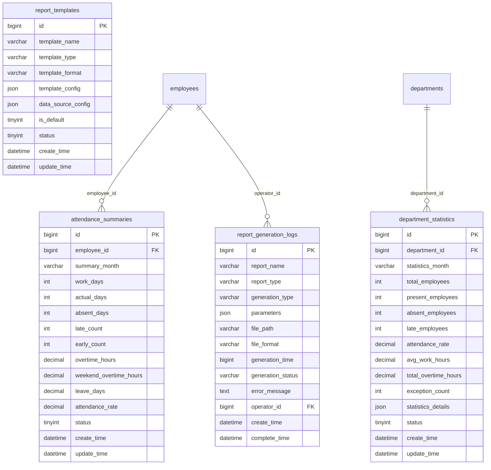
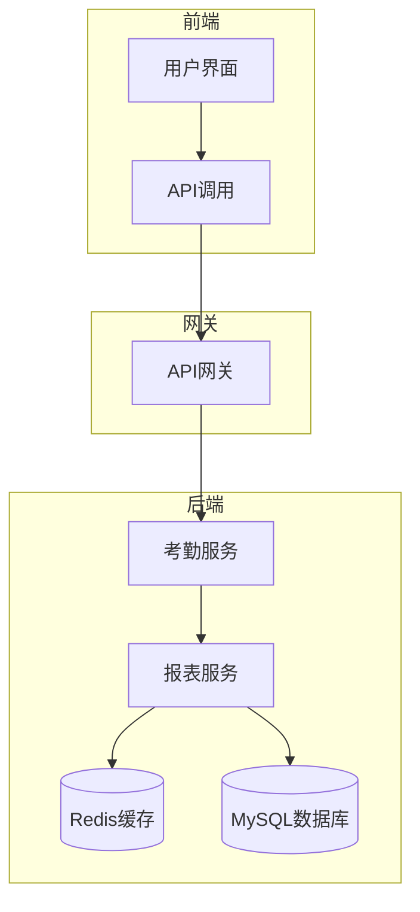
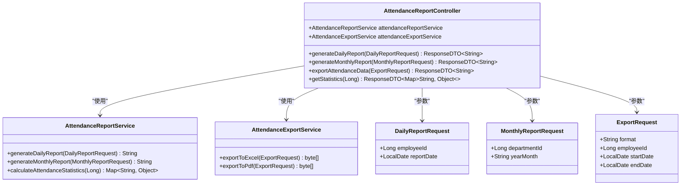
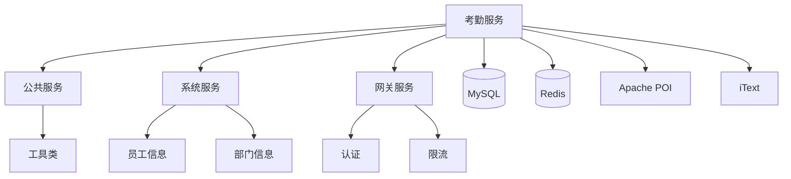

# 考勤报表API

<cite>
**本文档引用文件**   
- [AttendanceReportController.java](file://restful_refactor_backup_20251202_014224\microservices_ioedream-attendance-service_src_main_java_net_lab1024_sa_attendance_controller_AttendanceReportController.java)
- [考勤汇总报表.md](file://documentation\03-业务模块\考勤\考勤汇总报表.md)
- [考勤系统数据库ER图设计.md](file://documentation\03-业务模块\考勤\考勤系统数据库ER图设计.md)
- [考勤前端原型布局\汇总报表功能布局文档_完整版.md](file://documentation\03-业务模块\考勤\考勤前端原型布局\汇总报表功能布局文档_完整版.md)
- [考勤模块API接口文档.md](file://documentation\06-模板工具\API文档\考勤模块API接口文档.md)
- [12-前端API接口设计.md](file://documentation\03-业务模块\考勤\12-前端API接口设计.md)
</cite>

## 目录
1. [引言](#引言)
2. [项目结构](#项目结构)
3. [核心组件](#核心组件)
4. [架构概述](#架构概述)
5. [详细组件分析](#详细组件分析)
6. [依赖分析](#依赖分析)
7. [性能考虑](#性能考虑)
8. [故障排除指南](#故障排除指南)
9. [结论](#结论)
10. [附录](#附录)（如有）

## 引言
考勤报表API是考勤系统的核心功能模块，提供月度考勤汇总、异常考勤统计、出勤率分析等多维度报表功能。该API支持按部门、项目、时间段等多维度生成考勤报表，并提供与薪资系统等业务系统的集成能力。系统通过预计算和缓存策略确保报表生成的高效性，同时支持自定义报表模板和灵活的数据钻取分析。

## 项目结构
考勤报表功能主要位于`ioedream-attendance-service`微服务中，相关前端API定义在`smart-admin-web-javascript`项目中。后端控制器`AttendanceReportController`处理所有报表相关的API请求，数据存储在`attendance_summaries`、`department_statistics`等数据库表中。系统采用分层架构，包括控制器层、服务层和数据访问层，确保代码的可维护性和扩展性。

**图表来源**
- [考勤汇总报表.md](file://documentation\03-业务模块\考勤\考勤汇总报表.md#L1-L419)

**章节来源**
- [考勤汇总报表.md](file://documentation\03-业务模块\考勤\考勤汇总报表.md#L1-L419)
- [考勤系统数据库ER图设计.md](file://documentation\03-业务模块\考勤\考勤系统数据库ER图设计.md#L470-L596)

## 核心组件
考勤报表API的核心组件包括`AttendanceReportController`、`AttendanceReportService`和相关的数据模型。`AttendanceSummary`数据模型是报表系统的核心，包含应出勤天数、实际出勤天数、迟到次数、早退次数、加班时长、请假天数和出勤率等关键统计字段。系统通过预计算机制在每日凌晨生成前一日的考勤汇总数据，确保报表查询的高效性。

**章节来源**
- [考勤汇总报表.md](file://documentation\03-业务模块\考勤\考勤汇总报表.md#L1-L419)
- [AttendanceReportController.java](file://restful_refactor_backup_20251202_014224\microservices_ioedream-attendance-service_src_main_java_net_lab1024_sa_attendance_controller_AttendanceReportController.java#L1-L178)

## 架构概述
考勤报表系统采用微服务架构，`ioedream-attendance-service`负责处理所有考勤相关的业务逻辑。系统通过RESTful API提供服务，前端通过axios调用API获取报表数据。数据层使用MySQL存储考勤汇总数据，Redis缓存常用报表结果以提高性能。系统支持多种输出格式（PDF、Excel、HTML），并通过报表模板机制实现灵活的报表定制。

**图表来源**
- [考勤汇总报表.md](file://documentation\03-业务模块\考勤\考勤汇总报表.md#L1-L419)

## 详细组件分析

### 考勤报表控制器分析
`AttendanceReportController`是考勤报表模块的主要入口，提供生成日报、月报和导出数据的API接口。控制器使用Spring MVC注解定义RESTful端点，通过`@SaCheckLogin`和`@SaCheckPermission`注解实现安全认证和权限控制。所有API遵循统一的响应格式，返回`ResponseDTO`对象。

#### 类图

**图表来源**
- [AttendanceReportController.java](file://restful_refactor_backup_20251202_014224\microservices_ioedream-attendance-service_src_main_java_net_lab1024_sa_attendance_controller_AttendanceReportController.java#L1-L178)

**章节来源**
- [AttendanceReportController.java](file://restful_refactor_backup_20251202_014224\microservices_ioedream-attendance-service_src_main_java_net_lab1024_sa_attendance_controller_AttendanceReportController.java#L1-L178)

### 报表数据模型分析
`AttendanceSummary`数据模型是考勤报表系统的核心，存储员工的月度考勤汇总数据。该模型包含应出勤天数、实际出勤天数、迟到次数、早退次数、加班时长、请假天数和出勤率等关键字段。出勤率通过实际出勤天数除以应出勤天数计算得出，保留两位小数。

#### 数据模型表
| 字段名 | 数据类型 | 说明 |
|--------|----------|------|
| id | bigint | 主键ID |
| employee_id | bigint | 员工ID |
| summary_month | varchar | 汇总月份 |
| work_days | int | 应工作天数 |
| actual_days | int | 实际出勤天数 |
| absent_days | int | 旷工天数 |
| late_count | int | 迟到次数 |
| early_count | int | 早退次数 |
| overtime_hours | decimal | 加班时长(小时) |
| weekend_overtime_hours | decimal | 周末加班时长(小时) |
| leave_days | decimal | 请假天数 |
| attendance_rate | decimal | 出勤率 |
| status | tinyint | 状态 |
| create_time | datetime | 创建时间 |
| update_time | datetime | 更新时间 |

**章节来源**
- [考勤汇总报表.md](file://documentation\03-业务模块\考勤\考勤汇总报表.md#L8-L26)
- [考勤系统数据库ER图设计.md](file://documentation\03-业务模块\考勤\考勤系统数据库ER图设计.md#L507-L523)

### API接口分析
考勤报表API提供多种接口支持不同的报表需求。个人考勤汇总接口返回员工的考勤关键指标，部门考勤统计接口提供部门整体的考勤情况，异常考勤统计接口列出考勤异常记录。所有接口支持按时间段查询，并可导出为Excel或PDF格式。

#### API接口表
| 接口名称 | HTTP方法 | 路径 | 参数 | 说明 |
|---------|---------|------|------|------|
| 获取个人考勤汇总 | GET | /attendance/reports/personal/summary | userId, startDate, endDate | 获取个人考勤汇总数据 |
| 获取部门考勤统计 | GET | /attendance/reports/department/statistics | departmentId, startDate, endDate | 获取部门考勤统计 |
| 获取异常考勤统计 | GET | /attendance/reports/exceptions | startDate, endDate, type | 获取异常考勤统计 |
| 导出考勤报表 | POST | /attendance/reports/export | format, parameters | 导出考勤报表到指定格式 |
| 获取出勤率分析 | GET | /attendance/reports/attendance-rate | startDate, endDate, dimension | 获取出勤率分析数据 |

**章节来源**
- [考勤前端原型布局\汇总报表功能布局文档_完整版.md](file://documentation\03-业务模块\考勤\考勤前端原型布局\汇总报表功能布局文档_完整版.md#L72-L125)
- [考勤模块API接口文档.md](file://documentation\06-模板工具\API文档\考勤模块API接口文档.md#L754-L954)
- [12-前端API接口设计.md](file://documentation\03-业务模块\考勤\12-前端API接口设计.md#L754-L837)

## 依赖分析
考勤报表系统依赖多个微服务和外部组件。主要依赖包括`ioedream-common-service`提供基础工具类，`ioedream-system-service`提供员工和部门信息，`ioedream-gateway-service`提供API网关功能。数据存储依赖MySQL数据库和Redis缓存，报表导出功能依赖Apache POI和iText库。

**图表来源**
- [pom.xml](file://microservices\ioedream-attendance-service\pom.xml)

## 性能考虑
考勤报表系统采用多种策略优化性能。首先，通过每日凌晨的定时任务预计算考勤汇总数据，避免实时计算带来的性能压力。其次，使用Redis缓存常用报表结果，减少数据库查询次数。对于大数据量的报表导出，系统采用分页查询和流式输出，避免内存溢出。此外，数据库表建立了适当的索引，如`attendance_summaries`表的`employee_id`和`summary_month`复合索引，提高查询效率。

## 故障排除指南
当考勤报表出现数据不准确时，首先检查数据汇总任务是否正常执行。可通过查看`report_generation_logs`表确认最近的报表生成日志。如果报表导出失败，检查文件存储路径是否有写权限，并确认Apache POI或iText库版本兼容。对于缓存数据不一致问题，可通过调用缓存清理接口刷新数据。系统提供了详细的错误日志，记录在`logs`目录下，可根据时间戳和错误码定位问题。

**章节来源**
- [考勤汇总报表.md](file://documentation\03-业务模块\考勤\考勤汇总报表.md#L410-L419)
- [考勤模块API接口文档.md](file://documentation\06-模板工具\API文档\考勤模块API接口文档.md#L942-L954)

## 结论
考勤报表API提供了全面的考勤数据分析功能，支持月度考勤汇总、异常考勤统计和出勤率分析等多种报表类型。系统通过预计算和缓存策略确保高性能，同时提供灵活的API接口和报表模板机制。与薪资系统的集成通过标准API接口实现，确保数据的一致性和安全性。未来可考虑增加预测分析和智能预警功能，进一步提升系统的价值。

## 附录

### 数据计算逻辑
考勤报表的各项指标计算逻辑如下：
- **应出勤天数**: 根据员工的考勤规则和当月工作日计算得出
- **实际出勤天数**: 统计当月正常出勤的天数（不包括请假和旷工）
- **出勤率**: (实际出勤天数 / 应出勤天数) × 100%，保留一位小数
- **迟到次数**: 统计上班打卡时间超过规定时间的次数
- **早退次数**: 统计下班打卡时间早于规定时间的次数
- **加班时长**: 统计工作日下班后和周末的工作时长

### 缓存策略
系统采用多级缓存策略：
1. **Redis缓存**: 缓存常用报表结果，有效期24小时
2. **本地缓存**: 使用Caffeine缓存热点数据，如员工基本信息
3. **浏览器缓存**: 前端对静态资源进行缓存，减少网络请求

**章节来源**
- [考勤汇总报表.md](file://documentation\03-业务模块\考勤\考勤汇总报表.md#L410-L419)
- [考勤系统数据库ER图设计.md](file://documentation\03-业务模块\考勤\考勤系统数据库ER图设计.md#L470-L596)