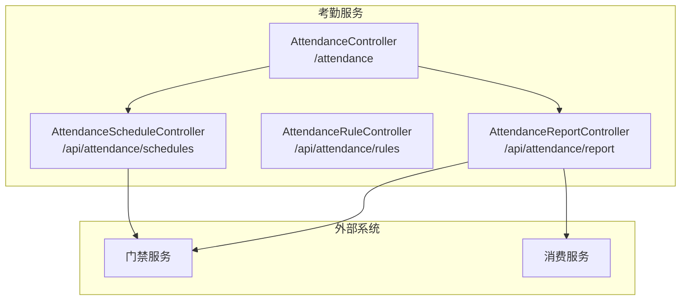
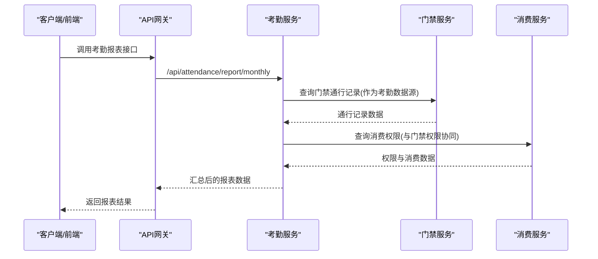
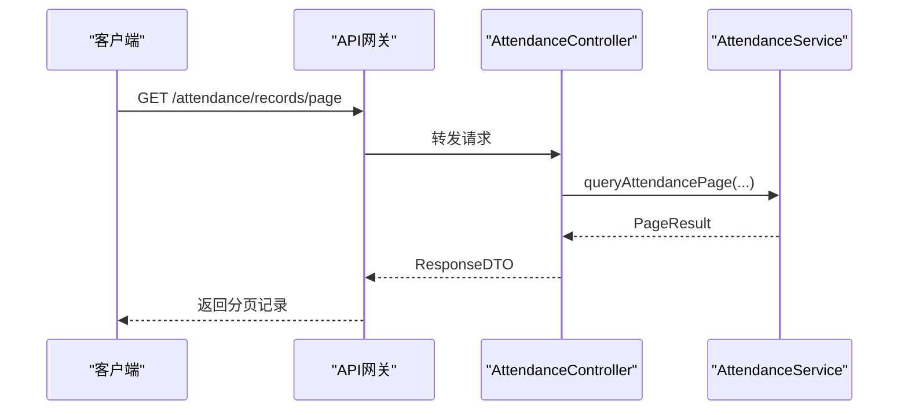
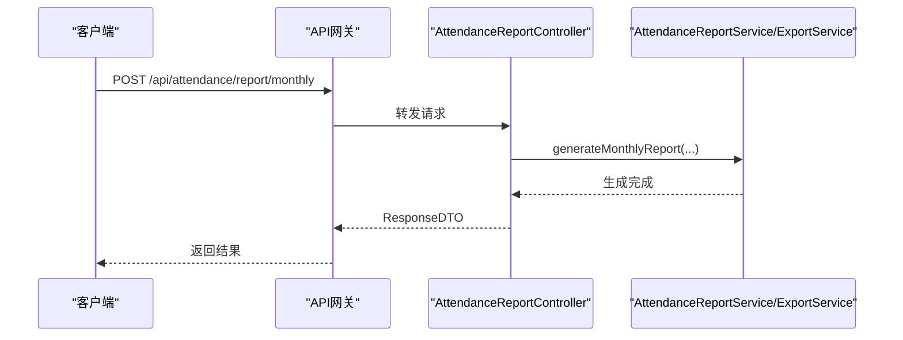
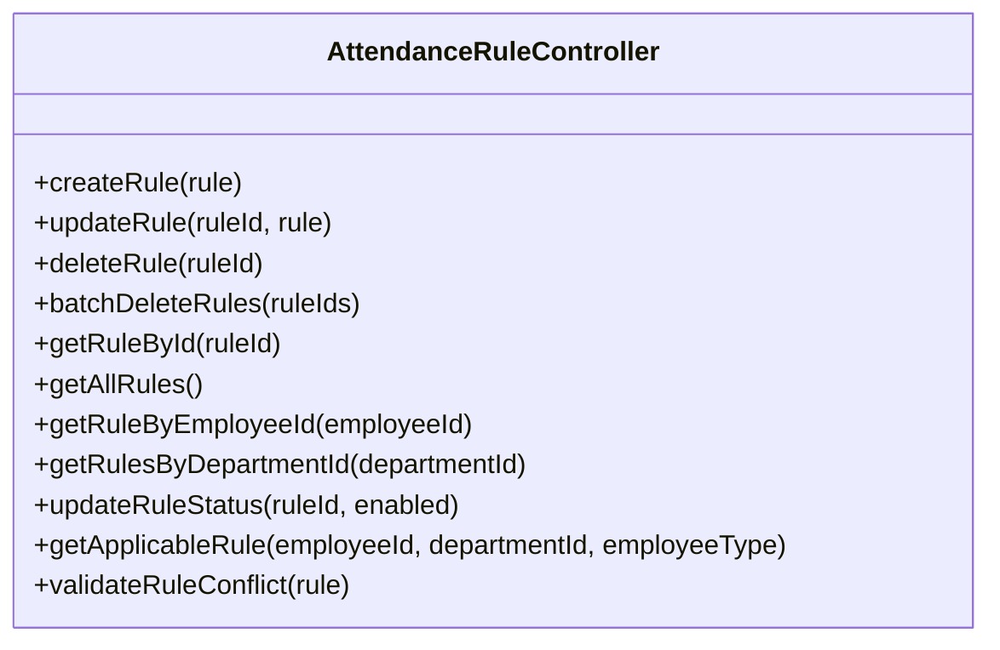
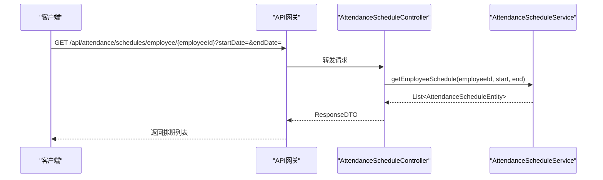

# 考勤系统API

<cite>
**本文引用的文件**
- [AttendanceController.java](file://restful_refactor_backup_20251202_014224/microservices_ioedream-attendance-service_src_main_java_net_lab1024_sa_attendance_controller_AttendanceController.java)
- [AttendanceReportController.java](file://restful_refactor_backup_20251202_014224/microservices_ioedream-attendance-service_src_main_java_net_lab1024_sa_attendance_controller_AttendanceReportController.java)
- [AttendanceRuleController.java](file://restful_refactor_backup_20251202_014224/microservices_ioedream-attendance-service_src_main_java_net_lab1024_sa_attendance_controller_AttendanceRuleController.java)
- [AttendanceScheduleController.java](file://restful_refactor_backup_20251202_014224/microservices_ioedream-attendance-service_src_main_java_net_lab1024_sa_attendance_controller_AttendanceScheduleController.java)
- [考勤模块API接口文档.md](file://documentation/06-模板工具/API文档/考勤模块API接口文档.md)
- [排班管理功能布局文档_完整版.md](file://documentation/03-业务模块/考勤/考勤前端原型布局/排班管理功能布局文档_完整版.md)
- [规则配置功能布局文档_完整版.md](file://documentation/03-业务模块/考勤/考勤前端原型布局/规则配置功能布局文档_完整版.md)
- [异常管理功能布局文档_完整版.md](file://documentation/03-业务模块/考勤/考勤前端原型布局/异常管理功能布局文档_完整版.md)
- [考勤系统数据库ER图设计.md](file://documentation/03-业务模块/考勤/考勤系统数据库ER图设计.md)
- [smart-business-integration.md](file://documentation/technical/smart-business-integration.md)
</cite>

## 目录
1. [简介](#简介)
2. [项目结构](#项目结构)
3. [核心组件](#核心组件)
4. [架构总览](#架构总览)
5. [详细组件分析](#详细组件分析)
6. [依赖分析](#依赖分析)
7. [性能考量](#性能考量)
8. [故障排查指南](#故障排查指南)
9. [结论](#结论)
10. [附录](#附录)

## 简介
本文件面向考勤系统API的使用者与集成方，系统性梳理打卡记录、排班管理、考勤规则配置、异常处理与报表生成等能力，明确接口调用方式、输入输出数据结构，并结合考勤业务布局文档说明排班场景支持。同时给出与门禁、消费等其他系统API的集成点与协作方式，帮助快速落地与扩展。

## 项目结构
考勤服务采用微服务架构，API集中在Attendance模块的多个Controller中，分别覆盖：
- 打卡与统计：/attendance
- 报表与导出：/api/attendance/report
- 规则管理：/api/attendance/rules
- 排班管理：/api/attendance/schedules

图表来源
- [AttendanceController.java](file://restful_refactor_backup_20251202_014224/microservices_ioedream-attendance-service_src_main_java_net_lab1024_sa_attendance_controller_AttendanceController.java#L1-L149)
- [AttendanceReportController.java](file://restful_refactor_backup_20251202_014224/microservices_ioedream-attendance-service_src_main_java_net_lab1024_sa_attendance_controller_AttendanceReportController.java#L1-L178)
- [AttendanceRuleController.java](file://restful_refactor_backup_20251202_014224/microservices_ioedream-attendance-service_src_main_java_net_lab1024_sa_attendance_controller_AttendanceRuleController.java#L1-L375)
- [AttendanceScheduleController.java](file://restful_refactor_backup_20251202_014224/microservices_ioedream-attendance-service_src_main_java_net_lab1024_sa_attendance_controller_AttendanceScheduleController.java#L1-L336)

章节来源
- [AttendanceController.java](file://restful_refactor_backup_20251202_014224/microservices_ioedream-attendance-service_src_main_java_net_lab1024_sa_attendance_controller_AttendanceController.java#L1-L149)
- [AttendanceReportController.java](file://restful_refactor_backup_20251202_014224/microservices_ioedream-attendance-service_src_main_java_net_lab1024_sa_attendance_controller_AttendanceReportController.java#L1-L178)
- [AttendanceRuleController.java](file://restful_refactor_backup_20251202_014224/microservices_ioedream-attendance-service_src_main_java_net_lab1024_sa_attendance_controller_AttendanceRuleController.java#L1-L375)
- [AttendanceScheduleController.java](file://restful_refactor_backup_20251202_014224/microservices_ioedream-attendance-service_src_main_java_net_lab1024_sa_attendance_controller_AttendanceScheduleController.java#L1-L336)

## 核心组件
- 打卡与统计接口：提供分页查询打卡记录、员工打卡、当日考勤状态、统计、异常记录查询、异常处理、批量导入等能力。
- 报表与导出接口：提供员工日报、部门月报生成、数据导出、统计查询等。
- 规则管理接口：提供规则CRUD、启用/禁用、适用规则查询、冲突检测等。
- 排班管理接口：提供排班CRUD、批量操作、按员工/部门/日期查询、排班状态检查等。

章节来源
- [AttendanceController.java](file://restful_refactor_backup_20251202_014224/microservices_ioedream-attendance-service_src_main_java_net_lab1024_sa_attendance_controller_AttendanceController.java#L38-L148)
- [AttendanceReportController.java](file://restful_refactor_backup_20251202_014224/microservices_ioedream-attendance-service_src_main_java_net_lab1024_sa_attendance_controller_AttendanceReportController.java#L48-L177)
- [AttendanceRuleController.java](file://restful_refactor_backup_20251202_014224/microservices_ioedream-attendance-service_src_main_java_net_lab1024_sa_attendance_controller_AttendanceRuleController.java#L60-L375)
- [AttendanceScheduleController.java](file://restful_refactor_backup_20251202_014224/microservices_ioedream-attendance-service_src_main_java_net_lab1024_sa_attendance_controller_AttendanceScheduleController.java#L53-L336)

## 架构总览
下图展示考勤服务与门禁、消费服务的典型交互路径，体现“门禁通行记录作为考勤数据源”“消费权限与门禁权限协同”的集成思路。

图表来源
- [考勤模块API接口文档.md](file://documentation/06-模板工具/API文档/考勤模块API接口文档.md#L1-L1065)
- [smart-business-integration.md](file://documentation/technical/smart-business-integration.md#L660-L808)

章节来源
- [smart-business-integration.md](file://documentation/technical/smart-business-integration.md#L660-L808)

## 详细组件分析

### 打卡与统计接口
- 分页查询考勤记录
  - 方法：GET
  - 路径：/attendance/records/page
  - 参数：current、size、employeeId、startDate、endDate、attendanceType
  - 返回：分页结果对象
- 员工打卡
  - 方法：POST
  - 路径：/attendance/punch
  - 请求体：打卡数据（如员工ID、时间、经纬度、照片等）
  - 返回：操作结果
- 获取今日考勤状态
  - 方法：GET
  - 路径：/attendance/today/{employeeId}
  - 返回：当日状态（如是否已打上班卡、是否已打下班卡等）
- 获取考勤统计
  - 方法：GET
  - 路径：/attendance/statistics
  - 参数：startDate、endDate、departmentId
  - 返回：统计聚合数据
- 分页查询考勤异常记录
  - 方法：GET
  - 路径：/attendance/exceptions/page
  - 参数：current、size、employeeId、exceptionType、startDate、endDate
  - 返回：异常记录分页
- 处理考勤异常
  - 方法：POST
  - 路径：/attendance/exceptions/{exceptionId}/process
  - 请求体：处理数据
  - 返回：处理结果
- 批量导入考勤数据
  - 方法：POST
  - 路径：/attendance/batch-import
  - 请求体：打卡数据数组
  - 返回：导入结果

图表来源
- [AttendanceController.java](file://restful_refactor_backup_20251202_014224/microservices_ioedream-attendance-service_src_main_java_net_lab1024_sa_attendance_controller_AttendanceController.java#L38-L118)

章节来源
- [AttendanceController.java](file://restful_refactor_backup_20251202_014224/microservices_ioedream-attendance-service_src_main_java_net_lab1024_sa_attendance_controller_AttendanceController.java#L38-L148)

### 报表与导出接口
- 生成员工日报
  - 方法：POST
  - 路径：/api/attendance/report/daily
  - 请求体：DailyReportRequest（employeeId、reportDate）
  - 返回：操作结果
- 生成部门月报
  - 方法：POST
  - 路径：/api/attendance/report/monthly
  - 请求体：MonthlyReportRequest（departmentId、yearMonth）
  - 返回：操作结果
- 导出考勤数据
  - 方法：POST
  - 路径：/api/attendance/report/export
  - 请求体：ExportRequest（format、employeeId、startDate、endDate）
  - 返回：导出结果
- 获取考勤统计
  - 方法：GET
  - 路径：/api/attendance/report/statistics/{employeeId}
  - 返回：统计聚合数据

图表来源
- [AttendanceReportController.java](file://restful_refactor_backup_20251202_014224/microservices_ioedream-attendance-service_src_main_java_net_lab1024_sa_attendance_controller_AttendanceReportController.java#L48-L177)

章节来源
- [AttendanceReportController.java](file://restful_refactor_backup_20251202_014224/microservices_ioedream-attendance-service_src_main_java_net_lab1024_sa_attendance_controller_AttendanceReportController.java#L48-L177)

### 规则管理接口
- 创建规则
  - 方法：POST
  - 路径：/api/attendance/rules
  - 请求体：AttendanceRuleEntity
  - 返回：规则ID
- 更新规则
  - 方法：PUT
  - 路径：/api/attendance/rules/{ruleId}
  - 请求体：AttendanceRuleEntity
  - 返回：布尔结果
- 删除规则
  - 方法：DELETE
  - 路径：/api/attendance/rules/{ruleId}
  - 返回：布尔结果
- 批量删除规则
  - 方法：DELETE
  - 路径：/api/attendance/rules/batch
  - 请求体：规则ID列表
  - 返回：删除数量
- 获取规则详情
  - 方法：GET
  - 路径：/api/attendance/rules/{ruleId}
  - 返回：规则详情
- 获取所有有效规则
  - 方法：GET
  - 路径：/api/attendance/rules
  - 返回：规则列表
- 获取员工适用规则
  - 方法：GET
  - 路径：/api/attendance/rules/employee/{employeeId}
  - 返回：规则详情
- 获取部门规则列表
  - 方法：GET
  - 路径：/api/attendance/rules/department/{departmentId}
  - 返回：规则列表
- 更新规则状态
  - 方法：PUT
  - 路径：/api/attendance/rules/{ruleId}/status?enabled=...
  - 返回：布尔结果
- 获取适用规则（考虑优先级）
  - 方法：GET
  - 路径：/api/attendance/rules/applicable
  - 参数：employeeId、departmentId、employeeType
  - 返回：适用规则
- 验证规则冲突
  - 方法：POST
  - 路径：/api/attendance/rules/validate/conflict
  - 请求体：AttendanceRuleEntity
  - 返回：是否冲突

图表来源
- [AttendanceRuleController.java](file://restful_refactor_backup_20251202_014224/microservices_ioedream-attendance-service_src_main_java_net_lab1024_sa_attendance_controller_AttendanceRuleController.java#L60-L375)

章节来源
- [AttendanceRuleController.java](file://restful_refactor_backup_20251202_014224/microservices_ioedream-attendance-service_src_main_java_net_lab1024_sa_attendance_controller_AttendanceRuleController.java#L60-L375)

### 排班管理接口
- 创建排班
  - 方法：POST
  - 路径：/api/attendance/schedules
  - 请求体：AttendanceScheduleEntity
  - 返回：排班ID
- 更新排班
  - 方法：PUT
  - 路径：/api/attendance/schedules/{scheduleId}
  - 请求体：AttendanceScheduleEntity
  - 返回：布尔结果
- 删除排班
  - 方法：DELETE
  - 路径：/api/attendance/schedules/{scheduleId}
  - 返回：布尔结果
- 批量删除排班
  - 方法：DELETE
  - 路径：/api/attendance/schedules/batch
  - 请求体：排班ID列表
  - 返回：删除数量
- 获取员工指定日期范围排班
  - 方法：GET
  - 路径：/api/attendance/schedules/employee/{employeeId}?startDate=...&endDate=...
  - 返回：排班列表
- 获取部门指定日期范围排班
  - 方法：GET
  - 路径：/api/attendance/schedules/department/{departmentId}?startDate=...&endDate=...
  - 返回：排班列表
- 检查排班状态
  - 方法：GET
  - 路径：/api/attendance/schedules/check/{employeeId}?date=...
  - 返回：布尔结果
- 获取员工单日排班
  - 方法：GET
  - 路径：/api/attendance/schedules/employee/{employeeId}/date/{date}
  - 返回：排班详情
- 批量创建排班
  - 方法：POST
  - 路径：/api/attendance/schedules/batch
  - 请求体：排班实体列表
  - 返回：成功数量

图表来源
- [AttendanceScheduleController.java](file://restful_refactor_backup_20251202_014224/microservices_ioedream-attendance-service_src_main_java_net_lab1024_sa_attendance_controller_AttendanceScheduleController.java#L184-L244)

章节来源
- [AttendanceScheduleController.java](file://restful_refactor_backup_20251202_014224/microservices_ioedream-attendance-service_src_main_java_net_lab1024_sa_attendance_controller_AttendanceScheduleController.java#L53-L336)

### 排班场景支持与前端布局
- 前端排班日历组件通过API与后端交互，支持日历视图、拖拽调整、批量操作、冲突检测与解决等。
- 前端API示例（路径与方法）：
  - 日历：GET /attendance/scheduling/calendar、POST /attendance/scheduling/calendar/create、PUT /attendance/scheduling/calendar/{id}、DELETE /attendance/scheduling/calendar/{id}
  - 拖拽：POST /attendance/scheduling/calendar/move、POST /attendance/scheduling/calendar/copy
  - 批量：POST /attendance/scheduling/calendar/batch-create、POST /attendance/scheduling/calendar/batch-update、POST /attendance/scheduling/calendar/batch-delete
  - 智能排班：GET /attendance/scheduling/intelligent/settings、POST /attendance/scheduling/intelligent/auto-start、GET /attendance/scheduling/intelligent/progress/{taskId}、POST /attendance/scheduling/intelligent/stop/{taskId}、POST /attendance/scheduling/intelligent/optimize、GET /attendance/scheduling/intelligent/suggestions

章节来源
- [排班管理功能布局文档_完整版.md](file://documentation/03-业务模块/考勤/考勤前端原型布局/排班管理功能布局文档_完整版.md#L75-L128)

### 考勤规则配置与JSON结构
- 规则表结构与JSON字段（config_json、warning_config、notification_config、applicable_scope等）支持灵活配置与范围控制。
- 规则类型涵盖考勤规则、预警规则、通知规则等，适用于移动端、考勤点、设备联动等场景。

章节来源
- [考勤系统数据库ER图设计.md](file://documentation/03-业务模块/考勤/考勤系统数据库ER图设计.md#L1268-L1284)
- [考勤规则配置.md](file://documentation/03-业务模块/考勤/考勤规则配置.md#L1-L262)

### 异常管理与处理建议
- 异常分析器支持周期、异常类型、部门范围等筛选，提供趋势、分布、模式、原因、改进建议与预测分析。
- 处理建议表格包含建议类型、优先级、内容、预期效果等列，支持应用建议与查看详情。

章节来源
- [异常管理功能布局文档_完整版.md](file://documentation/03-业务模块/考勤/考勤前端原型布局/异常管理功能布局文档_完整版.md#L669-L1011)

## 依赖分析
- 控制器与服务层解耦：各Controller仅负责参数封装、权限校验与返回包装，核心业务委托Service层实现，符合四层架构边界。
- 统一响应格式：ResponseDTO作为统一返回载体，便于前后端契约稳定与错误处理。
- 权限与登录注解：Sa-Token注解用于登录与权限校验，确保接口访问安全。
- 前端与后端API映射：前端通过Axios封装的API模块调用后端接口，路径与方法与后端Controller保持一致。

图表来源
- [排班管理功能布局文档_完整版.md](file://documentation/03-业务模块/考勤/考勤前端原型布局/排班管理功能布局文档_完整版.md#L75-L128)
- [AttendanceController.java](file://restful_refactor_backup_20251202_014224/microservices_ioedream-attendance-service_src_main_java_net_lab1024_sa_attendance_controller_AttendanceController.java#L1-L149)
- [AttendanceReportController.java](file://restful_refactor_backup_20251202_014224/microservices_ioedream-attendance-service_src_main_java_net_lab1024_sa_attendance_controller_AttendanceReportController.java#L1-L178)
- [AttendanceRuleController.java](file://restful_refactor_backup_20251202_014224/microservices_ioedream-attendance-service_src_main_java_net_lab1024_sa_attendance_controller_AttendanceRuleController.java#L1-L375)
- [AttendanceScheduleController.java](file://restful_refactor_backup_20251202_014224/microservices_ioedream-attendance-service_src_main_java_net_lab1024_sa_attendance_controller_AttendanceScheduleController.java#L1-L336)

章节来源
- [排班管理功能布局文档_完整版.md](file://documentation/03-业务模块/考勤/考勤前端原型布局/排班管理功能布局文档_完整版.md#L75-L128)

## 性能考量
- 分页查询：对记录与异常列表均采用分页参数，避免一次性拉取大量数据。
- 批量操作：提供批量创建/更新/删除接口，减少请求次数，提升吞吐。
- 缓存与索引：建议在Service层结合Redis与数据库索引优化高频查询（如按员工/部门/日期范围查询）。
- 异步处理：报表生成与导出可采用异步任务队列，避免阻塞请求线程。

## 故障排查指南
- 参数校验失败：常见于必填字段缺失或格式不正确，返回字段级错误信息，需检查请求体与参数类型。
- 权限不足：接口标注了登录与权限注解，若返回鉴权失败，需确认Token与角色权限。
- 业务异常：服务层抛出的业务异常会被全局异常处理器捕获并统一返回，需关注日志定位具体原因。
- 数据不存在：查询接口返回“不存在”提示时，需核对ID或范围参数是否正确。

章节来源
- [PHASE3_TASK32_EXCEPTION_HANDLING_PLAN.md](file://documentation/archive/reports-2025-12-04/PHASE3_TASK32_EXCEPTION_HANDLING_PLAN.md#L37-L152)

## 结论
本考勤系统API围绕“打卡、排班、规则、异常、报表”五大能力构建，接口清晰、权限明确、返回统一，配合前端排班日历与规则配置界面，可高效支撑日常考勤管理与复杂排班场景。与门禁、消费系统的集成点明确，可通过网关与服务间协作实现数据互通与权限协同。

## 附录

### API一览与调用示例（路径与方法）
- 打卡与统计
  - GET /attendance/records/page
  - POST /attendance/punch
  - GET /attendance/today/{employeeId}
  - GET /attendance/statistics
  - GET /attendance/exceptions/page
  - POST /attendance/exceptions/{exceptionId}/process
  - POST /attendance/batch-import
- 报表与导出
  - POST /api/attendance/report/daily
  - POST /api/attendance/report/monthly
  - POST /api/attendance/report/export
  - GET /api/attendance/report/statistics/{employeeId}
- 规则管理
  - POST /api/attendance/rules
  - PUT /api/attendance/rules/{ruleId}
  - DELETE /api/attendance/rules/{ruleId}
  - DELETE /api/attendance/rules/batch
  - GET /api/attendance/rules/{ruleId}
  - GET /api/attendance/rules
  - GET /api/attendance/rules/employee/{employeeId}
  - GET /api/attendance/rules/department/{departmentId}
  - PUT /api/attendance/rules/{ruleId}/status?enabled=...
  - GET /api/attendance/rules/applicable
  - POST /api/attendance/rules/validate/conflict
- 排班管理
  - POST /api/attendance/schedules
  - PUT /api/attendance/schedules/{scheduleId}
  - DELETE /api/attendance/schedules/{scheduleId}
  - DELETE /api/attendance/schedules/batch
  - GET /api/attendance/schedules/employee/{employeeId}?startDate=&endDate=
  - GET /api/attendance/schedules/department/{departmentId}?startDate=&endDate=
  - GET /api/attendance/schedules/check/{employeeId}?date=...
  - GET /api/attendance/schedules/employee/{employeeId}/date/{date}
  - POST /api/attendance/schedules/batch

章节来源
- [AttendanceController.java](file://restful_refactor_backup_20251202_014224/microservices_ioedream-attendance-service_src_main_java_net_lab1024_sa_attendance_controller_AttendanceController.java#L38-L148)
- [AttendanceReportController.java](file://restful_refactor_backup_20251202_014224/microservices_ioedream-attendance-service_src_main_java_net_lab1024_sa_attendance_controller_AttendanceReportController.java#L48-L177)
- [AttendanceRuleController.java](file://restful_refactor_backup_20251202_014224/microservices_ioedream-attendance-service_src_main_java_net_lab1024_sa_attendance_controller_AttendanceRuleController.java#L60-L375)
- [AttendanceScheduleController.java](file://restful_refactor_backup_20251202_014224/microservices_ioedream-attendance-service_src_main_java_net_lab1024_sa_attendance_controller_AttendanceScheduleController.java#L53-L336)

### 数据模型与复杂结构说明
- 考勤规则（JSON字段）
  - config_json：包含迟到/早退容忍、最小工作时长、加班计算方式、节假日/周末倍数等
  - warning_config：预警类型、连续天数阈值、预警级别等
  - notification_config：通知方式、频率、接收人等
  - applicable_scope：适用范围（部门/岗位/员工）
- 排班计划（实体字段）
  - schedule_date、shift_id、schedule_type、is_temporary、reason、status 等
- 考勤结果（实体字段）
  - clock_in_time、clock_out_time、work_duration、late_minutes、early_minutes、absent_minutes、overtime_minutes、attendance_status、exception_count 等

章节来源
- [考勤系统数据库ER图设计.md](file://documentation/03-业务模块/考勤/考勤系统数据库ER图设计.md#L1268-L1284)
- [考勤系统数据库ER图设计.md](file://documentation/03-业务模块/考勤/考勤系统数据库ER图设计.md#L285-L376)
- [考勤系统数据库ER图设计.md](file://documentation/03-业务模块/考勤/考勤系统数据库ER图设计.md#L468-L596)

### 与门禁、消费系统集成点
- 门禁集成：门禁通行记录作为考勤数据源；门禁授权与考勤权限控制协同。
- 消费集成：消费权限与门禁权限协同，消费场景与门禁事件联动。

章节来源
- [smart-business-integration.md](file://documentation/technical/smart-business-integration.md#L660-L808)