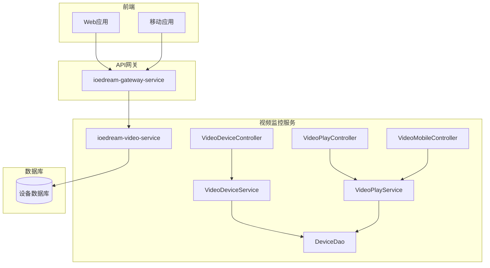
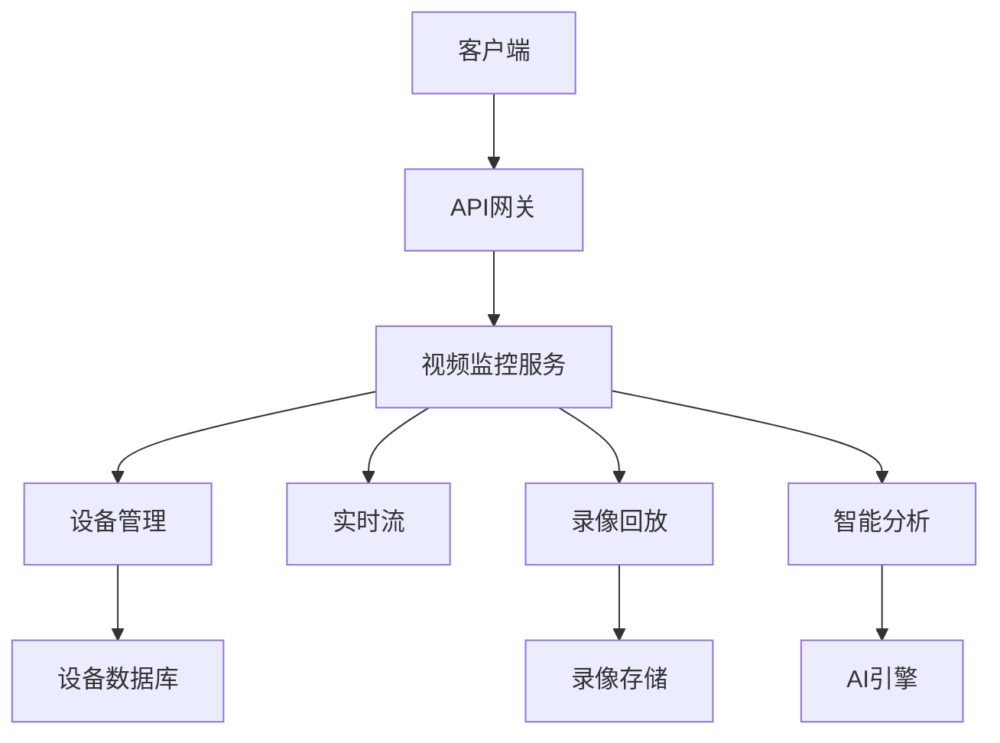
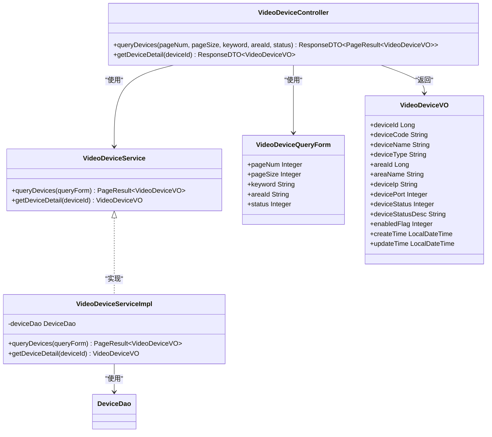
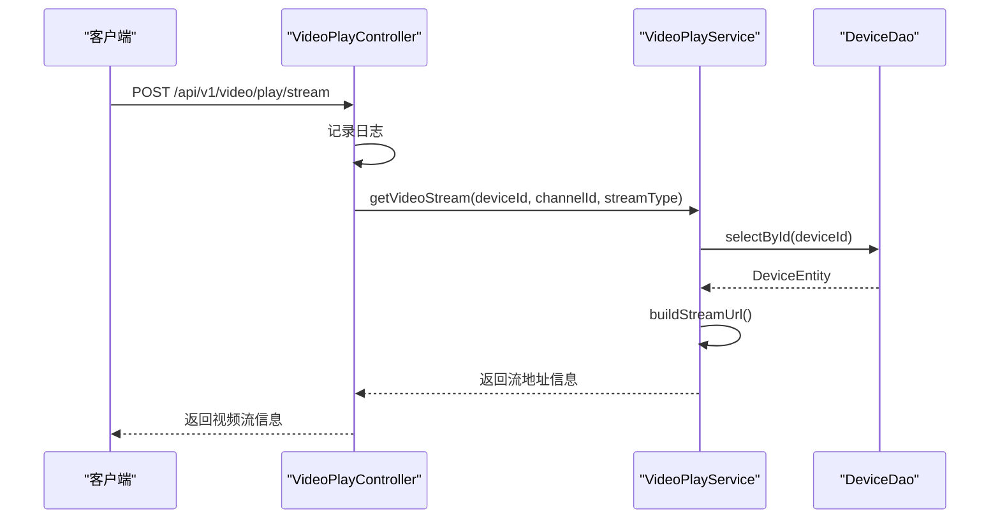
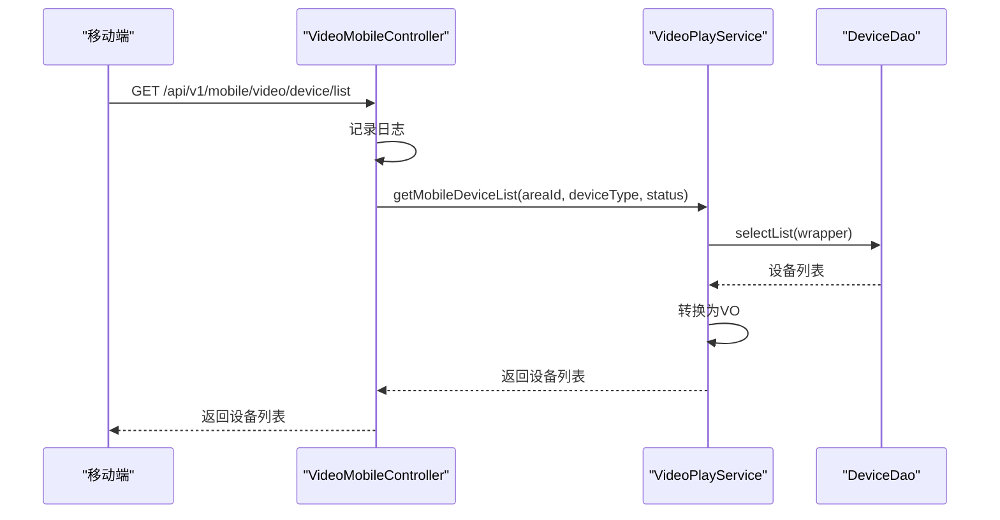
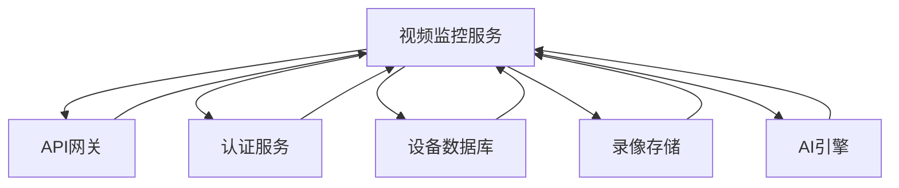

# 视频监控API

<cite>
**本文档引用文件**   
- [VideoDeviceController.java](file://microservices\ioedream-video-service\src\main\java\net\lab1024\sa\video\controller\VideoDeviceController.java)
- [VideoPlayController.java](file://microservices\ioedream-video-service\src\main\java\net\lab1024\sa\video\controller\VideoPlayController.java)
- [VideoMobileController.java](file://microservices\ioedream-video-service\src\main\java\net\lab1024\sa\video\controller\VideoMobileController.java)
- [VideoDeviceService.java](file://microservices\ioedream-video-service\src\main\java\net\lab1024\sa\video\service\VideoDeviceService.java)
- [VideoPlayService.java](file://microservices\ioedream-video-service\src\main\java\net\lab1024\sa\video\service\VideoPlayService.java)
- [VideoDeviceQueryForm.java](file://microservices\ioedream-video-service\src\main\java\net\lab1024\sa\video\domain\form\VideoDeviceQueryForm.java)
- [VideoDeviceVO.java](file://microservices\ioedream-video-service\src\main\java\net\lab1024\sa\video\domain\vo\VideoDeviceVO.java)
- [VideoDeviceServiceImpl.java](file://microservices\ioedream-video-service\src\main\java\net\lab1024\sa\video\service\impl\VideoDeviceServiceImpl.java)
- [VideoPlayServiceImpl.java](file://microservices\ioedream-video-service\src\main\java\net\lab1024\sa\video\service\impl\VideoPlayServiceImpl.java)
- [video-api.js](file://smart-app\src\api\business\video\video-api.js)
- [playback-api.js](file://smart-admin-web-javascript\AI开发文档\视频回放页面功能布局文档_完善版.md)
- [device-api.js](file://smart-admin-web-javascript\AI开发文档\设备列表页面功能布局文档_完善版.md)
</cite>

## 目录
1. [简介](#简介)
2. [项目结构](#项目结构)
3. [核心组件](#核心组件)
4. [架构概述](#架构概述)
5. [详细组件分析](#详细组件分析)
6. [依赖分析](#依赖分析)
7. [性能考虑](#性能考虑)
8. [故障排除指南](#故障排除指南)
9. [结论](#结论)
10. [附录](#附录)（如有必要）

## 简介
本文档为视频监控系统API的参考文档，涵盖视频设备管理、实时预览、录像回放、智能分析告警等接口。详细说明如何通过API获取设备列表、启动/停止实时流、按时间范围检索录像文件。解释视频流地址的生成逻辑和访问令牌的认证方式。提供获取设备RTSP地址、查询某摄像头过去一小时的录像片段等操作的完整示例。

## 项目结构
视频监控系统API主要位于`ioedream-video-service`微服务中，包含控制器、服务、数据传输对象等组件。系统通过RESTful API提供视频设备管理、实时预览、录像回放等功能。



**图表来源**
- [VideoDeviceController.java](file://microservices\ioedream-video-service\src\main\java\net\lab1024\sa\video\controller\VideoDeviceController.java)
- [VideoPlayController.java](file://microservices\ioedream-video-service\src\main\java\net\lab1024\sa\video\controller\VideoPlayController.java)
- [VideoMobileController.java](file://microservices\ioedream-video-service\src\main\java\net\lab1024\sa\video\controller\VideoMobileController.java)

**章节来源**
- [VideoDeviceController.java](file://microservices\ioedream-video-service\src\main\java\net\lab1024\sa\video\controller\VideoDeviceController.java)
- [VideoPlayController.java](file://microservices\ioedream-video-service\src\main\java\net\lab1024\sa\video\controller\VideoPlayController.java)
- [VideoMobileController.java](file://microservices\ioedream-video-service\src\main\java\net\lab1024\sa\video\controller\VideoMobileController.java)

## 核心组件
视频监控系统API的核心组件包括视频设备管理、视频播放控制和移动端接口。这些组件通过RESTful API提供设备查询、实时流播放、录像回放等功能。

**章节来源**
- [VideoDeviceController.java](file://microservices\ioedream-video-service\src\main\java\net\lab1024\sa\video\controller\VideoDeviceController.java)
- [VideoPlayController.java](file://microservices\ioedream-video-service\src\main\java\net\lab1024\sa\video\controller\VideoPlayController.java)
- [VideoMobileController.java](file://microservices\ioedream-video-service\src\main\java\net\lab1024\sa\video\controller\VideoMobileController.java)

## 架构概述
视频监控系统采用微服务架构，通过API网关统一入口，后端服务处理具体业务逻辑。系统支持PC端和移动端访问，提供设备管理、实时预览、录像回放等功能。



**图表来源**
- [VideoDeviceController.java](file://microservices\ioedream-video-service\src\main\java\net\lab1024\sa\video\controller\VideoDeviceController.java)
- [VideoPlayController.java](file://microservices\ioedream-video-service\src\main\java\net\lab1024\sa\video\controller\VideoPlayController.java)

## 详细组件分析

### 视频设备管理组件分析
视频设备管理组件提供设备查询、详情获取等功能。通过`VideoDeviceController`暴露RESTful API，支持分页查询、条件筛选等操作。

#### 对象导向组件：


**图表来源**
- [VideoDeviceController.java](file://microservices\ioedream-video-service\src\main\java\net\lab1024\sa\video\controller\VideoDeviceController.java#L47-L183)
- [VideoDeviceService.java](file://microservices\ioedream-video-service\src\main\java\net\lab1024\sa\video\service\VideoDeviceService.java#L21-L38)
- [VideoDeviceQueryForm.java](file://microservices\ioedream-video-service\src\main\java\net\lab1024\sa\video\domain\form\VideoDeviceQueryForm.java#L20-L58)
- [VideoDeviceVO.java](file://microservices\ioedream-video-service\src\main\java\net\lab1024\sa\video\domain\vo\VideoDeviceVO.java#L21-L98)

**章节来源**
- [VideoDeviceController.java](file://microservices\ioedream-video-service\src\main\java\net\lab1024\sa\video\controller\VideoDeviceController.java#L47-L183)
- [VideoDeviceServiceImpl.java](file://microservices\ioedream-video-service\src\main\java\net\lab1024\sa\video\service\impl\VideoDeviceServiceImpl.java#L37-L189)

### 视频播放控制组件分析
视频播放控制组件提供实时流播放、截图等功能。通过`VideoPlayController`暴露API，支持获取视频流地址、获取截图等操作。

#### API/服务组件：


**图表来源**
- [VideoPlayController.java](file://microservices\ioedream-video-service\src\main\java\net\lab1024\sa\video\controller\VideoPlayController.java#L47-L101)
- [VideoPlayService.java](file://microservices\ioedream-video-service\src\main\java\net\lab1024\sa\video\service\VideoPlayService.java#L22-L53)
- [VideoPlayServiceImpl.java](file://microservices\ioedream-video-service\src\main\java\net\lab1024\sa\video\service\impl\VideoPlayServiceImpl.java#L37-L308)

**章节来源**
- [VideoPlayController.java](file://microservices\ioedream-video-service\src\main\java\net\lab1024\sa\video\controller\VideoPlayController.java#L47-L101)
- [VideoPlayServiceImpl.java](file://microservices\ioedream-video-service\src\main\java\net\lab1024\sa\video\service\impl\VideoPlayServiceImpl.java#L37-L308)

### 移动端视频监控组件分析
移动端视频监控组件提供设备列表、视频流播放等功能。通过`VideoMobileController`暴露API，支持移动端设备查询、实时流播放等操作。

#### API/服务组件：


**图表来源**
- [VideoMobileController.java](file://microservices\ioedream-video-service\src\main\java\net\lab1024\sa\video\controller\VideoMobileController.java#L47-L103)
- [VideoPlayService.java](file://microservices\ioedream-video-service\src\main\java\net\lab1024\sa\video\service\VideoPlayService.java#L22-L53)
- [VideoPlayServiceImpl.java](file://microservices\ioedream-video-service\src\main\java\net\lab1024\sa\video\service\impl\VideoPlayServiceImpl.java#L37-L308)

**章节来源**
- [VideoMobileController.java](file://microservices\ioedream-video-service\src\main\java\net\lab1024\sa\video\controller\VideoMobileController.java#L47-L103)
- [VideoPlayServiceImpl.java](file://microservices\ioedream-video-service\src\main\java\net\lab1024\sa\video\service\impl\VideoPlayServiceImpl.java#L136-L198)

## 依赖分析
视频监控系统依赖于设备数据库、API网关、认证服务等组件。系统通过微服务架构实现模块化，各组件之间通过定义良好的接口进行通信。



**图表来源**
- [VideoDeviceController.java](file://microservices\ioedream-video-service\src\main\java\net\lab1024\sa\video\controller\VideoDeviceController.java)
- [VideoPlayController.java](file://microservices\ioedream-video-service\src\main\java\net\lab1024\sa\video\controller\VideoPlayController.java)
- [VideoMobileController.java](file://microservices\ioedream-video-service\src\main\java\net\lab1024\sa\video\controller\VideoMobileController.java)

**章节来源**
- [VideoDeviceController.java](file://microservices\ioedream-video-service\src\main\java\net\lab1024\sa\video\controller\VideoDeviceController.java)
- [VideoPlayController.java](file://microservices\ioedream-video-service\src\main\java\net\lab1024\sa\video\controller\VideoPlayController.java)
- [VideoMobileController.java](file://microservices\ioedream-video-service\src\main\java\net\lab1024\sa\video\controller\VideoMobileController.java)

## 性能考虑
视频监控系统在设计时考虑了性能优化，包括：
- 使用分页查询避免一次性加载大量数据
- 缓存热点设备数据减少数据库访问
- 优化视频流地址生成逻辑
- 支持多种视频格式和协议
- 实现高效的录像文件检索

## 故障排除指南
### 常见问题及解决方案
1. **无法获取设备列表**
   - 检查认证令牌是否有效
   - 确认用户具有`VIDEO_MANAGER`或`VIDEO_USER`角色
   - 检查网络连接是否正常

2. **视频流无法播放**
   - 验证设备是否在线
   - 检查RTSP地址是否正确
   - 确认网络防火墙是否允许相关端口通信

3. **录像文件检索缓慢**
   - 检查数据库索引是否完整
   - 确认时间范围是否过大
   - 考虑使用更精确的查询条件

**章节来源**
- [VideoDeviceController.java](file://microservices\ioedream-video-service\src\main\java\net\lab1024\sa\video\controller\VideoDeviceController.java)
- [VideoPlayController.java](file://microservices\ioedream-video-service\src\main\java\net\lab1024\sa\video\controller\VideoPlayController.java)
- [VideoMobileController.java](file://microservices\ioedream-video-service\src\main\java\net\lab1024\sa\video\controller\VideoMobileController.java)

## 结论
本文档详细介绍了视频监控系统API的设计和实现，涵盖了设备管理、实时预览、录像回放等核心功能。系统采用微服务架构，通过RESTful API提供稳定可靠的服务。通过合理的权限控制、性能优化和错误处理，确保了系统的安全性和可用性。

## 附录

### API接口列表
| 接口名称 | 请求方法 | 路径 | 描述 | 权限要求 |
|--------|--------|------|------|--------|
| 分页查询设备 | GET | /api/v1/video/device/query | 根据条件分页查询视频设备 | VIDEO_MANAGER |
| 查询设备详情 | GET | /api/v1/video/device/{deviceId} | 根据设备ID查询设备详细信息 | VIDEO_MANAGER |
| 获取视频流地址 | POST | /api/v1/video/play/stream | 获取视频设备的实时流播放地址 | VIDEO_MANAGER或VIDEO_USER |
| 获取视频截图 | GET | /api/v1/video/play/snapshot/{deviceId} | 获取视频设备的实时截图 | VIDEO_MANAGER或VIDEO_USER |
| 获取设备列表(移动端) | GET | /api/v1/mobile/video/device/list | 获取视频设备列表 | VIDEO_USER |
| 获取视频流地址(移动端) | POST | /api/v1/mobile/video/play/stream | 获取视频设备的实时流播放地址 | VIDEO_USER |

### 设备状态码
| 状态码 | 描述 |
|------|------|
| 1 | 在线 |
| 2 | 离线 |
| 3 | 故障 |

### 视频流类型
| 类型 | 描述 |
|------|------|
| MAIN | 主码流 |
| SUB | 子码流 |
| MOBILE | 移动码流 |

### 协议类型
| 协议 | 描述 |
|------|------|
| RTSP | 实时流协议 |
| RTMP | 实时消息协议 |
| HLS | HTTP直播流 |
| WEBRTC | 网页实时通信 |

### 示例代码
#### 获取设备列表
```javascript
// 使用axios获取设备列表
axios.get('/api/v1/video/device/query', {
    params: {
        pageNum: 1,
        pageSize: 20,
        keyword: '摄像头',
        areaId: '4001',
        status: 1
    }
}).then(response => {
    console.log('设备列表:', response.data.data);
}).catch(error => {
    console.error('获取设备列表失败:', error);
});
```

#### 获取视频流地址
```javascript
// 使用axios获取视频流地址
axios.post('/api/v1/video/play/stream', null, {
    params: {
        deviceId: 1001,
        channelId: 1,
        streamType: 'MAIN'
    }
}).then(response => {
    console.log('视频流地址:', response.data.data.streamUrl);
}).catch(error => {
    console.error('获取视频流地址失败:', error);
});
```

#### 查询过去一小时的录像
```javascript
// 使用axios查询过去一小时的录像
const now = new Date();
const oneHourAgo = new Date(now.getTime() - 60 * 60 * 1000);
const params = {
    deviceId: 1001,
    startTime: oneHourAgo.toISOString().slice(0, 19).replace('T', ' '),
    endTime: now.toISOString().slice(0, 19).replace('T', ' ')
};

axios.post('/api/v1/video/playback/search', params)
    .then(response => {
        console.log('录像列表:', response.data.data);
    })
    .catch(error => {
        console.error('查询录像失败:', error);
    });
```